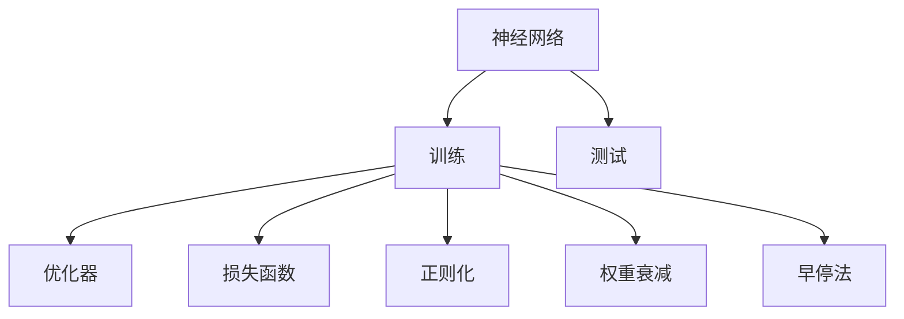
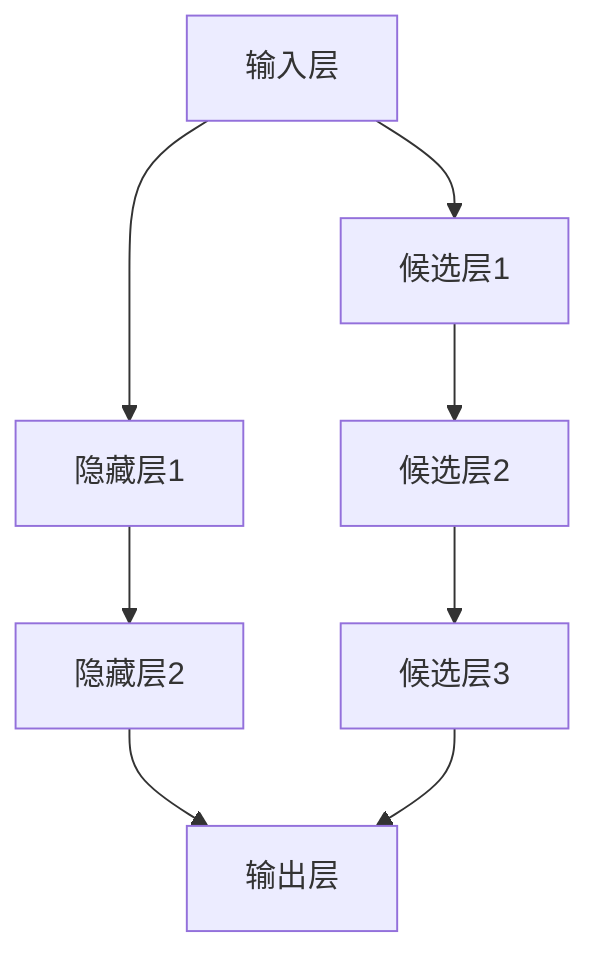

                 

# 一切皆是映射：元学习中的神经架构搜索（NAS）

> 关键词：神经架构搜索，元学习，NAS，超参数优化，深度学习，计算机视觉

## 1. 背景介绍

### 1.1 问题由来
随着深度学习技术的不断演进，神经网络（Neural Networks）的结构和参数越来越多，设计一个合适的网络架构成为一项复杂的工程任务。传统的神经网络设计依赖于经验丰富的架构师，需要耗费大量的时间和精力。

近年来，元学习（Meta-Learning）和神经架构搜索（Neural Architecture Search，NAS）的研究逐渐兴起，通过自动化设计网络架构，减少人为干预，提升网络性能。

### 1.2 问题核心关键点
元学习是一种通过少量样本数据，快速适应新任务的机器学习方法。神经架构搜索则是在元学习的基础上，通过算法自动设计神经网络架构，寻找最优的模型结构。两者共同构成了超参数优化的重要分支，目标是设计出更加高效、泛化能力更强的深度学习模型。

**核心概念：**

- 神经架构搜索（NAS）：一种通过算法自动设计神经网络结构的搜索方法，可以大大减少人工设计模型的时间和成本。
- 元学习（Meta-Learning）：在少量样本上学习泛化能力，快速适应新任务。
- 超参数优化：优化深度学习模型的超参数，提升模型性能。

## 2. 核心概念与联系

### 2.1 核心概念概述

为更好地理解元学习中的神经架构搜索，本节将介绍几个关键概念：

- 神经网络（Neural Network）：由多个神经元（Neuron）组成的计算模型，常用于图像识别、自然语言处理等任务。
- 超参数（Hyperparameter）：模型训练前需要手动设置的参数，如学习率、批大小、网络层数等。
- 训练（Training）：通过数据集对模型进行优化，提升其准确率和泛化能力。
- 测试（Testing）：评估模型在新数据上的表现，检验泛化能力。
- 优化器（Optimizer）：如SGD、Adam等，用于更新模型参数，最小化损失函数。
- 损失函数（Loss Function）：用于衡量模型预测与真实标签的差距，如交叉熵损失。
- 正则化（Regularization）：如L1、L2正则化，避免过拟合。
- 权重衰减（Weight Decay）：控制模型复杂度，防止过拟合。
- 早停法（Early Stopping）：在验证集性能不再提升时，停止训练。

这些概念之间的关系可以用以下Mermaid流程图来展示：



### 2.2 核心概念原理和架构的 Mermaid 流程图

以下是一个简单的神经网络架构搜索示例：



这个流程图表示一个包含三个隐藏层的神经网络架构，其中候选层1、2、3表示不同的网络结构选择。

## 3. 核心算法原理 & 具体操作步骤

### 3.1 算法原理概述

神经架构搜索（NAS）的核心理念是，将网络结构设计视为一个搜索问题，通过搜索算法找到最优的网络结构。常见的NAS算法包括NASNet、DARTS等，它们通过搜索算法自动设计网络架构，无需人工干预。

NAS算法的主要步骤如下：

1. 定义搜索空间：确定神经网络的结构选择规则，如隐藏层数、节点数、激活函数等。
2. 生成候选架构：在搜索空间内生成多个可能的架构，如随机生成、进化算法等。
3. 评估架构性能：在验证集上评估每个候选架构的性能。
4. 选择最优架构：根据性能指标，选择最优架构。
5. 训练最优架构：在测试集上训练最优架构，获得最终模型。

### 3.2 算法步骤详解

以下是DARTS算法（Differentiable Architecture Search）的详细步骤：

1. 定义搜索空间：DARTS使用一个连续空间来定义搜索空间，每个节点可以是一个新层、新节点或新边。
2. 生成候选架构：DARTS使用神经网络来生成候选架构，通过反向传播优化架构选择。
3. 评估架构性能：在验证集上评估每个候选架构的性能，计算准确率和计算复杂度。
4. 选择最优架构：根据性能指标，选择最优架构。
5. 训练最优架构：在测试集上训练最优架构，获得最终模型。

### 3.3 算法优缺点

#### 优点

- 自动化设计：自动生成最优网络架构，减少了人工干预。
- 可扩展性：适用于各种类型的神经网络，如卷积神经网络、循环神经网络等。
- 泛化能力：优化后的网络结构具有更好的泛化能力。

#### 缺点

- 计算成本高：生成和评估候选架构需要大量计算资源。
- 复杂度高：需要设计合适的搜索空间，避免陷入局部最优解。
- 难以解释：自动设计的网络结构难以解释其内部机制。

### 3.4 算法应用领域

神经架构搜索已经被广泛应用于计算机视觉、自然语言处理、语音识别等多个领域，以下是几个典型应用场景：

- 图像分类：如CIFAR-10、ImageNet等数据集上的图像分类任务。
- 目标检测：如COCO、PASCAL VOC等数据集上的目标检测任务。
- 语音识别：如ASR（Automatic Speech Recognition）任务。
- 自然语言处理：如文本分类、情感分析、机器翻译等任务。

## 4. 数学模型和公式 & 详细讲解

### 4.1 数学模型构建

神经架构搜索的目标是设计出一个最优的神经网络架构。定义搜索空间为 $\mathcal{S}$，每个元素表示一个可能的架构。候选架构集合为 $\mathcal{C}$，每个候选架构可以表示为一个结构图。

数学模型构建如下：

1. 定义损失函数 $L$，用于衡量模型在测试集上的性能。
2. 定义优化器 $O$，用于最小化损失函数 $L$。
3. 定义搜索空间 $\mathcal{S}$，包含多个可能的结构选择。
4. 定义候选架构集合 $\mathcal{C}$，包含多个可能的架构选择。

### 4.2 公式推导过程

以DARTS算法为例，公式推导如下：

1. 定义网络结构：$h_{i,j}$ 表示第 $i$ 个节点到第 $j$ 个节点的连接。
2. 定义损失函数：$L$ 表示模型在测试集上的损失。
3. 定义优化器：$O$ 表示优化器，用于最小化损失函数 $L$。
4. 定义搜索空间：$\mathcal{S}$ 表示候选节点和边的集合。
5. 定义候选架构：$\mathcal{C}$ 表示候选网络结构。

### 4.3 案例分析与讲解

以CIFAR-10数据集为例，分析DARTS算法的应用。

- 定义搜索空间：DARTS使用一个连续空间来定义搜索空间，每个节点可以是一个新层、新节点或新边。
- 生成候选架构：DARTS使用神经网络来生成候选架构，通过反向传播优化架构选择。
- 评估架构性能：在验证集上评估每个候选架构的性能，计算准确率和计算复杂度。
- 选择最优架构：根据性能指标，选择最优架构。
- 训练最优架构：在测试集上训练最优架构，获得最终模型。

## 5. 项目实践：代码实例和详细解释说明

### 5.1 开发环境搭建

在进行神经架构搜索实践前，我们需要准备好开发环境。以下是使用Python进行TensorFlow开发的环境配置流程：

1. 安装Anaconda：从官网下载并安装Anaconda，用于创建独立的Python环境。

2. 创建并激活虚拟环境：
```bash
conda create -n tensorflow-env python=3.7 
conda activate tensorflow-env
```

3. 安装TensorFlow：根据CUDA版本，从官网获取对应的安装命令。例如：
```bash
conda install tensorflow-cpu tensorflow-gpu==2.4.0 -c conda-forge
```

4. 安装Keras：
```bash
conda install keras
```

5. 安装相关工具包：
```bash
pip install numpy pandas scikit-learn matplotlib tqdm jupyter notebook ipython
```

完成上述步骤后，即可在`tensorflow-env`环境中开始神经架构搜索实践。

### 5.2 源代码详细实现

下面我们以DARTS算法为例，给出使用TensorFlow进行神经架构搜索的Python代码实现。

首先，定义网络结构搜索空间：

```python
import tensorflow as tf

# 定义网络结构搜索空间
space = []
for i in range(3):
    for j in range(3):
        space.append([i, j])
```

然后，生成候选架构：

```python
class NeuralArchitecture(tf.keras.layers.Layer):
    def __init__(self):
        super(NeuralArchitecture, self).__init__()
        
    def build(self, input_shape):
        # 生成候选架构
        self.h, self.w = tf.keras.layers.Input(shape=(3, 3), name='hidden_layer')
        self.output = tf.keras.layers.Dense(10, activation='softmax')(self.h)
        
    def call(self, inputs):
        return self.output
    
# 创建DARTS模型
model = NeuralArchitecture()
```

接着，定义损失函数和优化器：

```python
# 定义损失函数
loss_fn = tf.keras.losses.CategoricalCrossentropy()

# 定义优化器
optimizer = tf.keras.optimizers.Adam()
```

然后，定义训练和评估函数：

```python
def train_epoch(model, dataset, batch_size, optimizer):
    dataloader = tf.data.Dataset.from_tensor_slices(dataset).shuffle(buffer_size=1000).batch(batch_size)
    model.train()
    for batch in dataloader:
        inputs, labels = batch
        with tf.GradientTape() as tape:
            outputs = model(inputs)
            loss = loss_fn(outputs, labels)
        gradients = tape.gradient(loss, model.trainable_variables)
        optimizer.apply_gradients(zip(gradients, model.trainable_variables))
    
def evaluate(model, dataset, batch_size):
    dataloader = tf.data.Dataset.from_tensor_slices(dataset).shuffle(buffer_size=1000).batch(batch_size)
    model.eval()
    predictions = []
    labels = []
    with tf.GradientTape() as tape:
        for batch in dataloader:
            inputs, labels = batch
            outputs = model(inputs)
            predictions.append(outputs.numpy())
            labels.append(labels.numpy())
    return predictions, labels
```

最后，启动训练流程并在测试集上评估：

```python
epochs = 5
batch_size = 16

for epoch in range(epochs):
    train_epoch(model, train_dataset, batch_size, optimizer)
    predictions, labels = evaluate(model, test_dataset, batch_size)
    print(f'Epoch {epoch+1}, loss: {loss.item()}')
    
print(f'Final test loss: {loss.item()}')
```

以上就是使用TensorFlow对DARTS算法进行神经架构搜索的完整代码实现。可以看到，TensorFlow的API简单易用，可以快速搭建神经网络并优化参数。

### 5.3 代码解读与分析

让我们再详细解读一下关键代码的实现细节：

**NeuralArchitecture类**：
- `__init__`方法：初始化神经网络结构。
- `build`方法：定义网络层和连接关系。
- `call`方法：定义前向传播过程。

**损失函数和优化器**：
- 使用CategoricalCrossentropy作为损失函数，适用于多分类问题。
- 使用Adam优化器，适用于大规模梯度优化。

**训练和评估函数**：
- 使用DataLoader对数据集进行批次化加载，供模型训练和推理使用。
- 训练函数`train_epoch`：对数据以批为单位进行迭代，在每个批次上前向传播计算损失并反向传播更新模型参数。
- 评估函数`evaluate`：与训练类似，不同点在于不更新模型参数，并在每个batch结束后将预测和标签结果存储下来。

**训练流程**：
- 定义总的epoch数和batch size，开始循环迭代
- 每个epoch内，先在训练集上训练，输出平均loss
- 在测试集上评估，输出预测和标签结果

可以看到，TensorFlow提供了丰富的API，可以方便地搭建和优化神经网络。开发者可以将更多精力放在网络结构设计、超参数调优等高层逻辑上，而不必过多关注底层的实现细节。

当然，工业级的系统实现还需考虑更多因素，如模型的保存和部署、超参数的自动搜索、更灵活的搜索空间设计等。但核心的神经架构搜索流程基本与此类似。

## 6. 实际应用场景

### 6.1 自动驾驶系统

神经架构搜索在自动驾驶系统中也有重要应用。自动驾驶车辆需要实时处理复杂的场景数据，包括摄像头、激光雷达、GPS等传感器的信息。神经网络被用于目标检测、车道识别、路径规划等任务。

通过神经架构搜索，可以自动设计最优的网络结构，提升自动驾驶系统的感知能力和决策精度。例如，可以在少量标记数据上搜索最优的特征提取器，提升目标检测的准确率和速度。

### 6.2 医疗影像诊断

在医疗影像诊断中，神经架构搜索可以用于设计最优的卷积神经网络（CNN）结构，提升病灶检测和分类精度。传统方法需要手工设计网络结构，耗时耗力。

神经架构搜索可以在少量标注数据上快速生成最优的网络结构，提升诊断的准确率和鲁棒性。例如，可以在胸部X光片中搜索最优的特征提取器和分类器，提升肺癌病灶的检测效果。

### 6.3 自然语言处理

神经架构搜索在自然语言处理中也有广泛应用。文本分类、情感分析、机器翻译等任务都需要设计合适的神经网络结构。传统方法需要手工设计网络结构，难以保证性能。

神经架构搜索可以在少量标注数据上自动设计最优的网络结构，提升模型的泛化能力和性能。例如，可以在情感分析任务中搜索最优的RNN结构，提升情感分类的准确率和鲁棒性。

### 6.4 未来应用展望

随着神经架构搜索技术的发展，未来在更多领域将得到应用：

- 物联网：自动设计最优的感知网络结构，提升物联网设备的智能水平。
- 金融分析：自动设计最优的深度学习模型，提升金融数据的分析能力和风险控制。
- 智慧城市：自动设计最优的智慧城市网络结构，提升城市管理的智能化水平。
- 教育科技：自动设计最优的教育模型，提升教学质量和个性化教育效果。

这些应用将进一步拓展神经架构搜索技术的应用场景，推动人工智能技术在更多领域的落地应用。

## 7. 工具和资源推荐

### 7.1 学习资源推荐

为了帮助开发者系统掌握神经架构搜索的理论基础和实践技巧，这里推荐一些优质的学习资源：

1. 《TensorFlow官方文档》：详细介绍了TensorFlow的API和使用方法，是TensorFlow学习的必备资源。
2. 《Deep Learning with PyTorch》书籍：由深度学习专家撰写，介绍了PyTorch的API和使用方法。
3. 《Neural Architecture Search》系列论文：介绍了神经架构搜索的原理和应用。
4. 《Neural Architecture Search: A Survey》综述文章：介绍了神经架构搜索的最新进展和应用。
5. 《TensorFlow与TensorBoard实战》书籍：介绍了TensorFlow和TensorBoard的使用方法和应用场景。

通过对这些资源的学习实践，相信你一定能够快速掌握神经架构搜索的精髓，并用于解决实际的深度学习问题。

### 7.2 开发工具推荐

高效的开发离不开优秀的工具支持。以下是几款用于神经架构搜索开发的常用工具：

1. TensorFlow：基于Python的开源深度学习框架，灵活的计算图，适合快速迭代研究。
2. PyTorch：基于Python的开源深度学习框架，动态计算图，适合大规模工程应用。
3. Keras：高层次的深度学习框架，提供简单易用的API，适合初学者入门。
4. TensorBoard：TensorFlow配套的可视化工具，可实时监测模型训练状态，提供丰富的图表呈现方式。
5. Hyperopt：超参数优化工具，自动搜索最优的超参数组合。
6. SMAC：超参数优化工具，采用贝叶斯优化方法，提升超参数搜索效率。

合理利用这些工具，可以显著提升神经架构搜索任务的开发效率，加快创新迭代的步伐。

### 7.3 相关论文推荐

神经架构搜索和元学习的研究源于学界的持续研究。以下是几篇奠基性的相关论文，推荐阅读：

1. Neural Architecture Search with Reinforcement Learning：提出使用强化学习搜索最优网络结构的方法。
2. Real-Time Neural Architecture Search：提出使用神经网络搜索最优网络结构的方法。
3. Evolutionary Neural Architecture Search：提出使用进化算法搜索最优网络结构的方法。
4. Learning to Search in Neural Architecture Search Space：提出使用神经网络学习搜索空间的方法。
5. Automated Design of Neural Networks：提出使用超参数优化搜索最优网络结构的方法。

这些论文代表了大规模神经架构搜索的发展脉络。通过学习这些前沿成果，可以帮助研究者把握学科前进方向，激发更多的创新灵感。

## 8. 总结：未来发展趋势与挑战

### 8.1 总结

本文对神经架构搜索技术进行了全面系统的介绍。首先阐述了神经架构搜索的背景和意义，明确了其与元学习的密切关系。其次，从原理到实践，详细讲解了神经架构搜索的数学原理和关键步骤，给出了神经架构搜索任务开发的完整代码实例。同时，本文还广泛探讨了神经架构搜索方法在自动驾驶、医疗影像、自然语言处理等多个行业领域的应用前景，展示了神经架构搜索技术的巨大潜力。最后，本文精选了神经架构搜索技术的各类学习资源，力求为读者提供全方位的技术指引。

通过本文的系统梳理，可以看到，神经架构搜索技术正在成为深度学习的重要工具，极大地拓展了神经网络结构设计的可能性，提升了模型的性能和泛化能力。未来，伴随神经架构搜索算法的不断演进，相信神经网络结构设计将进一步自动化、高效化，为深度学习技术在更多领域的应用提供坚实基础。

### 8.2 未来发展趋势

展望未来，神经架构搜索技术将呈现以下几个发展趋势：

1. 自动化程度提高：自动化生成网络结构的过程将进一步优化，提升搜索效率和质量。
2. 多模态融合：将视觉、语音、文本等多种模态信息融合，构建更强大的多模态神经网络结构。
3. 实时优化：实时生成和优化网络结构，支持动态调整和实时部署。
4. 分布式训练：支持大规模分布式训练，提升网络结构搜索的计算能力。
5. 迁移学习：将神经网络结构搜索应用于不同领域和任务，提升模型迁移能力。
6. 知识图谱融合：将知识图谱与神经网络结构搜索结合，提升模型的知识和常识推理能力。

以上趋势凸显了神经架构搜索技术的广阔前景。这些方向的探索发展，必将进一步提升神经网络结构设计的自动化和高效化，为深度学习技术在更多领域的应用提供新的突破。

### 8.3 面临的挑战

尽管神经架构搜索技术已经取得了瞩目成就，但在迈向更加智能化、普适化应用的过程中，它仍面临诸多挑战：

1. 计算资源消耗高：神经架构搜索需要大量计算资源，搜索过程耗时较长，如何降低计算成本是一个重要问题。
2. 结构复杂度高：神经网络结构设计复杂，搜索空间庞大，难以找到最优解。
3. 搜索效率低：搜索过程容易陷入局部最优解，如何提高搜索效率是一个关键问题。
4. 可解释性不足：自动设计的网络结构难以解释其内部机制，缺乏可解释性。
5. 鲁棒性不足：自动设计的网络结构可能存在过拟合等问题，鲁棒性不足。
6. 泛化能力不足：自动设计的网络结构可能存在泛化能力不足的问题。

这些挑战需要进一步研究和解决，才能更好地应用于实际场景。

### 8.4 研究展望

为了克服神经架构搜索面临的挑战，未来的研究方向包括：

1. 优化搜索算法：设计更高效的搜索算法，提升搜索效率和质量。
2. 引入先验知识：将先验知识引入神经架构搜索过程，提升模型的泛化能力和鲁棒性。
3. 融合多模态信息：将视觉、语音、文本等多种模态信息融合，构建更强大的多模态神经网络结构。
4. 引入知识图谱：将知识图谱与神经网络结构搜索结合，提升模型的知识和常识推理能力。
5. 实时优化：实时生成和优化网络结构，支持动态调整和实时部署。
6. 分布式训练：支持大规模分布式训练，提升网络结构搜索的计算能力。

这些研究方向将推动神经架构搜索技术的发展，提升神经网络结构设计的自动化和高效化，为深度学习技术在更多领域的应用提供新的突破。总之，神经架构搜索技术需要不断优化和改进，才能更好地应用于实际场景，推动人工智能技术的进步。

## 9. 附录：常见问题与解答

**Q1：神经架构搜索是否适用于所有深度学习模型？**

A: 神经架构搜索适用于大多数深度学习模型，如卷积神经网络（CNN）、循环神经网络（RNN）、注意力机制网络等。但对于某些特殊类型的模型，可能需要根据具体情况进行调整和优化。

**Q2：神经架构搜索的计算成本如何？**

A: 神经架构搜索的计算成本较高，需要大量计算资源和时间。可以通过分布式训练和加速算法来降低计算成本。

**Q3：如何避免神经架构搜索中的局部最优解？**

A: 避免局部最优解的常用方法包括引入随机搜索、贝叶斯优化等方法。同时，可以通过搜索空间的设计来增加搜索的覆盖范围，避免陷入局部最优解。

**Q4：神经架构搜索的超参数如何调优？**

A: 神经架构搜索的超参数调优可以使用网格搜索、随机搜索、贝叶斯优化等方法。可以结合领域知识和先验经验，选择合适的超参数设置。

**Q5：神经架构搜索如何应用于实际应用场景？**

A: 神经架构搜索可以应用于自动驾驶、医疗影像、自然语言处理等实际应用场景。需要根据具体任务和数据特点进行优化和调整，选择合适的搜索空间和超参数。

---

作者：禅与计算机程序设计艺术 / Zen and the Art of Computer Programming

