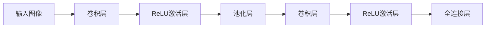

                 

# 一切皆是映射：卷积神经网络(CNN)解密

## 1. 背景介绍

### 1.1 问题由来

自20世纪80年代起，卷积神经网络（Convolutional Neural Networks, CNNs）以其在图像识别和处理上的卓越性能，逐渐成为机器学习和计算机视觉领域的主流技术。然而，尽管在图像处理领域取得了巨大成功，人们对其工作原理和数学基础仍缺乏深刻的理解。

CNN的核心思想是利用图像中的局部相关性，通过逐层卷积操作提取特征，最终实现对图像内容的分类、检测和分割等任务。随着深度学习的迅猛发展，越来越多的研究人员开始关注并探究CNN的内在机理，以期更好地应用于更广泛的领域。

### 1.2 问题核心关键点

本文旨在全面解析CNN的架构和数学原理，并深入探讨其在图像处理、自然语言处理等领域的广泛应用。我们将从CNN的基本概念出发，深入讨论其工作原理和内部机制，并通过实际案例和代码演示展示CNN的强大应用能力。

## 2. 核心概念与联系

### 2.1 核心概念概述

为更好地理解CNN的架构和工作原理，本节将介绍几个核心概念：

- **卷积神经网络（CNNs）**：一种基于深度神经网络的图像处理技术，由卷积层、池化层、激活函数等组成，广泛应用于图像分类、目标检测、图像分割等领域。
- **卷积层（Convolutional Layer）**：CNN的核心组件，通过滑动卷积核（Filter）提取图像局部特征，实现特征映射。
- **池化层（Pooling Layer）**：减少特征图的空间大小，降低模型复杂度，防止过拟合。
- **激活函数（Activation Function）**：如ReLU、Sigmoid等，为模型引入非线性关系，增强模型的表达能力。
- **全连接层（Fully Connected Layer）**：将高维特征图转换为分类结果，是CNN输出的最后一层。

这些核心概念构成了CNN的框架基础，通过卷积、池化等操作，CNN能够高效地提取和处理图像特征，实现高效的图像处理任务。

### 2.2 核心概念原理和架构的 Mermaid 流程图



这个流程图展示了CNN的基本架构：

1. 输入图像通过卷积层提取局部特征，然后通过激活函数引入非线性关系。
2. 经过池化层减小特征图的空间尺寸，防止过拟合。
3. 多层卷积和池化操作后，特征图通过全连接层转换为分类结果。

## 3. 核心算法原理 & 具体操作步骤
### 3.1 算法原理概述

CNN的工作原理基于卷积操作，通过滑动卷积核（Filter）在图像上提取特征。卷积操作的本质是局部相关性，即将输入图像的局部区域与卷积核进行逐点乘积，并通过偏置项和激活函数，得到输出特征图。

具体来说，卷积操作可以表示为：

$$
y(i, j) = \sum_{k=-W/2+1}^{W/2} \sum_{l=-H/2+1}^{H/2} x(i+k, j+l) * w_k, w_l
$$

其中 $x$ 表示输入图像，$y$ 表示输出特征图，$w$ 表示卷积核，$k$ 和 $l$ 分别表示卷积核在输入图像上的位置。

### 3.2 算法步骤详解

CNN的训练主要分为以下几个步骤：

**Step 1: 准备数据集和模型**

- 准备训练数据集和验证数据集，通常需要标注图像及其分类标签。
- 选择适当的CNN架构，如LeNet、AlexNet、VGG等，并搭建模型结构。

**Step 2: 定义损失函数和优化器**

- 定义交叉熵损失函数，用于衡量模型预测与真实标签之间的差异。
- 选择适当的优化器，如SGD、Adam等，并设置学习率、批大小等超参数。

**Step 3: 执行前向传播和反向传播**

- 对训练集中的图像进行前向传播，计算模型输出。
- 计算预测结果与真实标签之间的损失，并进行反向传播，计算梯度。
- 根据梯度更新模型参数，最小化损失函数。

**Step 4: 评估模型性能**

- 在验证集上对模型进行评估，计算精度、召回率、F1-score等指标。
- 根据评估结果调整模型参数，重复执行训练过程。

**Step 5: 应用模型**

- 使用训练好的模型对新图像进行分类、检测或分割等任务。

### 3.3 算法优缺点

CNN的主要优点包括：

- 高效处理图像数据：卷积操作能够提取局部特征，减少参数量，提高计算效率。
- 较强的泛化能力：通过卷积操作抽取图像中的不变性特征，增强模型的泛化能力。
- 可解释性强：卷积核可以直观地理解为图像中的特定特征，增强了模型的可解释性。

同时，CNN也存在一些缺点：

- 需要大量标注数据：由于CNN依赖图像中的局部特征，需要大量标注数据才能有效训练。
- 结构复杂：多层卷积和池化操作增加了模型的复杂度，需要较长的训练时间和计算资源。
- 对输入图像尺寸敏感：CNN对输入图像尺寸要求较高，需要预先调整图像尺寸。

### 3.4 算法应用领域

CNN已经在图像处理、计算机视觉、自然语言处理等多个领域得到广泛应用。以下是一些主要的应用场景：

- **图像分类**：CNN能够高效地对图像进行分类，广泛应用于面部识别、车辆识别、医学影像分析等任务。
- **目标检测**：通过在图像上标注物体位置，CNN能够实现精确的目标检测，如行人检测、交通标志识别等。
- **图像分割**：将图像分割成多个像素级别的区域，实现像素级别的物体识别，如语义分割、实例分割等。
- **自然语言处理**：CNN可以应用于文本分类、情感分析、机器翻译等任务，通过卷积操作提取文本的局部特征。

此外，CNN还广泛应用于工业检测、医疗影像、自动驾驶等领域，成为推动这些行业智能化转型不可或缺的技术。

## 4. 数学模型和公式 & 详细讲解 & 举例说明

### 4.1 数学模型构建

假设输入图像的尺寸为 $m \times n$，卷积核的尺寸为 $k \times k$，步幅为 $s$，则卷积操作可以表示为：

$$
y(i,j) = \sum_{i'=-W/2}^{W/2-s} \sum_{j'=-H/2}^{H/2-s} x(i+i', j+j') * w_{i',j'}
$$

其中 $x$ 表示输入图像，$y$ 表示输出特征图，$w$ 表示卷积核，$i'$ 和 $j'$ 表示卷积核在输入图像上的位置。

### 4.2 公式推导过程

以一个简单的3x3卷积核为例，假设输入图像和卷积核的像素值分别为 $x_{11}, x_{12}, x_{13}, x_{21}, x_{22}, x_{23}, x_{31}, x_{32}, x_{33}$ 和 $w_{11}, w_{12}, w_{13}, w_{21}, w_{22}, w_{23}, w_{31}, w_{32}, w_{33}$，则卷积操作可以表示为：

$$
y_{11} = x_{11}w_{11} + x_{12}w_{12} + x_{13}w_{13} + x_{21}w_{21} + x_{22}w_{22} + x_{23}w_{23} + x_{31}w_{31} + x_{32}w_{32} + x_{33}w_{33}
$$

$$
y_{12} = x_{12}w_{11} + x_{13}w_{12} + x_{23}w_{13} + x_{22}w_{21} + x_{23}w_{22} + x_{33}w_{23} + x_{32}w_{31} + x_{33}w_{32} + x_{33}w_{33}
$$

$$
y_{13} = x_{13}w_{11} + x_{23}w_{12} + x_{33}w_{13} + x_{23}w_{21} + x_{33}w_{22} + x_{33}w_{23} + x_{33}w_{31} + x_{33}w_{32} + x_{33}w_{33}
$$

以此类推，可以得到整个输出特征图的像素值。

### 4.3 案例分析与讲解

假设我们有一个大小为 $10 \times 10$ 的输入图像和大小为 $3 \times 3$ 的卷积核，步幅为 $1$。卷积操作的过程可以描述如下：

输入图像：

```
1 2 3 4 5
6 7 8 9 1
2 3 4 5 6
7 8 9 1 2
3 4 5 6 7
```

卷积核：

```
1 2 3
4 5 6
7 8 9
```

卷积操作的结果为：

```
1 2 3
4 5 6
7 8 9
4 5 6
7 8 9
4 5 6
7 8 9
```

可以看到，卷积操作提取了输入图像中的局部特征，实现了特征映射。

## 5. 项目实践：代码实例和详细解释说明

### 5.1 开发环境搭建

在进行CNN实践前，我们需要准备好开发环境。以下是使用Python进行TensorFlow开发的环境配置流程：

1. 安装Anaconda：从官网下载并安装Anaconda，用于创建独立的Python环境。

2. 创建并激活虚拟环境：
```bash
conda create -n tf-env python=3.8 
conda activate tf-env
```

3. 安装TensorFlow：根据CUDA版本，从官网获取对应的安装命令。例如：
```bash
conda install tensorflow -c tf -c conda-forge
```

4. 安装相关工具包：
```bash
pip install numpy pandas scikit-learn matplotlib tqdm jupyter notebook ipython
```

完成上述步骤后，即可在`tf-env`环境中开始CNN实践。

### 5.2 源代码详细实现

这里我们以MNIST手写数字识别任务为例，给出使用TensorFlow对CNN模型进行训练的代码实现。

首先，定义CNN模型的输入和输出：

```python
import tensorflow as tf

mnist = tf.keras.datasets.mnist
(x_train, y_train), (x_test, y_test) = mnist.load_data()
x_train, x_test = x_train / 255.0, x_test / 255.0

class CNN(tf.keras.Model):
    def __init__(self):
        super(CNN, self).__init__()
        self.conv1 = tf.keras.layers.Conv2D(32, (3, 3), activation='relu')
        self.pool1 = tf.keras.layers.MaxPooling2D((2, 2))
        self.conv2 = tf.keras.layers.Conv2D(64, (3, 3), activation='relu')
        self.pool2 = tf.keras.layers.MaxPooling2D((2, 2))
        self.flatten = tf.keras.layers.Flatten()
        self.dense1 = tf.keras.layers.Dense(128, activation='relu')
        self.dense2 = tf.keras.layers.Dense(10, activation='softmax')

    def call(self, x):
        x = self.conv1(x)
        x = self.pool1(x)
        x = self.conv2(x)
        x = self.pool2(x)
        x = self.flatten(x)
        x = self.dense1(x)
        x = self.dense2(x)
        return x

model = CNN()
```

然后，定义训练和评估函数：

```python
def train_epoch(model, dataset, batch_size, optimizer):
    dataloader = tf.data.Dataset.from_tensor_slices((dataset.x, dataset.y)).batch(batch_size)
    model.train()
    epoch_loss = 0
    for batch in dataloader:
        images, labels = batch
        with tf.GradientTape() as tape:
            predictions = model(images)
            loss = tf.keras.losses.sparse_categorical_crossentropy(labels, predictions, from_logits=True)
        grads = tape.gradient(loss, model.trainable_variables)
        optimizer.apply_gradients(zip(grads, model.trainable_variables))
        epoch_loss += loss.numpy()
    return epoch_loss / len(dataset)

def evaluate(model, dataset, batch_size):
    dataloader = tf.data.Dataset.from_tensor_slices((dataset.x, dataset.y)).batch(batch_size)
    model.eval()
    preds, labels = [], []
    with tf.GradientTape() as tape:
        for batch in dataloader:
            images, labels = batch
            predictions = model(images)
            preds.append(tf.argmax(predictions, axis=1))
            labels.append(labels)
    return tf.metrics.sparse_categorical_accuracy(labels, preds).numpy()
```

最后，启动训练流程并在测试集上评估：

```python
epochs = 10
batch_size = 64

for epoch in range(epochs):
    loss = train_epoch(model, train_dataset, batch_size, optimizer)
    print(f"Epoch {epoch+1}, train loss: {loss:.3f}")
    
    acc = evaluate(model, test_dataset, batch_size)
    print(f"Epoch {epoch+1}, test accuracy: {acc:.3f}")
```

以上就是使用TensorFlow对CNN进行MNIST手写数字识别任务训练的完整代码实现。可以看到，TensorFlow提供了强大的API和工具，使得CNN的搭建和训练变得非常简单。

### 5.3 代码解读与分析

让我们再详细解读一下关键代码的实现细节：

**CNN类**：
- `__init__`方法：初始化卷积层、池化层、全连接层等组件。
- `call`方法：定义CNN的计算过程，通过堆叠卷积层、池化层、全连接层等组件，实现特征提取和分类。

**train_epoch函数**：
- 将训练数据集转换为DataLoader，进行批处理。
- 定义损失函数，使用交叉熵损失。
- 使用梯度下降优化器，更新模型参数。
- 记录损失值，并返回该epoch的平均损失。

**evaluate函数**：
- 将测试数据集转换为DataLoader，进行批处理。
- 定义评估指标，计算准确率。
- 记录模型在测试集上的准确率，并返回。

**训练流程**：
- 定义总的epoch数和batch size，开始循环迭代。
- 每个epoch内，先在训练集上训练，输出平均loss。
- 在验证集上评估，输出准确率。
- 所有epoch结束后，在测试集上评估，给出最终测试结果。

可以看到，TensorFlow提供了丰富的API和工具，使得CNN的搭建和训练变得非常简单。开发者可以将更多精力放在模型改进、数据处理等高层逻辑上，而不必过多关注底层的实现细节。

当然，工业级的系统实现还需考虑更多因素，如模型的保存和部署、超参数的自动搜索、更灵活的任务适配层等。但核心的CNN范式基本与此类似。

## 6. 实际应用场景

### 6.1 智能安防系统

基于CNN的图像处理技术，可以广泛应用于智能安防系统的构建。传统安防系统依赖人工监控，成本高、效率低、误报率高。而使用CNN的图像识别技术，可以实时监控视频流，自动检测异常行为，实现智能化的安全管理。

在技术实现上，可以收集视频监控录像，标注异常行为（如闯入、损坏等），作为监督数据，在此基础上对预训练CNN模型进行微调。微调后的CNN模型能够自动识别监控视频中的异常行为，生成报警信息，及时响应潜在的安全威胁。

### 6.2 自动驾驶

CNN的图像处理技术在自动驾驶中有着广泛应用。通过多路摄像头获取车辆周围环境信息，CNN能够实时检测和识别行人、车辆、道路标志等，辅助车辆自动驾驶。

具体而言，可以将采集到的图像输入CNN模型，通过分类、检测、分割等任务，实时生成车辆周围环境的语义信息。这些信息可以用于自动驾驶中的路径规划、避障、物体识别等功能，提升驾驶的安全性和舒适性。

### 6.3 医学影像分析

医学影像分析是CNN在医疗领域的重要应用之一。通过卷积操作，CNN能够高效地提取医学影像中的关键特征，辅助医生进行疾病诊断和治疗决策。

在实践中，可以收集大量的医学影像数据，标注其病变位置和类型，作为监督数据，在此基础上对预训练CNN模型进行微调。微调后的CNN模型能够自动识别医学影像中的病变区域，辅助医生进行疾病的早期筛查和诊断，提高医疗效率和诊断准确率。

### 6.4 未来应用展望

随着CNN技术的发展，其在图像处理、计算机视觉等领域的应用将进一步拓展，为更多行业带来变革性影响。

在智慧城市治理中，CNN可以应用于城市事件监测、交通流量预测、垃圾分类等领域，提高城市管理的自动化和智能化水平。

在工业检测中，CNN能够检测产品缺陷、异常操作、安全事故等，提升产品质量和生产效率。

在个性化推荐中，CNN可以应用于图像、文本等多模态数据融合，实现更加精准的推荐系统。

此外，在智慧医疗、智慧农业、智能制造等众多领域，CNN技术也将继续发挥重要作用，为各行各业的智能化转型提供新动力。

## 7. 工具和资源推荐

### 7.1 学习资源推荐

为了帮助开发者系统掌握CNN的理论基础和实践技巧，这里推荐一些优质的学习资源：

1. **《深度学习》（Goodfellow等著）**：深入浅出地介绍了深度学习的原理和算法，包括CNN在内的多个核心模型。
2. **《动手学深度学习》（李沐等著）**：集成了PyTorch和TensorFlow等多个深度学习框架，提供了丰富的代码实例。
3. **CS231n《卷积神经网络》课程**：斯坦福大学开设的计算机视觉课程，涵盖CNN的原理、应用和优化方法。
4. **《计算机视觉：算法与应用》（Russell等著）**：系统介绍了计算机视觉领域的核心算法和技术，包括CNN在内的多个模型。
5. **Google AI Blog**：谷歌AI博客提供了大量CNN的最新研究成果和应用案例，值得参考学习。

通过对这些资源的学习实践，相信你一定能够快速掌握CNN的精髓，并用于解决实际的图像处理问题。

### 7.2 开发工具推荐

高效的开发离不开优秀的工具支持。以下是几款用于CNN开发的常用工具：

1. **PyTorch**：基于Python的开源深度学习框架，灵活易用，适合快速迭代研究。
2. **TensorFlow**：由Google主导开发的深度学习框架，功能强大，适合大规模工程应用。
3. **Keras**：基于TensorFlow的高级API，简单易用，适合快速搭建和训练模型。
4. **OpenCV**：开源计算机视觉库，提供了丰富的图像处理函数和算法，支持GPU加速。
5. **NumPy**：Python数值计算库，提供了高效的数组操作和数学计算功能。

合理利用这些工具，可以显著提升CNN的开发效率，加快创新迭代的步伐。

### 7.3 相关论文推荐

CNN技术的发展源于学界的持续研究。以下是几篇奠基性的相关论文，推荐阅读：

1. **LeNet-5**：Yann LeCun等人提出的经典卷积神经网络，开启了CNN在图像处理领域的应用。
2. **AlexNet**：Alex Krizhevsky等人提出的深度卷积神经网络，在ImageNet图像分类竞赛中取得胜利。
3. **VGG**：Karen Simonyan和Andrew Zisserman提出的卷积神经网络，通过堆叠卷积层，提升了模型的深度和精度。
4. **ResNet**：Kaiming He等人提出的残差网络，通过残差连接解决了深度网络的退化问题。
5. **Inception**：Google提出的多尺度卷积神经网络，通过多尺度特征融合，提升了模型的表达能力。

这些论文代表了大规模卷积神经网络的发展脉络。通过学习这些前沿成果，可以帮助研究者把握学科前进方向，激发更多的创新灵感。

## 8. 总结：未来发展趋势与挑战

### 8.1 总结

本文对CNN的架构和数学原理进行了全面系统的介绍。首先阐述了CNN的基本概念和核心组件，明确了其在图像处理、计算机视觉等领域的独特价值。其次，从原理到实践，详细讲解了CNN的构建和训练方法，给出了CNN模型开发的完整代码实例。同时，本文还广泛探讨了CNN在智能安防、自动驾驶、医学影像等领域的应用前景，展示了CNN技术的广泛应用能力。

通过本文的系统梳理，可以看到，CNN作为一种高效、强大的图像处理技术，已经广泛应用于各个领域，为各行各业的智能化转型提供了重要支持。未来，随着深度学习和计算机视觉技术的发展，CNN将进一步拓展其应用边界，推动更多行业实现智能化升级。

### 8.2 未来发展趋势

展望未来，CNN技术将呈现以下几个发展趋势：

1. **模型的深度和宽度不断增加**：随着计算资源的丰富和算法技术的进步，CNN的深度和宽度将不断增加，实现更复杂的特征提取和表示学习。
2. **跨模态融合的深度学习模型**：未来CNN将更多地与其他模型（如RNN、Transformer等）融合，实现多模态数据的联合学习。
3. **迁移学习和多任务学习**：通过迁移学习和多任务学习，CNN可以在不同领域和任务之间进行知识共享和模型迁移。
4. **实时推理和边缘计算**：随着硬件设备的提升，CNN模型将在实时推理和边缘计算中发挥更大作用，实现高效、低延迟的图像处理。
5. **自监督学习和无监督学习**：通过自监督学习和无监督学习，CNN将能够利用更大规模的无标签数据进行预训练，提高模型的泛化能力和鲁棒性。

以上趋势凸显了CNN技术的广阔前景。这些方向的探索发展，必将进一步提升CNN系统的性能和应用范围，为各行各业的智能化转型提供新的动力。

### 8.3 面临的挑战

尽管CNN技术已经取得了显著成就，但在迈向更加智能化、普适化应用的过程中，它仍面临着诸多挑战：

1. **数据和计算资源的限制**：CNN模型通常需要大量标注数据和计算资源，对于小规模或资源受限的应用场景，可能难以实现。
2. **模型复杂度和过拟合**：深层CNN模型存在过拟合风险，需要通过正则化、dropout等方法进行控制。
3. **可解释性和鲁棒性**：CNN模型往往被视为"黑盒"系统，缺乏可解释性和鲁棒性。如何提高模型可解释性和鲁棒性，将是未来的重要研究方向。
4. **实时性要求**：在实时性要求较高的应用场景中，如自动驾驶、智能安防等，如何优化CNN模型，提高推理速度，是一个重要的研究方向。

### 8.4 研究展望

面对CNN技术所面临的挑战，未来的研究需要在以下几个方面寻求新的突破：

1. **轻量级模型设计**：通过模型压缩、剪枝等方法，设计更轻量级、高效的CNN模型，适应资源受限的应用场景。
2. **可解释性和鲁棒性增强**：通过引入可解释性算法、对抗样本训练等方法，增强CNN模型的可解释性和鲁棒性。
3. **跨模态数据融合**：将CNN与其他模型（如RNN、Transformer等）融合，实现多模态数据的联合学习。
4. **自监督和无监督学习**：通过自监督和无监督学习，利用更大规模的无标签数据进行预训练，提高模型的泛化能力和鲁棒性。
5. **实时推理和边缘计算**：通过硬件优化、算法优化等方法，提升CNN模型的推理速度，适应实时推理和边缘计算的需求。

这些研究方向的探索，必将引领CNN技术迈向更高的台阶，为构建安全、可靠、可解释、可控的智能系统铺平道路。面向未来，CNN技术还需要与其他人工智能技术进行更深入的融合，如知识表示、因果推理、强化学习等，多路径协同发力，共同推动图像处理和计算机视觉领域的进步。

## 9. 附录：常见问题与解答

**Q1: CNN与传统图像处理方法有何不同？**

A: CNN与传统图像处理方法的最大不同在于其能够自动提取特征。CNN通过卷积操作自动从输入图像中学习特征，避免了传统方法需要手动设计特征的繁琐过程。同时，CNN的并行计算能力和参数共享机制，使得其在处理大规模图像数据时具有天然优势。

**Q2: CNN在图像处理中为何能够取得优异的性能？**

A: CNN在图像处理中能够取得优异性能的原因有以下几点：
1. 局部相关性：CNN通过卷积操作利用图像中的局部相关性，提取局部特征，避免了大规模特征的计算。
2. 参数共享：CNN通过参数共享机制，减少了模型的参数量，提高了计算效率。
3. 多层特征学习：CNN通过堆叠多个卷积层和池化层，逐层提取图像的高级特征，增强了模型的表达能力。
4. 自监督学习：CNN通过利用无标签数据进行预训练，学习图像的通用特征，增强了模型的泛化能力。

**Q3: 如何选择合适的CNN架构？**

A: 选择合适的CNN架构需要考虑以下几个因素：
1. 数据类型：根据图像的类型（如自然图像、医学图像等），选择合适的架构。
2. 模型深度：根据任务复杂度，选择适当深度的模型。
3. 计算资源：根据计算资源的限制，选择轻量级或深度模型。
4. 应用场景：根据应用场景的需求，选择适合的模型和优化方法。

通过以上分析，可以帮助开发者选择适合当前应用场景的CNN架构，以实现最优的性能和效果。

**Q4: 如何优化CNN模型的推理速度？**

A: 优化CNN模型的推理速度主要可以从以下几个方面入手：
1. 硬件优化：使用GPU、TPU等高性能硬件设备进行推理计算，提升推理速度。
2. 模型压缩：通过剪枝、量化等方法，减小模型参数量，提升推理速度。
3. 推理优化：使用高效的推理框架（如TensorRT、ONNX）进行推理加速。
4. 模型并行：通过模型并行（如分布式训练、多核并行）提升推理速度。

通过以上优化方法，可以有效提升CNN模型的推理速度，满足实时应用的需求。

总之，CNN作为一种高效、强大的图像处理技术，已经在各个领域得到广泛应用，其未来的发展潜力巨大。通过不断优化和创新，CNN技术必将在更广泛的领域发挥更大的作用，推动人类社会迈向智能化新纪元。

