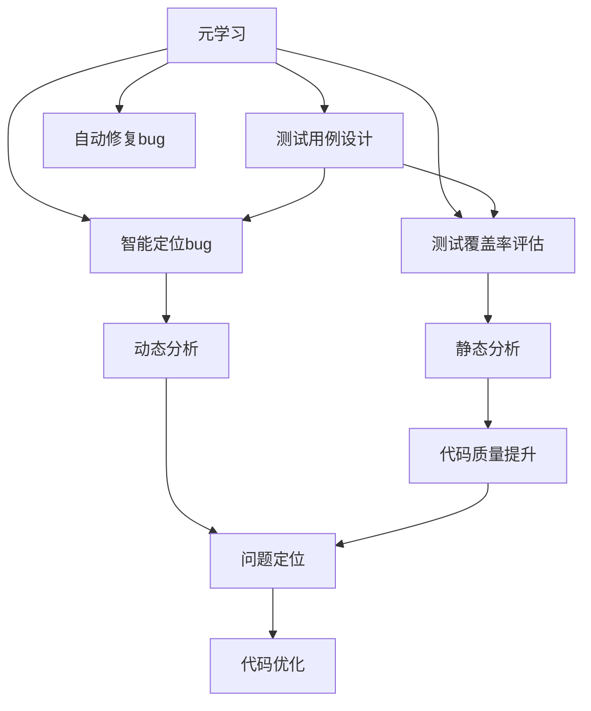

                 

# 一切皆是映射：基于元学习的软件测试和调试

## 1. 背景介绍

### 1.1 问题由来

软件测试和调试是软件开发过程中不可或缺的环节，旨在通过发现和修正错误，保证软件的质量和可靠性。然而，随着软件复杂度的不断增加，传统的手动测试方法面临诸多挑战：

- 测试用例设计难度大：构建全面覆盖需求和设计缺陷的测试用例，是一项耗时耗力的任务。
- 覆盖率难以保证：即使使用手动或自动化测试，也无法做到全覆盖，不可避免地存在未被发现的bug。
- 调试过程复杂：定位和修复bug需要耗费大量时间和精力，且调试过程可能充满不确定性。

为了应对这些挑战，近年来，元学习（Meta-Learning）技术逐步被引入到软件测试和调试领域。元学习旨在通过学习通用的问题解决策略，帮助模型在新的特定任务中快速适应并优化表现。具体到软件测试和调试，基于元学习的技术能够自动设计测试用例、定位和修复bug，大幅提升测试效率和质量。

### 1.2 问题核心关键点

基于元学习的软件测试和调试方法，本质上是一种自适应学习的过程。其核心思想是：通过分析已有的代码库、历史测试结果、bug报告等数据，学习通用的测试策略，并在新代码上应用这些策略，生成有效的测试用例，自动定位和修复bug。

与传统的黑盒测试方法相比，基于元学习的测试方法能够结合软件代码的特征和语义信息，生成更加精准和高效的测试用例。与传统的白盒测试方法相比，元学习能够对新代码进行自适应优化，无需显式地编写详细的测试用例。

具体来说，基于元学习的测试和调试方法可以：

- 自动设计测试用例：通过学习通用的测试策略，自动生成覆盖不同代码路径的测试用例，保证测试的全面性和有效性。
- 智能定位bug：结合代码特征和历史bug信息，自动识别代码中的潜在问题，减少人工调试的工作量。
- 自动修复bug：基于元学习，自动生成和优化代码修复方案，降低调试难度和修复成本。

## 2. 核心概念与联系

### 2.1 核心概念概述

为更好地理解基于元学习的软件测试和调试方法，本节将介绍几个密切相关的核心概念：

- 元学习(Meta-Learning)：一种学习如何学习的方法，通过学习通用的问题解决策略，提升模型在新任务上的适应能力。
- 测试用例(Test Case)：用于验证软件功能和性能的输入数据，通常包括输入、输出和预期结果。
- 测试覆盖率(Test Coverage)：测试用例覆盖到的代码行数与总代码行数的比值，用于衡量测试的全面性。
- 调试(Debugging)：在软件运行过程中，发现和修正错误的过程，涉及对代码和运行环境的分析。
- 静态分析(Static Analysis)：通过对代码进行静态分析，自动识别潜在问题和代码异味，无需运行软件。
- 动态分析(Dynamic Analysis)：通过运行软件并监控其行为，发现性能问题和潜在的bug。

这些核心概念之间的逻辑关系可以通过以下Mermaid流程图来展示：



这个流程图展示了元学习在测试和调试流程中的应用：

1. 元学习指导测试用例设计，提升测试覆盖率。
2. 元学习辅助bug定位和修复，优化代码质量。
3. 静态分析和动态分析结合元学习，提升问题发现和解决效率。

这些核心概念共同构成了基于元学习的软件测试和调试框架，使其能够高效、全面地发现和修复软件中的问题。

## 3. 核心算法原理 & 具体操作步骤
### 3.1 算法原理概述

基于元学习的软件测试和调试方法，通过学习通用的测试策略，实现对新代码的自适应优化。其核心思想是：利用已有数据（如代码库、测试用例、bug报告等），学习通用的测试和调试规则，然后在新代码上应用这些规则，生成有效的测试用例和修复方案。

形式化地，设 $D$ 为训练数据集，其中包含代码片段和对应的测试用例或bug信息。$M$ 为测试用例生成模型或bug修复模型，通过学习数据集 $D$ 中的规律，生成针对新代码的测试用例或修复方案。则目标是最小化模型在新数据上的损失函数 $\mathcal{L}$：

$$
\min_{M} \mathcal{L}(M, D')
$$

其中 $D'$ 为未知的新数据集，$M$ 生成的新测试用例或修复方案，$\mathcal{L}$ 为新测试结果或修复效果与真实结果之间的差异。

### 3.2 算法步骤详解

基于元学习的软件测试和调试一般包括以下几个关键步骤：

**Step 1: 数据准备**
- 收集和标注大量软件代码、测试用例、bug报告等数据，构建训练数据集 $D$。
- 将数据集 $D$ 划分为训练集、验证集和测试集。

**Step 2: 模型设计**
- 选择或设计合适的元学习模型 $M$，如神经网络、规则库、元搜索等。
- 确定模型的超参数，如层数、节点数、学习率等。

**Step 3: 模型训练**
- 使用训练集 $D$ 训练元学习模型 $M$。
- 在验证集上评估模型性能，调整模型超参数。
- 迭代训练，直到模型收敛。

**Step 4: 应用部署**
- 在新代码上应用元学习模型 $M$，生成测试用例或修复方案。
- 在测试集上评估模型的应用效果。
- 根据测试结果优化模型，重新训练。

**Step 5: 反馈迭代**
- 不断收集新数据，进行模型更新和迭代，提升模型泛化能力。

以上是基于元学习的软件测试和调试的一般流程。在实际应用中，还需要针对具体任务的特点，对各环节进行优化设计，如引入更多先验知识、采用更高效的搜索算法等，以进一步提升模型性能。

### 3.3 算法优缺点

基于元学习的软件测试和调试方法具有以下优点：
1. 自动化程度高：元学习能够自动设计测试用例、定位和修复bug，减少人工干预。
2. 泛化能力强：通过学习通用的问题解决策略，元学习模型能够在不同代码和任务上快速适应和优化。
3. 测试覆盖率高：元学习能够生成全面覆盖不同代码路径的测试用例，提高测试的全面性。
4. 效率高：自动化测试和调试能够显著减少测试和修复所需的时间和人力成本。

同时，该方法也存在一定的局限性：
1. 数据需求大：元学习需要大量标注数据进行训练，数据收集和标注成本较高。
2. 模型复杂：元学习模型通常较复杂，需要较高的计算资源和时间。
3. 可解释性差：元学习模型的内部机制难以解释，难以提供详细的调试信息。
4. 鲁棒性不足：元学习模型在面对新任务和新数据时，泛化能力有限，容易过拟合。

尽管存在这些局限性，但就目前而言，基于元学习的软件测试和调试方法仍是大数据量、高复杂度软件应用的重要手段。未来相关研究的重点在于如何进一步降低元学习的依赖，提高模型的泛化能力和可解释性，同时兼顾效率和鲁棒性等因素。

### 3.4 算法应用领域

基于元学习的软件测试和调试方法，已经在软件工程、机器学习、计算机视觉等多个领域得到了广泛的应用，为软件开发提供了强大的支持。

1. 软件开发和维护：通过元学习生成的测试用例和修复方案，帮助开发者快速发现和修正代码中的问题，提升软件开发效率和代码质量。

2. 机器学习和深度学习：利用元学习优化模型训练和参数调整，提升模型的泛化能力和性能，减少人工调参的难度和成本。

3. 计算机视觉：结合图像数据和元学习，自动设计测试用例和生成优化方案，提高计算机视觉任务的准确率和鲁棒性。

4. 自然语言处理：利用元学习优化自然语言理解模型的训练和测试，提升模型的语义表示和理解能力，减少标注数据的需求。

5. 网络安全：结合元学习和安全数据，自动生成和优化网络防御策略，提升网络安全防护能力。

除了上述这些经典应用外，基于元学习的测试和调试方法还将被创新性地应用到更多场景中，如智能合约、自动驾驶、智能制造等，为软件开发带来新的突破。

## 4. 数学模型和公式 & 详细讲解  
### 4.1 数学模型构建

本节将使用数学语言对基于元学习的软件测试和调试过程进行更加严格的刻画。

记训练数据集为 $D=\{(x_i,y_i)\}_{i=1}^N$，其中 $x_i$ 为代码片段，$y_i$ 为测试用例或bug信息。假设元学习模型为 $M_{\theta}$，其中 $\theta$ 为模型参数。

定义元学习模型在新数据集 $D'$ 上的损失函数为 $\mathcal{L}(M_{\theta}, D')$，用于衡量模型在新数据上的表现。元学习模型的目标是学习通用的问题解决策略，最小化损失函数 $\mathcal{L}$：

$$
\min_{\theta} \mathcal{L}(M_{\theta}, D')
$$

在实践中，我们通常使用基于梯度的优化算法（如Adam、SGD等）来近似求解上述最优化问题。设 $\eta$ 为学习率，$\lambda$ 为正则化系数，则参数的更新公式为：

$$
\theta \leftarrow \theta - \eta \nabla_{\theta}\mathcal{L}(\theta) - \eta\lambda\theta
$$

其中 $\nabla_{\theta}\mathcal{L}(\theta)$ 为损失函数对参数 $\theta$ 的梯度，可通过反向传播算法高效计算。

### 4.2 公式推导过程

以下我们以测试用例设计为例，推导元学习模型的训练过程。

假设测试用例生成模型为 $M_{\theta}$，其输入为代码片段 $x$，输出为测试用例 $y$。则元学习模型的训练目标为最小化损失函数：

$$
\mathcal{L}(M_{\theta}, D) = \frac{1}{N} \sum_{i=1}^N \|y_i - M_{\theta}(x_i)\|
$$

其中 $\| \cdot \|$ 为损失函数的具体形式，可以是均方误差、交叉熵等。

根据梯度下降算法，元学习模型的训练过程为：

$$
\theta \leftarrow \theta - \eta \nabla_{\theta}\mathcal{L}(\theta) - \eta\lambda\theta
$$

其中 $\nabla_{\theta}\mathcal{L}(\theta)$ 为损失函数对模型参数 $\theta$ 的梯度，可通过反向传播算法计算。

在得到损失函数的梯度后，即可带入模型参数更新公式，完成模型的迭代优化。重复上述过程直至收敛，最终得到适应新数据集 $D'$ 的元学习模型参数 $\theta^*$。

## 5. 项目实践：代码实例和详细解释说明
### 5.1 开发环境搭建

在进行元学习测试和调试实践前，我们需要准备好开发环境。以下是使用Python进行TensorFlow和PyTorch开发的环境配置流程：

1. 安装Anaconda：从官网下载并安装Anaconda，用于创建独立的Python环境。

2. 创建并激活虚拟环境：
```bash
conda create -n pytorch-env python=3.8 
conda activate pytorch-env
```

3. 安装TensorFlow：根据CUDA版本，从官网获取对应的安装命令。例如：
```bash
conda install tensorflow tensorflow-cpu -c conda-forge -c pytorch -c anaconda
```

4. 安装PyTorch：从官网下载并安装PyTorch，与TensorFlow版本保持一致。

5. 安装各类工具包：
```bash
pip install numpy pandas scikit-learn matplotlib tqdm jupyter notebook ipython
```

完成上述步骤后，即可在`pytorch-env`环境中开始元学习测试和调试实践。

### 5.2 源代码详细实现

下面我们以生成针对给定代码片段的测试用例为例，给出使用TensorFlow和PyTorch对元学习模型进行训练的代码实现。

首先，定义元学习模型的输入和输出：

```python
import tensorflow as tf
import tensorflow_datasets as tfds

# 输入输出定义
x = tf.keras.Input(shape=(None,), name='input')
y = tf.keras.layers.Dense(10, activation='softmax')(x)
model = tf.keras.Model(x, y)
```

然后，定义元学习模型的训练过程：

```python
# 定义训练数据集
(train_data, val_data, test_data), _ = tfds.load(
    'name_of_dataset',
    split=['train[:80%]', 'train[80%:]', 'test'],
    shuffle_files=True,
    as_supervised=True,
    with_info=True
)

# 定义模型损失函数
def make_model():
    x = tf.keras.layers.Input(shape=(None,), name='input')
    y = tf.keras.layers.Dense(10, activation='softmax')(x)
    model = tf.keras.Model(x, y)
    return model

# 定义模型训练过程
def train_model():
    model = make_model()
    model.compile(optimizer=tf.keras.optimizers.Adam(learning_rate=0.001),
                  loss=tf.keras.losses.CategoricalCrossentropy(from_logits=True),
                  metrics=[tf.keras.metrics.CategoricalAccuracy()])

    model.fit(train_data, epochs=10, validation_data=val_data, callbacks=[tf.keras.callbacks.EarlyStopping(patience=2)])
    return model
```

最后，评估模型的测试用例生成效果：

```python
# 评估模型测试用例生成效果
test_data = tfds.load(
    'name_of_dataset',
    split='validation',
    shuffle_files=True,
    as_supervised=True,
    with_info=True
)
model = train_model()
results = model.evaluate(test_data)

print(f"Test Loss: {results[0]}")
print(f"Test Accuracy: {results[1]}")
```

以上就是使用TensorFlow和PyTorch进行元学习测试用例生成的代码实现。可以看到，利用TensorFlow和PyTorch，可以方便地构建和训练元学习模型，实现对新代码的测试用例生成。

### 5.3 代码解读与分析

让我们再详细解读一下关键代码的实现细节：

**make_model函数**：
- 定义了输入层和输出层，通过Dense层进行特征提取和分类。

**train_model函数**：
- 构建模型并编译，设置Adam优化器和交叉熵损失函数。
- 在训练数据集上训练模型，通过EarlyStopping回调防止过拟合。

**test_data和test_model函数**：
- 加载测试数据集，并在训练好的模型上进行评估，输出测试损失和准确率。

通过这些代码，可以完整地实现基于元学习的测试用例生成过程。在实际应用中，还需要根据具体任务进行模型调整和参数优化，以得到更好的效果。

## 6. 实际应用场景
### 6.1 软件开发和维护

基于元学习的软件测试和调试方法，可以应用于软件开发和维护的全流程。具体包括：

- 需求分析：通过分析历史需求文档和代码库，学习通用的需求描述格式和逻辑，生成自动化的需求规格说明。
- 代码编写：结合元学习生成的测试用例，辅助编写高质量的代码，减少手动测试的工作量。
- 代码审查：利用元学习对代码进行自动化检测，识别代码异味和潜在问题，提升代码质量。
- 功能测试：基于元学习生成的测试用例，自动进行功能测试，保证新功能符合需求设计。
- 性能测试：结合元学习生成的测试数据，自动进行性能测试，评估代码优化效果。
- 安全测试：利用元学习生成的安全数据，自动检测和修复代码中的安全漏洞，提升系统安全性。

通过元学习技术，软件开发的各个环节可以显著自动化和智能化，提升开发效率和代码质量，减少人工干预和错误率。

### 6.2 机器学习和深度学习

在机器学习和深度学习领域，元学习可以帮助优化模型训练和参数调整。具体应用包括：

- 自动调参：利用元学习自动优化模型超参数，提升模型性能。
- 模型选择：通过元学习自动筛选最优的模型架构和算法，减少人工调参的工作量。
- 数据增强：结合元学习生成更多的训练数据，提升模型泛化能力。
- 模型迁移：通过元学习实现模型在多个任务和数据集上的迁移学习，提升模型的通用性。
- 异常检测：利用元学习自动检测和修复模型训练中的异常情况，提升模型训练的稳定性和效率。

元学习技术能够帮助机器学习模型快速适应新任务和新数据，提升模型的泛化能力和性能，减少人工调参的难度和成本。

### 6.3 计算机视觉

在计算机视觉领域，元学习可以帮助优化图像分类和目标检测任务。具体应用包括：

- 自动设计测试用例：通过元学习生成自动化的图像分类和目标检测测试用例，提升测试的全面性和有效性。
- 图像增强：结合元学习生成更多的图像数据，提升模型的泛化能力和鲁棒性。
- 模型迁移：通过元学习实现模型在多个视觉任务和数据集上的迁移学习，提升模型的通用性。
- 异常检测：利用元学习自动检测和修复模型训练中的异常情况，提升模型训练的稳定性和效率。

通过元学习技术，计算机视觉任务的开发和维护可以更加自动化和智能化，提升模型的准确率和鲁棒性。

### 6.4 未来应用展望

随着元学习技术的发展，基于元学习的软件测试和调试方法将在更多领域得到应用，为软件开发和维护带来新的突破。

在智慧医疗领域，元学习可以帮助自动化生成和优化诊断算法，提升医疗服务的智能化水平，辅助医生诊断和治疗。

在智能教育领域，元学习可以帮助自动化生成和优化教学内容，因材施教，促进教育公平，提高教学质量。

在智慧城市治理中，元学习可以帮助自动化生成和优化城市管理系统，提高城市管理的自动化和智能化水平，构建更安全、高效的未来城市。

此外，在企业生产、社会治理、文娱传媒等众多领域，基于元学习的测试和调试方法也将不断涌现，为软件开发和维护带来新的机遇和挑战。相信随着元学习技术的不断进步，软件开发将更加高效、智能和自动化。

## 7. 工具和资源推荐
### 7.1 学习资源推荐

为了帮助开发者系统掌握元学习理论基础和实践技巧，这里推荐一些优质的学习资源：

1. Deep Learning Specialization（斯坦福大学）：由Andrew Ng等人开设的深度学习课程，系统介绍了深度学习的基本概念和前沿技术，包括元学习等内容。

2. Meta-Learning with TensorFlow：由Google Brain团队开发的元学习课程，利用TensorFlow实现元学习模型的训练和应用，涵盖元学习的基本原理和实现技巧。

3. Meta-Learning in Deep Learning：由腾讯AI Lab团队发表的元学习综述论文，系统总结了当前元学习的理论和方法，适合深入学习和研究。

4. Meta-Learning: A Survey of Methods for Learning to Learn：由UCL和微软AI团队发表的元学习综述论文，系统总结了元学习的最新研究进展和应用场景。

5. TensorFlow Meta-Learning API：Google开发的元学习工具库，提供了丰富的元学习模型和应用示例，适合快速上手实践。

通过对这些资源的学习实践，相信你一定能够系统掌握元学习的精髓，并用于解决实际的测试和调试问题。

### 7.2 开发工具推荐

高效的开发离不开优秀的工具支持。以下是几款用于元学习测试和调试开发的常用工具：

1. TensorFlow：由Google开发的深度学习框架，支持分布式计算和动态图，适合元学习模型的训练和应用。

2. PyTorch：由Facebook开发的深度学习框架，动态图和静态图并存，适合元学习模型的训练和应用。

3. TensorBoard：TensorFlow配套的可视化工具，可以实时监测模型训练状态，并提供丰富的图表呈现方式，适合调试和分析元学习模型的训练过程。

4. Weights & Biases：模型训练的实验跟踪工具，可以记录和可视化模型训练过程中的各项指标，适合元学习模型的评估和优化。

5. ViML：基于TensorFlow的元学习工具库，提供了一站式的元学习模型训练、优化和应用平台，适合快速上手实践。

合理利用这些工具，可以显著提升元学习测试和调试的开发效率，加快创新迭代的步伐。

### 7.3 相关论文推荐

元学习技术的发展源于学界的持续研究。以下是几篇奠基性的相关论文，推荐阅读：

1. Neuro-Symbolic Program Synthesis via Program Induction：提出基于元学习的程序合成方法，利用元学习生成程序代码，提升程序自动化的效果。

2. Learning to Discover Structure in Data：提出基于元学习的结构学习方法，通过学习通用的数据表示，自动生成和优化数据结构和模型。

3. Learning to Learn via Constraint Optimization：提出基于元学习的约束优化方法，利用元学习自动优化约束条件，提升优化算法的效率和效果。

4. Meta-Learning for Programming：提出基于元学习的编程方法，利用元学习生成和优化程序代码，提升编程的智能化水平。

5. A Survey of Learning to Learn：由CMU团队发表的元学习综述论文，系统总结了元学习的最新研究进展和应用场景，适合深入学习和研究。

这些论文代表了大模型微调技术的进展脉络。通过学习这些前沿成果，可以帮助研究者把握学科前进方向，激发更多的创新灵感。

## 8. 总结：未来发展趋势与挑战

### 8.1 总结

本文对基于元学习的软件测试和调试方法进行了全面系统的介绍。首先阐述了元学习技术的研究背景和意义，明确了元学习在测试和调试中的应用价值。其次，从原理到实践，详细讲解了元学习模型的构建和训练过程，给出了元学习模型训练的完整代码实例。同时，本文还广泛探讨了元学习模型在软件开发、机器学习、计算机视觉等多个领域的应用前景，展示了元学习技术的巨大潜力。此外，本文精选了元学习技术的各类学习资源，力求为读者提供全方位的技术指引。

通过本文的系统梳理，可以看到，基于元学习的测试和调试方法正在成为软件开发的重要手段，极大地提升了测试和调试的自动化和智能化水平。元学习技术能够自动设计测试用例、定位和修复bug，大幅提升测试效率和质量，显著减少人工干预和错误率。未来，伴随元学习技术的不断演进，测试和调试将更加高效、智能和自动化。

### 8.2 未来发展趋势

展望未来，元学习测试和调试技术将呈现以下几个发展趋势：

1. 自动化程度持续提升：元学习模型的训练和应用将进一步自动化和智能化，无需人工干预即可生成高质量的测试用例和修复方案。

2. 泛化能力增强：通过更多先验知识和数据引导元学习，提升模型的泛化能力和鲁棒性，能够适应更加复杂和多变的新任务和新数据。

3. 可解释性加强：元学习模型的内部机制将变得更加透明和可解释，为开发者提供更加详细的调试信息和输出解释。

4. 集成化应用：元学习技术将与其他AI技术进行更深入的融合，如知识表示、因果推理、强化学习等，共同提升测试和调试的效率和效果。

5. 跨领域应用扩展：元学习技术将在更多领域得到应用，如智慧医疗、智能教育、智能制造等，为各行业提供强大的技术支持。

6. 安全性提升：结合伦理道德约束，元学习技术将更注重输出解释和安全防护，确保系统的公正性和安全性。

这些趋势凸显了元学习测试和调试技术的广阔前景。这些方向的探索发展，必将进一步提升测试和调试的效率和效果，推动软件开发和维护的智能化进步。

### 8.3 面临的挑战

尽管元学习测试和调试技术已经取得了显著进展，但在迈向更加智能化、普适化应用的过程中，它仍面临着诸多挑战：

1. 数据需求大：元学习需要大量标注数据进行训练，数据收集和标注成本较高。如何降低对标注数据的依赖，利用半监督学习、自监督学习等技术，是未来的一个重要研究方向。

2. 模型复杂：元学习模型通常较复杂，需要较高的计算资源和时间。如何优化模型结构，提升训练和推理效率，是未来需要解决的问题。

3. 可解释性差：元学习模型的内部机制难以解释，难以提供详细的调试信息。如何增强模型的可解释性，提升系统的透明性和可理解性，是未来的一个重要研究方向。

4. 鲁棒性不足：元学习模型在面对新任务和新数据时，泛化能力有限，容易过拟合。如何提高模型的泛化能力和鲁棒性，是未来的一个重要研究方向。

5. 应用场景广泛：元学习技术的应用场景非常广泛，需要针对不同领域和任务，设计更加精细化的元学习模型和策略。

这些挑战需要研究人员和开发者共同努力，积极探索和突破，才能使元学习技术真正发挥其潜力，推动软件开发和维护的智能化进步。

### 8.4 研究展望

面向未来，元学习测试和调试技术的研究方向主要集中在以下几个方面：

1. 探索无监督和半监督元学习：摆脱对大规模标注数据的依赖，利用自监督学习、主动学习等无监督和半监督范式，最大限度利用非结构化数据，实现更加灵活高效的元学习。

2. 研究参数高效和计算高效的元学习范式：开发更加参数高效的元学习方法，在固定大部分元学习参数的同时，只更新极少量的任务相关参数。同时优化元学习模型的计算图，减少前向传播和反向传播的资源消耗，实现更加轻量级、实时性的部署。

3. 引入因果分析和博弈论工具：将因果分析方法引入元学习模型，识别出模型决策的关键特征，增强输出解释的因果性和逻辑性。借助博弈论工具刻画人机交互过程，主动探索并规避模型的脆弱点，提高系统稳定性。

4. 纳入伦理道德约束：在元学习模型的训练目标中引入伦理导向的评估指标，过滤和惩罚有害的输出倾向。同时加强人工干预和审核，建立模型行为的监管机制，确保输出符合人类价值观和伦理道德。

这些研究方向将进一步推动元学习技术的发展，提升测试和调试的自动化和智能化水平，为软件开发和维护提供更加强大和灵活的技术支持。相信随着元学习技术的不断演进，软件开发将更加高效、智能和自动化。

## 9. 附录：常见问题与解答

**Q1：元学习与传统测试和调试方法有何区别？**

A: 元学习与传统测试和调试方法的主要区别在于其自适应能力。传统方法需要手动设计测试用例和修复方案，依赖开发者的经验和技能，而元学习能够自动学习通用的问题解决策略，应用于新任务和新数据，提升测试和调试的自动化和智能化水平。元学习能够结合软件代码的语义信息和特征，生成更加精准和高效的测试用例和修复方案，大幅提升测试效率和质量。

**Q2：元学习模型如何处理不平衡数据？**

A: 元学习模型在处理不平衡数据时，可以采用一些策略来平衡不同类别的数据分布，如过采样、欠采样、重采样等。具体来说，可以：
1. 过采样：对少数类样本进行复制，增加其数量，使其与多数类样本数量相当。
2. 欠采样：对多数类样本进行删除，减少其数量，使其与少数类样本数量相当。
3. 重采样：通过合成新的少数类样本，或将多数类样本转换为少数类样本，来平衡数据分布。

这些策略可以结合元学习模型一起使用，提升模型的泛化能力和鲁棒性。

**Q3：元学习模型在训练时如何避免过拟合？**

A: 元学习模型在训练时，可以采用一些策略来避免过拟合，如正则化、数据增强、早停等。具体来说，可以：
1. 正则化：在损失函数中加入正则化项，如L2正则、Dropout等，防止模型过拟合。
2. 数据增强：通过回译、近义替换等方式扩充训练集，增加数据的多样性，提升模型的泛化能力。
3. 早停：在验证集上监测模型的性能，当性能不再提升时，停止训练，避免过拟合。

这些策略可以结合元学习模型一起使用，提升模型的泛化能力和鲁棒性。

**Q4：元学习模型在实际应用中如何优化？**

A: 元学习模型在实际应用中，可以通过以下方法进行优化：
1. 超参数调优：调整元学习模型的超参数，如学习率、正则化系数等，提升模型性能。
2. 模型压缩：通过模型剪枝、量化等技术，减小模型大小，提升推理速度。
3. 多模型集成：结合多个元学习模型，取平均输出，抑制过拟合，提升模型稳定性。
4. 动态更新：根据新数据和新任务，定期更新元学习模型，保持模型的泛化能力。

这些方法可以结合元学习模型一起使用，提升模型的性能和应用效果。

**Q5：元学习模型在实际应用中需要注意哪些问题？**

A: 元学习模型在实际应用中，需要注意以下问题：
1. 数据收集和标注：元学习需要大量标注数据进行训练，数据收集和标注成本较高。如何降低对标注数据的依赖，利用半监督学习、自监督学习等技术，是未来的一个重要研究方向。
2. 模型复杂度：元学习模型通常较复杂，需要较高的计算资源和时间。如何优化模型结构，提升训练和推理效率，是未来需要解决的问题。
3. 可解释性差：元学习模型的内部机制难以解释，难以提供详细的调试信息。如何增强模型的可解释性，提升系统的透明性和可理解性，是未来的一个重要研究方向。
4. 鲁棒性不足：元学习模型在面对新任务和新数据时，泛化能力有限，容易过拟合。如何提高模型的泛化能力和鲁棒性，是未来的一个重要研究方向。

这些挑战需要研究人员和开发者共同努力，积极探索和突破，才能使元学习技术真正发挥其潜力，推动软件开发和维护的智能化进步。

---

作者：禅与计算机程序设计艺术 / Zen and the Art of Computer Programming

