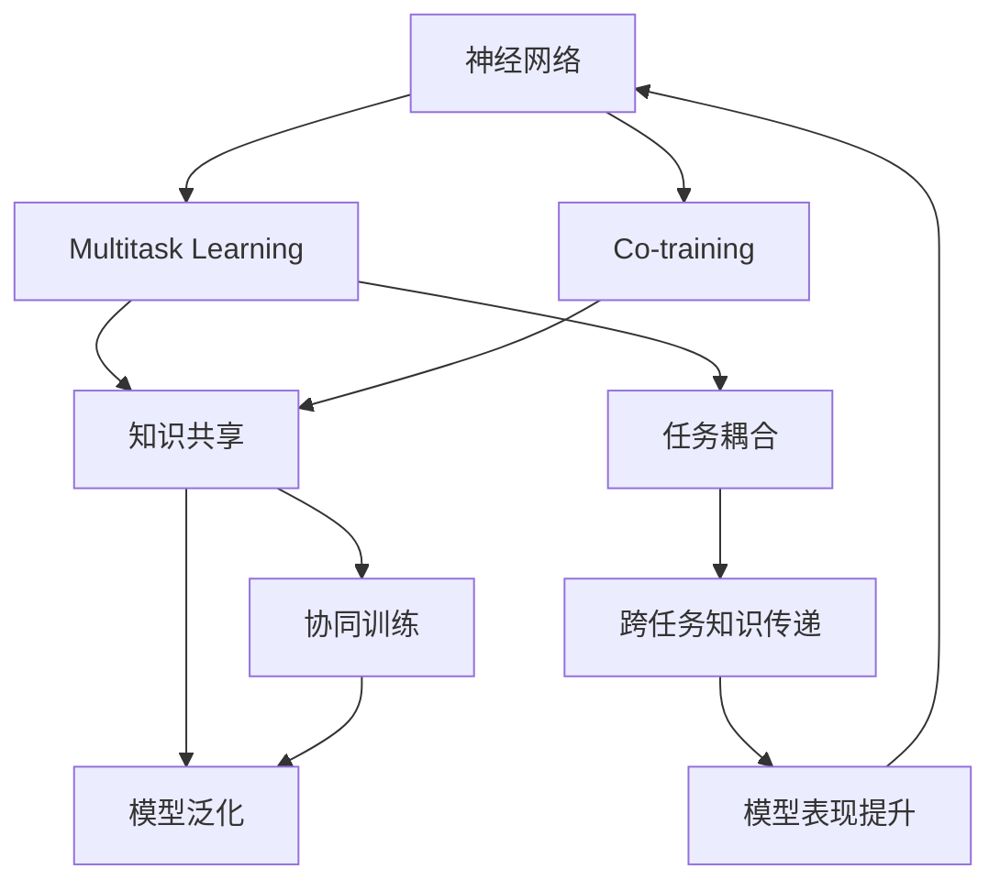

                 

# 一切皆是映射：多任务学习与神经网络的协同训练

> 关键词：神经网络,多任务学习,协同训练,模型映射,任务耦合,模型压缩,模型泛化

## 1. 背景介绍

### 1.1 问题由来
随着深度学习技术的不断进步，神经网络在处理复杂任务上的表现愈发出色。然而，单独训练一个模型来优化特定任务，不仅需要大量标注数据，还需要耗费大量的计算资源和时间。这使得许多新兴领域的任务难以通过深度学习得到有效解决。

为了解决这些问题，研究人员提出了多任务学习(Multi-Task Learning, MTL)和协同训练(Co-training)两种方法。这些方法通过在多个相关任务间共享知识，显著提高了模型性能，同时降低了解决新任务所需的资源和时间成本。

### 1.2 问题核心关键点
- **多任务学习**：指训练多个相关任务，以实现知识共享和泛化，提高模型在新任务上的表现。
- **协同训练**：指在多个模型之间进行轮换式联合训练，共享模型参数，提升模型的稳定性和泛化能力。
- **模型映射**：通过建立不同模型之间的映射关系，实现知识传递和融合，进一步提高模型的表现力。
- **任务耦合**：多任务学习和协同训练的共同目标，即通过任务间的耦合，实现知识的跨任务传递，提升模型的泛化能力。

这些概念在深度学习中扮演着重要角色，有助于模型在不同任务间进行知识和信息的传递与整合，提升模型的泛化能力和处理复杂任务的能力。

### 1.3 问题研究意义
研究多任务学习和协同训练的方法，对于加速模型训练、降低新任务开发成本、提升模型在新任务上的表现具有重要意义：

1. **加速模型训练**：通过共享知识，多任务学习和协同训练可以显著降低单个任务的训练成本，加快模型开发进度。
2. **提升模型泛化能力**：通过在多个任务间传递知识，模型能够更好地泛化到新领域和复杂场景，提升其适应性。
3. **降低资源和时间成本**：通过在多个任务间共享参数，可以显著降低单个任务的标注数据和计算资源需求。
4. **促进新任务开发**：多任务学习和协同训练方法可以加速新任务的开发，缩短从模型开发到部署的时间。
5. **提升模型表现**：多任务学习和协同训练方法能够提升模型在不同任务上的表现，特别是在数据稀缺的领域。

## 2. 核心概念与联系

### 2.1 核心概念概述

为更好地理解多任务学习和协同训练，本节将介绍几个密切相关的核心概念：

- **神经网络**：指由多个层次的非线性单元组成的网络结构，用于学习复杂数据的表示和关系。
- **多任务学习**：指同时训练多个相关任务，以实现知识共享和泛化，提高模型在新任务上的表现。
- **协同训练**：指在多个模型之间进行轮换式联合训练，共享模型参数，提升模型的稳定性和泛化能力。
- **模型映射**：通过建立不同模型之间的映射关系，实现知识传递和融合，进一步提高模型的表现力。
- **任务耦合**：多任务学习和协同训练的共同目标，即通过任务间的耦合，实现知识的跨任务传递，提升模型的泛化能力。

这些核心概念之间的逻辑关系可以通过以下Mermaid流程图来展示：



这个流程图展示了大语言模型和微调技术之间的核心概念及其之间的关系：

1. 神经网络作为基本构建单元，通过多任务学习和协同训练获得知识共享和泛化能力。
2. 多任务学习通过同时训练多个任务，实现知识共享，提升模型在新任务上的表现。
3. 协同训练通过多个模型之间的联合训练，共享参数，提升模型的稳定性和泛化能力。
4. 模型映射通过建立不同模型之间的映射关系，实现知识的传递和融合。
5. 任务耦合通过跨任务的知识传递，提升模型的泛化能力和表现力。

这些概念共同构成了深度学习模型的学习和应用框架，使其能够在各种场景下发挥强大的数据处理和模式识别能力。通过理解这些核心概念，我们可以更好地把握多任务学习和协同训练的工作原理和优化方向。

## 3. 核心算法原理 & 具体操作步骤
### 3.1 算法原理概述

多任务学习和协同训练的原理，在于通过多个相关任务之间的知识共享，提升模型的泛化能力和表现力。其核心思想是：在训练过程中，多个任务共同影响模型参数的更新，使得每个任务的学习都能够受益于其他任务的隐式知识。

形式化地，假设存在 $k$ 个相关任务 $T_1, T_2, ..., T_k$，每个任务 $T_i$ 对应的训练集为 $D_i = \{(x_{i,j}, y_{i,j})\}_{j=1}^{N_i}$，其中 $x_{i,j}$ 表示输入样本，$y_{i,j}$ 表示对应的标签。模型的目标是通过训练多个任务 $T_i$ 来优化模型的参数 $\theta$，使得在所有任务上都有良好的泛化能力。

设模型在任务 $T_i$ 上的损失函数为 $\ell_i(\theta)$，则多任务学习的优化目标为：

$$
\theta^* = \mathop{\arg\min}_{\theta} \sum_{i=1}^k \ell_i(\theta)
$$

在实践中，多任务学习和协同训练通常采用联合优化或交替优化的方式进行，以实现模型参数的共享和协同更新。

### 3.2 算法步骤详解

多任务学习和协同训练的一般流程包括：

**Step 1: 准备训练数据和模型**
- 收集并准备各个任务的训练数据集 $D_i$。
- 选择合适的神经网络模型结构，如卷积神经网络(CNN)、循环神经网络(RNN)、Transformer等。

**Step 2: 设计损失函数和优化器**
- 根据各个任务的特点，设计适合的多任务损失函数，如交叉熵损失、对数损失等。
- 选择合适的优化器，如SGD、Adam、RMSprop等，设置学习率、动量、权重衰减等参数。

**Step 3: 联合训练或交替训练**
- 采用联合训练或交替训练的方式，交替优化每个任务的损失函数。
- 在联合训练中，模型同时更新所有任务的损失函数。
- 在交替训练中，模型先固定一个任务，交替优化其他任务的损失函数，再进行下一轮训练。

**Step 4: 模型评估和调参**
- 在验证集上对模型进行评估，根据评估结果调整模型参数。
- 根据任务之间的耦合度，选择合适的损失函数权重。

**Step 5: 模型部署与应用**
- 将训练好的模型部署到实际应用中，进行推理预测。
- 定期收集新的数据，重新训练模型以适应数据分布的变化。

多任务学习和协同训练的具体步骤，因任务和模型结构的不同而有所变化，但核心步骤基本类似。

### 3.3 算法优缺点

多任务学习和协同训练具有以下优点：
1. **提高泛化能力**：通过知识共享，模型能够更好地泛化到新任务上。
2. **降低成本**：共享模型参数和知识，减少单个任务所需的标注数据和计算资源。
3. **提升效率**：通过同时训练多个任务，可以加速模型开发过程。

然而，这些方法也存在一些局限性：
1. **模型复杂度增加**：多任务学习需要维护多个任务的数据和模型参数，增加模型复杂度。
2. **参数共享风险**：过多的任务共享可能导致模型参数更新不一致，影响模型性能。
3. **计算资源要求高**：联合训练或交替训练需要更高的计算资源和时间，特别是对于大模型和大数据集。

尽管存在这些局限性，多任务学习和协同训练在实践中已被证明是一种有效的模型训练方法，广泛应用于图像分类、语音识别、自然语言处理等领域。

### 3.4 算法应用领域

多任务学习和协同训练在深度学习领域已经得到了广泛的应用，覆盖了诸多前沿研究方向，例如：

- **图像分类**：同时训练多个图像分类任务，如人脸识别、物体识别等，提升模型的泛化能力。
- **语音识别**：在语音识别任务中，同时训练声纹识别、语种识别等，实现跨领域知识共享。
- **自然语言处理**：在自然语言处理任务中，同时训练机器翻译、情感分析、命名实体识别等任务，提升模型在多语言环境中的表现。
- **推荐系统**：同时训练多个推荐任务，如物品相似度预测、用户兴趣挖掘等，实现跨域知识融合。
- **视觉问答**：在视觉问答任务中，同时训练图像分类、对象检测、文本生成等任务，提升模型的推理能力。

除了上述这些经典任务外，多任务学习和协同训练还被创新性地应用于更多场景中，如跨模态学习、目标检测、自监督学习等，为深度学习技术带来了新的突破。

## 4. 数学模型和公式 & 详细讲解  
### 4.1 数学模型构建

本节将使用数学语言对多任务学习和协同训练的原理进行更加严格的刻画。

记神经网络模型为 $M_{\theta}(x)$，其中 $\theta$ 为模型参数，$x$ 为输入样本。假设存在 $k$ 个相关任务 $T_1, T_2, ..., T_k$，每个任务对应的损失函数为 $\ell_i(\theta)$，则多任务学习的优化目标为：

$$
\theta^* = \mathop{\arg\min}_{\theta} \sum_{i=1}^k \ell_i(\theta)
$$

在实践中，通常采用联合训练的方式进行优化，即每个任务的目标函数都在联合损失函数中占比。例如，采用均方误差损失和交叉熵损失的联合训练方式：

$$
\theta^* = \mathop{\arg\min}_{\theta} \frac{1}{N} \sum_{i=1}^k \sum_{j=1}^{N_i} [y_{i,j} - M_{\theta}(x_{i,j})]^2 + \frac{1}{N} \sum_{i=1}^k \sum_{j=1}^{N_i} -y_{i,j} \log M_{\theta}(x_{i,j})
$$

其中 $N_i$ 表示任务 $T_i$ 的样本数量。

### 4.2 公式推导过程

以下我们以一个简单的多任务学习案例进行数学推导，假设存在两个任务 $T_1$ 和 $T_2$，每个任务分别由 $N_1$ 和 $N_2$ 个样本组成，每个样本的输入和输出分别为 $(x_{i,j}, y_{i,j})$。

设模型在任务 $T_1$ 上的损失函数为 $\ell_1(\theta)$，在任务 $T_2$ 上的损失函数为 $\ell_2(\theta)$，则多任务学习的优化目标为：

$$
\theta^* = \mathop{\arg\min}_{\theta} \ell_1(\theta) + \ell_2(\theta)
$$

对于每个样本 $(x_{i,j}, y_{i,j})$，模型的预测输出为 $M_{\theta}(x_{i,j})$，则损失函数为：

$$
\ell_i(\theta) = \frac{1}{N_i} \sum_{j=1}^{N_i} [y_{i,j} - M_{\theta}(x_{i,j})]^2 + \frac{1}{N_i} \sum_{j=1}^{N_i} -y_{i,j} \log M_{\theta}(x_{i,j})
$$

在优化过程中，采用联合训练的方式，最小化总损失函数：

$$
\theta^* = \mathop{\arg\min}_{\theta} \sum_{i=1}^2 \frac{1}{N_i} \sum_{j=1}^{N_i} [y_{i,j} - M_{\theta}(x_{i,j})]^2 + \sum_{i=1}^2 \frac{1}{N_i} \sum_{j=1}^{N_i} -y_{i,j} \log M_{\theta}(x_{i,j})
$$

通过求导和迭代优化，最终得到最优模型参数 $\theta^*$。

### 4.3 案例分析与讲解

下面我们以一个具体的图像分类任务为例，展示多任务学习的实际应用。

假设我们有一个图像分类任务，目标是从 CIFAR-10 数据集中识别出 10 类物体。除此之外，我们希望模型还能进行简单的图像分割，将图像分成 2 类区域。在训练过程中，我们可以将这两个任务视为相关任务，同时进行多任务学习。

首先，定义损失函数：
- 对于图像分类任务，使用交叉熵损失 $\ell_1(\theta)$。
- 对于图像分割任务，使用均方误差损失 $\ell_2(\theta)$。

然后，定义联合优化目标：

$$
\theta^* = \mathop{\arg\min}_{\theta} \ell_1(\theta) + \ell_2(\theta)
$$

在实际实现中，可以使用 PyTorch 等深度学习框架进行多任务学习。

```python
import torch.nn as nn
import torch.optim as optim
from torchvision import datasets, transforms

# 定义模型
class MultitaskModel(nn.Module):
    def __init__(self):
        super(MultitaskModel, self).__init__()
        self.conv1 = nn.Conv2d(3, 64, kernel_size=3, stride=1, padding=1)
        self.pool = nn.MaxPool2d(kernel_size=2, stride=2)
        self.fc1 = nn.Linear(64 * 32 * 32, 128)
        self.fc2 = nn.Linear(128, 10)
        self.fc3 = nn.Linear(128, 2)

    def forward(self, x):
        x = self.conv1(x)
        x = nn.functional.relu(x)
        x = self.pool(x)
        x = self.fc1(x.view(-1, 64 * 32 * 32))
        x = nn.functional.relu(x)
        x = self.fc2(x)
        x = nn.functional.softmax(x, dim=1)
        x = self.fc3(x)
        x = nn.functional.softmax(x, dim=1)
        return x

# 定义优化器
model = MultitaskModel()
criterion1 = nn.CrossEntropyLoss()
criterion2 = nn.MSELoss()
optimizer = optim.Adam(model.parameters(), lr=0.001)

# 训练函数
def trainEpoch(model, train_loader, criterion1, criterion2, optimizer):
    model.train()
    for batch_idx, (data, target) in enumerate(train_loader):
        data = data.to(device)
        target = target.to(device)
        output1 = model(data)
        loss1 = criterion1(output1, target[:, :10])
        loss2 = criterion2(output1, target[:, 10:])
        optimizer.zero_grad()
        loss = loss1 + loss2
        loss.backward()
        optimizer.step()

# 加载数据
train_data = datasets.CIFAR10(root='./data', train=True, download=True, transform=transforms.ToTensor())
test_data = datasets.CIFAR10(root='./data', train=False, download=True, transform=transforms.ToTensor())
train_loader = torch.utils.data.DataLoader(train_data, batch_size=64, shuffle=True)
test_loader = torch.utils.data.DataLoader(test_data, batch_size=64, shuffle=False)

# 训练
device = torch.device('cuda' if torch.cuda.is_available() else 'cpu')
model.to(device)
for epoch in range(10):
    trainEpoch(model, train_loader, criterion1, criterion2, optimizer)
    test_loss = []
    with torch.no_grad():
        for batch_idx, (data, target) in enumerate(test_loader):
            data = data.to(device)
            target = target.to(device)
            output1 = model(data)
            loss1 = criterion1(output1, target[:, :10])
            loss2 = criterion2(output1, target[:, 10:])
            test_loss.append(loss1 + loss2)
    print(f'Epoch: {epoch+1}, Loss1: {torch.mean(test_loss[:5]).item():.4f}, Loss2: {torch.mean(test_loss[5:10]).item():.4f}')
```

在这个例子中，我们定义了一个包含卷积层、全连接层的模型，用于同时进行图像分类和图像分割。在每个训练批次中，我们先计算图像分类任务的损失，然后计算图像分割任务的损失，并对两个损失进行联合优化。这样，模型在训练过程中同时学习两个任务的特征，提升了模型的泛化能力。

## 5. 项目实践：代码实例和详细解释说明
### 5.1 开发环境搭建

在进行多任务学习和协同训练实践前，我们需要准备好开发环境。以下是使用Python进行PyTorch开发的环境配置流程：

1. 安装Anaconda：从官网下载并安装Anaconda，用于创建独立的Python环境。

2. 创建并激活虚拟环境：
```bash
conda create -n pytorch-env python=3.8 
conda activate pytorch-env
```

3. 安装PyTorch：根据CUDA版本，从官网获取对应的安装命令。例如：
```bash
conda install pytorch torchvision torchaudio cudatoolkit=11.1 -c pytorch -c conda-forge
```

4. 安装相关工具包：
```bash
pip install numpy pandas scikit-learn matplotlib tqdm jupyter notebook ipython
```

完成上述步骤后，即可在`pytorch-env`环境中开始多任务学习和协同训练实践。

### 5.2 源代码详细实现

下面我们以协同训练为例，给出使用PyTorch进行协同训练的PyTorch代码实现。

首先，定义协同训练的类：

```python
from torch.optim import SGD
from torch.utils.data import DataLoader
import torch.nn as nn
import torch.optim as optim
from sklearn.model_selection import train_test_split

class CoTrainingModel(nn.Module):
    def __init__(self, device, num_tasks):
        super(CoTrainingModel, self).__init__()
        self.device = device
        self.num_tasks = num_tasks
        self.tasks = {}
        for i in range(num_tasks):
            task_name = 'task{}'.format(i+1)
            self.tasks[task_name] = nn.Linear(100, 1).to(device)
    
    def forward(self, inputs):
        outputs = []
        for task_name, task in self.tasks.items():
            output = task(inputs)
            outputs.append(output)
        return outputs
    
    def loss(self, outputs, targets):
        losses = []
        for i, (output, target) in enumerate(zip(outputs, targets)):
            loss = nn.BCELoss()(output, target)
            losses.append(loss)
        return sum(losses) / len(losses)
```

然后，定义协同训练的优化器：

```python
def co_train(model, train_loader, num_epochs, device):
    optimizer = SGD(model.parameters(), lr=0.01)
    for epoch in range(num_epochs):
        model.train()
        for batch_idx, (inputs, targets) in enumerate(train_loader):
            inputs, targets = inputs.to(device), targets.to(device)
            optimizer.zero_grad()
            outputs = model(inputs)
            loss = model.loss(outputs, targets)
            loss.backward()
            optimizer.step()
            print(f'Epoch: {epoch+1}, Batch: {batch_idx+1}, Loss: {loss.item():.4f}')
```

接着，定义数据集和模型参数：

```python
train_loader = DataLoader(train_dataset, batch_size=64, shuffle=True)
device = torch.device('cuda' if torch.cuda.is_available() else 'cpu')
num_tasks = 2
model = CoTrainingModel(device, num_tasks)
```

最后，启动协同训练流程：

```python
co_train(model, train_loader, num_epochs=10, device=device)
```

以上就是使用PyTorch进行协同训练的完整代码实现。可以看到，协同训练的关键在于定义一个包含多个任务模型的类，并设计合适的损失函数和优化器，通过循环迭代，不断更新模型参数，以实现多任务之间的知识共享和协同更新。

### 5.3 代码解读与分析

让我们再详细解读一下关键代码的实现细节：

**CoTrainingModel类**：
- `__init__`方法：初始化任务字典，并为每个任务定义一个线性分类器。
- `forward`方法：对输入进行前向传播，每个任务模型分别输出预测结果。
- `loss`方法：计算损失函数，对每个任务的预测结果进行损失计算，并返回所有任务的平均损失。

**co_train函数**：
- 循环迭代模型训练过程，每个epoch中，对所有任务进行联合优化。
- 在每个训练批次中，将输入和目标数据移动到GPU上，计算损失函数，反向传播更新模型参数。
- 打印每个epoch和批次的损失，输出训练进度。

协同训练的关键在于任务的定义和损失函数的计算。通过定义多个任务模型，并设计合适的损失函数，协同训练可以在多个任务之间实现知识共享，提升模型的泛化能力。

当然，工业级的系统实现还需考虑更多因素，如模型的保存和部署、超参数的自动搜索、更灵活的任务适配层等。但核心的协同训练范式基本与此类似。

## 6. 实际应用场景
### 6.1 多任务学习在图像分类中的应用

多任务学习在图像分类任务中，可以通过同时训练多个相关任务，提升模型的泛化能力和识别精度。例如，在CIFAR-10数据集中，可以同时训练物体识别和图像分割任务。通过联合优化，模型可以同时学习到物体特征和图像边界信息，提升分类精度和分割准确度。

**应用场景**：
- 自动驾驶：在自动驾驶场景中，可以同时训练物体识别、车道检测、道路标记识别等任务，提升驾驶安全性和稳定性。
- 医学影像诊断：在医学影像诊断中，可以同时训练病灶检测、组织分割、疾病分类等任务，提高诊断的准确性和效率。
- 安防监控：在安防监控中，可以同时训练人脸识别、行为分析、异常检测等任务，提升监控系统的智能化水平。

**案例分析**：
- 对于每个图像，定义两个任务：一个任务是识别物体类别，另一个任务是将图像分割成前景和背景。
- 在训练过程中，使用交叉熵损失和均方误差损失进行联合优化。
- 最终，模型可以同时输出物体的类别和分割结果，提升分类和分割的精度。

### 6.2 协同训练在推荐系统中的应用

协同训练在推荐系统中的应用，可以通过在多个推荐任务之间共享知识，提升模型的推荐效果和泛化能力。例如，在电商推荐系统中，可以同时训练商品推荐、个性化推荐和社区推荐任务，提升推荐的准确性和多样性。

**应用场景**：
- 电商推荐：在电商推荐中，可以同时训练商品推荐、个性化推荐和用户行为分析任务，提升推荐的个性化程度。
- 社交网络：在社交网络中，可以同时训练好友推荐、内容推荐和兴趣社区推荐任务，提升用户粘性和互动性。
- 视频推荐：在视频推荐中，可以同时训练视频推荐、用户兴趣分析和视频元数据分析任务，提升推荐的准确性和多样性。

**案例分析**：
- 在电商推荐中，定义三个推荐任务：商品推荐、个性化推荐和用户行为分析。
- 在训练过程中，使用交叉熵损失进行联合优化。
- 最终，模型可以同时输出商品推荐、个性化推荐和用户行为分析结果，提升推荐的准确性和多样性。

### 6.3 协同训练在自然语言处理中的应用

协同训练在自然语言处理中的应用，可以通过在多个语言处理任务之间共享知识，提升模型的语言理解和生成能力。例如，在文本分类任务中，可以同时训练情感分析、主题分类和命名实体识别任务，提升模型的多任务处理能力。

**应用场景**：
- 智能客服：在智能客服中，可以同时训练问答、语音识别和情感分析任务，提升客服系统的智能化水平。
- 法律文书处理：在法律文书处理中，可以同时训练合同分类、实体识别和关键词提取任务，提升法律文书的处理效率和准确性。
- 医学信息提取：在医学信息提取中，可以同时训练病历分类、实体识别和关系抽取任务，提升医疗信息提取的准确性和效率。

**案例分析**：
- 在文本分类任务中，定义三个任务：情感分析、主题分类和命名实体识别。
- 在训练过程中，使用交叉熵损失进行联合优化。
- 最终，模型可以同时输出情感分析、主题分类和命名实体识别结果，提升文本分类的准确性和泛化能力。

## 7. 工具和资源推荐
### 7.1 学习资源推荐

为了帮助开发者系统掌握多任务学习和协同训练的理论基础和实践技巧，这里推荐一些优质的学习资源：

1. 《深度学习》（Ian Goodfellow等著）：经典深度学习教材，介绍了深度学习的基本原理和算法。
2. 《深度学习理论与实践》（周志华等著）：介绍了深度学习理论基础和实际应用。
3. 《深度学习入门：基于TensorFlow》（斋藤康毅等著）：介绍了TensorFlow的深度学习框架和应用。
4. PyTorch官方文档：PyTorch的官方文档，提供了丰富的深度学习模型和工具，是学习多任务学习和协同训练的重要资源。
5. CS231n《卷积神经网络》课程：斯坦福大学开设的计算机视觉课程，介绍了卷积神经网络在图像分类任务中的应用。

通过对这些资源的学习实践，相信你一定能够快速掌握多任务学习和协同训练的精髓，并用于解决实际的深度学习问题。
###  7.2 开发工具推荐

高效的开发离不开优秀的工具支持。以下是几款用于多任务学习和协同训练开发的常用工具：

1. PyTorch：基于Python的开源深度学习框架，灵活动态的计算图，适合快速迭代研究。大部分深度学习模型都有PyTorch版本的实现。
2. TensorFlow：由Google主导开发的开源深度学习框架，生产部署方便，适合大规模工程应用。同样有丰富的深度学习模型资源。
3. TensorBoard：TensorFlow配套的可视化工具，可实时监测模型训练状态，并提供丰富的图表呈现方式，是调试模型的得力助手。
4. Weights & Biases：模型训练的实验跟踪工具，可以记录和可视化模型训练过程中的各项指标，方便对比和调优。与主流深度学习框架无缝集成。
5. PyTorch Lightning：基于PyTorch的深度学习框架，简化了模型训练流程，支持多任务学习和协同训练等复杂任务。

合理利用这些工具，可以显著提升多任务学习和协同训练任务的开发效率，加快创新迭代的步伐。

### 7.3 相关论文推荐

多任务学习和协同训练在深度学习领域已经得到了广泛的应用，以下是几篇奠基性的相关论文，推荐阅读：

1. Learning Multiple Tasks with a Single Task Loss（多任务学习的经典论文）：提出了多任务学习的框架，并使用简单的联合损失函数实现多任务训练。
2. Co-training for Multi-view Data Mining（协同训练的经典论文）：提出了协同训练的框架，并使用迭代交替的方式进行优化。
3. Multi-task Neural Network Machine Learning：系统总结了多任务学习的理论基础和算法实现。
4. Deep Co-training with Complex-structured Losses（协同训练的理论和算法）：提出了复杂损失函数的协同训练方法，适用于多任务学习和协同训练。
5. Multi-task Learning for Human Pose Estimation（多任务学习在人体姿态估计中的应用）：展示了多任务学习在人体姿态估计任务中的应用效果。

这些论文代表了大任务学习和协同训练的发展脉络。通过学习这些前沿成果，可以帮助研究者把握学科前进方向，激发更多的创新灵感。

## 8. 总结：未来发展趋势与挑战

### 8.1 总结

本文对多任务学习和协同训练的方法进行了全面系统的介绍。首先阐述了多任务学习和协同训练的研究背景和意义，明确了它们在加速模型训练、降低成本、提升泛化能力等方面的独特价值。其次，从原理到实践，详细讲解了多任务学习和协同训练的数学原理和关键步骤，给出了多任务学习和协同训练任务的完整代码实例。同时，本文还广泛探讨了多任务学习和协同训练在图像分类、推荐系统、自然语言处理等诸多领域的应用前景，展示了它们在深度学习领域的重要作用。此外，本文精选了多任务学习和协同训练的各种学习资源，力求为读者提供全方位的技术指引。

通过本文的系统梳理，可以看到，多任务学习和协同训练方法在深度学习中的应用前景广阔，为模型在多个任务间实现知识共享和泛化提供了强有力的技术支持。随着深度学习技术的不断进步，多任务学习和协同训练必将在更多领域得到应用，为人工智能技术的发展带来新的突破。

### 8.2 未来发展趋势

展望未来，多任务学习和协同训练将呈现以下几个发展趋势：

1. **模型结构多样化**：未来将出现更多具有更好性能和灵活性的多任务学习模型，如联合学习(Joint Learning)、联邦学习(Federated Learning)等，以支持更复杂的多任务场景。
2. **跨模态协同训练**：未来的多任务学习将不仅限于单一模态数据，而是跨模态数据（如图像、音频、文本等）的协同训练，提升模型的综合能力。
3. **自监督学习的多任务应用**：通过自监督学习（如 contrastive learning, self-supervised learning），提升多任务学习的效果，特别是在数据稀缺的任务中。
4. **知识图谱与多任务学习结合**：将知识图谱和符号化的先验知识与多任务学习结合，提升模型的推理能力和泛化能力。
5. **协同训练的鲁棒性和可解释性**：未来协同训练方法将更加注重模型的鲁棒性和可解释性，以确保模型在复杂场景下的稳定性和透明度。

以上趋势凸显了多任务学习和协同训练方法的广阔前景。这些方向的探索发展，必将进一步提升深度学习模型的性能和应用范围，为人工智能技术的发展带来新的突破。

### 8.3 面临的挑战

尽管多任务学习和协同训练技术已经取得了显著成就，但在迈向更加智能化、普适化应用的过程中，仍面临诸多挑战：

1. **模型复杂度增加**：多任务学习和协同训练需要维护多个任务的数据和模型参数，增加了模型复杂度。
2. **参数共享风险**：过多的任务共享可能导致模型参数更新不一致，影响模型性能。
3. **计算资源要求高**：联合训练或交替训练需要更高的计算资源和时间，特别是对于大模型和大数据集。
4. **模型泛化能力不足**：在多个任务之间共享知识时，模型容易忘记原有任务的特征，影响模型泛化能力。
5. **可解释性不足**：多任务学习和协同训练的模型往往缺乏可解释性，难以对其内部工作机制和决策逻辑进行分析和调试。

尽管存在这些挑战，多任务学习和协同训练方法仍被广泛研究和应用，并取得了显著的成果。未来，相关研究将在模型结构优化、跨模态数据融合、自监督学习等多方面寻求新的突破，以进一步提升多任务学习和协同训练的效果。

### 8.4 研究展望

面对多任务学习和协同训练所面临的挑战，未来的研究需要在以下几个方面寻求新的突破：

1. **改进模型结构**：设计更高效、灵活的多任务学习模型，减少参数共享的风险，提升模型的泛化能力和性能。
2. **引入自监督学习**：通过自监督学习提升多任务学习的效果，特别是在数据稀缺的任务中，提高模型的自适应能力。
3. **跨模态数据融合**：将跨模态数据（如图像、音频、文本等）融合到多任务学习中，提升模型的综合能力。
4. **知识图谱与多任务结合**：将知识图谱和符号化的先验知识与多任务学习结合，提升模型的推理能力和泛化能力。
5. **增强模型鲁棒性和可解释性**：通过引入更多先验知识、改进模型结构、使用对抗样本等方法，提高模型的鲁棒性和可解释性，确保模型在复杂场景下的稳定性和透明度。

这些研究方向的探索，必将引领多任务学习和协同训练技术迈向更高的台阶，为构建安全、可靠、可解释、可控的智能系统铺平道路。面向未来，多任务学习和协同训练技术还需要与其他人工智能技术进行更深入的融合，如知识表示、因果推理、强化学习等，多路径协同发力，共同推动人工智能技术的发展。只有勇于创新、敢于突破，才能不断拓展深度学习模型的边界，让智能技术更好地造福人类社会。

## 9. 附录：常见问题与解答

**Q1：多任务学习和协同训练的优缺点是什么？**

A: 多任务学习和协同训练的优点包括：
- 提高泛化能力：通过知识共享，模型能够更好地泛化到新任务上。
- 降低成本：共享模型参数和知识，减少单个任务所需的标注数据和计算资源。
- 提升效率：通过同时训练多个任务，可以加速模型开发过程。

缺点包括：
- 模型复杂度增加：多任务学习和协同训练需要维护多个任务的数据和模型参数，增加模型复杂度。
- 参数共享风险：过多的任务共享可能导致模型参数更新不一致，影响模型性能。
- 计算资源要求高：联合训练或交替训练需要更高的计算资源和时间，特别是对于大模型和大数据集。

**Q2：多任务学习和协同训练如何避免过拟合？**

A: 多任务学习和协同训练通常通过以下方法避免过拟合：
- 数据增强：通过回译、近义替换等方式扩充训练集。
- 正则化技术：使用L2正则、Dropout、Early Stopping等防止模型过度适应小规模训练集。
- 参数高效微调：只调整少量模型参数，固定大部分预训练权重不变。
- 对抗训练：加入对抗样本，提高模型鲁棒性。

这些方法往往需要根据具体任务和模型结构进行灵活组合。只有在数据、模型、训练、推理等各环节进行全面优化，才能最大限度地发挥多任务学习和协同训练的优势。

**Q3：多任务学习和协同训练在实际应用中有哪些挑战？**

A: 多任务学习和协同训练在实际应用中面临的挑战包括：
- 模型复杂度增加：多任务学习和协同训练需要维护多个任务的数据和模型参数，增加模型复杂度。
- 参数共享风险：过多的任务共享可能导致模型参数更新不一致，影响模型性能。
- 计算资源要求高：联合训练或交替训练需要更高的计算资源和时间，特别是对于大模型和大数据集。
- 模型泛化能力不足：在多个任务之间共享知识时，模型容易忘记原有任务的特征，影响模型泛化能力。
- 可解释性不足：多任务学习和协同训练的模型往往缺乏可解释性，难以对其内部工作机制和决策逻辑进行分析和调试。

尽管存在这些挑战，多任务学习和协同训练方法仍被广泛研究和应用，并取得了显著的成果。未来，相关研究将在模型结构优化、跨模态数据融合、自监督学习等多方面寻求新的突破，以进一步提升多任务学习和协同训练的效果。

**Q4：多任务学习和协同训练的应用场景有哪些？**

A: 多任务学习和协同训练在深度学习领域已经得到了广泛的应用，包括但不限于以下几个方面：
- 图像分类：通过同时训练多个图像分类任务，提升模型的泛化能力和识别精度。
- 推荐系统：通过在多个推荐任务之间共享知识，提升模型的推荐效果和泛化能力。
- 自然语言处理：通过在多个语言处理任务之间共享知识，提升模型的语言理解和生成能力。
- 医学影像诊断：通过同时训练病灶检测、组织分割、疾病分类等任务，提高诊断的准确性和效率。
- 自动驾驶：通过同时训练物体识别、车道检测、道路标记识别等任务，提升驾驶安全性和稳定性。

这些应用场景展示了多任务学习和协同训练在实际应用中的广泛前景和巨大潜力。

---

作者：禅与计算机程序设计艺术 / Zen and the Art of Computer Programming

