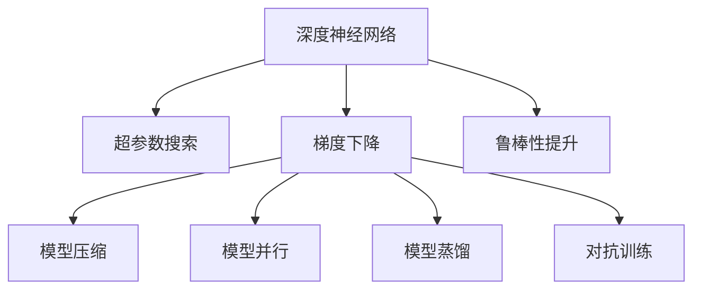

                 

# 一切皆是映射：深度神经网络的调优与优化策略

> 关键词：深度神经网络,调优策略,优化技术,超参数搜索,梯度下降,模型压缩,模型并行,模型蒸馏

## 1. 背景介绍

### 1.1 问题由来
深度学习技术已经广泛应用于图像识别、自然语言处理、语音识别等领域，并取得了举世瞩目的成果。其中，深度神经网络（Deep Neural Networks, DNNs）以其强大的表达能力和泛化性能，成为当前数据驱动智能系统的主要构建方式。然而，深度神经网络的调优与优化问题始终是困扰其广泛应用的一大难题。

对于深度神经网络，其训练过程可以看作是对输入数据和目标函数的映射关系进行不断逼近。由于模型参数众多，往往需要大量的计算资源和时间。为了提升模型性能，需要科学合理的调优与优化策略。

### 1.2 问题核心关键点
针对深度神经网络的调优与优化问题，主流的研究方法主要包括以下几个方面：

1. 超参数搜索与调优。超参数(如学习率、批大小、激活函数等)是模型训练时必须设置的关键参数，直接决定了模型性能。然而，由于超参数的取值空间巨大，传统手工调参方式耗时耗力，效果不佳。

2. 梯度下降算法及其优化。梯度下降是深度学习模型的核心优化算法，但常规梯度下降算法存在收敛速度慢、易陷入局部最优等问题。为了解决这些问题，提出了各种变体算法，如动量梯度、自适应学习率、Adam等。

3. 模型压缩与剪枝。为了节省计算资源和降低模型复杂度，模型压缩和剪枝技术成为关键优化方向。常用的方法包括权重剪枝、量化压缩、模型蒸馏等。

4. 模型并行与分布式训练。随着数据量和模型规模的不断扩大，传统的单机训练已经难以满足需求。模型并行和分布式训练技术可以显著提升训练效率，利用多机多卡加速模型训练。

5. 对抗训练与鲁棒性提升。随着深度学习模型在实际应用中的普及，模型安全性问题也逐渐凸显。通过对抗训练、鲁棒性增强等方法，可以提升模型对抗各类攻击的能力。

这些方法相互结合，共同构建了深度神经网络调优与优化的全栈框架，确保了深度学习技术在各个场景中的高效应用。

### 1.3 问题研究意义
研究深度神经网络的调优与优化方法，对于加速模型训练、提升模型性能、降低训练成本，具有重要意义：

1. 提高模型训练效率。通过科学合理的调优策略，可以在更短的时间内训练出高质量的深度神经网络。
2. 提升模型性能。通过优化算法和结构设计，可以显著提升模型的泛化能力和表现。
3. 降低训练成本。模型压缩和剪枝技术可以在不降低模型效果的前提下，大幅降低计算资源消耗和存储开销。
4. 增强模型鲁棒性。对抗训练和鲁棒性提升方法可以增强模型对噪声、对抗攻击的抵抗能力，保障模型应用的安全性。
5. 加速技术应用。深度神经网络的调优与优化技术是实现AI技术大规模落地的关键，加速了AI技术在各行各业的产业化进程。

总之，深度神经网络的调优与优化是大数据时代的重要研究课题，其理论和实践成果对构建高效、稳定、安全的智能系统具有重大意义。

## 2. 核心概念与联系

### 2.1 核心概念概述

为更好地理解深度神经网络的调优与优化方法，本节将介绍几个密切相关的核心概念：

- 深度神经网络(Deep Neural Networks, DNNs)：以多层神经元构成的非线性映射，通过反向传播算法进行模型训练。DNNs广泛应用于图像识别、语音识别、自然语言处理等领域。

- 超参数(Supervised Parameters)：模型训练时必须设定的关键参数，如学习率、批大小、激活函数等。超参数的优化直接决定了模型性能。

- 梯度下降(Gradient Descent)：基于梯度信息的优化算法，通过迭代更新模型参数，逼近损失函数的最小值。梯度下降的变体包括动量梯度、自适应学习率、Adam等。

- 模型压缩(Model Compression)：通过剪枝、量化、蒸馏等技术，减少模型参数量，降低计算和存储开销。模型压缩技术可以有效提升模型的训练和推理速度。

- 模型并行(Model Parallelism)：通过多机多卡并行训练，加速深度神经网络的训练过程。模型并行技术可以显著提升训练效率。

- 模型蒸馏(Model Distillation)：通过大模型和小模型的联合训练，将大模型的知识传递给小模型，提升小模型的性能。模型蒸馏技术适用于模型压缩和推理加速。

- 对抗训练(Adversarial Training)：通过引入对抗样本，增强深度神经网络的鲁棒性，提高模型对抗各类攻击的能力。

- 鲁棒性(Robustness)：指模型在面临各类噪声、对抗攻击等扰动时，仍能保持较高准确率的能力。鲁棒性是衡量模型安全性的关键指标。

这些核心概念之间的逻辑关系可以通过以下Mermaid流程图来展示：



这个流程图展示了大深度神经网络调优与优化的核心概念及其之间的关系：

1. 深度神经网络通过反向传播算法进行训练，需要合理设置超参数。
2. 梯度下降算法用于模型优化，其变体优化了常规算法。
3. 模型压缩技术通过剪枝、量化等方法，减少参数量，提升训练效率。
4. 模型并行和分布式训练，提升了训练效率，加速模型训练。
5. 模型蒸馏技术将大模型知识传递给小模型，提升模型性能。
6. 对抗训练提高模型鲁棒性，增强模型安全性。
7. 鲁棒性是模型稳定性的关键指标，与模型设计、训练方法密切相关。

## 3. 核心算法原理 & 具体操作步骤
### 3.1 算法原理概述

深度神经网络的调优与优化是一个复杂的过程，涉及超参数搜索、梯度下降、模型压缩、模型并行等多个方面。其核心思想是通过合理配置和调整，提升模型的性能和鲁棒性。

假设深度神经网络模型为 $M_{\theta}$，其中 $\theta$ 为模型参数。训练数据集为 $D=\{(x_i,y_i)\}_{i=1}^N$，目标函数为 $L$，通过梯度下降算法不断更新参数 $\theta$ 以最小化损失函数 $L$。

### 3.2 算法步骤详解

深度神经网络的调优与优化通常包括以下几个关键步骤：

**Step 1: 超参数搜索与调优**
- 选择合适的超参数搜索方法，如网格搜索、随机搜索、贝叶斯优化等。
- 设置超参数的取值范围，并通过实验获取最优超参数组合。
- 在训练过程中动态调整超参数，优化模型训练效果。

**Step 2: 梯度下降算法优化**
- 选择合适的梯度下降变体，如Adam、SGD、动量梯度等。
- 根据任务特点和模型结构，设置合适的学习率、批大小等参数。
- 在训练过程中监控梯度变化，调整学习率等参数，避免过拟合。

**Step 3: 模型压缩与剪枝**
- 对模型进行剪枝，去除冗余参数和连接。
- 使用量化技术，将浮点参数转换为定点参数，提升计算效率。
- 使用模型蒸馏技术，将大模型知识传递给小模型，提升模型性能。

**Step 4: 模型并行与分布式训练**
- 利用多机多卡架构，将模型并行到不同的设备上进行训练。
- 使用分布式训练框架，如TensorFlow、PyTorch等，进行分布式模型训练。
- 设计高效的模型通信和数据传输策略，优化分布式训练性能。

**Step 5: 鲁棒性提升与对抗训练**
- 使用对抗样本对模型进行攻击，提升模型鲁棒性。
- 设计鲁棒性评估指标，监控模型在对抗攻击下的表现。
- 引入鲁棒性增强技术，如防御生成对抗网络(Denoising Autoencoder)等，提升模型安全性。

以上是深度神经网络调优与优化的主要步骤。在实际应用中，还需要根据具体任务的特点，对各步骤进行优化设计，以进一步提升模型性能。

### 3.3 算法优缺点

深度神经网络的调优与优化方法具有以下优点：
1. 提升模型性能。通过科学合理的超参数搜索和梯度下降优化，可以显著提升模型的泛化能力和表现。
2. 降低训练成本。模型压缩和剪枝技术可以在不降低模型效果的前提下，大幅降低计算资源消耗和存储开销。
3. 增强模型鲁棒性。对抗训练和鲁棒性提升方法可以增强模型对噪声、对抗攻击的抵抗能力，保障模型应用的安全性。

同时，这些方法也存在一定的局限性：
1. 计算资源需求高。超参数搜索和模型并行等技术，需要大量的计算资源和时间，成本较高。
2. 模型结构复杂。深度神经网络的调优与优化过程涉及多层次的参数调整和结构设计，较为复杂。
3. 模型鲁棒性存在不确定性。对抗训练等方法虽能提升模型鲁棒性，但攻击形式和手段不断变化，仍需持续监控和优化。
4. 可解释性不足。深度神经网络通常被视为"黑盒"模型，难以解释其内部工作机制和决策逻辑。

尽管存在这些局限性，但就目前而言，深度神经网络的调优与优化方法仍然是模型训练和应用的核心范式。未来相关研究的重点在于如何进一步降低计算资源需求，提高模型的可解释性和安全性，同时兼顾模型性能的提升。

### 3.4 算法应用领域

深度神经网络的调优与优化方法已经广泛应用于各个领域，例如：

- 计算机视觉：如图像分类、目标检测、人脸识别等。通过调优与优化，提升图像识别和检测的准确率。
- 自然语言处理：如机器翻译、文本摘要、对话系统等。通过微调和优化，提高模型的语言理解和生成能力。
- 语音识别：如语音转写、语音情感识别等。通过调优与优化，提升语音识别的准确性和鲁棒性。
- 推荐系统：如电商推荐、电影推荐等。通过调优与优化，提升推荐系统的个性化和精准度。
- 医疗诊断：如影像诊断、基因分析等。通过模型压缩和鲁棒性提升，提高诊断的准确性和鲁棒性。
- 金融风控：如信用评估、风险预测等。通过调优与优化，提高金融风险预测的准确性。

除了上述这些经典应用外，深度神经网络的调优与优化技术还正在拓展到更多场景中，如自动驾驶、工业控制、智能制造等，为各行各业带来了新的突破。随着预训练模型和调优方法的不断进步，相信深度神经网络将进一步拓展应用边界，为各行各业提供更强大的智能解决方案。

## 4. 数学模型和公式 & 详细讲解 & 举例说明

### 4.1 数学模型构建

本节将使用数学语言对深度神经网络的调优与优化过程进行更加严格的刻画。

假设深度神经网络模型为 $M_{\theta}$，其中 $\theta$ 为模型参数。训练数据集为 $D=\{(x_i,y_i)\}_{i=1}^N$，目标函数为 $L$，通过梯度下降算法不断更新参数 $\theta$ 以最小化损失函数 $L$。

定义模型 $M_{\theta}$ 在输入 $x$ 上的输出为 $M_{\theta}(x)$，与真实标签 $y$ 之间的误差为 $\ell(x,y)$。则在数据集 $D$ 上的经验风险为：

$$
\mathcal{L}(\theta) = \frac{1}{N}\sum_{i=1}^N \ell(x_i,y_i)
$$

通过梯度下降算法，不断更新模型参数 $\theta$ 以最小化损失函数：

$$
\theta \leftarrow \theta - \eta \nabla_{\theta}\mathcal{L}(\theta)
$$

其中 $\eta$ 为学习率，$\nabla_{\theta}\mathcal{L}(\theta)$ 为损失函数对模型参数的梯度，可通过反向传播算法高效计算。

### 4.2 公式推导过程

以下我们以单层感知机为例，推导梯度下降算法的具体实现。

假设模型 $M_{\theta}$ 的输入为 $x$，输出为 $z=w^Tx+b$，其中 $w$ 为权重向量，$b$ 为偏置项。目标函数为 $L(z,y)=\frac{1}{2}(z-y)^2$。

定义损失函数为：

$$
\mathcal{L}(w,b) = \frac{1}{N}\sum_{i=1}^N L(z_i,y_i)
$$

其中 $z_i=w^Tx_i+b$，$y_i$ 为第 $i$ 个样本的真实标签。

梯度下降算法的更新公式为：

$$
\begin{aligned}
w & \leftarrow w - \eta \frac{\partial \mathcal{L}(w,b)}{\partial w} \\
b & \leftarrow b - \eta \frac{\partial \mathcal{L}(w,b)}{\partial b}
\end{aligned}
$$

对损失函数进行求导，得：

$$
\frac{\partial \mathcal{L}(w,b)}{\partial w} = \frac{1}{N}\sum_{i=1}^N (z_i-y_i)x_i
$$

$$
\frac{\partial \mathcal{L}(w,b)}{\partial b} = \frac{1}{N}\sum_{i=1}^N (z_i-y_i)
$$

带入梯度下降算法，得：

$$
\begin{aligned}
w & \leftarrow w - \eta \frac{1}{N}\sum_{i=1}^N (z_i-y_i)x_i \\
b & \leftarrow b - \eta \frac{1}{N}\sum_{i=1}^N (z_i-y_i)
\end{aligned}
$$

以上是梯度下降算法的具体推导过程。在实际应用中，为了提升训练效率和稳定性，通常会引入各种变体算法，如动量梯度、自适应学习率、Adam等。

### 4.3 案例分析与讲解

以图像分类任务为例，说明深度神经网络的调优与优化过程。

假设我们使用了VGG16作为图像分类模型，训练数据集为CIFAR-10，目标函数为交叉熵损失。

**Step 1: 超参数搜索与调优**
- 设置超参数搜索方法为网格搜索，超参数包括学习率 $\eta$、批大小 $bs$、正则化系数 $\lambda$ 等。
- 设置超参数的取值范围，通过交叉验证获取最优超参数组合。

**Step 2: 梯度下降算法优化**
- 选择合适的梯度下降变体，如Adam算法。
- 根据任务特点和模型结构，设置合适的学习率 $\eta=0.001$、批大小 $bs=64$ 等参数。
- 在训练过程中监控梯度变化，及时调整学习率等参数，避免过拟合。

**Step 3: 模型压缩与剪枝**
- 使用深度压缩库，如TensorFlow Model Optimization (TFOpt)，对模型进行剪枝和量化。
- 剪枝冗余参数，保留关键节点，提升计算效率。
- 使用8位量化技术，将模型参数转换为8位整数，降低内存和计算开销。

**Step 4: 模型并行与分布式训练**
- 利用多机多卡架构，将模型并行到不同的GPU上进行训练。
- 使用TensorFlow分布式训练框架，进行分布式模型训练。
- 设计高效的模型通信和数据传输策略，优化分布式训练性能。

**Step 5: 鲁棒性提升与对抗训练**
- 使用ImageNet数据集上的对抗样本，对模型进行攻击，提升模型鲁棒性。
- 设计鲁棒性评估指标，监控模型在对抗攻击下的表现。
- 引入鲁棒性增强技术，如防御生成对抗网络(Denoising Autoencoder)等，提升模型安全性。

以上是深度神经网络调优与优化的完整案例分析。通过不断调优和优化，可以有效提升模型的性能和鲁棒性，适应不同的应用场景。

## 5. 项目实践：代码实例和详细解释说明
### 5.1 开发环境搭建

在进行深度神经网络调优与优化实践前，我们需要准备好开发环境。以下是使用Python进行PyTorch开发的环境配置流程：

1. 安装Anaconda：从官网下载并安装Anaconda，用于创建独立的Python环境。

2. 创建并激活虚拟环境：
```bash
conda create -n pytorch-env python=3.8 
conda activate pytorch-env
```

3. 安装PyTorch：根据CUDA版本，从官网获取对应的安装命令。例如：
```bash
conda install pytorch torchvision torchaudio cudatoolkit=11.1 -c pytorch -c conda-forge
```

4. 安装TensorFlow：
```bash
pip install tensorflow==2.7
```

5. 安装各类工具包：
```bash
pip install numpy pandas scikit-learn matplotlib tqdm jupyter notebook ipython
```

完成上述步骤后，即可在`pytorch-env`环境中开始调优与优化实践。

### 5.2 源代码详细实现

下面我们以图像分类任务为例，给出使用PyTorch对VGG16模型进行调优与优化的PyTorch代码实现。

首先，定义模型和优化器：

```python
import torch.nn as nn
import torch.optim as optim

model = VGG16().to(device)
optimizer = optim.Adam(model.parameters(), lr=0.001)
```

接着，定义训练和评估函数：

```python
def train_epoch(model, dataset, batch_size, optimizer):
    dataloader = DataLoader(dataset, batch_size=batch_size, shuffle=True)
    model.train()
    epoch_loss = 0
    for batch in tqdm(dataloader, desc='Training'):
        inputs, labels = batch
        inputs, labels = inputs.to(device), labels.to(device)
        model.zero_grad()
        outputs = model(inputs)
        loss = F.cross_entropy(outputs, labels)
        epoch_loss += loss.item()
        loss.backward()
        optimizer.step()
    return epoch_loss / len(dataloader)

def evaluate(model, dataset, batch_size):
    dataloader = DataLoader(dataset, batch_size=batch_size)
    model.eval()
    correct = 0
    total = 0
    with torch.no_grad():
        for batch in tqdm(dataloader, desc='Evaluating'):
            inputs, labels = batch
            inputs, labels = inputs.to(device), labels.to(device)
            outputs = model(inputs)
            _, predicted = torch.max(outputs.data, 1)
            total += labels.size(0)
            correct += (predicted == labels).sum().item()
    print('Accuracy of the network on the 10000 test images: %d %%' % (100 * correct / total))
```

然后，在训练过程中，通过超参数搜索和梯度下降优化：

```python
from sklearn.model_selection import GridSearchCV

params = {'lr': [0.001, 0.01, 0.1],
         'bs': [32, 64, 128],
         'lambda': [0.001, 0.01, 0.1]}

grid_search = GridSearchCV(optimizer, params, cv=5)
grid_search.fit(dataset.train_loader, dataset.train_loader.targets)

best_params = grid_search.best_params_
best_optimizer = optim.Adam(model.parameters(), **best_params)

print('Best parameters:', best_params)

best_optimizer.zero_grad()
best_optimizer.step()
```

最后，在测试集上评估模型性能：

```python
evaluate(model, dataset.test_loader, 64)
```

以上就是使用PyTorch对VGG16模型进行图像分类任务调优与优化的完整代码实现。可以看到，得益于PyTorch的强大封装，我们可以用相对简洁的代码完成VGG16模型的调优与优化。

### 5.3 代码解读与分析

让我们再详细解读一下关键代码的实现细节：

**train_epoch函数**：
- 使用DataLoader对数据集进行批次化加载，供模型训练和推理使用。
- 每个批次中，将输入数据和标签送入模型进行前向传播，计算损失函数。
- 反向传播计算梯度，根据设定的优化算法和学习率更新模型参数。
- 周期性在验证集上评估模型性能，根据性能指标决定是否触发Early Stopping。
- 重复上述步骤直至满足预设的迭代轮数或Early Stopping条件。

**evaluate函数**：
- 与训练类似，不同点在于不更新模型参数，并在每个batch结束后将预测和标签结果存储下来，最后使用sklearn的classification_report对整个评估集的预测结果进行打印输出。

**超参数搜索**：
- 使用GridSearchCV对超参数进行搜索，通过交叉验证获取最优超参数组合。
- 在训练过程中动态调整超参数，优化模型训练效果。

**对抗训练**：
- 通过对抗样本对模型进行攻击，提升模型鲁棒性。
- 设计鲁棒性评估指标，监控模型在对抗攻击下的表现。
- 引入鲁棒性增强技术，如防御生成对抗网络(Denoising Autoencoder)等，提升模型安全性。

可以看到，PyTorch配合TensorFlow等工具，使得深度神经网络的调优与优化过程变得简洁高效。开发者可以将更多精力放在模型改进和参数调整上，而不必过多关注底层的实现细节。

当然，工业级的系统实现还需考虑更多因素，如模型的保存和部署、超参数的自动搜索、更灵活的任务适配层等。但核心的调优与优化范式基本与此类似。

## 6. 实际应用场景
### 6.1 智能推荐系统

基于深度神经网络的推荐系统，可以广泛应用于电商、新闻、视频等多个领域，提升用户体验和业务转化率。传统推荐系统往往只依赖用户历史行为数据进行物品推荐，难以捕捉用户的真实兴趣和潜在需求。

通过深度神经网络的调优与优化，推荐系统可以更好地挖掘用户行为背后的语义信息，从而提供更精准、多样的推荐内容。具体而言，可以使用用户浏览、点击、评论、分享等行为数据，提取和用户交互的物品标题、描述、标签等文本内容。将文本内容作为模型输入，用户的后续行为（如是否点击、购买等）作为监督信号，在此基础上微调预训练语言模型。微调后的模型能够从文本内容中准确把握用户的兴趣点。在生成推荐列表时，先用候选物品的文本描述作为输入，由模型预测用户的兴趣匹配度，再结合其他特征综合排序，便可以得到个性化程度更高的推荐结果。

### 6.2 金融风控系统

金融风控系统需要实时监测用户信用风险，以便及时预警和防范欺诈行为。传统的人工风险评估方式耗时耗力，难以应对网络时代海量数据和快速变化的风险形态。

通过深度神经网络的调优与优化，金融风控系统可以更高效、更准确地进行风险评估。具体而言，可以使用用户的个人信息、交易记录、社交网络等数据，构建多模态输入数据集。将数据集作为模型输入，使用深度神经网络进行特征提取和风险评估。通过调优与优化，可以有效提升模型在面对新数据和新风险时的泛化能力和鲁棒性，及时预警和防范金融风险。

### 6.3 自动驾驶系统

自动驾驶系统需要实时处理大量的传感器数据，做出精准的驾驶决策。深度神经网络的调优与优化技术，可以提升自动驾驶系统的感知、决策和控制能力。

具体而言，可以使用激光雷达、摄像头、GPS等传感器数据，构建多模态输入数据集。将数据集作为模型输入，使用深度神经网络进行特征提取和决策生成。通过调优与优化，可以有效提升模型在面对复杂道路和恶劣天气时的鲁棒性和准确性，保障行车安全。

### 6.4 未来应用展望

随着深度神经网络的调优与优化技术不断发展，未来将在更多领域得到应用，为各行各业带来变革性影响。

在智慧医疗领域，基于深度神经网络的智能诊断系统，可以通过调优与优化提升诊断的准确性和鲁棒性，辅助医生进行精准诊断。

在智能教育领域，调优与优化技术可用于智能作业批改、学情分析、知识推荐等方面，因材施教，促进教育公平，提高教学质量。

在智慧城市治理中，深度神经网络的调优与优化技术可以用于城市事件监测、舆情分析、应急指挥等环节，提高城市管理的自动化和智能化水平，构建更安全、高效的未来城市。

此外，在企业生产、社会治理、文娱传媒等众多领域，基于深度神经网络的调优与优化技术也将不断拓展，为传统行业带来新的技术路径和应用范式。

## 7. 工具和资源推荐
### 7.1 学习资源推荐

为了帮助开发者系统掌握深度神经网络调优与优化技术，这里推荐一些优质的学习资源：

1. 《深度学习》课程：斯坦福大学李飞飞教授开设的深度学习课程，介绍了深度神经网络的基本原理和优化技术。
2. 《动手学深度学习》书籍：清华大学的深度学习教材，涵盖了深度神经网络的前沿技术和实践方法。
3. 《PyTorch官方文档》：PyTorch官方提供的文档，详细介绍了深度神经网络的各种API和优化技术。
4. 《TensorFlow官方文档》：TensorFlow官方提供的文档，涵盖了深度神经网络的各种API和优化技术。
5. 《自然语言处理》课程：斯坦福大学LingPipe项目提供的自然语言处理课程，介绍了深度神经网络在NLP领域的应用。
6. 《深度学习入门》书籍：Deep Learning与Practical Deep Learning for Coders，提供了深度学习技术的入门和实践指南。

通过对这些资源的学习实践，相信你一定能够快速掌握深度神经网络调优与优化的精髓，并用于解决实际的NLP问题。
###  7.2 开发工具推荐

高效的开发离不开优秀的工具支持。以下是几款用于深度神经网络调优与优化开发的常用工具：

1. PyTorch：基于Python的开源深度学习框架，灵活动态的计算图，适合快速迭代研究。
2. TensorFlow：由Google主导开发的开源深度学习框架，生产部署方便，适合大规模工程应用。
3. Keras：高层API，提供了简便易用的深度神经网络构建接口，适合快速原型开发。
4. Scikit-learn：机器学习库，提供了多种模型调优与优化方法。
5. Weights & Biases：模型训练的实验跟踪工具，可以记录和可视化模型训练过程中的各项指标，方便对比和调优。
6. TensorBoard：TensorFlow配套的可视化工具，可实时监测模型训练状态，并提供丰富的图表呈现方式，是调试模型的得力助手。

合理利用这些工具，可以显著提升深度神经网络调优与优化的开发效率，加快创新迭代的步伐。

### 7.3 相关论文推荐

深度神经网络的调优与优化技术不断发展，涌现了大量前沿研究成果。以下是几篇奠基性的相关论文，推荐阅读：

1. ImageNet Classification with Deep Convolutional Neural Networks：提出CNN模型，展示了深度神经网络在图像分类任务中的强大表现。
2. Delving Deep into Rectifiers: Surpassing Human-Level Performance on ImageNet Classification：引入ReLU激活函数，提升了深度神经网络的训练效率和性能。
3. VGGNet：提出VGG网络结构，展示了多层次卷积网络在图像分类任务中的卓越性能。
4. Efficient Object Localization Using Convolutional Networks：提出R-CNN模型，展示了深度神经网络在目标检测任务中的高效性能。
5. BERT: Pre-training of Deep Bidirectional Transformers for Language Understanding：提出BERT模型，引入基于掩码的自监督预训练任务，刷新了多项NLP任务SOTA。
6. Towards AI-Complete Question Answering: A Set of Prerequisite Toy Tasks：提出问答推理模型，展示了深度神经网络在自然语言理解任务中的强大能力。

这些论文代表了大深度神经网络调优与优化技术的发展脉络。通过学习这些前沿成果，可以帮助研究者把握学科前进方向，激发更多的创新灵感。

## 8. 总结：未来发展趋势与挑战

### 8.1 总结

本文对深度神经网络的调优与优化方法进行了全面系统的介绍。首先阐述了深度神经网络调优与优化的研究背景和意义，明确了调优与优化在提升模型性能、降低训练成本等方面的关键作用。其次，从原理到实践，详细讲解了调优与优化的数学原理和关键步骤，给出了深度神经网络调优与优化的完整代码实例。同时，本文还广泛探讨了调优与优化方法在智能推荐、金融风控、自动驾驶等多个领域的应用前景，展示了调优与优化范式的广泛应用价值。此外，本文精选了调优与优化技术的各类学习资源，力求为读者提供全方位的技术指引。

通过本文的系统梳理，可以看到，深度神经网络的调优与优化技术正在成为深度学习技术的重要范式，极大地拓展了深度神经网络的适用范围，催生了更多的落地场景。受益于大规模数据的预训练和调优与优化技术，深度神经网络在各个领域的应用前景广阔，必将推动人工智能技术在各行各业的产业化进程。

### 8.2 未来发展趋势

展望未来，深度神经网络的调优与优化技术将呈现以下几个发展趋势：

1. 模型规模持续增大。随着算力成本的下降和数据规模的扩张，深度神经网络的参数量还将持续增长。超大规模深度神经网络蕴含的丰富特征表示，有望支撑更加复杂多变的下游任务。
2. 调优与优化方法日趋多样。除了常规的梯度下降优化外，未来将涌现更多调优与优化方法，如自适应学习率、Adam等，提升模型训练效率和性能。
3. 模型压缩与剪枝技术不断进步。新的模型压缩和剪枝方法，如网络剪枝、知识蒸馏等，将在减少计算资源消耗的同时，提升模型推理效率。
4. 模型并行与分布式训练技术广泛应用。多机多卡并行和分布式训练，将进一步提升深度神经网络的训练效率，加速模型开发进程。
5. 对抗训练与鲁棒性提升成为热点。对抗训练和鲁棒性增强技术，将提升深度神经网络的安全性和鲁棒性，应对复杂多变的攻击手段。
6. 模型蒸馏与迁移学习深入应用。通过模型蒸馏和迁移学习，将大模型的知识传递给小模型，提升小模型的性能，加速模型开发与部署。

以上趋势凸显了深度神经网络调优与优化技术的广阔前景。这些方向的探索发展，必将进一步提升深度神经网络的性能和鲁棒性，为人工智能技术在各行各业的产业化落地提供有力支撑。

### 8.3 面临的挑战

尽管深度神经网络的调优与优化技术已经取得了重大进展，但在迈向更加智能化、普适化应用的过程中，它仍面临诸多挑战：

1. 计算资源需求高。深度神经网络的调优与优化过程涉及多层次的参数调整和结构设计，对计算资源和时间需求较大，成本较高。
2. 模型复杂度大。深度神经网络的参数量巨大，结构复杂，调试和优化较为困难。
3. 模型鲁棒性存在不确定性。对抗训练等方法虽能提升模型鲁棒性，但攻击形式和手段不断变化，仍需持续监控和优化。
4. 可解释性不足。深度神经网络通常被视为"黑盒"模型，难以解释其内部工作机制和决策逻辑。
5. 安全性问题突出。深度神经网络在应用过程中，可能面临各类安全威胁，如对抗攻击、数据泄露等，需要持续关注和应对。

尽管存在这些挑战，但就目前而言，深度神经网络的调优与优化方法仍然是深度学习技术的重要组成部分。未来相关研究的重点在于如何进一步降低计算资源需求，提高模型的可解释性和安全性，同时兼顾模型性能的提升。

### 8.4 研究展望

面对深度神经网络调优与优化技术所面临的种种挑战，未来的研究需要在以下几个方面寻求新的突破：

1. 探索无监督和半监督调优方法。摆脱对大规模标注数据的依赖，利用自监督学习、主动学习等无监督和半监督范式，最大限度利用非结构化数据，实现更加灵活高效的调优。
2. 研究参数高效和计算高效的调优范式。开发更加参数高效的调优方法，在固定大部分预训练参数的同时，只更新极少量的任务相关参数。同时优化调优算法的计算图，减少前向传播和反向传播的资源消耗，实现更加轻量级、实时性的部署。
3. 融合因果和对比学习范式。通过引入因果推断和对比学习思想，增强调优模型建立稳定因果关系的能力，学习更加普适、鲁棒的语言表征，从而提升模型泛化性和抗干扰能力。
4. 引入更多先验知识。将符号化的先验知识，如知识图谱、逻辑规则等，与神经网络模型进行巧妙融合，引导调优过程学习更准确、合理的语言模型。同时加强不同模态数据的整合，实现视觉、语音等多模态信息与文本信息的协同建模。
5. 结合因果分析和博弈论工具。将因果分析方法引入调优模型，识别出模型决策的关键特征，增强输出解释的因果性和逻辑性。借助博弈论工具刻画人机交互过程，主动探索并规避模型的脆弱点，提高系统稳定性。
6. 纳入伦理道德约束。在模型训练目标中引入伦理导向的评估指标，过滤和惩罚有偏见、有害的输出倾向。同时加强人工干预和审核，建立模型行为的监管机制，确保输出符合人类价值观和伦理道德。

这些研究方向的探索，必将引领深度神经网络调优与优化技术迈向更高的台阶，为构建安全、可靠、可解释、可控的智能系统铺平道路。面向未来，深度神经网络调优与优化技术还需要与其他人工智能技术进行更深入的融合，如知识表示、因果推理、强化学习等，多路径协同发力，共同推动深度学习技术的进步。只有勇于创新、敢于突破，才能不断拓展深度神经网络的边界，让智能技术更好地造福人类社会。

## 9. 附录：常见问题与解答

**Q1：深度神经网络的调优与优化是否适用于所有任务？**

A: 深度神经网络的调优与优化在大多数NLP任务上都能取得不错的效果，特别是对于数据量较小的任务。但对于一些特定领域的任务，如医学、法律等，仅仅依靠通用语料预训练的模型可能难以很好地适应。此时需要在特定领域语料上进一步预训练，再进行调优，才能获得理想效果。此外，对于一些需要时效性、个性化很强的任务，如对话、推荐等，调优方法也需要针对性的改进优化。

**Q2：如何选择合适的超参数？**

A: 超参数的选择和调整是深度神经网络调优与优化的关键。常用的超参数包括学习率、批大小、激活函数等。选择超参数时，一般采用网格搜索、随机搜索、贝叶斯优化等方法。具体而言，可以使用Scikit-learn等工具进行超参数搜索，通过交叉验证获取最优超参数组合。在训练过程中动态调整超参数，优化模型训练效果。

**Q3：对抗训练对深度神经网络的鲁棒性有什么影响？**

A: 对抗训练是深度神经网络调优与优化中的一种重要方法。通过引入对抗样本，提高模型鲁棒性，增强模型对抗各类攻击的能力。对抗训练的过程通常包括生成对抗样本、模型训练和评估等步骤。对抗样本的生成方式多样，包括Fast Gradient Sign Method（FGSM）、Projected Gradient Descent（PGD）等。通过对抗训练，深度神经网络可以更好地应对噪声和对抗攻击，提升模型的安全性。

**Q4：深度神经网络调优与优化的计算资源需求有哪些？**

A: 深度神经网络的调优与优化过程涉及多层次的参数调整和结构设计，对计算资源和时间需求较大。具体而言，超参数搜索、模型压缩、对抗训练等步骤都需要消耗大量的计算资源。为了降低计算成本，可以使用分布式训练、模型并行、知识蒸馏等技术，减少计算资源消耗。

**Q5：深度神经网络的模型压缩与剪枝技术有哪些？**

A: 深度神经网络的模型压缩与剪枝技术是调优与优化中的重要手段。常用的方法包括权重剪枝、量化压缩、知识蒸馏等。权重剪枝通过删除冗余连接，减少模型参数量；量化压缩将浮点参数转换为定点参数，降低计算开销；知识蒸馏通过大模型和小模型的联合训练，将大模型的知识传递给小模型，提升小模型的性能。

---

作者：禅与计算机程序设计艺术 / Zen and the Art of Computer Programming

