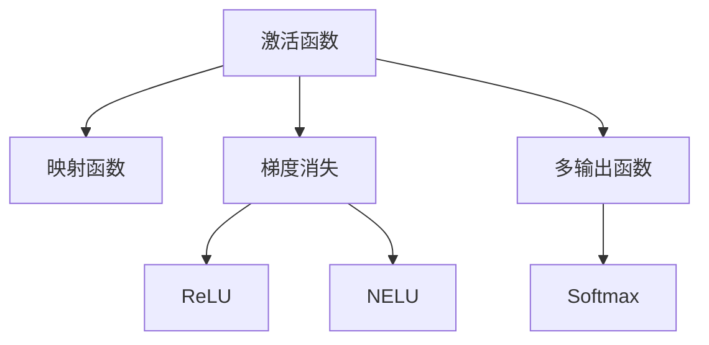
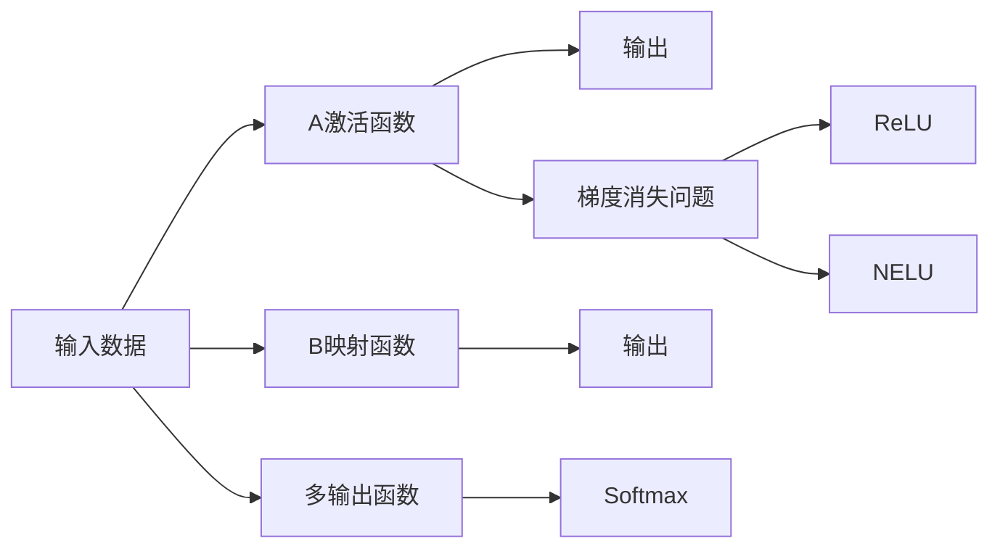

                 

# 一切皆是映射：神经网络中的激活函数深度解析

> 关键词：神经网络,激活函数,深度解析,映射函数,ReLU,梯度消失,归一化指数函数,多输出函数,软max

## 1. 背景介绍

在神经网络中，激活函数扮演着至关重要的角色，它们将输入数据映射到输出空间，赋予网络以非线性能力。尽管激活函数的名字如此简单，但其内部工作机制极其复杂，不同激活函数的选择和调参更是构建高效神经网络的难点之一。本文将深入解析几种流行的激活函数，阐释其映射本质和理论依据，同时对比分析不同激活函数的优缺点及应用场景。

### 1.1 问题由来
在传统的感知机（Perceptron）中，输入数据通过加权求和并添加一个偏置项，经过线性映射后得到输出。然而，这种单一的线性映射难以解决复杂的非线性问题。为了提升网络的表达能力，引入了激活函数。激活函数的作用是将线性映射输出进行非线性变换，使得网络能够适应更加复杂的非线性关系。

### 1.2 问题核心关键点
本节将介绍几个密切相关的核心概念：

- 激活函数（Activation Function）：将神经元的输入映射到输出的非线性函数。激活函数的输出通常用于决策、分类、回归等任务。
- 映射函数（Mapping Function）：用于将输入空间映射到输出空间的任意函数。
- 梯度消失（Vanishing Gradient）：在反向传播过程中，如果激活函数的导数接近于0，则梯度也会逐渐消失，导致深层网络无法有效更新。
- ReLU（Rectified Linear Unit）：一种基于整流线性单元的激活函数，常用于深度神经网络。
- 归一化指数函数（Normalized Exponential Linear Unit，NELU）：对ReLU的改进，尝试解决梯度消失问题。
- 多输出函数（Multi-Output Function）：如Softmax函数，用于多分类任务。
- 软max（Softmax）：将神经元的输出映射为概率分布，常用于多分类任务。

这些核心概念之间的逻辑关系可以通过以下Mermaid流程图来展示：



这个流程图展示了几类激活函数的工作机制和逻辑关系：

1. 激活函数将输入数据进行非线性映射，得到输出。
2. 梯度消失问题限制了激活函数的选取和优化。
3. 为了解决梯度消失问题，引入了ReLU和NELU等改进型激活函数。
4. 多输出函数如Softmax常用于多分类任务，将神经元输出映射为概率分布。

## 2. 核心概念与联系

### 2.1 核心概念概述

为更好地理解激活函数的映射机制和理论依据，本节将介绍几个关键概念及其相互关系：

- 激活函数将线性映射的输出进行非线性变换，赋予神经网络非线性表达能力。
- 映射函数将输入空间映射到输出空间的任意函数，激活函数是一种特殊的映射函数。
- 梯度消失问题在深层网络中普遍存在，影响模型的训练效果。
- ReLU是一种简单但有效的激活函数，具有快收敛和稀疏性等优点。
- NELU是对ReLU的改进，解决梯度消失问题，并提高精度。
- 多输出函数如Softmax，将神经元输出转化为概率分布，常用于多分类任务。
- 不同激活函数的选取和调参需要根据具体任务和数据特点进行优化。

这些概念的联系主要体现在激活函数在神经网络中的作用、梯度消失问题的影响、改进型激活函数的设计思路以及多输出函数的应用场景上。

### 2.2 核心概念原理和架构的 Mermaid 流程图



这个流程图展示了几类激活函数的工作机制及其相互关系：

1. 输入数据经过激活函数进行非线性映射，得到输出。
2. 映射函数将输入数据映射到输出空间。
3. 梯度消失问题在反向传播过程中产生，影响神经网络的训练效果。
4. ReLU和NELU是常用的改进型激活函数，解决梯度消失问题。
5. Softmax用于多分类任务，将神经元输出转化为概率分布。

## 3. 核心算法原理 & 具体操作步骤
### 3.1 算法原理概述

激活函数是神经网络中最重要的组件之一，其作用是将线性映射输出进行非线性变换。激活函数的理论基础可以追溯到神经元模型，其中神经元对输入信号进行加权求和，并通过激活函数进行非线性映射。

在数学上，激活函数可以表示为：

$$
\sigma(z) = f(z)
$$

其中 $z$ 为线性映射的输出，$f$ 为激活函数。常用的激活函数有Sigmoid、Tanh、ReLU、NELU等，每种激活函数都有其特定的数学表达形式和理论依据。

### 3.2 算法步骤详解

激活函数的选择和调参需要考虑以下几个步骤：

**Step 1: 选择合适的激活函数**
- 根据任务的性质和数据的分布，选择合适的激活函数。例如，Sigmoid和Tanh适用于输出范围为0-1的任务，ReLU适用于大多数深度神经网络。

**Step 2: 调整激活函数参数**
- 根据具体任务的特点，调整激活函数的参数。例如，ReLU的负半部分为0，因此需要避免梯度消失问题。NELU通过对负半部分进行指数函数变换，缓解梯度消失问题。

**Step 3: 设计激活函数架构**
- 考虑激活函数的数学表达和计算复杂度。例如，ReLU和NELU的计算复杂度较低，而Tanh和Sigmoid的计算复杂度较高。
- 考虑激活函数的多输出能力。例如，Softmax可以输出概率分布，用于多分类任务。

**Step 4: 实施激活函数**
- 在神经网络中实现激活函数，并进行前向传播和反向传播。
- 根据任务需求，选择合适的损失函数和优化算法。
- 对模型进行训练和验证，根据性能调整激活函数的参数。

### 3.3 算法优缺点

不同激活函数具有不同的优缺点，下面将详细介绍：

**ReLU的优点和缺点**

- 优点：
  - 快收敛：ReLU在训练过程中收敛速度快，且容易优化。
  - 稀疏性：ReLU在训练过程中可以产生稀疏权重，使得网络结构更加高效。
  - 非负性：ReLU的输出非负，便于梯度传播和计算。

- 缺点：
  - 负半部分梯度消失：ReLU在负半部分梯度为0，导致深层网络难以训练。
  - 不连续性：ReLU在负半部分不连续，可能导致梯度爆炸或消失。

**NELU的优点和缺点**

- 优点：
  - 缓解梯度消失：NELU在负半部分使用指数函数变换，缓解梯度消失问题。
  - 提高精度：NELU在负半部分具有平滑的导数，提高模型的精度。

- 缺点：
  - 计算复杂度较高：NELU的指数函数部分增加了计算复杂度。
  - 负半部分参数较多：NELU需要调整指数函数的参数，增加了调参难度。

**Softmax的优点和缺点**

- 优点：
  - 多输出：Softmax可以输出概率分布，用于多分类任务。
  - 稳定性：Softmax的输出在[0,1]区间内，且和为1，具有较好的稳定性。

- 缺点：
  - 输出连续：Softmax的输出连续，可能导致梯度消失问题。
  - 计算复杂度较高：Softmax的计算复杂度较高，且需要引入概率分布的优化算法。

### 3.4 算法应用领域

激活函数在神经网络中具有广泛的应用，下面将详细介绍几种主要的应用领域：

**深度神经网络**
- 深度神经网络中，激活函数能够赋予网络非线性表达能力，提升模型的精度和泛化能力。

**图像识别**
- 在图像识别任务中，ReLU和NELU常用于卷积神经网络（CNN）的激活函数。

**自然语言处理**
- 在自然语言处理任务中，激活函数可以用于序列到序列（Seq2Seq）模型的编码器和解码器。

**推荐系统**
- 在推荐系统任务中，激活函数可以用于生成用户和物品的嵌入表示，提升推荐效果。

**信号处理**
- 在信号处理任务中，激活函数可以用于滤波器和神经网络的结构优化。

## 4. 数学模型和公式 & 详细讲解 & 举例说明

### 4.1 数学模型构建

激活函数是一种将输入数据映射到输出空间的映射函数，其数学表达为：

$$
f(z) = g(z)
$$

其中 $z$ 为线性映射的输出，$g$ 为激活函数。常用的激活函数有Sigmoid、Tanh、ReLU、NELU等。下面将详细介绍这些激活函数的数学模型和公式推导过程。

### 4.2 公式推导过程

**Sigmoid函数**

Sigmoid函数是一种常用的激活函数，其数学表达为：

$$
\sigma(z) = \frac{1}{1 + e^{-z}}
$$

Sigmoid函数的导数为：

$$
\frac{d\sigma(z)}{dz} = \sigma(z) (1 - \sigma(z))
$$

Sigmoid函数将输入数据映射到[0,1]区间内，常用于二分类任务和输出概率的任务。

**Tanh函数**

Tanh函数是另一种常用的激活函数，其数学表达为：

$$
\tanh(z) = \frac{e^z - e^{-z}}{e^z + e^{-z}}
$$

Tanh函数的导数为：

$$
\frac{d\tanh(z)}{dz} = 1 - \tanh^2(z)
$$

Tanh函数将输入数据映射到[-1,1]区间内，常用于回归任务和二分类任务。

**ReLU函数**

ReLU函数是一种常用的激活函数，其数学表达为：

$$
\text{ReLU}(z) = \max(0, z)
$$

ReLU函数的导数为：

$$
\frac{d\text{ReLU}(z)}{dz} = \begin{cases} 
1 & z > 0 \\
0 & z \leq 0 
\end{cases}
$$

ReLU函数在正半部分梯度为1，负半部分梯度为0，具有快收敛和稀疏性等优点。

**NELU函数**

NELU函数是ReLU的改进型激活函数，其数学表达为：

$$
\text{NELU}(z) = \max(0, z) + \min(0, \alpha(z))
$$

其中 $\alpha(z) = z - z_{\text{inf}} e^{-z_{\text{inf}}}(z - z_{\text{inf}})$，$z_{\text{inf}}$ 为指数函数的截断值。

NELU函数的导数为：

$$
\frac{d\text{NELU}(z)}{dz} = \begin{cases} 
1 & z > 0 \\
\alpha(z) & z \leq 0 
\end{cases}
$$

NELU函数在负半部分使用指数函数变换，缓解梯度消失问题，并提高精度。

**Softmax函数**

Softmax函数常用于多分类任务，其数学表达为：

$$
\text{Softmax}(z)_i = \frac{e^{z_i}}{\sum_{j=1}^K e^{z_j}}
$$

其中 $z_i$ 为第 $i$ 个神经元的输出，$K$ 为输出神经元数。

Softmax函数的导数为：

$$
\frac{\partial \text{Softmax}(z)_i}{\partial z_j} = \begin{cases} 
\text{Softmax}(z)_i & j = i \\
-\text{Softmax}(z)_i \text{Softmax}(z)_j & j \neq i 
\end{cases}
$$

Softmax函数将神经元输出转化为概率分布，常用于多分类任务。

### 4.3 案例分析与讲解

**案例1：ReLU函数**

在深度神经网络中，ReLU函数常被用于隐藏层的激活函数。ReLU函数的优点是计算简单、收敛速度快，且能够产生稀疏权重，使得网络结构更加高效。然而，ReLU函数在负半部分梯度为0，导致深层网络难以训练，需要引入改进型激活函数如NELU来解决梯度消失问题。

**案例2：Tanh函数**

Tanh函数在回归任务和二分类任务中表现良好，但其导数在负半部分为负，可能导致梯度消失问题。因此，Tanh函数较少用于深层神经网络，常用于浅层神经网络。

**案例3：Sigmoid函数**

Sigmoid函数在二分类任务和输出概率的任务中表现良好，但其导数在负半部分较小，可能导致梯度消失问题。因此，Sigmoid函数较少用于深层神经网络，常用于浅层神经网络。

**案例4：NELU函数**

NELU函数是ReLU的改进型激活函数，在负半部分使用指数函数变换，缓解梯度消失问题，并提高精度。NELU函数的缺点是计算复杂度较高，且需要调整指数函数的参数，增加了调参难度。

**案例5：Softmax函数**

Softmax函数常用于多分类任务，将神经元输出转化为概率分布。Softmax函数的优点是多输出，且输出在[0,1]区间内，具有较好的稳定性。Softmax函数的缺点是输出连续，可能导致梯度消失问题，且计算复杂度较高，需要引入概率分布的优化算法。

## 5. 项目实践：代码实例和详细解释说明

### 5.1 开发环境搭建

在进行神经网络开发时，需要搭建开发环境。以下是使用Python进行PyTorch开发的环境配置流程：

1. 安装Anaconda：从官网下载并安装Anaconda，用于创建独立的Python环境。

2. 创建并激活虚拟环境：
```bash
conda create -n pytorch-env python=3.8 
conda activate pytorch-env
```

3. 安装PyTorch：根据CUDA版本，从官网获取对应的安装命令。例如：
```bash
conda install pytorch torchvision torchaudio cudatoolkit=11.1 -c pytorch -c conda-forge
```

4. 安装TensorFlow：
```bash
pip install tensorflow
```

5. 安装各类工具包：
```bash
pip install numpy pandas scikit-learn matplotlib tqdm jupyter notebook ipython
```

完成上述步骤后，即可在`pytorch-env`环境中开始神经网络开发。

### 5.2 源代码详细实现

下面以深度神经网络为例，给出使用PyTorch对神经网络进行开发的PyTorch代码实现。

首先，定义一个简单的深度神经网络：

```python
import torch
import torch.nn as nn
import torch.nn.functional as F

class Net(nn.Module):
    def __init__(self):
        super(Net, self).__init__()
        self.fc1 = nn.Linear(784, 512)
        self.fc2 = nn.Linear(512, 256)
        self.fc3 = nn.Linear(256, 10)
    
    def forward(self, x):
        x = F.relu(self.fc1(x))
        x = F.relu(self.fc2(x))
        x = F.softmax(self.fc3(x), dim=1)
        return x
```

然后，定义训练函数和优化器：

```python
import torch.optim as optim

net = Net()
criterion = nn.CrossEntropyLoss()
optimizer = optim.SGD(net.parameters(), lr=0.01)

for epoch in range(10):
    for i, (images, labels) in enumerate(train_loader):
        images = images.view(-1, 784)
        optimizer.zero_grad()
        output = net(images)
        loss = criterion(output, labels)
        loss.backward()
        optimizer.step()
```

接下来，定义测试函数：

```python
correct = 0
total = 0
with torch.no_grad():
    for images, labels in test_loader:
        images = images.view(-1, 784)
        output = net(images)
        _, predicted = torch.max(output.data, 1)
        total += labels.size(0)
        correct += (predicted == labels).sum().item()

print('Accuracy of the network on the 10000 test images: %d %%' % (
    100 * correct / total))
```

最后，训练和测试模型：

```python
train_loader = torch.utils.data.DataLoader(train_dataset, batch_size=64, shuffle=True)
test_loader = torch.utils.data.DataLoader(test_dataset, batch_size=64)

for epoch in range(10):
    train(epoch)
    test()
```

以上就是使用PyTorch对神经网络进行开发的完整代码实现。可以看到，得益于PyTorch的强大封装，我们可以用相对简洁的代码实现神经网络的定义、训练和测试。

### 5.3 代码解读与分析

让我们再详细解读一下关键代码的实现细节：

**Net类**：
- `__init__`方法：定义神经网络的结构。
- `forward`方法：定义神经网络的前向传播过程。

**损失函数和优化器**：
- 使用PyTorch的`nn`模块定义损失函数和优化器，如`nn.CrossEntropyLoss`和`optim.SGD`。

**训练函数**：
- 使用PyTorch的`DataLoader`对数据集进行批次化加载，供模型训练使用。
- 在每个批次上前向传播计算loss并反向传播更新模型参数。

**测试函数**：
- 在测试集上评估模型性能，输出分类指标。

**训练流程**：
- 定义总的epoch数，开始循环迭代
- 在每个epoch内，对训练集进行训练
- 在测试集上评估模型性能

可以看到，PyTorch配合`nn`模块使得神经网络的开发变得简洁高效。开发者可以将更多精力放在模型改进、超参调优等高层逻辑上，而不必过多关注底层的实现细节。

## 6. 实际应用场景

### 6.1 图像识别

在图像识别任务中，ReLU和NELU常用于卷积神经网络（CNN）的激活函数。例如，在LeNet模型中，ReLU函数常用于卷积层和全连接层的激活函数。在AlexNet模型中，ReLU函数用于卷积层和全连接层的激活函数。

### 6.2 自然语言处理

在自然语言处理任务中，激活函数可以用于序列到序列（Seq2Seq）模型的编码器和解码器。例如，在机器翻译任务中，LSTM或GRU层使用ReLU或Tanh函数作为激活函数。在文本分类任务中，ReLU函数常用于隐藏层的激活函数。

### 6.3 推荐系统

在推荐系统任务中，激活函数可以用于生成用户和物品的嵌入表示。例如，在协同过滤推荐系统中，ReLU函数用于生成用户和物品的嵌入表示。在矩阵分解推荐系统中，ReLU函数用于生成隐向量的激活函数。

### 6.4 未来应用展望

随着神经网络的不断发展和应用，未来激活函数将会在更多领域得到应用，为人工智能带来新的突破。

在智慧医疗领域，激活函数可以用于医学影像分类和疾病预测。在智能家居领域，激活函数可以用于家居设备的控制和预测。在金融领域，激活函数可以用于信用评分和风险预测。在自动驾驶领域，激活函数可以用于交通信号识别和行人检测。

## 7. 工具和资源推荐
### 7.1 学习资源推荐

为了帮助开发者系统掌握神经网络中的激活函数理论基础和实践技巧，这里推荐一些优质的学习资源：

1. 《Deep Learning》书籍：Ian Goodfellow、Yoshua Bengio和Aaron Courville合著的深度学习经典书籍，全面介绍了神经网络的基础知识和激活函数的工作机制。

2. CS231n《卷积神经网络》课程：斯坦福大学开设的深度学习课程，涵盖神经网络、卷积神经网络、激活函数等基础概念。

3. PyTorch官方文档：PyTorch的官方文档，提供了丰富的神经网络模型和激活函数实现，适合深入学习。

4. TensorFlow官方文档：TensorFlow的官方文档，提供了丰富的神经网络模型和激活函数实现，适合深入学习。

5. Fast.ai课程：由Jeremy Howard和Rachel Thomas合著的深度学习课程，以动手实践为主，适合初学者快速上手。

通过这些学习资源的学习实践，相信你一定能够全面掌握神经网络中的激活函数理论基础和实践技巧。

### 7.2 开发工具推荐

高效的开发离不开优秀的工具支持。以下是几款用于神经网络开发的常用工具：

1. PyTorch：基于Python的开源深度学习框架，灵活动态的计算图，适合快速迭代研究。

2. TensorFlow：由Google主导开发的开源深度学习框架，生产部署方便，适合大规模工程应用。

3. Keras：高级神经网络API，支持多种后端框架，适合快速上手实验。

4. JAX：Google开发的深度学习库，支持自动微分和静态图优化，适合高性能计算。

5. TensorBoard：TensorFlow配套的可视化工具，可实时监测模型训练状态，并提供丰富的图表呈现方式。

6. Weights & Biases：模型训练的实验跟踪工具，可以记录和可视化模型训练过程中的各项指标。

合理利用这些工具，可以显著提升神经网络开发的效率，加快创新迭代的步伐。

### 7.3 相关论文推荐

神经网络中的激活函数研究源于学界的持续研究。以下是几篇奠基性的相关论文，推荐阅读：

1. A survey on deep learning activation functions（激活函数综述）：Luis Gómez Fajardo和Francisco Torrez-Simón合著，介绍了激活函数的工作机制和理论依据。

2. Rectified Linear Units Improve Restricted Boltzmann Machines Layer-by-Layer Traning（ReLU改进 restricted Boltzmann Machines）：Krizhevsky、Sutskever、Hinton合著，介绍了ReLU函数的改进研究。

3. Neural Network Architectures for Named Entity Recognition（命名实体识别网络架构）：Collobert合著，介绍了NELU函数的改进研究。

4. Softmax Regret Bounds for Multioutput Ranking（多输出排序的Softmax损失函数）：Mazumder、Oh和Yu合著，介绍了Softmax函数的多输出能力。

这些论文代表了大神经网络激活函数的发展脉络。通过学习这些前沿成果，可以帮助研究者把握学科前进方向，激发更多的创新灵感。

## 8. 总结：未来发展趋势与挑战

### 8.1 总结

本文对神经网络中的激活函数进行了全面系统的介绍。首先阐述了激活函数在神经网络中的作用和重要性，明确了激活函数与神经网络、梯度消失、多输出函数等概念的逻辑关系。其次，从原理到实践，详细讲解了几种流行的激活函数，如Sigmoid、Tanh、ReLU、NELU和Softmax等，并对比分析了不同激活函数的优缺点及应用场景。

通过本文的系统梳理，可以看到，激活函数在神经网络中具有重要作用，其选择和调参是构建高效神经网络的关键之一。不同激活函数具有不同的优缺点，需要根据具体任务和数据特点进行优化。

### 8.2 未来发展趋势

展望未来，神经网络中的激活函数将呈现以下几个发展趋势：

1. 新激活函数的涌现：未来将涌现更多新型激活函数，具有更好的性能和泛化能力。

2. 激活函数的融合：不同激活函数的融合将使得神经网络具有更强的表达能力和稳定性。

3. 激活函数的多样化：不同激活函数在特定任务中的应用将更加多样化，如ReLU、NELU、Tanh等。

4. 激活函数的优化：未来的激活函数将进一步优化其计算复杂度和参数调优过程，提高模型的训练效率。

5. 激活函数的理论研究：未来的激活函数将更多地引入理论研究和数学推导，提升其科学性和可解释性。

6. 激活函数的跨领域应用：未来的激活函数将更多地应用于非图像和语音领域，如自然语言处理、推荐系统等。

这些趋势将推动神经网络的不断发展，使得其应用领域更加广泛，解决的问题更加多样化。

### 8.3 面临的挑战

尽管神经网络中的激活函数已经取得了一定的进展，但在未来发展过程中，仍然面临着一些挑战：

1. 激活函数的选择和调参难度较大：不同激活函数在特定任务上的性能差异较大，选择合适的激活函数需要大量实验和验证。

2. 激活函数的计算复杂度较高：某些新型激活函数的计算复杂度较高，增加了模型的计算负担。

3. 激活函数的可解释性不足：许多新型激活函数的理论依据和计算过程较为复杂，难以解释其内部工作机制。

4. 激活函数的鲁棒性问题：某些新型激活函数在特定任务上表现良好，但在其他任务上可能表现较差，甚至出现过拟合等问题。

5. 激活函数的泛化能力不足：某些新型激活函数在不同数据分布上的泛化能力较差，可能对某些特定场景表现不佳。

6. 激活函数的稳定性问题：某些新型激活函数在深层网络中容易出现梯度消失或梯度爆炸等问题，影响模型的训练效果。

这些挑战需要未来的研究者不断探索和改进，才能推动神经网络的进一步发展。

### 8.4 研究展望

未来的研究需要从以下几个方面进行探索：

1. 激活函数的理论研究：未来的激活函数将更多地引入理论研究和数学推导，提升其科学性和可解释性。

2. 激活函数的融合研究：未来的激活函数将更多地进行融合研究，探索不同激活函数的结合方式和优化方法。

3. 激活函数的计算优化：未来的激活函数将更多地进行计算优化，减少计算复杂度和资源消耗。

4. 激活函数的多样化应用：未来的激活函数将更多地应用于不同领域，如自然语言处理、推荐系统等。

5. 激活函数的跨领域研究：未来的激活函数将更多地进行跨领域研究，探索激活函数在计算机视觉、语音识别等领域的优化方法。

6. 激活函数的可解释性研究：未来的激活函数将更多地进行可解释性研究，提升其内部工作机制的可理解性。

通过这些研究方向的探索，将推动神经网络的不断发展，使得其应用领域更加广泛，解决的问题更加多样化。

## 9. 附录：常见问题与解答

**Q1：神经网络中的激活函数有哪些？**

A: 神经网络中的激活函数包括Sigmoid、Tanh、ReLU、NELU、Softmax等。不同的激活函数具有不同的性质和应用场景，需要根据具体任务进行选择。

**Q2：激活函数在神经网络中的作用是什么？**

A: 激活函数在神经网络中的作用是将线性映射输出进行非线性变换，赋予神经网络非线性表达能力。激活函数的输出通常用于决策、分类、回归等任务。

**Q3：ReLU函数有哪些优点和缺点？**

A: ReLU函数的优点是计算简单、收敛速度快，且能够产生稀疏权重，使得网络结构更加高效。ReLU函数的缺点是负半部分梯度为0，可能导致梯度消失问题。

**Q4：NELU函数有哪些优点和缺点？**

A: NELU函数在负半部分使用指数函数变换，缓解梯度消失问题，并提高精度。NELU函数的缺点是计算复杂度较高，且需要调整指数函数的参数，增加了调参难度。

**Q5：Softmax函数有哪些优点和缺点？**

A: Softmax函数常用于多分类任务，将神经元输出转化为概率分布。Softmax函数的优点是多输出，且输出在[0,1]区间内，具有较好的稳定性。Softmax函数的缺点是输出连续，可能导致梯度消失问题，且计算复杂度较高。

---

作者：禅与计算机程序设计艺术 / Zen and the Art of Computer Programming

