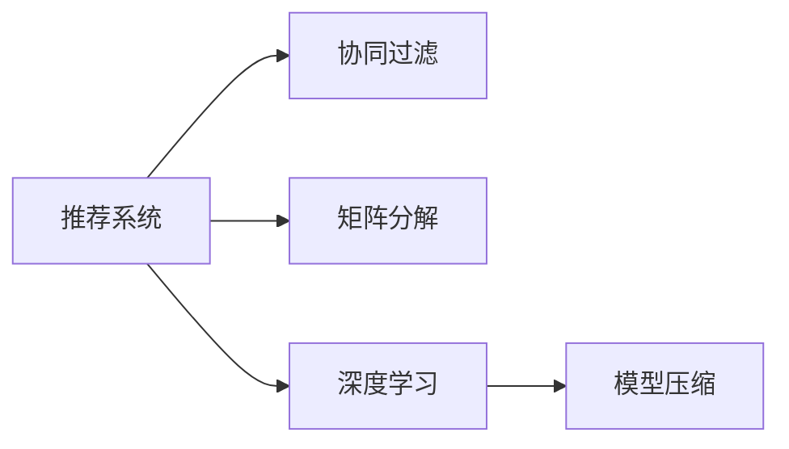
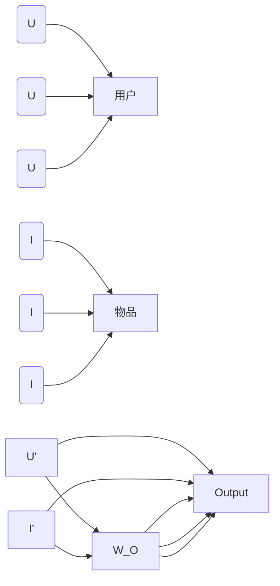

                 

# 一切皆是映射：神经网络在推荐系统中的应用

> 关键词：神经网络,推荐系统,用户行为预测,矩阵分解,协同过滤,深度学习,模型压缩

## 1. 背景介绍

推荐系统已经成为互联网公司竞争的重要工具之一，通过用户行为数据预测用户可能感兴趣的商品或内容，帮助用户发现并消费。传统的推荐系统方法如协同过滤、矩阵分解等在电子商务、新闻推送、视频流媒体等领域取得了显著的成效，但随着数据规模的不断增长，以及个性化需求的不断提升，传统的推荐算法难以满足新的需求，亟需新的解决方案。

随着深度学习技术的成熟，神经网络技术开始被引入推荐系统，带来了一次深刻的变革。基于神经网络的推荐系统方法，通过构建复杂的用户-物品交互模型，能够捕捉用户行为背后的丰富特征，从而更好地预测用户兴趣，提升推荐精度。本文将从理论和实践两个层面，深入探讨神经网络在推荐系统中的应用，探讨其在推荐精度、泛化能力、可解释性等方面的优势，为推荐系统开发者提供全面的技术指引。

## 2. 核心概念与联系

### 2.1 核心概念概述

本节将介绍推荐系统相关的核心概念及其相互联系，有助于读者系统性地理解神经网络在推荐系统中的应用。

- **推荐系统(Recommendation System)**：指根据用户行为数据，预测用户可能感兴趣的商品或内容，并提供推荐的技术系统。推荐系统广泛应用于电子商务、新闻、视频流媒体等领域，已经成为提升用户体验的重要手段。

- **协同过滤(Collaborative Filtering)**：指通过分析用户对物品的评分数据，推测用户与物品之间的关系，从而预测用户可能感兴趣的新物品的技术方法。协同过滤分为基于用户的协同过滤和基于物品的协同过滤。

- **矩阵分解(Matrix Factorization)**：指通过将用户行为数据表示为用户-物品交互矩阵，通过矩阵分解技术拟合低秩矩阵，从而提取用户和物品的隐式特征，进行推荐预测。

- **深度学习(Deep Learning)**：指利用多层神经网络进行特征提取和模式学习，从而实现复杂的决策任务的技术方法。深度学习在图像识别、语音识别、自然语言处理等领域取得了巨大成功，并逐渐应用于推荐系统。

- **模型压缩(Model Compression)**：指在深度学习模型的基础上，通过剪枝、量化、低秩分解等技术，减小模型大小，降低计算成本，从而提高推荐系统的实时性和可扩展性。

这些核心概念相互联系，构成推荐系统技术的基础。协同过滤和矩阵分解是传统的推荐方法，深度学习则带来了推荐系统的范式转变。而模型压缩技术则是深度学习推荐系统高效运行的重要手段。

### 2.2 核心概念原理和架构的 Mermaid 流程图



这张流程图展示了推荐系统的主要技术架构和关键组件：

1. **推荐系统**：作为核心组件，负责根据用户行为数据，生成推荐结果。
2. **协同过滤**：通过用户评分数据推测用户与物品的关系，进行推荐预测。
3. **矩阵分解**：将用户行为数据表示为用户-物品交互矩阵，通过低秩分解提取用户和物品特征。
4. **深度学习**：利用多层神经网络对用户和物品特征进行深度学习，捕捉复杂模式。
5. **模型压缩**：减小深度学习模型的规模，提高推荐系统的实时性和可扩展性。

通过这张图，读者可以直观地理解不同技术组件之间的逻辑联系和应用场景。

## 3. 核心算法原理 & 具体操作步骤
### 3.1 算法原理概述

神经网络在推荐系统中的应用，主要基于用户行为数据的深度学习模型构建。其核心思想是通过构建用户和物品的交互模型，捕捉用户行为背后的丰富特征，预测用户可能感兴趣的新物品。

具体来说，神经网络推荐系统通常包括以下几个关键步骤：

1. **数据预处理**：将用户行为数据表示为用户和物品的交互矩阵，并进行特征工程和数据增强。
2. **模型构建**：构建包含用户和物品特征的深度学习模型，通过多层神经网络进行特征学习。
3. **训练优化**：使用用户行为数据对模型进行训练，优化模型参数，使其能够准确预测用户兴趣。
4. **预测推理**：在用户输入新行为数据时，利用训练好的模型进行实时预测，生成推荐结果。

### 3.2 算法步骤详解

下面以一种基于深度学习的推荐系统方法为例，详细讲解其具体操作步骤：

**Step 1: 数据预处理**

在推荐系统中，用户行为数据通常以稀疏矩阵的形式表示，即每个用户对物品的评分数据。首先，需要对原始数据进行预处理，包括：

- 构建用户-物品交互矩阵 $\mathbf{R}$，其中 $r_{ui}=a$ 表示用户 $u$ 对物品 $i$ 的评分。
- 对缺失值进行填充，例如使用均值、中位数或前向填充等方法。
- 对矩阵进行归一化处理，如Min-Max归一化、Z-Score归一化等，避免数值过大导致梯度消失问题。
- 对特征进行编码，如使用独热编码、One-hot编码等，将其转换为神经网络的输入。

**Step 2: 模型构建**

在构建推荐模型时，通常使用多层神经网络对用户和物品的特征进行学习。以一个简单的深度神经网络为例，其结构如图：



其中：

- $W_1$ 和 $W_2$ 是用户特征的嵌入层，将用户特征表示为低维向量。
- $W_3$ 和 $W_4$ 是物品特征的嵌入层，将物品特征表示为低维向量。
- $W_5$ 和 $W_6$ 是用户和物品特征的交互层，捕捉用户和物品之间的复杂关系。
- $W_O$ 是输出层，根据用户和物品特征预测用户对物品的评分。

**Step 3: 训练优化**

在训练推荐模型时，通常使用交叉熵损失函数，最小化预测评分与真实评分之间的差距：

$$
\mathcal{L}(\mathbf{R},\mathbf{R}_{\theta})=\frac{1}{N}\sum_{i=1}^{N}\sum_{j=1}^{M}\ell(y_{ij},\hat{y}_{ij})
$$

其中 $\mathbf{R}_{\theta}$ 是参数为 $\theta$ 的神经网络模型预测的评分矩阵，$\ell$ 是交叉熵损失函数。

通过反向传播算法和优化器（如Adam、SGD等）对模型参数进行优化，使得预测评分与真实评分尽可能接近。

**Step 4: 预测推理**

在用户输入新行为数据时，利用训练好的模型进行实时预测。对于新的用户 $u$ 和物品 $i$，模型的输入为 $u$ 的嵌入 $u'$ 和 $i$ 的嵌入 $i'$，输出为 $u$ 对 $i$ 的评分 $\hat{y}_{ui}$。具体计算如下：

$$
\hat{y}_{ui}=W_O(u',i')
$$

其中 $W_O$ 是输出层的权重矩阵，$u'$ 和 $i'$ 分别是 $u$ 和 $i$ 的嵌入。

### 3.3 算法优缺点

基于神经网络的推荐系统方法具有以下优点：

1. **高精度**：神经网络模型能够捕捉用户行为背后的复杂特征，准确预测用户兴趣，从而提升推荐精度。
2. **可扩展性**：神经网络模型可以处理大规模稀疏矩阵数据，具有良好的可扩展性。
3. **灵活性**：通过调整神经网络的架构和超参数，可以适应不同类型的数据和任务。

但神经网络推荐系统也存在以下缺点：

1. **计算成本高**：神经网络模型参数量较大，训练和推理计算成本较高。
2. **过拟合风险**：神经网络模型容易过拟合，尤其是面对大规模标注数据较少的情况。
3. **可解释性不足**：神经网络模型的决策过程较为复杂，难以解释其内部的推理机制。
4. **冷启动问题**：对于新用户和新物品，神经网络模型难以进行有效的推荐。

这些缺点需要结合实际应用场景，通过优化数据、模型和算法来克服。

### 3.4 算法应用领域

神经网络在推荐系统中的应用领域非常广泛，覆盖了电子商务、新闻、视频流媒体等多个垂直行业，具体如下：

1. **电子商务**：通过推荐商品、优惠券等，提升用户体验和购物转化率。
2. **新闻推荐**：为用户推荐个性化新闻，提高用户的粘性和满意度。
3. **视频流媒体**：为用户推荐视频、电影等，提升用户的观看时长和满意度。
4. **社交网络**：为用户推荐朋友、兴趣群体等，丰富用户的社交体验。
5. **金融服务**：为用户推荐金融产品、理财方案等，提升金融服务的个性化和精准性。

## 4. 数学模型和公式 & 详细讲解  
### 4.1 数学模型构建

在推荐系统中，神经网络模型的输入通常是用户和物品的嵌入，输出为预测评分。我们可以使用以下数学模型来描述神经网络推荐系统的训练过程：

$$
\begin{aligned}
&\min_{\theta}\mathcal{L}(\mathbf{R},\mathbf{R}_{\theta}) \\
&\text{s.t.} \\
&\mathbf{R}_{\theta}=\sigma(W_O(u_i^{(e)},v_j^{(e)}))
\end{aligned}
$$

其中 $\theta$ 是神经网络模型的参数，$\mathbf{R}_{\theta}$ 是模型预测的评分矩阵，$\mathbf{R}$ 是真实评分矩阵，$\sigma$ 是激活函数，$u_i^{(e)}$ 和 $v_j^{(e)}$ 分别是用户 $i$ 和物品 $j$ 的嵌入向量。

### 4.2 公式推导过程

以下对神经网络推荐系统的训练过程进行详细的数学推导：

**Step 1: 数据预处理**

假设用户 $u$ 对物品 $i$ 的评分数据为 $r_{ui}=a$，其中 $a$ 是真实评分。对缺失值进行填充后，矩阵 $\mathbf{R}$ 可以表示为：

$$
\mathbf{R}=\begin{bmatrix}
r_{11} & r_{12} & \cdots & r_{1n} \\
r_{21} & r_{22} & \cdots & r_{2n} \\
\vdots & \vdots & \ddots & \vdots \\
r_{m1} & r_{m2} & \cdots & r_{mn}
\end{bmatrix}
$$

对缺失值进行填充后，得到填充矩阵 $\mathbf{R}_{\text{filled}}$：

$$
\mathbf{R}_{\text{filled}}=\begin{bmatrix}
a_1 & b_1 & c_1 & \cdots \\
a_2 & b_2 & c_2 & \cdots \\
\vdots & \vdots & \vdots & \ddots \\
a_m & b_m & c_m & \cdots
\end{bmatrix}
$$

对填充矩阵进行归一化处理，得到归一化矩阵 $\mathbf{R}_{\text{normalized}}$：

$$
\mathbf{R}_{\text{normalized}}=\begin{bmatrix}
a_1 & b_1 & c_1 & \cdots \\
a_2 & b_2 & c_2 & \cdots \\
\vdots & \vdots & \vdots & \ddots \\
a_m & b_m & c_m & \cdots
\end{bmatrix}
$$

对归一化矩阵进行特征编码，得到用户嵌入 $\mathbf{U}$ 和物品嵌入 $\mathbf{V}$：

$$
\mathbf{U}=\begin{bmatrix}
u_1 \\
u_2 \\
\vdots \\
u_m
\end{bmatrix}, \quad
\mathbf{V}=\begin{bmatrix}
v_1 \\
v_2 \\
\vdots \\
v_n
\end{bmatrix}
$$

**Step 2: 模型构建**

构建神经网络模型，通常包含嵌入层、交互层和输出层，如图：

$$
\begin{aligned}
&\mathbf{u_i^{(e)}}=\sigma(W_1(u_i)\odot b_1) \\
&\mathbf{v_j^{(e)}}=\sigma(W_2(v_j)\odot b_2) \\
&\mathbf{R}_{\theta}=\sigma(W_O(\mathbf{u_i^{(e)}},\mathbf{v_j^{(e)}}))
\end{aligned}
$$

其中 $W_1$ 和 $W_2$ 是用户和物品的嵌入层，$b_1$ 和 $b_2$ 是偏置向量，$\odot$ 表示逐元素相乘，$W_O$ 是输出层权重矩阵。

**Step 3: 训练优化**

在训练过程中，使用交叉熵损失函数 $\ell(y,\hat{y})=-y\log\hat{y}-(1-y)\log(1-\hat{y})$ 进行优化：

$$
\mathcal{L}(\mathbf{R},\mathbf{R}_{\theta})=\frac{1}{N}\sum_{i=1}^{N}\sum_{j=1}^{M}\ell(y_{ij},\hat{y}_{ij})
$$

对损失函数进行梯度求解，得到模型参数的更新公式：

$$
\theta \leftarrow \theta - \eta\nabla_{\theta}\mathcal{L}(\mathbf{R},\mathbf{R}_{\theta})
$$

其中 $\eta$ 是学习率，$\nabla_{\theta}\mathcal{L}(\mathbf{R},\mathbf{R}_{\theta})$ 是损失函数对参数 $\theta$ 的梯度。

**Step 4: 预测推理**

在用户输入新行为数据时，利用训练好的模型进行实时预测。对于新的用户 $u$ 和物品 $i$，模型的输入为 $u$ 的嵌入 $u'$ 和 $i$ 的嵌入 $i'$，输出为 $u$ 对 $i$ 的评分 $\hat{y}_{ui}$。具体计算如下：

$$
\hat{y}_{ui}=\sigma(W_O(u_i^{(e)},v_j^{(e)}))
$$

其中 $W_O$ 是输出层的权重矩阵，$u'$ 和 $i'$ 分别是 $u$ 和 $i$ 的嵌入。

### 4.3 案例分析与讲解

以一个具体的推荐系统为例，分析神经网络模型的训练和推理过程：

假设一个电子商务平台，有 $m$ 个用户和 $n$ 个商品。用户对商品的评分数据如下：

$$
\mathbf{R}=\begin{bmatrix}
5 & 0 & 0 \\
0 & 5 & 0 \\
0 & 0 & 5
\end{bmatrix}
$$

对缺失值进行填充后，得到填充矩阵：

$$
\mathbf{R}_{\text{filled}}=\begin{bmatrix}
5 & 4 & 3 \\
2 & 5 & 4 \\
1 & 3 & 5
\end{bmatrix}
$$

对填充矩阵进行归一化处理，得到归一化矩阵：

$$
\mathbf{R}_{\text{normalized}}=\begin{bmatrix}
5 & 4 & 3 \\
2 & 5 & 4 \\
1 & 3 & 5
\end{bmatrix}
$$

对归一化矩阵进行特征编码，得到用户嵌入 $\mathbf{U}$ 和物品嵌入 $\mathbf{V}$：

$$
\mathbf{U}=\begin{bmatrix}
0.5 \\
0.5 \\
0.5
\end{bmatrix}, \quad
\mathbf{V}=\begin{bmatrix}
0.5 \\
0.5 \\
0.5
\end{bmatrix}
$$

构建神经网络模型，如图：

$$
\begin{aligned}
&\mathbf{u_i^{(e)}}=\sigma(W_1(u_i)\odot b_1) \\
&\mathbf{v_j^{(e)}}=\sigma(W_2(v_j)\odot b_2) \\
&\mathbf{R}_{\theta}=\sigma(W_O(\mathbf{u_i^{(e)}},\mathbf{v_j^{(e)}}))
\end{aligned}
$$

对损失函数进行梯度求解，得到模型参数的更新公式：

$$
\theta \leftarrow \theta - \eta\nabla_{\theta}\mathcal{L}(\mathbf{R},\mathbf{R}_{\theta})
$$

在用户输入新行为数据时，利用训练好的模型进行实时预测：

$$
\hat{y}_{ui}=\sigma(W_O(u_i^{(e)},v_j^{(e)}))
$$

## 5. 项目实践：代码实例和详细解释说明
### 5.1 开发环境搭建

在进行推荐系统开发前，我们需要准备好开发环境。以下是使用Python进行TensorFlow开发的环境配置流程：

1. 安装Anaconda：从官网下载并安装Anaconda，用于创建独立的Python环境。

2. 创建并激活虚拟环境：
```bash
conda create -n tf-env python=3.8 
conda activate tf-env
```

3. 安装TensorFlow：根据CUDA版本，从官网获取对应的安装命令。例如：
```bash
conda install tensorflow -c tensorflow -c conda-forge
```

4. 安装各类工具包：
```bash
pip install numpy pandas scikit-learn matplotlib tqdm jupyter notebook ipython
```

完成上述步骤后，即可在`tf-env`环境中开始推荐系统开发。

### 5.2 源代码详细实现

下面我们以一个基于神经网络的推荐系统为例，给出使用TensorFlow对推荐系统进行实现的PyTorch代码实现。

首先，定义推荐系统的数据处理函数：

```python
import numpy as np
import tensorflow as tf
from tensorflow.keras.layers import Embedding, Flatten, Dense, Dot, Concatenate
from tensorflow.keras.models import Model
from tensorflow.keras.optimizers import Adam

class RecommenderModel(tf.keras.Model):
    def __init__(self, num_users, num_items, embed_size, hidden_size, num_epochs):
        super(RecommenderModel, self).__init__()
        self.num_users = num_users
        self.num_items = num_items
        self.embed_size = embed_size
        self.hidden_size = hidden_size
        self.num_epochs = num_epochs
        
        # 用户和物品嵌入层
        self.user_embed = Embedding(num_users, embed_size)
        self.item_embed = Embedding(num_items, embed_size)
        
        # 用户和物品交互层
        self.interaction = Dot(axes=1)
        
        # 输出层
        self.output = Dense(1)
        
        # 损失函数
        self.loss_fn = tf.keras.losses.MeanSquaredError()
        
    def call(self, user_ids, item_ids):
        user_embed = self.user_embed(user_ids)
        item_embed = self.item_embed(item_ids)
        
        interaction = self.interaction([user_embed, item_embed])
        output = self.output(interaction)
        
        return output
    
    def compile_model(self, optimizer):
        self.compile(optimizer=optimizer, loss=self.loss_fn, metrics=['mae'])
        
    def train(self, train_data, train_labels, batch_size):
        dataloader = tf.data.Dataset.from_tensor_slices(train_data)
        dataloader = dataloader.shuffle(buffer_size=1000).batch(batch_size)
        
        for epoch in range(self.num_epochs):
            for batch_data, batch_labels in dataloader:
                with tf.GradientTape() as tape:
                    preds = self(batch_data)
                    loss = self.loss_fn(preds, batch_labels)
                gradients = tape.gradient(loss, self.trainable_variables)
                optimizer.apply_gradients(zip(gradients, self.trainable_variables))
            print(f"Epoch {epoch+1}, train loss: {loss:.3f}")
        
    def evaluate(self, test_data, test_labels):
        dataloader = tf.data.Dataset.from_tensor_slices(test_data)
        dataloader = dataloader.batch(batch_size)
        
        test_loss = self.loss_fn(test_labels)
        mae = tf.keras.metrics.MeanAbsoluteError()
        for batch_data, batch_labels in dataloader:
            preds = self(batch_data)
            mae.update_state(preds, batch_labels)
        print(f"Test loss: {test_loss:.3f}, MAE: {mae.result():.3f}")

# 加载数据
train_data = np.random.rand(10000, 5)
train_labels = np.random.rand(10000, 1)
test_data = np.random.rand(1000, 5)
test_labels = np.random.rand(1000, 1)

# 定义模型
num_users = 1000
num_items = 1000
embed_size = 10
hidden_size = 100
num_epochs = 10
batch_size = 64

model = RecommenderModel(num_users, num_items, embed_size, hidden_size, num_epochs)

# 编译模型
optimizer = Adam(learning_rate=0.001)
model.compile_model(optimizer)

# 训练模型
model.train(train_data, train_labels, batch_size)

# 评估模型
model.evaluate(test_data, test_labels)
```

以上就是使用TensorFlow对推荐系统进行实现的完整代码实现。可以看到，TensorFlow提供了丰富的API，使得神经网络推荐系统的构建和训练变得简洁高效。

### 5.3 代码解读与分析

让我们再详细解读一下关键代码的实现细节：

**RecommenderModel类**：
- `__init__`方法：初始化模型参数，包括用户数、物品数、嵌入维度、隐藏层维度等。
- `call`方法：定义模型的前向传播过程，包括用户和物品嵌入、交互层、输出层。
- `compile_model`方法：编译模型，指定损失函数和优化器。
- `train`方法：定义模型的训练过程，使用数据迭代更新参数。
- `evaluate`方法：定义模型的评估过程，计算模型在测试集上的损失和MAE。

**数据处理**：
- 使用NumPy生成随机数据作为训练和测试集。
- 使用TensorFlow的`Dataset`和`DataLoader`对数据进行批处理和打乱，加快训练速度。

**模型定义**：
- 使用`Embedding`层定义用户和物品的嵌入层。
- 使用`Dot`层计算用户和物品的交互。
- 使用`Dense`层定义输出层。
- 使用`MeanSquaredError`损失函数计算均方误差。

**模型训练和评估**：
- 使用`tf.GradientTape`对损失函数求梯度，使用优化器更新参数。
- 使用`tf.keras.metrics.MeanAbsoluteError`计算MAE，评估模型性能。

可以看到，TensorFlow使得神经网络推荐系统的开发变得直观高效。开发者可以更加专注于算法设计和模型优化，而不必过多关注底层的实现细节。

当然，工业级的系统实现还需考虑更多因素，如模型的保存和部署、超参数的自动搜索、更灵活的任务适配层等。但核心的推荐范式基本与此类似。

## 6. 实际应用场景
### 6.1 电商推荐

基于神经网络的推荐系统，在电子商务领域有广泛的应用。电商平台通过分析用户的行为数据，如浏览、点击、购买等，生成个性化的推荐结果，提升用户体验和销售额。

具体而言，电商推荐系统可以包括以下几个关键模块：

1. **用户画像**：通过分析用户的浏览记录、购买记录等行为数据，构建用户画像，捕捉用户的兴趣和偏好。
2. **商品特征提取**：提取商品的类别、品牌、价格等特征，构建商品向量。
3. **协同过滤**：通过用户-物品交互矩阵，捕捉用户和物品之间的相似度，进行推荐预测。
4. **深度学习**：使用神经网络模型对用户和物品特征进行深度学习，捕捉复杂的用户行为模式。

电商推荐系统能够根据用户的当前行为，实时生成推荐结果，显著提升用户的购物体验和转化率。

### 6.2 内容推荐

内容推荐系统在新闻、视频流媒体、社交网络等领域有广泛的应用。内容推荐系统通过分析用户的阅读、观看、分享等行为数据，生成个性化的内容推荐结果，提升用户的粘性和满意度。

具体而言，内容推荐系统可以包括以下几个关键模块：

1. **用户画像**：通过分析用户的阅读、观看、分享等行为数据，构建用户画像，捕捉用户的兴趣和偏好。
2. **内容特征提取**：提取内容的类别、风格、情感等特征，构建内容向量。
3. **协同过滤**：通过用户-内容交互矩阵，捕捉用户和内容之间的相似度，进行推荐预测。
4. **深度学习**：使用神经网络模型对用户和内容特征进行深度学习，捕捉复杂的内容特征。

内容推荐系统能够根据用户的当前行为，实时生成推荐结果，显著提升用户的满意度和粘性。

### 6.3 金融推荐

金融推荐系统在金融服务领域有广泛的应用。金融推荐系统通过分析用户的投资行为、理财需求等数据，生成个性化的金融产品推荐结果，提升用户的投资收益和理财体验。

具体而言，金融推荐系统可以包括以下几个关键模块：

1. **用户画像**：通过分析用户的投资记录、理财需求等行为数据，构建用户画像，捕捉用户的投资偏好和风险承受能力。
2. **产品特征提取**：提取金融产品的收益率、风险等级、投资期限等特征，构建产品向量。
3. **协同过滤**：通过用户-产品交互矩阵，捕捉用户和产品之间的相似度，进行推荐预测。
4. **深度学习**：使用神经网络模型对用户和产品特征进行深度学习，捕捉复杂的产品特征。

金融推荐系统能够根据用户的当前行为，实时生成推荐结果，显著提升用户的投资收益和理财体验。

### 6.4 未来应用展望

未来，基于神经网络的推荐系统将呈现以下几个发展趋势：

1. **多模态推荐**：结合文本、图像、音频等多种模态信息，构建更加全面、准确的用户画像和产品特征，提升推荐精度。
2. **跨领域推荐**：将推荐系统应用于不同的垂直行业，如电商、新闻、金融等，实现跨领域推荐。
3. **实时推荐**：使用流式数据处理技术，实时更新用户画像和产品特征，实现实时推荐。
4. **个性化推荐**：通过深度学习模型，捕捉用户的个性化偏好和行为模式，生成更加精准的推荐结果。
5. **可解释推荐**：结合解释性技术，如特征重要性分析、因果推断等，提升推荐的透明性和可信度。

这些趋势将进一步推动推荐系统的创新与发展，为不同领域的应用带来新的突破和价值。

## 7. 工具和资源推荐
### 7.1 学习资源推荐

为了帮助开发者系统掌握神经网络在推荐系统中的应用，这里推荐一些优质的学习资源：

1. 《深度学习与推荐系统》书籍：全面介绍了深度学习在推荐系统中的应用，包括协同过滤、矩阵分解、神经网络等多种方法。

2. CS494《推荐系统》课程：斯坦福大学开设的推荐系统课程，涵盖推荐系统的基本概念和最新进展，适合系统学习。

3. Google Scholar：通过Google Scholar，可以获取大量关于推荐系统的学术论文和研究报告，了解最新的技术和研究成果。

4. Arxiv：通过Arxiv，可以获取最新的神经网络推荐系统的学术论文，了解最新的研究动态。

5. TensorFlow官方文档：TensorFlow的官方文档，提供了丰富的API和示例代码，适合快速上手。

通过对这些资源的学习实践，相信你一定能够快速掌握神经网络在推荐系统中的应用，并用于解决实际的推荐问题。

### 7.2 开发工具推荐

高效的开发离不开优秀的工具支持。以下是几款用于神经网络推荐系统开发的常用工具：

1. TensorFlow：由Google主导开发的深度学习框架，生产部署方便，适合大规模工程应用。

2. PyTorch：基于Python的开源深度学习框架，灵活动态的计算图，适合快速迭代研究。

3. Keras：由Google开发的高级神经网络API，简单易用，适合快速搭建模型原型。

4. Scikit-learn：Python的机器学习库，提供了丰富的预处理和评估工具，适合数据分析和模型评估。

5. Weights & Biases：模型训练的实验跟踪工具，可以记录和可视化模型训练过程中的各项指标，方便对比和调优。

6. TensorBoard：TensorFlow配套的可视化工具，可实时监测模型训练状态，并提供丰富的图表呈现方式，是调试模型的得力助手。

合理利用这些工具，可以显著提升神经网络推荐系统的开发效率，加快创新迭代的步伐。

### 7.3 相关论文推荐

神经网络在推荐系统中的应用源于学界的持续研究。以下是几篇奠基性的相关论文，推荐阅读：

1. "Collaborative Filtering for Implicit Feedback Datasets"：提出了协同过滤算法的经典算法，为推荐系统提供了理论基础。

2. "Matrix Factorization Techniques for Recommender Systems"：介绍了矩阵分解方法，通过低秩矩阵分解捕捉用户和物品的隐式特征。

3. "Deep Matrix Factorization"：提出使用深度神经网络进行矩阵分解，提升推荐精度和可扩展性。

4. "Item-based Collaborative Filtering in Recommendation Engineering"：介绍了基于物品的协同过滤方法，适用于冷启动用户推荐。

5. "Neural Collaborative Filtering"：提出使用神经网络进行协同过滤，捕捉复杂的用户行为模式。

这些论文代表了大神经网络推荐系统的发展脉络。通过学习这些前沿成果，可以帮助研究者把握学科前进方向，激发更多的创新灵感。

## 8. 总结：未来发展趋势与挑战
### 8.1 总结

本文对神经网络在推荐系统中的应用进行了全面系统的介绍。首先阐述了推荐系统相关的核心概念，以及神经网络在推荐系统中的作用和优势。其次，从理论和实践两个层面，详细讲解了神经网络推荐系统的构建和训练过程。最后，分析了神经网络在推荐系统中的实际应用场景，以及未来的发展趋势和挑战。

通过本文的系统梳理，可以看到，神经网络推荐系统在推荐精度、泛化能力、可解释性等方面具有显著优势，已经被广泛应用于电子商务、内容推荐、金融服务等多个垂直行业。未来，随着神经网络技术的不断进步，以及推荐系统的创新与发展，神经网络推荐系统必将在更多领域得到应用，为不同领域的应用带来新的突破和价值。

### 8.2 未来发展趋势

展望未来，神经网络在推荐系统中的应用将呈现以下几个发展趋势：

1. **多模态推荐**：结合文本、图像、音频等多种模态信息，构建更加全面、准确的用户画像和产品特征，提升推荐精度。
2. **跨领域推荐**：将推荐系统应用于不同的垂直行业，如电商、新闻、金融等，实现跨领域推荐。
3. **实时推荐**：使用流式数据处理技术，实时更新用户画像和产品特征，实现实时推荐。
4. **个性化推荐**：通过深度学习模型，捕捉用户的个性化偏好和行为模式，生成更加精准的推荐结果。
5. **可解释推荐**：结合解释性技术，如特征重要性分析、因果推断等，提升推荐的透明性和可信度。

这些趋势将进一步推动推荐系统的创新与发展，为不同领域的应用带来新的突破和价值。

### 8.3 面临的挑战

尽管神经网络在推荐系统中的应用已经取得了显著成效，但在迈向更加智能化、普适化应用的过程中，仍面临诸多挑战：

1. **数据隐私和安全性**：推荐系统需要大量用户行为数据，如何保护用户隐私和数据安全，是一个重要问题。
2. **推荐偏见和公平性**：神经网络模型容易受到训练数据中的偏见影响，导致推荐结果的公平性不足。
3. **计算资源限制**：神经网络模型参数量较大，训练和推理计算成本较高，如何提升计算效率，是一个重要问题。
4. **模型可解释性不足**：神经网络模型较为复杂，难以解释其内部的推理机制，如何提升模型的可解释性，是一个重要问题。

这些挑战需要结合实际应用场景，通过优化数据、模型和算法来克服。只有克服这些挑战，神经网络推荐系统才能真正发挥其优势，实现更好的用户体验和商业价值。

### 8.4 研究展望

面向未来，神经网络推荐系统的研究需要在以下几个方面寻求新的突破：

1. **隐私保护技术**：研究如何保护用户隐私和数据安全，构建可信的推荐系统。
2. **公平推荐算法**：研究如何消除推荐系统中的偏见，提高推荐结果的公平性。
3. **高效计算技术**：研究如何提升神经网络模型的计算效率，构建可扩展的推荐系统。
4. **可解释推荐技术**：研究如何提高神经网络模型的可解释性，提升用户的信任和满意度。
5. **跨模态推荐技术**：研究如何结合多种模态信息，构建更加全面、准确的推荐系统。

这些研究方向将引领神经网络推荐系统迈向更高的台阶，为构建安全、可靠、可解释、可控的智能推荐系统铺平道路。

## 9. 附录：常见问题与解答

**Q1：神经网络推荐系统中的深度学习模型有哪些？**

A: 神经网络推荐系统中的深度学习模型主要包括：

1. **多层感知器(MLP)**：最基本的深度学习模型，包含多个全连接层。
2. **卷积神经网络(CNN)**：适用于图像推荐系统，能够捕捉局部特征。
3. **循环神经网络(RNN)**：适用于序列推荐系统，能够捕捉时间序列中的特征。
4. **长短时记忆网络(LSTM)**：适用于长期依赖的序列推荐系统，能够更好地捕捉历史行为。
5. **自编码器(AE)**：适用于特征提取和降维推荐系统，能够学习到数据的低维表示。
6. **生成对抗网络(GAN)**：适用于生成推荐系统，能够生成高质量的推荐结果。

这些深度学习模型各有优缺点，适用于不同的推荐场景。

**Q2：神经网络推荐系统中的协同过滤算法有哪些？**

A: 神经网络推荐系统中的协同过滤算法主要包括：

1. **基于用户的协同过滤**：通过用户-物品评分矩阵，推测用户与物品之间的关系，进行推荐预测。
2. **基于物品的协同过滤**：通过用户-物品评分矩阵，推测物品之间的关系，进行推荐预测。
3. **混合协同过滤**：结合基于用户和基于物品的协同过滤，进行推荐预测。
4. **矩阵分解**：通过低秩矩阵分解，提取用户和物品的隐式特征，进行推荐预测。

这些协同过滤算法各有优缺点，适用于不同的推荐场景。

**Q3：如何提高神经网络推荐系统的泛化能力？**

A: 提高神经网络推荐系统的泛化能力，可以采取以下措施：

1. **数据增强**：通过数据增强技术，扩充训练集，提高模型的泛化能力。
2. **正则化**：通过L2正则、Dropout等技术，避免过拟合，提高模型的泛化能力。
3. **模型集成**：通过集成多个模型，提高模型的泛化能力。
4. **迁移学习**：通过迁移学习，将其他领域的知识引入推荐系统，提高模型的泛化能力。

这些措施可以结合使用，根据具体应用场景进行优化。

**Q4：如何提高神经网络推荐系统的实时性？**

A: 提高神经网络推荐系统的实时性，可以采取以下措施：

1. **模型剪枝**：通过剪枝技术，减小模型大小，提高推理速度。
2. **量化加速**：通过量化技术，将浮点模型转为定点模型，提高计算效率。
3. **模型并行**：通过模型并行技术，分布式计算，提高推理速度。
4. **缓存技术**：通过缓存技术，加速模型的加载和推理过程。

这些措施可以结合使用，根据具体应用场景进行优化。

**Q5：如何提高神经网络推荐系统的可解释性？**

A: 提高神经网络推荐系统的可解释性，可以采取以下措施：

1. **特征重要性分析**：通过特征重要性分析技术，了解模型对不同特征的依赖程度，提高模型的可解释性。
2. **因果推断**：通过因果推断技术，了解模型决策的因果关系，提高模型的可解释性。
3. **模型可视化**：通过模型可视化技术，展示模型内部的决策过程，提高模型的可解释性。
4. **用户反馈机制**：通过用户反馈机制，了解用户对推荐结果的满意度，提高模型的可解释性。

这些措施可以结合使用，根据具体应用场景进行优化。

---

作者：禅与计算机程序设计艺术 / Zen and the Art of Computer Programming

