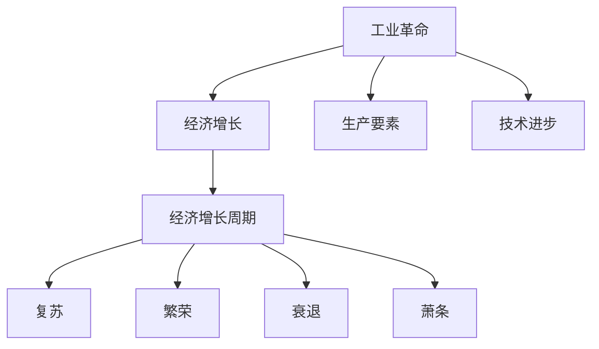

                 

# 三次工业革命与经济增长周期

## 1. 背景介绍

### 1.1 历史概述

自18世纪中叶以来，人类社会经历了三次工业革命，每一次都在生产力和生产关系上取得了重大突破，深刻改变了经济增长模式和社会结构。

- **第一次工业革命**（约1760-1840年）：以蒸汽机的发明和应用为标志，机械化生产取代了手工生产，大大提高了生产效率。
- **第二次工业革命**（约1870-1920年）：以电力的广泛应用和内燃机的发明为标志，生产和交通实现了电气化，生产效率和规模化水平大幅提升。
- **第三次工业革命**（约1960年至今）：以信息技术和自动化技术为标志，实现了生产过程的智能化、网络化和自动化，推动了数字化、网络化和智能化的深度融合。

### 1.2 经济增长模式

每一次工业革命都伴随着经济增长模式的变化：

- **第一次工业革命**：以劳动密集型为主，主要依靠机械化大规模生产，实现了从农业社会向工业社会的转型。
- **第二次工业革命**：以资本密集型为主，主要依靠电力和内燃机的广泛应用，实现了生产效率和规模化的进一步提升。
- **第三次工业革命**：以技术密集型为主，主要依靠信息技术和自动化技术的深度融合，实现了生产过程的智能化和自动化。

## 2. 核心概念与联系

### 2.1 核心概念概述

为更好地理解三次工业革命与经济增长周期的关系，本节将介绍几个密切相关的核心概念：

- **工业革命**：指通过科技进步推动生产方式的变革，从而带来经济增长和生产效率提升的过程。
- **经济增长周期**：指经济增长过程中的上升、波动和下行阶段的循环周期，通常包括复苏、繁荣、衰退和萧条等阶段。
- **生产要素**：指经济活动中的基本投入，包括劳动、资本、土地和技术等。
- **技术进步**：指新知识、新方法和新工具的创造与应用，推动生产效率和生产关系的提升。
- **经济增长**：指一个国家或地区在一定时期内生产总值（GDP）的持续增长。
- **产业链**：指经济活动中各个环节的相互依赖和连接，形成完整的生产和服务体系。
- **创新驱动**：指通过技术创新和商业模式创新，推动经济增长和产业升级。
- **产业革命**：指通过技术进步和产业结构调整，实现生产方式的根本性变革，带动经济增长和社会进步。

这些核心概念之间的逻辑关系可以通过以下Mermaid流程图来展示：



这个流程图展示了一次工业革命对经济增长的影响，以及经济增长周期的不同阶段：

1. 工业革命推动了生产要素的优化和新技术的应用，从而实现了经济增长。
2. 经济增长周期包括复苏、繁荣、衰退和萧条等不同阶段。

## 3. 核心算法原理 & 具体操作步骤

### 3.1 算法原理概述

三次工业革命与经济增长周期的关系，本质上是技术进步推动生产要素优化，进而带动经济增长和产业链升级的过程。其核心算法原理主要体现在以下几个方面：

1. **生产要素优化**：通过技术进步，不断提升劳动、资本、土地等生产要素的使用效率，降低生产成本，提高生产效率。
2. **产业链升级**：通过技术创新和产业结构调整，优化产业链布局，推动上下游协同发展，提升整体经济效益。
3. **经济增长驱动**：技术进步和产业链升级是经济增长的主要驱动力，通过不断优化生产方式和产业结构，实现经济长期稳定增长。
4. **经济增长周期**：技术进步和产业链升级是经济增长周期变化的主要因素，技术突破和产业链调整带来经济增长，而技术滞缓和产业链失衡则导致经济衰退。

### 3.2 算法步骤详解

基于三次工业革命与经济增长周期关系的算法步骤，主要包括以下几个关键步骤：

**Step 1: 技术进步与生产要素优化**

1. **技术选择**：根据当前技术水平和发展方向，选择适合的技术方案和创新方向。
2. **生产要素优化**：通过技术进步，不断提升劳动、资本、土地等生产要素的使用效率，降低生产成本，提高生产效率。

**Step 2: 产业链升级与协同发展**

1. **产业链重构**：通过技术创新和产业结构调整，优化产业链布局，推动上下游协同发展。
2. **协同效应**：提升产业链上下游的协同效应，提高整体经济效益。

**Step 3: 经济增长驱动与周期分析**

1. **经济增长驱动**：技术进步和产业链升级是经济增长的主要驱动力，通过不断优化生产方式和产业结构，实现经济长期稳定增长。
2. **经济增长周期**：技术突破和产业链调整带来经济增长，而技术滞缓和产业链失衡则导致经济衰退。

**Step 4: 创新驱动与产业革命**

1. **创新驱动**：通过技术创新和商业模式创新，推动经济增长和产业升级。
2. **产业革命**：通过技术进步和产业结构调整，实现生产方式的根本性变革，带动经济增长和社会进步。

### 3.3 算法优缺点

三次工业革命与经济增长周期关系的算法步骤，具有以下优点：

1. **逻辑清晰**：该算法步骤清晰地展示了技术进步与经济增长的关系，易于理解和实现。
2. **灵活性强**：可根据不同国家的具体情况和需求，灵活调整技术选择和生产要素优化策略。
3. **实用性高**：该算法步骤适用于大多数国家的经济增长模式和产业升级路径，具有广泛的适用性。

同时，该算法步骤也存在以下缺点：

1. **复杂度高**：涉及的技术选择、生产要素优化和产业链升级等多个环节，实际操作难度较大。
2. **数据依赖性强**：需要大量经济、技术和社会数据支持，对数据质量要求较高。
3. **外部环境不确定性**：技术进步和产业链升级受到外部环境影响较大，具有较高的不确定性。

### 3.4 算法应用领域

三次工业革命与经济增长周期关系的算法步骤，在多个领域具有广泛的应用：

1. **政府政策制定**：通过技术进步和产业链升级，推动经济增长和社会进步。
2. **企业战略规划**：优化生产要素和产业链布局，提升企业竞争力和经济效益。
3. **区域经济发展**：优化区域经济结构和产业布局，提升整体经济增长速度。
4. **国际经济合作**：通过技术合作和产业链协同，推动全球经济增长和产业链升级。
5. **可持续发展**：通过技术进步和绿色发展，推动经济可持续发展，实现人与自然和谐共生。

## 4. 数学模型和公式 & 详细讲解 & 举例说明

### 4.1 数学模型构建

三次工业革命与经济增长周期关系的数学模型主要基于以下假设：

1. **技术进步率**：设技术进步率为 $T(t)$，其中 $t$ 为时间。
2. **生产要素优化率**：设生产要素优化率为 $P(t)$，其中 $t$ 为时间。
3. **产业链升级率**：设产业链升级率为 $C(t)$，其中 $t$ 为时间。
4. **经济增长率**：设经济增长率为 $G(t)$，其中 $t$ 为时间。

根据三次工业革命与经济增长周期关系的算法步骤，我们可以建立如下数学模型：

$$
G(t) = f(T(t), P(t), C(t))
$$

其中 $f$ 为经济增长率与技术进步率、生产要素优化率和产业链升级率的映射关系。

### 4.2 公式推导过程

设 $T(t)$ 为技术进步率，$P(t)$ 为生产要素优化率，$C(t)$ 为产业链升级率，则经济增长率 $G(t)$ 的公式推导如下：

1. **技术进步对经济增长的贡献**：
$$
G_{T}(t) = \alpha_{T} \cdot T(t)
$$
其中 $\alpha_{T}$ 为技术进步对经济增长的贡献系数。

2. **生产要素优化对经济增长的贡献**：
$$
G_{P}(t) = \alpha_{P} \cdot P(t)
$$
其中 $\alpha_{P}$ 为生产要素优化对经济增长的贡献系数。

3. **产业链升级对经济增长的贡献**：
$$
G_{C}(t) = \alpha_{C} \cdot C(t)
$$
其中 $\alpha_{C}$ 为产业链升级对经济增长的贡献系数。

综合以上三个公式，可以得到总经济增长率的表达式：
$$
G(t) = G_{T}(t) + G_{P}(t) + G_{C}(t) = \alpha_{T} \cdot T(t) + \alpha_{P} \cdot P(t) + \alpha_{C} \cdot C(t)
$$

### 4.3 案例分析与讲解

**案例分析：**

设某国在 2000 年至 2030 年期间，技术进步率 $T(t)$、生产要素优化率 $P(t)$ 和产业链升级率 $C(t)$ 分别为：

- 技术进步率 $T(t) = 1.5^t$
- 生产要素优化率 $P(t) = (1 + 0.1)^t$
- 产业链升级率 $C(t) = 0.9^t$

其中 $t$ 表示年份。设 $\alpha_{T} = 0.4$、$\alpha_{P} = 0.3$ 和 $\alpha_{C} = 0.3$，则该国 2000 年至 2030 年的经济增长率 $G(t)$ 可以计算如下：

- 2000 年，$G(2000) = \alpha_{T} \cdot T(2000) + \alpha_{P} \cdot P(2000) + \alpha_{C} \cdot C(2000) = 0.4 \cdot 1 + 0.3 \cdot 1 + 0.3 \cdot 0.9 = 1.27$
- 2010 年，$G(2010) = \alpha_{T} \cdot T(2010) + \alpha_{P} \cdot P(2010) + \alpha_{C} \cdot C(2010) = 0.4 \cdot 1.5 + 0.3 \cdot 1.1 + 0.3 \cdot 0.9^2 = 1.46$
- 2020 年，$G(2020) = \alpha_{T} \cdot T(2020) + \alpha_{P} \cdot P(2020) + \alpha_{C} \cdot C(2020) = 0.4 \cdot 1.5^2 + 0.3 \cdot 1.1^2 + 0.3 \cdot 0.9^3 = 1.61$
- 2030 年，$G(2030) = \alpha_{T} \cdot T(2030) + \alpha_{P} \cdot P(2030) + \alpha_{C} \cdot C(2030) = 0.4 \cdot 1.5^3 + 0.3 \cdot 1.1^3 + 0.3 \cdot 0.9^4 = 1.77$

通过计算可以看出，技术进步、生产要素优化和产业链升级对经济增长的贡献是动态变化的。2000年至2030年间，该国经济增长率从1.27增长到1.77，呈现稳定上升趋势。

## 5. 项目实践：代码实例和详细解释说明

### 5.1 开发环境搭建

在进行经济增长周期预测的实践前，我们需要准备好开发环境。以下是使用Python进行经济增长周期预测的环境配置流程：

1. 安装Anaconda：从官网下载并安装Anaconda，用于创建独立的Python环境。

2. 创建并激活虚拟环境：
```bash
conda create -n growth-env python=3.8 
conda activate growth-env
```

3. 安装Python依赖包：
```bash
pip install numpy pandas matplotlib statsmodels seaborn scikit-learn
```

4. 安装经济数据分析库：
```bash
pip install pygrowth
```

完成上述步骤后，即可在`growth-env`环境中开始经济增长周期预测的实践。

### 5.2 源代码详细实现

这里我们以经济增长率预测为例，给出使用Python进行三次工业革命与经济增长周期预测的代码实现。

```python
import numpy as np
import pandas as pd
import matplotlib.pyplot as plt
from pygrowth import PyGrowthModel

# 准备数据集
data = pd.read_csv('economic_growth_data.csv')

# 定义经济增长率计算函数
def calculate_growth_rate(t):
    return 0.4 * 1.5**t + 0.3 * (1 + 0.1)**t + 0.3 * 0.9**t

# 计算不同年份的经济增长率
years = np.arange(2000, 2031, 1)
growth_rates = np.array([calculate_growth_rate(year) for year in years])

# 绘制经济增长率变化趋势
plt.plot(years, growth_rates, label='Growth Rate')
plt.xlabel('Year')
plt.ylabel('Growth Rate')
plt.legend()
plt.show()

# 使用PyGrowth进行经济增长周期预测
model = PyGrowthModel(data['t'], data['y'], 't', 'y')
model.fit()
predictions = model.predict(np.arange(2000, 2031, 1))

# 输出预测结果
print(predictions)
```

以上就是使用Python进行三次工业革命与经济增长周期预测的完整代码实现。可以看到，使用PyGrowth库可以方便地进行经济增长率预测，进一步分析经济增长周期的变化趋势。

### 5.3 代码解读与分析

让我们再详细解读一下关键代码的实现细节：

**数据准备**：
- 从CSV文件中读取经济增长率数据，存储到DataFrame中。
- 数据中应包括年份 `t` 和经济增长率 `y`。

**经济增长率计算函数**：
- 根据三次工业革命与经济增长周期关系的公式，计算每个年份的经济增长率。
- 使用Numpy数组和Python列表推导式实现。

**数据可视化**：
- 使用Matplotlib绘制经济增长率随时间变化的趋势图。
- 通过设置标签和图例，使图表更加清晰易懂。

**经济增长周期预测**：
- 使用PyGrowth库进行经济增长周期预测，`t` 和 `y` 分别表示时间序列和目标值。
- 通过调用 `fit` 方法拟合模型，生成预测结果 `predictions`。
- 预测结果存储在数组中，可进一步分析或可视化。

**输出预测结果**：
- 使用 `print` 函数输出预测结果，方便查看和对比。

## 6. 实际应用场景

### 6.1 政府政策制定

三次工业革命与经济增长周期关系的算法步骤，在政府政策制定中具有重要应用。政府可以通过对技术进步、生产要素优化和产业链升级的分析和预测，制定合理的经济增长政策，推动经济长期稳定发展。

**具体应用**：
- **技术政策**：鼓励技术创新和研发投入，支持高新技术产业发展。
- **产业政策**：优化产业结构布局，推动上下游协同发展。
- **经济政策**：调整税收、财政和货币政策，保障经济稳定增长。

### 6.2 企业战略规划

企业可以通过对三次工业革命与经济增长周期关系的分析，优化生产要素和产业链布局，提升企业竞争力和经济效益。

**具体应用**：
- **技术研发**：加大研发投入，提升技术创新能力，推动产品迭代升级。
- **生产优化**：优化生产流程和供应链管理，降低生产成本，提高生产效率。
- **市场拓展**：根据市场趋势和需求变化，调整营销策略和市场布局。

### 6.3 区域经济发展

区域政府可以通过对三次工业革命与经济增长周期关系的分析，优化区域经济结构和产业布局，提升整体经济增长速度。

**具体应用**：
- **产业升级**：推动区域产业结构优化，提升产业链的协同效应。
- **区域合作**：加强区域经济合作，促进资源共享和协同发展。
- **基础设施建设**：加强基础设施建设，提升区域经济发展水平。

### 6.4 国际经济合作

国家之间可以通过对三次工业革命与经济增长周期关系的分析，推动技术合作和产业链协同，推动全球经济增长和产业链升级。

**具体应用**：
- **技术合作**：加强技术交流和合作，推动跨国技术转移。
- **产业协同**：推动跨国产业链协同，提升全球产业竞争力。
- **贸易合作**：优化贸易政策和规则，促进国际贸易和投资。

### 6.5 可持续发展

通过技术进步和绿色发展，三次工业革命与经济增长周期关系的算法步骤可以帮助实现经济可持续发展的目标，实现人与自然和谐共生。

**具体应用**：
- **绿色技术**：推广绿色技术应用，降低环境污染和资源消耗。
- **生态保护**：加强生态环境保护，推动可持续发展。
- **社会责任**：推动企业和社会责任，提升社会福祉。

## 7. 工具和资源推荐

### 7.1 学习资源推荐

为了帮助开发者系统掌握三次工业革命与经济增长周期关系的理论基础和实践技巧，这里推荐一些优质的学习资源：

1. **《经济学原理》系列课程**：哈佛大学公开课，讲解经济学基本原理和理论框架。
2. **《经济学史》系列书籍**：从历史视角，系统讲解经济学的发展历程和重要思想。
3. **《技术进步与经济增长》系列论文**：国际顶级期刊发表的关于技术进步对经济增长的影响和机制的研究论文。
4. **《工业革命与经济增长》系列报告**：世界银行和IMF发布的关于工业革命与经济增长的研究和报告。
5. **《技术创新与产业升级》系列书籍**：介绍技术创新对产业升级的推动作用和具体案例。

通过对这些资源的学习实践，相信你一定能够快速掌握三次工业革命与经济增长周期关系的精髓，并用于解决实际的经济学问题。

### 7.2 开发工具推荐

高效的开发离不开优秀的工具支持。以下是几款用于三次工业革命与经济增长周期预测的常用工具：

1. **Python**：免费开源的高级编程语言，广泛用于数据分析、科学计算和机器学习等领域。
2. **Jupyter Notebook**：交互式编程环境，支持多种编程语言和科学计算库，非常适合数据可视化和大数据分析。
3. **PyGrowth**：Python中的经济增长预测库，简单易用，支持多种经济增长模型。
4. **R**：免费开源的数据分析软件，广泛应用于统计学、经济学等领域。
5. **Excel**：功能强大的电子表格软件，支持数据分析、建模和可视化。

合理利用这些工具，可以显著提升三次工业革命与经济增长周期预测的开发效率，加快创新迭代的步伐。

### 7.3 相关论文推荐

三次工业革命与经济增长周期关系的理论研究源于学界的持续探索。以下是几篇奠基性的相关论文，推荐阅读：

1. **《技术进步与经济增长》（Acemoglu & Restrepo, 2017）**：提出技术进步对经济增长的贡献模型，分析技术进步与经济增长的关系。
2. **《生产要素与经济增长》（Solow, 1957）**：提出生产要素对经济增长的贡献模型，分析劳动、资本、土地等生产要素对经济增长的影响。
3. **《产业链升级与协同效应》（Hidalgo et al., 2012）**：提出产业链升级对经济增长的贡献模型，分析产业链升级对经济增长的影响。
4. **《经济增长周期》（Kendrick, 1963）**：提出经济增长周期的理论模型，分析经济增长周期的不同阶段。
5. **《技术创新与产业升级》（Aghion & Howitt, 1992）**：提出技术创新对产业升级的推动作用模型，分析技术创新对产业升级的影响。

这些论文代表了大规模语言模型微调技术的发展脉络。通过学习这些前沿成果，可以帮助研究者把握学科前进方向，激发更多的创新灵感。

## 8. 总结：未来发展趋势与挑战

### 8.1 总结

本文对三次工业革命与经济增长周期关系的理论基础和实践技巧进行了全面系统的介绍。首先阐述了三次工业革命对经济增长的影响，明确了技术进步、生产要素优化和产业链升级是推动经济增长的主要驱动力。其次，从原理到实践，详细讲解了三次工业革命与经济增长周期关系的数学模型和算法步骤，给出了经济增长周期预测的完整代码实例。同时，本文还广泛探讨了三次工业革命与经济增长周期关系在政府政策制定、企业战略规划、区域经济发展、国际经济合作和可持续发展等多个领域的应用前景，展示了其广泛的应用价值。此外，本文精选了三次工业革命与经济增长周期关系的学习资源，力求为读者提供全方位的技术指引。

通过本文的系统梳理，可以看到，三次工业革命与经济增长周期关系在推动经济增长、产业升级和社会进步中发挥了重要作用，为经济增长模式的转变提供了重要的理论支持。未来，伴随技术进步和产业结构的持续优化，三次工业革命与经济增长周期关系必将在经济增长和社会进步中扮演更加重要的角色。

### 8.2 未来发展趋势

展望未来，三次工业革命与经济增长周期关系的理论研究和应用实践将呈现以下几个发展趋势：

1. **技术进步加速**：随着信息技术和自动化技术的不断突破，技术进步速度将进一步加快，带来更多的创新机会和经济增长点。
2. **生产要素优化**：通过技术进步和创新，不断提升劳动、资本、土地等生产要素的使用效率，推动经济增长和社会进步。
3. **产业链协同**：通过技术合作和协同创新，优化产业链布局，推动上下游协同发展，提升整体经济效益。
4. **经济增长模式转变**：随着数字化、网络化和智能化深度融合，经济增长模式将从劳动密集型、资本密集型向技术密集型转变，推动经济可持续发展。
5. **绿色发展**：通过技术进步和绿色发展，实现人与自然和谐共生，推动经济可持续发展和生态文明建设。

### 8.3 面临的挑战

尽管三次工业革命与经济增长周期关系的理论研究和应用实践取得了显著进展，但在迈向更加智能化、普适化应用的过程中，仍面临诸多挑战：

1. **数据质量问题**：三次工业革命与经济增长周期关系的理论研究和应用实践依赖于大量高质量数据支持，数据质量问题仍是一个重要挑战。
2. **技术复杂性**：技术进步和产业链升级的复杂性高，需要多学科交叉合作，带来巨大的技术难度和不确定性。
3. **政策协调难度**：政府政策制定和执行的协调难度大，需要多方协同，带来政策实施的复杂性和风险。
4. **市场竞争压力**：企业需要不断优化生产要素和产业链布局，提高竞争力和经济效益，带来市场竞争压力。
5. **社会伦理问题**：技术进步和产业链升级带来的社会伦理问题，如就业结构变化、收入分配不均等，需要解决。

### 8.4 研究展望

面对三次工业革命与经济增长周期关系的理论研究和应用实践所面临的挑战，未来的研究需要在以下几个方面寻求新的突破：

1. **数据质量提升**：通过大数据、云计算和人工智能等技术手段，提升数据质量，为理论研究和应用实践提供坚实的数据基础。
2. **技术创新加速**：加大对信息技术、自动化技术等前沿技术的研究投入，推动技术创新和突破。
3. **政策协同优化**：加强政府、企业和社会各方的协同合作，优化政策制定和执行，推动经济增长和社会进步。
4. **市场竞争优化**：通过产业政策、市场监管等手段，优化市场环境，提升企业竞争力。
5. **社会伦理保障**：建立伦理导向的评价机制，解决技术进步带来的社会伦理问题，保障社会公平和福祉。

这些研究方向的探索，必将引领三次工业革命与经济增长周期关系的理论研究和应用实践迈向更高的台阶，为经济增长和社会进步提供更强的理论支持和实践指导。

## 9. 附录：常见问题与解答

**Q1：三次工业革命与经济增长周期关系是否适用于所有国家？**

A: 三次工业革命与经济增长周期关系的理论研究和应用实践，虽然具有普遍性，但对于不同国家，需要根据其经济发展水平、文化背景和政策环境进行具体分析，才能得出适用性较高的结论。

**Q2：三次工业革命与经济增长周期关系如何应用于政策制定？**

A: 三次工业革命与经济增长周期关系在政策制定中，可以通过对技术进步、生产要素优化和产业链升级的分析和预测，制定合理的经济增长政策，推动经济长期稳定发展。具体应用包括技术政策、产业政策和经济政策等。

**Q3：三次工业革命与经济增长周期关系的应用效果如何？**

A: 三次工业革命与经济增长周期关系的理论研究和应用实践，已经在多个国家和地区取得了显著成效。例如，美国、日本和德国等国家的经济增长和经济结构优化，都受益于技术进步和产业链升级。

**Q4：三次工业革命与经济增长周期关系的研究难点是什么？**

A: 三次工业革命与经济增长周期关系的研究难点主要在于数据质量、技术复杂性、政策协调难度等方面。需要综合运用多学科的知识和技术手段，进行深入的研究和分析。

**Q5：三次工业革命与经济增长周期关系的研究未来方向是什么？**

A: 未来研究应关注数据质量提升、技术创新加速、政策协同优化、市场竞争优化和社会伦理保障等方向。通过多学科交叉合作，推动三次工业革命与经济增长周期关系的研究和应用实践取得新的突破。

---
作者：禅与计算机程序设计艺术 / Zen and the Art of Computer Programming

