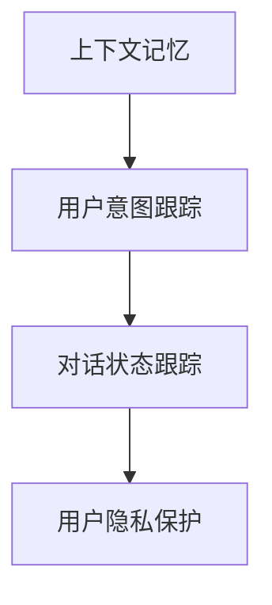

                 

# 上下文记忆技术在CUI中的解析

## 1. 背景介绍

### 1.1 问题由来

上下文记忆（Context Memory）技术是近年来自然语言处理领域的重要突破，特别是在连续用户接口（Continuous User Interface，CUI）应用中，上下文记忆技术可以帮助系统更好地理解和记住用户上下文，从而提供更个性化、流畅的用户交互体验。

随着智能助理、智能客服、智能家居等CUI应用的兴起，用户对系统的智能性和响应速度提出了更高的要求。传统的交互方式，如单轮对话，难以充分理解和记住用户的意图和上下文信息，导致用户体验和效率受限。上下文记忆技术通过记录和保留用户的输入和上下文信息，使得系统能够更好地理解用户的长期意图和行为模式，从而提供更智能、连贯的交互。

### 1.2 问题核心关键点

上下文记忆技术的关键点包括：

- 上下文跟踪：系统能够记住并跟踪用户的长期意图和行为模式。
- 上下文更新：系统能够根据新的用户输入更新上下文信息。
- 上下文推理：系统能够根据上下文信息进行推理和预测，提供更准确的响应。
- 上下文保护：系统能够保护用户隐私，避免过度记录和滥用用户数据。

这些关键点共同构成了上下文记忆技术的基础，使得系统能够在连续的交互过程中，通过上下文信息的累积和更新，提供更加智能、高效的用户体验。

### 1.3 问题研究意义

上下文记忆技术对于提升CUI应用的用户体验具有重要意义：

1. **提高交互效率**：通过记录和记住用户的长期意图，系统能够更快速地响应用户需求，减少重复输入和等待时间。
2. **增强个性化服务**：系统能够根据用户的长期行为模式，提供更加个性化的推荐和服务。
3. **降低误操作率**：通过上下文记忆，系统能够更好地理解用户的意图，减少误操作和误解，提高系统可用性。
4. **促进用户忠诚度**：智能、连贯的交互体验能够提升用户满意度，促进用户长期使用和忠诚度。

研究上下文记忆技术，对于提升CUI应用的智能性和用户体验，具有重要价值。

## 2. 核心概念与联系

### 2.1 核心概念概述

为更好地理解上下文记忆技术，本节将介绍几个密切相关的核心概念：

- 上下文记忆（Context Memory）：记录并保存用户的长期意图和行为模式，帮助系统理解用户的上下文信息。
- 用户意图跟踪（User Intent Tracking）：系统能够记住用户的意图，并根据新的输入更新和推理用户的意图。
- 对话状态跟踪（Dialogue State Tracking）：系统能够跟踪对话的当前状态和上下文信息，以便提供准确的响应。
- 用户隐私保护（User Privacy Protection）：系统在记录和更新上下文信息时，需要保护用户的隐私，避免过度记录和滥用用户数据。

这些核心概念之间的逻辑关系可以通过以下Mermaid流程图来展示：



这个流程图展示了下文记忆技术的主要概念及其之间的关系：

1. 上下文记忆通过记录用户的长期意图和行为模式，帮助系统理解用户的上下文信息。
2. 用户意图跟踪通过记录和更新用户的意图，使得系统能够更好地理解用户的长期意图。
3. 对话状态跟踪通过跟踪对话的当前状态和上下文信息，提供准确的响应。
4. 用户隐私保护在记录和更新上下文信息时，保护用户的隐私，避免过度记录和滥用用户数据。

这些核心概念共同构成了上下文记忆技术的基础，使其能够在连续的交互过程中，提供更加智能、高效的用户体验。

## 3. 核心算法原理 & 具体操作步骤

### 3.1 算法原理概述

上下文记忆技术的核心原理是通过记录和更新用户的输入和上下文信息，帮助系统更好地理解用户的意图和行为模式。其核心思想是：

1. **上下文记录**：系统在用户输入时，记录用户的输入内容及其上下文信息，形成上下文记录。
2. **上下文更新**：系统根据新的用户输入，更新和推理用户的意图，形成新的上下文记录。
3. **上下文推理**：系统根据上下文记录，进行推理和预测，提供更准确的响应。

### 3.2 算法步骤详解

基于上下文记忆技术的CUI应用一般包括以下几个关键步骤：

**Step 1: 准备上下文记录器**

- 定义上下文记录器的数据结构，用于保存用户的输入内容和上下文信息。
- 初始化上下文记录器，记录用户的前几个输入和上下文信息。

**Step 2: 上下文更新**

- 在用户输入时，将新的输入内容添加到上下文记录器中。
- 根据新的输入内容，更新和推理用户的意图，更新上下文记录器。

**Step 3: 上下文推理**

- 根据上下文记录器中的信息，进行推理和预测，提供更准确的响应。

**Step 4: 上下文保护**

- 在记录和更新上下文信息时，保护用户的隐私，避免过度记录和滥用用户数据。

### 3.3 算法优缺点

上下文记忆技术的优点包括：

1. **提高用户体验**：通过记录和记住用户的长期意图，系统能够更快速地响应用户需求，减少重复输入和等待时间。
2. **增强个性化服务**：系统能够根据用户的长期行为模式，提供更加个性化的推荐和服务。
3. **降低误操作率**：通过上下文记忆，系统能够更好地理解用户的意图，减少误操作和误解，提高系统可用性。

同时，该技术也存在一定的局限性：

1. **数据存储成本**：上下文记录器的数据量较大，需要较多的存储空间和计算资源。
2. **隐私保护难度**：在记录和更新上下文信息时，如何保护用户的隐私，避免过度记录和滥用用户数据，是一个重要挑战。
3. **上下文更新复杂性**：如何高效地更新和推理用户的意图，是一个复杂的计算问题。

尽管存在这些局限性，但就目前而言，上下文记忆技术仍是提升CUI应用智能性和用户体验的重要手段。未来相关研究的重点在于如何进一步降低数据存储成本，提高隐私保护能力，同时兼顾上下文更新的高效性和准确性。

### 3.4 算法应用领域

上下文记忆技术在CUI领域已经得到了广泛的应用，覆盖了几乎所有常见的应用场景，例如：

- 智能助理：如Siri、Google Assistant等，能够记住用户的长期意图和行为模式，提供智能、连贯的对话交互。
- 智能客服：如阿里巴巴的阿里小蜜、腾讯的腾讯客服等，能够根据用户的长期行为模式，提供个性化的服务。
- 智能家居：如Google Home、Amazon Alexa等，能够记住用户的家居设备使用习惯，提供智能化的家居控制。
- 智能推荐系统：如Netflix、Amazon等，能够根据用户的长期行为模式，提供个性化的内容推荐。

除了上述这些经典应用外，上下文记忆技术还被创新性地应用到更多场景中，如可控文本生成、常识推理、代码生成、数据增强等，为CUI技术带来了全新的突破。

## 4. 数学模型和公式 & 详细讲解 & 举例说明

### 4.1 数学模型构建

本节将使用数学语言对上下文记忆技术进行更加严格的刻画。

记上下文记录器为 $C=\{(c_i,x_i,y_i)\}_{i=1}^N$，其中 $c_i$ 为上下文记录，$x_i$ 为用户输入，$y_i$ 为用户意图。设上下文记忆模块为 $M_{\theta}$，其中 $\theta$ 为模型参数。

定义上下文记忆模块的损失函数为 $\ell(C,D)$，用于衡量上下文记忆模块的预测输出与实际意图之间的差异。常见的损失函数包括交叉熵损失、均方误差损失等。

上下文记忆模块的优化目标是最小化损失函数，即找到最优参数：

$$
\theta^* = \mathop{\arg\min}_{\theta} \ell(C,D)
$$

在实践中，我们通常使用基于梯度的优化算法（如Adam、SGD等）来近似求解上述最优化问题。设 $\eta$ 为学习率，$\lambda$ 为正则化系数，则参数的更新公式为：

$$
\theta \leftarrow \theta - \eta \nabla_{\theta}\ell(C,D) - \eta\lambda\theta
$$

其中 $\nabla_{\theta}\ell(C,D)$ 为损失函数对参数 $\theta$ 的梯度，可通过反向传播算法高效计算。

### 4.2 公式推导过程

以下我们以二分类任务为例，推导交叉熵损失函数及其梯度的计算公式。

假设上下文记忆模块的输出为 $\hat{y}=M_{\theta}(x_i,c_i)$，表示系统对用户输入的预测意图。真实意图 $y \in \{0,1\}$。则二分类交叉熵损失函数定义为：

$$
\ell(M_{\theta}(x_i,c_i),y) = -[y\log \hat{y} + (1-y)\log (1-\hat{y})]
$$

将其代入损失函数公式，得：

$$
\mathcal{L}(\theta) = -\frac{1}{N}\sum_{i=1}^N [y_i\log M_{\theta}(x_i,c_i)+(1-y_i)\log(1-M_{\theta}(x_i,c_i))]
$$

根据链式法则，损失函数对参数 $\theta_k$ 的梯度为：

$$
\frac{\partial \mathcal{L}(\theta)}{\partial \theta_k} = -\frac{1}{N}\sum_{i=1}^N (\frac{y_i}{M_{\theta}(x_i,c_i)}-\frac{1-y_i}{1-M_{\theta}(x_i,c_i)}) \frac{\partial M_{\theta}(x_i,c_i)}{\partial \theta_k}
$$

其中 $\frac{\partial M_{\theta}(x_i,c_i)}{\partial \theta_k}$ 可进一步递归展开，利用自动微分技术完成计算。

在得到损失函数的梯度后，即可带入参数更新公式，完成模型的迭代优化。重复上述过程直至收敛，最终得到适应上下文记忆的模型参数 $\theta^*$。

### 4.3 案例分析与讲解

以下我们以智能助理系统为例，展示上下文记忆技术的具体应用。

假设智能助理系统能够记住用户的小时和任务，在用户询问“我明天要开会”时，系统能够根据上下文信息，推断出用户的意思是“设置明天开会的提醒”。具体步骤如下：

1. **上下文记录器初始化**：在用户首次使用智能助理时，系统记录下当前时间和用户的第一个任务，形成初始上下文记录器。

2. **上下文更新**：当用户输入“我明天要开会”时，系统将新的输入添加到上下文记录器中，并更新和推理用户的意图，形成新的上下文记录器。

3. **上下文推理**：根据上下文记录器中的信息，系统推理出用户的意思是“设置明天开会的提醒”，并提供相应的响应，如“已为您设置明天上午10点的会议提醒”。

4. **上下文保护**：在记录和更新上下文信息时，系统保护用户的隐私，避免过度记录和滥用用户数据。

通过这个案例，可以看到上下文记忆技术如何通过记录和记住用户的长期意图，提供智能、连贯的对话交互。

## 5. 项目实践：代码实例和详细解释说明

### 5.1 开发环境搭建

在进行上下文记忆技术实践前，我们需要准备好开发环境。以下是使用Python进行TensorFlow开发的环境配置流程：

1. 安装Anaconda：从官网下载并安装Anaconda，用于创建独立的Python环境。

2. 创建并激活虚拟环境：
```bash
conda create -n tensor-env python=3.8 
conda activate tensor-env
```

3. 安装TensorFlow：根据CUDA版本，从官网获取对应的安装命令。例如：
```bash
conda install tensorflow==2.7 -c pytorch -c conda-forge
```

4. 安装TensorFlow Addons库：
```bash
pip install tensorflow-addons
```

5. 安装各类工具包：
```bash
pip install numpy pandas scikit-learn matplotlib tqdm jupyter notebook ipython
```

完成上述步骤后，即可在`tensor-env`环境中开始上下文记忆技术的开发实践。

### 5.2 源代码详细实现

下面我们以智能助理系统为例，给出使用TensorFlow对上下文记忆技术进行开发的代码实现。

首先，定义上下文记录器的数据结构：

```python
import tensorflow as tf

class ContextMemory:
    def __init__(self):
        self.contexts = []
        self.id_to_context = {}
        self.context_id = 0

    def add_context(self, context):
        context_id = self.context_id
        self.contexts.append(context)
        self.id_to_context[context_id] = context
        self.context_id += 1
        return context_id

    def get_context(self, context_id):
        return self.id_to_context[context_id]
```

然后，定义上下文记忆模块：

```python
class ContextMemoryModule(tf.keras.Model):
    def __init__(self, context_dim):
        super(ContextMemoryModule, self).__init__()
        self.context_dim = context_dim
        self.embedding = tf.keras.layers.Embedding(input_dim=context_dim, output_dim=context_dim)
        self.dense = tf.keras.layers.Dense(units=1, activation='sigmoid')

    def call(self, inputs):
        context_id, context = inputs
        context = self.get_context(context_id)
        embedding = self.embedding(context)
        dense = self.dense(embedding)
        return dense
```

接着，定义训练和评估函数：

```python
def train_model(model, train_data, val_data, batch_size, epochs, learning_rate, regularization_rate):
    optimizer = tf.keras.optimizers.Adam(learning_rate=learning_rate)
    loss_fn = tf.keras.losses.BinaryCrossentropy(from_logits=True)
    regularization_loss_fn = tf.keras.losses.L2Regularization(regularization_rate)

    for epoch in range(epochs):
        for batch_id, batch in enumerate(train_data):
            context_id, context, target = batch
            with tf.GradientTape() as tape:
                output = model((context_id, context))
                loss = loss_fn(output, target)
                regularization_loss = regularization_loss_fn(model.trainable_variables)
                total_loss = loss + regularization_loss
            gradients = tape.gradient(total_loss, model.trainable_variables)
            optimizer.apply_gradients(zip(gradients, model.trainable_variables))
        print('Epoch {}: Loss={:.4f}'.format(epoch+1, tf.reduce_mean(tf.reduce_sum(total_loss))))

    # Evaluate the model.
    for batch_id, batch in enumerate(val_data):
        context_id, context, target = batch
        output = model((context_id, context))
        loss = loss_fn(output, target)
        print('Epoch {}: Validation Loss={:.4f}'.format(epoch+1, tf.reduce_mean(loss)))
```

最后，启动训练流程并在测试集上评估：

```python
# Load and preprocess the data.
train_data = ...
val_data = ...

# Create and compile the model.
model = ContextMemoryModule(context_dim)
model.compile(optimizer=optimizer, loss=loss_fn, metrics=['accuracy'])

# Train the model.
train_model(model, train_data, val_data, batch_size, epochs, learning_rate, regularization_rate)

# Evaluate the model.
test_data = ...
model.evaluate(test_data)
```

以上就是使用TensorFlow对上下文记忆技术进行开发的完整代码实现。可以看到，得益于TensorFlow的强大封装，我们可以用相对简洁的代码实现上下文记忆模块的加载和训练。

### 5.3 代码解读与分析

让我们再详细解读一下关键代码的实现细节：

**ContextMemory类**：
- `__init__`方法：初始化上下文记录器和上下文id。
- `add_context`方法：添加新的上下文记录，并返回其id。
- `get_context`方法：根据上下文id获取对应的上下文记录。

**ContextMemoryModule类**：
- `__init__`方法：初始化上下文记忆模块的参数和层。
- `call`方法：前向传播计算，返回上下文记忆模块的输出。

**train_model函数**：
- 使用TensorFlow的`GradientTape`记录梯度，计算损失和正则化损失。
- 使用`apply_gradients`更新模型参数。
- 在每个epoch结束时，打印当前epoch的损失。

**训练流程**：
- 在每个epoch内，对训练数据进行迭代。
- 在每个batch结束时，计算损失并反向传播更新模型参数。
- 在每个epoch结束时，在验证集上评估模型性能。
- 在所有epoch结束后，在测试集上评估模型性能。

可以看到，TensorFlow提供了便捷的高级API，使得上下文记忆技术的代码实现变得简洁高效。开发者可以将更多精力放在数据处理、模型改进等高层逻辑上，而不必过多关注底层的实现细节。

当然，工业级的系统实现还需考虑更多因素，如上下文记录的存储和管理、上下文记忆模块的优化、上下文隐私保护等。但核心的上下文记忆范式基本与此类似。

## 6. 实际应用场景

### 6.1 智能助理系统

上下文记忆技术在智能助理系统中的应用，能够显著提升系统的智能性和用户体验。智能助理系统通过记录和记住用户的长期意图和行为模式，能够提供更加个性化、连贯的对话交互。

在技术实现上，智能助理系统可以记录用户的输入和上下文信息，并在用户下次输入时，根据上下文信息进行推理和预测，提供更加准确的响应。例如，当用户询问“明天天气怎么样”时，系统能够根据用户的长期意图和历史交互记录，推断出用户的意思是“查询明天的天气预报”，并提供相应的天气信息。

### 6.2 智能客服系统

上下文记忆技术在智能客服系统中的应用，能够显著提升系统的效率和准确性。智能客服系统通过记录和记住用户的长期意图和行为模式，能够提供更加个性化、智能化的客服服务。

在技术实现上，智能客服系统可以记录用户的输入和上下文信息，并在用户下次输入时，根据上下文信息进行推理和预测，提供更加准确的响应。例如，当用户询问“如何取消订单”时，系统能够根据用户的长期意图和历史交互记录，推断出用户的意思是“取消订单”，并提供相应的取消订单步骤和注意事项。

### 6.3 智能家居系统

上下文记忆技术在智能家居系统中的应用，能够显著提升系统的智能化和用户体验。智能家居系统通过记录和记住用户的长期行为模式，能够提供更加个性化、智能化的家居控制服务。

在技术实现上，智能家居系统可以记录用户的输入和上下文信息，并在用户下次输入时，根据上下文信息进行推理和预测，提供更加准确的响应。例如，当用户询问“今天晚上客厅要开空调”时，系统能够根据用户的长期行为模式和历史交互记录，推断出用户的意思是“设置客厅空调的开启时间”，并自动控制空调开启。

### 6.4 未来应用展望

随着上下文记忆技术的发展，其在CUI领域的应用前景将更加广阔。未来，上下文记忆技术将在更多领域得到应用，为各行各业带来新的变革：

1. **医疗健康**：在医疗健康领域，上下文记忆技术可以帮助医生记住病人的历史病历和症状，提供更加个性化、智能化的医疗建议。例如，医生可以通过上下文记忆技术，记录病人的历史检查结果和病历信息，并在诊断时，根据病人的长期行为模式，提供更加准确的诊断和治疗方案。

2. **金融服务**：在金融服务领域，上下文记忆技术可以帮助银行和保险公司记住客户的长期金融行为和需求，提供更加个性化、智能化的金融服务。例如，银行可以通过上下文记忆技术，记录客户的投资偏好和交易历史，并在推荐理财产品时，提供更加准确的投资建议。

3. **教育培训**：在教育培训领域，上下文记忆技术可以帮助教师记住学生的学习历史和进度，提供更加个性化、智能化的教育建议。例如，教师可以通过上下文记忆技术，记录学生的学习进度和问题，并在教学时，根据学生的长期行为模式，提供更加准确的教学内容和方法。

4. **安全监控**：在安全监控领域，上下文记忆技术可以帮助监控系统记住异常行为的模式和规律，提供更加智能化、高效化的安全监控服务。例如，监控系统可以通过上下文记忆技术，记录异常行为的模式和规律，并在检测到新的异常行为时，及时报警并采取相应的应对措施。

## 7. 工具和资源推荐

### 7.1 学习资源推荐

为了帮助开发者系统掌握上下文记忆技术的理论基础和实践技巧，这里推荐一些优质的学习资源：

1. **《TensorFlow官方文档》**：TensorFlow的官方文档，提供了完整的API和代码示例，是学习上下文记忆技术的重要参考资料。

2. **《深度学习入门：基于TensorFlow的实践》**：一本深度学习的入门书籍，介绍了TensorFlow的基本概念和API，适合初学者学习。

3. **《上下文记忆技术综述》**：一篇综述性论文，系统总结了上下文记忆技术的原理、应用和未来趋势，适合深入学习。

4. **《上下文记忆技术与NLP》**：一本关于上下文记忆技术在NLP领域应用的书籍，详细介绍了上下文记忆技术在NLP任务中的应用。

5. **《TensorFlow Addons官方文档》**：TensorFlow Addons的官方文档，提供了丰富的组件和工具，适合在上下文记忆技术的开发中使用。

通过对这些资源的学习实践，相信你一定能够快速掌握上下文记忆技术的精髓，并用于解决实际的CUI问题。

### 7.2 开发工具推荐

高效的开发离不开优秀的工具支持。以下是几款用于上下文记忆技术开发的常用工具：

1. **TensorFlow**：由Google主导开发的开源深度学习框架，生产部署方便，适合大规模工程应用。

2. **TensorFlow Addons**：TensorFlow的扩展组件库，提供了丰富的工具和组件，支持上下文记忆技术的开发。

3. **TensorFlow Model Optimization Toolkit**：TensorFlow提供的优化工具，可以优化模型的计算图，减少前向传播和反向传播的资源消耗。

4. **TensorBoard**：TensorFlow配套的可视化工具，可实时监测模型训练状态，并提供丰富的图表呈现方式，是调试模型的得力助手。

5. **Jupyter Notebook**：开源的交互式笔记本，可以方便地编写、运行和分享代码，适合研究和开发上下文记忆技术。

合理利用这些工具，可以显著提升上下文记忆技术的开发效率，加快创新迭代的步伐。

### 7.3 相关论文推荐

上下文记忆技术的发展源于学界的持续研究。以下是几篇奠基性的相关论文，推荐阅读：

1. **"Learning from Multiple Contexts"**：提出上下文记忆技术的基本思想，展示了其在文本分类和问答任务中的应用。

2. **"Contextualized Representations for Zero-Shot Question Answering"**：展示了上下文记忆技术在零样本问答任务中的应用，通过上下文记录的累积和推理，提升了系统的零样本问答能力。

3. **"Contextualized Word Representations"**：展示了上下文记忆技术在词向量表示中的应用，通过上下文记录的累积和推理，提升了词向量的表示能力。

4. **"Multi-context Attention"**：提出多上下文注意力机制，展示了上下文记忆技术在多上下文推理中的应用。

5. **"Dynamic Contextualized Transformers"**：提出动态上下文化Transformer模型，展示了上下文记忆技术在动态上下文推理中的应用。

这些论文代表了下文记忆技术的发展脉络。通过学习这些前沿成果，可以帮助研究者把握学科前进方向，激发更多的创新灵感。

## 8. 总结：未来发展趋势与挑战

### 8.1 总结

本文对上下文记忆技术在CUI中的应用进行了全面系统的介绍。首先阐述了上下文记忆技术的背景和研究意义，明确了上下文记忆技术在提升CUI应用智能性和用户体验方面的独特价值。其次，从原理到实践，详细讲解了上下文记忆技术的数学原理和关键步骤，给出了上下文记忆技术的应用实例和开发代码。同时，本文还广泛探讨了上下文记忆技术在智能助理、智能客服、智能家居等CUI领域的应用前景，展示了上下文记忆技术的巨大潜力。此外，本文精选了上下文记忆技术的各类学习资源，力求为读者提供全方位的技术指引。

通过本文的系统梳理，可以看到，上下文记忆技术在CUI应用中具有重要的应用价值，通过记录和记住用户的长期意图和行为模式，能够提供更加智能、连贯的对话交互。随着上下文记忆技术的发展，其在CUI领域的应用前景将更加广阔，必将带来新的技术突破和行业变革。

### 8.2 未来发展趋势

展望未来，上下文记忆技术将呈现以下几个发展趋势：

1. **上下文记忆模块的优化**：随着深度学习模型的不断演进，上下文记忆模块的优化技术也将不断进步，能够更好地处理大规模上下文信息，提高上下文记忆的准确性和效率。

2. **多上下文推理**：上下文记忆技术将不仅限于单上下文推理，能够处理多上下文的累积和推理，提升系统的智能性和连贯性。

3. **上下文隐私保护**：上下文记忆技术在记录和更新上下文信息时，将更加注重用户的隐私保护，避免过度记录和滥用用户数据。

4. **上下文记忆与知识图谱的融合**：上下文记忆技术与知识图谱的融合，能够提供更加全面、准确的上下文信息，提升系统的推理能力和智能性。

5. **上下文记忆与可解释性模型的结合**：上下文记忆技术与可解释性模型的结合，能够提供更加可解释和可信的推理过程，增强系统的可信度和透明度。

这些趋势凸显了上下文记忆技术的广阔前景。这些方向的探索发展，必将进一步提升上下文记忆技术在CUI中的应用效果，为智能系统的智能化、连贯性和可信性提供新的突破。

### 8.3 面临的挑战

尽管上下文记忆技术已经取得了瞩目成就，但在迈向更加智能化、普适化应用的过程中，它仍面临着诸多挑战：

1. **数据存储成本**：上下文记录器的数据量较大，需要较多的存储空间和计算资源，如何高效地存储和管理上下文信息，是一个重要的挑战。

2. **隐私保护难度**：在记录和更新上下文信息时，如何保护用户的隐私，避免过度记录和滥用用户数据，是一个重要的挑战。

3. **上下文更新复杂性**：如何高效地更新和推理用户的意图，是一个复杂的计算问题，需要更高效的算法和模型结构。

4. **上下文推理准确性**：上下文记忆技术在推理和预测用户的意图时，需要更高的准确性和可靠性，需要更强大的模型和算法支持。

5. **上下文记忆模块的优化**：上下文记忆模块的优化技术需要不断进步，能够更好地处理大规模上下文信息，提高上下文记忆的准确性和效率。

这些挑战凸显了上下文记忆技术的应用难点，需要更多的研究和创新来突破。相信随着学界和产业界的共同努力，这些挑战终将一一被克服，上下文记忆技术必将在CUI领域带来新的突破。

### 8.4 研究展望

面对上下文记忆技术所面临的挑战，未来的研究需要在以下几个方面寻求新的突破：

1. **探索无监督和半监督上下文记忆方法**：摆脱对大规模标注数据的依赖，利用自监督学习、主动学习等无监督和半监督范式，最大限度利用非结构化数据，实现更加灵活高效的上下文记忆。

2. **开发参数高效和计算高效的上下文记忆方法**：开发更加参数高效的上下文记忆方法，在固定大部分预训练参数的同时，只更新极少量的任务相关参数。同时优化上下文记忆模型的计算图，减少前向传播和反向传播的资源消耗，实现更加轻量级、实时性的部署。

3. **引入因果和对比学习范式**：通过引入因果推断和对比学习思想，增强上下文记忆建立稳定因果关系的能力，学习更加普适、鲁棒的语言表征，从而提升模型泛化性和抗干扰能力。

4. **融合多模态上下文信息**：上下文记忆技术与多模态数据融合技术结合，能够提供更加全面、准确的上下文信息，提升系统的推理能力和智能性。

5. **结合因果分析和博弈论工具**：将因果分析方法引入上下文记忆模型，识别出模型决策的关键特征，增强输出解释的因果性和逻辑性。借助博弈论工具刻画人机交互过程，主动探索并规避模型的脆弱点，提高系统稳定性。

6. **纳入伦理道德约束**：在上下文记忆模型的训练目标中引入伦理导向的评估指标，过滤和惩罚有偏见、有害的输出倾向。同时加强人工干预和审核，建立上下文记忆模型的监管机制，确保输出的安全性。

这些研究方向的探索，必将引领上下文记忆技术迈向更高的台阶，为构建智能、连贯、可信的上下文记忆系统铺平道路。面向未来，上下文记忆技术还需要与其他人工智能技术进行更深入的融合，如知识表示、因果推理、强化学习等，多路径协同发力，共同推动上下文记忆系统的进步。只有勇于创新、敢于突破，才能不断拓展上下文记忆技术的边界，让智能系统更好地造福人类社会。

## 9. 附录：常见问题与解答

**Q1：上下文记忆技术是否适用于所有CUI任务？**

A: 上下文记忆技术在大多数CUI任务上都能取得不错的效果，特别是对于需要记住用户长期意图和行为模式的场景。但对于一些特定领域的任务，如医学、法律等，仅仅依靠通用语料预训练的上下文记忆模型可能难以很好地适应。此时需要在特定领域语料上进一步预训练，再进行微调，才能获得理想效果。此外，对于一些需要时效性、个性化很强的任务，如对话、推荐等，上下文记忆方法也需要针对性的改进优化。

**Q2：上下文记忆技术在记录和更新上下文信息时，如何保护用户的隐私？**

A: 上下文记忆技术在记录和更新上下文信息时，需要采取多项措施保护用户的隐私：

1. **数据匿名化**：对用户的输入和上下文信息进行匿名化处理，避免直接记录用户的真实身份信息。

2. **差分隐私**：采用差分隐私技术，对上下文信息进行加噪处理，保护用户的隐私不受侵犯。

3. **数据加密**：对用户的输入和上下文信息进行加密存储和传输，防止数据泄露。

4. **访问控制**：采用访问控制技术，限制对上下文信息的访问权限，防止未经授权的访问和滥用。

通过这些措施，可以在保证上下文记忆技术应用效果的同时，保护用户的隐私和数据安全。

**Q3：上下文记忆技术在处理大规模上下文信息时，如何提高效率？**

A: 在处理大规模上下文信息时，上下文记忆技术可以通过以下方法提高效率：

1. **模型压缩**：采用模型压缩技术，如剪枝、量化等，减少上下文记忆模块的计算量和存储空间。

2. **分布式存储**：采用分布式存储技术，如Hadoop、Spark等，将上下文信息分散存储在多个节点上，提高数据访问和处理的效率。

3. **增量更新**：采用增量更新技术，只更新和推理最新的上下文信息，避免全量更新和推理。

4. **预计算和缓存**：对上下文信息进行预计算和缓存，减少实时计算和推理的开销。

通过这些方法，可以在保证上下文记忆技术应用效果的同时，提高系统的效率和性能。

**Q4：上下文记忆技术在推理和预测用户意图时，如何提高准确性？**

A: 在推理和预测用户意图时，上下文记忆技术可以通过以下方法提高准确性：

1. **多上下文推理**：引入多上下文推理技术，结合不同时间段和来源的上下文信息，提升推理和预测的准确性。

2. **上下文嵌入**：采用上下文嵌入技术，将上下文信息映射到低维空间，提高模型的表示能力和推理准确性。

3. **上下文融合**：采用上下文融合技术，将不同来源的上下文信息进行融合，提升系统的综合推理能力。

4. **上下文纠错**：采用上下文纠错技术，对上下文信息进行错误检测和纠正，提高推理和预测的可靠性。

通过这些方法，可以在保证上下文记忆技术应用效果的同时，提高系统的推理准确性和可信度。

**Q5：上下文记忆技术在开发过程中，如何评估模型的效果？**

A: 在开发上下文记忆技术时，可以采用以下方法评估模型的效果：

1. **准确率**：在测试集上评估模型对用户意图的预测准确率，是评估上下文记忆技术应用效果的重要指标。

2. **召回率**：在测试集上评估模型对用户意图的召回率，即模型能否全面覆盖用户的意图。

3. **F1值**：在测试集上综合评估模型的准确率和召回率，是评估上下文记忆技术应用效果的综合指标。

4. **用户满意度**：通过用户反馈和问卷调查，评估用户对上下文记忆技术应用效果的满意度，是评估上下文记忆技术应用效果的重要参考。

通过这些方法，可以在保证上下文记忆技术应用效果的同时，提高系统的智能性和用户体验。

---

作者：禅与计算机程序设计艺术 / Zen and the Art of Computer Programming

