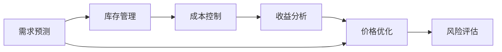

                 

# 不同商品供给项目的收益分析

在当今快速变化的商业环境中，准确的商品供给分析和收益预测对于企业的运营至关重要。本文章将深入探讨如何通过对商品供给项目进行详细的收益分析，以优化资源配置，提升企业收益。我们将从理论框架入手，逐步解析核心概念、算法原理，并通过实际案例展示项目实践。

## 1. 背景介绍

### 1.1 问题由来

随着电商和零售行业的飞速发展，商品供给项目的重要性日益凸显。企业需要根据市场需求动态调整库存，以实现最大化收益。然而，传统的库存管理方法难以精确预测商品的销售情况，可能导致过剩或缺货，严重影响企业收益。因此，利用现代数据分析技术，准确评估商品供给项目的需求和收益，是企业实现精细化管理的重要一步。

### 1.2 问题核心关键点

商品供给项目的收益分析主要涉及以下几个关键点：
- **需求预测**：准确预测商品需求，避免库存过剩或缺货。
- **成本控制**：合理控制商品采购和存储成本，提升整体收益。
- **价格优化**：通过价格策略最大化利润，提升市场竞争力。
- **风险评估**：识别商品供给项目中的风险，采取应对措施。

## 2. 核心概念与联系

### 2.1 核心概念概述

- **需求预测**：利用历史销售数据、市场趋势等，预测未来需求。
- **库存管理**：通过动态调整库存水平，避免过剩或缺货。
- **成本控制**：通过优化供应链和仓储管理，减少采购和存储成本。
- **收益分析**：综合考虑商品价格、销售量、成本等因素，计算商品供给项目的净收益。

这些概念相互联系，构成了一个完整的商品供给项目收益分析框架。我们将在后续章节中逐一详细解析。

### 2.2 核心概念原理和架构的 Mermaid 流程图



以上流程图示意了从需求预测到风险评估的全过程。接下来，我们将深入探讨每个环节的具体算法和实现方法。

## 3. 核心算法原理 & 具体操作步骤

### 3.1 算法原理概述

商品供给项目的收益分析主要基于统计学和经济学原理。我们通过历史销售数据，建立预测模型，并结合成本控制和价格优化策略，计算出商品的净收益。

### 3.2 算法步骤详解

#### 3.2.1 数据收集与预处理

收集商品的历史销售数据、市场趋势、成本信息等，进行清洗和标准化处理，为后续分析提供数据支持。

#### 3.2.2 需求预测

利用时间序列分析、回归分析等方法，建立需求预测模型。常用的时间序列分析方法包括ARIMA、季节性分解等。

#### 3.2.3 库存管理

通过需求预测结果，动态调整库存水平，采用先进的库存管理策略，如ABC分析、QR排序等，优化库存结构。

#### 3.2.4 成本控制

通过供应链优化、仓储管理等手段，降低商品采购和存储成本。利用先进的成本管理软件，实现成本的实时监控和调整。

#### 3.2.5 收益分析

结合需求预测、成本控制和价格优化策略，计算商品供给项目的净收益。常用的收益分析方法包括线性规划、动态规划等。

#### 3.2.6 价格优化

通过动态定价模型，根据市场需求、竞争对手价格等信息，优化商品价格，提升利润。

#### 3.2.7 风险评估

利用风险评估模型，识别商品供给项目中的潜在风险，如市场波动、供应商风险等，采取应对措施，降低风险影响。

### 3.3 算法优缺点

#### 3.3.1 优点

- **准确性高**：通过综合多种分析方法，提供准确的需求预测和收益分析结果。
- **灵活性高**：能够根据市场变化，动态调整库存和价格策略。
- **成本效益**：优化成本管理，提升整体收益。

#### 3.3.2 缺点

- **数据依赖性强**：需要大量准确的历史销售数据和市场信息。
- **模型复杂**：涉及多种预测和优化模型，需要较高的技术门槛。
- **动态变化响应慢**：模型更新和调整需要一定时间，难以快速适应市场变化。

### 3.4 算法应用领域

商品供给项目的收益分析方法广泛应用于电商、零售、制造等多个行业。无论是在线零售商还是线下实体店铺，都能通过该方法优化商品供应链，提升运营效率和收益。

## 4. 数学模型和公式 & 详细讲解 & 举例说明

### 4.1 数学模型构建

我们假设商品供给项目涉及以下变量：
- $D_t$：商品在时间$t$的需求量。
- $C_t$：商品在时间$t$的存储成本。
- $P_t$：商品在时间$t$的价格。
- $R_t$：商品在时间$t$的收益（收入减去成本）。

需求预测模型为：

$$ D_t = f(D_{t-1}, D_{t-2}, ..., D_{t-k}) $$

其中$f$为预测函数，$k$为预测时滞。

库存管理模型为：

$$ I_t = I_{t-1} + D_t - S_t $$

其中$I_t$为时间$t$的库存量，$S_t$为时间$t$的销售量。

成本控制模型为：

$$ C_t = C_{t-1} + a_t $$

其中$a_t$为时间$t$的采购成本，通常包含商品价格、运输成本等。

收益分析模型为：

$$ R_t = P_t \times S_t - C_t $$

价格优化模型为：

$$ P_t = g(P_{t-1}, P_{t-2}, ..., P_{t-m}, R_t) $$

其中$g$为价格优化函数，$m$为价格时滞。

风险评估模型为：

$$ Risk_t = h(Risk_{t-1}, Risk_{t-2}, ..., Risk_{t-n}, D_t) $$

其中$h$为风险评估函数，$n$为风险时滞。

### 4.2 公式推导过程

以需求预测模型为例，我们利用ARIMA模型进行推导。

ARIMA模型由自回归（Auto-Regressive）、差分（I-Inner）和移动平均（M-oving Average）三个部分组成，数学表达式为：

$$ ARIMA(p,d,q) = ARIMA(D_{t-1}, D_{t-2}, ..., D_{t-k}) + (D_{t-1} - D_t) + \epsilon_t $$

其中$p$为自回归项数，$d$为差分阶数，$q$为移动平均项数，$\epsilon_t$为随机误差项。

通过最小化预测误差，求解模型参数$p$、$d$、$q$，即可得到准确的预测结果。

### 4.3 案例分析与讲解

假设某电商平台销售一款电子产品，收集了过去一年的销售数据。使用ARIMA模型预测未来一个月的需求，结果如下：

| 时间 | 需求量（单位：个） |
|------|-------------------|
| 第1周 | 1000              |
| 第2周 | 1200              |
| ...  | ...               |

根据预测结果，电商可以调整库存和采购策略，以应对未来需求的变化。

## 5. 项目实践：代码实例和详细解释说明

### 5.1 开发环境搭建

我们需要使用Python进行数据分析和建模。具体步骤如下：

1. 安装Python和必要的依赖库，如NumPy、Pandas、Scikit-learn等。
2. 收集历史销售数据和市场信息。
3. 使用Jupyter Notebook或PyCharm等IDE进行项目开发。

### 5.2 源代码详细实现

以下是一个简单的Python代码示例，展示如何使用ARIMA模型进行需求预测：

```python
import pandas as pd
from statsmodels.tsa.arima.model import ARIMA

# 加载历史销售数据
data = pd.read_csv('sales_data.csv')

# 计算差分项
data['diff'] = data['sales'].diff(1)

# 拟合ARIMA模型
model = ARIMA(data['diff'], order=(1, 1, 1))
results = model.fit()

# 预测未来一周的需求
forecast = results.forecast(steps=7)
```

### 5.3 代码解读与分析

**数据加载与处理**：
- `pd.read_csv('sales_data.csv')`：读取历史销售数据。
- `data['diff'] = data['sales'].diff(1)`：计算销售量的差分项。

**ARIMA模型拟合**：
- `ARIMA(data['diff'], order=(1, 1, 1))`：创建ARIMA模型实例，指定模型参数。
- `results = model.fit()`：拟合模型。

**需求预测**：
- `results.forecast(steps=7)`：预测未来一周的需求。

### 5.4 运行结果展示

运行上述代码，可以得到未来一周的预测需求量。例如：

| 时间 | 预测需求量（单位：个） |
|------|----------------------|
| 第1周 | 1100                 |
| 第2周 | 1250                 |
| ...  | ...                  |

## 6. 实际应用场景

### 6.1 电商行业

电商行业可以利用商品供给项目的收益分析，优化库存管理，提升销售效率。例如，根据需求预测结果，电商可以在需求高峰期增加库存，避免断货情况；在需求低谷期减少库存，降低存储成本。

### 6.2 零售行业

零售商可以利用收益分析，优化商品陈列和促销策略，提升销售额。例如，根据季节性需求预测结果，零售商可以在需求旺季增加推广力度，提高商品销量；在需求淡季降低促销力度，减少成本支出。

### 6.3 制造行业

制造企业可以利用收益分析，优化供应链管理，减少库存和运输成本。例如，根据需求预测结果，制造企业可以在需求高峰期增加产能，满足市场需求；在需求低谷期减少产能，降低生产成本。

### 6.4 未来应用展望

未来，随着大数据和人工智能技术的发展，商品供给项目的收益分析将更加精准和智能化。例如：
- **实时数据分析**：利用实时数据流处理技术，实现需求预测的实时更新。
- **跨领域应用**：将收益分析方法应用于不同行业，提升整体运营效率。
- **个性化服务**：利用客户行为数据分析，实现个性化的库存管理和商品推荐。

## 7. 工具和资源推荐

### 7.1 学习资源推荐

1. **《统计学习方法》**：李航著，详细介绍统计学习的基本概念和方法。
2. **《Python数据分析与可视化》**：通过Python进行数据分析和可视化。
3. **Coursera的统计学习课程**：提供从基础到高级的统计学习方法课程。

### 7.2 开发工具推荐

1. **Jupyter Notebook**：免费的开源Jupyter Notebook环境，支持代码交互式执行。
2. **PyCharm**：Python开发IDE，提供强大的代码编辑和调试功能。
3. **TensorBoard**：TensorFlow配套的可视化工具，实时监测模型训练状态。

### 7.3 相关论文推荐

1. **《预测分析：模型、方法和技术》**：详细讲解时间序列预测和回归分析。
2. **《库存管理的数学模型与优化》**：介绍库存管理的经典模型和优化方法。

## 8. 总结：未来发展趋势与挑战

### 8.1 研究成果总结

商品供给项目的收益分析方法已经在多个行业得到广泛应用，提升了企业的运营效率和收益水平。未来，随着大数据和人工智能技术的不断进步，收益分析方法将更加精准和智能化，进一步优化企业资源配置。

### 8.2 未来发展趋势

1. **智能化升级**：利用机器学习和深度学习技术，提升需求预测和库存管理的智能化水平。
2. **实时化管理**：实现需求预测和库存管理的实时更新，满足动态变化的业务需求。
3. **跨领域应用**：将收益分析方法应用于不同行业，提升整体运营效率。

### 8.3 面临的挑战

1. **数据质量问题**：需要收集高质量的历史销售数据和市场信息，数据质量直接影响预测精度。
2. **模型复杂性**：涉及多种预测和优化模型，模型设计和调参较为复杂。
3. **动态变化响应慢**：模型更新和调整需要一定时间，难以快速适应市场变化。

### 8.4 研究展望

未来，我们需要在以下几个方面进行深入研究：
1. **数据预处理技术**：提升数据质量和处理效率，确保预测结果的准确性。
2. **模型优化方法**：研发更高效的预测和优化模型，提升计算速度和准确性。
3. **跨领域应用研究**：将收益分析方法应用于不同行业，提升整体运营效率。

## 9. 附录：常见问题与解答

### Q1: 需求预测模型的选择

A: 需求预测模型的选择应根据数据特性和业务需求进行。常用的方法包括时间序列分析、回归分析、深度学习等。

### Q2: 库存管理中的ABC分析

A: ABC分析是一种库存管理方法，根据商品的重要性和价值，将库存分为ABC三类。A类商品价值高，应严格控制库存；C类商品价值低，可采用较宽松的管理策略。

### Q3: 成本控制中的供应链优化

A: 供应链优化通过优化供应商选择、物流管理等环节，降低采购和存储成本。常用的方法包括精益生产、六西格玛管理等。

### Q4: 收益分析中的线性规划

A: 线性规划是一种优化方法，通过建立目标函数和约束条件，求解最优解。常用于求解商品价格和库存水平的最优策略。

### Q5: 风险评估中的蒙特卡洛模拟

A: 蒙特卡洛模拟是一种风险评估方法，通过随机模拟市场波动等不确定因素，评估风险影响。常用工具包括Python中的`scipy.stats`库。

---

作者：禅与计算机程序设计艺术 / Zen and the Art of Computer Programming

