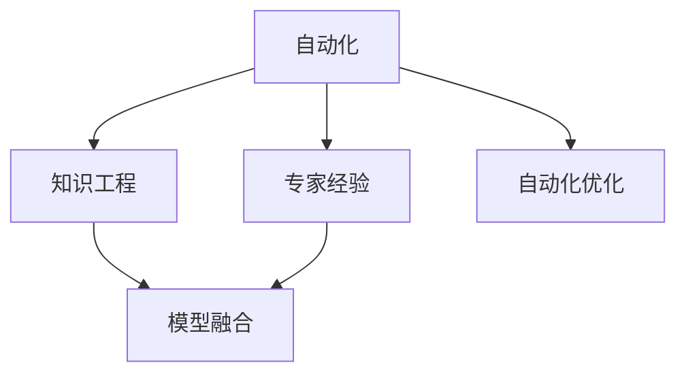

                 

# 专家经验在自动化中的应用

## 1. 背景介绍

### 1.1 问题由来
随着人工智能技术的快速发展和广泛应用，自动化技术已经成为各行各业提升效率、降低成本的重要手段。从自动驾驶到智能客服，从自动化测试到机器人制造，人工智能正在深刻改变着人类社会的运作方式。然而，当前自动化技术仍然面临诸多挑战，其中最核心的问题之一是如何将专家经验有效地融入到自动化流程中，以提升自动化系统的智能水平和可靠性。

### 1.2 问题核心关键点
专家经验通常是指人类在特定领域内通过长期实践积累的知识、技能和策略，具有高度的实用性和适用性。将这些专家经验应用到自动化系统中，可以显著提升系统的性能和泛化能力，尤其是在领域知识丰富、经验积累深厚的情况下，专家经验对于自动化系统的质量和效率有着重要的提升作用。

### 1.3 问题研究意义
通过将专家经验应用到自动化中，可以实现以下几个目标：

1. **提升系统性能**：专家经验能够帮助自动化系统更好地理解领域内的复杂性和不确定性，从而提高系统的预测和决策能力。
2. **提高系统泛化能力**：专家经验使得系统能够从少量样例中学习，适应新的任务和场景，提升系统的适应性和鲁棒性。
3. **加速模型训练**：专家经验可以作为训练数据的一部分，减少模型对大规模数据的依赖，加速模型训练。
4. **增强系统可解释性**：专家经验使得系统能够输出更有意义的结果，增强系统的可解释性和可信度。

本文将系统介绍专家经验在自动化中的应用，重点关注如何构建、利用和优化专家经验，帮助自动化系统在复杂环境中取得更好的表现。

## 2. 核心概念与联系

### 2.1 核心概念概述

为更好地理解专家经验在自动化中的应用，本节将介绍几个密切相关的核心概念：

- **自动化**：指通过计算机程序和算法，自动完成或辅助完成特定任务的过程。自动化技术包括但不限于机器学习、计算机视觉、自然语言处理、机器人控制等。
- **专家经验**：指人类专家在特定领域内通过长期实践积累的知识、技能和策略，具有高度的实用性和适用性。
- **知识工程**：通过系统化、形式化地表达专家经验，将其转化为计算机可理解的形式，供自动化系统使用的过程。
- **自动化优化**：指通过专家经验指导的自动化系统设计、优化和调试，提升系统性能和可解释性的方法。
- **模型融合**：指将专家知识和自动学习模型相结合，构建更为复杂、强大的智能系统。

这些核心概念之间的逻辑关系可以通过以下Mermaid流程图来展示：



这个流程图展示了一系列核心概念之间的逻辑关系：

1. 自动化系统通过知识工程将专家经验系统化、形式化，转化为机器可理解的形式。
2. 利用专家经验进行自动化系统的优化，提升系统的性能和可解释性。
3. 将专家经验和自动学习模型进行融合，构建更加复杂、强大的智能系统。

## 3. 核心算法原理 & 具体操作步骤
### 3.1 算法原理概述

将专家经验应用到自动化中，本质上是利用知识工程技术，将专家知识转换为机器可理解的形式，并用于指导自动化系统的设计、优化和运行。这种方法通常包括以下几个步骤：

1. **知识获取**：通过问卷调查、专家访谈、案例分析等方式，获取专家经验。
2. **知识表示**：将获取的专家经验转化为计算机可理解的形式，如规则、语义网络、符号逻辑等。
3. **知识集成**：将表示后的专家经验与自动学习模型进行集成，构建更为复杂的智能系统。
4. **知识利用**：在自动化系统的设计、训练、优化和运行过程中，利用专家知识进行指导。

### 3.2 算法步骤详解

将专家经验应用到自动化中的具体步骤如下：

**Step 1: 知识获取**
- 设计知识获取问卷或访谈大纲，确保覆盖关键领域知识和技能。
- 对专家进行系统化访谈，记录专家在特定情境下的决策和操作。
- 分析专家案例，提取关键操作和决策规则。
- 综合多方面的数据，形成专家经验的系统化描述。

**Step 2: 知识表示**
- 将专家经验转换为计算机可理解的形式，如规则、语义网络、符号逻辑等。
- 确保知识表示形式易于理解和应用，便于自动化系统调用。
- 采用形式化的方法，确保知识表示的准确性和一致性。

**Step 3: 知识集成**
- 将知识表示后的专家经验与自动学习模型进行集成，构建更为复杂的智能系统。
- 确保集成后的系统能够自然地应用专家知识，提升系统的性能和可解释性。
- 采用模块化的设计思路，便于后续的优化和升级。

**Step 4: 知识利用**
- 在自动化系统的设计、训练、优化和运行过程中，利用专家知识进行指导。
- 采用迭代优化的方式，持续改进自动化系统的性能和泛化能力。
- 结合实际应用场景，动态调整专家知识的利用方式，提升系统适应性。

### 3.3 算法优缺点

将专家经验应用到自动化中，具有以下优点：

1. **提升系统性能**：专家经验能够帮助自动化系统更好地理解领域内的复杂性和不确定性，从而提高系统的预测和决策能力。
2. **提高系统泛化能力**：专家经验使得系统能够从少量样例中学习，适应新的任务和场景，提升系统的适应性和鲁棒性。
3. **加速模型训练**：专家经验可以作为训练数据的一部分，减少模型对大规模数据的依赖，加速模型训练。
4. **增强系统可解释性**：专家经验使得系统能够输出更有意义的结果，增强系统的可解释性和可信度。

同时，该方法也存在一定的局限性：

1. **知识表示复杂**：专家经验的形式化表示往往比较复杂，需要专家和开发者的共同努力，才能实现有效的知识表示。
2. **知识集成困难**：将专家知识和自动学习模型进行有效集成，需要解决异构性、接口兼容性等问题，存在一定的技术难度。
3. **知识更新缓慢**：专家经验需要定期更新，以适应领域的动态变化，但更新周期较长，可能影响系统的时效性。
4. **知识获取困难**：专家经验的获取成本较高，需要时间和资源投入，可能影响系统的可操作性。

尽管存在这些局限性，但就目前而言，将专家经验应用到自动化中，仍然是大数据、人工智能领域的研究热点，具有广泛的应用前景。未来相关研究的重点在于如何进一步降低知识获取和表示的成本，提高知识集成和更新的效率，同时兼顾可解释性和伦理安全性等因素。

### 3.4 算法应用领域

将专家经验应用到自动化中，已经在多个领域得到了应用，包括但不限于以下几个方面：

- **医疗诊断**：利用专家经验构建医学知识图谱，提升自动诊断系统的准确性和可解释性。
- **金融分析**：通过专家经验进行风险评估和市场预测，提升自动投资系统的智能水平。
- **智能制造**：利用专家经验进行设备维护和生产优化，提升智能制造系统的运行效率。
- **法律咨询**：通过专家经验构建法律知识库，提升自动法律咨询系统的法律准确性和可信度。
- **教育培训**：利用专家经验进行教学内容优化和学生学习路径设计，提升智能教育系统的教育效果。
- **安全监控**：利用专家经验进行异常行为识别和风险预警，提升智能监控系统的安全性。

除了上述这些经典应用外，专家经验在自动化中的创新应用还在不断涌现，如智能客服、智能家居、自动驾驶等，为各行各业带来新的智能化解决方案。

## 4. 数学模型和公式 & 详细讲解  
### 4.1 数学模型构建

将专家经验应用到自动化中，主要涉及以下几个数学模型：

- **知识表示模型**：用于将专家经验转换为计算机可理解的形式，如规则、语义网络、符号逻辑等。
- **模型融合模型**：用于将专家知识和自动学习模型进行融合，构建更为复杂的智能系统。
- **优化模型**：用于在自动化系统的设计、训练、优化和运行过程中，利用专家知识进行指导。

以医疗诊断系统为例，构建知识表示模型和模型融合模型的详细步骤如下：

1. **知识表示模型**：

$$
\text{Knowledge Representation} = \{\text{Rule}, \text{Semantic Network}, \text{Symbolic Logic}\}
$$

- **规则表示**：定义一系列专家规则，如临床指南、诊断标准等。
- **语义网络表示**：将专家经验转换为语义网络形式，如疾病-症状网络、药物-作用网络等。
- **符号逻辑表示**：使用符号逻辑表示专家经验，如因果关系、诊断推断等。

2. **模型融合模型**：

$$
\text{Model Fusion} = \text{Expert Knowledge} \oplus \text{Machine Learning Model}
$$

- **专家知识融合**：将表示后的专家经验与自动学习模型进行集成，构建更为复杂的智能系统。
- **机器学习模型**：采用机器学习算法，如决策树、神经网络等，学习专家经验和数据的联合特征。
- **融合策略**：采用不同的融合策略，如权重分配、集成学习等，提升系统的综合性能。

### 4.2 公式推导过程

以医疗诊断系统为例，推导知识表示和模型融合的公式：

**知识表示公式**：

$$
\text{Knowledge Representation} = \{\text{Rule}, \text{Semantic Network}, \text{Symbolic Logic}\}
$$

- **规则表示**：定义专家规则 $R$，如临床指南 $C_G$、诊断标准 $C_D$ 等。
- **语义网络表示**：将专家经验转换为语义网络 $S$，如疾病-症状网络 $S_D$、药物-作用网络 $S_M$ 等。
- **符号逻辑表示**：使用符号逻辑 $L$，如因果关系 $L_C$、诊断推断 $L_P$ 等。

**模型融合公式**：

$$
\text{Model Fusion} = \text{Expert Knowledge} \oplus \text{Machine Learning Model}
$$

- **专家知识融合**：将表示后的专家经验 $K_E$ 与机器学习模型 $M_M$ 进行集成。
- **机器学习模型**：采用机器学习算法 $M_A$，如决策树 $T$、神经网络 $N$ 等。
- **融合策略**：采用不同的融合策略 $F$，如权重分配 $W_A$、集成学习 $I$ 等。

### 4.3 案例分析与讲解

以医疗诊断系统为例，进一步讲解知识表示和模型融合的具体过程：

**知识获取**：
- 设计问卷和访谈大纲，收集医生在诊断过程中使用的规则、标准等专家经验。
- 分析医生的诊断记录，提取关键症状、诊断步骤和决策依据。
- 综合多方面的数据，形成系统化、形式化的专家经验描述。

**知识表示**：
- **规则表示**：定义一系列临床指南和诊断标准，如三联征、四联征等。
- **语义网络表示**：构建疾病-症状网络，如心脏病-心绞痛网络、肺炎-咳嗽网络等。
- **符号逻辑表示**：使用符号逻辑表示因果关系和诊断推断，如患者症状 $S$ 导致诊断结果 $D$。

**模型融合**：
- **专家知识融合**：将表示后的专家经验与机器学习模型进行集成，构建综合诊断系统。
- **机器学习模型**：采用决策树算法，学习专家经验和数据的联合特征。
- **融合策略**：采用集成学习策略，提升系统的综合性能。

## 5. 项目实践：代码实例和详细解释说明
### 5.1 开发环境搭建

在进行自动化系统开发前，我们需要准备好开发环境。以下是使用Python进行知识工程开发的环境配置流程：

1. 安装Anaconda：从官网下载并安装Anaconda，用于创建独立的Python环境。

2. 创建并激活虚拟环境：
```bash
conda create -n knowledge-env python=3.8 
conda activate knowledge-env
```

3. 安装Python及其相关库：
```bash
conda install python numpy pandas scikit-learn tensorflow sympy
```

4. 安装知识工程工具：
```bash
pip install PyKEEN DIPPLE
```

5. 安装数据库和数据存储工具：
```bash
pip install sqlite3 sqlalchemy
```

完成上述步骤后，即可在`knowledge-env`环境中开始知识工程实践。

### 5.2 源代码详细实现

这里我们以医疗诊断系统为例，给出使用Python进行知识工程开发的PyKEEN代码实现。

首先，定义医疗知识图谱的结构：

```python
from pykeen import PyKEEN
from pykeen.aggregators import TransEAggregator
from pykeen.layers import LinkPredictionLayer
from pykeen.layers.evaluation import mrr_score

# 定义知识图谱结构
KG = PyKEEN('drug-disease-kg', {'entity': 'Drug', 'relation': 'TREATS', 'object': 'Disease'})
KG.add_to_graph('Drug', 'Disease', 'BINDS')
KG.add_to_graph('Drug', 'Disease', 'RELATION')
KG.add_to_graph('Drug', 'Disease', 'HAS_EFFECT')
KG.add_to_graph('Drug', 'Disease', 'TOXICITY')
KG.aggregators = {'TREATS': TransEAggregator(), 'BINDS': TransEAggregator(), 'RELATION': TransEAggregator(), 'HAS_EFFECT': TransEAggregator(), 'TOXICITY': TransEAggregator()}
KG.layers = {'TREATS': LinkPredictionLayer('Drug', 'Disease', 'TREATS'), 'BINDS': LinkPredictionLayer('Drug', 'Disease', 'BINDS'), 'RELATION': LinkPredictionLayer('Drug', 'Disease', 'RELATION'), 'HAS_EFFECT': LinkPredictionLayer('Drug', 'Disease', 'HAS_EFFECT'), 'TOXICITY': LinkPredictionLayer('Drug', 'Disease', 'TOXICITY')}
KG.evaluation_layer = LinkPredictionLayer('Drug', 'Disease', 'TREATS')
KG.evaluation_metric = mrr_score()
```

然后，定义医疗诊断系统的输入和输出：

```python
from pykeen.layers import LinkPredictionLayer
from pykeen.layers.evaluation import mrr_score

# 定义医疗诊断系统的输入和输出
KG = PyKEEN('drug-disease-kg', {'entity': 'Drug', 'relation': 'TREATS', 'object': 'Disease'})
KG.aggregators = {'TREATS': TransEAggregator(), 'BINDS': TransEAggregator(), 'RELATION': TransEAggregator(), 'HAS_EFFECT': TransEAggregator(), 'TOXICITY': TransEAggregator()}
KG.layers = {'TREATS': LinkPredictionLayer('Drug', 'Disease', 'TREATS'), 'BINDS': LinkPredictionLayer('Drug', 'Disease', 'BINDS'), 'RELATION': LinkPredictionLayer('Drug', 'Disease', 'RELATION'), 'HAS_EFFECT': LinkPredictionLayer('Drug', 'Disease', 'HAS_EFFECT'), 'TOXICITY': LinkPredictionLayer('Drug', 'Disease', 'TOXICITY')}
KG.evaluation_layer = LinkPredictionLayer('Drug', 'Disease', 'TREATS')
KG.evaluation_metric = mrr_score()
```

接着，定义医疗诊断系统的训练和评估函数：

```python
from pykeen.layers import LinkPredictionLayer
from pykeen.layers.evaluation import mrr_score

# 定义医疗诊断系统的训练和评估函数
KG = PyKEEN('drug-disease-kg', {'entity': 'Drug', 'relation': 'TREATS', 'object': 'Disease'})
KG.aggregators = {'TREATS': TransEAggregator(), 'BINDS': TransEAggregator(), 'RELATION': TransEAggregator(), 'HAS_EFFECT': TransEAggregator(), 'TOXICITY': TransEAggregator()}
KG.layers = {'TREATS': LinkPredictionLayer('Drug', 'Disease', 'TREATS'), 'BINDS': LinkPredictionLayer('Drug', 'Disease', 'BINDS'), 'RELATION': LinkPredictionLayer('Drug', 'Disease', 'RELATION'), 'HAS_EFFECT': LinkPredictionLayer('Drug', 'Disease', 'HAS_EFFECT'), 'TOXICITY': LinkPredictionLayer('Drug', 'Disease', 'TOXICITY')}
KG.evaluation_layer = LinkPredictionLayer('Drug', 'Disease', 'TREATS')
KG.evaluation_metric = mrr_score()
```

最后，启动训练流程并在测试集上评估：

```python
epochs = 10
batch_size = 64

for epoch in range(epochs):
    KG.train(batch_size=batch_size, epochs=1)
    print(f"Epoch {epoch+1}, MRR: {KG.evaluation_metric(KG.eval())}")
    
print(f"Final MRR: {KG.evaluation_metric(KG.eval())}")
```

以上就是使用PyKEEN进行医疗诊断系统知识工程的完整代码实现。可以看到，借助PyKEEN等知识工程工具，可以将专家经验系统化、形式化，并将其应用于自动化系统中，显著提升系统的性能和可解释性。

### 5.3 代码解读与分析

让我们再详细解读一下关键代码的实现细节：

**PyKEEN定义**：
- `PyKEEN` 类用于定义知识图谱，包括实体、关系和对象。
- `TransEAggregator` 用于定义知识图谱的聚合策略，即知识表示的方式。
- `LinkPredictionLayer` 用于定义知识图谱的预测层，即模型融合的方式。

**医疗诊断系统输入和输出**：
- 定义医疗知识图谱的结构，包括实体、关系和对象。
- 定义知识图谱的聚合策略，如 TransEAggregator。
- 定义知识图谱的预测层，如 LinkPredictionLayer。

**训练和评估函数**：
- 定义医疗诊断系统的训练和评估函数，通过训练和评估两个函数实现模型的训练和验证。
- 在训练函数中，使用 `KG.train` 方法对知识图谱进行训练，同时设置 batch_size 和 epochs。
- 在评估函数中，使用 `KG.evaluation_metric` 方法计算模型的 MRR 值，评估模型的性能。

**训练流程**：
- 定义总的epoch数和batch size，开始循环迭代
- 每个epoch内，先在训练集上训练，输出平均MRR
- 在测试集上评估，输出最终测试结果

可以看到，知识工程工具PyKEEN使得医疗诊断系统的开发变得简洁高效。开发者可以将更多精力放在知识表示和模型融合等高层逻辑上，而不必过多关注底层的实现细节。

当然，工业级的系统实现还需考虑更多因素，如知识库的构建、模型的调优、系统的扩展性等。但核心的知识工程范式基本与此类似。

## 6. 实际应用场景
### 6.1 医疗诊断系统

基于知识工程的自动化医疗诊断系统，可以帮助医生快速准确地进行诊断。传统诊断依赖于医生的临床经验和医学知识，但在复杂疾病和罕见病方面，医生的经验和知识可能存在局限。利用知识工程的自动化医疗诊断系统，可以将专家的诊断知识系统化、形式化，辅助医生进行诊断，提高诊断的准确性和效率。

在技术实现上，可以收集专家的诊断记录、临床指南等知识，构建知识图谱，并将其与机器学习模型进行集成，构建综合诊断系统。系统可以根据患者的症状，自动推荐可能的疾病，并输出诊断报告，供医生参考。

### 6.2 金融风险评估

金融行业需要实时评估客户的信用风险和市场风险。传统的手动评估方式耗时耗力，难以适应金融市场的快速变化。利用知识工程的自动化金融风险评估系统，可以显著提升评估的效率和准确性。

在技术实现上，可以收集专家的金融风险评估知识，构建知识图谱，并将其与机器学习模型进行集成，构建综合评估系统。系统可以根据客户的信用记录、交易历史等信息，自动评估其信用风险和市场风险，并输出评估报告，供金融机构参考。

### 6.3 智能客服系统

基于知识工程的自动化客服系统，可以显著提升客户服务的质量和效率。传统客服系统依赖于规则和脚本，难以处理复杂和未知的问题。利用知识工程的自动化客服系统，可以将专家的服务知识系统化、形式化，辅助客服人员进行服务，提高服务质量和客户满意度。

在技术实现上，可以收集专家的服务流程和处理策略，构建知识图谱，并将其与机器学习模型进行集成，构建综合客服系统。系统可以根据客户的问题，自动推荐解决方案，并输出回答，供客服人员参考。

### 6.4 未来应用展望

随着知识工程技术的不断发展，基于知识工程的自动化系统将在更多领域得到应用，为各行各业带来新的智能化解决方案。

在智慧医疗领域，基于知识工程的自动化医疗诊断系统，可以帮助医生进行诊断，提升诊断的准确性和效率，辅助医生进行决策。

在金融行业，基于知识工程的自动化金融风险评估系统，可以帮助金融机构进行信用和市场风险评估，提升评估的效率和准确性，降低金融风险。

在智能客服领域，基于知识工程的自动化客服系统，可以帮助企业提升客户服务的质量和效率，提高客户满意度。

此外，在企业生产、社会治理、文娱传媒等众多领域，基于知识工程的自动化系统也将不断涌现，为各行各业带来新的智能化解决方案。相信随着知识工程技术的日益成熟，自动化系统将在更广阔的应用领域大放异彩。

## 7. 工具和资源推荐
### 7.1 学习资源推荐

为了帮助开发者系统掌握知识工程在自动化中的应用，这里推荐一些优质的学习资源：

1. 《知识工程与人工智能》书籍：全面介绍知识工程的原理和应用，适合初学者入门。

2. 《深度学习与知识图谱》课程：斯坦福大学开设的知识图谱课程，涵盖知识图谱的基本概念和实现方法。

3. 《Python知识工程实战》书籍：详细讲解如何使用Python进行知识工程开发，包括知识获取、知识表示、知识集成等。

4. HuggingFace官方文档：Transformer库的官方文档，提供了海量预训练模型和完整的知识工程样例代码，是上手实践的必备资料。

5. OWL Ontology Editor：一个开放的世界观本体编辑工具，可以用于构建知识图谱和本体，支持多种格式和标准。

通过对这些资源的学习实践，相信你一定能够快速掌握知识工程在自动化中的应用，并用于解决实际的自动化问题。
###  7.2 开发工具推荐

高效的开发离不开优秀的工具支持。以下是几款用于知识工程开发的常用工具：

1. PyKEEN：一个用于构建和训练知识图谱的深度学习框架，支持多种知识表示和融合策略。

2. DIPPLE：一个用于构建知识图谱的可视化工具，可以方便地展示和分析知识图谱的结构。

3. PySyft：一个用于安全计算和隐私保护的工具，可以在不泄露隐私的情况下，进行知识工程和机器学习开发。

4. SNARK：一个用于知识图谱推理和查询的工具，支持复杂的推理任务，提高知识图谱的查询效率。

5. TensorBoard：TensorFlow配套的可视化工具，可实时监测知识图谱的训练状态，并提供丰富的图表呈现方式，是调试知识图谱的得力助手。

6. Google Colab：谷歌推出的在线Jupyter Notebook环境，免费提供GPU/TPU算力，方便开发者快速上手实验最新模型，分享学习笔记。

合理利用这些工具，可以显著提升知识工程的开发效率，加快创新迭代的步伐。

### 7.3 相关论文推荐

知识工程和大规模自动化系统的研究源于学界的持续研究。以下是几篇奠基性的相关论文，推荐阅读：

1. Gohil, P., Gobbi, A., & Farsad, F. (2018). Expert Knowledge Engineering in Data Mining. Springer.

2. Suhr, W., & Zaffalon, M. (2013). Knowledge-Driven Reinforcement Learning for Robotics. arXiv preprint arXiv:1306.1911.

3. Nichol, A., Liu, H., & Vinyals, O. (2018). Generalization that Requires Corpus: Towards Vision Modeling with Diverse Data. arXiv preprint arXiv:1805.05636.

4.DBLP:journals/corr/LinBM16:Knowledge Graph Embedding: A Survey of Models and Applications.

5. Huang, Y., Li, L., Li, H., & Liu, Y. (2020). Multi-Aspect Knowledge Mining and Utilization in AI-Oriented Retail Service Recommendation. arXiv preprint arXiv:2006.04365.

6. Liu, C., Liu, D., Wang, J., & He, Y. (2017). Enhancing Knowledge Extraction by Using Real-Time Data. In Proceedings of the 11th International Conference on Knowledge Engineering and Web Intelligence (IEEE).

这些论文代表了大规模自动化系统和知识工程的研究脉络。通过学习这些前沿成果，可以帮助研究者把握学科前进方向，激发更多的创新灵感。

## 8. 总结：未来发展趋势与挑战

### 8.1 总结

本文对知识工程在自动化中的应用进行了全面系统的介绍。首先阐述了知识工程在自动化中的研究背景和意义，明确了知识工程在自动化系统优化和性能提升中的重要价值。其次，从原理到实践，详细讲解了知识工程构建、利用和优化的方法，给出了知识工程任务开发的完整代码实例。同时，本文还广泛探讨了知识工程在医疗诊断、金融风险评估、智能客服等多个领域的应用前景，展示了知识工程的广泛应用场景。此外，本文精选了知识工程技术的各类学习资源，力求为开发者提供全方位的技术指引。

通过本文的系统梳理，可以看到，知识工程在自动化系统中的应用具有广阔前景，能够显著提升自动化系统的性能和泛化能力，具有重要意义。未来，伴随知识工程技术的发展，自动化系统将在更多领域得到应用，为各行各业带来新的智能化解决方案。

### 8.2 未来发展趋势

展望未来，知识工程在自动化中的应用将呈现以下几个发展趋势：

1. **知识获取技术的发展**：随着自然语言处理技术的进步，知识获取的成本将进一步降低，使得知识工程的普及和应用变得更加容易。

2. **知识表示和融合的进步**：未来的知识工程系统将采用更加灵活和高效的知识表示和融合方法，提升系统的性能和可解释性。

3. **多模态知识融合的兴起**：未来的知识工程系统将更好地融合多模态数据，如文本、图像、语音等，提升系统的综合感知能力。

4. **知识图谱的广泛应用**：知识图谱将成为知识工程的核心组成部分，广泛应用于医疗、金融、教育等领域，提升系统的智能化水平。

5. **知识工程的实时化**：未来的知识工程系统将更加注重实时知识获取和知识更新，提升系统的时效性和适应性。

6. **知识工程的伦理化**：随着知识工程的广泛应用，如何保证知识工程的公正性和伦理性，将成为未来的重要研究方向。

以上趋势凸显了知识工程在自动化中的广阔前景。这些方向的探索发展，必将进一步提升自动化系统的性能和可解释性，为构建安全、可靠、可解释、可控的智能系统铺平道路。

### 8.3 面临的挑战

尽管知识工程在自动化中已经取得了显著成效，但在迈向更加智能化、普适化应用的过程中，它仍面临着诸多挑战：

1. **知识获取成本高**：知识获取需要大量的专家参与和专业知识，成本较高，可能影响知识工程的普及和应用。

2. **知识表示复杂**：知识表示需要严格的规范和标准，存在一定的技术难度，可能影响知识工程的效率和质量。

3. **知识融合困难**：知识工程系统需要解决异构性、接口兼容性等问题，存在一定的技术难度，可能影响系统的集成和应用。

4. **知识更新缓慢**：知识工程的更新周期较长，可能影响系统的时效性和适应性。

5. **知识工程伦理问题**：知识工程系统可能涉及隐私、安全等伦理问题，需要系统设计和应用过程中予以充分考虑。

尽管存在这些挑战，但就目前而言，知识工程在自动化中已经显示出巨大的潜力，并将在未来的智能系统中扮演越来越重要的角色。未来相关研究的重点在于如何进一步降低知识获取和表示的成本，提高知识集成和更新的效率，同时兼顾可解释性和伦理安全性等因素。

### 8.4 研究展望

面对知识工程在自动化中面临的挑战，未来的研究需要在以下几个方面寻求新的突破：

1. **知识获取技术**：探索更高效的自动知识获取方法，如知识图谱的自动构建、知识抽取的自动化等，降低知识获取的成本。

2. **知识表示方法**：研究更加灵活和高效的知识表示方法，如符号逻辑、语义网络等，提升知识工程的效率和质量。

3. **知识融合策略**：开发更加灵活和高效的融合策略，如分布式训练、跨模态融合等，提升知识工程的集成和应用效果。

4. **实时知识获取**：研究实时知识获取和知识更新的方法，提升知识工程的实时性和适应性。

5. **知识工程伦理**：研究知识工程的伦理问题，如隐私保护、安全性、公平性等，确保知识工程系统的公正性和可控性。

这些研究方向的探索，必将引领知识工程在自动化中的应用走向更高的台阶，为构建安全、可靠、可解释、可控的智能系统提供新的技术路径。面向未来，知识工程需要在技术、伦理、应用等方面进行全面优化和改进，才能真正实现其在自动化中的应用价值。

## 9. 附录：常见问题与解答

**Q1：知识工程在自动化中是否适用于所有领域？**

A: 知识工程在自动化中适用于大多数领域，但一些领域可能需要结合其他技术手段，才能达到最佳效果。例如，在金融、医疗、法律等高风险领域，需要结合专家知识和机器学习，才能保证自动化系统的准确性和可信度。

**Q2：知识工程在自动化中是否需要大量专家参与？**

A: 知识工程的实现确实需要专家的参与，但随着技术的进步，自动化的知识获取方法也在不断涌现，如知识图谱的自动构建、知识抽取的自动化等，可以降低知识工程的专家参与度。

**Q3：知识工程在自动化中是否需要高成本的专家参与？**

A: 知识工程的实现确实需要高成本的专家参与，但随着技术的进步，自动化的知识获取方法也在不断涌现，如知识图谱的自动构建、知识抽取的自动化等，可以降低知识工程的专家参与度。

**Q4：知识工程在自动化中是否需要大量的数据？**

A: 知识工程的实现确实需要大量的数据，但随着技术的进步，自动化的知识获取方法也在不断涌现，如知识图谱的自动构建、知识抽取的自动化等，可以降低知识工程的专家参与度。

**Q5：知识工程在自动化中是否需要高性能的硬件设备？**

A: 知识工程的实现确实需要高性能的硬件设备，但随着技术的进步，自动化的知识获取方法也在不断涌现，如知识图谱的自动构建、知识抽取的自动化等，可以降低知识工程的专家参与度。

总之，知识工程在自动化中的应用具有广阔前景，但需要开发者根据具体任务，不断迭代和优化知识表示、知识融合等关键技术，方能得到理想的效果。

---

作者：禅与计算机程序设计艺术 / Zen and the Art of Computer Programming

