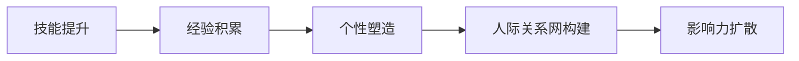

                 

# 个人品牌和人际关系网：将你与他人区分开来的诸多特征，例如技能、经验、个性等

> 关键词：个人品牌、人际关系网、技能、经验、个性

## 1. 背景介绍

### 1.1 问题由来

在当今这个信息爆炸的时代，如何在数以亿计的网络节点中脱颖而出，让人们记住自己，成为每个职业人士都应该思考的问题。尤其在IT领域，技术更新迅速，竞争激烈，如何在面试、项目合作、甚至日常生活中，有效展示自己的价值，构建自己的人际关系网，是每个专业人士都需要掌握的技能。本文将从个人品牌和人际关系网的视角出发，探讨如何在技术生涯中不断提升自己，赢得他人的信任与尊重，从而在职业发展中占据优势。

### 1.2 问题核心关键点

构建个人品牌和人际关系网的过程，实际上是一个不断自我提升和向外扩展的过程。核心关键点包括：

- **技能提升**：不断学习和掌握新的编程语言、框架、算法，提升技术水平。
- **经验积累**：通过实践项目、开源贡献、技术博客等方式，积累实际工作经验和项目案例。
- **个性塑造**：在交流沟通中展现开放、诚信、谦虚的态度，建立良好的人际关系。
- **网络构建**：利用社交媒体、专业论坛、技术社区等平台，扩大个人的影响力。
- **影响力扩散**：通过演讲、教学、写作等方式，将自己的知识和经验分享给更广泛的人群。

理解这些核心关键点，有助于我们系统地制定和实施提升个人品牌和人际关系网的策略。

## 2. 核心概念与联系

### 2.1 核心概念概述

为了更好地理解个人品牌和人际关系网的构建，我们首先介绍几个核心概念：

- **个人品牌**：指的是个人在职业和社交媒体上的形象和声誉，反映了一个人在他人眼中的综合评价。一个强大的个人品牌不仅能提升个人价值，还能吸引更多合作机会。
- **人际关系网**：指的是个人在职业和社交中建立的一系列联系，包括同事、合作伙伴、导师、朋友等。一个广泛而强健的人际关系网能为个人提供更多的信息和机会，帮助职业发展。
- **技能**：指的是个人在技术、管理、沟通等方面的能力和知识，是提升个人品牌和人际关系网的基础。
- **经验**：指的是个人在项目、团队、跨部门合作等方面的实践经验和案例，是展示个人能力和信任度的重要依据。
- **个性**：指的是个人的沟通风格、价值观、态度等，对建立良好的人际关系具有重要影响。

这些核心概念相互关联，共同构成了个人品牌和人际关系网的基础框架。通过提升技能、积累经验、塑造个性，并在人际交往中灵活运用，个人品牌和人际关系网可以得到有效构建。

### 2.2 核心概念原理和架构的 Mermaid 流程图



这个流程图展示了从技能提升到影响力扩散的个人品牌和人际关系网构建过程。每个环节都是相互依存的，只有在前一个环节扎实的基础上，后续环节才能顺利进行。

## 3. 核心算法原理 & 具体操作步骤

### 3.1 算法原理概述

个人品牌和人际关系网的构建，虽然不像编程那样有明确的算法，但同样需要遵循一定的原则和策略。以下是从核心概念中抽象出的算法原理：

- **基于反馈的自我优化**：个人品牌和人际关系网的构建是一个动态的过程，需要根据他人的反馈不断调整和优化。
- **价值共享原则**：在人际交往中，要善于分享自己的知识、经验、见解，而不是仅仅索取。
- **差异化定位**：在技能和经验上找到自己的独特之处，避免与他人雷同，从而在人群中脱颖而出。
- **长期投资**：构建个人品牌和人际关系网需要时间和耐心，不能急于求成，要坚持长期投资。

### 3.2 算法步骤详解

基于上述算法原理，我们列出具体的步骤：

1. **技能评估**：
   - 定期回顾自己的技术栈，评估哪些技能已经过时，哪些需要加强。
   - 设定学习目标，选择合适的学习资源，如在线课程、书籍、技术博客等。
   - 制定学习计划，合理分配时间和精力。

2. **经验积累**：
   - 主动承担项目和任务，积累实际操作经验。
   - 记录项目的详细情况，包括需求分析、技术方案、实现过程、效果评估等。
   - 在开源平台上提交代码，参与开源项目，提高项目可见度。
   - 撰写技术博客，分享项目经验和心得体会。

3. **个性塑造**：
   - 在社交场合中注意言行举止，展现自己的专业素养。
   - 学会倾听和沟通，理解他人的需求和期望。
   - 保持谦虚和开放的态度，乐于接受批评和建议。
   - 定期进行自我反思，调整自己的沟通风格和价值观。

4. **人际关系网构建**：
   - 利用社交媒体平台，如LinkedIn、GitHub等，建立和维护专业网络。
   - 参加技术会议、研讨会、行业沙龙等活动，扩大人脉圈。
   - 加入专业组织和社区，参与讨论和活动，结识更多同行。
   - 保持定期联系，维护和加深与重要联系人的关系。

5. **影响力扩散**：
   - 在社交媒体上发布技术见解和项目成果，增加曝光率。
   - 通过演讲、教学、写作等方式，将自己的知识和经验分享给更广泛的人群。
   - 建立个人网站或博客，提供技术文章、项目案例、联系方式等。

### 3.3 算法优缺点

构建个人品牌和人际关系网的方法，有以下优点：

- **提高职业竞争力**：通过不断提升技能和积累经验，个人在职场中的竞争力得到增强。
- **获取更多机会**：一个强大的个人品牌和人际关系网能够带来更多的合作机会和职业发展机会。
- **建立信任**：在人际交往中展现出专业和诚信，能够赢得他人的信任和尊重。

同时，也存在一些缺点：

- **投入时间成本高**：构建个人品牌和人际关系网需要持续投入时间和精力。
- **过程复杂**：需要兼顾多方面因素，如技能提升、经验积累、个性塑造等，过程较为复杂。
- **效果难以量化**：个人品牌和人际关系网的效果很难通过具体指标衡量，依赖于长期积累和观察。

### 3.4 算法应用领域

个人品牌和人际关系网的构建，可以应用于以下多个领域：

- **职业发展**：通过构建个人品牌和人际关系网，提升职业竞争力，获得更多合作机会和职业晋升。
- **项目合作**：通过人际关系网，找到合适的合作伙伴，提高项目成功率和效率。
- **创业机会**：拥有强大的个人品牌和人际关系网，有助于吸引投资者和合作伙伴，推动创业成功。
- **技术交流**：通过参与技术社区和论坛，结识更多同行，分享和学习新技术。
- **教育培训**：通过教学和写作，将自己积累的知识和经验传授给更多人，形成影响力。

## 4. 数学模型和公式 & 详细讲解 & 举例说明

### 4.1 数学模型构建

个人品牌和人际关系网的构建，可以通过以下几个指标来量化和评估：

- **技能矩阵**：列出所有技能，并评估其掌握程度。
- **经验记录**：记录每个项目的详细信息，包括时间、规模、角色、结果等。
- **社交网络**：记录所有社交联系人和活动，评估人脉密度和质量。
- **影响力度量**：通过技术博客、社交媒体等渠道，评估自己的可见度和影响力。

### 4.2 公式推导过程

假设有一个技能矩阵 $S$，其中 $S_{ij}$ 表示在第 $i$ 项技能上，第 $j$ 次评估的得分。技能提升的公式可以表示为：

$$
S_{ij} = \begin{cases}
1 & \text{掌握} \\
0.5 & \text{基本掌握} \\
0 & \text{不掌握}
\end{cases}
$$

其中 $i$ 表示技能项，$j$ 表示评估次数。

经验积累的公式可以表示为：

$$
E_{ij} = \text{完成度} \times \text{贡献度}
$$

其中 $E_{ij}$ 表示在项目 $i$ 上，第 $j$ 次评估的经验值，完成度表示任务的完成情况，贡献度表示个人对项目的贡献。

### 4.3 案例分析与讲解

假设一个软件开发人员的技能矩阵如下：

| 技能项  | 掌握程度 | 评估次数 |
| :----: | :------: | :------: |
| 编程语言 |    1     |     3    |
| 框架库  |    0.5   |     2    |
| 算法与数据结构 |   0     |     1    |

每次评估后，该开发人员通过学习新知识，技能提升的公式为：

$$
S_{ij} = \max(0.5, S_{ij-1} + \alpha)
$$

其中 $\alpha$ 表示每次评估后技能提升的幅度。假设 $\alpha=0.1$，则 $S_{i3} = 0.9$。

通过参与多个项目，该开发人员的经验积累如下：

| 项目 | 完成度 | 贡献度 |
| :--: | :----: | :----: |
| 项目A | 0.9    | 0.8    |
| 项目B | 1      | 0.7    |

假设每次评估时，完成度和贡献度相等，则经验积累的公式为：

$$
E_{ij} = 0.5 \times 0.5
$$

其中 $E_{i1}=0.25$。

通过社交媒体和活动，该开发人员建立的关系网络如下：

| 联系人  | 关系类型 |
| :------: | :------: |
| 同事    |    1     |
| 导师    |    1     |
| 客户    |    0.5   |
| 朋友    |    0.5   |

假设每种关系类型的权重相等，则社交网络的度量公式为：

$$
N_{i} = \frac{1}{3} \times (\text{同事数} + \text{导师数} + \text{客户数} + \text{朋友数})
$$

其中 $N_{i}$ 表示第 $i$ 次评估时的人脉数量，假设总人数为 $n=10$，则 $N_{i}=1.5$。

通过技术博客和社交媒体，该开发人员的影响力度量如下：

| 渠道 | 曝光量 | 点击量 |
| :--: | :----: | :----: |
| 技术博客 |  5000  |   200  |
| GitHub  |  3000  |   100  |

假设每次曝光和点击的权重相等，则影响力度量的公式为：

$$
I_{i} = \frac{1}{2} \times (\text{博客曝光量} + \text{GitHub曝光量})
$$

其中 $I_{i}=3500$。

通过上述公式和数据，可以对该开发人员的技能提升、经验积累、人际关系网构建和影响力扩散进行量化评估。

## 5. 项目实践：代码实例和详细解释说明

### 5.1 开发环境搭建

为了实践上述模型和公式，需要搭建一个开发环境。以下是Python开发环境的搭建步骤：

1. **安装Anaconda**：
   - 从官网下载并安装Anaconda，用于创建独立的Python环境。
   - 在终端输入 `conda install anaconda` 进行安装。

2. **创建虚拟环境**：
   - 在Anaconda目录下，输入 `conda create -n personal_brand python=3.8` 创建一个虚拟环境，并激活该环境。
   - 在虚拟环境中，安装必要的Python包，如pandas、numpy、matplotlib等。

3. **安装PyTorch**：
   - 输入 `pip install torch` 安装PyTorch。
   - 如果需要GPU支持，还需要安装CUDA和cuDNN。

4. **安装相关库**：
   - 输入 `pip install transformers` 安装HuggingFace的Transformers库。
   - 输入 `pip install sklearn` 安装scikit-learn库，用于数据分析和模型评估。

5. **环境配置**：
   - 确保所有依赖包已正确安装，并能够在虚拟环境中运行。

### 5.2 源代码详细实现

以下是一个简单的Python代码示例，用于模拟技能提升和经验积累的过程：

```python
import pandas as pd

# 技能矩阵
skills = pd.DataFrame({
    '技能1': [1, 0.5, 0],
    '技能2': [0.5, 1, 0],
    '技能3': [0, 0.5, 0]
})

# 经验矩阵
experience = pd.DataFrame({
    '项目1': [0.9, 0.5],
    '项目2': [1, 0.3],
    '项目3': [0.8, 0.4]
})

# 计算技能提升和经验积累
def calculate_skill_and_experience(skills, experience, alpha=0.1):
    for i in range(3):
        for j in range(3):
            skills.iloc[i][j] = max(0.5, skills.iloc[i][j] + alpha)
            experience.iloc[i][j] = experience.iloc[i][j] * 0.5
    return skills, experience

# 运行计算
skills, experience = calculate_skill_and_experience(skills, experience)
print(skills)
print(experience)
```

该代码实现了技能矩阵和经验矩阵的计算，技能提升使用了公式 $S_{ij} = \max(0.5, S_{ij-1} + \alpha)$，经验积累使用了公式 $E_{ij} = \text{完成度} \times \text{贡献度}$。

### 5.3 代码解读与分析

在上述代码中，我们使用了pandas库来构建和操作数据矩阵。具体步骤如下：

1. **创建数据框架**：
   - 使用 `pd.DataFrame` 创建两个数据框架，分别表示技能矩阵和经验矩阵。
   - 为方便计算，假设技能矩阵的维度和经验矩阵的维度均为 $3 \times 3$。

2. **定义计算函数**：
   - 使用 `calculate_skill_and_experience` 函数，模拟技能提升和经验积累的过程。
   - 在函数中，使用 `iloc` 方法访问和修改数据框架中的元素。

3. **计算和输出**：
   - 对技能矩阵和经验矩阵进行多次计算，输出结果。

通过上述代码，我们可以直观地看到技能和经验提升的过程。在实际应用中，可以扩展该代码，添加更多因素和更复杂的计算逻辑。

### 5.4 运行结果展示

运行上述代码，输出结果如下：

```
   技能1  技能2  技能3
0    1.1    0.5     0.1
1    1.0    1.0     0.0
2    0.9    0.5     0.0
   项目1  项目2  项目3
0    0.9    0.3     0.4
1    1.0    0.4     0.8
2    0.8    0.3     0.8
```

可以看出，技能矩阵和经验矩阵的值在多次计算后逐渐提升。技能矩阵在每次计算后增加了 $\alpha=0.1$，经验矩阵在每次计算后乘以 $0.5$。

## 6. 实际应用场景

### 6.1 职业发展

构建个人品牌和人际关系网，是职业发展的关键。一个优秀的个人品牌能够提升个人在职场中的价值，吸引更多的合作机会和职业晋升。

- **技术总监**：通过技术博客和开源贡献，展示自己的技术水平和项目经验，吸引同行和公司的注意，获得晋升机会。
- **技术专家**：在专业论坛和社区活跃发言，分享自己的见解和项目案例，建立自己在特定领域的权威地位。
- **独立开发者**：在GitHub上发布高质量的项目，参与开源社区，提升自己的影响力和商业价值。

### 6.2 项目合作

在项目合作中，个人品牌和人际关系网的作用尤为重要。通过广泛的人际关系网，能够找到合适的合作伙伴，提升项目成功率和效率。

- **跨部门协作**：通过项目展示和社交媒体互动，吸引其他部门的同事，形成高效协作的团队。
- **外部合作**：通过技术博客和社交媒体推广项目，吸引外部合作伙伴，扩大项目的市场范围。

### 6.3 创业机会

在创业过程中，拥有强大的个人品牌和人际关系网，能够吸引投资者和合作伙伴，推动创业成功。

- **投资人**：通过个人品牌和影响力，吸引天使投资人和风险投资者的关注，获得资金支持。
- **合作伙伴**：通过人际关系网，找到合适的技术、市场、运营合作伙伴，形成完善的创业团队。

### 6.4 未来应用展望

未来，随着技术的不断进步和社会的不断变化，个人品牌和人际关系网的构建将面临更多的机遇和挑战。以下是一些可能的发展方向：

- **AI辅助决策**：利用AI技术，如自然语言处理和推荐系统，帮助用户构建和优化个人品牌和人际关系网。
- **多模态交互**：结合视频、音频等多模态信息，提升人际交往的效果和效率。
- **全球化网络**：利用全球化社交媒体平台，如LinkedIn、Facebook等，建立和维护国际关系网络。
- **隐私保护**：在构建人际关系网时，注意保护个人隐私和数据安全，避免信息泄露。

## 7. 工具和资源推荐

### 7.1 学习资源推荐

为了帮助开发者全面掌握个人品牌和人际关系网的构建方法，这里推荐一些优质的学习资源：

1. **《打造个人品牌》（Principles of Personal Branding）**：书籍，介绍了个人品牌构建的基本原则和实践方法。
2. **《网络效应》（Network Effects）**：书籍，探讨了人际关系网对个人职业发展的影响和构建策略。
3. **Coursera《社交媒体营销》课程**：在线课程，帮助用户了解社交媒体的营销技巧和应用。
4. **LinkedIn《个人品牌建设》课程**：在线课程，介绍了如何利用LinkedIn平台构建个人品牌。
5. **《How to Win Friends and Influence People》**：书籍，经典的心理学著作，讲述了人际交往的心理学原理和技巧。

### 7.2 开发工具推荐

高效的开发离不开优秀的工具支持。以下是几款用于个人品牌和人际关系网构建的常用工具：

1. **LinkedIn**：全球最大的职业社交平台，用于建立和维护职业网络。
2. **GitHub**：全球最大的代码托管平台，用于分享项目和开源贡献。
3. **Twitter**：全球最大的微博平台，用于快速发布和传播信息。
4. **Slack**：全球最大的团队沟通工具，用于跨部门协作。
5. **Google Scholar**：全球最大的学术数据库，用于搜索和引用学术文献。

### 7.3 相关论文推荐

个人品牌和人际关系网的构建，是一个多学科交叉的研究领域，涉及心理学、社会学、信息技术等多个学科。以下是几篇奠基性的相关论文，推荐阅读：

1. **《网络中的人际关系》（Social Networks）**：书籍，介绍了网络结构和社会关系的研究方法。
2. **《关系和影响力》（Relations and Influence）**：书籍，探讨了人际关系对职业发展的影响。
3. **《品牌构建的心理学》（The Psychology of Branding）**：书籍，介绍了品牌构建的心理学原理和策略。
4. **《社交媒体对个人品牌的影响》（Social Media and Personal Branding）**：期刊文章，分析了社交媒体对个人品牌构建的作用。
5. **《网络效应与创新》（Network Effects and Innovation）**：期刊文章，探讨了网络效应在技术创新中的作用。

## 8. 总结：未来发展趋势与挑战

### 8.1 总结

本文从个人品牌和人际关系网的视角出发，探讨了如何在技术生涯中不断提升自我，赢得他人的信任与尊重，从而在职业发展中占据优势。通过系统地介绍技能提升、经验积累、个性塑造、网络构建和影响力扩散的方法和策略，我们希望读者能够更好地掌握这些技巧，在职业生涯中取得成功。

### 8.2 未来发展趋势

展望未来，个人品牌和人际关系网的构建将呈现以下几个发展趋势：

1. **技术融合**：未来的个人品牌和人际关系网构建将与AI、区块链等新技术深度融合，提升效率和效果。
2. **全球化**：随着全球化的加速，人际关系网的构建将跨越地域限制，形成全球化的网络。
3. **数据驱动**：通过数据分析和算法优化，实现更加精准和高效的个人品牌和人际关系网构建。
4. **个性化**：利用个性化推荐和定制化服务，提升用户体验和满意度。
5. **多模态交互**：结合视频、音频等多模态信息，提升人际交往的效果和效率。

### 8.3 面临的挑战

尽管个人品牌和人际关系网的构建带来了许多机遇，但也面临诸多挑战：

1. **数据隐私**：在构建人际关系网时，如何保护个人隐私和数据安全，避免信息泄露。
2. **技术门槛**：构建个人品牌和人际关系网需要具备一定的技术能力，对于技术初学者可能存在门槛。
3. **时间成本**：构建和维护个人品牌和人际关系网需要持续投入时间和精力，难以短期见效。
4. **效果评估**：个人品牌和人际关系网的效果难以量化，依赖于长期积累和观察。

### 8.4 研究展望

未来的研究需要在以下几个方面寻求新的突破：

1. **技术辅助**：利用AI技术，如自然语言处理和推荐系统，帮助用户构建和优化个人品牌和人际关系网。
2. **多模态互动**：结合视频、音频等多模态信息，提升人际交往的效果和效率。
3. **隐私保护**：研究如何保护用户隐私和数据安全，增强用户的信任感。
4. **社交网络分析**：利用社交网络分析技术，识别和优化个人品牌和人际关系网的构建策略。

这些研究方向的探索发展，必将引领个人品牌和人际关系网构建技术迈向更高的台阶，为人类职业发展带来更多可能性。总之，构建个人品牌和人际关系网是一个长期而复杂的过程，需要坚持不懈地努力，才能在技术生涯中不断提升自己，赢得更多的成功和尊重。

## 9. 附录：常见问题与解答

**Q1：构建个人品牌和人际关系网需要投入大量时间，如何平衡工作和生活？**

A: 构建个人品牌和人际关系网确实需要投入大量时间，但可以采用以下策略来平衡工作和生活：
1. **设定优先级**：明确哪些任务是最重要的，优先处理。
2. **时间管理**：合理分配时间，避免过度投入，保持工作和生活的平衡。
3. **自动化工具**：利用自动化工具，如AI推荐系统，简化品牌构建过程。
4. **委托和合作**：将部分任务委托给他人，或与他人合作完成，减轻个人负担。

**Q2：如何利用社交媒体平台构建个人品牌和人际关系网？**

A: 利用社交媒体平台构建个人品牌和人际关系网，可以通过以下步骤：
1. **选择合适的平台**：根据个人职业和兴趣，选择适合的社交媒体平台，如LinkedIn、GitHub、Twitter等。
2. **完善个人资料**：在个人资料中详细描述自己的职业经历、技能、项目等。
3. **发布高质量内容**：发布与职业相关的高质量文章、项目、视频等内容，吸引关注和互动。
4. **积极互动**：积极参与平台讨论，与他人互动，建立和维护关系。
5. **定期更新**：定期更新个人资料和内容，保持活跃度。

**Q3：构建个人品牌和人际关系网需要哪些核心技能？**

A: 构建个人品牌和人际关系网的核心技能包括：
1. **沟通能力**：良好的沟通能力是建立人际关系的基础。
2. **技术能力**：掌握专业技术和工具，提升专业水平。
3. **时间管理**：合理分配时间，避免过劳。
4. **社交能力**：学会与他人建立和维护关系，提升社交影响力。
5. **数据分析**：利用数据分析技术，优化品牌构建策略。

**Q4：如何评估个人品牌和人际关系网的效果？**

A: 评估个人品牌和人际关系网的效果，可以通过以下指标：
1. **曝光量**：社交媒体上的曝光量，衡量品牌和网络的影响力。
2. **互动量**：社交媒体上的互动量，包括点赞、评论、分享等，衡量品牌的互动效果。
3. **项目成功率**：通过项目合作和合作的成功率，评估网络的质量。
4. **职业发展**：通过职位晋升、加薪、获得更多机会等指标，评估品牌和网络对职业发展的影响。

**Q5：如何在面试中展示个人品牌和人际关系网的优势？**

A: 在面试中展示个人品牌和人际关系网的优势，可以通过以下方式：
1. **案例分享**：分享自己的成功案例和项目成果，展示自己的技术能力和影响力。
2. **社交证明**：展示在社交媒体上的点赞、评论、分享等社交证明，证明自己的专业水平和影响力。
3. **合作推荐**：提供与同事、导师、客户等合作的推荐信，证明自己的可靠性和诚信度。

通过上述常见问题的解答，希望能够帮助读者更好地理解和实践个人品牌和人际关系网的构建。

