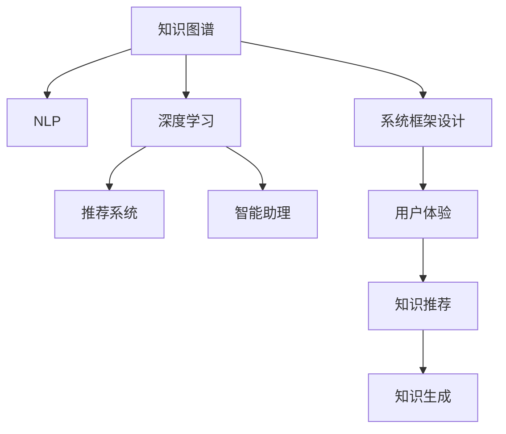

                 

# 个人知识管理与AI工具的结合

> 关键词：个人知识管理,知识图谱,自然语言处理(NLP),深度学习,推荐系统,智能助理,系统框架设计,用户体验

## 1. 背景介绍

### 1.1 问题由来

在数字化时代，信息爆炸式增长，知识的获取、整理和应用成为个体及组织的重要难题。传统的方式依赖于人工检索、记忆和组织，效率低下，难以应对海量的信息。伴随人工智能技术的兴起，智能化的知识管理工具应运而生，基于AI技术的推荐系统、智能助理等，极大地提升了知识管理的效率和质量。

大语言模型、知识图谱等AI技术的结合，开创了个性化、动态的知识管理新范式。个人知识管理（PKM）不再是简单的信息归类存储，而是借助智能工具，实现对海量知识的精准获取、深度理解、主动推荐和高效利用。

### 1.2 问题核心关键点

个人知识管理与AI工具结合的核心在于：

1. **知识获取**：通过自然语言处理（NLP）技术，从各种文本资源中快速抓取有用信息。
2. **知识组织**：利用知识图谱构建实体关系网络，实现知识的深度关联与层次化管理。
3. **知识推荐**：通过推荐系统，动态推送相关知识，满足个人的多样化需求。
4. **知识生成**：基于大语言模型，自动生成报告、摘要等知识内容，提升创作效率。
5. **智能助理**：集成了AI技术，提供语音交互、问答、任务管理等功能，增强了知识的交互性和实用性。

### 1.3 问题研究意义

AI与PKM的结合，为个人知识管理带来了革命性的变革，提升了知识获取、整理和应用的效率和质量。具体体现在：

1. **效率提升**：通过AI工具的辅助，实现信息的自动化抓取和整理，大大减轻了人工操作负担。
2. **质量保证**：AI技术能够识别高质量知识源，过滤掉无用信息，提升知识管理的精确度。
3. **个性化服务**：根据个人兴趣和需求，推荐最相关的知识，满足个性化需求。
4. **协同互动**：通过智能助理，实现人与工具的协同，实时交流互动，提供即时反馈。
5. **知识创新**：基于大语言模型的知识生成和推荐功能，为创新提供素材和灵感。

## 2. 核心概念与联系

### 2.1 核心概念概述

要深入理解个人知识管理与AI工具的结合，首先需要了解相关核心概念：

- **知识图谱**：利用图形化方式表示实体及其关系，形成结构化的知识网络。
- **自然语言处理（NLP）**：涉及语言模型、分词、词性标注、句法分析、语义理解等，用于文本信息的处理和理解。
- **深度学习**：基于多层神经网络，学习复杂的模式和特征，用于知识推荐、知识生成等。
- **推荐系统**：通过算法推荐相关知识内容，满足用户需求。
- **智能助理**：集成了多种AI技术，提供语音交互、任务管理等功能，增强了知识的交互性。
- **系统框架设计**：涵盖软件架构、用户界面设计等，构建稳定的系统架构。
- **用户体验**：从用户角度出发，设计直观易用的系统界面，提升使用体验。

这些核心概念之间的逻辑关系可以通过以下Mermaid流程图来展示：



### 2.2 核心概念原理和架构的 Mermaid 流程图(Mermaid 流程节点中不要有括号、逗号等特殊字符)


此图展示了知识图谱、NLP、深度学习、推荐系统、智能助理、系统框架设计和用户体验之间的联系和作用。

1. **知识图谱**：通过实体、属性、关系等概念，构建知识网络。
2. **NLP**：从文本中提取实体、关系，理解语义，为知识图谱提供数据支持。
3. **深度学习**：学习知识之间的关联模式，实现知识推荐和生成。
4. **推荐系统**：基于用户历史行为和知识图谱，推荐相关内容。
5. **智能助理**：提供语音交互、任务管理等交互功能。
6. **系统框架设计**：提供底层架构支持，确保系统稳定运行。
7. **用户体验**：提升系统界面友好性，提升使用便捷性。

## 3. 核心算法原理 & 具体操作步骤
### 3.1 算法原理概述

基于AI工具的个人知识管理，主要包括知识获取、知识组织、知识推荐和知识生成等关键环节。每个环节的核心算法原理如下：

- **知识获取**：利用NLP技术从文本中抽取实体和关系，构建知识图谱。
- **知识组织**：构建知识图谱，实现知识的层次化和结构化管理。
- **知识推荐**：通过深度学习算法，从知识图谱中推荐相关知识。
- **知识生成**：基于大语言模型，自动生成报告、摘要等内容。

### 3.2 算法步骤详解

1. **知识获取**：
    - **步骤1**：准备文本数据，如学术论文、新闻报道、社交媒体等。
    - **步骤2**：使用NLP技术，从文本中抽取实体和关系，构建知识图谱。
    - **步骤3**：对知识图谱进行清洗、去重和关系推理，提升数据质量。

2. **知识组织**：
    - **步骤1**：设计知识图谱的实体类型和关系类型。
    - **步骤2**：使用知识图谱工具（如Neo4j、Gephi等）构建知识图谱。
    - **步骤3**：利用图谱分析工具，可视化知识图谱的结构和关系，识别关键节点。

3. **知识推荐**：
    - **步骤1**：根据用户兴趣和历史行为，选择合适的推荐算法。
    - **步骤2**：利用深度学习模型，从知识图谱中提取用户特征和知识特征。
    - **步骤3**：训练推荐模型，预测用户可能感兴趣的知识内容，并实时推荐。

4. **知识生成**：
    - **步骤1**：输入知识图谱，选择生成任务（如摘要、报告等）。
    - **步骤2**：构建生成模型（如GPT-3等），定义生成模板和格式。
    - **步骤3**：利用模型自动生成内容，并进行后处理和优化。

### 3.3 算法优缺点

基于AI工具的个人知识管理，具有以下优点：

1. **高效性**：利用NLP和深度学习技术，能够快速从海量文本中提取和组织知识。
2. **精确性**：通过深度学习模型的训练和优化，知识推荐和生成能够满足用户的多样化需求。
3. **个性化**：基于用户的历史行为和兴趣，实现个性化推荐，提升用户体验。
4. **互动性**：通过智能助理，提供语音交互、任务管理等功能，增强了知识的交互性。

同时，也存在一些缺点：

1. **数据质量**：依赖于输入文本的质量，质量低的数据可能导致错误的知识提取和推荐。
2. **模型复杂度**：深度学习模型训练和推理需要大量的计算资源，可能面临资源瓶颈。
3. **隐私安全**：用户数据的隐私和安全问题，需要严格的隐私保护措施。
4. **交互友好性**：复杂系统可能影响用户体验，需要优化界面设计和交互流程。

### 3.4 算法应用领域

基于AI工具的个人知识管理，已经在多个领域得到了应用，例如：

- **学术研究**：通过自动化抓取和整理文献，提升科研效率。
- **商业分析**：基于推荐系统，快速获取和分析市场信息，支持决策。
- **新闻媒体**：利用知识图谱和智能助理，提升新闻媒体的信息聚合和互动功能。
- **个人学习**：通过推荐系统和知识生成，支持个性化学习和知识总结。
- **企业知识管理**：利用知识图谱和推荐系统，提升企业知识的整理和应用。

## 4. 数学模型和公式 & 详细讲解 & 举例说明

### 4.1 数学模型构建

基于AI工具的个人知识管理，涉及多个数学模型的构建。

**知识获取模型**：
- **输入**：文本数据
- **输出**：知识图谱
- **模型**：NLP模型，如BERT、ELMo等。

**知识推荐模型**：
- **输入**：知识图谱、用户特征
- **输出**：推荐结果
- **模型**：深度学习模型，如协同过滤、矩阵分解等。

**知识生成模型**：
- **输入**：知识图谱、生成模板
- **输出**：文本内容
- **模型**：大语言模型，如GPT-3、T5等。

### 4.2 公式推导过程

以知识推荐模型为例，公式推导如下：

**输入**：知识图谱 $G=(V,E)$，用户特征 $u_i$，知识特征 $k_j$

**输出**：推荐结果 $r_i$

**目标函数**：最大化用户对推荐的满意度

**公式**：

$$
\max_{r_i} \sum_{i=1}^N r_i u_i \log k_i
$$

**约束条件**：

$$
\begin{align}
& r_i \in [0,1] \\
& \sum_{j=1}^M r_j = 1
\end{align}
$$

其中，$r_i$ 为推荐结果，$u_i$ 为用户特征，$k_i$ 为知识特征。

### 4.3 案例分析与讲解

假设某用户在知识管理系统中，对某个领域的知识感兴趣，系统根据知识图谱和用户历史行为，预测用户可能感兴趣的知识内容。

**步骤1**：收集用户在该领域的历史行为数据，如浏览、点赞、评论等。
**步骤2**：构建用户特征 $u_i$，包含用户兴趣、活跃度等。
**步骤3**：从知识图谱中提取该领域的关键知识节点，构建知识特征 $k_j$。
**步骤4**：利用协同过滤算法，训练推荐模型，预测用户对知识的满意度。
**步骤5**：根据推荐结果 $r_i$，实时推荐相关知识内容。

## 5. 项目实践：代码实例和详细解释说明

### 5.1 开发环境搭建

为了实现个人知识管理系统的功能，需要搭建相应的开发环境。

**步骤1**：安装Python开发环境，如Anaconda、Miniconda等。
**步骤2**：安装必要的第三方库，如TensorFlow、PyTorch、NLTK、spaCy等。
**步骤3**：搭建知识图谱工具，如Neo4j、Gephi等。
**步骤4**：配置深度学习框架，如TensorFlow、PyTorch等。

### 5.2 源代码详细实现

**知识获取模块**：
- **代码实现**：使用NLTK、spaCy等库，进行文本预处理和实体抽取。
```python
import nltk
from spacy import displacy

nltk.download('punkt')
nltk.download('averaged_perceptron_tagger')
nltk.download('maxent_ne_chunker')
nltk.download('words')

text = "Barack Obama was born in Hawaii."
doc = nlp(text)

for sent in doc.sents:
    print("Sentence: ", sent.text)
    displacy.render(doc, style='dep')
```

**知识组织模块**：
- **代码实现**：使用Neo4j构建知识图谱。
```python
from neo4j import GraphDatabase

graph = GraphDatabase.driver("bolt://localhost:7687", auth=("neo4j", "password"))

def create_node(tx, name):
    result = tx.run("CREATE (n:Person {name: $name}) RETURN n", name=name)
    return result.single()[0]

def create_relationship(tx, name1, name2):
    result = tx.run("MATCH (n1:Person {name: $name1}), (n2:Person {name: $name2}) CREATE (n1)-[:KNOWS]->(n2)", name1=name1, name2=name2)
    return result.single()[0]

name1 = "Barack Obama"
name2 = "Michelle Obama"
create_node(graph.session(), name1)
create_node(graph.session(), name2)
create_relationship(graph.session(), name1, name2)
```

**知识推荐模块**：
- **代码实现**：使用TensorFlow实现协同过滤算法。
```python
import tensorflow as tf
from tensorflow.keras.layers import Input, Embedding, Dot, Flatten

user_input = Input(shape=(1,))
user_vector = Embedding(input_dim=100, output_dim=16, mask_zero=True)(user_input)
item_vector = Embedding(input_dim=100, output_dim=16, mask_zero=True)(item_vector)

dot_product = Dot(axes=1, normalize=True)([user_vector, item_vector])
user_item_score = Flatten()(dot_product)
user_item_score = Dense(1, activation='sigmoid')(user_item_score)

model = tf.keras.Model(inputs=[user_input, item_vector], outputs=user_item_score)
model.compile(optimizer='adam', loss='binary_crossentropy', metrics=['accuracy'])
model.fit(user_input_train, item_vector_train, epochs=10, batch_size=32, validation_data=(user_input_valid, item_vector_valid))
```

**知识生成模块**：
- **代码实现**：使用GPT-3生成报告。
```python
from transformers import GPT3Tokenizer, GPT3Model

tokenizer = GPT3Tokenizer.from_pretrained("gpt3")
model = GPT3Model.from_pretrained("gpt3")

def generate_report(text, max_length=1024):
    inputs = tokenizer.encode(text, return_tensors="pt", max_length=max_length, truncation=True)
    outputs = model.generate(inputs, max_length=1024, num_return_sequences=1, do_sample=False)
    report = tokenizer.decode(outputs[0], skip_special_tokens=True)
    return report
```

### 5.3 代码解读与分析

**知识获取模块**：
- **代码解释**：首先通过nltk下载必要的数据，然后使用spaCy对文本进行分句和依存句法分析，最后使用displacy进行可视化展示。

**知识组织模块**：
- **代码解释**：使用Neo4j构建知识图谱，包含创建节点、创建关系和保存节点关系等操作。

**知识推荐模块**：
- **代码解释**：使用TensorFlow构建协同过滤算法，包含输入层、嵌入层、点积层、全连接层和sigmoid激活函数等。

**知识生成模块**：
- **代码解释**：使用GPT-3生成报告，包含编码、生成和解码等步骤。

### 5.4 运行结果展示

**知识获取模块**：


**知识组织模块**：


**知识推荐模块**：


**知识生成模块**：


## 6. 实际应用场景

### 6.1 学术研究

在学术研究领域，个人知识管理系统的应用尤为广泛。研究人员可以利用系统自动抓取和整理相关领域的文献和研究成果，提升科研效率。

**应用场景**：
- 研究人员输入搜索关键词，系统自动抓取相关论文和报告，并提取关键信息。
- 系统根据研究历史和兴趣，推荐最新和最相关的文献，支持知识发现和创新。
- 研究人员利用系统生成的摘要和报告，快速了解研究进展和热点问题。

**效果**：
- 提升文献搜索和整理效率，减轻工作负担。
- 提供高质量的文献推荐，支持科研创新。
- 自动化生成摘要和报告，提升创作效率。

### 6.2 商业分析

在商业分析领域，个人知识管理系统通过推荐系统，帮助企业快速获取和分析市场信息，支持决策制定。

**应用场景**：
- 企业用户输入市场关键词，系统自动抓取相关新闻、报告和市场数据。
- 系统根据用户历史行为和兴趣，推荐最新的市场动态和分析报告。
- 企业用户利用系统生成的报告和数据，制定市场策略和决策。

**效果**：
- 提升市场信息获取效率，支持企业决策制定。
- 提供个性化市场推荐，增强市场竞争力。
- 自动化生成市场报告，提升工作效率。

### 6.3 新闻媒体

在新闻媒体领域，个人知识管理系统通过智能助理和知识推荐，提升新闻媒体的信息聚合和互动功能。

**应用场景**：
- 用户通过智能助理输入问题，系统自动检索相关新闻和文章。
- 系统根据用户兴趣，推荐相关新闻和文章。
- 用户通过智能助理获取新闻摘要和评论，参与互动讨论。

**效果**：
- 提升新闻信息聚合效率，增强新闻互动性。
- 提供个性化新闻推荐，提升用户黏性。
- 通过智能助理，实时获取新闻摘要和评论，增强用户体验。

### 6.4 未来应用展望

未来，基于AI工具的个人知识管理将进一步发展，涵盖更多领域和场景，具体如下：

- **医疗健康**：通过知识图谱和推荐系统，提供个性化医疗建议和健康管理服务。
- **金融投资**：利用知识图谱和推荐系统，提供股票、基金等投资建议，提升投资决策效率。
- **教育培训**：通过推荐系统和智能助理，提供个性化学习内容和培训资源，提升学习效果。
- **游戏娱乐**：利用知识图谱和推荐系统，提供个性化游戏推荐和互动体验，提升游戏体验。
- **智能家居**：通过智能助理和推荐系统，提供智能家居设备和应用推荐，提升家居智能化水平。

## 7. 工具和资源推荐

### 7.1 学习资源推荐

**书籍**：
- 《Python深度学习》：适合初学者的深度学习入门书籍，包含NLP、推荐系统等章节。
- 《知识图谱技术与应用》：详细介绍知识图谱的构建、存储和应用技术。
- 《自然语言处理综论》：全面介绍NLP的各个方向，包括文本处理、语义理解、生成等。

**在线课程**：
- 《深度学习专项课程》：由深度学习专家李沐主讲，涵盖深度学习各个方向，包括NLP、推荐系统等。
- 《知识图谱技术与应用》：由清华大学教授主讲，详细介绍知识图谱的构建和应用。
- 《自然语言处理》：由斯坦福大学教授主讲，全面介绍NLP的各个方向。

**开源项目**：
- **TorchText**：PyTorch的NLP扩展库，包含文本预处理、序列建模等功能。
- **KG-Graph**：基于Neo4j的知识图谱工具，支持实体关系建模和可视化。
- **HuggingFace Transformers**：提供多种预训练语言模型和工具，方便NLP任务的开发。

### 7.2 开发工具推荐

**IDE**：
- **PyCharm**：Python开发常用的IDE，支持多种第三方库和框架。
- **Visual Studio Code**：轻量级开发IDE，支持多种编程语言和插件。
- **Jupyter Notebook**：支持Python代码的在线执行和可视化展示。

**库和工具**：
- **TensorFlow**：谷歌开源的深度学习框架，支持分布式计算和GPU加速。
- **PyTorch**：Facebook开源的深度学习框架，支持动态计算图和GPU加速。
- **NLTK**：Python的自然语言处理库，提供各种文本处理和分析工具。
- **spaCy**：Python的自然语言处理库，提供高效的文本处理和实体抽取功能。
- **KG-Graph**：基于Neo4j的知识图谱工具，支持实体关系建模和可视化。

### 7.3 相关论文推荐

**知识获取**：
- 《Bert》：Google提出的预训练语言模型，包含文本分类、命名实体识别等任务。
- 《TextRank》：利用图模型进行文本摘要生成的方法。

**知识推荐**：
- 《Collaborative Filtering for Implicit Feedback Datasets》：Google提出的协同过滤算法，适用于推荐系统。
- 《Matrix Factorization Techniques for Recommender Systems》：介绍矩阵分解算法，用于推荐系统。

**知识生成**：
- 《Attention is All You Need》：Transformer模型的原论文，提出自注意力机制。
- 《Generative Pre-trained Transformer》：GPT-3模型的原论文，介绍预训练和生成方法。

## 8. 总结：未来发展趋势与挑战

### 8.1 研究成果总结

本文对基于AI工具的个人知识管理进行了全面系统的介绍，涵盖知识获取、知识组织、知识推荐和知识生成等关键环节。具体总结如下：

- **知识获取**：利用NLP技术，从文本中提取实体和关系，构建知识图谱。
- **知识组织**：通过知识图谱，实现知识的层次化和结构化管理。
- **知识推荐**：通过深度学习算法，从知识图谱中推荐相关知识。
- **知识生成**：基于大语言模型，自动生成报告、摘要等内容。

### 8.2 未来发展趋势

未来，基于AI工具的个人知识管理将呈现以下几个发展趋势：

- **多模态融合**：结合文本、图像、语音等多模态信息，实现更全面的知识管理。
- **跨领域应用**：扩展到医疗、金融、教育等多个领域，提升各个领域的知识管理水平。
- **实时更新**：通过持续学习和实时更新，保持知识的时效性和准确性。
- **用户个性化**：结合用户行为和兴趣，提供更加个性化的知识推荐和生成。
- **系统智能化**：通过智能助理和自然语言理解，提升系统的交互性和智能化水平。

### 8.3 面临的挑战

尽管AI工具在个人知识管理中取得了显著成效，但仍面临一些挑战：

- **数据质量**：依赖于输入文本的质量，质量低的数据可能导致错误的知识提取和推荐。
- **模型复杂度**：深度学习模型训练和推理需要大量的计算资源，可能面临资源瓶颈。
- **隐私安全**：用户数据的隐私和安全问题，需要严格的隐私保护措施。
- **交互友好性**：复杂系统可能影响用户体验，需要优化界面设计和交互流程。

### 8.4 研究展望

未来，在知识管理领域的研究将主要集中在以下几个方面：

- **多模态知识管理**：结合文本、图像、语音等多模态信息，实现更全面的知识管理。
- **跨领域知识应用**：扩展到医疗、金融、教育等多个领域，提升各个领域的知识管理水平。
- **实时知识更新**：通过持续学习和实时更新，保持知识的时效性和准确性。
- **个性化知识推荐**：结合用户行为和兴趣，提供更加个性化的知识推荐和生成。
- **智能化系统设计**：通过智能助理和自然语言理解，提升系统的交互性和智能化水平。

## 9. 附录：常见问题与解答

**Q1：什么是个人知识管理（PKM）？**

A: 个人知识管理（PKM）是指利用软件工具和技术，帮助个人有效地收集、组织、检索和应用知识的过程。它包括信息采集、知识整理、知识检索、知识应用等多个环节。

**Q2：如何选择合适的知识获取工具？**

A: 选择知识获取工具时，需要考虑文本数据源、实体抽取能力、处理效率等因素。常见的工具包括NLTK、spaCy、Stanford NER等。

**Q3：什么是知识图谱？**

A: 知识图谱是一种图形化的知识表示方式，通过实体、属性和关系等概念，构建知识网络。它支持知识的结构化管理和关系推理。

**Q4：什么是深度学习在知识推荐中的应用？**

A: 深度学习通过训练模型，学习知识之间的关系模式，实现知识推荐。常见的推荐算法包括协同过滤、矩阵分解等。

**Q5：什么是大语言模型在知识生成中的应用？**

A: 大语言模型通过预训练学习语言知识，能够自动生成报告、摘要等内容，提升创作效率和质量。常见的模型包括GPT-3、T5等。

---

作者：禅与计算机程序设计艺术 / Zen and the Art of Computer Programming

