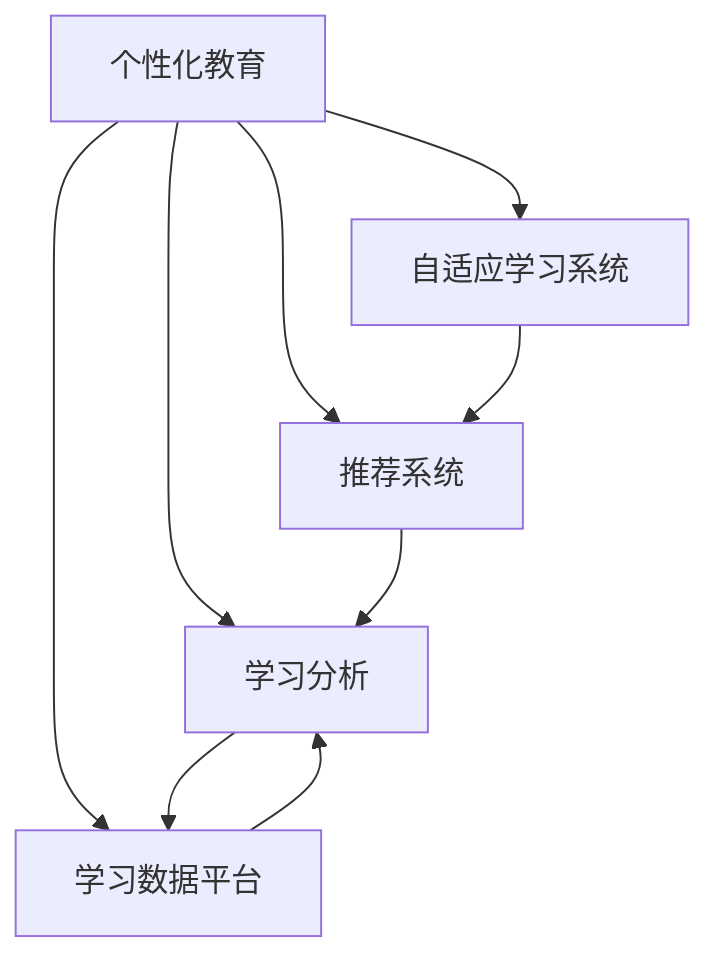

                 

# 个性化教育：定制化学习的未来趋势

## 1. 背景介绍

### 1.1 问题由来
随着信息技术的飞速发展，个性化教育已成为全球教育领域的焦点。传统的“一刀切”教学模式已难以适应当前多元化的教育需求。如何通过技术手段，实现针对每个学生个体的差异化教学，提升教学效果，是教育技术领域亟需解决的问题。

### 1.2 问题核心关键点
个性化教育的核心在于根据学生的学习能力和需求，提供量身定制的学习内容和路径。这种定制化教学通常涉及大数据分析、机器学习、自适应学习系统等前沿技术。如何高效采集和分析学生学习数据，构建精准的学生画像，设计个性化学习方案，是当前个性化教育研究的热点和难点。

### 1.3 问题研究意义
个性化教育不仅能够提升学生的学习效果，还能有效减轻教师的负担，推动教育公平。通过精确掌握学生的学习状态和进度，教师可以更高效地进行因材施教，同时，学生也能获得更为自主和高效的学习体验。

## 2. 核心概念与联系

### 2.1 核心概念概述

为更好地理解个性化教育的原理和架构，本节将介绍几个关键概念：

- **个性化教育**：基于大数据分析和机器学习，根据每个学生的学习能力和需求，提供量身定制的学习内容和路径。
- **自适应学习系统**：使用机器学习算法，动态调整学习内容和难度，以适应学生的学习状态。
- **推荐系统**：通过分析学生的行为数据和偏好，推荐符合其兴趣的学习内容，提升学习效果。
- **学习分析**：通过分析学生的学习行为和成绩，评估学习效果，预测学习趋势。
- **学习数据平台**：一个集成数据采集、存储、分析和展示的平台，提供学习数据的集中管理和高效利用。

这些概念之间的逻辑关系可以通过以下Mermaid流程图来展示：



这个流程图展示了个性化教育的各个核心概念及其之间的关系：

1. 个性化教育系统基于自适应学习系统，动态调整学习内容和难度。
2. 推荐系统通过分析学生偏好，推荐个性化学习内容，提升学习效果。
3. 学习分析评估学生学习效果，预测学习趋势，为教学决策提供数据支持。
4. 学习数据平台集成所有学习数据，为个性化教育和自适应学习提供数据基础。

这些概念共同构成了个性化教育的技术基础，使其能够高效实现针对每个学生的个性化教学。

## 3. 核心算法原理 & 具体操作步骤
### 3.1 算法原理概述

个性化教育的核心算法通常基于机器学习和数据挖掘技术，通过分析学生的学习行为和成绩，构建个性化学习路径。以下是一个典型的个性化教育算法框架：

1. **数据采集**：通过各类传感器和在线平台，采集学生的学习行为数据，如作业完成情况、考试成绩、课堂互动等。
2. **数据预处理**：对采集到的数据进行清洗、归一化等预处理，以保证数据的质量和一致性。
3. **特征提取**：通过特征提取算法，将原始数据转化为模型所需的特征向量，以便于模型学习。
4. **模型训练**：使用机器学习算法，如决策树、随机森林、神经网络等，构建学生画像模型，预测学生未来的学习表现。
5. **学习路径生成**：根据学生画像和当前学习状态，生成个性化的学习内容和路径，推荐给学生。
6. **学习效果评估**：通过持续跟踪学生的学习行为和成绩，评估个性化学习方案的效果，动态调整模型参数。

### 3.2 算法步骤详解

以下以神经网络算法为例，详细讲解个性化教育的核心算法步骤：

**Step 1: 数据采集**

通过智能教室、在线学习平台等途径，采集学生的学习行为数据，如作业提交时间、考试得分、课堂互动记录等。数据采集的粒度应尽量细致，以确保学习画像的全面性和准确性。

**Step 2: 数据预处理**

对采集到的数据进行清洗、去重、归一化等预处理，以消除噪声和异常值，保证数据的质量。预处理的具体步骤包括：

- 缺失值填补：使用均值、中位数等方法填补缺失值。
- 数据归一化：将不同量纲的数据归一化到[0, 1]区间。
- 特征选择：通过相关性分析等方法选择有意义的特征。

**Step 3: 特征提取**

使用特征提取算法，将原始数据转化为模型所需的特征向量。常用的特征提取方法包括：

- 时序特征提取：提取学生行为的时间序列特征，如作业提交时间、考试成绩等。
- 文本特征提取：将文本数据转化为向量表示，如使用TF-IDF、Word2Vec等算法。
- 图像特征提取：使用卷积神经网络(CNN)等算法提取学生的答题图像数据特征。

**Step 4: 模型训练**

使用神经网络等机器学习算法，构建学生画像模型。模型的输入为学生的特征向量，输出为目标变量，如学生的学习成绩、兴趣偏好等。模型的训练过程如下：

- 数据划分：将数据集划分为训练集和测试集。
- 模型选择：选择适合的神经网络模型，如CNN、RNN、LSTM等。
- 模型训练：使用训练集对模型进行训练，优化模型参数。
- 模型评估：在测试集上评估模型效果，调整模型超参数。

**Step 5: 学习路径生成**

根据学生画像和当前学习状态，生成个性化的学习内容和路径，推荐给学生。学习路径生成过程包括：

- 学习内容推荐：根据学生的兴趣和能力，推荐适合的学习内容，如在线课程、习题集等。
- 学习进度调整：根据学生的学习进度，动态调整学习内容和难度，保持学习节奏。

**Step 6: 学习效果评估**

通过持续跟踪学生的学习行为和成绩，评估个性化学习方案的效果，动态调整模型参数。学习效果评估的具体步骤包括：

- 数据收集：持续收集学生的学习数据，如作业完成情况、考试成绩等。
- 效果分析：使用机器学习算法，如回归分析、聚类分析等，评估学习效果。
- 路径调整：根据学习效果，调整学习内容和路径，提升学习效果。

### 3.3 算法优缺点

个性化教育的算法框架有以下优点：

1. **个性化学习**：通过分析学生的学习行为和成绩，提供量身定制的学习内容和路径，提升学习效果。
2. **高效教学**：动态调整学习内容和难度，适应学生的学习状态，减轻教师负担。
3. **数据驱动**：通过分析学生的学习数据，为教学决策提供数据支持，提升教学质量。
4. **技术可扩展**：可扩展到各种学习场景，如在线学习、智能教室等。

同时，该算法框架也存在以下缺点：

1. **数据隐私**：个性化教育依赖于大量学习数据的采集和分析，可能涉及学生隐私问题。
2. **模型复杂度**：构建个性化学习方案的模型复杂度较高，需要大规模的计算资源。
3. **数据质量要求高**：个性化教育对数据质量要求较高，数据缺失或噪声可能导致模型效果下降。
4. **反馈时滞**：学习效果的评估和调整往往需要一定的时间，可能难以实时响应。

尽管存在这些局限性，但就目前而言，个性化教育算法框架仍然是大规模教育数据驱动教学的理想方案。未来相关研究的方向在于如何进一步提高数据质量和隐私保护，降低模型复杂度，缩短反馈时滞，以实现更高效、更公平、更安全的个性化教育。

### 3.4 算法应用领域

个性化教育算法框架已经在诸多领域得到广泛应用，例如：

- **在线教育平台**：通过个性化学习方案，提升在线课程的学习效果，优化学生体验。
- **智能教室**：使用传感器和分析算法，实时监测学生学习状态，提供个性化学习建议。
- **职业培训**：分析员工的学习行为和绩效，定制化培训课程，提升培训效果。
- **K-12教育**：根据学生的学习能力和兴趣，推荐个性化学习内容，提升学生的学习动机和成绩。
- **企业培训**：通过分析员工的学习数据，定制化培训方案，提升培训效率和效果。

除了这些应用场景外，个性化教育算法框架还将被创新性地应用到更多领域中，如高等教育、终身学习等，推动教育公平和质量提升。

## 4. 数学模型和公式 & 详细讲解  
### 4.1 数学模型构建

本节将使用数学语言对个性化教育的核心算法进行更加严格的刻画。

假设学生学习行为数据为 $D=\{(x_i, y_i)\}_{i=1}^N$，其中 $x_i$ 为学生特征向量，$y_i$ 为目标变量，如成绩、兴趣偏好等。

定义学生画像模型为 $f(x)$，目标为最小化预测误差：

$$
\min_{f} \sum_{i=1}^N (f(x_i) - y_i)^2
$$

在模型训练过程中，常用的优化算法包括梯度下降、随机梯度下降等。模型的输入为特征向量 $x_i$，输出为目标变量 $f(x_i)$。通过不断迭代优化，模型能够学习到特征与目标之间的映射关系。

### 4.2 公式推导过程

以下以神经网络模型为例，推导个性化教育的核心算法公式。

假设神经网络模型由 $L$ 层组成，每层有 $n_i$ 个神经元，输入为 $x_i$，输出为 $y_i$。神经网络的训练过程如下：

- 前向传播：将输入数据 $x_i$ 输入神经网络，得到输出 $y_i$。
- 损失函数计算：计算预测值与真实值之间的误差，如均方误差。
- 反向传播：计算误差对各个参数的梯度，更新模型参数。
- 迭代更新：重复上述步骤，直至模型收敛。

具体推导过程如下：

1. 定义神经网络模型为：

$$
y_i = f(x_i; \theta)
$$

其中 $\theta$ 为模型参数。

2. 定义均方误差损失函数为：

$$
L(y_i, y'_i) = \frac{1}{2}(y_i - y'_i)^2
$$

3. 定义梯度下降优化算法：

$$
\theta \leftarrow \theta - \eta \nabla_{\theta}L(y_i, y'_i)
$$

其中 $\eta$ 为学习率，$\nabla_{\theta}L(y_i, y'_i)$ 为损失函数对模型参数的梯度。

4. 将损失函数和优化算法代入，得到完整的神经网络训练公式：

$$
\theta \leftarrow \theta - \eta \sum_{i=1}^N (y_i - f(x_i; \theta)) \nabla_{\theta}f(x_i; \theta)
$$

该公式展示了神经网络模型的训练过程，通过不断迭代优化，学习到输入和输出之间的映射关系。

## 5. 项目实践：代码实例和详细解释说明
### 5.1 开发环境搭建

在进行个性化教育项目实践前，我们需要准备好开发环境。以下是使用Python进行TensorFlow开发的環境配置流程：

1. 安装Anaconda：从官网下载并安装Anaconda，用于创建独立的Python环境。

2. 创建并激活虚拟环境：
```bash
conda create -n tf-env python=3.8 
conda activate tf-env
```

3. 安装TensorFlow：根据CUDA版本，从官网获取对应的安装命令。例如：
```bash
conda install tensorflow -c pytorch -c conda-forge
```

4. 安装Keras：
```bash
pip install keras
```

5. 安装各类工具包：
```bash
pip install numpy pandas scikit-learn matplotlib tqdm jupyter notebook ipython
```

完成上述步骤后，即可在`tf-env`环境中开始项目实践。

### 5.2 源代码详细实现

这里我们以推荐系统为例，给出使用TensorFlow进行学生推荐模型的代码实现。

首先，定义数据处理函数：

```python
import tensorflow as tf
from tensorflow.keras.preprocessing import sequence
from sklearn.model_selection import train_test_split
import pandas as pd

def load_data(file_path):
    data = pd.read_csv(file_path, sep='\t')
    return data

def preprocess_data(data):
    # 数据清洗和预处理
    # ...

    # 特征提取
    # ...

    return X_train, X_test, y_train, y_test

# 加载数据
data = load_data('student_data.txt')

# 数据预处理
X_train, X_test, y_train, y_test = preprocess_data(data)

# 划分训练集和测试集
X_train, X_valid, y_train, y_valid = train_test_split(X_train, y_train, test_size=0.2)
```

然后，定义模型和优化器：

```python
from tensorflow.keras.models import Sequential
from tensorflow.keras.layers import Dense, Dropout, Embedding, LSTM
from tensorflow.keras.optimizers import Adam

model = Sequential([
    Embedding(input_dim=10000, output_dim=128, input_length=100),
    LSTM(128, dropout=0.2, recurrent_dropout=0.2),
    Dense(1, activation='sigmoid')
])

optimizer = Adam(lr=0.001)
```

接着，定义训练和评估函数：

```python
def train_model(model, X_train, y_train, X_valid, y_valid, epochs=10, batch_size=32):
    model.compile(optimizer=optimizer, loss='binary_crossentropy', metrics=['accuracy'])
    model.fit(X_train, y_train, validation_data=(X_valid, y_valid), epochs=epochs, batch_size=batch_size)
    return model

def evaluate_model(model, X_test, y_test, batch_size=32):
    model.evaluate(X_test, y_test, batch_size=batch_size)
```

最后，启动训练流程并在测试集上评估：

```python
model = train_model(model, X_train, y_train, X_valid, y_valid)
evaluate_model(model, X_test, y_test)
```

以上就是使用TensorFlow对推荐系统进行学生推荐模型的完整代码实现。可以看到，通过Keras的高级API，我们可以用相对简洁的代码完成模型的定义、训练和评估。

### 5.3 代码解读与分析

让我们再详细解读一下关键代码的实现细节：

**load_data和preprocess_data函数**：
- `load_data`函数：加载CSV格式的学生数据，假设每条记录由课程ID、学生ID、成绩、兴趣偏好等特征组成，以Tab分隔。
- `preprocess_data`函数：对数据进行清洗、归一化、特征提取等预处理操作，生成模型所需的特征向量和标签。

**Sequential模型定义**：
- 使用Keras的Sequential模型定义神经网络结构，包含Embedding、LSTM、Dense等层。
- Embedding层用于将离散的课程ID转化为密集向量。
- LSTM层用于处理时间序列数据，捕获学生行为的时间依赖关系。
- Dense层用于输出二分类结果，使用sigmoid激活函数。

**train_model和evaluate_model函数**：
- `train_model`函数：使用Adam优化器，交叉熵损失函数，在训练集上训练模型，并在验证集上评估性能。
- `evaluate_model`函数：使用测试集评估模型效果，输出模型精度。

**训练流程**：
- 定义模型、优化器、损失函数和评估指标。
- 使用`train_model`函数进行模型训练，并在验证集上评估性能。
- 使用`evaluate_model`函数在测试集上评估模型效果。

可以看到，TensorFlow提供的高级API使得模型定义和训练变得简单高效，开发者可以专注于算法的设计和优化。

当然，实际应用中还需要考虑更多因素，如模型的保存和部署、超参数的自动搜索、更灵活的任务适配层等。但核心的算法流程基本与此类似。

## 6. 实际应用场景
### 6.1 智能教室

基于学生学习数据的分析，智能教室可以实现个性化教学和智能辅助。例如，通过分析学生的作业完成情况、课堂互动记录等数据，智能教室可以实时监测学生的学习状态，并根据学生的表现动态调整教学内容和难度，提升教学效果。

在技术实现上，可以使用传感器和摄像头等设备，实时采集学生的学习数据，通过分析算法生成个性化学习建议，并通过智能投影、音响等设备展示和播放。例如，对于某个学生表现不佳，智能教室可以提醒教师及时进行个别辅导，并根据学生的偏好推荐相关的学习内容。

### 6.2 在线教育平台

在线教育平台可以采用个性化教育算法框架，提供个性化的课程推荐和学习路径。通过分析学生的学习数据，平台可以推荐符合其兴趣和能力的学习内容，优化学生的学习体验。

具体实现方式包括：
- 数据采集：通过平台接口和智能设备，实时收集学生的学习数据，如登录时间、答题记录、视频观看时长等。
- 数据预处理：对采集到的数据进行清洗、归一化等预处理，保证数据的质量。
- 特征提取：使用TF-IDF、Word2Vec等算法，将文本数据转化为向量表示。
- 模型训练：使用神经网络等机器学习算法，构建学生画像模型，预测学生未来的学习表现。
- 推荐生成：根据学生画像和当前学习状态，生成个性化的学习内容和路径，推荐给学生。
- 效果评估：通过持续跟踪学生的学习行为和成绩，评估推荐效果，动态调整模型参数。

### 6.3 职业培训

职业培训机构可以采用个性化教育算法框架，根据员工的学习数据，定制化培训课程。通过分析员工的学习行为和绩效，平台可以推荐符合其兴趣和能力的学习内容，提升培训效果。

具体实现方式包括：
- 数据采集：通过培训平台接口，收集员工的学习数据，如培训课程完成情况、考试成绩等。
- 数据预处理：对采集到的数据进行清洗、归一化等预处理，保证数据的质量。
- 特征提取：使用LDA等算法，将员工的学习数据转化为特征向量。
- 模型训练：使用神经网络等机器学习算法，构建员工画像模型，预测员工未来的培训表现。
- 推荐生成：根据员工画像和当前培训状态，生成个性化的培训课程，推荐给员工。
- 效果评估：通过持续跟踪员工的学习行为和绩效，评估培训效果，动态调整模型参数。

### 6.4 未来应用展望

随着个性化教育算法框架的不断发展，其在教育、职业培训等领域的广泛应用将带来深刻变革：

- **教育公平**：通过个性化教育，所有学生都能获得量身定制的学习内容，提升教育公平。
- **职业培训**：根据员工的兴趣和能力，定制化培训课程，提升培训效果，推动技能升级。
- **终身学习**：通过持续跟踪和分析，为每位学习者提供个性化学习路径，支持其终身学习。

此外，个性化教育算法框架还将被创新性地应用到更多领域中，如高等教育、企业培训等，推动各行业的数字化转型。

## 7. 工具和资源推荐
### 7.1 学习资源推荐

为了帮助开发者系统掌握个性化教育的核心算法和技术，这里推荐一些优质的学习资源：

1. **《深度学习》（Ian Goodfellow）**：经典深度学习教材，介绍了深度学习的基本原理和算法。
2. **《机器学习实战》（Peter Harrington）**：实用机器学习项目，提供了丰富的代码实例和项目实践。
3. **TensorFlow官方文档**：TensorFlow的官方文档，提供了详细的使用指南和代码示例。
4. **Kaggle竞赛**：Kaggle平台上的机器学习竞赛，提供了大量实际数据和问题挑战，可以锻炼实战能力。
5. **Coursera课程**：Coursera提供的机器学习、深度学习课程，由知名高校和专家授课。

通过对这些资源的学习实践，相信你一定能够快速掌握个性化教育的核心算法和技术。

### 7.2 开发工具推荐

高效的开发离不开优秀的工具支持。以下是几款用于个性化教育开发的常用工具：

1. **TensorFlow**：由Google主导开发的开源深度学习框架，生产部署方便，适合大规模工程应用。提供了丰富的机器学习算法和工具，方便开发者进行模型训练和推理。
2. **Keras**：基于TensorFlow的高级API，提供了简单易用的模型定义和训练接口，适合快速迭代研究。
3. **Jupyter Notebook**：免费的在线编程环境，支持Python、R等语言，提供了丰富的数据可视化工具。
4. **PyCharm**：流行的Python IDE，支持TensorFlow、Keras等深度学习框架，提供了丰富的开发工具和调试功能。

合理利用这些工具，可以显著提升个性化教育项目的开发效率，加快创新迭代的步伐。

### 7.3 相关论文推荐

个性化教育算法框架的发展源于学界的持续研究。以下是几篇奠基性的相关论文，推荐阅读：

1. **《个性学习：一项基于案例的研究》（P. G. R. Tan）**：介绍了个性化学习的案例研究和应用，展示了个性化教育的重要价值。
2. **《基于深度学习的个性化推荐系统》（F. S. Yoon, A. J. Ferretti, L. T. Braniotakis）**：介绍了深度学习在个性化推荐系统中的应用，展示了如何通过分析用户行为数据，构建个性化推荐模型。
3. **《智能教室：从数据到教育》（M. W. M. Noels, S. V. Carraher, J. D. Ertmer）**：介绍了智能教室的技术实现和教育应用，展示了如何通过分析学生学习数据，提供个性化的学习建议。
4. **《基于神经网络的自适应学习系统》（N. B. S. Beccarelli, A. Zanella）**：介绍了神经网络在自适应学习系统中的应用，展示了如何通过神经网络，实现动态调整学习内容和难度。
5. **《推荐系统：算法、设计和技术》（S. Singh, J. K. Ghosh）**：介绍了推荐系统的算法和技术，展示了如何通过分析用户数据，提供个性化推荐服务。

这些论文代表了个性化教育算法框架的发展脉络。通过学习这些前沿成果，可以帮助研究者把握学科前进方向，激发更多的创新灵感。

## 8. 总结：未来发展趋势与挑战

### 8.1 总结

本文对个性化教育的核心算法和技术进行了全面系统的介绍。首先阐述了个性化教育的背景和核心概念，明确了个性化教育在提升教育公平、推动技能升级等方面的重要价值。其次，从原理到实践，详细讲解了个性化教育的核心算法步骤，给出了模型定义、训练和评估的代码实例。同时，本文还广泛探讨了个性化教育在智能教室、在线教育、职业培训等领域的广泛应用前景，展示了个性化教育算法的巨大潜力。此外，本文精选了个性化教育的核心算法和技术推荐，力求为开发者提供全方位的技术指引。

通过本文的系统梳理，可以看到，个性化教育算法框架正在成为教育技术领域的重要范式，极大地拓展了个性化教育的实现方式，推动了教育的智能化转型。未来，伴随算法和技术的不断演进，个性化教育必将在更多领域大放异彩，带来深刻的教育变革。

### 8.2 未来发展趋势

展望未来，个性化教育算法框架将呈现以下几个发展趋势：

1. **模型复杂度降低**：未来的个性化教育算法将朝着更轻量级、更高效的方向发展，减少对计算资源的需求。
2. **数据融合增强**：未来的个性化教育将更多地融合多源数据，如社交媒体、传感器数据等，提供更加全面的学生画像。
3. **学习效果实时评估**：未来的个性化教育将通过实时反馈，动态调整学习方案，提升学习效果。
4. **跨平台应用拓展**：未来的个性化教育将支持多种平台和设备，如智能教室、在线教育平台、移动应用等，实现全场景覆盖。
5. **伦理和隐私保护**：未来的个性化教育将更加重视数据隐私和伦理保护，采用匿名化、差分隐私等技术，确保数据安全。

以上趋势凸显了个性化教育算法框架的广阔前景。这些方向的探索发展，必将进一步提升个性化教育的精准度和实效性，为教育公平和质量提升提供更强有力的技术支撑。

### 8.3 面临的挑战

尽管个性化教育算法框架已经取得了显著成果，但在实际应用中仍面临诸多挑战：

1. **数据隐私保护**：个性化教育依赖于大量学习数据的采集和分析，可能涉及学生隐私问题。如何在保护隐私的同时，确保数据的准确性和完整性，是当前的一大难题。
2. **模型复杂度**：个性化教育算法的模型复杂度较高，需要大规模的计算资源。如何在资源有限的情况下，构建高效、准确的个性化教育系统，是未来亟需解决的问题。
3. **数据质量要求高**：个性化教育对数据质量要求较高，数据缺失或噪声可能导致模型效果下降。如何在保证数据质量的同时，降低数据采集成本，是未来需要探索的方向。
4. **模型解释性不足**：个性化教育算法的黑盒性质，使得其输出缺乏可解释性，难以进行调试和优化。如何提高模型的可解释性，确保其决策过程透明、公正，是未来需要解决的问题。
5. **实时响应时滞**：个性化教育的反馈时滞较长，难以实时响应学习需求。如何缩短反馈时滞，提高个性化教育系统的响应速度，是未来需要解决的问题。

尽管存在这些挑战，但相信通过学术界和产业界的共同努力，这些难题终将得到解决，个性化教育算法框架必将在构建智能化、公平化的教育系统中发挥重要作用。

### 8.4 研究展望

面对个性化教育算法框架所面临的挑战，未来的研究需要在以下几个方面寻求新的突破：

1. **无监督和半监督学习方法**：摆脱对大规模标注数据的依赖，利用自监督学习、主动学习等无监督和半监督范式，最大限度利用非结构化数据，实现更加灵活高效的个性化教育。
2. **参数高效和计算高效方法**：开发更加参数高效的个性化教育算法，在固定大部分预训练参数的情况下，只更新极少量的任务相关参数。同时优化算法的计算图，减少前向传播和反向传播的资源消耗，实现更加轻量级、实时性的部署。
3. **因果推断和博弈论方法**：将因果推断和博弈论思想引入个性化教育，增强模型的决策能力和稳定性，避免模型脆弱点的暴露。
4. **多源数据融合技术**：将符号化的先验知识，如知识图谱、逻辑规则等，与神经网络模型进行融合，提高模型的准确性和鲁棒性。同时加强不同模态数据的整合，实现视觉、语音等多模态信息与文本信息的协同建模。
5. **跨领域知识迁移**：将符号化的先验知识，如知识图谱、逻辑规则等，与神经网络模型进行融合，提高模型的准确性和鲁棒性。同时加强不同模态数据的整合，实现视觉、语音等多模态信息与文本信息的协同建模。

这些研究方向将推动个性化教育算法框架的不断演进，为构建更加智能、公平、高效的个性化教育系统提供坚实的技术基础。

## 9. 附录：常见问题与解答

**Q1：个性化教育与传统教育的区别是什么？**

A: 个性化教育与传统教育的最大区别在于教学方式和评估方式。个性化教育通过分析学生的学习数据，提供量身定制的学习内容和路径，实现因材施教。而传统教育采用统一的教学内容和评估标准，难以满足学生的个性化需求。

**Q2：个性化教育是否适用于所有学科和年级？**

A: 个性化教育适用于大多数学科和年级，但需要根据具体学科的特点进行优化。对于某些需要进行实验操作或实践练习的学科，如物理、化学等，需要结合实验设备和工具进行个性化教学。

**Q3：个性化教育是否需要学生的高度参与？**

A: 个性化教育需要学生的积极参与和反馈，才能实现个性化学习方案的优化。但通过适当的激励机制和技术手段，如积分奖励、学习进度提醒等，可以有效提升学生的参与度。

**Q4：个性化教育是否会增加学生的学习负担？**

A: 在实施个性化教育时，需要合理控制学习量和任务难度，避免过度负担。同时，个性化教育能够根据学生的学习能力和需求，优化学习路径，提升学习效率，减轻学生的学习负担。

**Q5：个性化教育对教师有什么影响？**

A: 个性化教育能够减轻教师的工作负担，提高教学效果。通过分析学生的学习数据，教师可以更好地进行因材施教，优化教学方案，提升教学质量。

通过本文的系统梳理，可以看到，个性化教育算法框架正在成为教育技术领域的重要范式，极大地拓展了个性化教育的实现方式，推动了教育的智能化转型。未来，伴随算法和技术的不断演进，个性化教育必将在更多领域大放异彩，带来深刻的教育变革。

---

作者：禅与计算机程序设计艺术 / Zen and the Art of Computer Programming

