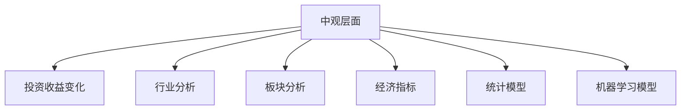

                 

# 中观层面的投资收益变化

## 1. 背景介绍

### 1.1 问题由来
在金融投资领域，投资者常常需要分析不同层面的投资收益变化，以做出更明智的投资决策。传统的宏观经济分析方法往往难以全面反映具体投资标的的实际表现，无法揭示更深入的投资规律。中观层面的分析则提供了一种更为细致的视角，有助于投资者理解投资标的在市场环境变化中的表现和未来趋势。

### 1.2 问题核心关键点
中观层面的投资收益变化主要关注行业、板块、地区等中间层次的市场动态和投资表现。其关键点在于：
- **行业和板块选择**：确定分析的行业或板块，并评估其市场表现。
- **经济指标选择**：选择合适的经济指标，如GDP、CPI、PMI等，用于衡量市场环境和投资标的的关系。
- **时间范围**：确定分析的时间范围，如年度、季度、月度等。
- **数据获取**：获取相关的市场数据、企业财务报表等，并进行处理和分析。
- **模型构建**：利用统计模型、机器学习模型等工具，建立投资收益变化模型。
- **预测和风险评估**：利用模型预测行业或板块的趋势，并进行风险评估。

### 1.3 问题研究意义
研究中观层面的投资收益变化，对于投资者具有重要的意义：
- **风险控制**：通过分析行业或板块的风险特征，帮助投资者制定合理的投资策略，降低投资风险。
- **机会识别**：识别投资标的在中观层面的投资机会，提升投资回报率。
- **市场动态跟踪**：及时跟踪市场变化，做出快速的投资决策。
- **行业趋势预测**：利用中观层面分析结果，预测行业趋势，指导长期投资方向。

## 2. 核心概念与联系

### 2.1 核心概念概述

为更好地理解中观层面的投资收益变化，本节将介绍几个关键概念：

- **中观层面**：指行业、板块、地区等中间层次的市场动态，相对于宏观经济和微观个体，处于中等尺度的分析层面。
- **投资收益变化**：指投资者在特定时间范围内，投资标的（如股票、基金、债券等）的收益变化情况。
- **行业分析**：对特定行业在市场环境变化中的表现进行分析，包括行业收入、利润、市场份额等。
- **板块分析**：对市场中特定行业或主题的集合进行分析，如科技板块、医药板块等。
- **经济指标**：用于衡量市场环境和经济状况的指标，如GDP、CPI、PMI等。
- **统计模型**：利用统计学方法，建立投资收益变化模型，如时间序列模型、回归模型等。
- **机器学习模型**：利用机器学习方法，建立更为复杂和灵活的投资收益变化模型，如决策树、随机森林、神经网络等。

这些核心概念之间的逻辑关系可以通过以下Mermaid流程图来展示：



这个流程图展示了中观层面投资收益变化的核心概念及其关系：

1. 中观层面分析关注行业和板块的表现，并结合经济指标。
2. 通过统计模型和机器学习模型对投资收益变化进行建模。
3. 行业和板块分析结果帮助构建更为精细的模型。

## 3. 核心算法原理 & 具体操作步骤

### 3.1 算法原理概述

中观层面的投资收益变化分析主要基于统计和机器学习方法。其核心思想是：

- **数据收集和处理**：收集特定行业或板块的相关数据，并进行预处理，如去噪、标准化等。
- **建模和预测**：建立统计模型或机器学习模型，用于预测投资收益变化，并进行风险评估。
- **结果分析**：对模型预测结果进行分析和解释，提供投资建议。

常见的统计模型包括时间序列模型、回归模型等，用于分析行业或板块的时间序列数据和影响因素之间的关系。常见的机器学习模型包括决策树、随机森林、神经网络等，用于挖掘数据中的非线性关系和复杂特征。

### 3.2 算法步骤详解

中观层面的投资收益变化分析通常包括以下几个关键步骤：

**Step 1: 数据收集和处理**
- 收集特定行业或板块的财务报表、市场数据、经济指标等，建立数据集。
- 对数据进行预处理，如去噪、标准化、缺失值填充等。

**Step 2: 特征选择和构建**
- 选择和构建特征，如行业收入、利润、市场份额、GDP、CPI、PMI等。
- 利用特征工程方法，如主成分分析、因子分析等，提取数据中的关键信息。

**Step 3: 模型建立和训练**
- 选择合适的模型，如线性回归、时间序列模型、决策树、随机森林、神经网络等。
- 利用历史数据对模型进行训练，优化模型参数。

**Step 4: 模型评估和优化**
- 在验证集上评估模型性能，如均方误差、R²、准确率等。
- 根据评估结果，调整模型参数和特征选择，优化模型性能。

**Step 5: 结果分析和预测**
- 利用训练好的模型，对新数据进行预测，生成投资收益变化曲线。
- 分析预测结果，识别投资标的在中观层面的表现和趋势。
- 根据预测结果，给出投资建议，如买入、卖出、持有等。

### 3.3 算法优缺点

中观层面的投资收益变化分析方法具有以下优点：
1. **细致入微**：分析特定行业或板块的表现，提供更为细致的投资视角。
2. **全面性**：结合经济指标和市场数据，分析宏观经济和行业特征之间的关系。
3. **预测准确**：利用统计和机器学习方法，提高投资收益变化的预测精度。
4. **风险控制**：通过风险评估，帮助投资者制定合理的投资策略。

同时，该方法也存在一些局限性：
1. **数据需求高**：需要收集和处理大量的数据，数据获取和处理成本较高。
2. **模型复杂**：中观层面的分析涉及多个变量和复杂的模型，模型构建和优化较为复杂。
3. **领域依赖**：需要具备一定的行业知识，对不同行业的分析可能需要不同的模型和方法。
4. **动态变化**：市场环境和行业特征不断变化，模型需要定期更新。

尽管存在这些局限性，但中观层面的投资收益变化分析仍是一种重要的投资决策支持手段。未来相关研究的重点在于如何进一步简化数据处理和模型构建，提高分析效率，同时兼顾模型的准确性和适应性。

### 3.4 算法应用领域

中观层面的投资收益变化分析方法在金融投资领域得到了广泛的应用，适用于以下场景：

- **行业投资分析**：分析特定行业的收入、利润、市场份额等，识别行业内的投资机会和风险。
- **板块轮动分析**：识别市场中不同板块的轮动规律，制定跨板块的投资策略。
- **经济周期预测**：利用经济指标，预测市场和经济周期变化，指导长期投资决策。
- **主题投资**：识别市场中的主题投资机会，如科技、医药、能源等，制定相应的投资策略。
- **区域投资分析**：分析不同地区的经济环境和市场表现，制定区域性投资策略。

## 4. 数学模型和公式 & 详细讲解 & 举例说明

### 4.1 数学模型构建

中观层面的投资收益变化分析通常建立以下数学模型：

**线性回归模型**：
$$ y = \beta_0 + \beta_1x_1 + \beta_2x_2 + \ldots + \beta_nx_n + \epsilon $$
其中，$y$ 为投资收益变化，$x_1, x_2, \ldots, x_n$ 为特征变量，$\beta_0, \beta_1, \beta_2, \ldots, \beta_n$ 为回归系数，$\epsilon$ 为误差项。

**时间序列模型**：
$$ y_t = \alpha + \beta_1t + \beta_2y_{t-1} + \beta_3y_{t-2} + \ldots + \beta_p y_{t-p} + \epsilon_t $$
其中，$y_t$ 为第$t$期的投资收益变化，$\alpha$ 为截距，$\beta_1, \beta_2, \ldots, \beta_p$ 为自回归参数，$y_{t-1}, y_{t-2}, \ldots, y_{t-p}$ 为滞后项，$\epsilon_t$ 为误差项。

**随机森林模型**：
$$ y = \sum_{i=1}^{m} \frac{w_i}{\sum_{j=1}^{m}w_j} f_i(x) $$
其中，$f_i(x)$ 为第$i$棵决策树对投资收益变化的预测，$w_i$ 为第$i$棵树的重要性权重。

### 4.2 公式推导过程

以线性回归模型为例，其推导过程如下：

假设数据集为 $\{(x_1, y_1), (x_2, y_2), \ldots, (x_n, y_n)\}$，其中 $x_1, x_2, \ldots, x_n$ 为自变量，$y$ 为因变量。

根据最小二乘法，求解回归系数 $\beta_0, \beta_1, \beta_2, \ldots, \beta_n$，使得残差平方和最小：

$$ \min_{\beta_0, \beta_1, \beta_2, \ldots, \beta_n} \sum_{i=1}^{n}(y_i - \beta_0 - \beta_1x_{1,i} - \beta_2x_{2,i} - \ldots - \beta_nx_{n,i})^2 $$

利用矩阵运算，可以得到：

$$ \beta = (\mathbf{X}^T\mathbf{X})^{-1}\mathbf{X}^T\mathbf{y} $$
其中，$\mathbf{X} = [\mathbf{1}, \mathbf{x_1}, \mathbf{x_2}, \ldots, \mathbf{x_n}]$，$\mathbf{y} = [y_1, y_2, \ldots, y_n]^T$。

### 4.3 案例分析与讲解

假设某投资者关注医药行业，收集了过去5年的收入、利润、市场份额等数据，利用线性回归模型预测未来1年的收益变化。

- **数据准备**：收集医药行业的收入、利润、市场份额等数据，建立数据集。
- **特征选择**：选择收入、利润、市场份额等作为特征变量。
- **模型训练**：利用历史数据训练线性回归模型，优化回归系数。
- **模型评估**：在验证集上评估模型性能，如均方误差、R²等。
- **预测和分析**：利用训练好的模型，对新数据进行预测，分析投资标的在中观层面的表现和趋势。

## 5. 项目实践：代码实例和详细解释说明

### 5.1 开发环境搭建

在进行中观层面投资收益变化分析的开发前，我们需要准备好开发环境。以下是使用Python进行Pandas和Scikit-Learn开发的环境配置流程：

1. 安装Anaconda：从官网下载并安装Anaconda，用于创建独立的Python环境。

2. 创建并激活虚拟环境：
```bash
conda create -n investment-env python=3.8 
conda activate investment-env
```

3. 安装Pandas和Scikit-Learn：
```bash
conda install pandas scikit-learn
```

4. 安装TensorBoard（可选）：用于模型训练的实验跟踪工具，方便调试和优化模型。
```bash
conda install tensorboard
```

完成上述步骤后，即可在`investment-env`环境中开始项目实践。

### 5.2 源代码详细实现

下面我们以线性回归模型为例，给出使用Scikit-Learn进行中观层面投资收益变化分析的Python代码实现。

```python
import pandas as pd
import numpy as np
from sklearn.linear_model import LinearRegression
from sklearn.model_selection import train_test_split

# 加载数据
df = pd.read_csv('investment_data.csv')

# 特征选择和处理
X = df[['revenue', 'profit', 'market_share']]
y = df['return']

# 数据分割
X_train, X_test, y_train, y_test = train_test_split(X, y, test_size=0.2, random_state=42)

# 模型训练
model = LinearRegression()
model.fit(X_train, y_train)

# 模型评估
print('R^2:', model.score(X_test, y_test))

# 预测和分析
y_pred = model.predict(X_test)
print('预测结果:', y_pred)
```

以上就是使用Scikit-Learn对线性回归模型进行中观层面投资收益变化分析的完整代码实现。可以看到，利用Pandas和Scikit-Learn，能够快速实现数据加载、特征选择、模型训练、评估和预测等步骤，大大简化了项目开发的复杂度。

### 5.3 代码解读与分析

让我们再详细解读一下关键代码的实现细节：

**Pandas库**：
- 用于数据处理和分析，支持数据读取、清洗、合并等操作。
- 通过Pandas加载CSV数据文件，进行数据读取和处理。

**Scikit-Learn库**：
- 用于建立和评估机器学习模型，支持多种常见的统计和机器学习算法。
- 利用Scikit-Learn的线性回归模型进行投资收益变化预测。

**模型训练和评估**：
- 利用Scikit-Learn的train_test_split方法将数据集分割为训练集和测试集。
- 在训练集上使用LinearRegression模型进行训练，并使用测试集评估模型性能。

**预测和分析**：
- 利用训练好的模型对测试集进行预测，生成投资收益变化预测结果。
- 打印输出预测结果和模型评估指标，进行结果分析。

## 6. 实际应用场景

### 6.1 智能投资顾问

中观层面的投资收益变化分析技术可以应用于智能投资顾问系统，为投资者提供实时的市场分析和投资建议。智能投资顾问系统利用大数据和机器学习技术，通过分析行业、板块和市场数据，预测投资标的的价格变化，帮助投资者制定最优的投资策略。

例如，某投资者关注科技板块，智能投资顾问系统利用中观层面分析技术，分析科技板块在市场中的表现和趋势，预测未来一年内科技板块的收益变化，并根据预测结果给出相应的投资建议。

### 6.2 风险控制

中观层面的投资收益变化分析技术还可以用于风险控制，帮助投资者识别和规避潜在的投资风险。利用中观层面分析，投资者可以分析特定行业或板块的波动性、市场风险等，识别风险较高的投资标的，从而减少投资组合的风险暴露。

例如，某投资者在投资组合中同时持有科技、医药、能源等板块的股票，中观层面分析技术可以分析各板块的风险特征，识别高风险板块，帮助投资者进行动态调整，降低投资组合的整体风险。

### 6.3 经济周期预测

中观层面的投资收益变化分析技术可以用于预测经济周期变化，帮助投资者在经济波动中做出更为合理的投资决策。利用中观层面分析，投资者可以分析宏观经济指标和行业特征之间的关系，预测经济周期的变化，并根据预测结果调整投资策略。

例如，某投资者关注全球经济周期，中观层面分析技术可以分析GDP、CPI、PMI等经济指标，预测未来一年的经济周期变化，帮助投资者在经济周期下行期提前退出投资，在经济周期上行期增加投资。

### 6.4 主题投资

中观层面的投资收益变化分析技术可以用于识别市场中的主题投资机会，帮助投资者抓住新兴行业的投资机会。利用中观层面分析，投资者可以分析市场中的热点主题和行业特征，识别具有成长潜力的行业，从而进行主题投资。

例如，某投资者关注科技主题，中观层面分析技术可以分析科技主题在市场中的表现和趋势，识别科技主题中的投资机会，帮助投资者抓住科技行业中的投资机会。

## 7. 工具和资源推荐

### 7.1 学习资源推荐

为了帮助开发者系统掌握中观层面投资收益变化分析的理论基础和实践技巧，这里推荐一些优质的学习资源：

1. 《Python金融量化分析》系列博文：由金融量化分析专家撰写，深入浅出地介绍了Python在金融量化分析中的应用，涵盖统计、机器学习等多个方面。

2. CS188《机器学习基础》课程：斯坦福大学开设的机器学习入门课程，讲解了机器学习的基本概念和常用算法，适合初学者。

3. 《金融风险管理》书籍：系统介绍了金融风险管理的理论和方法，结合实际案例，深入浅出地讲解了中观层面分析在金融风险管理中的应用。

4. 《机器学习实战》书籍：介绍了多种机器学习算法的实现和应用，结合实际案例，帮助读者理解中观层面分析的实现细节。

5. GitHub上的中观层面分析项目：包含多种开源的中观层面分析代码和数据集，适合实践和参考。

通过对这些资源的学习实践，相信你一定能够快速掌握中观层面投资收益变化分析的精髓，并用于解决实际的金融投资问题。

### 7.2 开发工具推荐

高效的开发离不开优秀的工具支持。以下是几款用于中观层面投资收益变化分析开发的常用工具：

1. Jupyter Notebook：用于编写和运行Python代码，支持代码块和可视化结果的展示，适合数据分析和机器学习任务。

2. TensorBoard：用于模型训练的实验跟踪工具，可以实时监测模型训练状态，并提供丰富的图表呈现方式，是调试模型的得力助手。

3. PyCharm：专业的Python IDE，支持代码调试、自动化测试、版本控制等功能，适合开发复杂的应用程序。

4. SQL：用于管理金融数据，支持复杂的查询和分析操作，适合处理大规模金融数据。

5. Excel：用于数据分析和可视化，支持图表、公式等功能，适合快速生成分析报告和展示结果。

合理利用这些工具，可以显著提升中观层面投资收益变化分析的开发效率，加快创新迭代的步伐。

### 7.3 相关论文推荐

中观层面投资收益变化分析技术的发展源于学界的持续研究。以下是几篇奠基性的相关论文，推荐阅读：

1. "The Stock Market and the Economy" by Robert Shiller：探讨了股票市场和经济周期的关系，提供了中观层面分析的实证研究基础。

2. "The Time Series Analysis of Stock Returns" by Fama and French：介绍了时间序列分析在股票收益中的应用，提供了中观层面分析的数学基础。

3. "Financial Risk Management: Principle and Applications" by Matthew Lorig and Antoine Jacquier：系统介绍了金融风险管理的理论和方法，结合中观层面分析提供了实际应用案例。

4. "Machine Learning for Financial Risk Management" by Bernardo Barmeier et al.：介绍了机器学习在金融风险管理中的应用，结合中观层面分析提供了新的分析方法和技术。

这些论文代表了中国观层面投资收益变化分析技术的发展脉络。通过学习这些前沿成果，可以帮助研究者把握学科前进方向，激发更多的创新灵感。

## 8. 总结：未来发展趋势与挑战

### 8.1 总结

本文对中观层面的投资收益变化分析方法进行了全面系统的介绍。首先阐述了中观层面分析的背景和意义，明确了分析在金融投资决策中的独特价值。其次，从原理到实践，详细讲解了中观层面分析的数学原理和关键步骤，给出了中观层面分析任务开发的完整代码实例。同时，本文还广泛探讨了中观层面分析在智能投资顾问、风险控制、经济周期预测、主题投资等多个金融投资场景中的应用前景，展示了中观层面分析范式的广阔潜力。此外，本文精选了中观层面分析的各类学习资源，力求为读者提供全方位的技术指引。

通过本文的系统梳理，可以看到，中观层面分析技术正在成为金融投资决策的重要支持手段，极大地拓展了投资者在市场环境变化中的理解深度和广度，帮助投资者做出更为合理的投资决策。未来，伴随数据技术、机器学习技术的发展，中观层面分析将进一步提升金融投资的精确性和安全性，为投资者提供更为可靠的投资支持。

### 8.2 未来发展趋势

展望未来，中观层面的投资收益变化分析技术将呈现以下几个发展趋势：

1. **数据智能化**：随着大数据技术的不断发展，金融数据的获取和处理将更为便捷，数据智能化将成为中观层面分析的重要推动力。
2. **模型复杂化**：中观层面分析将引入更多复杂的模型，如深度学习、强化学习等，提高分析的精度和适应性。
3. **多模态融合**：将更多类型的金融数据（如文本、图像、语音等）纳入分析，提升中观层面分析的全面性和深度。
4. **自动化分析**：利用自然语言处理、计算机视觉等技术，实现中观层面分析的自动化，提升分析效率。
5. **实时化分析**：利用大数据和云计算技术，实现中观层面分析的实时化，快速响应市场变化。
6. **跨境化分析**：结合国际金融数据，进行跨境化分析，识别全球经济周期和市场趋势。

以上趋势凸显了中观层面分析技术的广阔前景。这些方向的探索发展，必将进一步提升金融投资的精确性和安全性，为投资者提供更为可靠的投资支持。

### 8.3 面临的挑战

尽管中观层面分析技术已经取得了瞩目成就，但在迈向更加智能化、普适化应用的过程中，它仍面临着诸多挑战：

1. **数据质量和完整性**：中观层面分析对数据的质量和完整性要求较高，数据获取和处理成本较高，数据偏差和缺失可能影响分析结果。
2. **模型选择和优化**：选择合适的模型并优化其参数是一个复杂的任务，需要具备一定的专业知识和经验。
3. **实时数据处理**：实时数据处理是实现实时化分析的难点，需要高效的算法和设备支持。
4. **跨境数据融合**：跨境数据融合涉及不同的数据格式、语言和文化，难度较大。
5. **模型解释性**：中观层面分析模型的复杂性，可能导致其结果难以解释，影响投资者对结果的理解和使用。

尽管存在这些挑战，但通过不断的技术创新和经验积累，相信中观层面分析技术能够克服这些困难，进一步提升金融投资的精确性和安全性，为投资者提供更为可靠的投资支持。

### 8.4 研究展望

面对中观层面分析所面临的种种挑战，未来的研究需要在以下几个方面寻求新的突破：

1. **自动化数据处理**：开发高效的数据处理工具，实现数据的自动化清洗和预处理，降低人工成本。
2. **跨模态融合**：研究多模态数据的融合方法，提升中观层面分析的全面性和深度。
3. **实时化分析技术**：开发高效的实时化分析算法，支持实时数据处理和分析。
4. **模型解释性提升**：提升中观层面分析模型的可解释性，增强其透明度和可信度。
5. **跨境数据管理**：研究跨境数据管理和融合技术，提升跨境数据的质量和可用性。
6. **模型优化和优化**：进一步优化中观层面分析模型，提高其预测精度和鲁棒性。

这些研究方向的探索，必将引领中观层面分析技术迈向更高的台阶，为金融投资提供更为可靠的支持，推动金融市场的健康发展。总之，中观层面分析技术需要在数据、算法、工程、业务等多个维度协同发力，才能真正实现金融投资的智能化和自动化。

## 9. 附录：常见问题与解答

**Q1：中观层面分析与宏观层面分析有何区别？**

A: 中观层面分析关注行业、板块、地区等中间层次的市场动态，相较于宏观层面分析，中观层面分析更具体、细致，能够提供更深入的市场分析和投资建议。

**Q2：中观层面分析需要多少数据？**

A: 中观层面分析需要收集大量的行业和板块数据，数据量和质量是分析的基础。数据量越大，分析结果越可靠，但同时数据处理和存储成本也越高。

**Q3：中观层面分析的特征选择方法有哪些？**

A: 中观层面分析的特征选择方法包括主成分分析、因子分析、偏最小二乘回归等。特征选择方法的选择应根据具体问题进行，确保选择的特征能够充分反映市场动态和投资标的之间的关系。

**Q4：中观层面分析的模型有哪些？**

A: 中观层面分析的模型包括线性回归、时间序列模型、决策树、随机森林、神经网络等。不同模型适用于不同的分析场景和数据特点，应根据具体情况选择。

**Q5：中观层面分析的应用场景有哪些？**

A: 中观层面分析的应用场景包括智能投资顾问、风险控制、经济周期预测、主题投资等。不同应用场景对分析方法和技术要求不同，应结合具体需求进行设计。

---

作者：禅与计算机程序设计艺术 / Zen and the Art of Computer Programming

