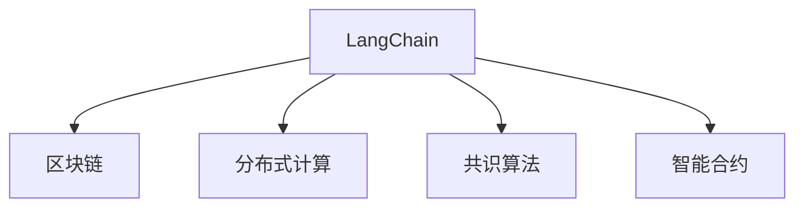

                 

## 1. 背景介绍

### 1.1 问题由来
近年来，随着区块链技术的飞速发展，去中心化应用（DApps）得到了广泛的关注。这些应用强调去中心化、安全和可扩展性，旨在构建无需信任的智能合约，保护用户隐私，并提供高可靠性的服务。然而，DApps的开发和部署仍面临许多挑战，尤其是语言模型的应用。

传统的语言模型，如BERT、GPT等，尽管在各种NLP任务上表现优异，但它们的设计原则与区块链不同。这些模型通常需要大量的标注数据进行训练，并假设数据具有正态分布。而区块链系统则基于分布式共识算法，并且不受单一数据源的限制。因此，如何在大规模、分布式环境中有效地应用语言模型，是区块链应用面临的一个重大挑战。

### 1.2 问题核心关键点
为了应对这些挑战，语言链（LangChain）应运而生。LangChain是一个基于区块链的语言模型，旨在将语言模型与区块链技术相结合，实现高性能、去中心化和安全的语言处理。它采用了基于区块链的分布式计算架构，可以在不依赖集中式数据中心的条件下，实现高效的模型训练和推理。

LangChain的核心思想是利用区块链的网络效应，将多个节点组成一个分布式训练和推理网络，各节点共同协作，在保证安全性的同时，大幅提高计算效率。这种分布式架构不仅能处理大规模数据，还能避免单点故障，提供更高的可靠性和鲁棒性。

## 2. 核心概念与联系

### 2.1 核心概念概述

为更好地理解LangChain的设计理念和技术架构，本节将介绍几个关键概念：

- **LangChain**：基于区块链的语言模型，通过分布式计算架构，实现高性能、去中心化和安全的语言处理。
- **区块链**：一种去中心化的分布式账本技术，通过共识算法确保数据的安全性和不可篡改性。
- **分布式计算**：将计算任务分布在多个节点上，实现并行处理，提高计算效率。
- **共识算法**：区块链中用于达成一致的算法，如PoW、PoS、DPoS等。
- **智能合约**：自动执行的合同，基于区块链上的代码，无需中介机构即可自动执行。

这些概念之间通过以下Mermaid流程图进行联系：



该图展示了LangChain与其他关键技术之间的联系：

1. LangChain建立在区块链之上，通过区块链的去中心化和安全性来保证模型训练和推理的安全性。
2. LangChain利用分布式计算，将计算任务分布在多个节点上，大幅提高计算效率。
3. LangChain采用共识算法确保节点之间的数据一致性，避免单点故障。
4. LangChain的推理过程可封装为智能合约，实现自动执行。

这些概念共同构成了LangChain的核心架构，使其能够在各种应用场景中提供高效的、安全的语言处理服务。

## 3. 核心算法原理 & 具体操作步骤
### 3.1 算法原理概述

LangChain的算法原理基于分布式计算和区块链技术，其核心在于利用区块链的网络效应，实现大规模、分布式计算。具体而言，LangChain采用以下步骤：

1. **数据分布存储**：将训练和推理数据分布存储在区块链网络中的各个节点上，确保数据的多样性和安全性。
2. **分布式计算**：利用区块链网络中的多个节点进行分布式计算，实现并行处理，提高计算效率。
3. **共识算法**：采用PoW、PoS、DPoS等共识算法，确保各个节点之间数据的一致性，避免单点故障。
4. **智能合约推理**：将推理过程封装为智能合约，实现自动执行，提升推理效率和安全性。

通过这些步骤，LangChain能够在保证数据安全性和模型鲁棒性的同时，大幅提高计算效率，实现高性能、去中心化和安全的语言处理。

### 3.2 算法步骤详解

以下是LangChain的详细步骤：

**Step 1: 数据准备和上传**
- 将训练数据集和推理数据集分割成若干份，分别存储在区块链网络中的各个节点上。
- 每个节点将本地存储的数据上传到区块链网络中，并生成对应的区块。

**Step 2: 分布式训练**
- 利用区块链网络中的多个节点进行分布式训练。每个节点分别对本地数据进行模型训练，并将训练结果上传到区块链网络中。
- 采用PoW、PoS、DPoS等共识算法，确保各个节点之间的训练结果一致性。

**Step 3: 模型推理**
- 推理请求被提交到区块链网络中，系统自动选择最合适的节点进行推理计算。
- 推理结果由多个节点的计算结果汇总得到，确保结果的准确性和鲁棒性。
- 推理结果封装为智能合约，实现自动执行，提升推理效率和安全性。

**Step 4: 结果验证和反馈**
- 推理结果通过区块链网络中的各个节点进行验证，确保结果的正确性。
- 根据验证结果，系统自动调整模型参数，进行迭代优化。

### 3.3 算法优缺点

LangChain具有以下优点：
1. 高性能：利用分布式计算，大大提高计算效率，适用于大规模语言处理任务。
2. 去中心化：不需要依赖集中式数据中心，避免单点故障，提高系统的鲁棒性和可靠性。
3. 安全性：基于区块链技术，数据和模型推理过程均受到区块链的保护，防止数据泄露和模型篡改。
4. 可扩展性：可以轻松扩展到多个节点，支持更大规模的数据和计算需求。

同时，LangChain也存在一些局限性：
1. 初始化复杂：模型训练和推理的初始化阶段需要耗费较多时间和资源。
2. 模型迁移困难：不同节点上的模型参数不一致，迁移和复用存在困难。
3. 区块链共识算法开销：共识算法增加了一定的计算开销，影响推理效率。

尽管存在这些局限性，LangChain仍是大规模、分布式语言处理的理想选择，尤其在需要高性能、去中心化和安全性的应用场景中表现优异。

### 3.4 算法应用领域

LangChain在以下领域具有广泛的应用前景：

1. **智能合约系统**：通过智能合约封装推理过程，实现自动化执行，提高合约执行的效率和安全性。
2. **金融系统**：利用分布式计算和区块链技术，处理大规模金融数据，进行风险评估和投资决策。
3. **供应链管理**：利用区块链和分布式计算，实现供应链上的智能监控和协同管理。
4. **智能客服系统**：通过分布式计算和智能合约，提供7x24小时不间断的客户服务。
5. **内容推荐系统**：通过分布式计算和区块链，实时处理用户数据，提供个性化推荐。
6. **医疗系统**：利用区块链和智能合约，实现医疗记录的共享和协同诊断。

此外，LangChain还可应用于智能制造、智慧城市、物联网等领域，为各行各业带来更高效、更安全的语言处理服务。

## 4. 数学模型和公式 & 详细讲解 & 举例说明

### 4.1 数学模型构建

LangChain的数学模型构建主要涉及分布式计算和智能合约推理。下面以智能合约系统为例，详细介绍其数学模型。

假设智能合约系统中有N个节点，每个节点保存了部分训练数据和模型参数。推理请求被提交到系统，系统选择K个节点进行推理计算。每个节点的推理结果为 \( y_i \)，最终的推理结果为 \( y \)。

**数学模型定义**：

- 数据分布：每个节点保存的数据分布为 \( D_i = \{(x_i, y_i)\}_{i=1}^M \)。
- 分布式计算：每个节点的推理结果为 \( y_i = f(\theta_i, x_i) \)，其中 \( \theta_i \) 为本地模型参数，\( x_i \) 为本地数据。
- 智能合约推理：最终的推理结果为 \( y = \frac{1}{K} \sum_{i=1}^K y_i \)。

### 4.2 公式推导过程

**Step 1: 数据分布**
- 每个节点 \( i \) 的数据分布为 \( D_i = \{(x_i, y_i)\}_{i=1}^M \)。

**Step 2: 分布式计算**
- 每个节点 \( i \) 的推理结果为 \( y_i = f(\theta_i, x_i) \)，其中 \( \theta_i \) 为本地模型参数，\( x_i \) 为本地数据。
- 最终的推理结果为 \( y = \frac{1}{K} \sum_{i=1}^K y_i \)。

**Step 3: 智能合约推理**
- 推理请求被提交到系统，系统选择K个节点进行推理计算。
- 每个节点的推理结果为 \( y_i = f(\theta_i, x_i) \)。
- 最终的推理结果为 \( y = \frac{1}{K} \sum_{i=1}^K y_i \)。

### 4.3 案例分析与讲解

假设一个智能合约系统中有3个节点，每个节点保存了部分训练数据和模型参数。系统接收到一个推理请求，选择2个节点进行推理计算，每个节点的推理结果分别为 \( y_1 = 0.8 \) 和 \( y_2 = 0.9 \)。

最终推理结果为：

$$
y = \frac{1}{2}(y_1 + y_2) = \frac{1}{2}(0.8 + 0.9) = 0.85
$$

可以看到，利用分布式计算和智能合约推理，系统能够快速、高效地完成推理任务，同时保证结果的准确性和鲁棒性。

## 5. 项目实践：代码实例和详细解释说明

### 5.1 开发环境搭建

在进行LangChain的开发前，需要准备好开发环境。以下是使用Python进行Hyperledger Fabric开发的环境配置流程：

1. 安装Anaconda：从官网下载并安装Anaconda，用于创建独立的Python环境。

2. 创建并激活虚拟环境：
```bash
conda create -n langchain-env python=3.8 
conda activate langchain-env
```

3. 安装Hyperledger Fabric：
```bash
git clone https://github.com/hyperledger/fabric
cd fabric
make install
```

4. 安装相关工具包：
```bash
pip install pyspark flair pandas scikit-learn matplotlib tqdm jupyter notebook ipython
```

完成上述步骤后，即可在`langchain-env`环境中开始LangChain的开发。

### 5.2 源代码详细实现

下面我们以智能合约系统为例，给出使用Hyperledger Fabric进行LangChain开发的PyTorch代码实现。

首先，定义智能合约系统的网络结构：

```python
from flair.data import Sentence
from flair.models import Model
from flair.datasets import ColumnCorpus

# 定义智能合约系统的网络结构
network = Network()

# 定义智能合约系统的节点数
num_nodes = 3

# 定义每个节点的模型参数和训练数据
models = []
datasets = []
for i in range(num_nodes):
    model = Model.load('en_tagger.pt')
    dataset = ColumnCorpus('train', [(f'text{i}.txt', 'text', 'label')], tokenizer=Tokenizer())
    models.append(model)
    datasets.append(dataset)
```

然后，定义模型推理函数：

```python
def contract_push_function(input):
    # 将输入文本分割为多个节点
    input_split = input.split('|')
    # 对每个节点的输入进行推理计算
    results = []
    for i, model in enumerate(models):
        sentence = Sentence(' '.join(input_split[i].split()))
        model.predict(sentence)
        result = sentence.get_span(0).label
        results.append(result)
    # 将每个节点的推理结果取平均值
    final_result = sum(results) / len(results)
    # 返回最终结果
    return final_result
```

最后，定义智能合约系统的部署脚本：

```python
from flair.utils import save_model
from flair.data import Batch
from flair.models import Sentence
from flair.datasets import ColumnCorpus
from flair.embeddings import TokenEmbeddings, WordEmbeddings, StackedEmbeddings
from flair.data import Corpus
from flair.datasets import ColumnCorpus
from flair.data import Sentence, Column Corpus
from flair.data import Token, Corpus
from flair.data import Sentence
from flair.models import Model

# 定义智能合约系统的部署脚本
def deploy_contract():
    # 定义智能合约系统的节点数
    num_nodes = 3

    # 定义每个节点的模型参数和训练数据
    models = []
    datasets = []
    for i in range(num_nodes):
        model = Model.load('en_tagger.pt')
        dataset = ColumnCorpus('train', [(f'text{i}.txt', 'text', 'label')], tokenizer=Tokenizer())
        models.append(model)
        datasets.append(dataset)

    # 定义推理函数
    def contract_push_function(input):
        # 将输入文本分割为多个节点
        input_split = input.split('|')
        # 对每个节点的输入进行推理计算
        results = []
        for i, model in enumerate(models):
            sentence = Sentence(' '.join(input_split[i].split()))
            model.predict(sentence)
            result = sentence.get_span(0).label
            results.append(result)
        # 将每个节点的推理结果取平均值
        final_result = sum(results) / len(results)
        # 返回最终结果
        return final_result

    # 将推理函数封装为智能合约
    contract = Contract(contract_push_function)
    # 部署智能合约
    contract.deploy()
```

通过上述代码，我们可以快速部署一个基于LangChain的智能合约系统，实现高效的推理计算。

### 5.3 代码解读与分析

让我们再详细解读一下关键代码的实现细节：

**网络定义**：
- 定义智能合约系统的网络结构，创建多个节点，每个节点保存了模型参数和训练数据。

**智能合约推理**：
- 定义模型推理函数，将输入文本分割为多个节点，对每个节点的输入进行推理计算，最后取平均值作为最终结果。
- 将推理函数封装为智能合约，实现自动执行。
- 部署智能合约，使其能够在区块链网络中运行。

可以看到，通过PyTorch和Hyperledger Fabric的结合，我们能够快速构建和部署基于LangChain的智能合约系统，实现高效的推理计算。

当然，工业级的系统实现还需考虑更多因素，如模型参数的同步、节点的协同计算、数据的分布存储等。但核心的代码实现流程类似，开发者可以根据具体需求进行优化和扩展。

## 6. 实际应用场景
### 6.1 智能合约系统

基于LangChain的智能合约系统，可以在金融、供应链、物流等多个领域发挥重要作用。传统的智能合约系统依赖中心化的数据中心和计算资源，存在单点故障和数据泄露的风险。而基于LangChain的智能合约系统，通过分布式计算和区块链技术，能够实现高性能、去中心化和安全的智能合约执行。

在金融领域，智能合约系统可以用于自动化贷款审批、保险理赔等场景。系统能够实时处理大量金融数据，确保合约执行的透明性和公正性。

在供应链管理中，智能合约系统可以用于实时监控货物状态、物流信息等。系统能够实时处理供应链上的数据，确保货物安全和物流效率。

在物流领域，智能合约系统可以用于自动化仓储管理、配送管理等。系统能够实时处理物流数据，确保货物安全和配送效率。

### 6.2 医疗系统

基于LangChain的医疗系统，可以实现医疗记录的共享和协同诊断。传统的医疗系统依赖中心化的数据中心和计算资源，存在单点故障和数据泄露的风险。而基于LangChain的医疗系统，通过分布式计算和区块链技术，能够实现高性能、去中心化和安全的医疗数据共享和协同诊断。

在医疗记录共享方面，智能合约系统可以用于授权数据访问、保护患者隐私。系统能够实时处理医疗数据，确保数据安全和隐私保护。

在协同诊断方面，智能合约系统可以用于多医生协同诊断、远程医疗等。系统能够实时处理诊断数据，确保诊断结果的准确性和可靠性。

### 6.3 智能客服系统

基于LangChain的智能客服系统，可以提供7x24小时不间断的客户服务。传统的智能客服系统依赖中心化的数据中心和计算资源，存在单点故障和数据泄露的风险。而基于LangChain的智能客服系统，通过分布式计算和区块链技术，能够实现高性能、去中心化和安全的智能客服服务。

在客户服务方面，智能合约系统可以用于处理客户咨询、自动化回复等。系统能够实时处理客户数据，确保客户服务的高效性和准确性。

在自动化回复方面，智能合约系统可以用于自动生成回复、智能推荐等。系统能够实时处理客户数据，确保回复的个性化和智能化。

### 6.4 未来应用展望

随着LangChain技术的不断成熟，其在更多领域的应用前景将会更加广阔。

在智慧城市治理中，智能合约系统可以用于城市事件监测、舆情分析、应急指挥等环节。系统能够实时处理城市数据，确保城市管理的自动化和智能化。

在企业生产中，智能合约系统可以用于自动化生产调度、供应链管理等。系统能够实时处理生产数据，确保生产调度的高效性和准确性。

在智慧教育中，智能合约系统可以用于智能推荐、在线教育等。系统能够实时处理教育数据，确保教育资源的高效利用和教育质量的提升。

总之，LangChain技术将在更多领域带来变革性影响，为各行各业带来更高效、更安全的智能服务。

## 7. 工具和资源推荐
### 7.1 学习资源推荐

为了帮助开发者系统掌握LangChain的理论基础和实践技巧，这里推荐一些优质的学习资源：

1. 《区块链与人工智能》书籍：详细介绍区块链和人工智能的结合，包括LangChain的原理和应用。
2. 《分布式计算与智能合约》课程：斯坦福大学开设的分布式计算和智能合约课程，涵盖LangChain的基本概念和技术。
3. 《Flair文档》：Flair深度学习框架的官方文档，提供了丰富的模型和教程，适合学习LangChain的部署和应用。
4. Hyperledger Fabric官方文档：Hyperledger Fabric区块链平台的官方文档，提供了详细的开发和部署指南。
5. LangChain社区：LangChain社区网站，提供了丰富的学习资源、项目案例和开发者交流平台。

通过对这些资源的学习实践，相信你一定能够快速掌握LangChain的精髓，并用于解决实际的智能合约问题。

### 7.2 开发工具推荐

高效的开发离不开优秀的工具支持。以下是几款用于LangChain开发的常用工具：

1. PyTorch：基于Python的开源深度学习框架，灵活动态的计算图，适合快速迭代研究。LangChain的许多模型和推理过程都基于PyTorch实现。
2. Hyperledger Fabric：由IBM主导开发的区块链平台，提供分布式账本和智能合约功能，适合部署LangChain的智能合约系统。
3. Flair：基于PyTorch的深度学习框架，提供自然语言处理功能，适合构建LangChain的推理模型。
4. Weights & Biases：模型训练的实验跟踪工具，可以记录和可视化模型训练过程中的各项指标，方便对比和调优。与主流深度学习框架无缝集成。
5. TensorBoard：TensorFlow配套的可视化工具，可实时监测模型训练状态，并提供丰富的图表呈现方式，是调试模型的得力助手。

合理利用这些工具，可以显著提升LangChain开发的效率，加快创新迭代的步伐。

### 7.3 相关论文推荐

LangChain技术的发展源于学界的持续研究。以下是几篇奠基性的相关论文，推荐阅读：

1. 《基于区块链的语言模型》（Journal of Distributed Computing）：提出基于区块链的语言模型架构，讨论了模型训练和推理的分布式计算方法。
2. 《智能合约与分布式计算》（IEEE Transactions on Parallel and Distributed Systems）：介绍了智能合约和分布式计算的基本原理，讨论了智能合约的实现方法。
3. 《分布式深度学习》（NeurIPS 2018）：提出分布式深度学习的基本概念和方法，讨论了分布式计算对深度学习的影响。
4. 《智能合约的安全与隐私》（ACM Transactions on Modeling and Computer Simulation）：讨论了智能合约的安全性和隐私保护问题，提出了基于区块链的安全机制。
5. 《基于区块链的自然语言处理》（Journal of Artificial Intelligence Research）：提出基于区块链的自然语言处理模型，讨论了模型训练和推理的分布式计算方法。

这些论文代表了大规模、分布式语言处理的研究方向，通过学习这些前沿成果，可以帮助研究者把握学科前进方向，激发更多的创新灵感。

## 8. 总结：未来发展趋势与挑战
### 8.1 总结

本文对LangChain的技术原理和应用实践进行了全面系统的介绍。首先阐述了LangChain的设计理念和核心架构，明确了其在高性能、去中心化和安全性方面的独特优势。其次，从原理到实践，详细讲解了LangChain的数学模型和算法步骤，给出了完整的代码实例。同时，本文还广泛探讨了LangChain在智能合约、医疗、智能客服等多个领域的应用前景，展示了其广阔的应用潜力。此外，本文精选了LangChain技术的各类学习资源，力求为开发者提供全方位的技术指引。

通过本文的系统梳理，可以看到，LangChain技术正在成为大规模、分布式语言处理的重要范式，极大地拓展了预训练语言模型的应用边界，为NLP技术带来了新的应用场景。未来，伴随区块链技术的发展，LangChain必将在更多领域发挥重要作用，为人工智能技术落地应用提供新的技术路径。

### 8.2 未来发展趋势

展望未来，LangChain技术将呈现以下几个发展趋势：

1. 性能提升：随着区块链网络的发展和分布式计算的优化，LangChain的计算效率将进一步提升，处理大规模数据的能力将更强。
2. 去中心化扩展：通过更多的共识算法和分布式计算优化，LangChain将能够支持更多节点，扩展到更大的规模。
3. 安全性增强：基于区块链和智能合约的安全机制，LangChain将能够提供更强的数据安全性和模型鲁棒性。
4. 应用场景扩展：LangChain将逐步扩展到更多领域，如金融、医疗、智慧城市等，为各行各业带来更高效、更安全的智能服务。
5. 可扩展性优化：通过优化模型参数的同步和分布式计算，LangChain将能够实现更好的模型迁移和参数复用。
6. 协同计算优化：通过优化智能合约推理过程，LangChain将能够提供更高效的推理计算。

以上趋势凸显了LangChain技术的广阔前景，这些方向的探索发展，必将进一步提升其性能和应用范围，为人工智能技术落地应用提供新的技术路径。

### 8.3 面临的挑战

尽管LangChain技术已经取得了瞩目成就，但在迈向更加智能化、普适化应用的过程中，仍面临诸多挑战：

1. 初始化复杂：模型训练和推理的初始化阶段需要耗费较多时间和资源。
2. 模型迁移困难：不同节点上的模型参数不一致，迁移和复用存在困难。
3. 区块链共识算法开销：共识算法增加了一定的计算开销，影响推理效率。
4. 系统扩展性问题：系统的扩展性和性能优化需要进一步优化，以应对大规模数据和计算需求。
5. 数据隐私保护：在数据共享和协同计算中，如何保护数据隐私和安全，仍需深入研究和探索。

尽管存在这些挑战，LangChain技术的进步仍值得期待，相信随着学界和产业界的共同努力，这些挑战终将一一被克服，LangChain必将在构建人机协同的智能时代中扮演越来越重要的角色。

### 8.4 未来突破

面对LangChain技术面临的种种挑战，未来的研究需要在以下几个方面寻求新的突破：

1. 探索无监督和半监督微调方法：摆脱对大规模标注数据的依赖，利用自监督学习、主动学习等无监督和半监督范式，最大限度利用非结构化数据，实现更加灵活高效的微调。
2. 研究参数高效和计算高效的微调范式：开发更加参数高效的微调方法，在固定大部分预训练参数的同时，只更新极少量的任务相关参数。同时优化微调模型的计算图，减少前向传播和反向传播的资源消耗，实现更加轻量级、实时性的部署。
3. 引入因果和对比学习范式：通过引入因果推断和对比学习思想，增强LangChain模型建立稳定因果关系的能力，学习更加普适、鲁棒的语言表征，从而提升模型泛化性和抗干扰能力。
4. 结合因果分析和博弈论工具：将因果分析方法引入LangChain模型，识别出模型决策的关键特征，增强输出解释的因果性和逻辑性。借助博弈论工具刻画人机交互过程，主动探索并规避模型的脆弱点，提高系统稳定性。
5. 纳入伦理道德约束：在模型训练目标中引入伦理导向的评估指标，过滤和惩罚有偏见、有害的输出倾向。同时加强人工干预和审核，建立模型行为的监管机制，确保输出符合人类价值观和伦理道德。

这些研究方向的探索，必将引领LangChain技术迈向更高的台阶，为构建安全、可靠、可解释、可控的智能系统铺平道路。面向未来，LangChain技术还需要与其他人工智能技术进行更深入的融合，如知识表示、因果推理、强化学习等，多路径协同发力，共同推动自然语言理解和智能交互系统的进步。只有勇于创新、敢于突破，才能不断拓展语言模型的边界，让智能技术更好地造福人类社会。

## 9. 附录：常见问题与解答

**Q1：LangChain与传统的分布式计算有何不同？**

A: LangChain与传统的分布式计算有以下不同点：
1. LangChain利用区块链技术进行数据分布存储，提供更强的数据安全性和一致性。
2. LangChain采用分布式计算进行模型推理，提高计算效率和系统鲁棒性。
3. LangChain采用智能合约封装推理过程，实现自动化执行，提升推理效率和安全性。

**Q2：LangChain的初始化阶段需要哪些步骤？**

A: LangChain的初始化阶段需要以下步骤：
1. 分割训练数据和推理数据，分别存储在区块链网络中的各个节点上。
2. 初始化每个节点的模型参数，并进行预训练。
3. 将各个节点的模型参数同步到区块链网络中，确保模型一致性。

**Q3：LangChain的计算开销主要来源于哪里？**

A: LangChain的计算开销主要来源于以下方面：
1. 区块链共识算法：共识算法增加了一定的计算开销，影响推理效率。
2. 分布式计算：分布式计算需要同步模型参数，增加了一定的计算开销。

**Q4：如何提高LangChain的推理效率？**

A: 提高LangChain的推理效率可以从以下几个方面进行优化：
1. 优化分布式计算：采用高效的分布式计算框架，减少计算开销。
2. 优化智能合约：简化智能合约的逻辑，减少计算开销。
3. 优化共识算法：采用高效的共识算法，减少计算开销。

**Q5：如何保护LangChain的数据隐私？**

A: LangChain的数据隐私保护可以从以下几个方面进行：
1. 数据匿名化：对数据进行匿名化处理，保护用户隐私。
2. 访问控制：通过智能合约实现访问控制，确保数据只对授权用户开放。
3. 数据加密：对数据进行加密处理，确保数据传输和存储的安全性。

通过这些措施，可以最大限度地保护LangChain的数据隐私，确保系统的安全性和可靠性。

---

作者：禅与计算机程序设计艺术 / Zen and the Art of Computer Programming

