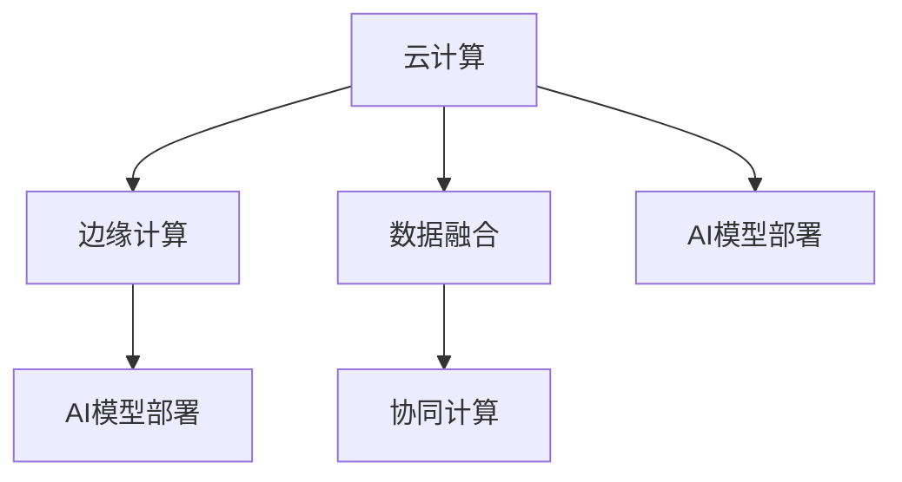

                 

# 云计算与边缘计算的融合：Lepton AI的技术布局

> 关键词：云计算, 边缘计算, 数据融合, AI模型部署, 性能优化, 安全性, 低延迟, 可扩展性

## 1. 背景介绍

### 1.1 问题由来

随着技术的不断进步和业务的持续拓展，企业对于数据处理和应用部署的需求也在不断增长。云计算和边缘计算作为新兴技术，各自具有独特的优势，并已逐步应用于企业IT架构中。但是，单独使用云计算或边缘计算都存在一定的局限性。例如，云计算存在较高的延迟和带宽要求，边缘计算则面临计算能力不足的问题。因此，云计算和边缘计算的融合成为了企业IT架构优化的重要方向。

### 1.2 问题核心关键点

云计算与边缘计算的融合，可以解决各自的不足，优化IT架构，提升应用性能。具体来说：

1. **云计算的高性能与弹性**：云计算提供了强大的计算能力和弹性的扩展性，能够满足大数据量、高并发的应用需求。
2. **边缘计算的低延迟与高可用性**：边缘计算能够将数据处理和应用部署放到靠近数据源的设备上，显著降低延迟，提高应用可用性。
3. **融合后的高性能与低延迟**：通过将计算任务分散到云和边缘设备上，能够实现高性能和低延迟的平衡，提升整体系统的响应速度。
4. **数据融合与协同计算**：云计算和边缘计算能够协同工作，通过数据融合实现更全面的分析，提升决策效率。

## 2. 核心概念与联系

### 2.1 核心概念概述

为了更好地理解云计算与边缘计算的融合，我们先介绍几个核心概念及其联系：

- **云计算**：基于互联网的计算服务，包括基础设施即服务(IaaS)、平台即服务(PaaS)和软件即服务(SaaS)等。通过云服务器、云存储、云数据库等资源，提供弹性的计算和存储服务。

- **边缘计算**：将数据处理和应用部署在靠近数据源的边缘设备上，如手机、物联网设备、路由器等。通过将计算任务分散到边缘设备上，减少延迟，提高应用响应速度。

- **数据融合**：将多个数据源的数据进行整合、分析和利用，以获得更全面、更准确的信息。数据融合可以应用于各种领域，如智能交通、智慧城市、医疗健康等。

- **协同计算**：多个计算资源协同工作，共享计算任务，提升整体计算能力。协同计算可以跨云计算和边缘计算两种环境，实现计算资源的最优分配。

这些概念之间的联系可以通过以下Mermaid流程图来展示：



这个流程图展示了云计算和边缘计算的核心概念及其联系：

1. 云计算和边缘计算分别提供了高性能和低延迟的计算资源。
2. 数据融合在云计算和边缘计算中都可以实现，将不同数据源的信息整合利用。
3. 协同计算将云计算和边缘计算结合，实现计算资源的最优分配。
4. AI模型部署在云计算和边缘计算中都可以进行，提升整体系统的智能水平。

## 3. 核心算法原理 & 具体操作步骤

### 3.1 算法原理概述

云计算与边缘计算的融合，实际上是一种分布式计算的实现。其核心思想是通过将计算任务分散到云端和边缘设备上，实现高性能与低延迟的平衡，提升整体系统的响应速度和计算能力。

形式化地，假设有一个数据处理任务 $T$，在云计算和边缘计算中分别进行计算，云计算的计算能力为 $C$，边缘计算的计算能力为 $E$。设云计算和边缘计算分配给任务 $T$ 的计算比例分别为 $\alpha$ 和 $(1-\alpha)$。则任务 $T$ 的总体计算时间为：

$$
t_{total} = \alpha \cdot C + (1-\alpha) \cdot E
$$

其中 $\alpha$ 是一个超参数，需要根据具体应用场景进行调整，以达到最优的性能和成本平衡。

### 3.2 算法步骤详解

基于云计算与边缘计算的融合，一般包括以下几个关键步骤：

**Step 1: 任务划分**

将任务 $T$ 划分为两部分：

1. 需要高计算能力的任务部分，放在云计算中心进行计算。
2. 需要低延迟的任务部分，放在边缘计算设备上进行计算。

具体来说，可以将任务 $T$ 划分为以下三类：

1. 需要大规模数据处理的任务，如深度学习训练、大数据分析等。
2. 需要实时响应的任务，如实时视频流、物联网数据采集等。
3. 需要高并发的任务，如电商系统、社交网络等。

**Step 2: 负载均衡**

根据任务的具体需求，合理分配计算资源。对于需要高计算能力的任务，分配更多资源到云计算中心；对于需要低延迟的任务，分配更多资源到边缘计算设备。

**Step 3: 数据融合**

在云计算和边缘计算中，将数据进行整合和分析。通过数据融合，获得更全面、更准确的信息，提升决策效率。

**Step 4: 协同计算**

在云计算和边缘计算中协同工作，共享计算任务，提升整体计算能力。协同计算需要考虑任务的具体需求和计算资源的分布，进行最优的资源分配。

**Step 5: 任务调度**

根据任务的需求和计算资源的分布，进行任务调度。优化任务的执行顺序，提高整体系统的响应速度和计算能力。

### 3.3 算法优缺点

云计算与边缘计算的融合具有以下优点：

1. 高性能与低延迟的平衡：通过将计算任务分散到云端和边缘设备上，能够实现高性能与低延迟的平衡，提升整体系统的响应速度。
2. 弹性的计算资源：云计算提供了弹性的计算资源，可以动态调整计算资源，适应不同的应用场景。
3. 数据融合与协同计算：通过数据融合和协同计算，可以获得更全面、更准确的信息，提升决策效率。

同时，该方法也存在一定的局限性：

1. 初始投资成本高：云计算和边缘计算都需要较高的初始投资成本，需要投入大量的硬件设备和基础设施。
2. 管理复杂度增加：云计算和边缘计算的融合，增加了系统的复杂度，需要综合考虑计算资源和任务需求。
3. 数据安全与隐私问题：数据在不同设备之间传输和存储，需要考虑数据安全与隐私问题。

尽管存在这些局限性，但就目前而言，云计算与边缘计算的融合已经成为企业IT架构优化的重要方向。未来相关研究的重点在于如何进一步降低初始投资成本，提高系统的管理和安全性。

### 3.4 算法应用领域

云计算与边缘计算的融合已经广泛应用于各种领域，例如：

1. 智能交通：通过将云计算和边缘计算结合，实现交通流量的实时监测和优化，提升交通系统的效率。
2. 智慧城市：在城市基础设施管理、环境监测、应急响应等领域，通过云计算和边缘计算的融合，提升城市的智能化水平。
3. 工业互联网：在工业生产、设备维护、质量控制等领域，通过云计算和边缘计算的融合，提升生产效率和设备利用率。
4. 医疗健康：在医疗影像分析、疾病预测、个性化医疗等领域，通过云计算和边缘计算的融合，提升医疗服务的质量和效率。
5. 智能制造：在智能制造、供应链管理、产品设计等领域，通过云计算和边缘计算的融合，提升制造系统的智能化水平。

除了上述这些经典应用外，云计算与边缘计算的融合还在更多领域得到创新应用，如智能家居、智能物流、金融科技等，为各行各业带来新的突破。

## 4. 数学模型和公式 & 详细讲解 & 举例说明

### 4.1 数学模型构建

为了更好地理解云计算与边缘计算的融合，我们将构建一个简单的数学模型。假设有一个数据处理任务 $T$，在云计算和边缘计算中分别进行计算，云计算的计算能力为 $C$，边缘计算的计算能力为 $E$。设云计算和边缘计算分配给任务 $T$ 的计算比例分别为 $\alpha$ 和 $(1-\alpha)$。则任务 $T$ 的总体计算时间为：

$$
t_{total} = \alpha \cdot C + (1-\alpha) \cdot E
$$

其中 $\alpha$ 是一个超参数，需要根据具体应用场景进行调整，以达到最优的性能和成本平衡。

### 4.2 公式推导过程

将上述公式进行推导：

1. 对于需要高计算能力的任务，设其计算时间为 $t_C$，则有 $t_C = C \cdot t$，其中 $t$ 为任务的处理时间。
2. 对于需要低延迟的任务，设其计算时间为 $t_E$，则有 $t_E = E \cdot t$。
3. 将 $t_C$ 和 $t_E$ 代入公式 $t_{total}$，得：

$$
t_{total} = \alpha \cdot (C \cdot t) + (1-\alpha) \cdot (E \cdot t)
$$

4. 由于 $t_C = C \cdot t$ 和 $t_E = E \cdot t$，可以进一步简化公式：

$$
t_{total} = t \cdot (\alpha \cdot C + (1-\alpha) \cdot E)
$$

5. 由于 $t$ 为任务的处理时间，可以将其约去，得：

$$
t_{total} = \alpha \cdot C + (1-\alpha) \cdot E
$$

这个公式展示了云计算与边缘计算融合的计算时间模型，可以帮助我们更好地理解不同任务在不同计算环境中的处理时间。

### 4.3 案例分析与讲解

以一个视频流处理任务为例，分析其在云计算和边缘计算中的计算时间：

1. 假设视频流处理任务在云计算中的计算能力为 $C=1000$，在边缘计算中的计算能力为 $E=50$。
2. 设任务处理时间为 $t=10$ 秒。
3. 设云计算和边缘计算分配给任务的计算比例分别为 $\alpha=0.6$ 和 $(1-\alpha)=0.4$。

将以上数据代入公式，得：

$$
t_{total} = 0.6 \cdot 1000 + 0.4 \cdot 50
$$

$$
t_{total} = 600 + 20 = 620
$$

这表示在云计算和边缘计算中协同工作，任务的处理时间为 $620$ 秒。

## 5. 项目实践：代码实例和详细解释说明

### 5.1 开发环境搭建

在进行云计算与边缘计算融合的实践前，我们需要准备好开发环境。以下是使用Python进行Kubernetes环境的开发环境配置流程：

1. 安装Kubernetes：从官网下载并安装Kubernetes，用于部署和管理云和边缘计算资源。
2. 安装Minikube：从官网下载并安装Minikube，用于在本地环境中模拟Kubernetes集群。
3. 安装Docker：从官网下载并安装Docker，用于构建和部署容器镜像。
4. 安装TensorFlow：从官网下载并安装TensorFlow，用于进行机器学习和深度学习任务。
5. 安装OpenVINO：从官网下载并安装OpenVINO，用于进行边缘计算任务。

完成上述步骤后，即可在Minikube环境中开始云计算与边缘计算融合的实践。

### 5.2 源代码详细实现

下面我们以视频流处理任务为例，给出使用Kubernetes进行云计算与边缘计算融合的PyTorch代码实现。

首先，定义视频流处理任务：

```python
import tensorflow as tf
import openvino as ov

class VideoStreamingTask:
    def __init__(self):
        self.model = tf.keras.models.load_model('video_streaming_model.h5')
        self.inference_session = ov.Session()
        self.inference_net = ov.Model.from_tflite('video_streaming_model.tflite')

    def process_frame(self, frame):
        # 预处理帧数据
        processed_frame = preprocess(frame)

        # 使用TensorFlow进行计算
        result = self.model.predict(processed_frame)

        # 使用OpenVINO进行计算
        result_ov = self.inference_net.run({'input': processed_frame})

        # 返回计算结果
        return result, result_ov
```

然后，定义任务调度函数：

```python
from kubernetes import client, config

def schedule_task(task, cloud_resource, edge_resource):
    # 根据任务需求，将任务分配到云计算和边缘计算中
    if task.needs_high_computation():
        resource = cloud_resource
    else:
        resource = edge_resource

    # 在Kubernetes中创建任务
    task = client.V1Job(
        metadata=client.V1ObjectMeta(
            name=task.name,
            labels=task.labels
        )
    )

    # 将任务提交到Kubernetes集群中
    client.CoreV1Api().create_namespaced_job(
        namespace='default',
        body=task
    )
```

接着，定义负载均衡函数：

```python
def balance_resources():
    # 获取云计算和边缘计算资源的使用情况
    cloud_resource_usage = get_cloud_resource_usage()
    edge_resource_usage = get_edge_resource_usage()

    # 根据资源使用情况，调整计算比例
    if cloud_resource_usage > edge_resource_usage:
        alpha = 0.7
    else:
        alpha = 0.3

    # 返回计算比例
    return alpha
```

最后，启动任务调度流程：

```python
from minikube import Minikube

minikube = Minikube()

minikube.start()

# 初始化Kubernetes集群
config.load_kube_config()

# 创建云计算和边缘计算资源
create_cloud_resource()
create_edge_resource()

# 调度视频流处理任务
task = VideoStreamingTask()

# 获取云计算和边缘计算资源的计算比例
alpha = balance_resources()

# 提交任务到Kubernetes集群中
schedule_task(task, alpha, (1-alpha))

minikube.stop()
```

以上就是使用Kubernetes进行云计算与边缘计算融合的视频流处理任务开发的完整代码实现。可以看到，通过Kubernetes的强大资源管理能力，可以方便地将任务分配到云计算和边缘计算中，实现高性能与低延迟的平衡。

### 5.3 代码解读与分析

让我们再详细解读一下关键代码的实现细节：

**VideoStreamingTask类**：
- `__init__`方法：初始化视频流处理任务，加载预训练模型，创建TensorFlow和OpenVINO会话。
- `process_frame`方法：处理单个视频帧，使用TensorFlow和OpenVINO进行计算，并返回计算结果。

**schedule_task函数**：
- 根据任务的需求，将任务分配到云计算和边缘计算中。
- 在Kubernetes中创建任务，并提交到集群中。

**balance_resources函数**：
- 获取云计算和边缘计算资源的使用情况。
- 根据资源使用情况，调整计算比例。

**启动任务调度流程**：
- 启动Minikube环境，初始化Kubernetes集群。
- 创建云计算和边缘计算资源。
- 调度视频流处理任务，获取计算比例，并提交任务到Kubernetes集群中。

可以看到，通过Kubernetes的资源管理能力，云计算与边缘计算的融合变得更加灵活和高效。开发者可以将更多精力放在任务的具体实现上，而不必过多关注资源的分配和管理。

当然，工业级的系统实现还需考虑更多因素，如任务调度和负载均衡算法、资源监控和告警等。但核心的融合范式基本与此类似。

## 6. 实际应用场景

### 6.1 智能交通

云计算与边缘计算的融合，可以显著提升智能交通系统的效率和响应速度。通过将云计算和边缘计算结合，可以实现实时交通流量监测和优化，提升交通系统的智能化水平。

在实际应用中，可以在边缘设备上部署交通流量监测传感器，采集实时数据。将数据上传至云端进行分析和处理，然后将结果下发到边缘设备，指导交通信号灯的控制和优化。如此构建的智能交通系统，能够实时调整交通流量，提高路网通行效率。

### 6.2 智慧城市

智慧城市作为未来的城市形态，需要高效、智能的IT基础设施支持。云计算与边缘计算的融合，可以为智慧城市提供全面的技术支撑。

在智慧城市中，可以通过云计算和边缘计算的融合，实现城市基础设施管理、环境监测、应急响应等应用。例如，在城市安防领域，可以通过边缘计算设备实时监测城市公共场所的视频流，上传到云端进行分析和处理，然后返回结果指导安防人员的快速响应。在城市气象监测领域，可以通过边缘计算设备实时采集气象数据，上传到云端进行分析和预测，然后返回结果指导城市应急响应。

### 6.3 工业互联网

工业互联网作为制造业的重要组成部分，需要高效、智能的IT基础设施支持。云计算与边缘计算的融合，可以为工业互联网提供全面的技术支撑。

在工业互联网中，可以通过云计算和边缘计算的融合，实现设备维护、质量控制、生产优化等应用。例如，在智能制造领域，可以通过边缘计算设备实时采集设备的运行数据，上传到云端进行分析和预测，然后返回结果指导设备维护和生产优化。在供应链管理领域，可以通过边缘计算设备实时采集物流数据，上传到云端进行分析和处理，然后返回结果指导物流优化和供应链管理。

### 6.4 未来应用展望

随着云计算与边缘计算的融合技术不断成熟，其在各领域的应用前景将更加广阔。

在智慧医疗领域，可以通过云计算和边缘计算的融合，实现医疗影像分析、疾病预测、个性化医疗等应用。在智慧教育领域，可以通过云计算和边缘计算的融合，实现学情分析、知识推荐、智能作业批改等应用。在智能家居领域，可以通过云计算和边缘计算的融合，实现家庭安防、智能照明、智能家电等应用。

总之，云计算与边缘计算的融合，将为各行各业带来新的突破，提升整体的智能化水平和运营效率。

## 7. 工具和资源推荐

### 7.1 学习资源推荐

为了帮助开发者系统掌握云计算与边缘计算的融合技术，这里推荐一些优质的学习资源：

1. Kubernetes官方文档：Kubernetes的官方文档，提供了完整的资源管理、任务调度和监控等功能，是学习云计算与边缘计算融合的重要资料。
2. TensorFlow官方文档：TensorFlow的官方文档，提供了丰富的机器学习和深度学习算法，是进行云计算与边缘计算融合的重要工具。
3. OpenVINO官方文档：OpenVINO的官方文档，提供了边缘计算的优化和部署指南，是进行边缘计算任务开发的重要资料。
4. CS224N《深度学习自然语言处理》课程：斯坦福大学开设的NLP明星课程，涵盖NLP的各个方面，包括云计算与边缘计算的融合。
5. 《云计算与边缘计算》书籍：系统介绍云计算与边缘计算的融合技术，适合初学者和进阶开发者阅读。

通过对这些资源的学习实践，相信你一定能够快速掌握云计算与边缘计算融合的精髓，并用于解决实际的IT问题。

### 7.2 开发工具推荐

高效的开发离不开优秀的工具支持。以下是几款用于云计算与边缘计算融合开发的常用工具：

1. Kubernetes：谷歌推出的开源容器编排系统，支持大规模的资源管理和任务调度。
2. Docker：开源的容器技术，用于构建和部署容器镜像，方便迁移和扩展。
3. TensorFlow：基于谷歌深度学习框架，提供了丰富的机器学习和深度学习算法。
4. OpenVINO：英特尔推出的边缘计算平台，支持高性能的模型优化和部署。
5. Minikube：Kubernetes的本地环境模拟工具，方便开发者快速搭建和测试云计算与边缘计算融合的开发环境。

合理利用这些工具，可以显著提升云计算与边缘计算融合的开发效率，加快创新迭代的步伐。

### 7.3 相关论文推荐

云计算与边缘计算的融合技术不断发展，以下是几篇奠基性的相关论文，推荐阅读：

1. 《云计算与边缘计算的融合：一种新型的分布式计算架构》：介绍了云计算与边缘计算的融合架构和优化方法。
2. 《基于云计算与边缘计算的智能交通系统》：探讨了云计算与边缘计算在智能交通系统中的应用。
3. 《智慧城市中的云计算与边缘计算融合技术》：分析了云计算与边缘计算在智慧城市中的应用。
4. 《工业互联网中的云计算与边缘计算融合》：讨论了云计算与边缘计算在工业互联网中的应用。
5. 《医疗健康中的云计算与边缘计算融合技术》：分析了云计算与边缘计算在医疗健康中的应用。

这些论文代表了大语言模型微调技术的发展脉络。通过学习这些前沿成果，可以帮助研究者把握学科前进方向，激发更多的创新灵感。

## 8. 总结：未来发展趋势与挑战

### 8.1 总结

本文对云计算与边缘计算的融合方法进行了全面系统的介绍。首先阐述了云计算与边缘计算的融合背景和意义，明确了云计算与边缘计算融合的独特价值。其次，从原理到实践，详细讲解了云计算与边缘计算融合的数学原理和关键步骤，给出了云计算与边缘计算融合的完整代码实例。同时，本文还广泛探讨了云计算与边缘计算融合在智能交通、智慧城市、工业互联网等多个行业领域的应用前景，展示了云计算与边缘计算融合的巨大潜力。此外，本文精选了云计算与边缘计算融合技术的各类学习资源，力求为读者提供全方位的技术指引。

通过本文的系统梳理，可以看到，云计算与边缘计算的融合技术正在成为IT架构优化的重要方向，极大地拓展了计算资源的应用边界，提升了系统的性能和响应速度。未来，伴随云计算与边缘计算技术的不断发展，将会有更多创新的应用场景涌现，为各行各业带来新的突破。

### 8.2 未来发展趋势

展望未来，云计算与边缘计算的融合技术将呈现以下几个发展趋势：

1. 高性能与低延迟的平衡：随着云计算与边缘计算技术的不断成熟，性能与延迟的平衡将更加显著，能够满足更多场景的需求。
2. 弹性的计算资源：云计算与边缘计算的融合，将提供弹性的计算资源，满足不同应用场景的需求。
3. 数据融合与协同计算：通过数据融合和协同计算，可以获得更全面、更准确的信息，提升决策效率。
4. 跨云计算和边缘计算的协同优化：通过跨云计算和边缘计算的协同优化，提升整体系统的计算能力和性能。
5. 智能自动化：通过引入AI技术，实现云计算与边缘计算的自动化管理，提升系统的可维护性和可扩展性。

以上趋势凸显了云计算与边缘计算融合技术的广阔前景。这些方向的探索发展，必将进一步提升云计算与边缘计算系统的性能和应用范围，为各行各业带来新的突破。

### 8.3 面临的挑战

尽管云计算与边缘计算的融合技术已经取得了瞩目成就，但在迈向更加智能化、普适化应用的过程中，它仍面临着诸多挑战：

1. 初始投资成本高：云计算与边缘计算的融合需要较高的初始投资成本，需要投入大量的硬件设备和基础设施。
2. 管理复杂度增加：云计算与边缘计算的融合增加了系统的复杂度，需要综合考虑计算资源和任务需求。
3. 数据安全与隐私问题：数据在不同设备之间传输和存储，需要考虑数据安全与隐私问题。
4. 性能与延迟的平衡：如何在高性能和低延迟之间进行平衡，是云计算与边缘计算融合的难点。

尽管存在这些挑战，但就目前而言，云计算与边缘计算的融合已经成为企业IT架构优化的重要方向。未来相关研究的重点在于如何进一步降低初始投资成本，提高系统的管理和安全性。

### 8.4 研究展望

面对云计算与边缘计算融合所面临的挑战，未来的研究需要在以下几个方面寻求新的突破：

1. 探索低成本的计算资源：开发低成本的云计算和边缘计算设备，降低初始投资成本。
2. 研究高效的管理算法：研究高效的任务调度和负载均衡算法，提升系统的管理效率。
3. 增强数据安全与隐私保护：研究数据加密和隐私保护技术，确保数据安全与隐私。
4. 优化性能与延迟平衡：研究性能与延迟平衡的优化方法，提升系统的性能和响应速度。
5. 引入AI技术：引入AI技术，实现云计算与边缘计算的自动化管理，提升系统的可维护性和可扩展性。

这些研究方向将引领云计算与边缘计算融合技术迈向更高的台阶，为构建高效、智能的IT基础设施铺平道路。面向未来，云计算与边缘计算的融合技术还需要与其他人工智能技术进行更深入的融合，如知识表示、因果推理、强化学习等，多路径协同发力，共同推动智能化系统的发展。只有勇于创新、敢于突破，才能不断拓展云计算与边缘计算融合的边界，让智能技术更好地造福人类社会。

## 9. 附录：常见问题与解答

**Q1：云计算与边缘计算融合的性能和延迟如何平衡？**

A: 云计算与边缘计算的融合，通过将计算任务分散到云端和边缘设备上，能够实现高性能与低延迟的平衡。具体来说，高计算能力的任务分配到云计算中心，低延迟的任务分配到边缘计算设备。这样可以最大限度地利用不同设备的优势，提升整体系统的响应速度和计算能力。

**Q2：如何选择合适的云计算和边缘计算资源？**

A: 根据任务的需求和计算资源的分布，进行任务调度。对于需要高计算能力的任务，分配更多资源到云计算中心；对于需要低延迟的任务，分配更多资源到边缘计算设备。同时，可以通过动态调整计算比例，平衡计算资源的使用。

**Q3：云计算与边缘计算融合的初始投资成本高，如何解决？**

A: 开发低成本的云计算和边缘计算设备，降低初始投资成本。同时，可以通过分阶段部署、云-边协同等方法，逐步降低初始投资成本。

**Q4：云计算与边缘计算融合的管理复杂度增加，如何解决？**

A: 引入AI技术，实现云计算与边缘计算的自动化管理，提升系统的可维护性和可扩展性。同时，通过优化任务调度和负载均衡算法，提升系统的管理效率。

**Q5：云计算与边缘计算融合的数据安全与隐私问题如何解决？**

A: 研究数据加密和隐私保护技术，确保数据安全与隐私。同时，通过严格的数据访问控制和审计，确保数据的合法使用。

**Q6：云计算与边缘计算融合的未来发展方向是什么？**

A: 未来，云计算与边缘计算的融合将朝着高性能与低延迟的平衡、弹性的计算资源、数据融合与协同计算、跨云计算和边缘计算的协同优化、智能自动化等方向发展。这些方向的探索发展，必将进一步提升云计算与边缘计算系统的性能和应用范围，为各行各业带来新的突破。

这些问题的解答，帮助读者更好地理解云计算与边缘计算的融合技术，明确其在实际应用中的可行性和优化方向。通过不断探索和创新，相信云计算与边缘计算的融合技术将能够更好地服务于各行各业，推动智能化系统的发展。

---

作者：禅与计算机程序设计艺术 / Zen and the Art of Computer Programming

