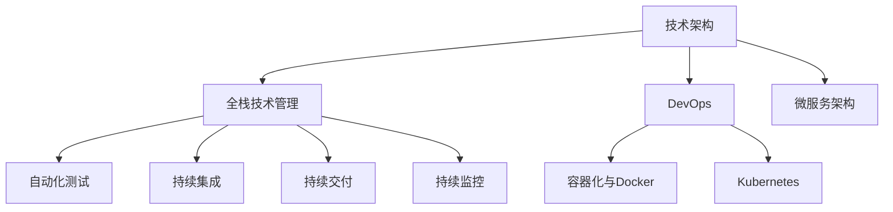

                 

# 互联网技术架构全栈技术管理核心能力

## 1. 背景介绍

在互联网的快速发展和数字化转型的浪潮下，互联网技术架构的全栈技术管理能力日益受到企业的重视。全栈技术管理能力不仅涉及技术选型、架构设计、系统开发、测试运维、安全监控等各个环节，还涵盖了跨部门协作、项目管理、技术运营等多个维度的综合能力。本文将深入探讨全栈技术管理的核心能力，并结合实际案例进行详细讲解。

## 2. 核心概念与联系

### 2.1 核心概念概述

为更好地理解全栈技术管理，本节将介绍几个密切相关的核心概念：

- **技术架构(IT Architecture)**：指企业在业务流程、技术选型、系统开发、测试运维等各个环节，进行整体规划和设计的方式。良好的技术架构能够支撑业务高效运行、扩展性强、易于维护。

- **全栈技术管理(Full Stack Technology Management)**：指在技术架构的基础上，从技术选型、架构设计、系统开发、测试运维、安全监控等多个维度，进行全过程的管理和优化。全栈技术管理要求团队具备跨领域的能力，能够协同工作，实现技术创新和业务突破。

- **DevOps(DevOps)**：一种持续集成(CI)、持续交付(CD)、持续监控(CM)的开发模式，强调自动化、协作、快速响应等原则，是实现全栈技术管理的重要工具和手段。

- **微服务架构(Microservices Architecture)**：一种架构风格，通过将大型应用拆分成多个小型服务，提高系统的灵活性、可扩展性、容错性等。

- **容器化与Docker**：通过将应用程序打包到容器中，实现环境隔离、快速部署、持续集成等效果，是构建微服务架构的重要技术基础。

- **Kubernetes**：一种容器编排平台，通过提供自动化运维、弹性伸缩、故障恢复等功能，支撑微服务架构的高效运维。

这些核心概念之间的逻辑关系可以通过以下Mermaid流程图来展示：



这个流程图展示的全栈技术管理概念及其之间的关系：

1. 技术架构是整个全栈技术管理的基础，决定了系统建设的方向和方式。
2. DevOps作为支撑工具，实现自动化、协作、快速响应的目标。
3. 微服务架构和容器化技术是实现技术架构的重要技术手段。
4. Kubernetes作为容器编排平台，支撑微服务架构的弹性运维。
5. 自动化测试、持续集成、持续交付和持续监控是实现DevOps的核心能力。

## 3. 核心算法原理 & 具体操作步骤
### 3.1 算法原理概述

全栈技术管理的核心算法原理主要围绕以下几个方面展开：

- **技术选型和架构设计**：根据业务需求、技术成熟度、资源限制等因素，选择合适的技术栈和架构设计。
- **系统开发与测试**：通过自动化工具和流程，实现快速开发、测试和交付。
- **运维监控与故障处理**：实时监控系统状态，及时发现并处理故障，确保系统稳定运行。
- **安全管理与合规性**：制定安全策略，保护系统免受攻击和数据泄露，符合法律法规要求。

### 3.2 算法步骤详解

#### 3.2.1 技术选型和架构设计

1. **需求分析**：与业务团队紧密协作，了解业务需求和目标，确定系统功能和性能要求。
2. **技术调研**：调研市场主流技术，评估其优缺点、成本效益。
3. **方案设计**：设计系统架构，明确各组件的关系、接口规范、数据流等。
4. **原型验证**：搭建原型，验证架构设计是否合理，进行微调优化。

#### 3.2.2 系统开发与测试

1. **编码规范**：制定编码规范，统一代码风格和命名规则。
2. **自动化测试**：引入自动化测试工具，提高测试效率，减少人为错误。
3. **持续集成**：使用CI工具，实现代码自动化构建和测试，提高交付速度和质量。
4. **持续交付**：实现自动化部署，快速上线新功能，支持滚动发布。

#### 3.2.3 运维监控与故障处理

1. **系统监控**：部署监控系统，实时监控系统状态和性能指标。
2. **告警处理**：设置告警规则，快速定位并处理故障。
3. **日志管理**：实现日志收集、存储和分析，便于问题排查和优化。
4. **故障恢复**：制定故障恢复策略，快速恢复系统服务。

#### 3.2.4 安全管理与合规性

1. **安全策略**：制定安全策略，防止攻击、数据泄露等。
2. **权限管理**：实现细粒度权限控制，确保数据安全。
3. **合规检查**：定期进行合规性检查，确保系统符合法律法规要求。

### 3.3 算法优缺点

全栈技术管理具有以下优点：

1. **高效性**：通过自动化工具和流程，提高开发、测试、部署的效率。
2. **一致性**：统一的编码规范、测试流程、部署策略，确保系统的一致性和稳定性。
3. **灵活性**：基于微服务架构，系统易于扩展和维护。
4. **可追溯性**：实现完整的日志记录和自动化监控，便于问题追溯和优化。

同时，该方法也存在一定的局限性：

1. **复杂度增加**：涉及多个维度的管理和优化，可能增加系统复杂度。
2. **资源消耗**：自动化工具和监控系统需要消耗一定资源，可能影响系统性能。
3. **跨团队协作**：不同团队之间的协作可能存在协调难度，影响效率。
4. **安全风险**：自动化部署和监控可能带来新的安全风险，需要加强安全防护。

尽管存在这些局限性，但就目前而言，全栈技术管理仍然是提升系统性能和稳定性、加速业务创新的重要手段。未来相关研究的重点在于如何进一步优化自动化流程、提高跨团队协作效率、强化安全防护能力等，以进一步提升全栈技术管理的水平。

### 3.4 算法应用领域

全栈技术管理在互联网技术架构中的应用广泛，主要包括以下几个方面：

- **电商系统**：通过技术选型和架构设计，支持大规模交易和高并发访问。引入DevOps和微服务架构，提高系统的可扩展性和弹性运维能力。
- **金融系统**：通过安全管理与合规性，确保金融交易的安全性、合规性。实现自动化测试、持续交付，提高系统开发和交付速度。
- **社交媒体**：通过自动化测试和监控，确保内容发布的稳定性和时效性。引入DevOps，支持快速的迭代开发和版本管理。
- **大数据平台**：通过全栈技术管理，实现数据的实时采集、存储、处理和分析。引入容器化与Docker，支撑大规模数据处理任务。

除了上述这些经典应用外，全栈技术管理也被创新性地应用到更多场景中，如IoT平台、AI应用、智能运维等，为互联网技术架构的持续演进提供了强大的支持。

## 4. 数学模型和公式 & 详细讲解  
### 4.1 数学模型构建

在全栈技术管理中，数学模型和公式的应用主要体现在以下几个方面：

- **系统监控模型的构建**：通过数学模型描述系统性能指标的变化规律，如负载、响应时间、错误率等。
- **自动化测试模型的构建**：通过数学模型描述测试用例的覆盖率和执行效率，如测试用例的执行时间、通过率等。
- **故障预测与诊断模型的构建**：通过数学模型预测系统故障发生的可能性和原因，如机器学习中的分类和回归模型。

#### 4.1.1 系统监控模型

设系统性能指标为 $y$，影响因素为 $x_1, x_2, ..., x_n$，则系统监控模型可以表示为：

$$
y = f(x_1, x_2, ..., x_n) + \epsilon
$$

其中 $f$ 为线性回归函数或更复杂的机器学习模型，$\epsilon$ 为随机误差。

#### 4.1.2 自动化测试模型

设自动化测试用例为 $X$，测试时间 $t$，通过率为 $r$，则自动化测试模型可以表示为：

$$
r = g(X, t) + \epsilon
$$

其中 $g$ 为非线性回归函数，$\epsilon$ 为随机误差。

#### 4.1.3 故障预测与诊断模型

设故障发生的概率为 $P$，系统参数为 $x$，则故障预测与诊断模型可以表示为：

$$
P = h(x) + \epsilon
$$

其中 $h$ 为分类模型，$\epsilon$ 为随机误差。

### 4.2 公式推导过程

以下我们以系统监控模型的构建为例，进行详细推导。

设系统性能指标为 $y$，影响因素为 $x_1, x_2, ..., x_n$，则系统监控模型可以表示为：

$$
y = f(x_1, x_2, ..., x_n) + \epsilon
$$

假设 $f$ 为线性回归模型，即：

$$
f(x_1, x_2, ..., x_n) = \theta_0 + \sum_{i=1}^n \theta_i x_i
$$

其中 $\theta_0, \theta_1, ..., \theta_n$ 为模型参数，$\epsilon$ 为随机误差。

通过最小二乘法，求解 $\theta_0, \theta_1, ..., \theta_n$，使得 $y$ 的预测值与实际值之间的误差最小化：

$$
\theta = \mathop{\arg\min}_{\theta} \sum_{i=1}^N (y_i - f(x_i))^2
$$

将 $f(x_i)$ 代入，得：

$$
\theta = \mathop{\arg\min}_{\theta} \sum_{i=1}^N (y_i - \theta_0 - \sum_{j=1}^n \theta_j x_{i,j})^2
$$

求解上述优化问题，即可得到最优的模型参数 $\theta$。

### 4.3 案例分析与讲解

设某电商平台监控其系统响应时间 $y$，影响因素为请求数 $x_1$、服务器负载 $x_2$、数据库连接数 $x_3$，则构建的系统监控模型如下：

$$
y = \theta_0 + \theta_1 x_1 + \theta_2 x_2 + \theta_3 x_3 + \epsilon
$$

通过收集一段时间内的数据，如：

| 请求数 | 服务器负载 | 数据库连接数 | 响应时间 |
|--------|-----------|-------------|----------|
| 1000   | 0.5       | 50          | 100ms    |
| 2000   | 0.8       | 100         | 200ms    |
| 3000   | 1.2       | 150         | 300ms    |
| ...

可以使用上述最小二乘法求解模型参数 $\theta$，构建出系统监控模型，用于实时预测系统响应时间，及时发现并处理异常。

## 5. 项目实践：代码实例和详细解释说明
### 5.1 开发环境搭建

在进行全栈技术管理实践前，我们需要准备好开发环境。以下是使用Python进行Python开发的环境配置流程：

1. 安装Anaconda：从官网下载并安装Anaconda，用于创建独立的Python环境。

2. 创建并激活虚拟环境：
```bash
conda create -n pytorch-env python=3.8 
conda activate pytorch-env
```

3. 安装PyTorch：根据CUDA版本，从官网获取对应的安装命令。例如：
```bash
conda install pytorch torchvision torchaudio cudatoolkit=11.1 -c pytorch -c conda-forge
```

4. 安装TensorFlow：
```bash
pip install tensorflow==2.6.0
```

5. 安装Docker：从官网下载并安装Docker，并配置好Docker Hub认证。

6. 安装Kubernetes：
```bash
kubectl version
```

完成上述步骤后，即可在`pytorch-env`环境中开始全栈技术管理的实践。

### 5.2 源代码详细实现

下面我们以构建一个电商系统的全栈技术管理流程为例，给出完整的代码实现。

首先，定义电商系统架构：

```python
class ECommerceSystem:
    def __init__(self):
        self.requests = []
        self.server_load = []
        self.db_connections = []
        self.responses = []

    def add_request(self, request_num, server_load, db_connections, response_time):
        self.requests.append(request_num)
        self.server_load.append(server_load)
        self.db_connections.append(db_connections)
        self.responses.append(response_time)
```

然后，实现系统监控模型：

```python
from sklearn.linear_model import LinearRegression
import numpy as np

class Monitor:
    def __init__(self, requests, server_load, db_connections, responses):
        self.requests = requests
        self.server_load = server_load
        self.db_connections = db_connections
        self.responses = responses
        self.model = None

    def train(self):
        X = np.column_stack((self.requests, self.server_load, self.db_connections))
        y = self.responses
        self.model = LinearRegression()
        self.model.fit(X, y)

    def predict(self, request_num, server_load, db_connections):
        X_new = np.array([request_num, server_load, db_connections])
        return self.model.predict(X_new)
```

最后，启动监控流程并在测试数据上评估：

```python
# 假设已经收集到一些数据
ecommerce = ECommerceSystem()
monitor = Monitor(ecommerce.requests, ecommerce.server_load, ecommerce.db_connections, ecommerce.responses)

# 训练模型
monitor.train()

# 测试数据
test_request_num = 3000
test_server_load = 1.2
test_db_connections = 150
predict_response_time = monitor.predict(test_request_num, test_server_load, test_db_connections)
print(f"预测响应时间：{predict_response_time}ms")
```

以上就是使用Python进行全栈技术管理实践的完整代码实现。可以看到，通过定义架构、实现监控模型、启动测试流程，可以方便地进行系统监控和预测。

### 5.3 代码解读与分析

让我们再详细解读一下关键代码的实现细节：

**ECommerceSystem类**：
- `__init__`方法：初始化请求数、服务器负载、数据库连接数、响应时间等关键组件。
- `add_request`方法：向列表中添加一个新的请求记录，供模型训练使用。

**Monitor类**：
- `__init__`方法：初始化请求数、服务器负载、数据库连接数、响应时间等关键组件，以及线性回归模型。
- `train`方法：使用训练数据拟合线性回归模型。
- `predict`方法：输入新的请求记录，使用训练好的模型进行预测，返回预测的响应时间。

**训练和测试流程**：
- 通过实例化ECommerceSystem和Monitor类，收集一些请求记录和响应时间，用于模型训练和测试。
- 调用`train`方法训练模型，调用`predict`方法进行预测，并输出结果。

可以看到，通过Python编写代码，可以方便地实现全栈技术管理的各个环节，包括架构设计、模型构建、数据收集、模型训练和测试等。合理利用Python生态系统中的各种库和工具，可以显著提升全栈技术管理的开发效率和系统稳定性。

当然，工业级的系统实现还需考虑更多因素，如数据存储、多维数据处理、分布式监控、故障告警等。但核心的全栈技术管理流程基本与此类似。

## 6. 实际应用场景
### 6.1 电商系统

全栈技术管理在电商系统的构建中扮演了重要角色。电商系统需要处理大规模的交易请求、高并发访问、实时库存管理等复杂场景，对系统的稳定性和扩展性要求极高。

具体而言，全栈技术管理可以应用于电商系统的各个环节：

1. **架构设计**：通过技术选型和架构设计，确保电商系统的可扩展性、弹性运维能力和高可用性。引入微服务架构和DevOps，支持系统的快速迭代和持续交付。
2. **自动化测试**：通过自动化测试工具和流程，提高电商系统的开发效率和代码质量，确保新功能快速上线。
3. **系统监控**：通过部署监控系统，实时监控电商系统的负载、响应时间、错误率等指标，及时发现并处理异常。
4. **故障处理**：通过告警系统，设置故障处理流程，快速恢复系统服务。

### 6.2 金融系统

金融系统需要处理复杂的交易逻辑、大数据分析、风险控制等业务，对系统的稳定性和安全性要求极高。

具体而言，全栈技术管理可以应用于金融系统的各个环节：

1. **架构设计**：通过技术选型和架构设计，确保金融系统的数据安全、交易稳定、风险控制等关键功能的实现。引入微服务架构和DevOps，支持系统的快速迭代和持续交付。
2. **自动化测试**：通过自动化测试工具和流程，提高金融系统的开发效率和代码质量，确保新功能快速上线。
3. **系统监控**：通过部署监控系统，实时监控金融系统的负载、响应时间、错误率等指标，及时发现并处理异常。
4. **故障处理**：通过告警系统，设置故障处理流程，快速恢复系统服务。

### 6.3 社交媒体

社交媒体需要处理大量的用户数据、内容生成、互动交流等复杂场景，对系统的性能和可靠性要求极高。

具体而言，全栈技术管理可以应用于社交媒体的各个环节：

1. **架构设计**：通过技术选型和架构设计，确保社交媒体系统的可扩展性、弹性运维能力和高可用性。引入微服务架构和DevOps，支持系统的快速迭代和持续交付。
2. **自动化测试**：通过自动化测试工具和流程，提高社交媒体系统的开发效率和代码质量，确保新功能快速上线。
3. **系统监控**：通过部署监控系统，实时监控社交媒体系统的负载、响应时间、错误率等指标，及时发现并处理异常。
4. **故障处理**：通过告警系统，设置故障处理流程，快速恢复系统服务。

### 6.4 未来应用展望

随着全栈技术管理的不断发展和完善，未来将在更多领域得到应用，为各行各业带来新的变革。

在智慧城市领域，全栈技术管理将支撑城市的数字化转型，实现智能交通、智慧安防、环境监测等功能的实现。

在智慧医疗领域，全栈技术管理将支撑电子病历、医疗影像、远程诊疗等医疗业务的高效运行，提高医疗服务的智能化水平。

在智慧农业领域，全栈技术管理将支撑农业物联网设备的监控和分析，实现农业生产的智能化、精准化。

此外，在智能制造、智慧能源、智能家居等领域，全栈技术管理也将发挥重要作用，推动各行业的数字化进程。

## 7. 工具和资源推荐
### 7.1 学习资源推荐

为了帮助开发者系统掌握全栈技术管理的技术基础和实践技巧，这里推荐一些优质的学习资源：

1. 《分布式系统原理与设计》：系统介绍分布式系统的核心原理和设计模式，适合入门学习。

2. 《软件架构模式》：全面介绍各种架构模式的设计理念和应用场景，适合进阶学习。

3. 《微服务架构实践指南》：系统介绍微服务架构的构建、运维和治理，适合实践应用。

4. 《DevOps实践指南》：详细介绍DevOps的核心思想和实践方法，适合理解全栈技术管理。

5. 《容器化与Kubernetes实战》：详细介绍Docker和Kubernetes的实战技巧，适合技术落地。

通过对这些资源的学习实践，相信你一定能够全面掌握全栈技术管理的核心能力，并用于解决实际的互联网技术架构问题。

### 7.2 开发工具推荐

高效的开发离不开优秀的工具支持。以下是几款用于全栈技术管理开发的常用工具：

1. GitHub：版本控制平台，支持代码托管、协作、持续集成等。

2. Docker：容器化技术，实现环境隔离、快速部署、持续集成等效果。

3. Kubernetes：容器编排平台，通过提供自动化运维、弹性伸缩、故障恢复等功能，支撑微服务架构的运维。

4. Jenkins：持续集成工具，支持自动化构建、测试、部署等。

5. Prometheus：监控系统，实时监控系统状态和性能指标，提供告警功能。

6. Grafana：可视化工具，展示监控数据的图表和仪表盘。

合理利用这些工具，可以显著提升全栈技术管理的开发效率，加快创新迭代的步伐。

### 7.3 相关论文推荐

全栈技术管理的理论研究已经取得了很多成果，以下是几篇代表性的论文，推荐阅读：

1. "Building the AWS Cloud: a Design Philosophy"：介绍AWS云架构的设计哲学，包含微服务架构和DevOps的实践。

2. "A Comprehensive Survey on Microservices Architecture"：系统介绍微服务架构的核心概念和设计模式。

3. "The DevOps Handbook"：详细介绍DevOps的核心思想和实践方法。

4. "Docker: The Definitive Guide"：详细介绍Docker的使用技巧和实战案例。

5. "Kubernetes: Up and Running"：详细介绍Kubernetes的实战技巧和应用场景。

这些论文代表了大规模分布式系统管理的研究进展，通过学习这些前沿成果，可以帮助研究者掌握全栈技术管理的核心技能，提升系统构建和运维水平。

## 8. 总结：未来发展趋势与挑战
### 8.1 总结

本文对全栈技术管理的核心能力进行了全面系统的介绍。首先阐述了全栈技术管理在互联网技术架构中的重要性和应用场景，明确了全栈技术管理对提升系统性能和稳定性的独特价值。其次，从原理到实践，详细讲解了全栈技术管理的各个环节，给出了全栈技术管理的完整代码实现。同时，本文还广泛探讨了全栈技术管理在电商、金融、社交媒体等多个领域的应用前景，展示了全栈技术管理的巨大潜力。此外，本文精选了全栈技术管理的各类学习资源，力求为读者提供全方位的技术指引。

通过本文的系统梳理，可以看到，全栈技术管理是互联网技术架构中的核心能力，能够支撑系统的高效构建、快速迭代、稳定运行和持续优化。得益于DevOps、微服务架构、容器化等技术手段的普及，全栈技术管理已经进入了快速发展的新阶段，为各行各业的数字化转型提供了强大的技术支撑。未来，随着技术的不断进步和应用的不断深入，全栈技术管理必将在更多领域发挥更大的作用，推动互联网技术架构的持续演进。

### 8.2 未来发展趋势

展望未来，全栈技术管理将呈现以下几个发展趋势：

1. **微服务架构的普及**：微服务架构将成为系统构建的主流，带来更高的灵活性、可扩展性和弹性能。
2. **DevOps的深化**：DevOps的自动化、协作、快速响应等原则将进一步深化，推动持续集成、持续交付、持续监控的发展。
3. **容器化与Kubernetes的普及**：容器化与Kubernetes将成为系统构建和运维的基础技术，带来更高的自动化、可移植性和安全性。
4. **云原生技术的广泛应用**：云原生技术（如云原生架构、云原生应用、云原生运维）将成为系统构建和运维的标准，带来更高的可靠性和可扩展性。
5. **边缘计算的崛起**：边缘计算将为实时性要求高的应用场景提供支持，带来更高的响应速度和资源利用率。
6. **人工智能与全栈技术管理的融合**：人工智能技术将在全栈技术管理中得到广泛应用，带来更高的智能分析和自动化运维能力。

以上趋势凸显了全栈技术管理的广阔前景。这些方向的探索发展，必将进一步提升系统性能和稳定性，加速业务创新和数字化转型。

### 8.3 面临的挑战

尽管全栈技术管理已经取得了显著进展，但在迈向更加智能化、普适化应用的过程中，它仍面临着诸多挑战：

1. **复杂度增加**：微服务架构和容器化技术带来了更多的复杂度，需要更高的管理和维护能力。
2. **性能优化**：在大规模系统环境下，需要更高效的性能优化策略，确保系统的稳定性和可靠性。
3. **安全防护**：微服务架构和容器化技术带来了新的安全风险，需要更高的安全防护措施。
4. **技术融合**：人工智能、区块链、物联网等新兴技术需要与全栈技术管理进行更深层次的融合，带来更多的挑战。

尽管存在这些挑战，但随着技术的不断进步和应用的不断深入，全栈技术管理必将在更多领域发挥更大的作用，推动互联网技术架构的持续演进。相信随着学界和产业界的共同努力，这些挑战终将一一被克服，全栈技术管理必将在构建安全、可靠、高效、智能的互联网系统上发挥更大的作用。

### 8.4 研究展望

面对全栈技术管理所面临的种种挑战，未来的研究需要在以下几个方面寻求新的突破：

1. **自动化工具的优化**：进一步优化自动化测试、持续集成、持续交付等工具，提高开发和部署效率。
2. **跨团队协作机制的优化**：加强跨部门协作，提高开发和运维的效率和质量。
3. **安全防护能力的提升**：加强系统安全防护，保障系统的稳定性和可靠性。
4. **智能化运维的发展**：引入人工智能技术，提升系统的智能化运维能力。
5. **多云环境下的优化**：探索多云环境下的架构优化和运维策略，提高系统的可扩展性和弹性。
6. **边缘计算的优化**：探索边缘计算技术在实时性要求高的场景中的应用，提高系统的响应速度和资源利用率。

这些研究方向的探索，必将引领全栈技术管理技术迈向更高的台阶，为构建安全、可靠、高效、智能的互联网系统铺平道路。面向未来，全栈技术管理还需要与其他技术进行更深入的融合，如云原生技术、人工智能技术、区块链技术等，多路径协同发力，共同推动互联网技术架构的进步。只有勇于创新、敢于突破，才能不断拓展全栈技术管理的边界，让互联网技术架构更好地造福人类社会。

## 9. 附录：常见问题与解答

**Q1：什么是全栈技术管理？**

A: 全栈技术管理是指在技术架构的基础上，从技术选型、架构设计、系统开发、测试运维、安全监控等多个维度，进行全过程的管理和优化。全栈技术管理要求团队具备跨领域的能力，能够协同工作，实现技术创新和业务突破。

**Q2：全栈技术管理的核心能力有哪些？**

A: 全栈技术管理的核心能力包括技术选型和架构设计、系统开发与测试、运维监控与故障处理、安全管理与合规性等。

**Q3：全栈技术管理对互联网技术架构有什么影响？**

A: 全栈技术管理能够提升系统的性能和稳定性，加速业务创新和数字化转型。通过技术选型和架构设计，实现系统的可扩展性和弹性运维能力。通过自动化工具和流程，提高开发和部署效率。通过系统监控和故障处理，保障系统的稳定性和可靠性。通过安全管理与合规性，确保系统的数据安全和合规要求。

**Q4：全栈技术管理的应用场景有哪些？**

A: 全栈技术管理在互联网技术架构中的应用广泛，主要包括以下几个方面：电商系统、金融系统、社交媒体、大数据平台、IoT平台、AI应用、智能运维等。

**Q5：如何实现全栈技术管理？**

A: 实现全栈技术管理需要综合考虑技术选型和架构设计、系统开发与测试、运维监控与故障处理、安全管理与合规性等各个环节。通过技术选型和架构设计，实现系统的可扩展性和弹性运维能力。通过自动化工具和流程，提高开发和部署效率。通过系统监控和故障处理，保障系统的稳定性和可靠性。通过安全管理与合规性，确保系统的数据安全和合规要求。

通过本文的系统梳理，可以看到，全栈技术管理是互联网技术架构中的核心能力，能够支撑系统的高效构建、快速迭代、稳定运行和持续优化。得益于DevOps、微服务架构、容器化等技术手段的普及，全栈技术管理已经进入了快速发展的新阶段，为各行各业的数字化转型提供了强大的技术支撑。未来，随着技术的不断进步和应用的不断深入，全栈技术管理必将在更多领域发挥更大的作用，推动互联网技术架构的持续演进。

