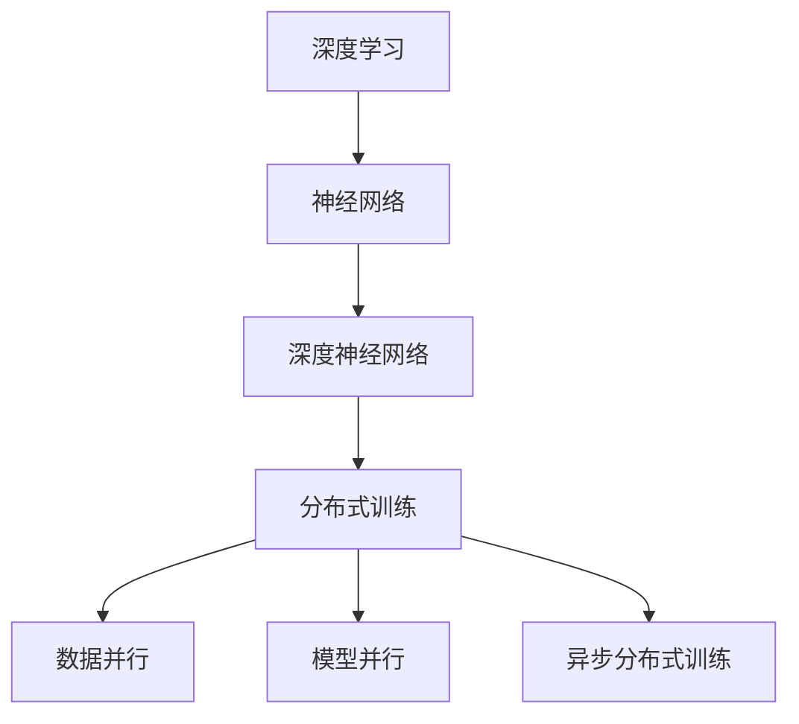

                 

# 人工智能 原理与代码实例讲解

> 关键词：人工智能, 深度学习, 机器学习, 深度学习框架, 数据集, 模型训练, 代码实例

## 1. 背景介绍

### 1.1 问题由来
人工智能（Artificial Intelligence, AI）是计算机科学和信息技术的核心领域之一，旨在赋予计算机系统类似于人类的智能，包括学习、推理、感知、自然语言处理等能力。深度学习作为AI领域的重要技术，通过构建多层神经网络模型，模仿人脑的计算方式，实现复杂的非线性特征提取与处理，已经在图像识别、语音识别、自然语言处理等领域取得了突破性进展。

近年来，随着数据量的爆炸式增长和计算能力的不断提升，深度学习模型（特别是深度神经网络）的规模和复杂度大幅增加，从几十层的简单模型发展到上亿参数的超大规模模型。这些模型的训练和推理对计算资源的需求也急剧上升，传统的单机训练和推理方式已经难以满足需求，分布式训练和推理成为了必然趋势。

本博客旨在介绍深度学习和分布式训练的基本原理，通过详细讲解和代码实例，帮助读者全面理解AI的核心技术和实现方法。

## 2. 核心概念与联系

### 2.1 核心概念概述

为更好地理解深度学习和分布式训练，本节将介绍几个密切相关的核心概念：

- 深度学习（Deep Learning, DL）：基于神经网络的机器学习技术，通过构建多层次的非线性模型，实现对复杂数据的高效处理和特征提取。

- 神经网络（Neural Network, NN）：模仿人脑神经元的工作机制，通过多层节点组成的网络结构进行数据处理。

- 深度神经网络（Deep Neural Network, DNN）：包含多个隐藏层的网络结构，能够处理更加复杂的任务。

- 分布式训练（Distributed Training）：将大模型的训练任务分散到多台计算机上并行执行，以提高训练效率和资源利用率。

- 异步分布式训练（Asynchronous Distributed Training）：各计算节点独立执行训练任务，通过定期同步模型参数进行通信和协作。

- 数据并行（Data Parallelism）：将同一批次的训练数据分割成多个子批次，在多个计算节点上并行处理，最终将结果合并。

- 模型并行（Model Parallelism）：将模型分割成多个子模型，分别在多个计算节点上进行并行训练。

这些概念之间的逻辑关系可以通过以下Mermaid流程图来展示：



这个流程图展示了几类核心概念及其之间的关系：

1. 深度学习基于神经网络进行建模。
2. 深度神经网络包含多个隐藏层，模型结构更加复杂。
3. 分布式训练通过并行化提高训练效率。
4. 数据并行和模型并行是分布式训练的两种常见方式。
5. 异步分布式训练实现各计算节点的独立执行与定期通信。

这些核心概念共同构成了深度学习和分布式训练的基础框架，帮助AI系统高效处理大规模数据，实现复杂任务的高精度和鲁棒性。

## 3. 核心算法原理 & 具体操作步骤
### 3.1 算法原理概述

深度学习的核心在于通过多层神经网络对数据进行非线性映射和特征提取，实现对复杂任务的处理。分布式训练则通过并行化多个计算节点，实现高效的模型训练。

深度学习模型的训练过程通常包括以下步骤：

1. 数据预处理：对原始数据进行清洗、归一化、扩充等处理，确保数据的质量和适用性。

2. 模型初始化：随机初始化模型参数，以避免陷入局部最优。

3. 前向传播：将输入数据送入模型，通过多层网络进行特征提取和计算。

4. 计算损失：通过对比模型输出与真实标签，计算损失函数。

5. 反向传播：根据损失函数的梯度，反向传播计算每个参数的梯度，更新模型参数。

6. 模型优化：通过优化算法（如梯度下降、Adam等）调整模型参数，使得损失函数最小化。

### 3.2 算法步骤详解

深度学习和分布式训练的具体操作步骤可以分为以下几个关键步骤：

**Step 1: 准备数据集和环境**

- 收集和清洗大量标注数据集，用于模型训练和验证。
- 搭建深度学习框架（如TensorFlow、PyTorch等）和分布式计算环境（如Spark、Hadoop等）。

**Step 2: 定义模型架构**

- 设计深度神经网络的结构，包括输入层、隐藏层和输出层。
- 确定各层的神经元个数、激活函数、优化器、损失函数等超参数。

**Step 3: 实现前向传播**

- 定义数据迭代器，对输入数据进行批处理和预处理。
- 实现前向传播函数，将数据输入模型，计算中间特征。

**Step 4: 实现反向传播**

- 计算损失函数，使用反向传播算法计算各参数的梯度。
- 实现优化器函数，根据梯度更新模型参数。

**Step 5: 训练和验证**

- 循环执行前向传播和反向传播，直到模型收敛。
- 定期在验证集上评估模型性能，避免过拟合。

**Step 6: 测试和部署**

- 在测试集上评估模型的泛化能力。
- 将训练好的模型部署到实际应用中，进行实时推理。

### 3.3 算法优缺点

深度学习和分布式训练方法具有以下优点：

- 模型性能优越：深度神经网络能够处理复杂的非线性关系，通过多层特征提取提升模型表现。
- 可扩展性强：分布式训练可以将大规模数据和计算任务并行化，显著提高训练效率。
- 鲁棒性好：多节点协同训练能够有效避免单点故障，提升系统的稳定性和可靠性。

但这些方法也存在一定的局限性：

- 数据需求量大：深度学习需要大量标注数据进行训练，数据获取和预处理成本较高。
- 计算资源消耗大：深度学习模型参数量大，训练和推理计算资源需求高。
- 可解释性差：深度学习模型通常是“黑盒”模型，难以解释内部决策过程。
- 过拟合风险高：深度学习模型容易过拟合训练数据，泛化能力较弱。

尽管存在这些局限性，深度学习和分布式训练依然是当前AI领域的主流技术，通过不断优化算法和改进架构，可以有效应对这些挑战，提升模型的性能和可靠性。

### 3.4 算法应用领域

深度学习和分布式训练已经在诸多领域得到广泛应用，以下是几个典型应用案例：

- 计算机视觉：通过卷积神经网络（CNN）实现图像分类、目标检测、语义分割等任务。
- 自然语言处理：通过循环神经网络（RNN）、Transformer等模型实现文本分类、情感分析、机器翻译等任务。
- 语音识别：通过深度神经网络实现语音识别、语音合成、语音增强等任务。
- 机器人控制：通过深度强化学习（DRL）实现机器人路径规划、动作生成等任务。
- 医疗诊断：通过深度学习模型实现医学影像分析、疾病预测等任务。

此外，深度学习和分布式训练还在自动驾驶、金融风控、工业控制等领域得到了广泛应用，成为推动AI技术落地应用的重要技术手段。

## 4. 数学模型和公式 & 详细讲解 & 举例说明

### 4.1 数学模型构建

深度学习和分布式训练的核心数学模型包括神经网络、优化算法、损失函数等。这里以一个简单的二分类任务为例，构建深度学习模型的数学模型。

**神经网络模型**

深度神经网络通常由输入层、隐藏层和输出层组成。对于二分类任务，可以定义如下模型：

$$
\mathbf{h}^{[l]} = \phi(\mathbf{W}^{[l]}\mathbf{h}^{[l-1]} + \mathbf{b}^{[l]})
$$

$$
\mathbf{\hat{y}} = \sigma(\mathbf{W}^{[L]}\mathbf{h}^{[L-1]} + \mathbf{b}^{[L]})
$$

其中，$\mathbf{h}^{[l]}$ 表示第 $l$ 层的隐藏状态，$\phi$ 为激活函数，$\mathbf{W}^{[l]}$ 和 $\mathbf{b}^{[l]}$ 为第 $l$ 层的权重和偏置，$\mathbf{\hat{y}}$ 为模型的输出。

**优化算法**

常用的优化算法包括梯度下降（GD）、随机梯度下降（SGD）、Adam等。这里以Adam算法为例，推导其具体形式。

Adam算法更新规则为：

$$
\mathbf{m}_t = \beta_1\mathbf{m}_{t-1} + (1-\beta_1)\mathbf{g}_t
$$

$$
\mathbf{v}_t = \beta_2\mathbf{v}_{t-1} + (1-\beta_2)\mathbf{g}_t^2
$$

$$
\mathbf{\theta}_t = \mathbf{\theta}_{t-1} - \frac{\eta}{\sqrt{\mathbf{v}_t}+\epsilon} \mathbf{m}_t
$$

其中，$\eta$ 为学习率，$\beta_1$ 和 $\beta_2$ 为动量衰减率，$\mathbf{g}_t$ 为梯度，$\mathbf{m}_t$ 和 $\mathbf{v}_t$ 为动量和二阶动量估计，$\epsilon$ 为正则项，防止分母为0。

**损失函数**

常用的损失函数包括交叉熵损失（CE）、均方误差损失（MSE）等。这里以交叉熵损失为例，推导其具体形式。

对于二分类任务，交叉熵损失函数为：

$$
\mathcal{L} = -\frac{1}{N}\sum_{i=1}^N (\mathbf{y}^{[i]}\log(\mathbf{\hat{y}}^{[i]}) + (1-\mathbf{y}^{[i]})\log(1-\mathbf{\hat{y}}^{[i]})
$$

其中，$\mathbf{y}^{[i]}$ 为真实标签，$\mathbf{\hat{y}}^{[i]}$ 为模型预测概率。

### 4.2 公式推导过程

以下是深度学习模型中常用的几个数学公式的推导过程：

**矩阵乘法**

设 $\mathbf{A}$ 和 $\mathbf{B}$ 分别为 $m\times n$ 和 $n\times p$ 的矩阵，矩阵乘法定义为：

$$
\mathbf{C} = \mathbf{AB} = \begin{bmatrix}
\mathbf{A} \\
\end{bmatrix}
\begin{bmatrix}
\mathbf{B} \\
\end{bmatrix}
$$

其中 $\mathbf{C}$ 为 $m\times p$ 的矩阵，元素为 $\mathbf{C}_{ij} = \sum_{k=1}^n \mathbf{A}_{ik}\mathbf{B}_{kj}$。

**链式法则**

链式法则用于计算复杂函数对某变量的导数。设 $f(x)$ 为复合函数，$g(x)$ 和 $h(x)$ 为其中两个子函数，则有：

$$
\frac{\partial f}{\partial x} = \frac{\partial f}{\partial g} \frac{\partial g}{\partial x} + \frac{\partial f}{\partial h} \frac{\partial h}{\partial x}
$$

**梯度下降**

梯度下降算法用于更新模型参数。设损失函数为 $L(\mathbf{\theta})$，初始参数为 $\mathbf{\theta}_0$，则更新规则为：

$$
\mathbf{\theta}_{t+1} = \mathbf{\theta}_t - \eta \nabla_{\mathbf{\theta}}L(\mathbf{\theta}_t)
$$

其中，$\eta$ 为学习率，$\nabla_{\mathbf{\theta}}L(\mathbf{\theta}_t)$ 为损失函数对模型参数的梯度。

### 4.3 案例分析与讲解

以卷积神经网络（CNN）为例，讲解其在图像分类任务中的应用。

CNN是一种常用于图像处理的深度神经网络，其核心思想是通过卷积层和池化层提取图像的局部特征，然后通过全连接层进行分类。

**CNN模型**

一个简单的CNN模型由卷积层、池化层和全连接层组成。设 $n$ 为图像高度和宽度，$C$ 为通道数，$h$ 为卷积核大小，$k$ 为卷积核个数，则卷积层的计算公式为：

$$
\mathbf{A} = \begin{bmatrix}
\mathbf{A}_1 \\
\mathbf{A}_2 \\
\vdots \\
\mathbf{A}_n \\
\end{bmatrix}
$$

$$
\mathbf{B} = \begin{bmatrix}
\mathbf{B}_1 \\
\mathbf{B}_2 \\
\vdots \\
\mathbf{B}_k \\
\end{bmatrix}
$$

$$
\mathbf{C} = \begin{bmatrix}
\mathbf{A}_1 \star \mathbf{B}_1 \\
\mathbf{A}_2 \star \mathbf{B}_1 \\
\vdots \\
\mathbf{A}_n \star \mathbf{B}_1 \\
\end{bmatrix}
$$

其中，$\star$ 表示卷积操作。

**CNN训练**

CNN的训练过程包括前向传播、反向传播和优化。以二分类任务为例，假设输入图像为 $\mathbf{X}$，标签为 $\mathbf{y}$，模型参数为 $\mathbf{\theta}$，则训练过程如下：

1. 前向传播：

$$
\mathbf{Z}_1 = \begin{bmatrix}
\mathbf{X} \star \mathbf{B}_1 \\
\mathbf{X} \star \mathbf{B}_2 \\
\vdots \\
\mathbf{X} \star \mathbf{B}_k \\
\end{bmatrix}
$$

$$
\mathbf{P}_1 = \max(\mathbf{Z}_1) - \min(\mathbf{Z}_1)
$$

$$
\mathbf{P}_2 = \begin{bmatrix}
\mathbf{P}_1 \\
\mathbf{Z}_1 - \mathbf{P}_1 \\
\end{bmatrix}
$$

$$
\mathbf{Z}_2 = \begin{bmatrix}
\mathbf{P}_1 \star \mathbf{B}_1 \\
\mathbf{P}_2 \star \mathbf{B}_1 \\
\vdots \\
\mathbf{P}_k \star \mathbf{B}_1 \\
\end{bmatrix}
$$

$$
\mathbf{Z}_3 = \begin{bmatrix}
\mathbf{Z}_2 \star \mathbf{B}_3 \\
\mathbf{Z}_2 \star \mathbf{B}_4 \\
\vdots \\
\mathbf{Z}_2 \star \mathbf{B}_l \\
\end{bmatrix}
$$

$$
\mathbf{\hat{y}} = \sigma(\mathbf{Z}_3 \mathbf{W} + \mathbf{b})
$$

2. 反向传播：

$$
\frac{\partial \mathcal{L}}{\partial \mathbf{W}} = \mathbf{Z}_3^T\frac{\partial \mathbf{\hat{y}}}{\partial \mathbf{Z}_3} \frac{\partial \mathbf{\hat{y}}}{\partial \mathbf{Z}_2} \frac{\partial \mathbf{Z}_2}{\partial \mathbf{P}_2} \frac{\partial \mathbf{P}_2}{\partial \mathbf{P}_1} \frac{\partial \mathbf{P}_1}{\partial \mathbf{Z}_1} \frac{\partial \mathbf{Z}_1}{\partial \mathbf{B}_1} + \frac{\partial \mathbf{\hat{y}}}{\partial \mathbf{Z}_3} \frac{\partial \mathbf{\hat{y}}}{\partial \mathbf{b}}
$$

$$
\frac{\partial \mathcal{L}}{\partial \mathbf{b}} = \frac{\partial \mathcal{L}}{\partial \mathbf{\hat{y}}} \frac{\partial \mathbf{\hat{y}}}{\partial \mathbf{b}}
$$

$$
\frac{\partial \mathcal{L}}{\partial \mathbf{Z}_1} = \frac{\partial \mathcal{L}}{\partial \mathbf{P}_1} \frac{\partial \mathbf{P}_1}{\partial \mathbf{Z}_1} + \frac{\partial \mathcal{L}}{\partial \mathbf{P}_2} \frac{\partial \mathbf{P}_2}{\partial \mathbf{Z}_1}
$$

3. 优化：

$$
\mathbf{\theta}_{t+1} = \mathbf{\theta}_t - \eta \frac{\partial \mathcal{L}}{\partial \mathbf{\theta}}
$$

通过上述推导，可以看到深度学习模型的训练过程非常复杂，涉及多个数学运算和参数更新。但通过科学的方法和工具，这些复杂过程可以高效实现。

## 5. 项目实践：代码实例和详细解释说明

### 5.1 开发环境搭建

在进行深度学习项目实践前，我们需要准备好开发环境。以下是使用Python进行TensorFlow和PyTorch开发的环境配置流程：

1. 安装Anaconda：从官网下载并安装Anaconda，用于创建独立的Python环境。

2. 创建并激活虚拟环境：
```bash
conda create -n tf-env python=3.8 
conda activate tf-env
```

3. 安装TensorFlow：根据CUDA版本，从官网获取对应的安装命令。例如：
```bash
conda install tensorflow -c tf
```

4. 安装PyTorch：
```bash
pip install torch torchvision torchaudio
```

5. 安装各类工具包：
```bash
pip install numpy pandas scikit-learn matplotlib tqdm jupyter notebook ipython
```

完成上述步骤后，即可在`tf-env`环境中开始深度学习项目实践。

### 5.2 源代码详细实现

这里以MNIST手写数字识别任务为例，展示使用TensorFlow进行深度学习模型开发的详细代码实现。

首先，定义模型和数据处理函数：

```python
import tensorflow as tf
from tensorflow.keras.datasets import mnist
from tensorflow.keras.models import Sequential
from tensorflow.keras.layers import Conv2D, MaxPooling2D, Flatten, Dense

# 加载MNIST数据集
(x_train, y_train), (x_test, y_test) = mnist.load_data()

# 数据预处理
x_train = x_train.reshape((-1, 28, 28, 1)).astype('float32') / 255.0
x_test = x_test.reshape((-1, 28, 28, 1)).astype('float32') / 255.0
y_train = tf.keras.utils.to_categorical(y_train, 10)
y_test = tf.keras.utils.to_categorical(y_test, 10)

# 定义模型架构
model = Sequential()
model.add(Conv2D(32, kernel_size=(3, 3), activation='relu', input_shape=(28, 28, 1)))
model.add(MaxPooling2D(pool_size=(2, 2)))
model.add(Flatten())
model.add(Dense(128, activation='relu'))
model.add(Dense(10, activation='softmax'))

# 编译模型
model.compile(optimizer='adam', loss='categorical_crossentropy', metrics=['accuracy'])

# 训练模型
model.fit(x_train, y_train, epochs=5, batch_size=64, validation_data=(x_test, y_test))
```

然后，进行模型训练和评估：

```python
# 训练模型
model.fit(x_train, y_train, epochs=5, batch_size=64, validation_data=(x_test, y_test))

# 评估模型
test_loss, test_acc = model.evaluate(x_test, y_test)
print('Test accuracy:', test_acc)
```

最后，使用训练好的模型进行预测：

```python
# 预测新样本
new_samples = [np.array([[[0.2, 0.3, 0.4, 0.5]]]), np.array([[[0.6, 0.7, 0.8, 0.9]]])]
predictions = model.predict(new_samples)
print(predictions)
```

以上就是使用TensorFlow进行MNIST手写数字识别任务微调的完整代码实现。可以看到，TensorFlow提供了便捷的Keras API，使得深度学习模型的构建和训练变得非常简单。

### 5.3 代码解读与分析

让我们再详细解读一下关键代码的实现细节：

**数据加载和预处理**

- `mnist.load_data()`：从TensorFlow自带的数据集中加载MNIST数据集。
- `x_train = x_train.reshape((-1, 28, 28, 1)).astype('float32') / 255.0`：将输入数据从二维数组转换为四维张量，并进行归一化处理，使每个像素的取值范围在0到1之间。
- `y_train = tf.keras.utils.to_categorical(y_train, 10)`：将标签进行one-hot编码，使得每个标签只有一个元素为1，其余为0。

**模型定义**

- `Sequential()`：定义一个顺序排列的模型。
- `Conv2D(32, kernel_size=(3, 3), activation='relu', input_shape=(28, 28, 1))`：添加2D卷积层，32个卷积核，3x3的卷积核大小，ReLU激活函数。
- `MaxPooling2D(pool_size=(2, 2))`：添加池化层，2x2的池化窗口大小。
- `Flatten()`：将池化层的输出展开成一维向量。
- `Dense(128, activation='relu')`：添加全连接层，128个神经元，ReLU激活函数。
- `Dense(10, activation='softmax')`：添加输出层，10个神经元，softmax激活函数，用于多分类。

**模型编译**

- `model.compile(optimizer='adam', loss='categorical_crossentropy', metrics=['accuracy'])`：定义模型编译配置，使用Adam优化器，交叉熵损失函数，准确率作为评估指标。

**模型训练**

- `model.fit(x_train, y_train, epochs=5, batch_size=64, validation_data=(x_test, y_test))`：进行模型训练，5个epoch，每个epoch使用64个样本进行训练，并使用验证集进行性能评估。

**模型评估**

- `model.evaluate(x_test, y_test)`：在测试集上评估模型性能，输出损失和准确率。

**模型预测**

- `predictions = model.predict(new_samples)`：使用训练好的模型对新样本进行预测，返回预测结果。

可以看到，通过TensorFlow提供的高级API，深度学习模型的构建和训练变得非常简单。开发者只需关注模型的架构和超参数，无需过多关注底层计算细节。

当然，工业级的系统实现还需考虑更多因素，如模型的保存和部署、超参数的自动搜索、更灵活的任务适配层等。但核心的深度学习模型训练过程基本与此类似。

## 6. 实际应用场景

深度学习和分布式训练已经在诸多领域得到广泛应用，以下是几个典型应用案例：

- 计算机视觉：通过卷积神经网络（CNN）实现图像分类、目标检测、语义分割等任务。
- 自然语言处理：通过循环神经网络（RNN）、Transformer等模型实现文本分类、情感分析、机器翻译等任务。
- 语音识别：通过深度神经网络实现语音识别、语音合成、语音增强等任务。
- 机器人控制：通过深度强化学习（DRL）实现机器人路径规划、动作生成等任务。
- 医疗诊断：通过深度学习模型实现医学影像分析、疾病预测等任务。

此外，深度学习和分布式训练还在自动驾驶、金融风控、工业控制等领域得到了广泛应用，成为推动AI技术落地应用的重要技术手段。

## 7. 工具和资源推荐
### 7.1 学习资源推荐

为了帮助开发者系统掌握深度学习和分布式训练的理论基础和实践技巧，这里推荐一些优质的学习资源：

1. 《Deep Learning》书籍：由Ian Goodfellow等人所著，全面介绍了深度学习的理论基础和实践方法，是深度学习领域的经典教材。

2. CS231n《Convolutional Neural Networks for Visual Recognition》课程：斯坦福大学开设的计算机视觉经典课程，涵盖CNN的原理、实现和应用。

3. CS224N《Natural Language Processing with Deep Learning》课程：斯坦福大学开设的NLP明星课程，涵盖RNN、Transformer等模型的原理和应用。

4. TensorFlow官方文档：TensorFlow的官方文档，提供了全面的API文档和代码示例，是学习TensorFlow的必备资料。

5. PyTorch官方文档：PyTorch的官方文档，提供了丰富的深度学习模型和工具包，是学习PyTorch的重要参考。

通过对这些资源的学习实践，相信你一定能够快速掌握深度学习和分布式训练的精髓，并用于解决实际的AI问题。

### 7.2 开发工具推荐

高效的开发离不开优秀的工具支持。以下是几款用于深度学习和分布式训练开发的常用工具：

1. TensorFlow：由Google主导开发的深度学习框架，生产部署方便，适合大规模工程应用。

2. PyTorch：基于Python的开源深度学习框架，灵活性高，适合研究性和实验性任务。

3. Keras：TensorFlow和PyTorch的高层API，提供了便捷的模型定义和训练接口，适合快速原型开发。

4. JAX：Google开发的自动微分和分布式深度学习库，支持高效的前向传播和梯度计算，适合高性能计算环境。

5. PySyft：Google开发的隐私保护深度学习库，支持多方计算和联邦学习，适合保护数据隐私的场景。

合理利用这些工具，可以显著提升深度学习和分布式训练的开发效率，加快创新迭代的步伐。

### 7.3 相关论文推荐

深度学习和分布式训练的不断发展，离不开学界的持续研究。以下是几篇奠基性的相关论文，推荐阅读：

1. ImageNet Classification with Deep Convolutional Neural Networks：提出使用CNN进行图像分类的技术，开创了深度学习在计算机视觉领域的先河。

2. A Tutorial on Deep Learning for NLP：介绍深度学习在自然语言处理领域的应用，涵盖RNN、Transformer等模型。

3. Towards Continual Learning with Very Large Models：探讨超大规模模型在持续学习中的表现，提出参数高效微调方法。

4. Generative Adversarial Nets：提出生成对抗网络（GAN）的概念，用于生成式深度学习任务。

5. AlphaGo Zero：介绍AlphaGo Zero在棋类游戏中的表现，展示深度强化学习的力量。

这些论文代表了大深度学习和分布式训练的发展脉络。通过学习这些前沿成果，可以帮助研究者把握学科前进方向，激发更多的创新灵感。

## 8. 总结：未来发展趋势与挑战

### 8.1 总结

本文对深度学习和分布式训练的基本原理进行了全面系统的介绍。首先阐述了深度学习的基本概念和数学模型，详细讲解了卷积神经网络、循环神经网络等核心模型。其次，从原理到实践，介绍了深度学习模型的构建、训练和评估过程。最后，展示了深度学习在计算机视觉、自然语言处理等领域的应用实例，强调了其对AI技术落地应用的重要作用。

通过本文的系统梳理，可以看到，深度学习和分布式训练是当前AI领域的主流技术，通过不断优化算法和改进架构，可以有效应对数据需求大、计算资源消耗高等挑战，提升模型的性能和可靠性。未来，伴随深度学习技术的持续演进，其在AI领域的应用将更加广泛，为AI技术的普及和应用带来新的发展机遇。

### 8.2 未来发展趋势

展望未来，深度学习和分布式训练技术将呈现以下几个发展趋势：

1. 模型规模持续增大。随着算力成本的下降和数据规模的扩张，深度学习模型的参数量还将持续增长。超大规模模型蕴含的丰富特征表示，有望支撑更加复杂多变的任务处理。

2. 模型迁移能力增强。深度学习模型将具备更强的跨领域迁移能力，能够在不同任务之间高效共享参数，提升模型泛化性能。

3. 持续学习成为常态。随着数据分布的不断变化，深度学习模型需要持续学习新知识以保持性能。如何在不遗忘原有知识的同时，高效吸收新样本信息，将成为重要的研究课题。

4. 模型可解释性提升。深度学习模型将更加注重可解释性，通过引入因果推断、对比学习等技术，提升模型的决策过程的透明性和可理解性。

5. 分布式训练更加普及。随着分布式计算技术的发展，分布式训练将更加便捷，更加高效，能够支持更大规模的模型训练和推理。

6. 跨领域融合加速。深度学习模型将与其他AI技术（如知识表示、因果推理等）进行更深入的融合，形成多技术协同的智能化系统。

以上趋势凸显了深度学习和分布式训练技术的广阔前景。这些方向的探索发展，必将进一步提升AI系统的性能和可靠性，推动AI技术在更多领域的落地应用。

### 8.3 面临的挑战

尽管深度学习和分布式训练技术已经取得了瞩目成就，但在迈向更加智能化、普适化应用的过程中，它仍面临着诸多挑战：

1. 数据需求量大：深度学习需要大量标注数据进行训练，数据获取和预处理成本较高。

2. 计算资源消耗大：深度学习模型参数量大，训练和推理计算资源需求高。

3. 可解释性差：深度学习模型通常是“黑盒”模型，难以解释内部决策过程。

4. 过拟合风险高：深度学习模型容易过拟合训练数据，泛化能力较弱。

5. 知识整合能力不足：现有的深度学习模型往往局限于任务内数据，难以灵活吸收和运用更广泛的先验知识。

6. 安全性有待保障：深度学习模型可能学习到有害信息，通过微调传递到下游任务，产生误导性、歧视性的输出，给实际应用带来安全隐患。

尽管存在这些挑战，深度学习和分布式训练依然是当前AI领域的主流技术，通过不断优化算法和改进架构，可以有效应对这些挑战，提升模型的性能和可靠性。

### 8.4 研究展望

面对深度学习和分布式训练所面临的种种挑战，未来的研究需要在以下几个方面寻求新的突破：

1. 探索无监督和半监督学习范式。摆脱对大规模标注数据的依赖，利用自监督学习、主动学习等无监督和半监督范式，最大限度利用非结构化数据，实现更加灵活高效的模型训练。

2. 研究参数高效和计算高效的模型架构。开发更加参数高效的深度学习模型，在固定大部分预训练参数的同时，只更新极少量的任务相关参数。同时优化模型计算图，减少前向传播和反向传播的资源消耗，实现更加轻量级、实时性的部署。

3. 融合因果和对比学习范式。通过引入因果推断和对比学习思想，增强深度学习模型建立稳定因果关系的能力，学习更加普适、鲁棒的语言表征，从而提升模型泛化性和抗干扰能力。

4. 引入更多先验知识。将符号化的先验知识，如知识图谱、逻辑规则等，与深度学习模型进行巧妙融合，引导深度学习模型学习更准确、合理的语言模型。同时加强不同模态数据的整合，实现视觉、语音等多模态信息与文本信息的协同建模。

5. 纳入伦理道德约束。在模型训练目标中引入伦理导向的评估指标，过滤和惩罚有偏见、有害的输出倾向。同时加强人工干预和审核，建立模型行为的监管机制，确保输出符合人类价值观和伦理道德。

这些研究方向的探索，必将引领深度学习和分布式训练技术迈向更高的台阶，为构建安全、可靠、可解释、可控的智能系统铺平道路。面向未来，深度学习和分布式训练技术还需要与其他AI技术进行更深入的融合，如知识表示、因果推理、强化学习等，多路径协同发力，共同推动自然语言理解和智能交互系统的进步。只有勇于创新、敢于突破，才能不断拓展深度学习的边界，让AI技术更好地造福人类社会。

## 9. 附录：常见问题与解答

**Q1：深度学习和分布式训练是否适用于所有AI任务？**

A: 深度学习和分布式训练在处理结构化数据、高维度数据、复杂非线性关系等方面具有显著优势，但并非所有AI任务都适合使用深度学习。例如，对于需要处理稀疏数据、低维数据、静态数据的任务，传统机器学习算法可能更加合适。因此，在应用深度学习和分布式训练时，需要根据具体任务的特点进行选择。

**Q2：深度学习模型如何进行参数高效微调？**

A: 参数高效微调（Parameter-Efficient Fine-Tuning, PEFT）是一种在深度学习模型上进行高效微调的方法，旨在只更新少量任务相关参数，避免大范围的模型重构。具体方法包括：

1. 使用预训练模型的小规模微调：仅微调顶层部分参数，保持大部分预训练权重不变。

2. 采用 Adapter 层：在预训练模型的顶层添加一个或多个 Adapter 层，只微调 Adapter 层的参数。

3. 使用 Freezed Layers：在微调过程中，保持某些预训练层不变，只微调顶层参数。

4. 引入 Prompt 学习：通过在输入中引入提示模板，引导模型进行特定任务的推理和生成，减少微调参数。

这些方法可以显著降低深度学习模型的微调成本，提升微调效率。

**Q3：深度学习模型如何提高可解释性？**

A: 深度学习模型的可解释性一直是一个挑战，但近年来也出现了一些方法来提高模型的可解释性：

1. 可视化技术：使用可视化工具（如 TensorBoard）展示模型的中间层特征和梯度分布，帮助理解模型的内部工作机制。

2. 特征重要性分析：通过特征重要性分析（如 SHAP、LIME），评估各个特征对模型预测结果的贡献，揭示模型的决策逻辑。

3. 对比学习：通过引入对比学习（如 Siamese Networks、Triplet Loss），提升模型对相似样本的判别能力，增强模型的鲁棒性。

4. 知识图谱：将模型的预测结果与外部知识图谱进行关联，利用先验知识提升模型的可解释性。

这些方法虽然无法完全解决深度学习模型的可解释性问题，但可以提供一定的帮助，使得模型更加透明、可信。

**Q4：深度学习模型如何应对数据分布变化？**

A: 深度学习模型需要持续学习新知识以保持性能，应对数据分布变化。具体方法包括：

1. 持续学习：使用增量式学习、在线学习等方法，使模型能够实时学习新数据，保持性能。

2. 多任务学习：通过多任务学习（如 Multi-task Learning, MTL），使模型能够同时学习多个相关任务，提升泛化能力。

3. 元学习：通过元学习（如 Meta Learning），使模型能够快速适应新的数据分布，提升模型的迁移能力。

4. 自适应学习：通过自适应学习（如 Adaptive Learning），使模型能够根据数据分布的变化，动态调整超参数和模型结构。

这些方法可以提升深度学习模型的适应能力，使其能够更好地应对数据分布的变化。

---

作者：禅与计算机程序设计艺术 / Zen and the Art of Computer Programming

