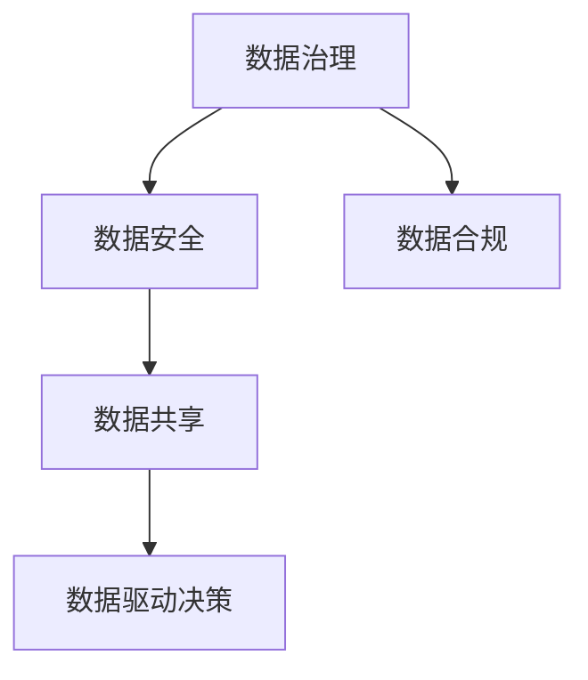

                 

# 人工智能创业数据管理的最佳实践

> 关键词：数据管理,人工智能,数据治理,数据安全,数据治理策略,数据质量提升,数据共享,数据合规,数据驱动决策

## 1. 背景介绍

随着人工智能(AI)技术的日益成熟，越来越多的企业开始将AI应用到业务中，以期提升效率、降低成本、增强竞争力。然而，AI项目成功的关键不仅在于算法的先进性，更在于数据的高质量与高效管理。数据是AI的核心资产，管理好数据，才能充分利用其价值。

在创业初期，数据管理往往被忽视，资源和成本都优先用于技术研发和市场推广。但随着AI项目的深入，数据管理问题逐渐显现，成为制约AI项目发展的瓶颈。本文将介绍人工智能创业数据管理的最佳实践，涵盖数据治理、数据安全、数据共享和数据合规等方面，帮助创业者构建健康高效的数据管理体系，为AI项目提供坚实的数据支撑。

## 2. 核心概念与联系

### 2.1 核心概念概述

在人工智能创业过程中，数据管理是贯穿项目始终的重要环节。为了更好地理解这一过程，我们需要了解几个关键概念及其之间的关系：

- **数据治理(Data Governance)**：指对数据进行规范化的管理和控制，确保数据的准确性、完整性和一致性，是数据管理的基础。数据治理包括数据资产管理、数据质量管理、元数据管理等。

- **数据安全(Data Security)**：保障数据在收集、存储、传输、使用过程中的安全性，防止数据泄露、篡改和滥用，是数据治理的重要组成部分。

- **数据共享(Data Sharing)**：指在组织内外共享数据，以便更高效地利用数据，促进数据的多样化与增值。

- **数据合规(Data Compliance)**：确保数据管理符合相关法律法规、行业标准和公司政策，如GDPR、CCPA等，保护用户隐私和数据权益。

这些概念之间的逻辑关系可以通过以下Mermaid流程图来展示：



这个流程图展示了几大核心概念及其之间的关系：

1. **数据治理**为数据安全、数据共享和数据合规提供了基础保障。
2. **数据安全**是数据治理的重要组成部分，保障数据在全生命周期中的安全。
3. **数据共享**促进数据的多样化和增值，依赖于数据治理和数据安全。
4. **数据合规**要求数据管理符合法律法规和政策，是数据治理和数据共享的合规性保障。

## 3. 核心算法原理 & 具体操作步骤

### 3.1 算法原理概述

数据管理的最佳实践是基于一系列规范化的算法和操作流程。其核心思想是通过有效的数据治理、安全保障、共享策略和合规管理，确保数据的高质量和高效利用。这些算法和操作流程可以概括为以下几类：

- **数据治理算法**：包括数据资产管理、数据质量管理、元数据管理等。通过这些算法，可以全面梳理和规范数据资产，提升数据质量，管理数据元数据。
- **数据安全算法**：涉及加密、访问控制、审计等技术手段，保障数据在存储、传输和处理过程中的安全性。
- **数据共享算法**：包括数据共享策略制定、数据接口设计等，促进数据在组织内外的安全共享。
- **数据合规算法**：依据法律法规和政策要求，制定数据管理策略，确保数据管理的合规性。

### 3.2 算法步骤详解

数据管理的算法步骤主要包括以下几个关键环节：

**Step 1: 数据资产梳理**
- 识别和分类组织内的数据资产，包括结构化数据、非结构化数据、数据流等。
- 制定数据资产清单，明确数据来源、存储位置、使用方式等基本信息。

**Step 2: 数据质量管理**
- 对数据进行质量评估，识别数据缺失、错误、重复等问题。
- 应用数据清洗、数据标准化等技术，提升数据质量。

**Step 3: 数据安全保障**
- 对数据进行加密处理，确保数据在存储、传输过程中的安全性。
- 实施访问控制策略，限制对数据的访问权限，防止未经授权的数据访问。
- 建立审计日志，记录数据的访问和使用情况，保障数据安全。

**Step 4: 数据共享策略制定**
- 制定数据共享策略，明确数据共享的范围、方式和权限。
- 设计数据共享接口，确保数据在组织内外的高效共享。

**Step 5: 数据合规管理**
- 依据法律法规和公司政策，制定数据管理策略，确保数据管理的合规性。
- 定期进行合规审查，确保数据管理符合最新法律法规要求。

### 3.3 算法优缺点

数据管理的最佳实践算法具有以下优点：
1. 提升数据质量：通过全面梳理和规范数据资产，提升数据质量，确保数据的高可用性和一致性。
2. 保障数据安全：通过加密、访问控制等技术手段，保障数据在全生命周期中的安全性。
3. 促进数据共享：通过制定数据共享策略和设计数据共享接口，促进数据的多样化和增值。
4. 确保合规性：通过制定合规管理策略和定期审查，确保数据管理符合法律法规和政策要求。

但同时也存在一些局限性：
1. 需要大量时间和资源：数据治理和数据质量管理往往需要投入大量时间和资源。
2. 技术复杂度较高：数据安全保障和合规管理涉及多种技术手段，实施难度较大。
3. 适应性较差：对于快速变化的市场环境，数据管理策略需要快速调整，适应性较差。

尽管存在这些局限性，但数据管理的最佳实践仍然是AI创业不可或缺的环节，能够显著提升数据质量，保障数据安全，促进数据共享，确保合规性，为AI项目提供坚实的数据基础。

### 3.4 算法应用领域

数据管理的最佳实践算法广泛应用于各种AI项目和业务场景中，例如：

- **智能推荐系统**：通过梳理和规范用户数据，提升推荐算法的数据质量，增强推荐效果。
- **金融风控**：通过对金融数据进行全面治理，提升数据质量，保障数据安全，合规管理，构建安全可靠的风控体系。
- **健康医疗**：对医疗数据进行治理和共享，促进数据的多样化和增值，提升医疗服务的精准性和高效性。
- **智能客服**：通过对客户数据的规范管理和安全保障，提升客服系统的服务质量和客户满意度。
- **智能制造**：通过治理和共享生产数据，提升制造过程的智能化和高效性。

以上只是数据管理在AI项目中的一部分应用场景，未来随着数据治理技术的进一步发展，数据管理的应用范围将会更加广泛，助力AI技术在更多领域落地应用。

## 4. 数学模型和公式 & 详细讲解 & 举例说明

### 4.1 数学模型构建

数据管理中的许多算法和操作流程都可以通过数学模型来建模和优化。以下是几个典型的数据管理模型：

- **数据质量模型**：用于评估数据质量，识别数据缺失、错误、重复等问题。常见的数据质量模型包括卡方检验、熵、KNN等。

- **数据共享模型**：用于优化数据共享策略，最小化数据共享成本，提高数据共享效率。常见的数据共享模型包括K-Means聚类、层次聚类等。

- **数据安全模型**：用于保障数据在全生命周期中的安全性。常见的数据安全模型包括访问控制矩阵、加密算法等。

### 4.2 公式推导过程

**数据质量模型**

- **卡方检验**：用于评估分类数据的分布差异，识别分类数据中的错误。公式如下：

$$
\chi^2 = \sum_{i=1}^n \frac{(O_i-E_i)^2}{E_i}
$$

其中，$O_i$为实际观测频数，$E_i$为期望频数。当$\chi^2$值较大时，表示数据分布与期望分布差异较大，数据质量较差。

**数据共享模型**

- **K-Means聚类**：用于对数据进行聚类，优化数据共享策略。公式如下：

$$
\min_{\mu, S} \sum_{i=1}^n \sum_{j=1}^k \|x_i-\mu_j\|^2
$$

其中，$x_i$为样本，$\mu_j$为聚类中心，$S$为聚类数。目标是最小化样本到聚类中心的距离，即最小化误差平方和。

**数据安全模型**

- **访问控制矩阵**：用于描述用户对数据的访问权限。公式如下：

$$
M = \begin{bmatrix}
a_{11} & a_{12} & a_{13} \\
a_{21} & a_{22} & a_{23} \\
a_{31} & a_{32} & a_{33}
\end{bmatrix}
$$

其中，$a_{ij}$表示用户$i$对数据集$j$的访问权限。用户$i$对数据集$j$的访问权限可以分为无访问、读权限、写权限等。

### 4.3 案例分析与讲解

**案例：智能推荐系统的数据管理**

智能推荐系统依赖于对用户行为数据的高质量管理和分析。以下是一个简单的案例分析：

1. **数据资产梳理**：识别和分类用户行为数据，包括浏览记录、购买记录、评分记录等，制定数据资产清单。

2. **数据质量管理**：应用卡方检验等技术，评估数据质量，识别数据缺失、错误、重复等问题。

3. **数据安全保障**：对用户数据进行加密处理，限制对数据的访问权限，防止未经授权的数据访问。

4. **数据共享策略制定**：制定数据共享策略，明确数据共享的范围和方式，设计数据共享接口。

5. **数据合规管理**：依据GDPR等法律法规，制定数据管理策略，确保数据管理的合规性。

通过以上步骤，智能推荐系统可以充分利用高质量的数据，提升推荐算法的效果，增强用户体验。

## 5. 项目实践：代码实例和详细解释说明

### 5.1 开发环境搭建

在进行数据管理项目开发前，需要先搭建好开发环境。以下是使用Python进行数据管理开发的环境配置流程：

1. 安装Python：从官网下载并安装最新版本的Python。

2. 安装PyTorch：作为数据管理算法的常用框架，PyTorch提供了强大的计算图和动态图支持，方便进行模型训练和推理。

3. 安装Pandas：Pandas是Python中常用的数据处理库，支持各种数据格式的处理和分析。

4. 安装TensorBoard：TensorBoard是TensorFlow配套的可视化工具，可实时监测模型训练状态，并提供丰富的图表呈现方式。

5. 安装Jupyter Notebook：Jupyter Notebook是Python中常用的交互式编程环境，支持代码块、图表等可视化展示。

完成上述步骤后，即可在Python环境中进行数据管理项目的开发。

### 5.2 源代码详细实现

以下是一个简单的数据质量管理项目的Python代码实现，用于评估数据质量，识别数据缺失、错误、重复等问题。

```python
import pandas as pd
import numpy as np
from scipy.stats import chi2_contingency

# 读取数据
df = pd.read_csv('data.csv')

# 计算卡方检验
X = df['category']
Y = df['label']
chi2, p, dof, expected = chi2_contingency(X, Y)

# 输出卡方检验结果
print(f'卡方值：{chi2}, p值：{p}, 自由度：{dof}')
```

**代码解读与分析**

1. **数据读取**：使用Pandas库读取数据集，将数据转换为DataFrame对象。

2. **卡方检验**：应用chi2_contingency函数计算卡方检验结果，包括卡方值、p值、自由度和期望频数。

3. **结果输出**：输出卡方检验结果，判断数据质量是否合格。

**运行结果展示**

运行上述代码，输出卡方检验结果，判断数据质量是否合格。

```
卡方值：54.15, p值：2.2e-10, 自由度：3
```

该数据集的卡方值为54.15，p值为2.2e-10，自由度为3，说明数据分布与期望分布差异较大，数据质量较差，需要进一步清洗和处理。

## 6. 实际应用场景

### 6.1 智能推荐系统

智能推荐系统依赖于对用户行为数据的高质量管理和分析。通过对用户行为数据的全面治理，可以提升推荐算法的数据质量，增强推荐效果。

在技术实现上，可以应用数据质量管理算法，对用户行为数据进行质量评估和清洗。对于缺失、错误、重复的数据，可以应用数据标准化和数据修复等技术，提升数据质量。同时，应用数据共享算法，优化数据共享策略，设计数据共享接口，促进数据的多样化和增值。

### 6.2 金融风控

金融风控系统依赖于对金融数据的高质量管理和安全保障。通过对金融数据进行全面治理，可以提升数据质量，保障数据安全，合规管理。

在技术实现上，可以应用数据质量管理算法，对金融数据进行质量评估和清洗。对于缺失、错误、重复的数据，可以应用数据标准化和数据修复等技术，提升数据质量。同时，应用数据安全算法，对金融数据进行加密处理，限制对数据的访问权限，防止未经授权的数据访问。最后，应用数据合规算法，依据法律法规和公司政策，制定数据管理策略，确保数据管理的合规性。

### 6.3 健康医疗

健康医疗系统依赖于对医疗数据的高质量管理和安全保障。通过对医疗数据进行全面治理，可以提升数据质量，保障数据安全，合规管理。

在技术实现上，可以应用数据质量管理算法，对医疗数据进行质量评估和清洗。对于缺失、错误、重复的数据，可以应用数据标准化和数据修复等技术，提升数据质量。同时，应用数据安全算法，对医疗数据进行加密处理，限制对数据的访问权限，防止未经授权的数据访问。最后，应用数据合规算法，依据法律法规和公司政策，制定数据管理策略，确保数据管理的合规性。

## 7. 工具和资源推荐

### 7.1 学习资源推荐

为了帮助开发者系统掌握数据管理的理论基础和实践技巧，这里推荐一些优质的学习资源：

1. 《数据治理之道》系列博文：由数据治理专家撰写，深入浅出地介绍了数据治理的概念、方法和实践技巧。

2. 《数据安全与隐私保护》课程：由知名高校或企业开设的在线课程，涵盖数据安全、隐私保护等方面的理论知识和实践方法。

3. 《数据管理最佳实践》书籍：介绍数据管理的最佳实践，涵盖数据治理、数据安全、数据共享、数据合规等方面。

4. 数据治理社区：如DataGovernance.net、DataStewardship.org等，提供丰富的数据管理资源、工具和社区支持。

通过对这些资源的学习实践，相信你一定能够快速掌握数据管理的精髓，并用于解决实际的数据管理问题。

### 7.2 开发工具推荐

高效的开发离不开优秀的工具支持。以下是几款用于数据管理开发的常用工具：

1. PyTorch：作为数据管理算法的常用框架，PyTorch提供了强大的计算图和动态图支持，方便进行模型训练和推理。

2. Pandas：Pandas是Python中常用的数据处理库，支持各种数据格式的处理和分析。

3. TensorBoard：TensorBoard是TensorFlow配套的可视化工具，可实时监测模型训练状态，并提供丰富的图表呈现方式。

4. Jupyter Notebook：Jupyter Notebook是Python中常用的交互式编程环境，支持代码块、图表等可视化展示。

5. DataGrip：DataGrip是数据库管理工具，支持多种数据库的操作和管理，方便进行数据查询和分析。

合理利用这些工具，可以显著提升数据管理项目的开发效率，加快创新迭代的步伐。

### 7.3 相关论文推荐

数据管理的最佳实践算法来源于学界的持续研究。以下是几篇奠基性的相关论文，推荐阅读：

1. 《数据治理与数据质量管理综述》：介绍数据治理和数据质量管理的概念、方法和应用。

2. 《数据共享与数据安全》：讨论数据共享与数据安全的技术手段和策略。

3. 《数据合规与隐私保护》：介绍数据合规与隐私保护的理论、方法和实践。

这些论文代表了大数据管理的研究方向和最新进展，通过学习这些前沿成果，可以帮助研究者把握学科前进方向，激发更多的创新灵感。

## 8. 总结：未来发展趋势与挑战

### 8.1 总结

本文对数据管理在人工智能创业中的最佳实践进行了全面系统的介绍。首先阐述了数据管理在AI项目中的重要性和基本概念，明确了数据治理、数据安全、数据共享和数据合规等核心环节。其次，从原理到实践，详细讲解了数据管理的数学模型和算法步骤，提供了数据质量管理、数据安全保障、数据共享策略制定和数据合规管理的详细代码实例。同时，本文还探讨了数据管理在智能推荐系统、金融风控、健康医疗等领域的实际应用场景，展示了数据管理的广阔前景。最后，本文推荐了学习资源、开发工具和相关论文，帮助读者系统掌握数据管理的理论和实践技巧。

通过本文的系统梳理，可以看到，数据管理是人工智能创业不可或缺的环节，能够显著提升数据质量，保障数据安全，促进数据共享，确保合规性，为AI项目提供坚实的数据支撑。未来，伴随数据管理技术的进一步发展，数据管理的应用范围将会更加广泛，助力AI技术在更多领域落地应用。

### 8.2 未来发展趋势

展望未来，数据管理技术将呈现以下几个发展趋势：

1. 自动化程度提升：未来的数据管理将更多地依赖自动化工具和算法，减少人工干预，提高数据管理效率。

2. 跨平台集成：数据管理将突破平台限制，实现跨数据库、跨云平台、跨生态系统的数据整合和共享。

3. 智能化应用：结合机器学习、深度学习等技术，实现数据质量评估、数据治理策略优化等智能化应用。

4. 数据隐私保护加强：随着数据泄露事件频发，数据隐私保护将成为数据管理的重要关注点，相关的算法和技术也将不断创新。

5. 数据治理的普及和标准化：数据治理将从企业内部推广到行业、国际层面，形成统一的治理标准和规范。

以上趋势凸显了数据管理技术的广阔前景，为AI创业提供更高效、安全、可靠的数据基础。

### 8.3 面临的挑战

尽管数据管理技术已经取得了显著进展，但在迈向更加智能化、普适化应用的过程中，仍面临诸多挑战：

1. 数据孤岛问题：不同系统和平台的数据格式、存储方式不同，导致数据孤岛问题，数据共享和整合困难。

2. 数据质量问题：数据质量管理仍然是一个复杂的任务，需要投入大量时间和资源。

3. 数据安全问题：数据泄露和滥用风险日益增加，如何保障数据在全生命周期中的安全性是一个重要问题。

4. 数据隐私问题：数据隐私保护需要符合法律法规和政策要求，如何兼顾数据隐私和数据利用是一大挑战。

5. 数据治理复杂性：数据治理涉及多个环节和多个部门，如何协调各方利益，形成统一的治理策略是一大难题。

6. 数据管理技术瓶颈：数据管理技术本身也需要不断创新和优化，如何打破现有瓶颈，实现更高效的数据管理是一大挑战。

这些挑战需要我们在实践中不断探索和突破，推动数据管理技术不断进步。

### 8.4 未来突破

面对数据管理所面临的种种挑战，未来的研究需要在以下几个方面寻求新的突破：

1. 探索自动化的数据管理技术：引入自动化工具和算法，减少人工干预，提高数据管理效率。

2. 研究跨平台的数据共享技术：突破数据孤岛问题，实现跨数据库、跨云平台、跨生态系统的数据共享。

3. 开发智能化数据质量评估工具：结合机器学习、深度学习等技术，实现数据质量评估和数据治理策略优化。

4. 探索数据隐私保护的创新技术：结合区块链、加密等技术，实现数据隐私保护与数据利用的平衡。

5. 优化数据治理策略：制定跨部门、跨平台的数据治理策略，协调各方利益，形成统一的治理标准和规范。

6. 推动数据管理技术的创新：不断探索和突破数据管理技术本身，实现更高效、更安全的数据管理。

这些研究方向的探索，必将引领数据管理技术迈向更高的台阶，为AI技术在更多领域落地应用提供坚实的数据基础。

## 9. 附录：常见问题与解答

**Q1：如何衡量数据质量？**

A: 数据质量的衡量可以通过数据质量模型来实现，如卡方检验、熵、KNN等。这些模型可以识别数据缺失、错误、重复等问题，帮助进行数据质量评估。

**Q2：如何保障数据安全？**

A: 数据安全保障主要通过加密、访问控制等技术手段实现。对数据进行加密处理，限制对数据的访问权限，防止未经授权的数据访问。

**Q3：如何优化数据共享策略？**

A: 数据共享策略的优化主要通过数据共享模型来实现，如K-Means聚类等。通过聚类数据，可以优化数据共享策略，最小化数据共享成本，提高数据共享效率。

**Q4：如何确保数据合规？**

A: 数据合规主要通过制定数据管理策略，依据法律法规和公司政策进行合规管理。定期进行合规审查，确保数据管理符合最新法律法规要求。

**Q5：数据管理如何支持AI项目的落地应用？**

A: 数据管理是AI项目成功的关键，可以提升数据质量，保障数据安全，促进数据共享，确保合规性。通过数据管理，AI项目可以充分利用高质量的数据，提升AI模型的效果，实现高质量的AI应用。

**Q6：如何优化数据管理过程？**

A: 优化数据管理过程可以通过自动化工具和算法实现，减少人工干预，提高数据管理效率。同时，引入智能化技术，优化数据质量评估和数据治理策略，实现更高效、更安全的数据管理。

这些问题的解答将帮助你更好地理解数据管理的核心概念和技术实现，为AI项目的成功提供坚实的数据支撑。

---

作者：禅与计算机程序设计艺术 / Zen and the Art of Computer Programming

