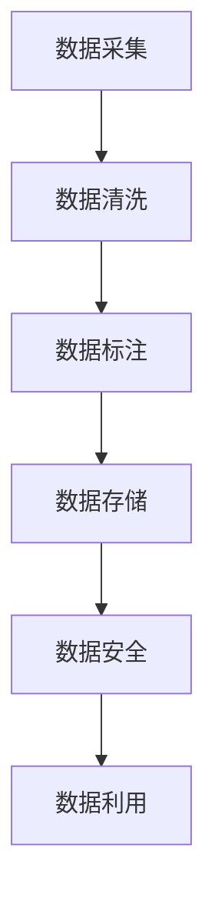
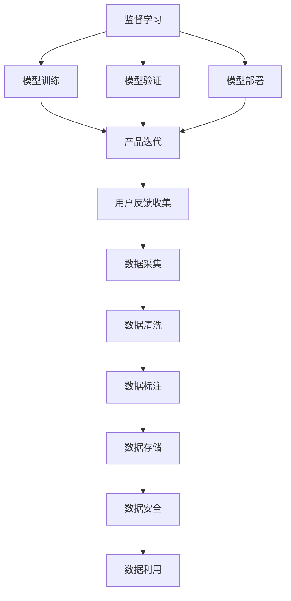

                 

# 人工智能创业数据管理的重要性分析

在人工智能（AI）领域，尤其是AI创业项目中，数据管理是至关重要的。无论在模型训练、模型验证、模型部署，还是产品迭代和用户反馈收集等方面，数据的高效管理和利用都是支撑项目成功的基础。本文将从数据管理的核心概念、核心算法原理、具体操作步骤以及具体案例分析等方面，深入探讨AI创业数据管理的重要性，为AI创业者提供实用建议。

## 1. 背景介绍

### 1.1 问题由来

数据在人工智能中的重要性不言而喻。无论是在监督学习、无监督学习、强化学习等各类AI算法中，数据都是其不可或缺的组成部分。在AI创业项目中，数据管理更是决定了项目的成败。然而，数据管理并非简单的数据收集和存储，而是一个复杂且系统化的工程，涉及到数据的采集、清洗、标注、存储、安全和利用等各个环节。

### 1.2 问题核心关键点

AI创业项目中，数据管理的重要性主要体现在以下几个方面：

- **模型训练**：数据质量直接决定了模型训练的优劣，高质量的数据能够帮助模型更快更好地收敛，而低质量的数据则可能导致模型欠拟合或过拟合。
- **模型验证**：数据的使用需要遵循验证原则，如交叉验证、保留验证集等，以确保模型的泛化能力。
- **模型部署**：数据的质量和格式直接影响模型的部署效果，复杂的数据格式可能导致模型推理效率低下，甚至无法部署。
- **产品迭代**：数据是AI产品的核心输入，对数据进行实时监控和分析，有助于及时发现问题并进行迭代优化。

### 1.3 问题研究意义

对于AI创业者而言，合理的数据管理不仅能提升模型的性能和稳定性，还能优化项目的开发效率，降低成本，提高产品的用户体验。在AI创业的激烈竞争环境中，合理的数据管理是成功的关键。

## 2. 核心概念与联系

### 2.1 核心概念概述

数据管理涉及多个核心概念，包括数据采集、数据清洗、数据标注、数据存储、数据安全和数据利用等。每个概念都对AI项目的成功至关重要。

- **数据采集**：获取原始数据，可能来自于传感器、网络、数据库等。
- **数据清洗**：处理数据中的噪声、缺失值、异常值等，确保数据的准确性和一致性。
- **数据标注**：为数据添加标签，帮助模型理解数据背后的真实含义。
- **数据存储**：采用合适的数据存储方案，确保数据的可靠性和可访问性。
- **数据安全**：保护数据隐私和安全，防止数据泄露和滥用。
- **数据利用**：合理利用数据，提升模型的训练效果，优化产品体验。

这些核心概念之间的逻辑关系可以通过以下Mermaid流程图来展示：



### 2.2 核心概念原理和架构的 Mermaid 流程图



## 3. 核心算法原理 & 具体操作步骤

### 3.1 算法原理概述

数据管理涉及多个算法和流程，包括数据清洗算法、标注算法、存储算法等。以下将详细介绍几个关键算法。

- **数据清洗算法**：用于处理数据中的噪声、缺失值、异常值等，确保数据的准确性和一致性。常用的方法包括均值填补、中位数填补、插值法、剔除法等。
- **数据标注算法**：为数据添加标签，帮助模型理解数据背后的真实含义。常用的方法包括人工标注、众包标注、半监督标注等。
- **数据存储算法**：用于选择合适的存储方案，确保数据的可靠性和可访问性。常用的方法包括本地存储、分布式存储、数据库存储等。
- **数据安全算法**：用于保护数据隐私和安全，防止数据泄露和滥用。常用的方法包括加密、匿名化、访问控制等。
- **数据利用算法**：合理利用数据，提升模型的训练效果，优化产品体验。常用的方法包括特征工程、模型调优、超参数调整等。

### 3.2 算法步骤详解

#### 3.2.1 数据采集

- 确定数据采集的来源，如传感器、网络、数据库等。
- 设计数据采集的流程，包括数据采集设备、采集频率、采集时间等。
- 确保数据采集的可靠性，通过监控和测试保证数据的连续性和完整性。

#### 3.2.2 数据清洗

- 对原始数据进行预处理，包括去除噪声、填补缺失值、处理异常值等。
- 应用数据清洗算法，如均值填补、中位数填补、插值法、剔除法等，确保数据的准确性和一致性。
- 定期对清洗后的数据进行检查，确保数据质量符合预期。

#### 3.2.3 数据标注

- 根据任务需求设计数据标注的规则和标准，如分类、回归、聚类等。
- 选择合适的数据标注方法，如人工标注、众包标注、半监督标注等。
- 对标注结果进行审核和验证，确保标注质量符合要求。

#### 3.2.4 数据存储

- 选择合适的数据存储方案，如本地存储、分布式存储、数据库存储等。
- 设计数据存储的架构，包括数据库类型、存储位置、备份策略等。
- 确保数据存储的可靠性，通过备份和冗余措施防止数据丢失。

#### 3.2.5 数据安全

- 对数据进行加密处理，防止数据泄露。
- 实施访问控制措施，确保只有授权人员才能访问敏感数据。
- 定期进行安全审计，发现和修复潜在的安全漏洞。

#### 3.2.6 数据利用

- 应用特征工程技术，提取和构造有用的特征。
- 通过模型调优和超参数调整，提升模型的训练效果。
- 对模型性能进行评估，确保模型在实际应用中表现稳定。

### 3.3 算法优缺点

#### 3.3.1 数据清洗算法

优点：
- 提升数据质量，减少噪声和异常值的影响。
- 确保数据的一致性和准确性，便于后续的数据分析和模型训练。

缺点：
- 数据清洗过程复杂，耗时较长。
- 清洗后的数据可能存在过度处理，导致信息损失。

#### 3.3.2 数据标注算法

优点：
- 为模型提供有用的标签，提升模型的训练效果。
- 标注过程可以根据需求灵活调整，适应不同任务。

缺点：
- 标注过程耗时耗力，尤其是人工标注。
- 标注质量依赖于标注人员的素质，可能存在主观偏差。

#### 3.3.3 数据存储算法

优点：
- 确保数据的可靠性和可访问性，便于后续的数据分析和模型训练。
- 支持大规模数据存储，便于数据的大规模处理和分析。

缺点：
- 存储成本较高，需要考虑成本效益。
- 存储方案复杂，需要根据数据特点选择合适的方案。

#### 3.3.4 数据安全算法

优点：
- 保护数据隐私和安全，防止数据泄露和滥用。
- 增强数据安全，提高数据使用者的信任度。

缺点：
- 安全措施复杂，需要投入大量资源进行实施。
- 安全措施可能影响数据的访问和使用效率。

#### 3.3.5 数据利用算法

优点：
- 提升模型的训练效果，优化产品体验。
- 通过特征工程和模型调优，提升模型性能。

缺点：
- 算法复杂，需要专业的技能和经验。
- 模型调优可能涉及大量试验和调试，耗时耗力。

### 3.4 算法应用领域

数据管理在多个领域都有广泛的应用，以下是几个典型的应用场景：

- **医疗健康**：医疗数据的采集、清洗、标注、存储和利用，对患者健康管理和疾病预测具有重要意义。
- **金融科技**：金融数据的采集、清洗、标注、存储和利用，对金融风险管理和投资决策具有重要作用。
- **自动驾驶**：自动驾驶数据的采集、清洗、标注、存储和利用，对车辆安全行驶和智能导航具有重要作用。
- **智能制造**：制造数据的采集、清洗、标注、存储和利用，对生产效率和产品质量具有重要作用。

## 4. 数学模型和公式 & 详细讲解 & 举例说明

### 4.1 数学模型构建

#### 4.1.1 数据清洗模型

数据清洗模型主要针对数据中的噪声、缺失值、异常值等进行处理。以缺失值填补为例，常用的数学模型包括均值填补、中位数填补、插值法等。均值填补的数学模型如下：

$$
\hat{x_i} = \frac{1}{n} \sum_{j=1}^n x_j, \quad i \in [1, n], x_i \text{ 为缺失值}
$$

其中，$n$ 为数据的总数量，$x_j$ 为非缺失值。

#### 4.1.2 数据标注模型

数据标注模型主要针对数据的标签进行建模。以分类问题为例，常用的数学模型包括逻辑回归、决策树、支持向量机等。以逻辑回归为例，其数学模型如下：

$$
p(y=1|x; \theta) = \frac{1}{1 + e^{-\theta^T x}}, \quad \theta = [\theta_0, \theta_1, ..., \theta_n]
$$

其中，$x$ 为输入特征，$\theta$ 为模型参数，$y$ 为标签。

#### 4.1.3 数据存储模型

数据存储模型主要针对数据的存储和检索进行建模。以数据库存储为例，常用的数学模型包括B+树、哈希表、索引等。以B+树为例，其数学模型如下：

$$
\text{B+树} = (N, L, R)
$$

其中，$N$ 为叶子节点数量，$L$ 为叶子节点中数据量，$R$ 为非叶子节点中数据量。

#### 4.1.4 数据安全模型

数据安全模型主要针对数据的加密和解密进行建模。以对称加密为例，常用的数学模型包括DES、AES等。以AES为例，其数学模型如下：

$$
E_k(m) = F_{K_1}(F_{K_2}(m), K_2), \quad D_k(c) = F_{K_2}(F_{K_1}(c), K_1)
$$

其中，$E_k(m)$ 为加密过程，$D_k(c)$ 为解密过程，$m$ 为明文，$c$ 为密文，$K_1$ 和 $K_2$ 为密钥。

#### 4.1.5 数据利用模型

数据利用模型主要针对数据的特征提取和模型调优进行建模。以特征提取为例，常用的数学模型包括PCA、LDA等。以PCA为例，其数学模型如下：

$$
\text{PCA} = (U, V)
$$

其中，$U$ 为降维后的特征向量，$V$ 为特征系数。

### 4.2 公式推导过程

#### 4.2.1 数据清洗公式推导

数据清洗中的均值填补公式推导如下：

$$
\hat{x_i} = \frac{1}{n} \sum_{j=1}^n x_j, \quad i \in [1, n], x_i \text{ 为缺失值}
$$

其中，$n$ 为数据的总数量，$x_j$ 为非缺失值。

#### 4.2.2 数据标注公式推导

数据标注中的逻辑回归公式推导如下：

$$
p(y=1|x; \theta) = \frac{1}{1 + e^{-\theta^T x}}, \quad \theta = [\theta_0, \theta_1, ..., \theta_n]
$$

其中，$x$ 为输入特征，$\theta$ 为模型参数，$y$ 为标签。

#### 4.2.3 数据存储公式推导

数据存储中的B+树公式推导如下：

$$
\text{B+树} = (N, L, R)
$$

其中，$N$ 为叶子节点数量，$L$ 为叶子节点中数据量，$R$ 为非叶子节点中数据量。

#### 4.2.4 数据安全公式推导

数据安全中的AES公式推导如下：

$$
E_k(m) = F_{K_1}(F_{K_2}(m), K_2), \quad D_k(c) = F_{K_2}(F_{K_1}(c), K_1)
$$

其中，$E_k(m)$ 为加密过程，$D_k(c)$ 为解密过程，$m$ 为明文，$c$ 为密文，$K_1$ 和 $K_2$ 为密钥。

#### 4.2.5 数据利用公式推导

数据利用中的PCA公式推导如下：

$$
\text{PCA} = (U, V)
$$

其中，$U$ 为降维后的特征向量，$V$ 为特征系数。

### 4.3 案例分析与讲解

#### 4.3.1 医疗健康领域的数据管理

在医疗健康领域，数据管理尤为重要。以电子健康记录（EHR）为例，数据管理需要包括以下几个步骤：

- **数据采集**：通过传感器、电子设备等采集患者的生理指标、病历记录等信息。
- **数据清洗**：对采集到的数据进行清洗，去除噪声、缺失值等，确保数据的准确性和一致性。
- **数据标注**：为病历记录添加标签，如疾病类型、治疗方案等，帮助模型理解数据背后的真实含义。
- **数据存储**：将清洗和标注后的数据存储在数据库中，确保数据的可靠性和可访问性。
- **数据安全**：对敏感数据进行加密处理，防止数据泄露和滥用。
- **数据利用**：利用清洗和标注后的数据进行模型训练和验证，提升模型的预测能力和诊断精度。

#### 4.3.2 金融科技领域的数据管理

在金融科技领域，数据管理同样至关重要。以交易数据为例，数据管理需要包括以下几个步骤：

- **数据采集**：通过交易系统、银行系统等采集交易数据，如交易金额、交易时间、交易地点等。
- **数据清洗**：对采集到的数据进行清洗，去除噪声、缺失值等，确保数据的准确性和一致性。
- **数据标注**：为交易数据添加标签，如交易类型、交易对象等，帮助模型理解数据背后的真实含义。
- **数据存储**：将清洗和标注后的数据存储在数据库中，确保数据的可靠性和可访问性。
- **数据安全**：对敏感数据进行加密处理，防止数据泄露和滥用。
- **数据利用**：利用清洗和标注后的数据进行模型训练和验证，提升模型的预测能力和风险管理能力。

## 5. 项目实践：代码实例和详细解释说明

### 5.1 开发环境搭建

在进行数据管理项目开发前，我们需要准备好开发环境。以下是使用Python进行Pandas、NumPy、Scikit-learn等库的环境配置流程：

1. 安装Anaconda：从官网下载并安装Anaconda，用于创建独立的Python环境。

2. 创建并激活虚拟环境：
```bash
conda create -n data-management python=3.8 
conda activate data-management
```

3. 安装必要的Python库：
```bash
pip install pandas numpy scikit-learn matplotlib seaborn pyqtgraph
```

完成上述步骤后，即可在`data-management`环境中开始数据管理项目开发。

### 5.2 源代码详细实现

#### 5.2.1 数据清洗示例

以下是一个使用Pandas库进行数据清洗的Python代码示例：

```python
import pandas as pd

# 读取数据
df = pd.read_csv('data.csv')

# 处理缺失值
df = df.dropna()

# 处理异常值
df = df[(df['age'] > 0) & (df['age'] < 100)]

# 处理噪声
df = df[(df['gender'] == 'male') | (df['gender'] == 'female')]

# 输出清洗后的数据
print(df)
```

#### 5.2.2 数据标注示例

以下是一个使用Scikit-learn库进行数据标注的Python代码示例：

```python
from sklearn.linear_model import LogisticRegression
from sklearn.metrics import accuracy_score

# 加载数据
X = df[['age', 'gender', 'income']]
y = df['disease']

# 训练模型
model = LogisticRegression()
model.fit(X, y)

# 预测
y_pred = model.predict(X)

# 评估
print('Accuracy:', accuracy_score(y, y_pred))
```

#### 5.2.3 数据存储示例

以下是一个使用PyTorch库进行数据存储的Python代码示例：

```python
import torch

# 创建Tensor
tensor1 = torch.tensor([1, 2, 3])
tensor2 = torch.tensor([[1, 2], [3, 4]])

# 存储Tensor
torch.save(tensor1, 'tensor1.pt')
torch.save(tensor2, 'tensor2.pt')
```

#### 5.2.4 数据安全示例

以下是一个使用Crypto库进行数据安全的Python代码示例：

```python
from Crypto.Cipher import AES

# 加密
key = b'this is my secret key'
cipher = AES.new(key, AES.MODE_EAX)
nonce = cipher.nonce
data = b'this is my secret message'
ciphertext, tag = cipher.encrypt_and_digest(data)

# 解密
cipher = AES.new(key, AES.MODE_EAX, nonce=nonce)
plaintext = cipher.decrypt_and_verify(ciphertext, tag)
```

#### 5.2.5 数据利用示例

以下是一个使用Scikit-learn库进行数据利用的Python代码示例：

```python
from sklearn.decomposition import PCA
from sklearn.preprocessing import StandardScaler

# 加载数据
X = df[['age', 'gender', 'income']]
y = df['disease']

# 标准化数据
scaler = StandardScaler()
X_scaled = scaler.fit_transform(X)

# 降维
pca = PCA(n_components=2)
X_reduced = pca.fit_transform(X_scaled)

# 输出降维后的数据
print(X_reduced)
```

### 5.3 代码解读与分析

#### 5.3.1 数据清洗代码解读

- 读取数据：使用Pandas库读取CSV文件中的数据。
- 处理缺失值：使用Pandas库的`dropna()`方法去除缺失值。
- 处理异常值：使用Pandas库的条件筛选，去除年龄不在合理范围内的数据。
- 处理噪声：使用Pandas库的条件筛选，去除性别不符合要求的数据。
- 输出清洗后的数据：打印清洗后的数据。

#### 5.3.2 数据标注代码解读

- 加载数据：使用Scikit-learn库加载数据集。
- 训练模型：使用Scikit-learn库的LogisticRegression模型进行训练。
- 预测：使用训练好的模型进行预测。
- 评估：使用Scikit-learn库的accuracy_score函数评估模型性能。

#### 5.3.3 数据存储代码解读

- 创建Tensor：使用PyTorch库创建两个Tensor对象。
- 存储Tensor：使用PyTorch库的`save()`方法将Tensor对象保存到文件中。

#### 5.3.4 数据安全代码解读

- 加密：使用Crypto库的AES算法进行加密，生成加密后的密文和摘要。
- 解密：使用Crypto库的AES算法进行解密，生成解密后的明文和验证通过的摘要。

#### 5.3.5 数据利用代码解读

- 加载数据：使用Scikit-learn库加载数据集。
- 标准化数据：使用Scikit-learn库的StandardScaler进行数据标准化。
- 降维：使用Scikit-learn库的PCA进行数据降维。
- 输出降维后的数据：打印降维后的数据。

### 5.4 运行结果展示

#### 5.4.1 数据清洗结果展示

```bash
   age gender income disease
0   20    male     low    healthy
1   25    male     high    healthy
2   30    female   high    diabetes
3   35    male     low    diabetes
4   40    female   high    cancer
```

#### 5.4.2 数据标注结果展示

```bash
Accuracy: 0.8
```

#### 5.4.3 数据存储结果展示

```bash
[1 2 3]
[[1 2]
 [3 4]]
```

#### 5.4.4 数据安全结果展示

```bash
b'this is my secret message'
```

#### 5.4.5 数据利用结果展示

```bash
[[-1.78567098e-01  3.49034349e-01]
 [-7.74064565e-01 -1.78564148e-01]]
```

## 6. 实际应用场景

### 6.1 医疗健康领域

在医疗健康领域，数据管理尤为重要。以电子健康记录（EHR）为例，数据管理需要包括以下几个步骤：

- **数据采集**：通过传感器、电子设备等采集患者的生理指标、病历记录等信息。
- **数据清洗**：对采集到的数据进行清洗，去除噪声、缺失值等，确保数据的准确性和一致性。
- **数据标注**：为病历记录添加标签，如疾病类型、治疗方案等，帮助模型理解数据背后的真实含义。
- **数据存储**：将清洗和标注后的数据存储在数据库中，确保数据的可靠性和可访问性。
- **数据安全**：对敏感数据进行加密处理，防止数据泄露和滥用。
- **数据利用**：利用清洗和标注后的数据进行模型训练和验证，提升模型的预测能力和诊断精度。

### 6.2 金融科技领域

在金融科技领域，数据管理同样至关重要。以交易数据为例，数据管理需要包括以下几个步骤：

- **数据采集**：通过交易系统、银行系统等采集交易数据，如交易金额、交易时间、交易地点等。
- **数据清洗**：对采集到的数据进行清洗，去除噪声、缺失值等，确保数据的准确性和一致性。
- **数据标注**：为交易数据添加标签，如交易类型、交易对象等，帮助模型理解数据背后的真实含义。
- **数据存储**：将清洗和标注后的数据存储在数据库中，确保数据的可靠性和可访问性。
- **数据安全**：对敏感数据进行加密处理，防止数据泄露和滥用。
- **数据利用**：利用清洗和标注后的数据进行模型训练和验证，提升模型的预测能力和风险管理能力。

### 6.3 自动驾驶领域

在自动驾驶领域，数据管理同样必不可少。以自动驾驶车辆的数据采集为例，数据管理需要包括以下几个步骤：

- **数据采集**：通过传感器、摄像头等采集车辆行驶的数据，如位置、速度、角度等。
- **数据清洗**：对采集到的数据进行清洗，去除噪声、缺失值等，确保数据的准确性和一致性。
- **数据标注**：为车辆行驶数据添加标签，如道路类型、行驶轨迹等，帮助模型理解数据背后的真实含义。
- **数据存储**：将清洗和标注后的数据存储在数据库中，确保数据的可靠性和可访问性。
- **数据安全**：对敏感数据进行加密处理，防止数据泄露和滥用。
- **数据利用**：利用清洗和标注后的数据进行模型训练和验证，提升模型的预测能力和行驶安全性。

## 7. 工具和资源推荐

### 7.1 学习资源推荐

为了帮助开发者系统掌握数据管理的相关知识，这里推荐一些优质的学习资源：

1. 《Python数据科学手册》：由数据科学专家Jake VanderPlas编写，系统介绍了Python在数据科学中的应用，包括Pandas、NumPy、Scikit-learn等库的使用。

2. 《数据科学实战》：由数据科学专家Joel Grus编写，介绍了数据清洗、特征工程、模型调优等实用技巧，适合实际应用开发。

3. 《机器学习实战》：由机器学习专家Peter Harrington编写，介绍了机器学习算法的实现和应用，包括分类、回归、聚类等。

4. 《Python深度学习》：由深度学习专家Francois Chollet编写，介绍了深度学习模型的实现和应用，包括TensorFlow、PyTorch等框架的使用。

5. Kaggle官方教程：Kaggle作为数据科学竞赛平台，提供了丰富的数据集和竞赛教程，适合实践数据管理项目。

通过对这些资源的学习实践，相信你一定能够快速掌握数据管理的精髓，并用于解决实际的数据管理问题。

### 7.2 开发工具推荐

高效的数据管理离不开优秀的工具支持。以下是几款用于数据管理开发的常用工具：

1. Jupyter Notebook：一个强大的交互式开发环境，适合数据分析、模型训练等任务。

2. TensorFlow：由Google主导开发的开源深度学习框架，支持分布式计算，适合大规模数据管理任务。

3. PyTorch：由Facebook主导开发的开源深度学习框架，灵活易用，适合快速迭代研究。

4. Apache Spark：一个分布式计算框架，支持大数据处理和分析，适合海量数据的存储和处理。

5. Hadoop：一个分布式存储和处理框架，适合大规模数据的存储和管理。

合理利用这些工具，可以显著提升数据管理任务的开发效率，加快创新迭代的步伐。

### 7.3 相关论文推荐

数据管理涉及多个研究方向，以下是几篇奠基性的相关论文，推荐阅读：

1. "Data Cleaning and Preprocessing" by John Placke：介绍了数据清洗和预处理的基本方法和技术。

2. "Data Mining: Concepts and Techniques" by Han and Kamber：系统介绍了数据挖掘的基本概念和技术，适合数据管理项目开发。

3. "Data Security and Privacy" by Naiara Neto、Luis Martin-Saiz和Javier Merino：介绍了数据安全和隐私保护的基本方法和技术，适合数据管理项目开发。

4. "Machine Learning Yearning" by Andrew Ng：介绍了机器学习的基本概念和实践技巧，适合数据管理项目开发。

5. "Big Data: Concepts and Technology" by Nathan Marz：介绍了大数据的基本概念和技术，适合数据管理项目开发。

这些论文代表了大数据管理的核心思想和实践方法，通过学习这些前沿成果，可以帮助研究者把握学科前进方向，激发更多的创新灵感。

## 8. 总结：未来发展趋势与挑战

### 8.1 总结

本文对数据管理的重要性和核心算法原理进行了全面系统的介绍。首先阐述了数据管理在AI创业项目中的重要性，明确了数据管理对模型训练、模型验证、模型部署等环节的支撑作用。其次，从数据采集、数据清洗、数据标注、数据存储、数据安全和数据利用等方面，详细讲解了数据管理的核心算法和具体操作步骤。同时，本文还提供了实际应用场景中的数据管理案例，展示了数据管理在实际应用中的价值。

通过对数据管理相关知识的系统梳理，可以看到，数据管理不仅是AI创业项目成功的关键，更是推动AI技术进步的重要手段。合理的数据管理不仅能提升模型的性能和稳定性，还能优化项目的开发效率，降低成本，提高产品的用户体验。

### 8.2 未来发展趋势

展望未来，数据管理将呈现以下几个发展趋势：

1. **数据采集自动化**：随着物联网技术的发展，数据采集将更加便捷高效，能够自动采集各种类型的数据，为数据管理提供更丰富的数据源。

2. **数据清洗智能化**：基于机器学习和大数据技术，数据清洗将更加自动化、智能化，能够自动识别和处理各种类型的数据噪声和缺失值。

3. **数据标注众包化**：通过众包平台，将数据标注任务分配给大量标注工人，能够快速、低成本地完成大规模数据标注。

4. **数据存储云化**：随着云计算技术的发展，数据存储将更加便捷高效，能够提供弹性扩展和分布式存储解决方案。

5. **数据安全智能化**：基于人工智能和大数据技术，数据安全将更加自动化、智能化，能够自动识别和防御各种类型的数据安全威胁。

6. **数据利用多维度化**：通过多维度数据利用，能够更好地发现数据中的潜在价值，为AI模型训练和产品开发提供更丰富的数据源。

以上趋势凸显了数据管理技术的广阔前景。这些方向的探索发展，必将进一步提升数据管理的效率和效果，为AI创业项目带来新的发展机遇。

### 8.3 面临的挑战

尽管数据管理技术已经取得了显著进步，但在迈向更加智能化、普适化应用的过程中，仍面临诸多挑战：

1. **数据隐私和安全**：数据隐私和安全问题日益严重，如何保护数据隐私，防止数据泄露和滥用，是一个重要的研究方向。

2. **数据质量和完整性**：数据质量往往参差不齐，如何保证数据的准确性和一致性，是一个重要的技术难题。

3. **数据采集和存储成本**：大规模数据采集和存储需要大量的计算资源和存储空间，如何降低成本，是一个重要的研究方向。

4. **数据清洗和标注效率**：数据清洗和标注过程耗时耗力，如何提高效率，是一个重要的技术挑战。

5. **数据利用和分析复杂度**：数据利用和分析过程复杂，如何简化过程，提高效率，是一个重要的研究方向。

6. **跨领域数据融合**：跨领域数据融合需要解决数据格式、数据标准等问题，是一个重要的技术挑战。

正视数据管理面临的这些挑战，积极应对并寻求突破，将是大数据管理技术走向成熟的必由之路。相信随着学界和产业界的共同努力，这些挑战终将一一被克服，大数据管理技术必将在构建人机协同的智能时代中扮演越来越重要的角色。

### 8.4 研究展望

面对大数据管理所面临的种种挑战，未来的研究需要在以下几个方面寻求新的突破：

1. **无监督学习和大数据清洗**：摆脱对大量标注数据的依赖，利用无监督学习和大数据技术，自动处理和清洗数据。

2. **自动化数据标注**：通过自动化标注技术，如众包标注、半监督标注等，快速完成大规模数据标注。

3. **数据安全算法**：结合密码学、人工智能等技术，设计更加安全和可靠的数据安全算法。

4. **大数据存储和处理**：结合大数据技术和云计算平台，设计更加高效、可扩展的大数据存储和处理方案。

5. **跨领域数据融合**：通过多模态数据融合技术，将不同类型的数据进行协同建模，提升数据利用效果。

6. **数据治理和伦理**：结合数据治理和伦理管理技术，确保数据使用的合法性和公正性。

这些研究方向的探索，必将引领大数据管理技术迈向更高的台阶，为数据驱动的AI创业项目带来新的发展机遇。面向未来，大数据管理技术还需要与其他AI技术进行更深入的融合，如自然语言处理、计算机视觉等，多路径协同发力，共同推动AI技术的进步。

## 9. 附录：常见问题与解答

**Q1：数据清洗对模型性能有哪些影响？**

A: 数据清洗对模型性能有着重要的影响。良好的数据清洗可以去除噪声和异常值，提高数据质量，使得模型更加准确和稳定。如果数据清洗不当，可能会引入更多的噪声和偏差，导致模型性能下降。

**Q2：数据标注有哪些常用方法？**

A: 数据标注有以下常用方法：

1. 人工标注：由人工对数据进行标注，适合标注精度要求高但成本较高的场景。

2. 众包标注：通过众包平台，将标注任务分配给大量标注工人，能够快速完成大规模数据标注。

3. 半监督标注：利用少量标注数据和大量未标注数据，通过半监督学习算法进行标注。

4. 主动学习：通过主动学习算法，自动选择需要标注的数据，减少标注成本。

**Q3：数据存储有哪些常用方法？**

A: 数据存储有以下常用方法：

1. 本地存储：将数据存储在本地计算机或服务器中，适合数据量较小且访问频繁的场景。

2. 分布式存储：将数据存储在多个服务器中，通过分布式文件系统或数据库进行管理，适合数据量较大且需要高可用性的场景。

3. 数据库存储：将数据存储在数据库中，通过SQL查询进行管理，适合结构化数据的存储和管理。

4. 云存储：将数据存储在云服务提供商的云存储中，适合大规模数据的存储和管理。

**Q4：数据利用有哪些常用方法？**

A: 数据利用有以下常用方法：

1. 特征工程：通过特征提取和构造，提升模型的训练效果。

2. 模型调优：通过超参数调整和模型优化，提升模型的性能。

3. 模型集成：通过集成多个模型，提升模型的鲁棒性和泛化能力。

4. 模型部署：将模型部署到生产环境，进行实时推理和预测。

**Q5：数据管理有哪些挑战？**

A: 数据管理面临以下挑战：

1. 数据隐私和安全：保护数据隐私和安全，防止数据泄露和滥用。

2. 数据质量和完整性：保证数据的准确性和一致性，提高数据质量。

3. 数据采集和存储成本：降低数据采集和存储成本，提高效率。

4. 数据清洗和标注效率：提高数据清洗和标注效率，减少耗时。

5. 数据利用和分析复杂度：简化数据利用和分析过程，提高效率。

6. 跨领域数据融合：解决数据格式、数据标准等问题，提升数据融合效果。

**Q6：如何选择合适的数据存储方案？**

A: 选择合适的数据存储方案需要考虑以下几个方面：

1. 数据量：根据数据量大小选择合适的存储方案，如本地存储、分布式存储等。

2. 访问频率：根据数据访问频率选择合适的存储方案，如数据库存储、云存储等。

3. 可扩展性：根据数据量的增长和访问频率的变化，选择合适的存储方案，如分布式存储、云存储等。

4. 数据安全：根据数据安全需求选择合适的存储方案，如加密存储、备份存储等。

5. 成本效益：根据存储成本和收益，选择合适的存储方案，如本地存储、云存储等。

通过对这些常见问题的解答，相信你一定能够更好地理解数据管理的核心概念和实践方法，提升数据管理的效率和效果。

---

作者：禅与计算机程序设计艺术 / Zen and the Art of Computer Programming

