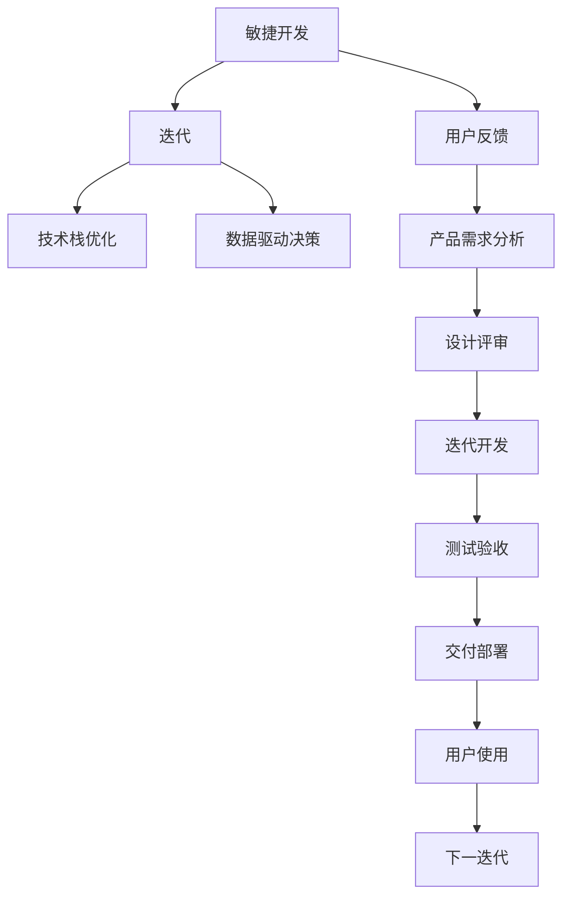

                 

# 人工智能创业：产品迭代的方法

> 关键词：人工智能创业, 产品迭代, 敏捷开发, 用户反馈, 技术栈优化, 数据驱动决策, 版本管理, MVP (最小可行产品), 迭代周期

## 1. 背景介绍

### 1.1 问题由来
在人工智能领域的创业环境中，产品迭代是企业持续创新和竞争的关键。相较于传统软件，AI产品技术复杂度高，研发周期长，市场需求变化快。如何快速、灵活地将创意转化为商业价值，是一个充满挑战的问题。

### 1.2 问题核心关键点
针对这一挑战，敏捷开发(Agile Development)和迭代(Iterative)方法显得尤为重要。敏捷开发强调快速响应市场变化，而迭代则是持续改进产品、降低风险的有效手段。通过敏捷开发和迭代方法，企业可以在更短的时间周期内多次推出产品版本，及时获得用户反馈，调整优化产品功能，从而构建出满足市场需求的高质量AI产品。

### 1.3 问题研究意义
敏捷开发和迭代方法在人工智能产品开发中扮演了重要角色。它能够帮助企业快速推出产品原型，收集用户反馈，灵活调整产品方向，提升产品竞争力。因此，掌握敏捷开发和迭代方法对于AI创业企业的成功至关重要。

## 2. 核心概念与联系

### 2.1 核心概念概述

为更好地理解敏捷开发和迭代在人工智能产品开发中的应用，本节将介绍几个关键概念：

- **敏捷开发(Agile Development)**：一种灵活的软件开发方法论，强调在快速变化的市场环境中，通过团队协作、定期迭代、持续交付等手段，快速响应需求，满足用户期望。

- **迭代(Iterative)**：软件开发过程中反复进行的更新和测试循环，每个循环结束都会交付一个可用的产品版本。迭代过程通过持续收集反馈、改进产品，最终实现产品功能与质量的逐步提升。

- **用户反馈(User Feedback)**：用户在使用产品过程中提供的行为和反馈信息，是敏捷开发和迭代方法的核心依据。敏捷开发通过不断收集用户反馈，快速调整产品方向和功能。

- **技术栈优化(Technology Stack Optimization)**：在敏捷开发和迭代过程中，根据实际需求，选择合适的技术工具和框架，进行持续优化，以提升开发效率和产品质量。

- **数据驱动决策(Data-Driven Decision Making)**：在产品迭代过程中，通过数据分析和统计，制定更加科学合理的产品决策，以数据为依据进行产品优化。

这些概念紧密相关，共同构成了敏捷开发和迭代方法的理论基础。通过敏捷开发和迭代的实践，企业可以在动态变化的市场环境中，快速推出高质量的人工智能产品。

### 2.2 核心概念原理和架构的 Mermaid 流程图



这个流程图展示了敏捷开发和迭代在人工智能产品开发中的应用流程：

1. 敏捷开发通过用户反馈分析用户需求，进行产品需求分析。
2. 产品需求经设计评审后，进入迭代开发阶段。
3. 在迭代开发过程中，进行技术栈优化，确保产品开发效率和质量。
4. 通过数据驱动决策，制定产品优化策略。
5. 每轮迭代结束后，进行测试验收和交付部署。
6. 用户使用产品后，收集反馈进入下一轮迭代。

## 3. 核心算法原理 & 具体操作步骤

### 3.1 算法原理概述

敏捷开发和迭代方法的核心在于其循环迭代的工作流程，通过不断改进和优化产品，提升用户体验和产品竞争力。敏捷开发和迭代方法并非一种固定的算法，而是开发过程中的持续改进机制。其基本原则包括：

- **自组织团队**：组成跨职能团队，成员互相协作，共同决策，确保项目进展顺利。
- **增量交付**：在每次迭代结束时，交付可用的产品增量，供用户验证和反馈。
- **持续集成**：在每次迭代中持续进行代码集成和测试，确保产品稳定可靠。
- **频繁迭代**：通过快速迭代，持续收集用户反馈，快速迭代优化产品功能。
- **客户参与**：通过定期与客户的沟通，确保产品方向符合市场需求。

### 3.2 算法步骤详解

基于敏捷开发和迭代方法，AI产品的开发流程一般包括以下步骤：

**Step 1: 需求分析与用户反馈**
- 与用户进行沟通，了解其需求和痛点。
- 收集用户反馈，记录反馈的主要问题和建议。

**Step 2: 产品规划与优先级排序**
- 根据用户需求和反馈，进行产品规划，定义产品功能和特性。
- 根据需求的重要性和紧急程度，进行优先级排序，制定迭代计划。

**Step 3: 迭代开发与技术栈优化**
- 组建跨职能团队，进行需求讨论和设计评审。
- 进行迭代开发，选择合适的技术工具和框架，进行持续优化。

**Step 4: 产品测试与反馈收集**
- 进行全面的测试验收，确保产品质量和稳定性。
- 发布产品增量，收集用户反馈，记录问题和建议。

**Step 5: 产品迭代与持续改进**
- 根据用户反馈，调整产品功能和特性，进行下一轮迭代。
- 进行数据分析和统计，制定数据驱动的产品优化策略。

### 3.3 算法优缺点

敏捷开发和迭代方法具有以下优点：
1. 快速响应市场需求。通过快速迭代和持续交付，快速推出产品原型，收集用户反馈。
2. 提升用户满意度。及时调整产品功能，提升用户体验。
3. 降低开发风险。多次迭代验证产品，降低开发失败的风险。
4. 提高团队协作效率。跨职能团队共同决策，确保项目进展顺利。
5. 灵活调整产品方向。通过用户反馈，灵活调整产品功能和特性。

同时，该方法也存在一定的局限性：
1. 资源消耗较大。多次迭代需要大量的人力和时间投入。
2. 需求不明确时，可能导致方向偏差。若需求不清晰，产品迭代可能偏离目标。
3. 开发成本高。频繁的测试和集成，可能增加开发成本。
4. 决策过于灵活，可能导致产品方向不稳定。

尽管存在这些局限性，但就目前而言，敏捷开发和迭代方法仍是大规模产品开发的首选范式。未来相关研究的重点在于如何进一步降低迭代成本，提高需求明确性，同时兼顾灵活性和稳定性。

### 3.4 算法应用领域

敏捷开发和迭代方法广泛应用于各种软件和AI产品的开发中，例如：

- 自然语言处理产品：如智能客服、机器翻译、文本生成等。通过不断迭代优化，提升产品性能和用户体验。
- 计算机视觉产品：如图像识别、视频分析、人脸识别等。通过频繁迭代，提升算法的准确度和稳定性。
- 推荐系统：如个性化推荐、内容推荐等。通过数据驱动决策，持续优化推荐策略，提升用户满意度。
- 医疗AI产品：如影像诊断、电子病历等。通过用户反馈，调整产品功能，提升医生和患者的体验。
- 金融科技产品：如风控系统、智能投顾等。通过敏捷开发，快速响应市场需求，提升金融服务的智能化水平。

这些领域中，敏捷开发和迭代方法已经得到了广泛的应用，帮助企业快速推出高质量的产品，持续优化用户体验，加速产品迭代和市场渗透。

## 4. 数学模型和公式 & 详细讲解 & 举例说明

### 4.1 数学模型构建

在敏捷开发和迭代方法中，我们主要使用数据驱动的决策模型来指导产品优化。假设我们有一系列的产品迭代数据 $(x_1, x_2, ..., x_n)$，每个数据点 $x_i$ 由以下三个部分组成：

1. 产品特性 $f_i$：迭代中新增或优化的产品特性。
2. 用户满意度 $s_i$：用户对产品特性 $f_i$ 的满意度评分。
3. 投资成本 $c_i$：在产品特性 $f_i$ 上的投资成本。

我们的目标是最小化投资成本，同时最大化用户满意度。构建数据驱动的决策模型，可以使用以下线性回归模型：

$$
\min_{\theta} \sum_{i=1}^n (s_i - \theta_0 - \theta_1f_i)^2
$$

其中，$\theta_0$ 和 $\theta_1$ 为模型参数。

### 4.2 公式推导过程

根据最小二乘法，我们可求解出模型参数：

$$
\hat{\theta} = (X^TX)^{-1}X^Ty
$$

其中，$X$ 为数据矩阵，$y$ 为目标向量。

将线性回归模型应用到产品迭代数据中，即可得到最优的产品特性优化策略。例如，若用户对特性 $f_1$ 的满意度 $s_1$ 远高于投资成本 $c_1$，则该特性应优先优化。

### 4.3 案例分析与讲解

假设某医疗AI产品的迭代数据如下表所示：

| 特性 $f$ | 用户满意度 $s$ | 投资成本 $c$ |
|--------|----------|---------|
| 病历标注功能 | 4.5 | 20万 |
| 影像分析 | 3.8 | 10万 |
| 电子病历管理 | 3.2 | 15万 |
| 病例报告生成 | 3.9 | 18万 |

利用上述线性回归模型，求解最优特性优化策略：

$$
\min_{\theta} \sum_{i=1}^4 (s_i - \theta_0 - \theta_1f_i)^2
$$

经过计算，得到最优特性优化策略为：优先优化病历标注功能，其次为影像分析和病例报告生成，最后为电子病历管理。

## 5. 项目实践：代码实例和详细解释说明

### 5.1 开发环境搭建

在进行敏捷开发和迭代实践前，我们需要准备好开发环境。以下是使用Python进行Django开发的环境配置流程：

1. 安装Python：从官网下载并安装Python，确保版本为3.8及以上。
2. 安装虚拟环境：
```bash
pip install virtualenv
```

3. 创建并激活虚拟环境：
```bash
virtualenv myenv
source myenv/bin/activate
```

4. 安装Django：
```bash
pip install django
```

5. 创建Django项目：
```bash
django-admin startproject myproject
cd myproject
```

6. 安装前端框架：
```bash
pip install django-templates django-forms
```

7. 创建Django应用：
```bash
python manage.py startapp myapp
```

8. 安装测试框架：
```bash
pip install django-test
```

完成上述步骤后，即可在`myenv`环境中开始敏捷开发和迭代实践。

### 5.2 源代码详细实现

下面以Django框架为基础，展示敏捷开发和迭代方法在产品开发中的应用。

首先，创建一个Django应用，用于管理用户反馈：

```python
from django.apps import AppConfig
from django.db import models
from django.utils.translation import gettext_lazy as _

class UserFeedbackConfig(AppConfig):
    default_auto_field = 'django.db.models.BigAutoField'
    name = 'myapp'

class UserFeedback(models.Model):
    user = models.ForeignKey('users.User', on_delete=models.CASCADE)
    time = models.DateTimeField(auto_now_add=True)
    feedback = models.TextField()

    def __str__(self):
        return self.user.email

class FeedbackForm(forms.ModelForm):
    class Meta:
        model = UserFeedback
        fields = ['feedback']

    def save(self, commit=True):
        feedback = super().save(commit=False)
        feedback.user = self.user
        if commit:
            feedback.save()
        return feedback

```

然后，创建一个Django视图，用于展示用户反馈：

```python
from django.shortcuts import render
from django.views.generic import ListView
from myapp.models import UserFeedback

class FeedbackListView(ListView):
    model = UserFeedback
    template_name = 'myapp/feedback.html'
    paginate_by = 20

    def get_queryset(self):
        return self.model.objects.order_by('-time')

    def get_context_data(self, **kwargs):
        context = super().get_context_data(**kwargs)
        context['title'] = _('User Feedback')
        return context

```

最后，创建一个Django模板，用于展示用户反馈：

```html


  <h1>{{ title }}</h1>
  <ul>
    
      <li>
        <p>{{ feedback.user.email }} - {{ feedback.time }}</p>
        <p>{{ feedback.feedback }}</p>
      </li>
    
  </ul>
  <a href="">Add Feedback</a>

```

### 5.3 代码解读与分析

让我们再详细解读一下关键代码的实现细节：

**UserFeedback类**：
- 定义了一个UserFeedback模型，包含用户、反馈内容和创建时间。
- 在模型中定义了用户外键，方便查询用户反馈。

**FeedbackForm类**：
- 继承自Django表单，用于展示和提交用户反馈。
- 重写save方法，确保用户在提交表单后，能够保存到数据库。

**FeedbackListView类**：
- 继承自Django的ListView，用于展示用户反馈列表。
- 在get_queryset方法中，按照时间倒序查询反馈记录，方便展示最新的用户反馈。
- 在get_context_data方法中，添加标题信息，方便渲染模板。

**FeedbackListView模板**：
- 通过extends指令，继承自base模板。
- 在content块中，展示用户反馈列表和添加反馈的链接。

通过上述代码实现，我们构建了一个简洁的反馈管理页面，方便用户提交反馈，同时通过Django的模板引擎和视图机制，快速展示用户反馈信息。

当然，实际应用中还需要进一步扩展功能，如用户权限管理、反馈状态标记、数据分析等，以满足产品的需求。

## 6. 实际应用场景

### 6.1 智能客服系统

在智能客服系统中，敏捷开发和迭代方法可以显著提升客户服务体验和效率。通过频繁收集用户反馈，不断优化客服系统，使其能够更好地理解和处理用户问题。

具体而言，可以在客服系统中添加一个反馈功能，让用户在服务结束后，通过简短的文字或语音反馈系统服务体验。通过分析用户反馈，识别常见的服务问题，及时调整系统功能和策略，以提升服务质量和客户满意度。

### 6.2 推荐系统

推荐系统是敏捷开发和迭代方法应用的重要领域。通过频繁收集用户行为数据和反馈信息，推荐系统可以不断优化推荐策略，提升推荐效果。

在推荐系统中，可以设计多个推荐模型，并定期进行迭代优化。例如，在用户登录、浏览、购买等行为后，收集用户反馈，分析其对推荐的满意度，调整推荐算法中的参数，以提升推荐效果。

### 6.3 金融风控系统

金融风控系统需要快速响应市场变化，及时调整风险控制策略。通过敏捷开发和迭代方法，金融风控系统可以更加灵活地应对市场波动和风险变化。

在风控系统中，可以设计多个风险评估模型，并定期进行迭代优化。例如，在遇到新的风险事件时，收集用户反馈，分析其对风险评估的满意度，调整模型参数，以提升风险识别和控制能力。

### 6.4 未来应用展望

随着敏捷开发和迭代方法的不断发展，其在人工智能产品中的应用前景将更加广阔。未来，敏捷开发和迭代方法将进一步优化用户体验，提升产品质量，加速产品迭代和市场渗透。

在智慧医疗领域，通过敏捷开发和迭代方法，智能医疗系统可以快速响应市场需求，提升医疗服务的智能化水平，辅助医生诊断和治疗。

在智慧教育领域，通过敏捷开发和迭代方法，智能教育系统可以及时收集学生反馈，调整教学策略，提升教育效果。

在智慧城市治理中，通过敏捷开发和迭代方法，智能城市管理系统可以实时响应城市事件，提升城市管理的智能化水平，构建更安全、高效的未来城市。

## 7. 工具和资源推荐

### 7.1 学习资源推荐

为了帮助开发者系统掌握敏捷开发和迭代方法的理论与实践，这里推荐一些优质的学习资源：

1. 《Scrum敏捷项目管理》书籍：由敏捷专家撰写，深入浅出地介绍了敏捷开发的基本原则和实践方法。
2. 《敏捷开发：原则、模式与实践》书籍：由敏捷领域的领军人物撰写，全面阐述了敏捷开发的理论基础和实践技巧。
3. 《精益创业》书籍：由创新创业专家撰写，强调在快速迭代中不断验证假设，提升产品成功率。
4. 《Github：敏捷项目管理实践》文章：详细介绍了Github在敏捷项目管理中的应用方法和工具。
5. 《Kanban与Scrum的比较与实践》文章：对比了Kanban和Scrum两种敏捷管理方法的优缺点，并提供了实际应用案例。

通过对这些资源的学习实践，相信你一定能够快速掌握敏捷开发和迭代方法的精髓，并将其应用于人工智能产品的开发。

### 7.2 开发工具推荐

高效的开发离不开优秀的工具支持。以下是几款用于敏捷开发和迭代开发的常用工具：

1. JIRA：一款广泛使用的敏捷项目管理工具，支持任务分配、进度跟踪、缺陷管理等功能，适合团队协作。
2. Trello：一款简单易用的敏捷管理工具，通过看板方式展示任务进度，支持移动端访问。
3. Confluence：一款企业级文档管理工具，支持知识共享、协作编辑，便于团队积累和传播知识。
4. Docker：一款轻量级的容器化技术，支持快速部署和容器编排，方便敏捷开发中的持续集成和持续部署(CI/CD)。
5. GitLab：一款企业级的代码管理和开发平台，支持版本控制、CI/CD、协作开发等功能，是敏捷开发的重要工具。

合理利用这些工具，可以显著提升敏捷开发和迭代开发的效率，加快产品迭代的节奏。

### 7.3 相关论文推荐

敏捷开发和迭代方法的发展源于学界的持续研究。以下是几篇奠基性的相关论文，推荐阅读：

1. Agile Manifesto：定义了敏捷开发的基本原则和方法。
2. Scrum Guide：详细介绍Scrum敏捷项目管理的具体实践。
3. Lean Startup：提出精益创业的概念，强调在快速迭代中不断验证假设，提升产品成功率。
4. Kanban: Defining Work as Done: A New Framework for Value Delivery：详细介绍Kanban敏捷管理方法，强调持续交付和价值交付。
5. Agile Software Development: Principles, Patterns, and Practices：详细介绍敏捷软件开发的基本原则和实践方法。

这些论文代表了大规模产品开发中的敏捷开发和迭代方法的发展脉络。通过学习这些前沿成果，可以帮助研究者把握学科前进方向，激发更多的创新灵感。

## 8. 总结：未来发展趋势与挑战

### 8.1 总结

本文对敏捷开发和迭代方法在人工智能产品开发中的应用进行了全面系统的介绍。首先阐述了敏捷开发和迭代方法的研究背景和意义，明确了敏捷开发和迭代方法在快速响应市场变化、提升产品质量方面的独特价值。其次，从原理到实践，详细讲解了敏捷开发和迭代方法的基本流程和关键步骤，给出了敏捷开发和迭代任务开发的完整代码实例。同时，本文还广泛探讨了敏捷开发和迭代方法在智能客服、推荐系统、金融风控等多个行业领域的应用前景，展示了敏捷开发和迭代方法的巨大潜力。

通过本文的系统梳理，可以看到，敏捷开发和迭代方法在AI产品开发中扮演了重要角色。它能够帮助企业快速推出产品原型，收集用户反馈，灵活调整产品方向，提升产品竞争力。未来，伴随敏捷开发和迭代方法的持续演进，相信AI产品必将获得更灵活、更快速、更高效的发展。

### 8.2 未来发展趋势

展望未来，敏捷开发和迭代方法将呈现以下几个发展趋势：

1. 持续集成和持续交付(CI/CD)：随着DevOps文化的普及，敏捷开发和迭代方法将进一步与CI/CD技术结合，实现自动化部署和交付，提升开发效率和产品稳定性。
2. 数据驱动的敏捷管理：通过数据分析和统计，敏捷管理将更加科学合理，制定更加精准的产品优化策略。
3. 多团队协作和跨职能团队：敏捷开发和迭代方法将更加注重团队协作和跨职能团队的建设，确保项目进展顺利，提升团队整体绩效。
4. 用户参与和反馈循环：敏捷开发和迭代方法将更加注重用户参与，通过频繁收集用户反馈，调整产品方向和功能。
5. 敏捷开发和DevSecOps融合：随着安全性的重视，敏捷开发和DevSecOps将进一步融合，确保产品安全性和稳定性。

以上趋势凸显了敏捷开发和迭代方法的广阔前景。这些方向的探索发展，必将进一步提升AI产品的开发效率和产品竞争力。

### 8.3 面临的挑战

尽管敏捷开发和迭代方法已经取得了瞩目成就，但在迈向更加智能化、普适化应用的过程中，它仍面临着诸多挑战：

1. 资源消耗较大。频繁的迭代和测试，可能增加开发成本和人力资源投入。
2. 需求不明确时，可能导致方向偏差。若需求不清晰，产品迭代可能偏离目标。
3. 决策过于灵活，可能导致产品方向不稳定。
4. 开发成本高。频繁的测试和集成，可能增加开发成本。
5. 需求变化快，可能导致产品迭代频率过高，影响开发效率。

尽管存在这些挑战，但就目前而言，敏捷开发和迭代方法仍是大规模产品开发的首选范式。未来相关研究的重点在于如何进一步降低迭代成本，提高需求明确性，同时兼顾灵活性和稳定性。

### 8.4 研究展望

面对敏捷开发和迭代方法所面临的种种挑战，未来的研究需要在以下几个方面寻求新的突破：

1. 探索基于模型驱动的敏捷开发方法。通过模型驱动开发方法，提高敏捷开发过程中的可预测性和可控性。
2. 研究敏捷开发和DevOps的融合。通过DevOps技术，实现敏捷开发中的自动化部署和交付，提升开发效率和产品稳定性。
3. 引入更多先进的技术工具。引入诸如云原生、微服务、函数即服务(FaaS)等技术，进一步优化敏捷开发和迭代方法。
4. 研究敏捷开发和持续学习的结合。通过持续学习，让敏捷开发方法更具适应性和前瞻性。
5. 引入多学科知识。引入心理学、社会学、管理学等多学科知识，提高敏捷开发和迭代方法的科学性和系统性。

这些研究方向的探索，必将引领敏捷开发和迭代方法迈向更高的台阶，为构建高效、灵活、可扩展的人工智能产品奠定坚实基础。

## 9. 附录：常见问题与解答

**Q1：敏捷开发和迭代方法适用于所有类型的AI产品吗？**

A: 敏捷开发和迭代方法主要适用于需求变化快、市场竞争激烈的产品，如移动应用、社交平台等。对于较为稳定、需求明确的产品，如企业软件、基础设施等，也可以使用敏捷开发和迭代方法进行开发。但需要根据具体情况，灵活调整方法。

**Q2：敏捷开发和迭代方法如何与其他方法结合？**

A: 敏捷开发和迭代方法可以与其他开发方法结合使用，如敏捷开发与瀑布开发结合，可以实现敏捷开发中的阶段性控制和迭代验证。敏捷开发与DevOps结合，可以实现自动化部署和交付，提升开发效率和产品稳定性。

**Q3：敏捷开发和迭代方法在数据驱动决策中的应用有哪些？**

A: 数据驱动决策在敏捷开发和迭代方法中应用广泛，如用户满意度分析、产品特性优化、市场趋势预测等。通过数据分析和统计，制定更加科学合理的产品决策，以数据为依据进行产品优化。

**Q4：敏捷开发和迭代方法在数据管理中的应用有哪些？**

A: 敏捷开发和迭代方法可以与其他数据管理工具结合使用，如数据仓库、数据湖、数据可视化等。通过数据驱动决策，制定更加科学合理的产品决策，以数据为依据进行产品优化。

**Q5：敏捷开发和迭代方法在项目管理中的应用有哪些？**

A: 敏捷开发和迭代方法可以与其他项目管理工具结合使用，如JIRA、Trello、Confluence等。通过敏捷管理方法，提高团队协作效率，确保项目进展顺利。

通过本文的系统梳理，可以看到，敏捷开发和迭代方法在AI产品开发中扮演了重要角色。它能够帮助企业快速推出产品原型，收集用户反馈，灵活调整产品方向，提升产品竞争力。未来，伴随敏捷开发和迭代方法的持续演进，相信AI产品必将获得更灵活、更快速、更高效的发展。

---

作者：禅与计算机程序设计艺术 / Zen and the Art of Computer Programming

