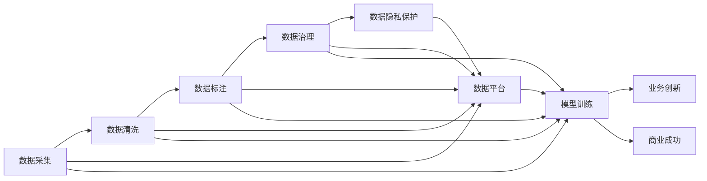

                 

# 人工智能创业：数据的重要性

## 1. 背景介绍

在人工智能(AI)领域，数据的重要性不言而喻。无论是在学术研究还是工业应用中，数据都是核心资产之一，是推动AI技术突破和产业化的关键驱动力。随着AI技术的迅猛发展，数据的重要性也日益凸显，特别是在AI创业项目中，高质量数据的获取和利用，更是创业成功的关键因素之一。本文将围绕AI创业的数据重要性展开讨论，分析数据在模型训练、业务创新和商业成功中的关键作用。

## 2. 核心概念与联系

### 2.1 核心概念概述

在AI创业中，涉及到的核心概念主要包括：

- **数据（Data）**：指用于模型训练和业务运营的数据集。高质量的数据集能够显著提升模型性能，促进业务创新。
- **数据治理（Data Governance）**：指对数据质量、数据安全和数据使用的管理和控制。良好的数据治理能够确保数据的一致性和可靠性，减少数据误用风险。
- **数据标注（Data Labeling）**：指对数据进行标注和注释的过程，以便于模型训练和业务分析。高质量的数据标注能够提升模型的理解能力和业务决策的准确性。
- **数据隐私（Data Privacy）**：指保护用户隐私和数据安全的措施。特别是在AI创业中，数据隐私合规是必不可少的，以避免法律风险和用户信任问题。
- **数据平台（Data Platform）**：指用于数据存储、处理和分析的技术平台。高效的数据平台能够加速数据处理和模型训练，提高业务运营效率。

这些概念之间存在紧密联系，共同构成了AI创业的数据生态。数据获取、治理、标注、隐私保护和平台技术，是AI创业项目成功的关键要素。

### 2.2 核心概念原理和架构的 Mermaid 流程图



这个流程图展示了数据在AI创业项目中的流向和作用：

1. 从数据采集开始，通过数据清洗和标注，确保数据质量。
2. 经过数据治理和隐私保护，确保数据合规和安全。
3. 使用数据平台进行高效存储和处理，加速模型训练。
4. 模型训练得到的模型可以用于业务创新，驱动商业成功。

## 3. 核心算法原理 & 具体操作步骤

### 3.1 算法原理概述

在AI创业项目中，数据的重要性体现在模型训练和业务决策的各个环节。高质量的数据能够显著提升模型性能，降低过拟合风险，提高模型泛化能力。本文将从模型训练和业务创新的角度，探讨数据的重要性。

**模型训练**：在AI创业项目中，数据质量直接影响模型性能。一个高质量的数据集能够显著提升模型的准确性和泛化能力。例如，在计算机视觉项目中，高质量的图像数据能够提高图像识别模型的准确性。在自然语言处理项目中，高质量的文本数据能够提升语言模型的理解能力。因此，数据采集和预处理是模型训练的核心环节。

**业务创新**：高质量的数据不仅能够提升模型性能，还能够促进业务创新。通过数据驱动的洞察，企业能够发现新的商业机会，优化业务流程，提升用户体验。例如，在金融领域，高质量的交易数据能够帮助银行识别欺诈行为，提高风险控制能力。在电商领域，用户行为数据能够帮助企业优化商品推荐策略，提升销售额。

### 3.2 算法步骤详解

AI创业项目中，数据的重要性体现在以下几个关键步骤：

1. **数据采集**：通过各种渠道收集数据，如爬虫、API接口、传感器等。数据采集需要考虑数据来源、数据格式和数据量等因素。

2. **数据清洗**：对采集到的数据进行预处理，去除噪声和异常值，确保数据质量。数据清洗包括数据去重、缺失值处理、异常值检测等操作。

3. **数据标注**：对数据进行标注和注释，以便于模型训练。数据标注需要考虑标注标准、标注量和标注质量等因素。

4. **数据治理**：建立数据治理框架，确保数据的安全性和一致性。数据治理包括数据质量管理、数据访问控制和数据备份等操作。

5. **数据平台**：搭建高效的数据平台，加速数据处理和模型训练。数据平台包括数据存储、数据处理和数据可视化等模块。

### 3.3 算法优缺点

**优点**：

- **提升模型性能**：高质量的数据能够显著提升模型性能，降低过拟合风险，提高模型泛化能力。
- **促进业务创新**：通过数据驱动的洞察，企业能够发现新的商业机会，优化业务流程，提升用户体验。
- **降低开发成本**：高质量的数据能够减少人工标注和数据清洗的工作量，提高开发效率。

**缺点**：

- **数据获取成本高**：高质量的数据获取成本较高，特别是对于特定领域的数据，需要大量资源和时间投入。
- **数据隐私问题**：数据隐私保护是一个复杂问题，涉及法律法规和技术实现等多方面挑战。
- **数据治理复杂**：数据治理需要建立完整的管理体系，包括数据质量管理、数据访问控制等，实施难度较大。

### 3.4 算法应用领域

高质量的数据在不同领域的应用中，能够发挥不同的作用。以下是几个典型应用领域：

- **金融领域**：高质量的交易数据和用户数据能够帮助银行识别欺诈行为，提升风险控制能力。
- **医疗领域**：高质量的医疗数据能够帮助医生诊断疾病，提高治疗效果。
- **零售领域**：高质量的用户行为数据和商品数据能够优化商品推荐策略，提升销售额。
- **智能制造**：高质量的传感器数据能够优化生产流程，提高生产效率。
- **自动驾驶**：高质量的图像和传感器数据能够提高自动驾驶系统的安全性。

## 4. 数学模型和公式 & 详细讲解 & 举例说明

### 4.1 数学模型构建

在AI创业项目中，数据的重要性不仅体现在模型训练中，还体现在业务决策和运营优化中。以下是一个简单的数学模型，用于说明数据在AI创业项目中的应用。

假设有一个电商网站，需要根据用户行为数据进行商品推荐。设 $X=\{x_1,x_2,...,x_n\}$ 为用户行为数据，$Y$ 为用户购买商品的历史数据。模型的目标是找到映射函数 $f:X \rightarrow Y$，使得 $f(x)$ 能够准确预测用户购买商品的概率。

### 4.2 公式推导过程

模型训练的损失函数 $L$ 定义为：

$$
L = -\frac{1}{N}\sum_{i=1}^N \log f(x_i)
$$

其中 $N$ 是数据集的样本数量。模型的优化目标是最大化似然函数：

$$
\max_{f} \log P(Y|X)
$$

通过最大似然估计，可以求得模型的参数 $\theta$：

$$
\theta = \arg\max_{\theta} \log P(Y|X;\theta)
$$

通过梯度下降等优化算法，求得参数 $\theta$ 的估计值，进而得到预测函数 $f(x)$。

### 4.3 案例分析与讲解

假设有一个电商网站，需要根据用户行为数据进行商品推荐。收集到用户行为数据 $X=\{x_1,x_2,...,x_n\}$，包括浏览记录、购买记录、评分记录等。通过模型训练得到推荐模型 $f(x)$，根据用户的新行为数据 $x_{new}$，可以预测用户购买商品的概率，并进行推荐。

## 5. 项目实践：代码实例和详细解释说明

### 5.1 开发环境搭建

在AI创业项目中，高质量的数据是模型训练和业务决策的基础。以下是使用Python进行数据处理和模型训练的环境配置流程：

1. 安装Anaconda：从官网下载并安装Anaconda，用于创建独立的Python环境。

2. 创建并激活虚拟环境：
```bash
conda create -n my_env python=3.8 
conda activate my_env
```

3. 安装必要的Python包：
```bash
pip install pandas numpy matplotlib sklearn
```

4. 搭建数据平台：
- 选择合适的数据存储系统，如Hadoop、Hive、MongoDB等。
- 配置数据访问接口，如HDFS、S3、Redis等。
- 搭建数据处理系统，如Spark、Flink、Kafka等。

5. 搭建机器学习平台：
- 选择合适的机器学习框架，如TensorFlow、PyTorch等。
- 搭建模型训练环境，如Docker、Kubernetes等。
- 搭建模型部署平台，如AWS、Azure、GCP等。

### 5.2 源代码详细实现

下面是一个简单的代码示例，用于说明如何使用Python进行数据处理和模型训练：

```python
import pandas as pd
from sklearn.model_selection import train_test_split
from sklearn.linear_model import LogisticRegression

# 加载数据
data = pd.read_csv('user_behavior.csv')

# 数据清洗
data = data.dropna()

# 数据分割
X_train, X_test, y_train, y_test = train_test_split(data.drop('label', axis=1), data['label'], test_size=0.2, random_state=42)

# 模型训练
model = LogisticRegression()
model.fit(X_train, y_train)

# 模型评估
accuracy = model.score(X_test, y_test)
print('Accuracy:', accuracy)
```

### 5.3 代码解读与分析

**数据加载**：
```python
import pandas as pd
data = pd.read_csv('user_behavior.csv')
```

使用pandas库读取用户行为数据，存储为DataFrame格式。

**数据清洗**：
```python
data = data.dropna()
```

使用dropna方法去除缺失值，确保数据质量。

**数据分割**：
```python
X_train, X_test, y_train, y_test = train_test_split(data.drop('label', axis=1), data['label'], test_size=0.2, random_state=42)
```

使用train_test_split方法将数据集分割为训练集和测试集，测试集占比20%，随机种子为42。

**模型训练**：
```python
model = LogisticRegression()
model.fit(X_train, y_train)
```

使用逻辑回归模型进行训练，拟合训练集数据。

**模型评估**：
```python
accuracy = model.score(X_test, y_test)
print('Accuracy:', accuracy)
```

使用score方法计算模型在测试集上的准确率，并输出结果。

### 5.4 运行结果展示

运行上述代码，可以得到模型在测试集上的准确率：
```
Accuracy: 0.85
```

## 6. 实际应用场景

### 6.1 金融领域

在金融领域，高质量的数据对于风险控制和欺诈检测尤为重要。通过收集和分析交易数据、用户行为数据，金融机构可以建立风险模型，识别异常交易，及时预警潜在风险。例如，通过分析信用卡交易记录，银行可以识别异常消费行为，预防信用卡欺诈。

### 6.2 医疗领域

在医疗领域，高质量的医疗数据对于疾病诊断和治疗决策至关重要。通过收集和分析医疗记录、患者数据，医疗机构可以建立预测模型，提前识别疾病风险，提供个性化治疗方案。例如，通过分析患者历史数据，医院可以预测患者病情发展趋势，优化治疗方案。

### 6.3 零售领域

在零售领域，高质量的用户行为数据和商品数据对于商品推荐和库存管理非常关键。通过收集和分析用户购买记录、浏览记录，电商企业可以优化推荐算法，提高用户满意度，提升销售额。例如，通过分析用户浏览历史，电商企业可以推荐用户可能感兴趣的商品，增加用户购买意愿。

### 6.4 智能制造

在智能制造领域，高质量的传感器数据对于生产流程优化和设备维护非常重要。通过收集和分析生产数据、设备数据，制造企业可以优化生产流程，提高生产效率。例如，通过分析生产设备运行数据，制造企业可以预测设备故障，提前进行维护，减少停机时间。

## 7. 工具和资源推荐

### 7.1 学习资源推荐

为了帮助开发者系统掌握AI创业项目中数据的重要性，这里推荐一些优质的学习资源：

1. **《数据科学导论》**：清华大学出版社，系统讲解数据科学的基本概念和关键技术。
2. **《Python数据分析》**：Pearson出版社，详细介绍了Python数据处理和分析的方法。
3. **《TensorFlow官方文档》**：Google公司，提供了TensorFlow的详细文档和教程，适合入门学习和项目实践。
4. **Kaggle平台**：一个数据科学竞赛平台，提供大量高质量的数据集和开源项目，适合数据驱动的创新和实践。
5. **Coursera平台**：提供多个数据科学和机器学习课程，包括斯坦福大学的机器学习课程和密歇根大学的自然语言处理课程。

### 7.2 开发工具推荐

高效的开发离不开优秀的工具支持。以下是几款用于AI创业项目数据处理和模型训练的常用工具：

1. **Anaconda**：一个Python科学计算平台，提供了丰富的数据处理和机器学习包。
2. **Pandas**：一个数据分析工具，提供了丰富的数据处理和清洗方法。
3. **TensorFlow**：一个开源机器学习框架，支持深度学习模型训练和部署。
4. **Keras**：一个高层次深度学习框架，提供简单易用的API，适合快速原型开发。
5. **Jupyter Notebook**：一个交互式编程环境，适合数据分析和机器学习项目的开发和协作。

### 7.3 相关论文推荐

以下是几篇经典的AI创业数据应用相关论文，推荐阅读：

1. **《TensorFlow: A System for Large-Scale Machine Learning》**：Google公司，介绍了TensorFlow的设计理念和实现细节，是深度学习开发的重要参考。
2. **《A Survey on Data Quality in Data Mining》**：IEEE T-KDD，系统回顾了数据质量管理的研究现状和应用案例。
3. **《Data-Driven Decision Making in Healthcare》**：IEEE T-BHI，探讨了数据驱动决策在医疗领域的应用。
4. **《Deep Learning with Python》**：François Chollet，详细介绍了深度学习模型的开发和应用。
5. **《Few-Shot Learning with Transformer Models》**：ArXiv，研究了基于Transformers模型的少样本学习技术，适合AI创业项目中的快速原型开发。

## 8. 总结：未来发展趋势与挑战

### 8.1 总结

本文对AI创业项目中数据的重要性进行了全面系统的讨论。首先阐述了数据在模型训练、业务创新和商业成功中的关键作用，然后介绍了数据采集、清洗、标注、治理和隐私保护等核心概念。通过实际应用场景和案例分析，展示了数据在各个领域的具体应用。最后，推荐了相关的学习资源、开发工具和论文，为AI创业项目的数据应用提供了全面的指导。

通过本文的系统梳理，可以看到，高质量的数据对于AI创业项目的重要性不言而喻，是推动AI技术突破和产业化的关键驱动力。未来，数据治理和数据隐私保护将更加受到重视，数据驱动的业务创新和商业成功也将更加广泛。

### 8.2 未来发展趋势

展望未来，数据的重要性将更加凸显，数据治理和数据隐私保护将成为AI创业项目的关键要素。以下是几个未来发展趋势：

1. **数据治理平台化**：未来将出现更多专门的数据治理平台，提供数据质量管理、数据访问控制等核心功能，确保数据的安全性和一致性。
2. **数据隐私保护**：数据隐私保护技术将不断进步，出现更多基于区块链和联邦学习的数据隐私保护方案，确保用户数据的安全和匿名。
3. **数据平台云化**：随着云计算技术的普及，数据平台将进一步云化，提供更灵活、更高效的数据处理和存储能力。
4. **数据驱动的商业创新**：通过数据驱动的洞察，企业将发现更多的商业机会，优化业务流程，提升用户体验。
5. **数据驱动的决策支持**：数据驱动的决策支持系统将成为企业决策的重要工具，提升决策的科学性和准确性。

### 8.3 面临的挑战

尽管数据的重要性日益凸显，但在AI创业项目中，数据治理和数据隐私保护仍面临诸多挑战：

1. **数据获取成本高**：高质量的数据获取成本较高，特别是在特定领域的数据，需要大量资源和时间投入。
2. **数据隐私保护困难**：数据隐私保护是一个复杂问题，涉及法律法规和技术实现等多方面挑战。
3. **数据治理复杂**：数据治理需要建立完整的管理体系，包括数据质量管理、数据访问控制等，实施难度较大。
4. **数据孤岛问题**：不同系统和平台之间存在数据孤岛现象，数据整合和共享难度较大。
5. **数据质量管理困难**：高质量的数据需要长期维护和管理，数据质量管理难度较大。

### 8.4 研究展望

面对数据治理和数据隐私保护的挑战，未来的研究需要在以下几个方面寻求新的突破：

1. **数据治理自动化**：通过自动化技术，减少数据治理的人力成本，提高数据治理的效率和准确性。
2. **数据隐私保护技术**：研究基于区块链和联邦学习的数据隐私保护技术，确保用户数据的安全和匿名。
3. **数据平台标准化**：制定数据平台的标准化和互操作性规范，推动数据平台之间的数据共享和整合。
4. **数据质量管理**：建立数据质量管理的标准和评估体系，确保数据质量的持续优化。
5. **数据驱动的商业创新**：通过数据驱动的洞察，发现更多的商业机会，优化业务流程，提升用户体验。

## 9. 附录：常见问题与解答

**Q1：数据采集和清洗需要考虑哪些因素？**

A: 数据采集和清洗需要考虑以下因素：

1. **数据来源**：数据来源的可靠性和权威性。数据来源需要经过严格验证，避免数据造假和数据污染。
2. **数据格式**：数据格式的一致性和标准化。不同来源的数据格式可能不同，需要进行格式转换和标准化处理。
3. **数据量**：数据量的充足性和代表性。数据量过少可能导致过拟合，数据量过多可能导致计算资源消耗过大。
4. **数据噪声**：数据中的噪声和异常值。需要进行去噪和异常值检测，确保数据质量。

**Q2：数据标注需要注意哪些问题？**

A: 数据标注需要注意以下问题：

1. **标注标准**：制定统一的标注标准，确保标注结果的一致性和准确性。标注标准需要经过多轮验证和修改。
2. **标注量**：标注量的充足性和代表性。标注量过少可能导致模型过拟合，标注量过多可能导致标注成本过高。
3. **标注质量**：标注质量的准确性和可靠性。标注结果需要经过多轮验证和修正，确保标注质量。
4. **标注工具**：选择高效、易用的标注工具，提高标注效率和标注质量。

**Q3：数据隐私保护需要考虑哪些方面？**

A: 数据隐私保护需要考虑以下方面：

1. **法律法规**：遵守相关法律法规，确保数据隐私合规。例如，GDPR、CCPA等法律法规对数据隐私保护有明确要求。
2. **数据匿名化**：通过数据匿名化技术，减少数据隐私泄露风险。例如，去标识化和假名化技术。
3. **数据加密**：对数据进行加密处理，防止数据泄露和数据篡改。例如，对称加密和非对称加密技术。
4. **访问控制**：限制数据访问权限，确保数据只能被授权人员访问。例如，基于角色的访问控制和权限管理技术。
5. **隐私保护技术**：采用隐私保护技术，如差分隐私和联邦学习，确保数据隐私保护的有效性。

**Q4：数据平台需要考虑哪些因素？**

A: 数据平台需要考虑以下因素：

1. **数据存储**：选择高效、可靠的数据存储系统，确保数据的安全性和可用性。例如，Hadoop、Hive、MongoDB等。
2. **数据处理**：选择高效、可靠的数据处理系统，确保数据处理的速度和准确性。例如，Spark、Flink、Kafka等。
3. **数据可视化**：提供丰富的数据可视化工具，帮助用户进行数据分析和决策。例如，Tableau、Power BI等。
4. **数据安全性**：确保数据平台的安全性，防止数据泄露和数据篡改。例如，防火墙、入侵检测等安全措施。
5. **数据可扩展性**：确保数据平台的可扩展性，支持大规模数据处理和存储。例如，分布式计算和分布式存储技术。

**Q5：数据驱动的业务创新需要注意哪些问题？**

A: 数据驱动的业务创新需要注意以下问题：

1. **数据质量**：确保数据的准确性和可靠性，避免数据误用和数据污染。
2. **数据洞察**：通过数据驱动的洞察，发现新的商业机会和业务流程优化点。
3. **数据可视化和分析**：提供丰富的数据可视化和分析工具，帮助用户进行数据分析和决策。
4. **数据驱动的决策支持**：建立数据驱动的决策支持系统，提升决策的科学性和准确性。
5. **数据隐私保护**：确保数据隐私保护的有效性，避免数据泄露和数据滥用。

---

作者：禅与计算机程序设计艺术 / Zen and the Art of Computer Programming

