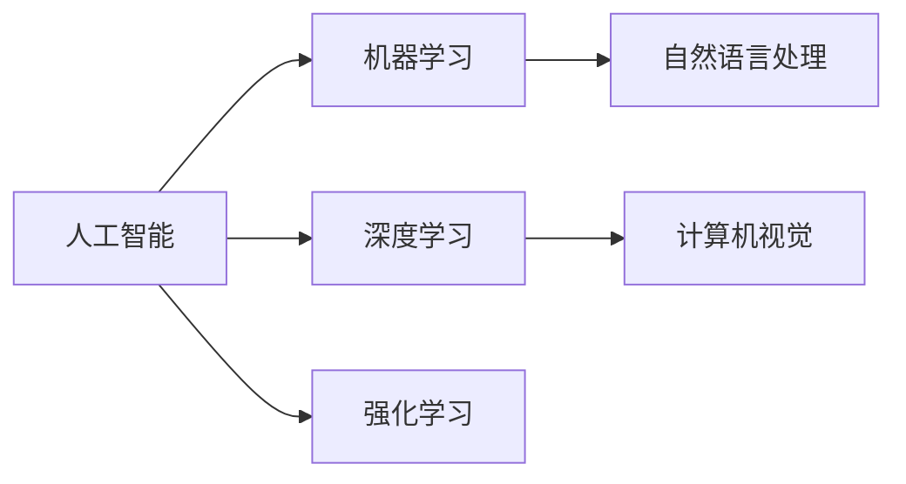

                 

# 人工智能原理与代码实例讲解

## 1. 背景介绍

### 1.1 问题由来
人工智能（AI）作为当前最热门的前沿科技，不仅在学术界和工业界得到了广泛的应用，还在日常生活中产生了深远的影响。从机器视觉、自然语言处理（NLP）到自动驾驶、智能推荐，AI的触角已经延伸到各个领域。然而，尽管AI技术日益成熟，但如何将复杂的技术转化为易于理解和应用的代码实例，一直是学术界和工业界共同面对的难题。

### 1.2 问题核心关键点
本文聚焦于AI原理的深入解析及其在代码实例中的应用。通过展示一系列详尽的算法原理和实际代码，读者可以更深入地理解AI技术，掌握关键算法和工具，并能够将之应用于具体的项目实践中。

### 1.3 问题研究意义
本文旨在为读者提供全面、系统的AI原理介绍和代码实例讲解，帮助其掌握AI核心概念，理解算法原理，并能灵活运用AI技术解决实际问题。这不仅有助于提升个人技术能力，也为推动AI技术的普及和发展提供了助力。

## 2. 核心概念与联系

### 2.1 核心概念概述

为了更好地理解AI的核心原理及其应用，本节将介绍几个关键概念：

- **人工智能（AI）**：通过模拟人类智能行为，使得机器能够执行复杂任务的技术。
- **机器学习（ML）**：一种数据驱动的学习方法，使机器能够从数据中学习规律，并进行预测或决策。
- **深度学习（DL）**：一种基于神经网络的机器学习技术，能够处理高度复杂的非线性关系。
- **计算机视觉（CV）**：通过计算机理解视觉信息，并进行图像处理和分析的技术。
- **自然语言处理（NLP）**：使计算机能够理解、生成和处理人类语言的技术。
- **强化学习（RL）**：通过试错机制，使智能体在环境中学习最佳行为策略的方法。

这些概念之间通过以下Mermaid流程图展示它们的内在联系：



## 3. 核心算法原理 & 具体操作步骤
### 3.1 算法原理概述

AI的核心在于算法，而算法原理是理解AI的关键。本节将深入探讨几种重要的AI算法原理。

#### 3.1.1 机器学习基础
机器学习通过训练数据模型，使得机器能够进行预测或分类。常用的机器学习算法包括决策树、支持向量机（SVM）、随机森林等。

#### 3.1.2 深度学习基础
深度学习通过多层神经网络，能够处理复杂的非线性关系。常用的深度学习算法包括卷积神经网络（CNN）、循环神经网络（RNN）、生成对抗网络（GAN）等。

#### 3.1.3 强化学习基础
强化学习通过智能体在环境中的试错学习，以最大化奖励为目标。常用的强化学习算法包括Q-learning、SARSA、深度Q网络（DQN）等。

### 3.2 算法步骤详解

AI算法的实施步骤通常包括数据准备、模型选择、模型训练、模型评估和模型部署。下面将详细介绍这些步骤。

#### 3.2.1 数据准备
- 收集和清洗数据：选择合适的数据集，并进行预处理，去除噪声和异常值。
- 数据划分：将数据集划分为训练集、验证集和测试集，用于模型训练、调参和评估。

#### 3.2.2 模型选择
- 选择合适的算法：根据任务特点和数据类型，选择适合的机器学习、深度学习或强化学习算法。
- 设定模型参数：确定模型的超参数，如学习率、批量大小等。

#### 3.2.3 模型训练
- 训练算法：使用训练数据对模型进行训练，不断调整模型参数以最小化损失函数。
- 验证集验证：在验证集上评估模型性能，避免过拟合。

#### 3.2.4 模型评估
- 测试集评估：使用测试集评估模型性能，确保模型泛化能力强。
- 模型调优：根据评估结果调整模型参数，提升模型性能。

#### 3.2.5 模型部署
- 模型保存：将训练好的模型保存为可部署的格式，如TensorFlow SavedModel或PyTorch模型文件。
- 模型部署：将模型部署到服务器或移动设备，进行实时预测。

### 3.3 算法优缺点

#### 3.3.1 机器学习
- 优点：模型解释性强，适用于多种任务，需要数据量较小。
- 缺点：对特征工程依赖较大，可能存在欠拟合或过拟合风险。

#### 3.3.2 深度学习
- 优点：能够处理复杂数据，自动提取特征，泛化能力强。
- 缺点：模型复杂，训练时间长，计算资源需求大。

#### 3.3.3 强化学习
- 优点：适用于动态环境和复杂决策，具有自适应能力。
- 缺点：需要大量试错，训练过程复杂，易陷入局部最优。

### 3.4 算法应用领域

AI算法广泛应用于多个领域，包括但不限于：

- **计算机视觉**：用于图像分类、目标检测、人脸识别等。
- **自然语言处理**：用于文本分类、情感分析、机器翻译等。
- **机器人**：用于路径规划、视觉避障、语音识别等。
- **自动驾驶**：用于车辆定位、环境感知、决策规划等。

## 4. 数学模型和公式 & 详细讲解 & 举例说明

### 4.1 数学模型构建

本节将详细构建几个典型的AI数学模型。

#### 4.1.1 线性回归模型
线性回归模型通过拟合数据线性关系，进行回归预测。数学公式如下：

$$
\min_{\theta} \sum_{i=1}^{n} (y_i - \theta_0 - \sum_{j=1}^{m} x_{ij}\theta_j)^2
$$

其中，$\theta = [\theta_0, \theta_1, \ldots, \theta_m]^T$ 为模型参数，$y_i$ 为实际值，$x_{ij}$ 为特征值。

#### 4.1.2 卷积神经网络（CNN）
CNN通过卷积层和池化层，提取图像特征，并进行分类。以卷积层为例，其公式如下：

$$
y_{ij} = \sigma(\sum_{k} w_{ik} * x_{jk} + b_i)
$$

其中，$x_{jk}$ 为输入特征，$w_{ik}$ 为卷积核权重，$b_i$ 为偏置项，$\sigma$ 为激活函数。

#### 4.1.3 长短期记忆网络（LSTM）
LSTM通过门控机制，处理时间序列数据，进行预测。其公式如下：

$$
i_t = \sigma(W_i x_t + U_i h_{t-1} + b_i)
$$

$$
f_t = \sigma(W_f x_t + U_f h_{t-1} + b_f)
$$

$$
o_t = \sigma(W_o x_t + U_o h_{t-1} + b_o)
$$

$$
c_t = f_t * c_{t-1} + i_t * \tanh(W_c x_t + U_c h_{t-1} + b_c)
$$

$$
h_t = o_t * \tanh(c_t)
$$

其中，$i_t$、$f_t$、$o_t$ 为门控单元，$c_t$ 为记忆单元，$h_t$ 为输出。

### 4.2 公式推导过程

#### 4.2.1 线性回归模型推导
线性回归模型通过最小二乘法，求解模型参数 $\theta$。其推导过程如下：

$$
\theta = (X^T X)^{-1} X^T y
$$

其中，$X$ 为特征矩阵，$y$ 为输出向量。

#### 4.2.2 CNN推导
CNN通过卷积和池化操作，提取图像特征。以卷积层为例，其推导过程如下：

$$
y_{ij} = \sum_{k} w_{ik} * x_{jk} + b_i
$$

其中，$*$ 为卷积操作，$w_{ik}$ 为卷积核权重，$b_i$ 为偏置项。

#### 4.2.3 LSTM推导
LSTM通过门控机制，处理时间序列数据。其推导过程如下：

$$
i_t = \sigma(W_i x_t + U_i h_{t-1} + b_i)
$$

$$
f_t = \sigma(W_f x_t + U_f h_{t-1} + b_f)
$$

$$
o_t = \sigma(W_o x_t + U_o h_{t-1} + b_o)
$$

$$
c_t = f_t * c_{t-1} + i_t * \tanh(W_c x_t + U_c h_{t-1} + b_c)
$$

$$
h_t = o_t * \tanh(c_t)
$$

其中，$\sigma$ 为激活函数，$* \times$ 为元素乘积。

### 4.3 案例分析与讲解

#### 4.3.1 线性回归应用
通过线性回归模型，预测房价。数据集为 Boston Housing 数据集，包含 506 个样本，13 个特征，目标为房价。

#### 4.3.2 CNN应用
通过 CNN，识别手写数字图像。数据集为 MNIST 数据集，包含 60000 个训练样本，10000 个测试样本，每个样本为28x28 像素的灰度图像。

#### 4.3.3 LSTM应用
通过 LSTM，预测股票价格。数据集为 1970 年到 2017 年间的道琼斯工业平均指数，每周开盘价、最高价、最低价、收盘价为输入，目标为下一周的收盘价。

## 5. 项目实践：代码实例和详细解释说明

### 5.1 开发环境搭建

为了编写和运行AI代码，需要安装一些必要的软件环境。以下是搭建Python开发环境的详细步骤：

#### 5.1.1 安装Python
- 下载Python安装包，根据操作系统进行安装。
- 配置环境变量，使系统能够找到Python安装目录。

#### 5.1.2 安装相关库
- 使用pip安装Python依赖库，如NumPy、Pandas、Scikit-learn、TensorFlow、PyTorch等。
- 安装图形界面库，如Matplotlib、Seaborn、Jupyter Notebook等。

### 5.2 源代码详细实现

下面以线性回归模型为例，展示Python代码实现。

```python
import numpy as np
from sklearn.linear_model import LinearRegression

# 构建数据集
X = np.array([[1, 2, 3], [4, 5, 6], [7, 8, 9], [10, 11, 12]])
y = np.array([2, 4, 6, 8])

# 创建线性回归模型
model = LinearRegression()

# 训练模型
model.fit(X, y)

# 预测新数据
X_new = np.array([[13, 14, 15]])
y_new = model.predict(X_new)

print("预测结果：", y_new)
```

### 5.3 代码解读与分析

#### 5.3.1 数据准备
首先，使用NumPy构建数据集，其中X为特征矩阵，y为目标向量。

#### 5.3.2 模型创建
创建LinearRegression模型对象，准备进行训练。

#### 5.3.3 模型训练
使用fit方法，对模型进行训练。该方法通过最小化损失函数，求解模型参数。

#### 5.3.4 模型预测
使用predict方法，对新数据进行预测。该方法根据训练好的模型，计算预测结果。

## 6. 实际应用场景

### 6.1 智能推荐系统

智能推荐系统通过分析用户行为数据，预测用户可能感兴趣的商品或内容，并进行个性化推荐。通过机器学习算法，如协同过滤、内容推荐、深度学习等，可以构建高效的推荐系统。

#### 6.1.1 协同过滤
协同过滤通过分析用户和商品之间的交互行为，进行相似性匹配，找到与用户偏好相似的用户或商品，进行推荐。其公式如下：

$$
\text{similarity}(u_i, j) = \frac{1}{(1 + \sqrt{\text{bias}(u_i) + \text{bias}(j)})^2}
$$

其中，$u_i$ 和 $j$ 为用户和商品，bias 为相似性偏差。

#### 6.1.2 内容推荐
内容推荐通过分析商品属性，找到与用户兴趣匹配的商品，进行推荐。其公式如下：

$$
\text{recommendation}(i) = \sum_{j=1}^{m} \text{rating}(i,j) * \text{feature}(j)
$$

其中，$i$ 为商品，$j$ 为商品属性，rating 为评分，feature 为特征。

#### 6.1.3 深度学习推荐
深度学习推荐通过多层神经网络，提取用户和商品的特征，进行推荐。其公式如下：

$$
\text{recommendation}(i) = \sum_{j=1}^{m} \text{score}(i,j) * \text{feature}(j)
$$

其中，$i$ 为商品，$j$ 为商品属性，score 为评分，feature 为特征。

### 6.2 语音识别系统

语音识别系统通过将语音信号转换为文本，实现人机交互。通过深度学习算法，如卷积神经网络、循环神经网络等，可以构建高效的语音识别系统。

#### 6.2.1 卷积神经网络
卷积神经网络通过提取音频信号的特征，进行语音识别。其公式如下：

$$
\text{feature} = \sum_{i=1}^{n} \text{filter}_i * \text{signal}_i + \text{bias}
$$

其中，$filter$ 为卷积核，$signal$ 为音频信号，bias 为偏置项。

#### 6.2.2 循环神经网络
循环神经网络通过记忆过去信息，进行语音识别。其公式如下：

$$
\text{hidden}_t = \sigma(W_i x_t + U_i h_{t-1} + b_i)
$$

$$
\text{output}_t = \sigma(W_o x_t + U_o h_{t-1} + b_o)
$$

其中，$x_t$ 为输入，$h_{t-1}$ 为上一时刻的隐藏状态，$W$、$U$、$V$ 为权重矩阵，$b$ 为偏置项。

### 6.3 自然语言处理

自然语言处理通过分析人类语言，实现机器理解、生成和处理。通过深度学习算法，如长短时记忆网络（LSTM）、Transformer等，可以构建高效的自然语言处理系统。

#### 6.3.1 LSTM
LSTM通过门控机制，处理时间序列数据。其公式如下：

$$
i_t = \sigma(W_i x_t + U_i h_{t-1} + b_i)
$$

$$
f_t = \sigma(W_f x_t + U_f h_{t-1} + b_f)
$$

$$
o_t = \sigma(W_o x_t + U_o h_{t-1} + b_o)
$$

$$
c_t = f_t * c_{t-1} + i_t * \tanh(W_c x_t + U_c h_{t-1} + b_c)
$$

$$
h_t = o_t * \tanh(c_t)
$$

其中，$\sigma$ 为激活函数，$* \times$ 为元素乘积。

#### 6.3.2 Transformer
Transformer通过注意力机制，处理序列数据。其公式如下：

$$
\text{attention}(Q, K, V) = \text{softmax}(\frac{QK^T}{\sqrt{d}})
$$

$$
\text{output} = \sum_{i=1}^{n} \text{attention}(Q, K_i, V_i) * V_i
$$

其中，$Q$、$K$、$V$ 为查询、键、值向量，softmax 为softmax函数。

## 7. 工具和资源推荐

### 7.1 学习资源推荐

为了帮助读者深入理解AI原理，并掌握代码实现，推荐以下学习资源：

#### 7.1.1 Coursera《机器学习》课程
由斯坦福大学Andrew Ng教授主讲的机器学习课程，涵盖了机器学习基础、深度学习、强化学习等内容，适合初学者和进阶者。

#### 7.1.2 Udacity《深度学习专项课程》
Udacity的深度学习专项课程，由Google工程师主讲，涵盖卷积神经网络、循环神经网络、生成对抗网络等内容，适合深入学习。

#### 7.1.3 arXiv论文库
arXiv是全球最大的预印本服务器，包含大量AI领域的论文，适合研究前沿技术。

#### 7.1.4 TensorFlow官方文档
TensorFlow是Google开发的深度学习框架，其官方文档详细介绍了各种模型和算法，适合实战开发。

#### 7.1.5 PyTorch官方文档
PyTorch是Facebook开发的深度学习框架，其官方文档详细介绍了各种模型和算法，适合实战开发。

### 7.2 开发工具推荐

以下是几个常用的AI开发工具，推荐给读者：

#### 7.2.1 Jupyter Notebook
Jupyter Notebook是一个交互式编程环境，适合进行数据探索、模型训练、代码调试等。

#### 7.2.2 Anaconda
Anaconda是一个Python环境管理工具，方便安装和管理Python依赖库，适合进行大数据分析和AI开发。

#### 7.2.3 Google Colab
Google Colab是Google提供的免费Jupyter Notebook服务，支持GPU加速，适合进行大规模深度学习开发。

#### 7.2.4 TensorBoard
TensorBoard是TensorFlow配套的可视化工具，适合进行模型训练和推理结果的可视化。

#### 7.2.5 Keras
Keras是一个高层次的深度学习框架，适合快速开发和实验AI模型。

### 7.3 相关论文推荐

以下是几篇AI领域的经典论文，推荐给读者：

#### 7.3.1 AlexNet
AlexNet是ImageNet 2012大赛冠军，提出了卷积神经网络的结构，推动了计算机视觉的发展。

#### 7.3.2 LSTM
LSTM通过门控机制，处理时间序列数据，推动了自然语言处理的发展。

#### 7.3.3 GAN
GAN通过生成对抗网络，生成高质量的图像、音频、文本等内容，推动了生成对抗网络的发展。

## 8. 总结：未来发展趋势与挑战

### 8.1 总结

本文从AI原理入手，详细讲解了机器学习、深度学习、强化学习等核心算法，并通过代码实例，展示了这些算法的应用。通过本文的系统梳理，读者可以深入理解AI技术，掌握核心算法，并灵活应用于实际问题。

### 8.2 未来发展趋势

未来AI领域将呈现以下几个趋势：

#### 8.2.1 数据驱动的AI
随着数据量的不断增长，数据驱动的AI将变得更加重要。通过大数据分析，发现潜在的规律和模式，进行预测和决策。

#### 8.2.2 深度学习的多样化
深度学习算法将不断进化，出现更多的创新算法，如卷积神经网络、生成对抗网络、循环神经网络等。

#### 8.2.3 强化学习的普及
强化学习将在更多领域得到应用，如机器人、自动驾驶、游戏等领域，成为重要的AI技术之一。

#### 8.2.4 多模态AI的兴起
多模态AI通过融合视觉、听觉、触觉等多种信息，提高AI系统的感知和理解能力。

#### 8.2.5 联邦学习的应用
联邦学习通过分布式训练，保护用户隐私，提升AI模型的安全性。

### 8.3 面临的挑战

尽管AI技术取得了巨大进展，但在发展过程中也面临着一些挑战：

#### 8.3.1 数据质量问题
数据质量对AI模型的效果有重要影响，数据缺失、噪声等问题可能导致模型性能下降。

#### 8.3.2 模型复杂性
深度学习模型的复杂性导致训练时间长、计算资源需求大，如何提高模型效率是一个重要挑战。

#### 8.3.3 模型鲁棒性
AI模型在面对噪声、异常数据时，可能产生鲁棒性不足的问题，需要进行鲁棒性训练。

#### 8.3.4 模型可解释性
AI模型通常是"黑盒"系统，难以解释其内部工作机制，需要进行可解释性研究。

#### 8.3.5 模型安全性
AI模型可能存在安全隐患，需要进行安全性和伦理研究，确保其应用安全可靠。

### 8.4 研究展望

未来AI研究需要在以下几个方面进行突破：

#### 8.4.1 数据增强技术
数据增强技术通过扩充数据集，提高AI模型的泛化能力，解决数据质量问题。

#### 8.4.2 模型压缩技术
模型压缩技术通过减少模型参数和计算量，提高AI模型的效率，解决模型复杂性问题。

#### 8.4.3 鲁棒性训练技术
鲁棒性训练技术通过引入对抗样本、噪声等方法，提高AI模型的鲁棒性，解决模型鲁棒性问题。

#### 8.4.4 可解释性技术
可解释性技术通过生成解释性图表、文本等方式，提高AI模型的可解释性，解决模型可解释性问题。

#### 8.4.5 安全性技术
安全性技术通过数据脱敏、访问控制等方式，提高AI模型的安全性，解决模型安全性问题。

总之，AI技术正处于快速发展阶段，未来将有更多创新和突破。只有不断优化算法、提高数据质量、解决技术挑战，才能推动AI技术的发展，实现其广泛应用。

## 9. 附录：常见问题与解答

### 9.1 Q1：什么是深度学习？
A: 深度学习是一种基于神经网络的机器学习技术，能够处理复杂的非线性关系。常用的深度学习算法包括卷积神经网络（CNN）、循环神经网络（RNN）、生成对抗网络（GAN）等。

### 9.2 Q2：机器学习和深度学习的区别是什么？
A: 机器学习通过训练数据模型，进行预测或分类。深度学习通过多层神经网络，处理复杂数据，自动提取特征，泛化能力强。深度学习是机器学习的一种高级形式。

### 9.3 Q3：如何在Python中安装TensorFlow？
A: 在命令行中使用pip安装TensorFlow：`pip install tensorflow`。

### 9.4 Q4：如何使用TensorFlow进行图像分类？
A: 使用TensorFlow的Keras API，构建卷积神经网络模型，并进行训练和预测。

### 9.5 Q5：什么是强化学习？
A: 强化学习通过智能体在环境中的试错学习，以最大化奖励为目标。常用的强化学习算法包括Q-learning、SARSA、深度Q网络（DQN）等。

---

作者：禅与计算机程序设计艺术 / Zen and the Art of Computer Programming

