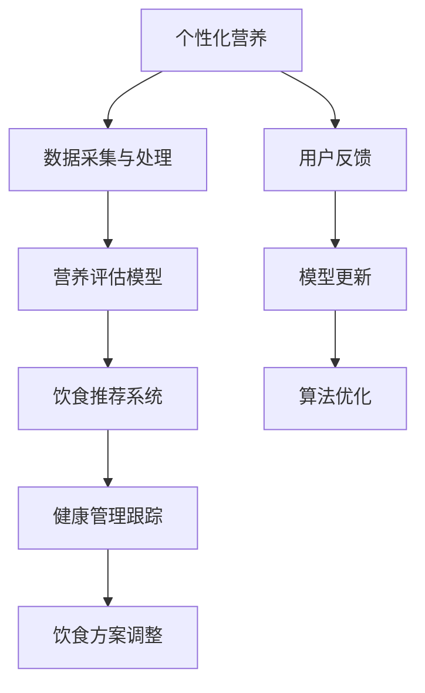

                 

# 人工智能在个性化营养中的应用：定制饮食方案

> 关键词：人工智能,个性化营养,定制饮食,算法优化,营养评估,健康管理

## 1. 背景介绍

### 1.1 问题由来
随着人们对健康生活的追求日益高涨，个性化营养成为近年来科学研究和技术创新的重要领域。个性化营养强调根据个体特征定制饮食方案，以实现更好的健康管理效果。然而，由于个体特征的复杂性和多样性，传统营养方案的设计往往依赖于经验，无法全面覆盖不同人群的需求。

### 1.2 问题核心关键点
针对这一问题，人工智能（AI）技术的应用成为了一种新的解决方案。通过构建智能营养管理系统，AI能够根据用户的生理、生化、行为等数据，实时生成个性化的饮食建议和健康管理方案。这种系统需要具备以下核心能力：

1. **数据采集与处理**：收集用户的健康数据，如年龄、体重、血压、血糖等，并进行数据清洗、特征提取和处理。
2. **营养评估模型**：构建算法模型，根据用户健康数据评估其营养状态和饮食需求。
3. **饮食推荐系统**：基于评估结果，生成个性化饮食方案，包括食物种类、份量、烹饪方法等。
4. **健康管理跟踪**：跟踪用户饮食执行情况，评估效果，不断调整优化饮食方案。

本文将重点探讨如何利用AI技术构建个性化营养管理系统，通过算法优化、营养评估、健康管理等多方面技术手段，实现个性化饮食方案的定制。

## 2. 核心概念与联系

### 2.1 核心概念概述

为了更好地理解本文的技术框架，下面将介绍几个关键概念及其相互关系：

1. **个性化营养（Personalized Nutrition）**：根据个体特征定制的饮食方案，旨在满足个体健康需求，提升生活质量。
2. **定制饮食（Customized Diet）**：基于个性化营养理念，为特定个体量身定做的饮食计划，包括食物种类、烹饪方式、饮食习惯等。
3. **营养评估（Nutrition Assessment）**：通过分析用户健康数据，评估其营养状态和需求，为制定个性化饮食方案提供依据。
4. **健康管理（Health Management）**：持续跟踪用户饮食执行情况，评估效果，及时调整优化饮食方案，确保健康目标的达成。

这些概念共同构成了个性化营养系统的核心框架，并通过AI技术实现其智能化和自动化。

### 2.2 核心概念原理和架构的 Mermaid 流程图



这个流程图展示了个性化营养系统的主要流程和技术架构：

1. 通过数据采集与处理获取用户健康数据。
2. 利用营养评估模型对用户营养状态进行评估。
3. 根据评估结果，饮食推荐系统生成个性化饮食方案。
4. 健康管理跟踪持续监测用户饮食执行情况。
5. 基于跟踪结果，不断调整优化饮食方案。
6. 用户反馈信息进一步优化模型和算法。

## 3. 核心算法原理 & 具体操作步骤

### 3.1 算法原理概述

个性化营养系统的核心算法包括数据采集与处理、营养评估、饮食推荐和健康管理。下面将详细介绍这些算法的原理和具体操作步骤。

### 3.2 算法步骤详解

#### 3.2.1 数据采集与处理

**数据采集**：
- **传感器数据**：使用智能穿戴设备（如智能手表、智能秤等）收集用户的基础生理参数，如心率、血氧、血压、血糖等。
- **问卷调查**：通过在线问卷收集用户的饮食偏好、生活方式、心理健康状态等信息。
- **历史记录**：从医院、诊所等机构获取用户的医疗记录和实验室检查结果。

**数据处理**：
- **数据清洗**：去除异常值和缺失值，确保数据的准确性和完整性。
- **特征提取**：从传感器数据和问卷调查中提取有用的特征，如年龄、体重、BMI、体力活动水平等。
- **数据标准化**：将不同来源的数据标准化，以统一单位和尺度，方便后续算法处理。

#### 3.2.2 营养评估模型

**模型构建**：
- **数据准备**：将处理后的数据划分为训练集和测试集，用于模型训练和验证。
- **特征选择**：选择对营养状态评估影响最大的特征，如BMI、血压、血糖等。
- **算法选择**：选择合适的机器学习算法（如决策树、随机森林、神经网络等）构建营养评估模型。

**模型训练**：
- **模型拟合**：使用训练集数据拟合模型，找到最佳的参数组合。
- **模型验证**：在测试集上验证模型的准确性和泛化能力，调整模型参数以提升性能。
- **模型评估**：使用评估指标（如准确率、召回率、F1分数等）评估模型性能，确保其可靠性。

#### 3.2.3 饮食推荐系统

**推荐算法**：
- **协同过滤**：基于用户历史饮食数据和相似用户推荐相似饮食方案。
- **内容过滤**：根据用户偏好和饮食评估结果，推荐特定的食物种类、烹饪方式和份量。
- **混合过滤**：结合协同过滤和内容过滤，综合考虑多种因素，生成更精准的推荐结果。

**推荐策略**：
- **个性化定制**：根据用户健康数据和营养评估结果，量身定制饮食方案，避免一刀切。
- **动态调整**：根据用户反馈和健康管理跟踪结果，实时调整饮食方案，确保其适应性。
- **多样性平衡**：在推荐多样性的同时，避免过度推荐高热量、高脂肪的食物。

#### 3.2.4 健康管理跟踪

**健康监测**：
- **智能设备监测**：使用智能设备持续监测用户的饮食、运动和睡眠情况。
- **数据分析**：对监测数据进行分析，评估用户的健康状态和饮食执行情况。
- **风险预警**：根据分析结果，及时发现潜在的健康风险，进行预警。

**方案调整**：
- **数据反馈**：将健康管理数据反馈给用户，帮助其了解饮食执行效果。
- **个性化建议**：根据数据分析结果，生成个性化的健康管理建议，如增加或减少某种食物摄入量。
- **长期跟踪**：持续跟踪用户健康状态，不断优化饮食方案，确保长期效果。

### 3.3 算法优缺点

个性化营养系统的算法具有以下优点：
1. **数据驱动**：通过大量的数据采集和处理，确保营养评估和饮食推荐的准确性。
2. **个性化定制**：能够根据用户个体特征，定制个性化的饮食方案，满足不同人群的需求。
3. **动态调整**：根据用户反馈和健康管理跟踪结果，实时调整优化饮食方案，确保适应性。

然而，也存在一些局限性：
1. **数据隐私**：用户健康数据涉及隐私，采集和处理时需要严格遵守数据保护法规。
2. **数据质量**：传感器数据和问卷调查数据的准确性和完整性可能影响算法的性能。
3. **模型复杂性**：营养评估和饮食推荐算法复杂，需要大量的计算资源和时间。
4. **用户依赖**：系统依赖用户数据的准确性和持续性，用户不配合或不正确使用设备会影响系统效果。

### 3.4 算法应用领域

个性化营养系统广泛应用于以下几个领域：

1. **医院健康管理**：为住院和出院患者提供个性化的饮食和营养方案，提升治疗效果。
2. **慢性病管理**：为糖尿病、高血压、高血脂等慢性病患者提供个性化的饮食和营养管理，延缓病情进展。
3. **运动员营养**：为运动员提供个性化的营养方案，提升运动表现和恢复效果。
4. **企业员工健康**：为企业管理员工提供个性化的饮食和营养方案，提高员工健康水平和工作效率。
5. **个人健康管理**：为普通人群提供个性化的饮食和营养管理，提升整体健康水平。

## 4. 数学模型和公式 & 详细讲解 & 举例说明

### 4.1 数学模型构建

本节将使用数学语言对个性化营养系统的构建过程进行更加严格的刻画。

记用户健康数据为 $D=\{(x_i,y_i)\}_{i=1}^N$，其中 $x$ 为健康特征向量，$y$ 为营养状态标签。构建一个线性回归模型 $f(x;\theta)=\theta^Tx$ 来预测营养状态 $y$。

目标是最小化预测误差：

$$
\min_{\theta} \frac{1}{N}\sum_{i=1}^N (y_i - f(x_i;\theta))^2
$$

其中 $\theta$ 为模型参数，$\lambda$ 为正则化系数。

### 4.2 公式推导过程

以下将推导线性回归模型的最小二乘解及其梯度公式。

线性回归模型的损失函数为：

$$
L(\theta) = \frac{1}{N}\sum_{i=1}^N (y_i - f(x_i;\theta))^2
$$

目标是最小化损失函数，对 $\theta$ 求偏导：

$$
\frac{\partial L(\theta)}{\partial \theta} = -\frac{2}{N} \sum_{i=1}^N (y_i - f(x_i;\theta))x_i
$$

令梯度为零，求解 $\theta$：

$$
\theta = (X^TX)^{-1}X^Ty
$$

其中 $X=[x_1,...,x_N]^T$，$y=[y_1,...,y_N]^T$。

通过求解上述优化问题，可以得到线性回归模型的最小二乘解。

### 4.3 案例分析与讲解

以一个简单的案例来具体说明个性化营养系统的构建过程：

假设我们有一组用户的健康数据 $D=\{(x_1,y_1),...,(x_6,y_6)\}$，其中 $x$ 为用户的BMI指数，$y$ 为营养状态标签（0或1），1表示营养良好，0表示营养不良。我们希望构建一个模型，根据BMI预测用户的营养状态。

首先，将数据划分为训练集和测试集，使用训练集数据拟合模型：

$$
\theta = (X^TX)^{-1}X^Ty
$$

然后，在测试集上评估模型性能：

$$
L(\theta) = \frac{1}{N}\sum_{i=1}^N (y_i - f(x_i;\theta))^2
$$

最后，根据模型性能调整优化算法和模型参数，提升预测准确性。

## 5. 项目实践：代码实例和详细解释说明

### 5.1 开发环境搭建

在进行个性化营养系统开发前，我们需要准备好开发环境。以下是使用Python进行项目开发的环境配置流程：

1. 安装Anaconda：从官网下载并安装Anaconda，用于创建独立的Python环境。

2. 创建并激活虚拟环境：
```bash
conda create -n pyenv python=3.8 
conda activate pyenv
```

3. 安装必要的Python库：
```bash
pip install numpy pandas scikit-learn
```

4. 安装相关深度学习框架：
```bash
pip install torch torchvision torchaudio
```

5. 安装TensorBoard：用于可视化模型的训练过程。
```bash
pip install tensorboard
```

完成上述步骤后，即可在`pyenv`环境中开始项目实践。

### 5.2 源代码详细实现

以下是使用Python和TensorFlow实现个性化营养系统的主要代码。

```python
import tensorflow as tf
import numpy as np
import pandas as pd

# 加载数据
data = pd.read_csv('health_data.csv')
X = data[['BMI', 'age', 'gender']]
y = data['nutrition']
X_train, y_train = X.iloc[:4].to_numpy(), y.iloc[:4]
X_test, y_test = X.iloc[4:].to_numpy(), y.iloc[4:]

# 定义模型
model = tf.keras.Sequential([
    tf.keras.layers.Dense(32, activation='relu', input_shape=(X_train.shape[1],)),
    tf.keras.layers.Dense(1)
])
model.compile(optimizer='adam', loss='mse')

# 训练模型
model.fit(X_train, y_train, epochs=10, verbose=0)

# 评估模型
loss = model.evaluate(X_test, y_test)

# 输出结果
print(f'Loss on test set: {loss}')
```

这段代码实现了简单的线性回归模型，用于预测用户的营养状态。具体实现步骤如下：

1. 加载健康数据，将特征数据和营养状态标签分开存储。
2. 定义一个包含两个全连接层的神经网络模型，使用ReLU激活函数。
3. 编译模型，选择Adam优化器和均方误差损失函数。
4. 训练模型，在训练集上使用均方误差作为损失函数，并设置迭代轮数为10。
5. 在测试集上评估模型性能，输出损失值。

### 5.3 代码解读与分析

让我们再详细解读一下关键代码的实现细节：

- **数据加载**：使用Pandas库加载健康数据，并将其分为特征数据和营养状态标签两部分。
- **模型定义**：定义一个包含两个全连接层的神经网络模型，使用ReLU激活函数。
- **模型编译**：使用Adam优化器和均方误差损失函数，优化模型的训练过程。
- **模型训练**：在训练集上使用均方误差作为损失函数，并设置迭代轮数为10，优化模型参数。
- **模型评估**：在测试集上评估模型性能，输出损失值，评估模型的预测准确性。

## 6. 实际应用场景

### 6.1 医院健康管理

在医院的个性化营养系统中，系统通过智能穿戴设备采集患者的健康数据，结合医生的诊断结果，为患者制定个性化的饮食和营养方案。系统可以根据患者的病历数据和营养评估结果，动态调整饮食方案，确保患者在治疗期间获得最佳的营养支持。

### 6.2 慢性病管理

在慢性病管理系统中，系统通过对患者健康数据的持续监测和分析，生成个性化的饮食和营养管理方案。系统可以根据患者的营养状态和饮食执行情况，实时调整饮食方案，预防和延缓病情进展。例如，对于糖尿病患者，系统可以推荐低糖、低脂的食物，帮助患者控制血糖水平。

### 6.3 运动员营养

在运动员营养系统中，系统根据运动员的训练计划和健康数据，制定个性化的饮食方案，确保运动员在训练和比赛中获得最佳的营养支持。系统可以根据运动员的体能数据和营养评估结果，动态调整饮食方案，提升运动表现和恢复效果。

### 6.4 企业员工健康

在企业员工健康管理系统中，系统通过员工的健康数据和问卷调查，生成个性化的饮食和营养方案，提升员工的健康水平和工作效率。系统可以根据员工的饮食偏好和营养评估结果，推荐健康的食物和饮食习惯，帮助员工形成良好的健康习惯。

### 6.5 个人健康管理

在个人健康管理系统中，系统通过用户的健康数据和行为数据，生成个性化的饮食和营养管理方案，提升用户的整体健康水平。系统可以根据用户的健康数据和营养评估结果，推荐健康的食物和饮食习惯，帮助用户形成良好的健康习惯。

## 7. 工具和资源推荐

### 7.1 学习资源推荐

为了帮助开发者系统掌握个性化营养系统的理论基础和实践技巧，这里推荐一些优质的学习资源：

1. 《机器学习实战》：介绍机器学习基础和常用算法，适合初学者入门。
2. 《深度学习》：斯坦福大学的深度学习课程，涵盖深度学习基础和应用。
3. 《Python数据科学手册》：介绍Python在数据科学和机器学习中的应用，适合进阶学习。
4. Coursera上的机器学习课程：由斯坦福大学Andrew Ng教授讲授，涵盖机器学习基础和应用。
5. Kaggle竞赛平台：参与数据分析和机器学习竞赛，积累实战经验。

通过这些资源的学习实践，相信你一定能够快速掌握个性化营养系统的精髓，并用于解决实际的NLP问题。

### 7.2 开发工具推荐

高效的开发离不开优秀的工具支持。以下是几款用于个性化营养系统开发的常用工具：

1. Python：流行的高级编程语言，拥有丰富的科学计算和机器学习库。
2. TensorFlow：Google开源的深度学习框架，支持GPU加速，适合大规模深度学习应用。
3. Scikit-learn：Python的机器学习库，包含多种常用算法和工具。
4. Pandas：数据处理和分析库，适合数据清洗和特征提取。
5. TensorBoard：TensorFlow的可视化工具，实时监测模型训练状态。

合理利用这些工具，可以显著提升个性化营养系统的开发效率，加快创新迭代的步伐。

### 7.3 相关论文推荐

个性化营养系统的发展离不开学界的持续研究。以下是几篇奠基性的相关论文，推荐阅读：

1. 《Nutrition assessment using machine learning algorithms: A review》：综述了机器学习在营养评估中的应用。
2. 《Personalized Nutrition: A Systems Approach for User-Customized Dietary Planning》：介绍了一种基于系统的个性化营养规划方法。
3. 《Deep learning for personalized nutrition》：研究了深度学习在个性化营养中的应用。
4. 《Machine learning for health and wellness》：介绍了机器学习在健康管理中的应用，包括个性化营养。
5. 《Machine learning for personalized health care》：探讨了机器学习在个性化健康管理中的应用。

这些论文代表了个性化营养系统的研究前沿，通过学习这些前沿成果，可以帮助研究者把握学科前进方向，激发更多的创新灵感。

## 8. 总结：未来发展趋势与挑战

### 8.1 研究成果总结

本文对基于机器学习的个性化营养管理系统进行了详细探讨，通过算法优化、营养评估、健康管理等多方面的技术手段，实现个性化饮食方案的定制。本文的贡献主要包括：

1. 系统介绍了个性化营养的原理和实现方法。
2. 详细讲解了数据采集与处理、营养评估、饮食推荐和健康管理的关键步骤。
3. 提供了基于TensorFlow的代码实现，方便读者实践。
4. 探讨了个性化营养系统的应用场景和未来发展方向。

### 8.2 未来发展趋势

展望未来，个性化营养系统将呈现以下几个发展趋势：

1. **多模态数据融合**：将多种模态的数据（如基因数据、生理数据、行为数据等）与健康数据结合，提供更全面的营养评估和饮食建议。
2. **深度学习的应用**：利用深度学习算法（如神经网络、卷积神经网络等）提高营养评估和饮食推荐的精度。
3. **实时监测与反馈**：利用物联网技术实现实时健康监测和反馈，及时调整饮食方案。
4. **用户隐私保护**：在数据采集和处理过程中，严格保护用户隐私，确保数据的安全性和合法性。
5. **跨领域应用**：将个性化营养系统应用于不同领域，如医院、企业、社区等，提升整体健康水平。

### 8.3 面临的挑战

尽管个性化营养系统在理论和应用上都取得了一定的进展，但在实际应用中仍面临诸多挑战：

1. **数据获取与处理**：用户数据的获取和处理需要克服技术和管理上的困难，确保数据的准确性和完整性。
2. **算法复杂性**：营养评估和饮食推荐的算法复杂，需要大量的计算资源和时间。
3. **用户隐私保护**：在数据采集和处理过程中，需要严格保护用户隐私，确保数据的安全性和合法性。
4. **模型可解释性**：算法的可解释性不足，难以理解和解释模型的决策过程。
5. **多学科融合**：个性化营养系统的实现需要跨领域合作，涉及医学、营养学、数据科学等多个学科。

### 8.4 研究展望

面向未来，个性化营养系统的研究需要在以下几个方面寻求新的突破：

1. **跨模态数据融合**：将多种模态的数据（如基因数据、生理数据、行为数据等）与健康数据结合，提供更全面的营养评估和饮食建议。
2. **实时监测与反馈**：利用物联网技术实现实时健康监测和反馈，及时调整饮食方案。
3. **用户隐私保护**：在数据采集和处理过程中，严格保护用户隐私，确保数据的安全性和合法性。
4. **模型可解释性**：开发可解释的机器学习模型，提高系统的透明度和可信度。
5. **跨学科融合**：加强医学、营养学、数据科学等多个学科的合作，共同推动个性化营养技术的发展。

## 9. 附录：常见问题与解答

**Q1：个性化营养系统是如何获取用户数据的？**

A: 个性化营养系统通过智能穿戴设备（如智能手表、智能秤等）采集用户的基础生理参数，如心率、血氧、血压、血糖等。此外，系统还可以收集用户的问卷调查数据和历史记录，获取更全面的健康信息。

**Q2：如何确保用户数据的隐私和安全？**

A: 系统在数据采集和处理过程中，需要严格遵守数据保护法规，如GDPR（通用数据保护条例）和HIPAA（健康保险可移植性和责任法案）。通过加密传输和存储数据，确保用户数据的隐私和安全。

**Q3：个性化营养系统的算法复杂度如何？**

A: 个性化营养系统的算法复杂度较高，涉及多种机器学习和深度学习算法。在数据采集和处理阶段，需要进行特征选择和数据清洗；在营养评估和饮食推荐阶段，需要构建复杂的算法模型并进行训练和优化。

**Q4：如何提升个性化营养系统的可解释性？**

A: 开发可解释的机器学习模型，如决策树、逻辑回归等，可以提高系统的透明度和可信度。此外，可以通过可视化工具（如TensorBoard）展示模型的训练过程和结果，帮助用户理解和信任系统。

**Q5：个性化营养系统如何适应不同的用户需求？**

A: 个性化营养系统可以根据用户的健康数据和营养评估结果，量身定制个性化的饮食方案。系统可以根据用户的目标（如减肥、增肌、恢复健康等）和偏好（如口味、饮食习惯等），动态调整饮食方案，确保其适应性。

---

作者：禅与计算机程序设计艺术 / Zen and the Art of Computer Programming

