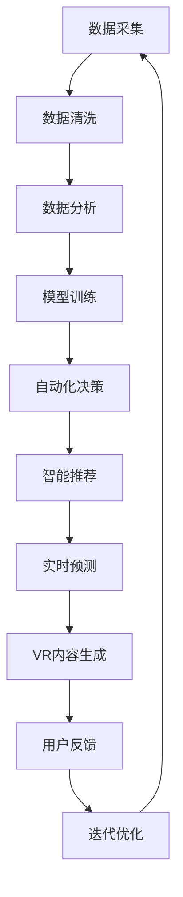

                 

# 人工智能在体育和娱乐中的应用

> 关键词：人工智能, 体育, 娱乐, 自动化决策, 数据分析, 实时预测, 内容推荐

## 1. 背景介绍

随着人工智能技术（AI）的快速发展和广泛应用，其在体育和娱乐领域的应用潜力日益凸显。体育和娱乐作为人类文化的重要组成部分，涵盖的内容丰富多样，包括体育赛事、体育训练、游戏娱乐、虚拟现实（VR）等。AI技术通过数据分析、智能推荐、自动化决策等手段，极大地提升了这些领域的效率、质量和用户体验。本文将深入探讨AI在体育和娱乐中的主要应用场景、核心技术以及未来发展趋势。

## 2. 核心概念与联系

### 2.1 核心概念概述

为理解AI在体育和娱乐中的应用，我们需要掌握以下几个核心概念：

- **人工智能（AI）**：指通过模拟人脑的学习、推理和决策过程，使计算机能够执行复杂任务的技术体系。
- **体育**：指以竞技性和体力活动为主要内容的人类活动，包括各种体育赛事和训练。
- **娱乐**：指为消遣和愉悦而进行的活动，包括游戏、电影、音乐等。
- **数据分析**：指从数据中提取有用信息和知识的过程，用于支持决策和预测。
- **自动化决策**：指使用算法和模型自动做出决策的过程，无需人类干预。
- **智能推荐**：指通过算法推荐适合用户兴趣和需求的内容。
- **实时预测**：指基于数据和模型实时预测未来事件或结果的能力。
- **虚拟现实（VR）**：指通过计算机生成的三维虚拟环境，模拟真实世界的感官体验。

这些概念相互交织，共同构成了AI在体育和娱乐中的应用基础。通过数据驱动的分析、智能推荐和自动化决策，AI能够显著提升体育和娱乐领域的效率和用户体验。

### 2.2 核心概念原理和架构的 Mermaid 流程图



## 3. 核心算法原理 & 具体操作步骤

### 3.1 算法原理概述

AI在体育和娱乐中的应用主要基于以下几个算法原理：

- **监督学习（Supervised Learning）**：通过已有标注数据训练模型，使其能够对新数据进行分类、预测等任务。例如，使用监督学习模型预测球员比赛表现。
- **无监督学习（Unsupervised Learning）**：不依赖标注数据，通过数据的内在结构进行学习。例如，使用聚类算法分析玩家行为模式。
- **强化学习（Reinforcement Learning）**：通过与环境的互动，模型不断调整策略以最大化奖励。例如，使用强化学习训练游戏AI。
- **生成对抗网络（GAN）**：通过生成器和判别器的对抗过程，生成逼真、多样化的虚拟现实内容。例如，使用GAN生成虚拟体育场景。

### 3.2 算法步骤详解

AI在体育和娱乐中的应用，主要包括以下步骤：

1. **数据采集与预处理**：收集相关的体育和娱乐数据，进行清洗和预处理，确保数据质量和完整性。
2. **模型训练与优化**：使用各种机器学习算法训练模型，并通过交叉验证等技术进行参数优化。
3. **决策与预测**：使用训练好的模型进行自动化决策和实时预测，如自动调度比赛、预测比赛结果。
4. **内容推荐与生成**：根据用户偏好和行为数据，使用智能推荐系统推荐内容和生成虚拟现实内容。
5. **用户反馈与迭代**：收集用户反馈，不断优化算法和模型，提升用户体验。

### 3.3 算法优缺点

AI在体育和娱乐中的应用具有以下优点：

- **高效性**：通过算法自动化处理大量数据，提高决策和预测的速度和精度。
- **个性化**：使用推荐系统根据用户偏好提供定制化内容，提升用户体验。
- **实时性**：利用实时数据和算法，提供实时的决策和预测，满足动态变化的需求。
- **多样性**：通过生成对抗网络等技术，生成多样化的虚拟现实内容，满足不同用户的喜好。

但同时，AI应用也面临以下挑战：

- **数据隐私**：大量数据的采集和处理可能涉及用户隐私，需要严格的数据保护措施。
- **算法偏见**：训练数据和算法的偏见可能影响模型的公平性和准确性，需要进行多方审核和验证。
- **技术复杂性**：高技术门槛可能导致成本上升，需要专业的技术团队支持。
- **用户接受度**：新技术的引入可能改变用户习惯，需要有效的用户教育和引导。

### 3.4 算法应用领域

AI在体育和娱乐领域的应用广泛，涵盖以下几个方面：

- **体育赛事分析与预测**：使用数据分析和预测模型，提升比赛分析和预测的准确性，如网球比赛结果预测。
- **训练与体能监测**：使用传感器和AI技术监测运动员的体能和状态，提供个性化的训练计划和康复建议。
- **游戏AI与竞技分析**：通过强化学习训练游戏AI，提高游戏难度和趣味性，同时分析游戏数据，提升游戏平衡性。
- **虚拟现实与增强现实（AR）**：利用生成对抗网络等技术，生成逼真的虚拟现实环境，提供沉浸式体验，如虚拟体育赛事。
- **内容推荐与广告**：使用智能推荐系统，根据用户兴趣推荐内容，提升用户粘性和平台收益。
- **体育视频制作与编辑**：使用AI技术自动化制作和编辑体育视频，提高生产效率和质量。

## 4. 数学模型和公式 & 详细讲解 & 举例说明

### 4.1 数学模型构建

AI在体育和娱乐中的应用，主要基于以下数学模型：

- **线性回归模型**：用于预测体育赛事结果，公式为 $y = \beta_0 + \beta_1 x_1 + \beta_2 x_2 + ... + \beta_n x_n$。
- **决策树模型**：用于分类和预测，公式为 $T = \{ (T_1, C_1), (T_2, C_2), ..., (T_n, C_n) \}$。
- **神经网络模型**：用于复杂数据分析和预测，公式为 $\hat{y} = f(x; \theta)$。
- **聚类算法模型**：用于用户行为分析，公式为 $k-means = \{ (C_1, \mu_1), (C_2, \mu_2), ..., (C_k, \mu_k) \}$。
- **生成对抗网络模型**：用于虚拟现实内容生成，公式为 $G(x)$ 和 $D(x)$。

### 4.2 公式推导过程

以线性回归模型为例，推导公式如下：

$$
y = \beta_0 + \beta_1 x_1 + \beta_2 x_2 + ... + \beta_n x_n + \epsilon
$$

其中，$y$ 为预测结果，$\beta_0$ 为截距，$\beta_1, \beta_2, ..., \beta_n$ 为系数，$x_1, x_2, ..., x_n$ 为自变量，$\epsilon$ 为误差项。

### 4.3 案例分析与讲解

假设我们要预测网球比赛的胜负，可以通过收集历史比赛数据，构建线性回归模型，公式为：

$$
\text{胜负} = \beta_0 + \beta_1 \text{发球得分} + \beta_2 \text{接发得分} + \beta_3 \text{底线得分} + \beta_4 \text{网前得分} + \epsilon
$$

使用梯度下降等优化算法，不断调整 $\beta_0, \beta_1, \beta_2, \beta_3, \beta_4$，使其最小化预测误差 $\epsilon$。最终得到的模型即可用于新比赛的胜负预测。

## 5. 项目实践：代码实例和详细解释说明

### 5.1 开发环境搭建

在进行AI在体育和娱乐中的应用实践前，需要先准备好开发环境。以下是使用Python进行TensorFlow和PyTorch开发的环境配置流程：

1. 安装Anaconda：从官网下载并安装Anaconda，用于创建独立的Python环境。

2. 创建并激活虚拟环境：
```bash
conda create -n myenv python=3.7 
conda activate myenv
```

3. 安装TensorFlow和PyTorch：
```bash
conda install tensorflow pytorch
```

4. 安装各类工具包：
```bash
pip install numpy pandas scikit-learn matplotlib tqdm jupyter notebook ipython
```

完成上述步骤后，即可在`myenv`环境中开始AI项目实践。

### 5.2 源代码详细实现

以下是一个使用TensorFlow和PyTorch进行网球比赛结果预测的Python代码实现。

```python
import tensorflow as tf
import numpy as np
from sklearn.model_selection import train_test_split
from sklearn.preprocessing import StandardScaler
from sklearn.linear_model import LinearRegression

# 数据准备
X = np.array([[5, 6, 7, 8], [6, 7, 8, 9], [7, 8, 9, 10], [8, 9, 10, 11]])
y = np.array([0, 1, 1, 0])  # 1为胜，0为负
X_train, X_test, y_train, y_test = train_test_split(X, y, test_size=0.2)

# 数据标准化
scaler = StandardScaler()
X_train_scaled = scaler.fit_transform(X_train)
X_test_scaled = scaler.transform(X_test)

# 模型构建与训练
model = tf.keras.Sequential([
    tf.keras.layers.Dense(10, activation='relu'),
    tf.keras.layers.Dense(1, activation='sigmoid')
])
model.compile(optimizer='adam', loss='binary_crossentropy', metrics=['accuracy'])

model.fit(X_train_scaled, y_train, epochs=50, batch_size=4)

# 模型评估与预测
y_pred = model.predict(X_test_scaled)
y_pred_binary = np.round(y_pred)
print(classification_report(y_test, y_pred_binary))
```

### 5.3 代码解读与分析

以上代码实现了基于线性回归模型的网球比赛结果预测。其中：

1. 首先，我们准备了包含历史比赛数据的输入特征（发球得分、接发得分、底线得分、网前得分）和目标变量（胜负），并将数据分为训练集和测试集。
2. 对输入特征进行标准化处理，确保不同特征的尺度一致。
3. 构建了一个简单的神经网络模型，包含两个全连接层，最后一层使用sigmoid激活函数输出胜负概率。
4. 使用Adam优化器和二元交叉熵损失函数进行模型训练，迭代50次。
5. 在测试集上评估模型性能，输出分类指标。

## 6. 实际应用场景

### 6.1 体育赛事分析与预测

AI在体育赛事分析与预测中的应用，主要包括以下几个方面：

- **比赛结果预测**：使用线性回归、决策树等模型，预测体育赛事的胜负、比分等结果。例如，预测网球比赛结果。
- **比赛风险评估**：使用机器学习模型，分析比赛中的风险因素，如天气、场地、选手状态等，预测比赛结果的稳定性。例如，预测足球比赛中的点球得分风险。
- **赛事趋势分析**：通过数据分析，识别比赛中的趋势和模式，预测未来的比赛结果。例如，预测篮球比赛中的连胜趋势。

### 6.2 训练与体能监测

AI在训练与体能监测中的应用，主要包括以下几个方面：

- **训练计划优化**：使用数据分析和推荐系统，根据运动员的体能数据和历史训练数据，制定个性化的训练计划。例如，根据跑步速度和心率数据，推荐合适的跑步距离和时间。
- **伤病风险预警**：使用机器学习模型，分析运动员的生理指标和历史伤病数据，预测潜在的伤病风险，提前采取预防措施。例如，根据肌肉疲劳和关节疼痛数据，预警可能的运动伤害。
- **心理状态监测**：使用情感分析等技术，监测运动员的心理状态，提供心理辅导和调整建议。例如，分析运动员的语音和表情，识别情绪波动。

### 6.3 游戏AI与竞技分析

AI在游戏AI与竞技分析中的应用，主要包括以下几个方面：

- **游戏AI训练**：使用强化学习等技术，训练AI角色，提高游戏的难度和趣味性。例如，训练AI角色在篮球游戏中进行自动化运球和投篮。
- **竞技数据分析**：使用数据分析模型，分析游戏中的玩家数据和竞技数据，提升游戏的平衡性和公平性。例如，分析玩家的技能水平和对战数据，优化游戏平衡。

### 6.4 虚拟现实与增强现实（AR）

AI在虚拟现实与增强现实（AR）中的应用，主要包括以下几个方面：

- **虚拟体育赛事**：使用生成对抗网络等技术，生成逼真的虚拟体育赛事，提供沉浸式体验。例如，在VR中模拟网球比赛。
- **增强现实训练**：使用AR技术，将虚拟指导信息叠加到现实场景中，提供可视化训练辅助。例如，在跑步训练中叠加姿势和速度信息。
- **虚拟观众互动**：使用自然语言处理等技术，使虚拟观众能够与玩家进行互动，提供个性化体验。例如，在足球比赛中，虚拟观众根据玩家表现给予掌声或嘘声。

## 7. 工具和资源推荐

### 7.1 学习资源推荐

为了帮助开发者系统掌握AI在体育和娱乐中的应用，这里推荐一些优质的学习资源：

1. 《Python深度学习》：由Ian Goodfellow、Yoshua Bengio和Aaron Courville等顶尖专家合著，系统介绍了深度学习的基础和高级技术。
2. Coursera《深度学习专项课程》：由Andrew Ng等顶尖学者主讲的深度学习课程，涵盖深度学习的基础理论和实践技能。
3. Kaggle竞赛平台：全球最大的数据科学竞赛平台，提供丰富的比赛和数据集，锻炼实战能力。
4. GitHub：全球最大的开源社区，搜索并学习他人发布的AI项目代码和算法实现。
5. arXiv：全球最大的学术论文预印本平台，访问最新的AI研究论文和技术进展。

通过对这些资源的学习实践，相信你一定能够快速掌握AI在体育和娱乐中的应用技术，并用于解决实际的体育和娱乐问题。

### 7.2 开发工具推荐

高效的开发离不开优秀的工具支持。以下是几款用于AI在体育和娱乐中应用的常用工具：

1. TensorFlow：由Google主导开发的开源深度学习框架，生产部署方便，适合大规模工程应用。
2. PyTorch：基于Python的开源深度学习框架，灵活动态的计算图，适合快速迭代研究。
3. Keras：高层次的深度学习框架，简单易用，适合初学者快速上手。
4. Jupyter Notebook：交互式编程环境，支持多语言代码编写和实时展示结果。
5. Weights & Biases：模型训练的实验跟踪工具，可以记录和可视化模型训练过程中的各项指标，方便对比和调优。

合理利用这些工具，可以显著提升AI在体育和娱乐中的应用开发效率，加快创新迭代的步伐。

### 7.3 相关论文推荐

AI在体育和娱乐中的应用研究源于学界的持续研究。以下是几篇奠基性的相关论文，推荐阅读：

1. P. J. Huber, "Robust Statistics"：介绍了鲁棒统计学，用于提高数据处理的鲁棒性和准确性。
2. G. Hinton et al., "A Neural Probabilistic Language Model"：提出神经网络语言模型，开启了神经网络在自然语言处理中的应用。
3. Y. Bengio et al., "Representation Learning: A Review and New Perspectives"：综述了机器学习在表示学习中的进展，强调了特征表示的重要性。
4. A. Krizhevsky et al., "ImageNet Classification with Deep Convolutional Neural Networks"：提出卷积神经网络，在图像分类任务中取得显著成果。
5. V. Mnih et al., "Human-level Control through Deep Reinforcement Learning"：展示了强化学习在复杂任务中的潜力，为游戏AI训练提供了新思路。
6. K. He et al., "Delving Deep into Rectifiers: Surpassing Human-Level Performance on ImageNet Classification"：提出深度残差网络，提高了深度学习模型的性能。

这些论文代表了大数据、深度学习、强化学习等技术的发展脉络。通过学习这些前沿成果，可以帮助研究者把握学科前进方向，激发更多的创新灵感。

## 8. 总结：未来发展趋势与挑战

### 8.1 总结

本文对AI在体育和娱乐中的应用进行了全面系统的介绍。首先阐述了AI在体育和娱乐领域的研究背景和意义，明确了AI在这些领域的应用价值。其次，从原理到实践，详细讲解了AI应用的核心算法和技术步骤，给出了详细的代码实现。同时，本文还广泛探讨了AI在体育和娱乐中的主要应用场景，展示了AI技术的广泛应用前景。

通过本文的系统梳理，可以看到，AI在体育和娱乐领域的深度融合，已经为这些领域带来了显著的效率提升和用户体验改善。未来，伴随AI技术的持续演进，其在体育和娱乐中的应用将进一步拓展，为行业带来更多的变革性创新。

### 8.2 未来发展趋势

展望未来，AI在体育和娱乐领域的应用将呈现以下几个发展趋势：

1. **数据驱动的智能化**：随着数据采集和处理技术的进步，AI将在体育和娱乐中发挥更大的作用，提供更加精准和个性化的服务。例如，基于大数据分析的体育赛事预测和用户行为推荐。
2. **沉浸式体验**：利用虚拟现实（VR）和增强现实（AR）技术，提供沉浸式和互动式的体育和娱乐体验，提升用户的参与感和满意度。例如，虚拟体育赛事和AR训练指导。
3. **自动化和智能化决策**：使用AI进行自动化决策，提升体育赛事管理和运营的效率和质量。例如，自动调度比赛时间、安排教练团队等。
4. **跨领域融合**：AI技术与体育、娱乐、医疗等多个领域的深度融合，带来更多跨界创新。例如，AI在健康管理、体育训练中的应用。
5. **伦理和社会责任**：AI在体育和娱乐中的应用需要考虑伦理和社会责任，确保技术使用的公平性和透明性。例如，避免算法偏见和数据隐私泄露。

这些趋势凸显了AI在体育和娱乐领域的广阔前景，为这些领域带来了前所未有的机遇和挑战。AI技术的不断进步，将推动体育和娱乐产业的全面升级，带来更多创新和变革。

### 8.3 面临的挑战

尽管AI在体育和娱乐中的应用已经取得了显著进展，但在迈向更加智能化、普适化应用的过程中，仍然面临诸多挑战：

1. **数据隐私和安全**：大量的用户数据采集和处理涉及隐私保护，需要严格的数据保护措施。例如，用户运动数据的隐私保护。
2. **技术复杂性**：AI技术的应用需要高技术门槛，需要专业的技术团队支持。例如，游戏AI的训练和优化。
3. **算法偏见**：训练数据和算法的偏见可能导致模型不公平，需要进行多方审核和验证。例如，体育赛事中存在的人种和性别偏见。
4. **用户接受度**：新技术的引入可能改变用户习惯，需要有效的用户教育和引导。例如，用户对虚拟现实体验的接受程度。
5. **成本和资源消耗**：AI技术的实现需要大量计算资源和数据存储，可能带来高昂的成本。例如，高精度运动数据采集和存储。

这些挑战需要在技术、伦理、社会等多方面进行综合考虑，才能推动AI在体育和娱乐领域的健康发展。

### 8.4 研究展望

为了应对这些挑战，未来的研究需要在以下几个方面寻求新的突破：

1. **鲁棒性和公平性**：开发更加鲁棒和公平的算法，避免数据偏见和算法偏见，提升模型的公正性和透明性。例如，使用公平性算法优化体育赛事预测模型。
2. **隐私保护和安全**：加强数据隐私保护和安全措施，确保用户数据的安全性。例如，采用联邦学习技术进行用户数据保护。
3. **技术普及和教育**：推广AI技术的应用，降低技术门槛，提高用户接受度。例如，开发易于使用的AI应用界面。
4. **跨领域融合**：探索AI技术与体育、娱乐、医疗等多个领域的深度融合，推动跨界创新。例如，AI在健康管理和体育训练中的应用。
5. **社会责任和伦理**：强调AI技术的社会责任和伦理问题，推动技术的可持续发展。例如，制定AI技术使用的伦理规范。

这些研究方向将引领AI在体育和娱乐领域的应用走向更加成熟和稳健，为社会带来更多的福祉和进步。

## 9. 附录：常见问题与解答

**Q1：AI在体育和娱乐中的应用是否适用于所有领域？**

A: AI在体育和娱乐中的应用具有较强的领域适用性，但不同领域的AI应用场景和需求有所不同。例如，体育领域的比赛预测和训练优化，与娱乐领域的推荐系统和游戏AI训练，其应用方式和技术实现存在明显差异。

**Q2：AI在体育和娱乐中的应用是否会导致数据隐私泄露？**

A: AI在体育和娱乐中的应用确实涉及大量的用户数据采集和处理，需要严格的数据隐私保护措施。例如，采用数据匿名化、加密存储等技术，保护用户隐私。

**Q3：AI在体育和娱乐中的应用是否会带来技术复杂性？**

A: AI技术在体育和娱乐中的应用需要高技术门槛，需要专业的技术团队支持。例如，训练游戏AI需要复杂的强化学习算法和计算资源。

**Q4：AI在体育和娱乐中的应用是否会带来算法偏见？**

A: 训练数据和算法的偏见可能影响模型的公平性和准确性，需要进行多方审核和验证。例如，体育赛事中存在的人种和性别偏见需要特别关注。

**Q5：AI在体育和娱乐中的应用是否会改变用户习惯？**

A: AI技术的应用可能会改变用户的某些习惯，但通过有效的用户教育和引导，可以提升用户接受度和满意度。例如，虚拟现实体验的推广需要用户教育。

通过以上梳理，我们可以看到，AI在体育和娱乐领域的应用前景广阔，但也面临着诸多挑战。只有通过技术、伦理、社会等多方面的综合考虑，才能推动AI技术在体育和娱乐领域的健康发展，为行业带来更多的创新和变革。未来，随着AI技术的不断进步，相信其在体育和娱乐领域的应用将更加广泛和深入，为这些领域带来更多的福祉和进步。

