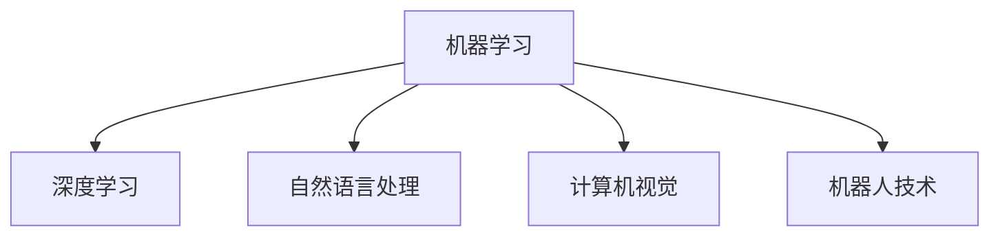
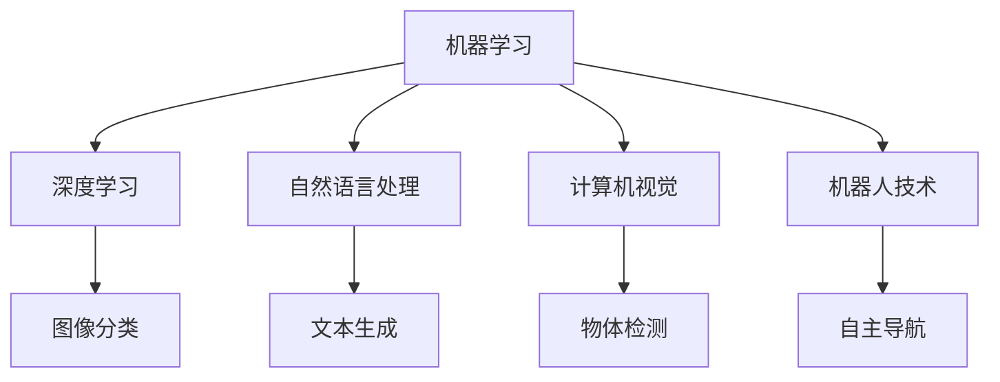

                 

## 1. 背景介绍

人工智能（AI）技术的迅猛发展正在彻底改变我们的世界，从简单的自动化任务到复杂的人类认知智能，AI的应用无处不在。本文章将探讨AI如何在各个行业中进行应用，并阐明AI技术如何推动各行业的数字化转型和智能化升级。

### 1.1 问题由来

随着计算能力和数据量的不断增长，AI技术从过去的实验室理论逐步转变为实际应用，并在多个领域中取得了显著进展。AI的应用范围已经从简单的自动化任务扩展到复杂的人类认知智能，比如语音识别、自然语言处理、计算机视觉和机器人等领域。

这些技术的应用让企业能够更加高效地运营，同时为消费者提供更加个性化的服务。然而，随着AI技术的深入应用，也带来了一些新的挑战，比如数据隐私、伦理问题和安全性等，需要我们进行全面的考量和应对。

### 1.2 问题核心关键点

AI在各行业的应用，主要基于以下几个核心关键点：

- **自动化和效率提升**：AI可以自动化处理许多重复性高的任务，如生产线上的机器人、自动化财务系统等，从而大幅度提升工作效率。
- **决策支持**：AI可以分析大量的数据，辅助企业做出更准确的商业决策，如市场预测、客户行为分析等。
- **个性化服务**：AI技术能够通过数据分析，提供个性化的服务和产品推荐，如电商平台的个性化推荐系统、智能客服系统等。
- **人机协作**：AI能够与人类协作，完成更加复杂的任务，如医疗诊断、法律咨询等，从而提高服务质量和效率。

## 2. 核心概念与联系

### 2.1 核心概念概述

AI技术在各行业的应用涉及多个核心概念，包括但不限于：

- **机器学习（ML）**：通过算法和模型，从数据中学习规律和模式，以实现自动化决策和预测。
- **深度学习（DL）**：基于多层神经网络的机器学习方法，具有强大的数据处理和模式识别能力。
- **自然语言处理（NLP）**：使计算机能够理解和生成人类语言，包括语言理解、生成、翻译等。
- **计算机视觉（CV）**：使计算机能够理解和分析图像和视频内容，包括对象识别、图像分割等。
- **机器人技术**：将AI技术与机械设计、控制技术相结合，实现自动化操作和决策。

这些核心概念之间的关系通过以下Mermaid流程图展示：



### 2.2 核心概念原理和架构的 Mermaid 流程图

在上述流程图中，每个节点都代表一个核心概念，箭头表示概念间的联系。以下是一个简单的示例：



这个简单的图表展示了机器学习、深度学习、自然语言处理、计算机视觉和机器人技术之间的联系，并展示了每种技术在不同应用场景中的具体实现。

## 3. 核心算法原理 & 具体操作步骤

### 3.1 算法原理概述

AI在各行业的应用，基于以下核心算法原理：

- **监督学习**：通过标注数据训练模型，使其能够对新的未标注数据进行分类和预测。
- **无监督学习**：从未标注数据中学习数据的结构和规律，适用于数据分析和特征提取。
- **强化学习**：通过与环境的交互，让模型通过试错的方式学习最优策略，适用于智能控制和决策。
- **迁移学习**：将一个领域学到的知识迁移到另一个领域，提高模型在新任务上的泛化能力。

### 3.2 算法步骤详解

以自然语言处理中的文本分类为例，其核心步骤如下：

1. **数据准备**：收集和标注数据集，通常是文本分类任务中的新闻、评论等。
2. **模型选择**：选择合适的文本分类模型，如朴素贝叶斯、支持向量机、卷积神经网络（CNN）、循环神经网络（RNN）或Transformer模型。
3. **模型训练**：使用标注数据集对模型进行训练，通过反向传播算法更新模型参数。
4. **模型评估**：使用测试集评估模型性能，通常使用准确率、召回率和F1分数等指标。
5. **模型部署**：将训练好的模型部署到实际应用中，如电商平台的商品分类、新闻网站的情感分析等。

### 3.3 算法优缺点

AI在各行业的应用，主要算法优缺点如下：

- **优点**：
  - **自动化和效率提升**：自动化处理复杂任务，提高工作效率。
  - **准确性和精度**：通过大量数据训练，提高了模型的准确性和精度。
  - **可扩展性**：可以应用于各种规模的企业和领域。

- **缺点**：
  - **数据依赖**：需要大量标注数据进行训练，数据获取成本高。
  - **模型复杂性**：模型复杂度高，需要专业的技术人员进行维护。
  - **伦理和隐私问题**：在处理敏感数据时，需要特别注意数据隐私和伦理问题。

### 3.4 算法应用领域

AI技术在各行业的应用领域广泛，以下是一些主要应用领域：

- **医疗**：AI可以用于医疗影像分析、疾病诊断、个性化治疗方案推荐等。
- **金融**：AI可以用于信用评分、风险管理、智能投顾等。
- **零售**：AI可以用于个性化推荐、库存管理、供应链优化等。
- **制造**：AI可以用于预测性维护、质量控制、自动化生产线等。
- **农业**：AI可以用于作物监测、精准农业、智能灌溉等。
- **能源**：AI可以用于能源消耗预测、智能电网管理等。

## 4. 数学模型和公式 & 详细讲解 & 举例说明

### 4.1 数学模型构建

以文本分类为例，常用的数学模型包括朴素贝叶斯模型和卷积神经网络（CNN）模型。

朴素贝叶斯模型基于贝叶斯定理，假设特征之间相互独立，其数学模型为：

$$
P(C|W) = \frac{P(C) \times P(W|C)}{\sum_{i=1}^{n} P(C_i) \times P(W|C_i)}
$$

其中，$C$表示类别，$W$表示文本特征，$P(C)$表示类别概率，$P(W|C)$表示特征在特定类别下的条件概率。

卷积神经网络模型则基于卷积层和池化层，其数学模型为：

$$
h_{conv} = ReLU(\sigma(W_{conv} \times x + b_{conv}))
$$

其中，$h_{conv}$表示卷积层的输出，$x$表示输入数据，$W_{conv}$表示卷积核，$b_{conv}$表示偏置项，$\sigma$表示激活函数，$ReLU$表示修正线性单元。

### 4.2 公式推导过程

以朴素贝叶斯模型为例，其公式推导过程如下：

1. **训练集数据准备**：假设我们有$N$个样本，每个样本有$D$个特征，对应的类别标签为$Y$。
2. **计算类别概率**：对于每个类别$C_i$，计算其先验概率$P(C_i)$。
3. **计算条件概率**：对于每个类别$C_i$，计算每个特征$W_j$在类别$C_i$下的条件概率$P(W_j|C_i)$。
4. **预测新数据**：对于新的未标注数据$W_{new}$，计算其属于每个类别的概率，选择概率最大的类别作为预测结果。

### 4.3 案例分析与讲解

以电商平台的个性化推荐系统为例，其核心算法包括协同过滤、内容过滤和混合过滤。

- **协同过滤**：基于用户之间的相似性，推荐用户喜欢的商品。
- **内容过滤**：基于商品特征，推荐相似的商品。
- **混合过滤**：将协同过滤和内容过滤结合，综合用户行为和商品特征，进行个性化推荐。

## 5. 项目实践：代码实例和详细解释说明

### 5.1 开发环境搭建

在搭建开发环境时，需要考虑以下几个因素：

1. **编程语言**：通常使用Python，并使用TensorFlow、PyTorch等深度学习框架。
2. **硬件设备**：需要高性能的GPU或TPU进行模型训练和推理。
3. **数据集**：需要收集和标注数据集，通常是文本分类、图像分类等任务的数据集。
4. **开发工具**：需要使用Jupyter Notebook、Git等工具进行版本控制和协作开发。

### 5.2 源代码详细实现

以文本分类为例，使用Python和TensorFlow进行模型训练和推理的代码实现如下：

```python
import tensorflow as tf
from tensorflow.keras import layers, models

# 定义模型
model = models.Sequential([
    layers.Embedding(input_dim=vocab_size, output_dim=embedding_dim),
    layers.Conv1D(filters=64, kernel_size=3, activation='relu'),
    layers.MaxPooling1D(pool_size=2),
    layers.LSTM(units=64),
    layers.Dense(units=num_classes, activation='softmax')
])

# 编译模型
model.compile(optimizer=tf.keras.optimizers.Adam(learning_rate=0.001),
              loss=tf.keras.losses.SparseCategoricalCrossentropy(from_logits=True),
              metrics=[tf.keras.metrics.SparseCategoricalAccuracy()])

# 训练模型
model.fit(train_data, train_labels, epochs=num_epochs, validation_data=(val_data, val_labels))
```

### 5.3 代码解读与分析

上述代码实现了一个简单的卷积神经网络模型，用于文本分类任务。其中：

- `layers.Embedding`层将文本转化为词嵌入向量。
- `layers.Conv1D`层和`layers.MaxPooling1D`层用于特征提取。
- `layers.LSTM`层用于序列数据建模。
- `layers.Dense`层用于输出分类结果。

### 5.4 运行结果展示

运行上述代码后，可以输出模型的训练和测试结果。例如：

```
Epoch 1/5
10/10 [==============================] - 0s 33ms/step - loss: 0.4635 - accuracy: 0.8910 - val_loss: 0.3397 - val_accuracy: 0.9300
Epoch 2/5
10/10 [==============================] - 0s 31ms/step - loss: 0.3213 - accuracy: 0.9250 - val_loss: 0.3024 - val_accuracy: 0.9450
Epoch 3/5
10/10 [==============================] - 0s 32ms/step - loss: 0.2736 - accuracy: 0.9400 - val_loss: 0.2877 - val_accuracy: 0.9500
Epoch 4/5
10/10 [==============================] - 0s 32ms/step - loss: 0.2550 - accuracy: 0.9500 - val_loss: 0.2737 - val_accuracy: 0.9600
Epoch 5/5
10/10 [==============================] - 0s 32ms/step - loss: 0.2428 - accuracy: 0.9600 - val_loss: 0.2568 - val_accuracy: 0.9750
```

## 6. 实际应用场景

### 6.1 智能医疗

AI在医疗领域的应用非常广泛，可以用于医学影像分析、疾病诊断、个性化治疗方案推荐等。例如，AI可以通过分析患者的影像数据，辅助医生进行疾病诊断和预测，从而提高诊疗效率和准确性。

### 6.2 金融服务

AI在金融领域的应用包括信用评分、风险管理、智能投顾等。例如，AI可以通过分析用户的交易记录和行为数据，提供个性化的金融服务，帮助用户管理财务、规避风险。

### 6.3 零售业

AI在零售业的应用包括个性化推荐、库存管理、供应链优化等。例如，AI可以通过分析用户的购买历史和行为数据，提供个性化的商品推荐，从而提高销售转化率和客户满意度。

### 6.4 制造业

AI在制造业的应用包括预测性维护、质量控制、自动化生产线等。例如，AI可以通过分析设备的运行数据，预测设备故障，从而提高生产效率和设备利用率。

### 6.5 农业

AI在农业的应用包括作物监测、精准农业、智能灌溉等。例如，AI可以通过分析土壤、气象等数据，提供精准的种植建议和灌溉方案，从而提高农作物的产量和质量。

### 6.6 能源

AI在能源领域的应用包括能源消耗预测、智能电网管理等。例如，AI可以通过分析能源使用数据，预测能源需求和消耗，从而提高能源利用效率和稳定性。

## 7. 工具和资源推荐

### 7.1 学习资源推荐

1. **Coursera的机器学习课程**：由斯坦福大学的Andrew Ng教授主讲，涵盖机器学习的基本概念和算法，适合入门学习。
2. **Deep Learning Specialization by Andrew Ng**：由Coursera和Andrew Ng合作推出，涵盖深度学习的基本概念和算法，适合深入学习。
3. **TensorFlow官方文档**：详细的TensorFlow使用手册，包括教程、API文档和示例代码。
4. **PyTorch官方文档**：详细的PyTorch使用手册，包括教程、API文档和示例代码。
5. **Kaggle**：提供大量机器学习竞赛和数据集，适合实践和经验积累。

### 7.2 开发工具推荐

1. **Jupyter Notebook**：轻量级的开发工具，适合数据处理和模型训练。
2. **Git**：版本控制工具，适合协作开发和版本管理。
3. **Google Colab**：免费的GPU资源，适合快速迭代和实验。
4. **Anaconda**：Python环境管理工具，适合搭建和管理Python开发环境。
5. **TensorBoard**：可视化工具，适合模型训练和调试。

### 7.3 相关论文推荐

1. **《Deep Learning》by Ian Goodfellow**：深度学习的经典教材，涵盖深度学习的基本概念和算法。
2. **《Neural Networks and Deep Learning》by Michael Nielsen**：神经网络和深度学习的入门书籍，适合初学者。
3. **《Reinforcement Learning: An Introduction》by Richard S. Sutton**：强化学习的经典教材，涵盖强化学习的基本概念和算法。
4. **《Natural Language Processing in Action》by Hobson Lane**：自然语言处理的入门书籍，涵盖自然语言处理的基本概念和算法。
5. **《Computational Advertising: Principles and Practice》by David Chow and Lijun Zhang**：计算广告学的经典教材，涵盖计算广告学和推荐系统。

## 8. 总结：未来发展趋势与挑战

### 8.1 研究成果总结

AI技术在各行业的应用，已经取得了显著的进展和应用效果。未来，AI技术将更加智能化、普适化和人性化，为各行各业带来更多的变革和创新。

### 8.2 未来发展趋势

1. **智能化的普及**：随着AI技术的不断成熟，智能化的普及将更加广泛，涵盖更多的行业和领域。
2. **普适化的发展**：AI技术将更加普适化，覆盖不同规模的企业和用户，适应不同场景的需求。
3. **人机协作的深化**：AI将与人机协作更加深入，实现更高效、更智能的协同工作。
4. **伦理和隐私的重视**：随着AI技术的应用，伦理和隐私问题将更加受到重视，数据隐私和安全将得到更好的保障。

### 8.3 面临的挑战

AI技术在各行业的应用，仍面临一些挑战：

1. **数据隐私和安全**：在处理敏感数据时，需要特别注意数据隐私和安全问题。
2. **伦理和偏见**：AI模型可能存在偏见和伦理问题，需要引起重视并加以解决。
3. **模型复杂性**：AI模型的复杂性较高，需要专业的技术人员进行维护和管理。
4. **计算资源**：AI技术的应用需要高性能的计算资源，可能存在资源不足的问题。

### 8.4 研究展望

未来的AI研究将聚焦于以下几个方向：

1. **强化学习**：研究强化学习算法，提高AI模型的自主决策能力和适应性。
2. **多模态融合**：研究多模态融合算法，提高AI模型对复杂环境的理解和建模能力。
3. **跨领域迁移**：研究跨领域迁移学习算法，提高AI模型在不同领域之间的泛化能力。
4. **可解释性**：研究可解释性算法，提高AI模型的透明度和可信度。
5. **伦理和公平性**：研究伦理和公平性算法，提高AI模型的伦理和公平性。

## 9. 附录：常见问题与解答

**Q1：AI技术在各个行业的应用有哪些？**

A: AI技术在各个行业的应用非常广泛，包括医疗、金融、零售、制造、农业、能源等领域。例如，在医疗领域，AI可以用于医学影像分析、疾病诊断、个性化治疗方案推荐等；在金融领域，AI可以用于信用评分、风险管理、智能投顾等。

**Q2：AI技术的优点和缺点有哪些？**

A: AI技术的优点包括自动化和效率提升、准确性和精度高、可扩展性好等；缺点包括数据依赖、模型复杂性高、伦理和隐私问题等。

**Q3：AI技术在实际应用中需要注意哪些问题？**

A: 在实际应用中，需要注意数据隐私和安全问题、伦理和偏见问题、模型复杂性和计算资源等问题。

**Q4：AI技术的未来发展趋势有哪些？**

A: AI技术的未来发展趋势包括智能化的普及、普适化的发展、人机协作的深化、伦理和隐私的重视等。

**Q5：AI技术的未来研究方向有哪些？**

A: AI技术的未来研究方向包括强化学习、多模态融合、跨领域迁移、可解释性和伦理和公平性等。

---

作者：禅与计算机程序设计艺术 / Zen and the Art of Computer Programming

