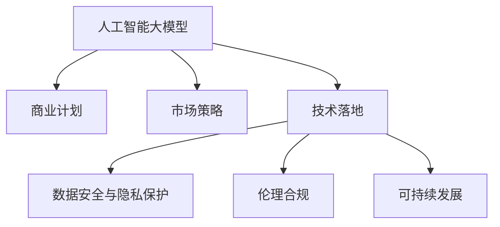

                 

# 人工智能大模型商业计划

> 关键词：人工智能大模型,商业计划,市场策略,技术落地,数据安全,伦理合规,可持续发展,未来展望

## 1. 背景介绍

### 1.1 问题由来

人工智能大模型的崛起，正在深刻改变各行业的业务模式。无论是金融、医疗、零售、制造业还是服务业，大模型技术的应用为这些领域带来了前所未有的机遇。但与此同时，如何构建一个稳健且有效的商业计划，将大模型技术与商业应用相结合，也成为众多企业关注的焦点。

### 1.2 问题核心关键点

大模型技术的商业计划涉及多个关键点：

- **市场定位与目标用户**：明确大模型应用的业务领域和目标用户，并设计精准的市场定位。
- **数据需求与处理**：分析数据需求，探讨如何获取、存储、处理和利用这些数据以优化模型性能。
- **技术选型与集成**：选择合适的技术架构和工具，确保大模型能够高效地集成到现有系统中。
- **商业化路径**：规划从研发到产品化，再到市场推广的全过程，确保技术落地。
- **伦理与合规**：在应用大模型时，确保遵守相关法律法规，并充分考虑数据隐私和伦理问题。
- **可持续性**：制定可持续发展策略，确保业务的长远发展。

本文旨在深入探讨这些关键点，并提出一套系统的商业计划框架，帮助企业高效地将人工智能大模型引入实际商业应用。

## 2. 核心概念与联系

### 2.1 核心概念概述

为了更好地理解人工智能大模型商业计划，我们首先介绍几个核心概念及其相互联系：

- **人工智能大模型**：基于深度学习，如Transformer架构，使用大规模数据集进行预训练的通用智能模型。具备广泛的语言理解与生成能力，能够应用于多种NLP任务。
- **商业计划**：企业在具体应用人工智能技术时的战略规划，包括市场定位、产品路线图、销售策略等。
- **市场策略**：制定以市场需求为导向的营销与推广策略，确保产品能够满足用户需求并取得市场成功。
- **技术落地**：将人工智能技术转化为实际应用，解决业务问题，产生商业价值的过程。
- **数据安全与隐私保护**：在大模型应用中，确保数据存储、传输和使用过程中的安全性，保障用户隐私。
- **伦理合规**：在人工智能应用中遵守法律法规，如GDPR、CCPA等，确保技术应用的合规性。
- **可持续发展**：制定长期战略，确保企业能够在技术进步和业务增长中获得持久发展。

这些概念通过以下Mermaid流程图来展示它们之间的逻辑关系：



该图展示了人工智能大模型在商业计划中的角色，以及各个关键环节如何相互配合，共同推动技术的落地和应用。

## 3. 核心算法原理 & 具体操作步骤

### 3.1 算法原理概述

人工智能大模型商业计划的底层原理基于监督学习和迁移学习的思想。具体步骤如下：

1. **数据收集与预处理**：收集与业务相关的数据，并对其进行清洗、标注、分词等预处理操作，为模型的训练和应用做准备。
2. **模型选择与训练**：选择合适的预训练模型，如BERT、GPT-3等，利用大规模无标签数据进行预训练。然后根据具体任务，设计任务适配层，在有限标注数据上进行微调，提升模型性能。
3. **评估与迭代**：在验证集上评估模型性能，根据评估结果调整模型参数、超参数等，直到达到预期效果。
4. **部署与优化**：将模型部署到实际应用场景，并通过A/B测试等手段进行性能优化。
5. **持续学习与迭代**：随着业务需求的变化和数据量的增加，持续收集新数据，更新模型，保持模型的时效性和准确性。

### 3.2 算法步骤详解

**Step 1: 数据收集与预处理**

数据是人工智能大模型的基础。收集与业务相关的数据，包括文本、图像、语音等，并进行以下预处理操作：

- **数据清洗**：去除噪声、重复、异常数据。
- **文本分词**：对文本进行分词，为模型训练做准备。
- **标注数据**：对于有监督任务，对数据进行标注，生成训练样本。
- **数据增强**：使用同义词替换、数据扩增等技术丰富训练集。

**Step 2: 模型选择与训练**

选择合适的预训练模型，并利用其进行微调：

- **模型选择**：选择适合的预训练模型，如BERT、GPT等。
- **任务适配层**：根据具体任务，设计任务适配层。例如，分类任务需设计线性分类器，生成任务需设计解码器。
- **微调**：使用小规模标注数据，通过梯度下降等优化算法微调模型参数。
- **评估**：在验证集上评估模型性能，使用交叉熵、精确度、召回率等指标衡量模型效果。

**Step 3: 部署与优化**

将微调后的模型部署到实际应用场景，并不断优化：

- **部署**：将模型集成到实际业务系统中。
- **性能优化**：通过A/B测试、线上实验等手段，优化模型参数、超参数，提升模型效果。
- **监控与调优**：实时监控模型性能，根据业务需求调整模型参数。

**Step 4: 持续学习与迭代**

随着业务需求和数据量的变化，持续收集新数据，更新模型：

- **数据采集**：定期采集新数据，更新训练集。
- **模型更新**：在新数据上微调模型，更新模型参数。
- **评估与迭代**：在新数据上评估模型性能，确保模型时效性。

### 3.3 算法优缺点

**优点**：

- **高效性**：利用预训练模型的强大语言理解能力，在少量标注数据上快速实现模型微调。
- **泛化性**：大模型具备广泛的语言知识，能够泛化到不同任务和领域。
- **可扩展性**：基于大模型的微调模型，可以轻松适应业务需求变化，灵活调整。

**缺点**：

- **数据依赖**：微调模型需要大量标注数据，数据获取和处理成本高。
- **模型复杂度**：大模型参数量大，训练和推理计算资源需求高。
- **伦理风险**：大模型可能学习到有害数据，需要严格的数据隐私和伦理审查。

### 3.4 算法应用领域

人工智能大模型在多个领域具有广泛的应用潜力，例如：

- **金融风控**：利用大模型进行信用评估、欺诈检测、客户分类等。
- **医疗诊断**：通过大模型进行疾病预测、诊断结果生成、患者管理等。
- **零售推荐**：基于用户行为数据，利用大模型进行商品推荐。
- **法律文书**：使用大模型生成合同、判决书、法律建议等。
- **媒体内容**：通过大模型进行内容生成、自动摘要、情感分析等。

这些应用领域展示了人工智能大模型在商业场景中的巨大潜力，并为不同行业的业务发展提供了新的方向。

## 4. 数学模型和公式 & 详细讲解 & 举例说明

### 4.1 数学模型构建

假设我们有一个分类任务，利用大模型进行微调。设训练集为 $D=\{(x_i, y_i)\}_{i=1}^N$，其中 $x_i$ 为输入文本，$y_i$ 为分类标签，假设模型的输出为 $h(x)$，损失函数为 $\mathcal{L}$。

模型的预测概率为 $P(y|x) = \sigma(h(x))$，其中 $\sigma$ 为sigmoid函数，$h(x)$ 为模型的输出。

### 4.2 公式推导过程

模型的损失函数可定义为交叉熵损失函数：

$$
\mathcal{L} = -\frac{1}{N}\sum_{i=1}^N y_i \log P(y_i|x_i) + (1-y_i) \log (1-P(y_i|x_i))
$$

其中，$P(y_i|x_i)$ 为模型对 $x_i$ 的预测概率。

通过反向传播算法，计算损失函数对模型参数的梯度，更新模型参数：

$$
\frac{\partial \mathcal{L}}{\partial \theta} = -\frac{1}{N}\sum_{i=1}^N (y_i - P(y_i|x_i)) \frac{\partial h(x_i)}{\partial \theta}
$$

其中，$\theta$ 为模型参数，$h(x_i)$ 为模型的输出，$\frac{\partial h(x_i)}{\partial \theta}$ 为模型输出对参数 $\theta$ 的偏导数。

### 4.3 案例分析与讲解

以情感分析任务为例，利用BERT模型进行微调。假设训练集为 $D=\{(x_i, y_i)\}_{i=1}^N$，其中 $x_i$ 为文本，$y_i \in \{0,1\}$ 表示情感标签（0为负面，1为正面）。

**Step 1: 数据准备**

- **数据采集**：收集电影评论、新闻评论等文本数据，并进行标注。
- **数据预处理**：对文本进行分词、清洗，生成训练样本。

**Step 2: 模型选择**

- **选择BERT模型**：利用HuggingFace的BERT预训练模型，加载并解冻顶层的任务适配层。

**Step 3: 微调**

- **任务适配层**：在BERT模型的顶层添加一个线性分类器，作为任务适配层。
- **微调**：使用交叉熵损失函数，在训练集上微调模型。

**Step 4: 评估与优化**

- **评估**：在验证集上评估模型性能，使用精确度、召回率、F1-score等指标衡量模型效果。
- **优化**：根据评估结果，调整模型参数、学习率等超参数，提升模型效果。

**Step 5: 部署与监控**

- **部署**：将微调后的模型集成到实际业务系统中，用于情感分析任务。
- **监控与调优**：实时监控模型性能，根据业务需求调整模型参数。

## 5. 项目实践：代码实例和详细解释说明

### 5.1 开发环境搭建

在进行人工智能大模型商业计划开发时，我们需要搭建一个高性能的开发环境。以下是Python环境中搭建开发环境的详细步骤：

1. **安装Anaconda**：从官网下载并安装Anaconda，用于创建独立的Python环境。
2. **创建并激活虚拟环境**：
   ```bash
   conda create -n pytorch-env python=3.8 
   conda activate pytorch-env
   ```
3. **安装PyTorch**：根据CUDA版本，从官网获取对应的安装命令。例如：
   ```bash
   conda install pytorch torchvision torchaudio cudatoolkit=11.1 -c pytorch -c conda-forge
   ```
4. **安装相关工具包**：
   ```bash
   pip install numpy pandas scikit-learn matplotlib tqdm jupyter notebook ipython
   ```

完成上述步骤后，即可在`pytorch-env`环境中开始商业计划的开发。

### 5.2 源代码详细实现

以下是使用PyTorch进行情感分析任务微调的代码实现：

```python
import torch
import torch.nn as nn
import torch.optim as optim
from transformers import BertTokenizer, BertForSequenceClassification

# 加载数据
tokenizer = BertTokenizer.from_pretrained('bert-base-cased')
train_data = load_train_data()
train_labels = load_train_labels()

# 构建模型
model = BertForSequenceClassification.from_pretrained('bert-base-cased', num_labels=2)
model.to(device)

# 定义损失函数和优化器
criterion = nn.CrossEntropyLoss()
optimizer = optim.Adam(model.parameters(), lr=2e-5)

# 训练函数
def train_epoch(model, data_loader, optimizer, device):
    model.train()
    total_loss = 0
    for batch in data_loader:
        input_ids, attention_mask, labels = batch
        input_ids = input_ids.to(device)
        attention_mask = attention_mask.to(device)
        labels = labels.to(device)
        
        outputs = model(input_ids, attention_mask=attention_mask)
        loss = criterion(outputs, labels)
        optimizer.zero_grad()
        loss.backward()
        optimizer.step()
        
        total_loss += loss.item()
    return total_loss / len(data_loader)

# 评估函数
def evaluate(model, data_loader, device):
    model.eval()
    total_loss = 0
    total_correct = 0
    for batch in data_loader:
        input_ids, attention_mask, labels = batch
        input_ids = input_ids.to(device)
        attention_mask = attention_mask.to(device)
        labels = labels.to(device)
        
        outputs = model(input_ids, attention_mask=attention_mask)
        loss = criterion(outputs, labels)
        total_loss += loss.item()
        predictions = torch.argmax(outputs, dim=1)
        total_correct += torch.sum(predictions == labels).item()
    
    return total_loss / len(data_loader), total_correct / len(data_loader)

# 训练流程
device = torch.device('cuda') if torch.cuda.is_available() else torch.device('cpu')
num_epochs = 5
batch_size = 32

for epoch in range(num_epochs):
    train_loss = train_epoch(model, train_data_loader, optimizer, device)
    print(f'Epoch {epoch+1}, train loss: {train_loss:.3f}')
    
    val_loss, val_acc = evaluate(model, val_data_loader, device)
    print(f'Epoch {epoch+1}, val loss: {val_loss:.3f}, val acc: {val_acc:.3f}')
    
print('Finished training.')
```

以上是使用PyTorch进行情感分析任务微调的完整代码实现。代码中，我们使用Bert模型作为基础模型，并设计了一个线性分类器作为任务适配层。通过交叉熵损失函数和Adam优化器进行微调，并在验证集上评估模型性能。

### 5.3 代码解读与分析

**tokenizer模块**：
- **分词功能**：负责将文本分词，生成模型所需的输入序列。
- **加载预训练模型**：从HuggingFace库加载BERT预训练模型，解冻顶层适配层。

**训练函数**：
- **数据加载**：从数据集中加载输入序列、注意力掩码和标签。
- **模型前向传播**：将输入序列和注意力掩码送入模型，得到预测概率。
- **损失计算**：计算交叉熵损失。
- **反向传播**：使用梯度下降优化模型参数。
- **性能评估**：在验证集上评估模型性能，输出交叉熵损失。

**评估函数**：
- **数据加载**：从数据集中加载输入序列、注意力掩码和标签。
- **模型前向传播**：将输入序列和注意力掩码送入模型，得到预测概率。
- **损失计算**：计算交叉熵损失。
- **精度计算**：计算预测准确率。
- **性能输出**：输出验证集的交叉熵损失和准确率。

**训练流程**：
- **模型加载**：加载预训练BERT模型，并解冻顶层适配层。
- **损失定义**：定义交叉熵损失函数和Adam优化器。
- **训练循环**：在每个epoch中，分别在训练集和验证集上训练模型，输出损失和评估结果。
- **模型保存**：保存训练好的模型，以备后续部署使用。

## 6. 实际应用场景

### 6.1 智能客服系统

在智能客服系统中，人工智能大模型可以用于自动化客服，提升客户满意度。通过微调大模型，可以使其能够理解自然语言，根据用户提问提供准确的答案，处理常见问题，并自动转接复杂问题给人工客服。

### 6.2 金融风控

金融行业面临大量数据处理和风险评估需求，人工智能大模型可以用于信用评估、欺诈检测、风险预测等。通过微调模型，可以提升风险预测的准确性和效率，降低金融损失。

### 6.3 医疗诊断

医疗行业对诊断的准确性和效率有极高要求。人工智能大模型可以用于疾病预测、诊断结果生成、患者管理等。通过微调模型，可以提高诊断的准确性和及时性，减轻医生的工作负担。

### 6.4 媒体内容创作

媒体行业对内容创作有大量需求，人工智能大模型可以用于自动生成文章、摘要、标题等。通过微调模型，可以提高内容创作的效率和质量，降低人力成本。

## 7. 工具和资源推荐

### 7.1 学习资源推荐

为了帮助开发者系统掌握人工智能大模型的商业计划，这里推荐一些优质的学习资源：

1. **《深度学习理论与实践》**：一本书籍，介绍了深度学习的基本理论和实际应用，适合入门学习和项目实践。
2. **CS229《机器学习》**：斯坦福大学开设的机器学习课程，涵盖了机器学习的基本概念和算法。
3. **《人工智能大模型实战》**：一本实战书籍，介绍了多种大模型的构建和应用，适合项目实践。
4. **HuggingFace官方文档**：提供了丰富的预训练模型和微调样例，是快速上手实践的好资源。
5. **CLUE开源项目**：中文语言理解测评基准，包含大量不同类型的中文NLP数据集，并提供了基于微调的baseline模型。

通过这些资源的学习实践，相信你一定能够快速掌握人工智能大模型的商业计划框架，并用于解决实际的业务问题。

### 7.2 开发工具推荐

高效的开发离不开优秀的工具支持。以下是几款用于人工智能大模型商业计划开发的常用工具：

1. **PyTorch**：基于Python的开源深度学习框架，灵活动态的计算图，适合快速迭代研究。
2. **TensorFlow**：由Google主导开发的开源深度学习框架，生产部署方便，适合大规模工程应用。
3. **Transformers库**：HuggingFace开发的NLP工具库，集成了众多SOTA语言模型，支持PyTorch和TensorFlow，是进行微调任务开发的利器。
4. **Weights & Biases**：模型训练的实验跟踪工具，可以记录和可视化模型训练过程中的各项指标，方便对比和调优。
5. **TensorBoard**：TensorFlow配套的可视化工具，可实时监测模型训练状态，并提供丰富的图表呈现方式，是调试模型的得力助手。
6. **Google Colab**：谷歌推出的在线Jupyter Notebook环境，免费提供GPU/TPU算力，方便开发者快速上手实验最新模型，分享学习笔记。

合理利用这些工具，可以显著提升人工智能大模型商业计划的开发效率，加快创新迭代的步伐。

### 7.3 相关论文推荐

人工智能大模型和微调技术的发展源于学界的持续研究。以下是几篇奠基性的相关论文，推荐阅读：

1. **Attention is All You Need**：提出了Transformer结构，开启了NLP领域的预训练大模型时代。
2. **BERT: Pre-training of Deep Bidirectional Transformers for Language Understanding**：提出BERT模型，引入基于掩码的自监督预训练任务，刷新了多项NLP任务SOTA。
3. **Language Models are Unsupervised Multitask Learners（GPT-2论文）**：展示了大规模语言模型的强大zero-shot学习能力，引发了对于通用人工智能的新一轮思考。
4. **Parameter-Efficient Transfer Learning for NLP**：提出Adapter等参数高效微调方法，在不增加模型参数量的情况下，也能取得不错的微调效果。
5. **Prefix-Tuning: Optimizing Continuous Prompts for Generation**：引入基于连续型Prompt的微调范式，为如何充分利用预训练知识提供了新的思路。
6. **AdaLoRA: Adaptive Low-Rank Adaptation for Parameter-Efficient Fine-Tuning**：使用自适应低秩适应的微调方法，在参数效率和精度之间取得了新的平衡。

这些论文代表了大模型微调技术的发展脉络。通过学习这些前沿成果，可以帮助研究者把握学科前进方向，激发更多的创新灵感。

## 8. 总结：未来发展趋势与挑战

### 8.1 研究成果总结

本文对人工智能大模型的商业计划进行了全面系统的介绍。首先阐述了大模型和微调技术的背景和意义，明确了商业计划在技术落地中的重要性。其次，从原理到实践，详细讲解了商业计划的各个环节，包括数据处理、模型选择、微调、评估与优化、持续学习与迭代等。最后，本文探讨了人工智能大模型在多个行业的应用，提供了详细的项目实践代码，并推荐了相关的学习资源和工具。

### 8.2 未来发展趋势

展望未来，人工智能大模型的商业计划将呈现以下几个发展趋势：

1. **数据驱动**：随着数据量的不断增加，数据驱动的决策将在商业计划中扮演越来越重要的角色。
2. **模型泛化**：未来的大模型将具备更强的泛化能力，能够在不同场景下稳定表现。
3. **端到端集成**：大模型将与业务系统深度集成，提供端到端解决方案。
4. **可解释性**：增强模型的可解释性，帮助用户理解模型的决策过程，增强信任度。
5. **安全与隐私**：在大模型应用中，数据安全与隐私保护将成为重要议题，相关技术将不断进步。
6. **跨领域应用**：人工智能大模型将跨越不同领域，形成跨行业应用的通用解决方案。

### 8.3 面临的挑战

尽管人工智能大模型商业计划已取得显著进展，但在迈向更加智能化、普适化应用的过程中，它仍面临诸多挑战：

1. **数据获取与处理**：获取高质量标注数据成本高，数据处理复杂。
2. **模型性能**：大模型参数量大，训练和推理资源需求高，需要优化。
3. **伦理与合规**：大模型可能学习到有害数据，需要严格的数据隐私和伦理审查。
4. **用户体验**：如何设计良好的用户体验，提升用户满意度，是商业计划的重要课题。
5. **持续优化**：如何通过持续学习与迭代，保持模型的时效性和准确性，仍需探索。

### 8.4 研究展望

面对大模型商业计划面临的挑战，未来的研究需要在以下几个方面寻求新的突破：

1. **无监督学习**：探索无监督学习范式，降低对标注数据的依赖。
2. **模型压缩**：开发更高效的模型压缩算法，减少参数量和资源消耗。
3. **数据增强**：通过数据增强技术，提高数据多样性，提升模型泛化能力。
4. **可解释性**：开发可解释模型，帮助用户理解模型决策过程，增强信任度。
5. **跨领域应用**：拓展跨领域应用，形成通用解决方案，提升模型的灵活性。
6. **安全与隐私**：加强数据安全与隐私保护，保障用户隐私。

这些研究方向将为人工智能大模型商业计划的落地应用提供新的方向，推动技术进步和产业升级。

## 9. 附录：常见问题与解答

**Q1：人工智能大模型商业计划是否适用于所有行业？**

A: 人工智能大模型商业计划适用于具有数据驱动需求和场景的行业，如金融、医疗、零售、制造等。但对于一些特定行业，如医疗、法律等，可能需要结合行业特点进行定制化设计。

**Q2：微调过程中如何选择合适的学习率？**

A: 微调学习率通常比预训练时小1-2个数量级，一般建议从1e-5开始调参，逐步减小学习率，直至收敛。可以使用warmup策略，在开始阶段使用较小的学习率，再逐渐过渡到预设值。

**Q3：在微调过程中如何避免过拟合？**

A: 可以通过数据增强、正则化、早停等技术来避免过拟合。数据增强可以扩充训练集，正则化可以防止模型过拟合，早停可以及时停止训练，避免过拟合。

**Q4：如何确保人工智能大模型的安全性？**

A: 在应用人工智能大模型时，需要考虑数据隐私和安全问题。可以通过数据加密、匿名化、访问控制等手段，保障数据的安全性和隐私性。同时，模型本身需要经过严格的安全测试，确保模型输出符合伦理道德。

**Q5：如何平衡人工智能大模型的性能与资源消耗？**

A: 可以通过模型压缩、优化算法、并行计算等技术来平衡性能与资源消耗。模型压缩可以减少参数量，优化算法可以提高计算效率，并行计算可以分担计算负载，提高处理速度。

这些问题的解答，希望能对人工智能大模型商业计划的实践者提供有益的参考。

---

作者：禅与计算机程序设计艺术 / Zen and the Art of Computer Programming

