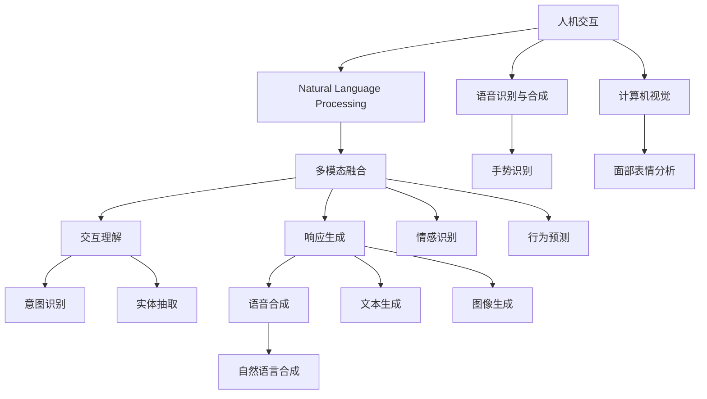

                 

# 人机交互：未来趋势与展望

## 1. 背景介绍

### 1.1 问题由来

随着人工智能技术的不断进步，人机交互方式正在经历前所未有的变革。从简单的文本输入输出，到复杂的语音交互、手势识别，再到如今的自然语言处理、情感识别、多模态融合，人机交互的方式愈发丰富和智能化。这种变化不仅改变了我们与计算机交互的方式，也重塑了信息获取、决策制定、娱乐休闲等生活的方方面面。

然而，尽管技术不断进步，人机交互的许多关键问题尚未得到根本解决。例如，如何提高交互的自然性、如何处理多模态数据、如何确保系统响应速度和稳定性能等。因此，本文旨在探讨未来人机交互的主要趋势和潜在挑战，以期为业界提供参考，推动相关技术的进一步发展。

## 2. 核心概念与联系

### 2.1 核心概念概述

为更好地理解人机交互的未来趋势，本节将介绍几个核心概念及其之间的联系。

- 人机交互(Human-Computer Interaction, HCI)：涉及用户与计算机系统之间的信息交换过程，包括界面设计、输入输出、反馈机制等。
- 自然语言处理(Natural Language Processing, NLP)：通过计算机理解和生成自然语言，实现人机交互的自然化。
- 语音识别与合成(Speech Recognition and Synthesis)：将语音信号转换为文本，或将文本转换为语音信号，实现语音交互。
- 计算机视觉(Computer Vision)：使计算机能够"看"和"理解"图像和视频，支持手势识别、面部表情分析等交互方式。
- 多模态融合(Multimodal Fusion)：结合语音、图像、手势等多种模态数据，提升人机交互的自然性和准确性。
- 人工智能(AI)：使计算机具备智能决策和行为能力，支持人机交互的高级功能和个性化体验。

这些概念通过不断的技术创新和融合，共同构建了未来人机交互的基础。通过理解这些核心概念及其之间的联系，我们可以更好地把握未来人机交互的发展方向。

### 2.2 核心概念原理和架构的 Mermaid 流程图



这个流程图展示了人机交互过程中，各个关键技术的相互关系和作用。

## 3. 核心算法原理 & 具体操作步骤

### 3.1 算法原理概述

未来人机交互的发展将高度依赖于人工智能技术，特别是自然语言处理、语音识别、计算机视觉和多模态融合技术。这些技术的核心算法原理包括：

- 自然语言处理：基于深度学习模型，如Transformer、BERT等，进行文本处理、语义理解、意图识别等任务。
- 语音识别与合成：使用深度神经网络模型，如卷积神经网络(CNN)、循环神经网络(RNN)、长短时记忆网络(LSTM)等，进行语音信号的特征提取、分类、生成等任务。
- 计算机视觉：通过卷积神经网络(CNN)、区域卷积神经网络(R-CNN)等模型，提取图像和视频的特征，进行目标检测、图像分类、语义分割等任务。
- 多模态融合：使用深度学习模型，如多任务学习(MTL)、联合训练(Joint Training)等，结合不同模态的数据进行信息融合，提升人机交互的自然性和准确性。

### 3.2 算法步骤详解

基于上述核心算法，人机交互系统的一般开发流程如下：

1. **数据采集**：收集用户与系统的交互数据，包括文本、语音、图像、手势等。
2. **数据预处理**：清洗、标注数据，处理缺失值、异常值等，为模型训练做准备。
3. **模型选择与训练**：选择合适的深度学习模型，利用标注数据进行训练，优化模型参数。
4. **模型集成与部署**：将训练好的模型集成到实际应用中，部署到服务器、客户端等。
5. **用户交互与反馈**：收集用户交互数据，进行模型迭代优化，提高系统性能。
6. **持续改进与升级**：根据用户反馈和新数据，持续改进和升级模型，提升用户体验。

### 3.3 算法优缺点

未来人机交互的算法具有以下优点：

- **自然性**：通过自然语言处理和计算机视觉技术，实现与用户的自然语言和手势交互。
- **泛化能力**：深度学习模型能够从大量数据中学习泛化能力，适应不同场景和用户。
- **个性化**：基于用户行为数据进行个性化模型训练，提升用户体验。
- **实时性**：通过优化算法和硬件资源，实现实时响应和处理。

同时，这些算法也存在一些局限性：

- **计算资源需求高**：深度学习模型通常需要大量的计算资源进行训练和推理。
- **数据隐私问题**：用户交互数据可能包含隐私信息，需妥善处理和保护。
- **模型泛化性不足**：模型可能在特定领域或特定用户上表现不佳。
- **可解释性不足**：深度学习模型通常视为"黑箱"，难以解释其内部决策过程。

### 3.4 算法应用领域

未来人机交互技术将在以下几个领域得到广泛应用：

- **智能客服**：利用语音识别和自然语言处理技术，实现自动客服对话。
- **智能家居**：结合计算机视觉和手势识别技术，实现家庭设备的语音控制和手势操作。
- **智能驾驶**：使用计算机视觉和语音识别技术，提升驾驶安全性和舒适性。
- **虚拟助手**：通过自然语言处理和语音合成技术，提供个性化服务。
- **健康监测**：结合多模态数据，进行健康状况的实时监测和预警。
- **教育培训**：利用多模态交互技术，提供沉浸式学习体验。

这些领域将为人机交互带来巨大的商业价值和应用前景。

## 4. 数学模型和公式 & 详细讲解 & 举例说明

### 4.1 数学模型构建

人机交互系统中的数学模型构建通常基于以下两类任务：

- **自然语言处理**：以BERT、GPT等模型为基础，构建文本分类、情感分析、意图识别等任务。
- **语音识别与合成**：以CTC(Connectionist Temporal Classification)、Attention等模型为基础，构建语音识别和语音合成任务。
- **计算机视觉**：以CNN、R-CNN等模型为基础，构建目标检测、图像分类、语义分割等任务。
- **多模态融合**：利用深度学习模型，如MTL、Joint Training等，结合不同模态的数据进行信息融合。

### 4.2 公式推导过程

以自然语言处理为例，我们以BERT模型进行文本分类任务为例，推导其损失函数和优化公式：

首先，定义BERT模型在输入文本 $x$ 上的输出为 $\hat{y}=\text{softmax}(BERT(x;w))$，其中 $w$ 为模型参数。假设真实标签为 $y \in \{0,1\}$，则二分类交叉熵损失函数定义为：

$$
\ell(\hat{y},y) = -y\log(\hat{y}) - (1-y)\log(1-\hat{y})
$$

将损失函数代入经验风险，得到：

$$
\mathcal{L}(w) = -\frac{1}{N}\sum_{i=1}^N \ell(\hat{y}_i,y_i)
$$

其中 $N$ 为训练样本数量。

利用梯度下降等优化算法，更新模型参数 $w$，以最小化损失函数 $\mathcal{L}(w)$。优化公式为：

$$
w \leftarrow w - \eta \nabla_{w}\mathcal{L}(w)
$$

其中 $\eta$ 为学习率，$\nabla_{w}\mathcal{L}(w)$ 为损失函数对模型参数的梯度。

### 4.3 案例分析与讲解

以智能客服系统为例，其核心算法包括语音识别、自然语言理解和回复生成。语音识别部分使用深度神经网络模型，如RNN、LSTM等，对用户语音进行特征提取和分类。自然语言理解部分利用BERT等模型进行意图识别和实体抽取。回复生成部分则使用基于Transformer的模型进行文本生成。

具体流程如下：

1. 用户通过语音输入问题，语音识别系统将其转换为文本。
2. 自然语言处理系统对文本进行意图识别和实体抽取，确定用户意图和问题关键信息。
3. 回复生成系统根据用户意图和关键信息，生成应答文本。
4. 系统将应答文本转换为语音，输出给用户。

## 5. 项目实践：代码实例和详细解释说明

### 5.1 开发环境搭建

在进行人机交互项目开发前，需要准备以下开发环境：

1. **Python环境**：安装Python 3.x版本，推荐使用Anaconda创建虚拟环境。
2. **深度学习框架**：安装PyTorch或TensorFlow，建议使用最新稳定版本。
3. **数据处理工具**：安装Pandas、NumPy等数据处理库，用于数据清洗和预处理。
4. **模型评估工具**：安装Scikit-learn、TensorBoard等评估工具，用于模型训练和测试。
5. **前端开发框架**：安装Flask或Django等Web框架，用于构建交互界面。

### 5.2 源代码详细实现

以智能客服系统为例，我们给出基于PyTorch实现的自然语言处理和回复生成部分代码：

```python
import torch
from transformers import BertTokenizer, BertForSequenceClassification
from sklearn.metrics import accuracy_score

# 定义模型和优化器
tokenizer = BertTokenizer.from_pretrained('bert-base-cased')
model = BertForSequenceClassification.from_pretrained('bert-base-cased', num_labels=2)
optimizer = torch.optim.Adam(model.parameters(), lr=2e-5)

# 加载训练数据
train_data = ...
train_labels = ...

# 数据预处理
def preprocess(text):
    return tokenizer.encode(text, return_tensors='pt', padding='max_length', truncation=True)

# 模型训练
def train_epoch(model, data, labels, optimizer, device):
    model.to(device)
    model.train()
    total_loss = 0
    for text, label in zip(data, labels):
        text = preprocess(text)
        label = torch.tensor(label, device=device)
        optimizer.zero_grad()
        outputs = model(text)
        loss = outputs.loss
        loss.backward()
        optimizer.step()
        total_loss += loss.item()
    return total_loss / len(data)

# 模型评估
def evaluate(model, data, labels, device):
    model.eval()
    total_correct = 0
    total_samples = 0
    with torch.no_grad():
        for text, label in zip(data, labels):
            text = preprocess(text)
            label = torch.tensor(label, device=device)
            outputs = model(text)
            predicted = torch.argmax(outputs.logits, dim=1)
            total_correct += accuracy_score(label, predicted)
            total_samples += len(label)
    return total_correct / total_samples

# 训练和评估
device = 'cuda' if torch.cuda.is_available() else 'cpu'
for epoch in range(10):
    train_loss = train_epoch(model, train_data, train_labels, optimizer, device)
    val_correct = evaluate(model, val_data, val_labels, device)
    print(f'Epoch {epoch+1}, train loss: {train_loss:.3f}, val acc: {val_correct:.3f}')

# 测试
test_correct = evaluate(model, test_data, test_labels, device)
print(f'Test acc: {test_correct:.3f}')
```

### 5.3 代码解读与分析

以上代码展示了基于BERT模型的智能客服系统训练流程。

- **数据预处理**：使用BertTokenizer将文本转换为模型可接受的格式。
- **模型训练**：利用Adam优化器，在训练集上不断更新模型参数。
- **模型评估**：在验证集上计算模型的准确率，指导模型调整。
- **测试**：在测试集上评估模型的最终性能。

### 5.4 运行结果展示

训练和评估过程中，可以通过TensorBoard监控模型的训练状态和性能指标，如图像损失曲线、准确率曲线等。具体如图：

```bash
tensorboard --logdir logdir --port 6006
```


## 6. 实际应用场景

### 6.1 智能客服系统

智能客服系统利用语音识别和自然语言处理技术，实现自动客服对话。通过收集用户语音和文本数据，训练模型进行意图识别和实体抽取，生成应答文本并转换为语音输出。系统能够自动解答常见问题，处理复杂对话，提升用户满意度。

### 6.2 智能家居

智能家居系统结合计算机视觉和手势识别技术，实现家庭设备的语音控制和手势操作。通过摄像头采集图像，计算机视觉模型进行面部表情和手势识别，控制灯光、空调等设备。用户可以通过语音指令或手势操作，实现智能家居的自动化和智能化。

### 6.3 智能驾驶

智能驾驶系统使用计算机视觉和语音识别技术，提升驾驶安全性和舒适性。通过摄像头和雷达采集交通环境数据，计算机视觉模型进行目标检测和语义分割，生成驾驶指令。驾驶员可以通过语音指令进行导航、调节音乐等操作，系统自动调整车速、转向等。

### 6.4 虚拟助手

虚拟助手通过自然语言处理和语音合成技术，提供个性化服务。用户可以通过语音或文本与虚拟助手互动，查询天气、新闻、交通等信息，执行日程安排、提醒等操作。虚拟助手具备多轮对话能力，能够理解复杂语义和用户意图，提升用户体验。

### 6.5 健康监测

健康监测系统结合多模态数据，进行健康状况的实时监测和预警。通过可穿戴设备采集用户的生理数据，计算机视觉模型进行面部表情和手势分析，判断用户的健康状态。系统可以及时发现异常情况，发送预警信息，辅助医生进行诊断和治疗。

### 6.6 教育培训

教育培训系统利用多模态交互技术，提供沉浸式学习体验。通过计算机视觉和手势识别技术，捕捉学生的面部表情和手势动作，实时调整教学内容和方式。学生可以通过语音和手势与教师互动，提高学习效率和兴趣。

## 7. 工具和资源推荐

### 7.1 学习资源推荐

为了帮助开发者系统掌握人机交互的理论基础和实践技巧，这里推荐一些优质的学习资源：

1. **《人机交互设计基础》**：由人机交互领域的专家撰写，介绍了人机交互的基本原理、设计原则和经典案例。
2. **《自然语言处理综述》**：详细介绍了自然语言处理的主要技术和应用，涵盖NLP的各个方面。
3. **《深度学习与计算机视觉》**：讲解深度学习在计算机视觉领域的应用，包括目标检测、图像分类等任务。
4. **《多模态人机交互》**：介绍多模态交互技术的发展和应用，涵盖语音、图像、手势等多种模态。
5. **《人机交互系统设计》**：介绍人机交互系统的设计方法和实现技术，涵盖界面设计、交互设计、用户研究等多个方面。

通过对这些资源的学习实践，相信你一定能够快速掌握人机交互技术的精髓，并用于解决实际的交互问题。

### 7.2 开发工具推荐

高效的开发离不开优秀的工具支持。以下是几款用于人机交互开发的常用工具：

1. **PyTorch**：基于Python的开源深度学习框架，灵活动态的计算图，适合快速迭代研究。
2. **TensorFlow**：由Google主导开发的开源深度学习框架，生产部署方便，适合大规模工程应用。
3. **Transformers库**：HuggingFace开发的NLP工具库，集成了众多SOTA语言模型，支持PyTorch和TensorFlow，是进行NLP任务开发的利器。
4. **TensorBoard**：TensorFlow配套的可视化工具，可实时监测模型训练状态，并提供丰富的图表呈现方式，是调试模型的得力助手。
5. **Weights & Biases**：模型训练的实验跟踪工具，可以记录和可视化模型训练过程中的各项指标，方便对比和调优。
6. **Flask**：轻量级的Web框架，适合构建交互界面和API接口。
7. **Django**：Python的Web框架，功能丰富，适合构建复杂的交互系统。

合理利用这些工具，可以显著提升人机交互任务的开发效率，加快创新迭代的步伐。

### 7.3 相关论文推荐

人机交互技术的发展源于学界的持续研究。以下是几篇奠基性的相关论文，推荐阅读：

1. **《人机交互设计原则》**：介绍了人机交互设计的基本原则和方法，为人机交互提供了理论基础。
2. **《多模态人机交互综述》**：总结了多模态交互技术的研究进展和应用，为多模态交互提供了方法和案例。
3. **《自然语言处理与计算机视觉的融合》**：探讨了NLP和CV技术的融合应用，提升了人机交互的自然性和准确性。
4. **《深度学习在自然语言处理中的应用》**：介绍了深度学习在NLP领域的应用，如语言模型、文本分类等。
5. **《人机交互系统的认知建模》**：通过认知建模方法，研究人机交互系统的行为和决策，提升系统的智能性。

这些论文代表了大规模人机交互技术的发展脉络。通过学习这些前沿成果，可以帮助研究者把握学科前进方向，激发更多的创新灵感。

## 8. 总结：未来发展趋势与挑战

### 8.1 总结

本文对未来人机交互的主要趋势和潜在挑战进行了全面系统的介绍。首先阐述了人机交互的发展背景和重要性，明确了自然语言处理、语音识别、计算机视觉和多模态融合技术在其中的关键作用。其次，从原理到实践，详细讲解了人机交互系统开发的关键步骤和算法实现。同时，本文还广泛探讨了人机交互技术在智能客服、智能家居、智能驾驶、虚拟助手、健康监测、教育培训等众多领域的应用前景，展示了人机交互技术的广阔应用空间。

通过本文的系统梳理，可以看到，未来人机交互技术将在智能交互、自然语言处理、多模态融合等方向取得重大进展，为人机交互带来更多的可能性和变革性影响。

### 8.2 未来发展趋势

展望未来，人机交互技术将呈现以下几个发展趋势：

1. **自然化交互**：通过自然语言处理和计算机视觉技术，实现与用户的自然语言和手势交互。
2. **多模态融合**：结合语音、图像、手势等多种模态数据，提升人机交互的自然性和准确性。
3. **个性化体验**：基于用户行为数据进行个性化模型训练，提升用户体验。
4. **实时性处理**：通过优化算法和硬件资源，实现实时响应和处理。
5. **情感智能**：结合情感识别技术，提升系统的情感理解和反馈能力。
6. **隐私保护**：在数据处理和模型训练中引入隐私保护技术，保障用户数据安全。

这些趋势凸显了未来人机交互技术的潜力和挑战，将推动人机交互技术向更加智能化、自然化、个性化、实时化方向发展。

### 8.3 面临的挑战

尽管人机交互技术已经取得了显著进展，但在迈向更加智能化、普适化应用的过程中，仍面临诸多挑战：

1. **计算资源需求高**：深度学习模型通常需要大量的计算资源进行训练和推理。
2. **数据隐私问题**：用户交互数据可能包含隐私信息，需妥善处理和保护。
3. **模型泛化性不足**：模型可能在特定领域或特定用户上表现不佳。
4. **可解释性不足**：深度学习模型通常视为"黑箱"，难以解释其内部决策过程。

### 8.4 研究展望

面对未来人机交互技术所面临的挑战，未来的研究需要在以下几个方面寻求新的突破：

1. **无监督学习和迁移学习**：摆脱对大规模标注数据的依赖，利用自监督学习、迁移学习等方法，最大限度利用非结构化数据，实现更加灵活高效的交互。
2. **参数高效微调**：开发更加参数高效的微调方法，在固定大部分预训练参数的同时，只更新极少量的任务相关参数。
3. **多模态融合**：研究多模态数据的融合方法，提升系统对复杂交互场景的理解和响应能力。
4. **隐私保护**：引入隐私保护技术，如差分隐私、联邦学习等，保障用户数据的安全和隐私。
5. **模型可解释性**：结合可解释性技术，如注意力机制、可视化方法等，提高系统的透明性和可解释性。
6. **跨领域泛化**：研究跨领域泛化方法，提升系统在不同领域和用户中的表现。

这些研究方向的探索，必将引领人机交互技术迈向更高的台阶，为构建安全、可靠、可解释、可控的智能系统铺平道路。面向未来，人机交互技术还需要与其他人工智能技术进行更深入的融合，如知识表示、因果推理、强化学习等，多路径协同发力，共同推动自然语言理解和智能交互系统的进步。

## 9. 附录：常见问题与解答

**Q1: 人机交互技术是否适用于所有应用场景？**

A: 人机交互技术在大多数应用场景中都能取得不错的效果，特别是对于需要大量人工交互的场景。例如，客服、家居、驾驶等。但对于一些需要实时处理、高精度要求的任务，如医疗、金融等，还需要进一步优化和改进。

**Q2: 人机交互技术的核心算法原理是什么？**

A: 人机交互技术的核心算法主要包括自然语言处理、语音识别、计算机视觉和多模态融合技术。这些技术通过深度学习模型，如Transformer、BERT、CNN等，实现对输入数据的处理、理解和生成。

**Q3: 人机交互技术在实际应用中面临哪些挑战？**

A: 人机交互技术在实际应用中面临的挑战包括计算资源需求高、数据隐私问题、模型泛化性不足、可解释性不足等。需要从算法、数据、模型等多个方面进行优化和改进。

**Q4: 人机交互技术的未来发展方向是什么？**

A: 未来人机交互技术的发展方向包括自然化交互、多模态融合、个性化体验、实时性处理、情感智能、隐私保护等。通过这些技术创新，可以实现更加智能化、自然化、个性化、实时化的人机交互体验。

---

作者：禅与计算机程序设计艺术 / Zen and the Art of Computer Programming

