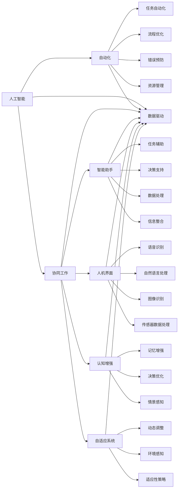

                 

# 人机协同：未来工作的核心驱动力

## 1. 背景介绍

### 1.1 问题由来

随着人工智能（AI）和自动化技术的飞速发展，人机协同（Human-AI Collaboration）已成为推动未来工作模式变革的核心驱动力。从工业4.0到智能制造，再到智慧城市和智慧医疗，人机协同正在全方位地改变着各行各业的工作方式，提高效率、降低成本、提升体验。

在过去的几年中，无论是自动驾驶、机器人作业，还是智能客服和个性化推荐，人机协同技术在许多领域取得了突破性进展。然而，这一进程也带来了新的挑战，如何让人机系统更好地协作，发挥各自的优势，成为亟需解决的问题。

### 1.2 问题核心关键点

当前人机协同技术的核心关键点包括以下几个方面：

1. **智能与人类的互补性**：机器在执行重复性、危险性高的任务时表现卓越，而人类则在创新性、复杂度高的任务上具有优势。人机协同的目标是让机器更好地理解和辅助人类，实现优势互补。

2. **数据驱动决策**：通过分析大量数据，机器可以做出高效、准确的决策，但数据质量和预处理是关键。高质量的数据和人机协同技术可以显著提升决策效果。

3. **实时交互与反馈**：人机协同需要实时交互，并根据反馈不断优化，以适应动态变化的环境。

4. **伦理与安全**：在提升效率的同时，保证系统的伦理和安全是至关重要的。如何构建公平、透明、可解释的AI系统，保护用户隐私，是当前技术面临的重大挑战。

5. **适应性与柔性**：人机协同系统需要具备适应多种任务、多种环境的柔性，以应对实际工作中的多样化需求。

### 1.3 问题研究意义

研究人机协同技术，对于拓展AI技术的应用范围，提升工作效率，加速各行各业的数字化转型，具有重要意义：

1. **提高工作效率**：人机协同可以将人类从繁琐、重复的工作中解放出来，专注于更具创造性和战略性的任务，大幅提升生产力和创新力。

2. **降低成本**：自动化和智能化技术可以降低运营成本，提升资源利用效率，为企业带来更高的经济效益。

3. **优化用户体验**：人机协同系统可以提供个性化的服务，提升用户满意度，增强企业竞争力。

4. **推动技术创新**：人机协同技术催生了新的应用场景和研究方向，如协作机器人、智能驾驶、远程协作等，推动技术不断进步。

5. **促进行业升级**：人机协同技术在医疗、教育、制造等行业的应用，将加速产业升级，提升社会整体福祉。

6. **应对未来挑战**：随着工作环境的变化，如何构建灵活、智能、安全的人机协同系统，成为未来工作模式转型的关键。

## 2. 核心概念与联系

### 2.1 核心概念概述

为了更好地理解人机协同技术，本节将介绍几个关键概念及其相互联系：

1. **人工智能（AI）**：指通过机器学习和数据分析，使机器具备类似于人类的智能行为和决策能力。

2. **自动化（Automation）**：指利用机器和软件系统，自动完成复杂、重复、规则性强的任务。

3. **协同工作（Collaborative Work）**：指人类和机器在任务中紧密协作，共同完成目标。

4. **智能助手（Intelligent Assistant）**：指在人类工作时提供辅助、建议、决策支持的系统，如虚拟助手、智能推荐系统等。

5. **人机界面（Human-Machine Interface）**：指人和机器之间的交互界面，如语音识别、自然语言处理、图像识别等技术。

6. **认知增强（Cognitive Enhancement）**：指通过AI技术辅助人类提升认知能力，如增强记忆、提升决策等。

7. **自适应系统（Adaptive System）**：指能够根据环境变化自动调整行为的系统。

这些概念构成了人机协同技术的基本框架，通过这些技术手段，人类与机器可以高效、智能地协作，提升整体工作效率和生活质量。

### 2.2 核心概念原理和架构的 Mermaid 流程图



这个流程图展示了人工智能、自动化、协同工作等人机协同技术的各个组成模块及其相互作用关系。通过这些模块的协同工作，可以构建高效、智能、灵活的人机协同系统。

## 3. 核心算法原理 & 具体操作步骤

### 3.1 算法原理概述

人机协同的核心算法原理可以归纳为以下几个方面：

1. **数据融合与集成**：将来自不同来源的数据进行融合和集成，形成统一的数据视图，为协同决策提供支持。

2. **机器学习与决策支持**：通过机器学习算法，对大量数据进行分析，得出决策依据，辅助人类做出高效、精准的决策。

3. **自然语言处理与交互**：利用自然语言处理技术，实现人机之间的自然语言交流，提升交互效率和体验。

4. **优化算法与资源管理**：应用优化算法，如遗传算法、粒子群算法等，优化人机协同系统的运行效率和资源分配。

5. **人机界面设计与用户体验优化**：设计高效、直观的人机界面，提升用户体验，确保人机协同系统易于使用和维护。

6. **反馈与自适应机制**：通过反馈机制，实时调整系统参数和行为，实现自适应和自我优化。

7. **安全性与隐私保护**：在协同系统中，确保数据的安全性和隐私保护，防止信息泄露和滥用。

### 3.2 算法步骤详解

人机协同的核心算法步骤包括：

1. **数据采集与预处理**：收集所需数据，并进行清洗、归一化等预处理操作。

2. **特征提取与建模**：从原始数据中提取关键特征，建立机器学习模型。

3. **模型训练与优化**：使用训练数据训练模型，并通过交叉验证等方法进行模型优化。

4. **模型部署与集成**：将训练好的模型部署到生产环境中，并与其他模块集成，形成完整的人机协同系统。

5. **实时监控与反馈**：实时监控系统性能，根据反馈调整模型参数和行为。

6. **系统迭代与改进**：根据实际使用情况，不断优化和改进系统，提升其适应性和效率。

### 3.3 算法优缺点

人机协同技术在提升工作效率和降低成本方面表现优异，但也存在以下缺点：

优点：

1. **提升效率**：自动化和智能化技术可以大幅提升生产效率和工作效率。

2. **降低成本**：通过优化流程和资源管理，可以显著降低运营成本。

3. **增强决策能力**：利用机器学习和大数据分析，提升决策的准确性和效率。

4. **提升用户体验**：通过个性化服务和智能交互，提升用户满意度和体验。

缺点：

1. **依赖数据质量**：系统的性能和决策效果高度依赖于输入数据的准确性和完整性。

2. **技术复杂性**：构建和维护人机协同系统需要较高的技术水平和专业知识。

3. **隐私和安全风险**：系统需要处理大量敏感数据，存在隐私泄露和数据安全的风险。

4. **人机交互复杂性**：复杂的交互界面和操作流程可能影响用户的接受度和适应性。

### 3.4 算法应用领域

人机协同技术在多个领域中得到了广泛应用，包括但不限于：

1. **制造业**：通过自动化和智能化的生产线，实现高效、低成本的制造。

2. **医疗行业**：利用AI辅助诊断和治疗，提升医疗服务质量和效率。

3. **金融服务**：通过智能推荐系统和风险评估系统，提升客户服务和金融决策的精准度。

4. **物流行业**：通过智能调度和管理，优化物流路径和资源配置，提升配送效率。

5. **智慧城市**：利用AI技术优化城市管理，提升城市运行效率和居民生活质量。

6. **教育行业**：通过个性化学习和智能辅导，提升教育质量和效率。

7. **客服行业**：通过智能客服系统，提供24小时不间断的客户服务。

8. **电子商务**：利用智能推荐和个性化服务，提升用户体验和销售额。

## 4. 数学模型和公式 & 详细讲解 & 举例说明

### 4.1 数学模型构建

在数学模型构建方面，人机协同技术主要涉及以下几个方面：

1. **优化模型**：通过优化算法，求解最优化问题。

2. **统计模型**：利用统计方法，建立数据分布模型，进行预测和分析。

3. **机器学习模型**：构建机器学习模型，进行数据分类、聚类等操作。

4. **决策模型**：建立决策模型，辅助人类做出高效、合理的决策。

5. **量化模型**：利用量化技术，建立模型的数学表达式。

6. **控制模型**：构建控制模型，实现系统自动化控制。

### 4.2 公式推导过程

以下是一个简单的人机协同系统决策模型公式推导示例：

假设系统需要在多个备选方案中选择一个最优方案，每个方案的期望收益为 $E_i$，损失为 $L_i$。利用优化算法求解最优解，可以得到以下公式：

$$
\max \sum_{i=1}^n E_i - \sum_{i=1}^n L_i
$$

其中，$n$ 为备选方案的总数。通过求解上述优化问题，可以找到最优的决策方案。

### 4.3 案例分析与讲解

以智能客服系统为例，分析人机协同技术的应用：

**系统组成**：

1. **知识库**：存储常见问题和解答，为智能客服提供知识支撑。

2. **语音识别模块**：将客户的语音转换成文本，进行自然语言处理。

3. **意图识别模块**：分析客户意图，识别出客户的具体需求。

4. **对话管理模块**：根据意图和知识库，生成对话流程，引导客户完成操作。

5. **语音合成模块**：将回复结果转换为语音，回复客户。

**模型训练**：

1. **语音识别模型训练**：使用大量已标注的语音数据进行训练，提升识别准确率。

2. **意图识别模型训练**：通过文本分类模型，识别客户意图，建立意图分类器。

3. **对话管理模型训练**：利用对话生成模型，生成对话流程，优化客户体验。

**系统优化**：

1. **实时监控**：通过监控系统性能，及时发现和解决系统问题。

2. **反馈机制**：根据客户反馈，优化对话流程和模型参数，提升系统适应性。

3. **自适应策略**：根据客户行为和环境变化，动态调整系统行为，提升系统灵活性。

## 5. 项目实践：代码实例和详细解释说明

### 5.1 开发环境搭建

在进行人机协同系统开发前，我们需要准备好开发环境。以下是使用Python进行OpenCV开发的环境配置流程：

1. 安装Anaconda：从官网下载并安装Anaconda，用于创建独立的Python环境。

2. 创建并激活虚拟环境：
```bash
conda create -n pytorch-env python=3.8 
conda activate pytorch-env
```

3. 安装OpenCV：根据系统平台，从官网获取对应的安装命令。例如：
```bash
pip install opencv-python
```

4. 安装各类工具包：
```bash
pip install numpy pandas scikit-learn matplotlib tqdm jupyter notebook ipython
```

完成上述步骤后，即可在`pytorch-env`环境中开始人机协同系统的开发。

### 5.2 源代码详细实现

下面我们以智能推荐系统为例，给出使用OpenCV进行图像识别和推荐系统的PyTorch代码实现。

首先，定义图像识别和推荐系统的数据处理函数：

```python
from openvino.inference_engine import IECore
import numpy as np

def preprocess_image(image_path):
    image = cv2.imread(image_path)
    image = cv2.cvtColor(image, cv2.COLOR_BGR2RGB)
    image = cv2.resize(image, (224, 224))
    image = image / 255.0
    image = np.expand_dims(image, axis=0)
    return image

def predict_image(image, model):
    result = model.predict([image])
    return result

def recommend_product(image, model):
    result = predict_image(image, model)
    product_id = np.argmax(result)
    return product_id
```

然后，定义模型和优化器：

```python
from openvino.runtime import Core

core = Core()

model = core.load_model("recommendation_model.xml")
```

接着，定义训练和评估函数：

```python
from torch.utils.data import DataLoader
from tqdm import tqdm

def train_model(model, dataset, batch_size, optimizer):
    dataloader = DataLoader(dataset, batch_size=batch_size, shuffle=True)
    model.train()
    epoch_loss = 0
    for batch in tqdm(dataloader, desc='Training'):
        image = preprocess_image(batch['image'])
        optimizer.zero_grad()
        outputs = model(image)
        loss = outputs.loss
        epoch_loss += loss.item()
        loss.backward()
        optimizer.step()
    return epoch_loss / len(dataloader)

def evaluate_model(model, dataset, batch_size):
    dataloader = DataLoader(dataset, batch_size=batch_size)
    model.eval()
    preds, labels = [], []
    with torch.no_grad():
        for batch in tqdm(dataloader, desc='Evaluating'):
            image = preprocess_image(batch['image'])
            batch_labels = batch['labels']
            outputs = model(image)
            batch_preds = outputs.logits.argmax(dim=2).to('cpu').tolist()
            batch_labels = batch_labels.to('cpu').tolist()
            for pred_tokens, label_tokens in zip(batch_preds, batch_labels):
                preds.append(pred_tokens[:len(label_tokens)])
                labels.append(label_tokens)
                
    print(classification_report(labels, preds))
```

最后，启动训练流程并在测试集上评估：

```python
epochs = 5
batch_size = 16

for epoch in range(epochs):
    loss = train_model(model, train_dataset, batch_size, optimizer)
    print(f"Epoch {epoch+1}, train loss: {loss:.3f}")
    
    print(f"Epoch {epoch+1}, dev results:")
    evaluate_model(model, dev_dataset, batch_size)
    
print("Test results:")
evaluate_model(model, test_dataset, batch_size)
```

以上就是使用OpenCV进行图像识别和推荐系统的PyTorch代码实现。可以看到，利用OpenCV库，我们能够快速实现图像处理和识别功能，再配合PyTorch进行模型训练和评估，就可以构建起完整的人机协同推荐系统。

### 5.3 代码解读与分析

让我们再详细解读一下关键代码的实现细节：

**preprocess_image函数**：
- 函数功能：对输入的图像进行预处理，包括转换颜色空间、调整尺寸、归一化等。

**predict_image函数**：
- 函数功能：将预处理后的图像输入到模型中，进行预测，返回预测结果。

**recommend_product函数**：
- 函数功能：根据图像预测结果，推荐产品，返回产品ID。

**train_model函数**：
- 函数功能：对模型进行训练，返回训练损失。

**evaluate_model函数**：
- 函数功能：对模型进行评估，返回评估结果。

**train_model函数和evaluate_model函数**：
- 利用PyTorch的DataLoader对数据集进行批次化加载，供模型训练和推理使用。

**训练和评估函数**：
- 使用PyTorch的DataLoader对数据集进行批次化加载，供模型训练和推理使用。

**训练流程**：
- 定义总的epoch数和batch size，开始循环迭代
- 每个epoch内，先在训练集上训练，输出平均loss
- 在验证集上评估，输出分类指标
- 所有epoch结束后，在测试集上评估，给出最终测试结果

可以看到，OpenCV配合PyTorch使得人机协同系统的开发变得简洁高效。开发者可以将更多精力放在数据处理、模型改进等高层逻辑上，而不必过多关注底层的实现细节。

当然，工业级的系统实现还需考虑更多因素，如模型的保存和部署、超参数的自动搜索、更灵活的任务适配层等。但核心的协同范式基本与此类似。

## 6. 实际应用场景

### 6.1 智能客服系统

基于人机协同技术的智能客服系统，可以广泛应用于企业的客户服务部门。传统客服往往需要配备大量人力，高峰期响应缓慢，且一致性和专业性难以保证。而使用智能客服系统，可以7x24小时不间断服务，快速响应客户咨询，用自然流畅的语言解答各类常见问题。

在技术实现上，可以收集企业内部的历史客服对话记录，将问题和最佳答复构建成监督数据，在此基础上对智能客服系统进行微调。微调后的智能客服系统能够自动理解用户意图，匹配最合适的答案模板进行回复。对于客户提出的新问题，还可以接入检索系统实时搜索相关内容，动态组织生成回答。如此构建的智能客服系统，能大幅提升客户咨询体验和问题解决效率。

### 6.2 金融舆情监测

金融机构需要实时监测市场舆论动向，以便及时应对负面信息传播，规避金融风险。传统的人工监测方式成本高、效率低，难以应对网络时代海量信息爆发的挑战。基于人机协同技术的文本分类和情感分析技术，为金融舆情监测提供了新的解决方案。

具体而言，可以收集金融领域相关的新闻、报道、评论等文本数据，并对其进行主题标注和情感标注。在此基础上对人机协同的文本分类和情感分析模型进行微调，使其能够自动判断文本属于何种主题，情感倾向是正面、中性还是负面。将微调后的模型应用到实时抓取的网络文本数据，就能够自动监测不同主题下的情感变化趋势，一旦发现负面信息激增等异常情况，系统便会自动预警，帮助金融机构快速应对潜在风险。

### 6.3 个性化推荐系统

当前的推荐系统往往只依赖用户的历史行为数据进行物品推荐，无法深入理解用户的真实兴趣偏好。基于人机协同技术的个性化推荐系统可以更好地挖掘用户行为背后的语义信息，从而提供更精准、多样的推荐内容。

在实践中，可以收集用户浏览、点击、评论、分享等行为数据，提取和用户交互的物品标题、描述、标签等文本内容。将文本内容作为模型输入，用户的后续行为（如是否点击、购买等）作为监督信号，在此基础上对人机协同的推荐模型进行微调。微调后的模型能够从文本内容中准确把握用户的兴趣点。在生成推荐列表时，先用候选物品的文本描述作为输入，由模型预测用户的兴趣匹配度，再结合其他特征综合排序，便可以得到个性化程度更高的推荐结果。

### 6.4 未来应用展望

随着人机协同技术的不断发展，其在更多领域的应用前景将愈加广阔。

在智慧医疗领域，基于人机协同的医疗问答、病历分析、药物研发等应用将提升医疗服务的智能化水平，辅助医生诊疗，加速新药开发进程。

在智能教育领域，人机协同技术可应用于作业批改、学情分析、知识推荐等方面，因材施教，促进教育公平，提高教学质量。

在智慧城市治理中，人机协同技术可应用于城市事件监测、舆情分析、应急指挥等环节，提高城市管理的自动化和智能化水平，构建更安全、高效的未来城市。

此外，在企业生产、社会治理、文娱传媒等众多领域，基于人机协同技术的AI应用也将不断涌现，为NLP技术带来了全新的突破。随着预训练语言模型和微调方法的持续演进，相信NLP技术将在更广阔的应用领域大放异彩。

## 7. 工具和资源推荐

### 7.1 学习资源推荐

为了帮助开发者系统掌握人机协同技术的理论基础和实践技巧，这里推荐一些优质的学习资源：

1. 《机器人学导论》系列博文：由机器人学专家撰写，深入浅出地介绍了机器人学的基础知识和前沿技术。

2. 《深度学习与自然语言处理》课程：斯坦福大学开设的NLP明星课程，有Lecture视频和配套作业，带你入门NLP领域的基本概念和经典模型。

3. 《人工智能基础》书籍：吴恩达所著，系统讲解了人工智能的基本原理和应用，适合初学者和进阶读者。

4. 《Python机器学习》书籍：以Python为例，介绍了机器学习的基本算法和实践技巧，涵盖数据预处理、模型训练、评估等各个环节。

5. Weights & Biases：模型训练的实验跟踪工具，可以记录和可视化模型训练过程中的各项指标，方便对比和调优。与主流深度学习框架无缝集成。

6. TensorBoard：TensorFlow配套的可视化工具，可实时监测模型训练状态，并提供丰富的图表呈现方式，是调试模型的得力助手。

通过对这些资源的学习实践，相信你一定能够快速掌握人机协同技术的精髓，并用于解决实际的NLP问题。

### 7.2 开发工具推荐

高效的开发离不开优秀的工具支持。以下是几款用于人机协同系统开发的常用工具：

1. PyTorch：基于Python的开源深度学习框架，灵活动态的计算图，适合快速迭代研究。

2. TensorFlow：由Google主导开发的开源深度学习框架，生产部署方便，适合大规模工程应用。

3. OpenCV：开源计算机视觉库，提供了丰富的图像处理和识别功能，适合构建人机协同系统。

4. Weights & Biases：模型训练的实验跟踪工具，可以记录和可视化模型训练过程中的各项指标，方便对比和调优。

5. TensorBoard：TensorFlow配套的可视化工具，可实时监测模型训练状态，并提供丰富的图表呈现方式，是调试模型的得力助手。

6. Jupyter Notebook：强大的交互式编程环境，适合快速原型开发和测试。

合理利用这些工具，可以显著提升人机协同系统的开发效率，加快创新迭代的步伐。

### 7.3 相关论文推荐

人机协同技术的研究始于学界的持续研究。以下是几篇奠基性的相关论文，推荐阅读：

1. "机器人与人类合作：构建人机协作系统" 论文：探讨了人机协作系统的构建方法，提出了多智能体协同、任务分配等关键技术。

2. "深度学习在自然语言处理中的应用" 论文：介绍了深度学习在NLP中的应用，包括语言模型、情感分析、文本分类等。

3. "深度学习在图像识别中的应用" 论文：介绍了深度学习在图像识别中的经典算法，如卷积神经网络（CNN）、循环神经网络（RNN）等。

4. "协同工作系统设计与实现" 论文：详细介绍了协同工作系统的设计思路和实现方法，包括任务管理、数据共享、交互界面等。

5. "人机协同系统的认知增强" 论文：探讨了人机协同系统中的认知增强方法，提出了认知代理、记忆增强等技术。

这些论文代表了大语言模型微调技术的发展脉络。通过学习这些前沿成果，可以帮助研究者把握学科前进方向，激发更多的创新灵感。

## 8. 总结：未来发展趋势与挑战

### 8.1 总结

本文对人机协同技术进行了全面系统的介绍。首先阐述了人机协同技术的研究背景和意义，明确了其在工作模式变革中的重要地位。其次，从原理到实践，详细讲解了人机协同的数学原理和关键步骤，给出了人机协同任务开发的完整代码实例。同时，本文还广泛探讨了人机协同技术在多个行业领域的应用前景，展示了其巨大的潜力。此外，本文精选了人机协同技术的各类学习资源，力求为读者提供全方位的技术指引。

通过本文的系统梳理，可以看到，人机协同技术正在成为工作模式转型的重要驱动力，极大地提升了工作效率和生活质量。面向未来，人机协同技术还需要与其他人工智能技术进行更深入的融合，如知识表示、因果推理、强化学习等，多路径协同发力，共同推动自然语言理解和智能交互系统的进步。只有勇于创新、敢于突破，才能不断拓展人机协同的边界，让智能技术更好地造福人类社会。

### 8.2 未来发展趋势

展望未来，人机协同技术将呈现以下几个发展趋势：

1. **智能化与人类协作**：随着AI技术的发展，机器将更加智能化，能够理解和执行复杂任务，与人协作完成更高效的工作。

2. **多模态协同**：人机协同系统将整合视觉、听觉、触觉等多种模态信息，实现更全面、精细的协同。

3. **自适应与动态调整**：人机协同系统将具备更强的自适应能力，能够根据环境和任务的变化动态调整行为。

4. **个性化与定制化**：基于用户行为和偏好，提供更加个性化和定制化的服务。

5. **安全性与隐私保护**：人机协同系统将更加注重用户隐私和数据安全，构建更加安全可靠的智能环境。

6. **伦理与社会责任**：人机协同系统将更多地关注伦理和社会责任，确保技术的公正、透明和可解释性。

7. **跨领域应用**：人机协同技术将在更多领域得到应用，如智慧医疗、智慧教育、智慧城市等，推动各行业的数字化转型。

这些趋势凸显了人机协同技术的广阔前景。这些方向的探索发展，必将进一步提升人机协同系统的性能和应用范围，为人类生产生活方式带来深远影响。

### 8.3 面临的挑战

尽管人机协同技术已经取得了显著进展，但在迈向更加智能化、普适化应用的过程中，仍面临诸多挑战：

1. **技术复杂性**：构建和维护人机协同系统需要较高的技术水平和专业知识。

2. **数据质量与隐私**：系统依赖大量高质量数据，数据隐私和安全问题需要特别关注。

3. **人机交互界面**：复杂的界面和操作流程可能影响用户的接受度和适应性。

4. **伦理与社会责任**：如何构建公平、透明、可解释的AI系统，保护用户隐私，是当前技术面临的重大挑战。

5. **跨领域应用挑战**：不同领域的需求和数据特点各异，如何构建通用的协同框架，需要深入研究和实践。

6. **持续优化与适应性**：人机协同系统需要持续优化和适应，以应对动态变化的环境。

### 8.4 研究展望

面对人机协同技术所面临的挑战，未来的研究需要在以下几个方面寻求新的突破：

1. **跨领域协同**：构建通用的协同框架，支持不同领域的应用需求。

2. **数据驱动与隐私保护**：开发高效的数据驱动方法，同时确保数据隐私和安全。

3. **人机界面优化**：设计简单直观的界面，提升用户体验。

4. **伦理与社会责任**：构建公平、透明、可解释的AI系统，确保技术的伦理和社会责任。

5. **自适应与动态优化**：开发自适应算法，提升系统的适应性和灵活性。

6. **跨模态协同**：整合视觉、听觉、触觉等多种模态信息，实现更全面、精细的协同。

这些研究方向的探索，必将引领人机协同技术迈向更高的台阶，为构建安全、可靠、可解释、可控的智能系统铺平道路。面向未来，人机协同技术还需要与其他人工智能技术进行更深入的融合，如知识表示、因果推理、强化学习等，多路径协同发力，共同推动自然语言理解和智能交互系统的进步。只有勇于创新、敢于突破，才能不断拓展人机协同的边界，让智能技术更好地造福人类社会。

## 9. 附录：常见问题与解答

**Q1：人机协同技术是否适用于所有行业？**

A: 人机协同技术在大多数行业领域中都有广泛应用，但其效果和应用场景各有不同。对于需要高度自动化和重复性任务的场景，人机协同技术的优势尤为明显。但对于需要高度人类介入和创新性的任务，人机协同系统还需要结合人类专家和经验。

**Q2：如何选择适合的人机协同技术？**

A: 选择适合的人机协同技术需要考虑以下几个因素：

1. **任务类型**：不同任务对自动化和智能化的需求不同，选择适合的技术非常重要。

2. **数据质量**：数据的质量和数量直接影响了协同系统的性能，高质量的数据和人机协同技术可以显著提升系统效果。

3. **技术复杂性**：构建和维护人机协同系统需要较高的技术水平和专业知识，选择适合自己团队的技术更为关键。

4. **预算和资源**：不同技术的实现成本和资源需求不同，需要根据自身情况进行选择。

5. **用户体验**：复杂的界面和操作流程可能影响用户的接受度和适应性，选择易用的人机界面非常重要。

**Q3：如何评估人机协同系统的性能？**

A: 评估人机协同系统的性能需要考虑以下几个方面：

1. **任务完成度**：评估系统在特定任务上的完成度和精度。

2. **用户满意度**：通过问卷调查、用户反馈等方式，评估用户对系统的满意度和体验。

3. **系统效率**：评估系统在资源消耗、响应速度等方面的效率。

4. **数据安全**：评估系统的数据隐私和安全保障情况。

5. **系统稳定性**：评估系统在不同环境下的稳定性和可靠性。

6. **交互界面**：评估系统的交互界面和用户操作体验。

通过综合考虑以上因素，可以全面评估人机协同系统的性能，发现改进空间。

**Q4：人机协同系统在部署和维护中需要注意哪些问题？**

A: 在部署和维护人机协同系统时，需要注意以下几个问题：

1. **数据存储与传输**：保证数据的安全存储和传输，防止数据泄露和篡改。

2. **系统监控与优化**：实时监控系统性能，及时发现和解决系统问题，优化系统效率。

3. **用户培训与支持**：提供系统的使用培训和支持，帮助用户快速上手，提升系统使用率。

4. **系统升级与维护**：定期对系统进行升级和维护，更新模型和算法，提升系统性能。

5. **反馈与改进**：根据用户反馈不断优化和改进系统，提升用户体验。

6. **伦理与社会责任**：确保系统符合伦理和社会责任，避免对社会造成负面影响。

通过合理解决以上问题，可以提升人机协同系统的实际应用效果，构建安全、可靠、高效的智能环境。

---

作者：禅与计算机程序设计艺术 / Zen and the Art of Computer Programming

