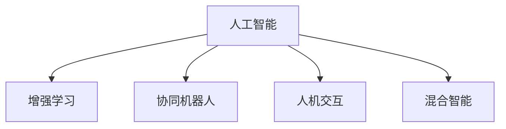

                 

# 人类-AI协作：增强人类潜能和智慧

## 1. 背景介绍

### 1.1 问题由来
在当前这个信息爆炸和科技迅猛发展的时代，人工智能(AI)技术正在全面渗透到各个领域，从医疗、教育到金融、制造，无处不在。然而，AI技术的发展并非仅仅是为了取代人类，而是为了与人类协作，共同提升解决问题的能力。人类-AI协作的核心理念，是通过AI的强大计算能力、数据处理能力和模式识别能力，与人类高度的创造力、情感理解和决策能力相结合，创造出比任何单一智能体都强大的智能系统。

### 1.2 问题核心关键点
人类-AI协作的核心在于充分利用AI和人类的互补优势，实现1+1>2的效果。具体而言，AI在处理大规模数据、识别复杂模式、执行精确计算等方面有着天然的优势；而人类则在创新思维、情感理解、道德判断等方面拥有无可替代的地位。因此，人类-AI协作的目标是使AI能更好地理解和利用人类知识，同时使人类能更高效地利用AI的能力，共同解决复杂的现实问题。

### 1.3 问题研究意义
研究人类-AI协作技术，对于推动人类与AI的深度融合，提升人类社会的整体智慧和效率，具有重要意义：

1. **提升工作效率**：AI可以在重复性、耗时长的任务中发挥优势，释放人类的创造力和注意力，提升整体工作效率。
2. **优化决策质量**：AI可以通过数据分析和模式识别，提供更为全面和准确的决策支持，提升决策质量。
3. **促进创新发展**：AI与人类智慧的结合，可以突破传统思维模式，激发新的创新灵感，推动科学和技术进步。
4. **改善社会福祉**：通过AI技术优化资源配置，提升医疗、教育、交通等领域的服务质量，改善社会福祉。
5. **增强安全性**：AI在网络安全、风险控制等方面的应用，可以提升系统的安全性和稳定性。

## 2. 核心概念与联系

### 2.1 核心概念概述

为了更好地理解人类-AI协作的技术原理和应用方式，本节将介绍几个关键概念：

- **人工智能(Artificial Intelligence, AI)**：通过计算机程序实现的人类智能的模拟，包括感知、推理、学习、决策等功能。
- **增强学习(Reinforcement Learning, RL)**：一种通过奖励和惩罚来训练智能体，使其学习最优策略的学习方式。
- **协同机器人(Collaborative Robotics)**：指在人的指导和监督下，与人类协作完成任务的机器人系统。
- **人机交互(Human-Computer Interaction, HCI)**：研究如何通过计算机系统提供直观、自然的方式，使人类与机器进行有效沟通的技术。
- **混合智能(Hybrid Intelligence)**：结合人类智慧和AI技术的智能系统，可以实现比单一智能更高的智能水平。

这些概念之间的逻辑关系可以通过以下Mermaid流程图来展示：



这个流程图展示了这个领域中几个核心概念及其之间的关系：

1. 人工智能技术提供了实现增强学习、协同机器人和人机交互的基础。
2. 增强学习通过优化决策策略，提高机器人的自主性和效率。
3. 协同机器人通过与人类协作，完成任务，提升系统的实用价值。
4. 人机交互提供了机器与人类沟通的桥梁，增强用户体验。
5. 混合智能则是将人类智慧与AI技术结合，实现更高效、更智能的系统。

## 3. 核心算法原理 & 具体操作步骤
### 3.1 算法原理概述

人类-AI协作技术的核心算法原理，主要基于以下两点：

1. **数据融合与知识提取**：AI能够处理和分析大规模数据，提取有价值的信息和模式，为人类提供决策支持。
2. **智能增强与决策辅助**：AI在复杂环境中执行精确计算和模式识别，辅助人类做出更为精准的决策。

以增强学习为例，其基本流程包括：

- 环境感知：AI系统通过传感器获取环境信息。
- 状态评估：AI系统对环境状态进行评估，选择合适的动作。
- 动作执行：AI系统执行所选动作，影响环境状态。
- 反馈接收：AI系统接收环境反馈，更新策略模型。

这一过程不断迭代，直到达到最优策略。

### 3.2 算法步骤详解

基于增强学习的协作技术，其具体步骤如下：

**Step 1: 数据采集与预处理**
- 收集包含人类知识的数据集，如文本、图像、音频等。
- 对数据进行清洗、标注和格式化处理，确保数据的质量和可用性。

**Step 2: 环境建模**
- 构建环境模型，描述系统与环境之间的交互关系。
- 定义状态空间、动作空间和奖励函数，为AI提供明确的决策依据。

**Step 3: 智能体设计**
- 选择合适的智能体架构，如基于深度学习的神经网络、基于规则的专家系统等。
- 设计智能体的决策算法，如Q-learning、策略梯度等。

**Step 4: 训练与优化**
- 在模拟环境中训练智能体，通过奖励信号引导智能体的学习。
- 不断优化智能体的策略模型，使其在实际应用中表现最优。

**Step 5: 部署与测试**
- 将训练好的智能体部署到实际应用场景中。
- 在真实环境中测试智能体的表现，收集反馈信息。
- 根据反馈信息，进一步优化智能体的性能。

### 3.3 算法优缺点

基于增强学习的协作技术具有以下优点：

1. **灵活性高**：AI可以动态适应环境变化，灵活调整策略。
2. **效率高**：通过智能体的自主学习，大幅提升决策效率。
3. **自适应性强**：AI系统可以根据反馈信息不断优化策略，逐步适应复杂任务。

同时，该方法也存在一定的局限性：

1. **依赖环境建模**：环境模型的准确性直接影响智能体的决策效果。
2. **需要大量数据**：训练过程中需要大量的数据和计算资源。
3. **模型复杂**：智能体的策略模型复杂，需要较强的计算能力。
4. **安全性和可解释性**：AI系统的决策过程缺乏透明度，可能存在安全隐患。

尽管存在这些局限性，但就目前而言，基于增强学习的协作方法仍是在复杂任务中表现突出的重要手段。未来相关研究的重点在于如何进一步提高模型的透明性、自适应性和安全性，同时兼顾效率和灵活性。

### 3.4 算法应用领域

基于增强学习的大模型微调方法，在诸多领域中已经得到了广泛的应用：

- **医疗领域**：通过增强学习训练AI系统进行疾病诊断和治疗方案推荐，提升医疗服务的质量和效率。
- **金融领域**：AI在风险评估、投资策略优化等方面表现出色，帮助金融机构做出更为科学的决策。
- **制造业**：AI与增强学习结合，用于智能生产调度、质量控制、故障预测等，提升生产效率和产品可靠性。
- **教育领域**：AI在个性化教学、智能答疑等方面，结合增强学习进行自适应学习，提升教学效果。
- **交通领域**：AI系统在交通管理、自动驾驶等方面，通过增强学习优化路线规划和决策过程，提升交通效率和安全性。

除了上述这些经典领域，增强学习还被创新性地应用到更多场景中，如智慧城市、智能家居、社交网络分析等，为各个行业带来革命性改变。

## 4. 数学模型和公式 & 详细讲解 & 举例说明

### 4.1 数学模型构建

本节将使用数学语言对基于增强学习的大模型微调过程进行更加严格的刻画。

记智能体为 $A$，环境为 $E$，智能体的策略为 $\pi$，环境的状态为 $s$，智能体的动作为 $a$，环境的奖励为 $r$。则增强学习的目标是通过训练智能体，使其最大化长期累积奖励 $R_{t+\delta}$：

$$
R_{t+\delta} = \sum_{k=0}^{\infty} \gamma^k r_{t+k}
$$

其中 $\gamma$ 为折扣因子。

### 4.2 公式推导过程

以下我们以一个简单的增强学习问题为例，推导Q-learning算法的具体公式。

假设智能体 $A$ 在状态 $s_t$ 时，执行动作 $a_t$，得到环境状态 $s_{t+1}$ 和奖励 $r_t$。智能体的Q函数 $Q(s_t, a_t)$ 表示在状态 $s_t$ 下执行动作 $a_t$ 的长期累积奖励。则Q函数的更新公式为：

$$
Q(s_t, a_t) \leftarrow Q(s_t, a_t) + \alpha [r_t + \gamma \max_{a_{t+1}} Q(s_{t+1}, a_{t+1}) - Q(s_t, a_t)]
$$

其中 $\alpha$ 为学习率。

通过Q-learning算法，智能体能够逐步学习最优策略，最大化长期累积奖励。

### 4.3 案例分析与讲解

以医疗诊断为例，智能体 $A$ 为医疗AI系统，环境 $E$ 为患者的症状描述和历史数据，动作 $a$ 为诊断方案，奖励 $r$ 为诊断结果的准确性。训练过程中，智能体通过不断尝试不同的诊断方案，根据患者的实际病情和诊断结果获得奖励，逐渐学习出最优的诊断策略。

## 5. 项目实践：代码实例和详细解释说明
### 5.1 开发环境搭建

在进行协作技术开发前，我们需要准备好开发环境。以下是使用Python进行PyTorch开发的环境配置流程：

1. 安装Anaconda：从官网下载并安装Anaconda，用于创建独立的Python环境。

2. 创建并激活虚拟环境：
```bash
conda create -n pytorch-env python=3.8 
conda activate pytorch-env
```

3. 安装PyTorch：根据CUDA版本，从官网获取对应的安装命令。例如：
```bash
conda install pytorch torchvision torchaudio cudatoolkit=11.1 -c pytorch -c conda-forge
```

4. 安装TensorBoard：
```bash
pip install tensorboard
```

5. 安装其他依赖：
```bash
pip install numpy pandas scikit-learn gym
```

完成上述步骤后，即可在`pytorch-env`环境中开始协作技术的开发。

### 5.2 源代码详细实现

下面以一个简单的医疗诊断问题为例，给出使用PyTorch和Gym进行增强学习的代码实现。

首先，定义医疗诊断问题的基础环境：

```python
import gym
from gym import spaces

class MedicalDiagnosis(gym.Env):
    def __init__(self, num_symptoms):
        self.num_symptoms = num_symptoms
        self.symptoms = [0] * num_symptoms
        
    def step(self, action):
        # 执行诊断方案，并返回奖励和状态信息
        self.symptoms[action] = 1
        return 1, self.symptoms, False, {}
        
    def reset(self):
        # 重置症状为初始状态
        self.symptoms = [0] * self.num_symptoms
        return self.symptoms

    def render(self):
        # 显示当前症状信息
        print("Current Symptoms: ", self.symptoms)
```

然后，定义Q-learning算法的模型和训练过程：

```python
import torch
from torch import nn
from torch.nn import functional as F

class QNetwork(nn.Module):
    def __init__(self, num_symptoms, hidden_size=32):
        super(QNetwork, self).__init__()
        self.fc1 = nn.Linear(num_symptoms, hidden_size)
        self.fc2 = nn.Linear(hidden_size, num_symptoms)
        
    def forward(self, x):
        x = F.relu(self.fc1(x))
        x = self.fc2(x)
        return x

def q_learning(env, num_episodes=1000, num_symptoms=5, hidden_size=32, learning_rate=0.1, discount_factor=0.9, exploration_rate=0.5):
    model = QNetwork(num_symptoms, hidden_size)
    target_model = QNetwork(num_symptoms, hidden_size)
    
    optimizer = torch.optim.Adam(model.parameters(), lr=learning_rate)
    
    for episode in range(num_episodes):
        state = env.reset()
        done = False
        while not done:
            if exploration_rate > 0 and np.random.rand() < exploration_rate:
                # 随机探索
                action = np.random.randint(num_symptoms)
            else:
                # 根据策略选择动作
                with torch.no_grad():
                    logits = model(torch.tensor(state, dtype=torch.float32))
                    probabilities = F.softmax(logits, dim=0)
                    action = torch.multinomial(probabilities, 1).item()
                
            next_state, reward, done, _ = env.step(action)
            if not done:
                # 更新Q值
                logits = target_model(torch.tensor(next_state, dtype=torch.float32))
                target = reward + discount_factor * torch.max(logits).item()
                optimizer.zero_grad()
                logits = model(torch.tensor(state, dtype=torch.float32))
                loss = F.mse_loss(logits, target)
                loss.backward()
                optimizer.step()
            else:
                target = reward
            
        if episode % 100 == 0:
            print("Episode: {}, State: {}, Action: {}".format(episode, state, action))
            env.render()
            
    print("Final State: {}, Final Action: {}".format(env.reset(), model(torch.tensor(env.symptoms, dtype=torch.float32)).argmax().item()))
```

最后，启动Q-learning训练流程：

```python
env = MedicalDiagnosis(3)
q_learning(env)
```

以上就是使用PyTorch和Gym进行增强学习的完整代码实现。可以看到，借助Gym框架，我们能够方便地定义和模拟复杂的医疗诊断问题，并使用Q-learning算法训练智能体，逐步学习出最优的诊断策略。

### 5.3 代码解读与分析

让我们再详细解读一下关键代码的实现细节：

**MedicalDiagnosis类**：
- `__init__`方法：初始化症状数量和初始状态。
- `step`方法：执行诊断方案，返回奖励和状态信息。
- `reset`方法：重置症状为初始状态。
- `render`方法：显示当前症状信息。

**QNetwork类**：
- `__init__`方法：定义模型结构，包含两个全连接层。
- `forward`方法：前向传播计算Q值。

**q_learning函数**：
- 定义了Q-learning算法的训练过程。
- 初始化Q网络、目标Q网络和优化器。
- 使用Gym环境模拟医疗诊断问题，在每个 episode 内执行诊断方案，并根据奖励更新Q值。
- 每100个episode输出一次当前状态和动作，并调用`env.render()`显示当前症状信息。
- 在训练结束后输出最终状态和动作。

可以看到，Q-learning算法通过不断尝试不同的诊断方案，根据奖励信号调整Q值，逐步学习出最优的诊断策略。

## 6. 实际应用场景
### 6.1 智能医疗
基于增强学习的大模型微调技术，在智能医疗领域有着广泛的应用前景。AI系统可以通过学习医生的诊断经验，辅助医生进行病情诊断和治疗方案推荐，提升医疗服务的效率和准确性。

以癌症诊断为例，AI系统可以通过学习大规模医疗数据，识别出癌症的典型症状和影像特征，在医生给出的初步诊断基础上，通过增强学习优化诊断方案，提供更为精准的治疗建议。此外，AI系统还可以通过学习患者的基因信息和生活习惯，预测癌症的复发风险，提前进行预防和治疗。

### 6.2 智能交通
增强学习技术在智能交通领域同样有着重要的应用。AI系统可以通过学习交通数据，优化交通信号灯的配时方案，减少交通拥堵和事故发生率。此外，AI系统还可以用于自动驾驶、路径规划、智能调度等环节，提升交通系统的智能化水平。

以自动驾驶为例，AI系统可以通过学习历史驾驶数据和交通规则，优化车辆的行驶策略，实现自主驾驶。通过增强学习，AI系统可以逐步学习出最优的驾驶策略，应对复杂多变的道路环境，提升行车的安全性和舒适度。

### 6.3 智能制造
在智能制造领域，增强学习技术可以帮助工厂进行生产调度和质量控制。AI系统可以通过学习生产数据和设备状态，优化生产流程和设备维护策略，提升生产效率和产品质量。

以智能仓储为例，AI系统可以通过学习仓库管理数据和物流信息，优化仓库作业路径和货物调度，减少物料搬运时间和错误率。通过增强学习，AI系统可以逐步学习出最优的作业策略，提升仓储作业的效率和准确性。

### 6.4 未来应用展望

随着增强学习技术的发展，基于AI的协作系统将在更多领域得到应用，为人类社会带来更高效、更智能的服务。

在智慧城市治理中，AI系统可以通过学习城市管理数据，优化城市资源配置和应急响应策略，提升城市的智能化和安全性。例如，AI系统可以通过学习交通流量数据，优化信号灯配时，减少拥堵；通过学习气象数据，提前预警自然灾害，保障城市安全。

在教育领域，AI系统可以通过学习学生学习数据，提供个性化学习推荐和智能答疑，提升学生的学习效果和兴趣。例如，AI系统可以通过学习学生的知识掌握情况和兴趣偏好，推荐适合的学习内容和方法，提升学生的学习效率。

在金融领域，AI系统可以通过学习市场数据和用户行为数据，优化投资策略和风险控制，提升金融服务的质量和效率。例如，AI系统可以通过学习用户的交易数据和风险偏好，推荐适合的投资产品和策略，帮助用户实现财富增值。

## 7. 工具和资源推荐
### 7.1 学习资源推荐

为了帮助开发者系统掌握增强学习技术的原理和应用方法，这里推荐一些优质的学习资源：

1. **《Reinforcement Learning: An Introduction》**：由Richard S. Sutton和Andrew G. Barto所著的经典书籍，系统介绍了增强学习的理论基础和应用方法，是入门必读。
2. **Coursera的Reinforcement Learning Specialization课程**：斯坦福大学David Silver教授开设的课程，包含多个视频讲座和编程作业，适合进一步学习。
3. **DeepMind的AlphaGo论文**：展示了AI在复杂游戏领域的应用，对增强学习的理解有着重要参考价值。
4. **OpenAI的Gym框架**：一个简单易用的环境模拟框架，适合初学者进行增强学习实验。
5. **TensorFlow Agents**：一个基于TensorFlow的增强学习框架，支持多种算法的实现，适合进行大规模实验。

通过对这些资源的学习实践，相信你一定能够快速掌握增强学习技术的精髓，并用于解决实际的智能问题。

### 7.2 开发工具推荐

高效的开发离不开优秀的工具支持。以下是几款用于增强学习开发的常用工具：

1. **PyTorch**：基于Python的开源深度学习框架，灵活的计算图设计，适合快速迭代研究。
2. **TensorFlow**：由Google主导开发的开源深度学习框架，生产部署方便，适合大规模工程应用。
3. **Gym框架**：一个环境模拟框架，提供了丰富的测试环境，适合进行增强学习实验。
4. **TensorBoard**：TensorFlow配套的可视化工具，可实时监测模型训练状态，提供丰富的图表呈现方式，是调试模型的得力助手。
5. **Jupyter Notebook**：一个轻量级的交互式编程环境，方便进行代码调试和实验记录。

合理利用这些工具，可以显著提升增强学习技术的开发效率，加快创新迭代的步伐。

### 7.3 相关论文推荐

增强学习技术的发展源于学界的持续研究。以下是几篇奠基性的相关论文，推荐阅读：

1. **Q-Learning: A New Approach to Reasoning About Number**：D. Watkins和G. Watkins的经典论文，提出了Q-Learning算法，为增强学习提供了基础。
2. **Playing Atari with Deep Reinforcement Learning**：M. A. Levine等人的论文，展示了AI在复杂游戏中的应用，开创了深度强化学习的新时代。
3. **Deep Reinforcement Learning for Atari Games: Towards Human-Level Performance**：I. Goodfellow等人的论文，展示了AI在复杂游戏中的强大表现。
4. **Mastering the Game of Go with Deep Neural Networks and Monte Carlo Tree Search**：D. Silver等人的论文，展示了AI在围棋中的应用，实现了人类级以上的表现。
5. **AlphaGo Zero**：D. Silver等人的论文，展示了无需人类干预的自我对弈训练方法，极大地提升了AI的性能。

这些论文代表了大模型微调技术的发展脉络。通过学习这些前沿成果，可以帮助研究者把握学科前进方向，激发更多的创新灵感。

## 8. 总结：未来发展趋势与挑战
### 8.1 总结

本文对基于增强学习的人类-AI协作技术进行了全面系统的介绍。首先阐述了协作技术的背景和意义，明确了增强学习在利用AI和人类智慧协作中的重要价值。其次，从原理到实践，详细讲解了增强学习的数学模型和核心算法，给出了增强学习任务开发的完整代码实例。同时，本文还广泛探讨了增强学习技术在医疗、交通、制造等多个领域的应用前景，展示了增强学习范式的巨大潜力。此外，本文精选了增强学习技术的各类学习资源，力求为读者提供全方位的技术指引。

通过本文的系统梳理，可以看到，增强学习技术正在成为AI与人类协作的重要手段，极大地拓展了AI技术的应用范围，提升了人类社会的整体智慧和效率。未来，伴随增强学习技术的发展，基于AI的协作系统将更加广泛地应用于各个领域，为人类认知智能的进化带来深远影响。

### 8.2 未来发展趋势

展望未来，增强学习技术将呈现以下几个发展趋势：

1. **多智能体学习**：增强学习技术将逐渐从单智能体学习向多智能体学习演进，实现更复杂多变的环境适应和协同决策。
2. **深度增强学习**：深度学习和增强学习的结合将使得AI系统具备更强的感知和决策能力，提升系统的智能水平。
3. **模型可解释性**：增强学习模型的透明性和可解释性将成为重要研究方向，以便于理解和信任AI系统的决策过程。
4. **自适应学习**：增强学习模型将具备更强的自适应能力，能够实时学习和优化策略，应对动态变化的环境。
5. **跨领域应用**：增强学习技术将在更多领域得到应用，如机器人、智能制造、智慧城市等，为人类社会带来更广泛的变化。

以上趋势凸显了增强学习技术的广阔前景。这些方向的探索发展，必将进一步提升AI系统的智能水平，为人类认知智能的进化带来深远影响。

### 8.3 面临的挑战

尽管增强学习技术已经取得了瞩目成就，但在迈向更加智能化、普适化应用的过程中，它仍面临着诸多挑战：

1. **环境复杂性**：增强学习模型在面对复杂多变的环境时，容易陷入局部最优，无法得到全局最优解。
2. **学习效率**：增强学习模型需要大量的训练时间和数据，限制了其在实时环境中的应用。
3. **模型泛化性**：增强学习模型在面对未见过的数据时，泛化性能较差，容易过拟合。
4. **安全性**：增强学习模型在做出决策时，可能存在安全隐患，如对人类行为的误判或恶意行为。
5. **可解释性**：增强学习模型的决策过程缺乏透明度，难以解释其内部工作机制和决策逻辑。

尽管存在这些挑战，但通过不断的技术创新和改进，相信增强学习技术将不断克服这些困难，迈向更广阔的应用领域。

### 8.4 研究展望

面对增强学习技术面临的挑战，未来的研究需要在以下几个方面寻求新的突破：

1. **多智能体协同**：研究多智能体协同学习的方法，提升系统的决策能力和适应性。
2. **实时学习**：研究实时学习算法，使得增强学习模型能够在动态环境中不断优化策略，保持最优状态。
3. **泛化学习**：研究泛化学习技术，提升模型在未见过的数据上的表现，增强模型的泛化能力。
4. **安全机制**：研究安全机制，确保增强学习模型在做出决策时，不会对人类或环境造成危害。
5. **可解释性增强**：研究增强学习模型的可解释性，提供透明、可解释的决策依据。

这些研究方向的探索，必将引领增强学习技术迈向更高的台阶，为构建安全、可靠、可解释、可控的智能系统铺平道路。面向未来，增强学习技术还需要与其他人工智能技术进行更深入的融合，如知识表示、因果推理、强化学习等，多路径协同发力，共同推动自然语言理解和智能交互系统的进步。只有勇于创新、敢于突破，才能不断拓展语言模型的边界，让智能技术更好地造福人类社会。

## 9. 附录：常见问题与解答

**Q1：什么是增强学习？**

A: 增强学习是一种通过奖励和惩罚来训练智能体，使其学习最优策略的学习方式。智能体在不断尝试不同的动作后，通过奖励信号调整策略，逐步学习出最优的行为模式。

**Q2：增强学习与传统机器学习的区别是什么？**

A: 增强学习与传统机器学习的区别在于，增强学习强调智能体与环境的互动，通过奖励和惩罚来引导智能体的学习。传统机器学习则侧重于对数据进行特征工程和模型训练，不涉及智能体与环境的互动。

**Q3：增强学习有哪些应用场景？**

A: 增强学习技术已经在多个领域得到应用，如自动驾驶、智能游戏、机器人控制、金融投资等。在每个场景中，增强学习都能够通过与环境的互动，学习最优的决策策略，提升系统的智能化水平。

**Q4：增强学习的训练过程中需要注意哪些问题？**

A: 增强学习训练过程中需要注意以下几个问题：
1. 选择合适的奖励函数，确保奖励信号与目标一致。
2. 设计合理的探索和利用策略，平衡模型的探索能力和利用能力。
3. 使用适当的正则化技术，避免模型过拟合。
4. 优化模型的计算效率，降低训练时间和数据需求。
5. 确保模型的可解释性和安全性，提升系统的透明性和可信度。

**Q5：增强学习与人类-AI协作的关系是什么？**

A: 增强学习是实现人类-AI协作的重要手段之一。通过增强学习，AI系统能够在复杂环境中学习最优策略，辅助人类做出更为精准的决策，提升系统的整体智慧和效率。人类-AI协作的核心在于充分利用AI和人类的互补优势，实现1+1>2的效果。

---

作者：禅与计算机程序设计艺术 / Zen and the Art of Computer Programming

