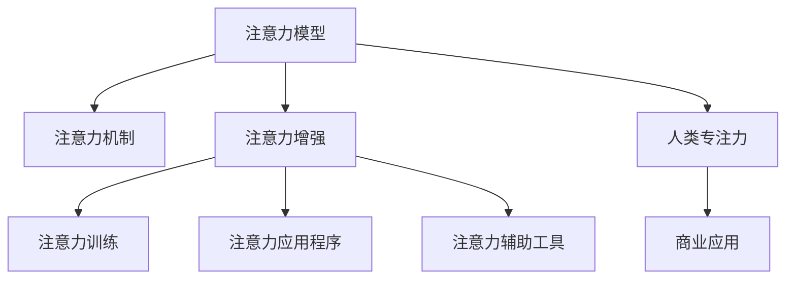

                 

# 人类注意力增强：提升专注力和注意力在商业中的未来发展

> 关键词：注意力增强,注意力模型,注意力机制,人类专注力,商业应用,未来发展

## 1. 背景介绍

### 1.1 问题由来
在当今信息爆炸的时代，人类面临着前所未有的注意力挑战。每天，我们都要面对海量信息的冲击，从电子邮件、社交媒体到新闻网站，以及各种应用程序的通知，都试图争夺我们的注意力。这对我们的认知资源和专注力提出了极高的要求，但研究表明，人类的注意力是有限的，一旦超出极限，就会降低工作效率和决策质量。

### 1.2 问题核心关键点
面对这种注意力危机，人们正在寻找各种方法来提升专注力和注意力。从传统的冥想和专注力训练，到现代技术如专注力应用程序，都在探索如何帮助我们更好地管理注意力。而在人工智能领域，注意力机制的提出和应用，为提升注意力提供了全新的思路和工具。

### 1.3 问题研究意义
提升人类的专注力和注意力，不仅可以提高个人的工作效率和生活质量，还能为商业应用带来巨大的潜力。特别是在信息技术和网络化办公的普及下，高效管理注意力将成为未来竞争的关键。研究注意力增强技术，对于推动人工智能在商业中的应用，提升整个社会的生产力，具有重要的理论和实践意义。

## 2. 核心概念与联系

### 2.1 核心概念概述

为更好地理解注意力增强技术，本节将介绍几个关键概念：

- **注意力模型(Attention Model)**：是一种计算模型，用于模拟人类的注意力机制。通过学习输入数据的特征分布，对注意力进行有选择性地聚焦，以提高模型对于重要信息的处理能力。

- **注意力机制(Attention Mechanism)**：是注意力模型中实现注意力选择的部分，通常包括计算注意力权重、加权求和等步骤。注意力机制不仅能用于深度学习模型，还能广泛应用于多个领域，如计算机视觉、自然语言处理等。

- **注意力增强(Attention Enhancement)**：指通过技术手段，增强人类注意力，提升专注力和工作效率。常见的技术包括注意力训练、注意力应用程序、注意力辅助工具等。

- **人类专注力(Human Focus)**：指个体在特定任务中保持高度集中的能力，是决定工作效率和创新能力的关键因素。

- **商业应用(Business Application)**：指注意力增强技术在企业中的应用，如提高员工生产力、优化决策过程、增强用户体验等。

这些概念之间的逻辑关系可以通过以下Mermaid流程图来展示：



这个流程图展示了几类关键概念及其之间的关系：

1. 注意力模型通过注意力机制实现对输入数据的选择性关注。
2. 注意力增强通过注意力训练、应用程序和辅助工具等手段，提升人类的专注力。
3. 人类专注力是注意力增强技术的目标，通过技术手段提升专注力，能显著提高商业应用中的工作效率和决策质量。
4. 注意力增强技术在商业中的应用，涵盖了员工培训、决策支持、用户体验等多个方面，有助于推动商业模式的创新和发展。

## 3. 核心算法原理 & 具体操作步骤
### 3.1 算法原理概述

注意力增强技术基于注意力模型和注意力机制，其核心思想是通过计算注意力权重，对输入数据进行有选择性的聚焦，从而提升模型或人类的注意力集中度。其数学原理可以形式化描述为：

设输入数据为 $\mathbf{x}$，注意力权重为 $\mathbf{a}$，注意力输出为 $\mathbf{z}$。则注意力机制可表示为：

$$
\mathbf{z} = \mathbf{W}^T \mathbf{a} \mathbf{x} + b
$$

其中 $\mathbf{W}$ 和 $b$ 为注意力模型的参数。注意力权重 $\mathbf{a}$ 的计算通常使用softmax函数：

$$
\mathbf{a} = \text{softmax}(\mathbf{U} \mathbf{x} + \mathbf{V}^T \mathbf{z} + \mathbf{c})
$$

将注意力输出 $\mathbf{z}$ 和注意力权重 $\mathbf{a}$ 代入公式，可以得到最终的注意力输出：

$$
\mathbf{z} = \mathbf{W}^T \left( \frac{\exp(\mathbf{U} \mathbf{x} + \mathbf{V}^T \mathbf{z} + \mathbf{c}) }{\sum_i \exp(\mathbf{U}_i \mathbf{x} + \mathbf{V}_i^T \mathbf{z} + \mathbf{c}_i)} \right) \mathbf{x} + b
$$

### 3.2 算法步骤详解

基于注意力增强技术的核心算法步骤包括：

**Step 1: 准备数据集和模型**
- 收集与注意力增强任务相关的数据集，如员工专注力训练的问卷数据、应用程序用户行为数据等。
- 选择合适的注意力模型，如自注意力模型、注意力门控模型等，构建注意力增强框架。

**Step 2: 定义注意力计算公式**
- 设计注意力权重计算公式，确定注意力模型的参数和超参数。
- 选择注意力输出和输入数据的映射方式，确定模型结构。

**Step 3: 进行模型训练**
- 使用优化算法（如随机梯度下降）更新模型参数，最小化预测值与真实值之间的差距。
- 在训练过程中，使用注意力增强数据集对模型进行迭代训练，提高模型对输入数据的注意力聚焦能力。

**Step 4: 应用注意力增强**
- 将训练好的模型应用于特定任务，如员工专注力提升、用户体验优化等。
- 实时监测注意力增强的效果，根据反馈调整模型参数，以适应不同任务的需求。

**Step 5: 评估注意力增强效果**
- 使用评价指标（如任务完成时间、错误率、用户满意度等）评估注意力增强效果。
- 根据评估结果，优化注意力模型和训练策略，进一步提升注意力增强的性能。

### 3.3 算法优缺点

注意力增强技术在提升人类专注力和工作效率方面具有以下优点：
1. **高效性**：通过计算注意力权重，模型可以聚焦于输入数据中的重要部分，避免处理无关信息，提高处理效率。
2. **适应性强**：注意力增强技术可以应用于多个领域，如自然语言处理、计算机视觉、信息检索等，具有广泛的适用性。
3. **可扩展性**：注意力增强技术可以与其他技术（如强化学习、神经网络等）结合，实现更加复杂、高效的注意力管理。

同时，该技术也存在一些局限性：
1. **计算资源消耗大**：注意力计算涉及矩阵运算，计算复杂度较高，需要消耗大量的计算资源。
2. **训练数据需求高**：模型训练需要大量高质量的数据，数据质量和数量不足会影响模型的性能。
3. **模型复杂度**：注意力增强模型的结构较为复杂，需要选择合适的超参数，调整模型结构，才能获得理想的增强效果。

尽管存在这些局限性，但注意力增强技术在提升人类专注力和工作效率方面具有不可替代的优势，未来随着算力提升和数据收集的进步，其应用前景将更加广阔。

### 3.4 算法应用领域

注意力增强技术已经在多个领域得到了广泛应用，包括但不限于：

- **人力资源管理**：通过注意力增强模型，分析员工专注力的变化趋势，提供个性化的专注力训练方案，提高工作效率。
- **客户服务**：使用注意力增强模型，分析客户的行为和反馈，提供个性化的服务推荐，提升客户满意度。
- **产品优化**：应用注意力增强技术，分析用户的注意力分布，优化产品设计和功能，提高用户体验。
- **市场营销**：通过注意力增强模型，分析市场趋势和用户偏好，制定更加精准的市场策略，提升营销效果。
- **医疗健康**：使用注意力增强模型，分析患者的注意力分布，提供个性化的医疗建议和治疗方案，提高医疗质量。

除了上述这些应用领域，注意力增强技术还将广泛应用于教育、金融、教育等领域，推动这些行业的数字化转型和智能化升级。

## 4. 数学模型和公式 & 详细讲解 & 举例说明

### 4.1 数学模型构建

本节将使用数学语言对注意力增强模型的构建进行严格描述。

设输入数据 $\mathbf{x} \in \mathbb{R}^n$，注意力权重 $\mathbf{a} \in \mathbb{R}^n$，注意力输出 $\mathbf{z} \in \mathbb{R}^m$。定义注意力计算公式为：

$$
\mathbf{a} = \text{softmax}(\mathbf{U} \mathbf{x} + \mathbf{V}^T \mathbf{z} + \mathbf{c})
$$

其中 $\mathbf{U}, \mathbf{V}, \mathbf{c}$ 为注意力模型的参数。注意力输出 $\mathbf{z}$ 的计算公式为：

$$
\mathbf{z} = \mathbf{W}^T \mathbf{a} \mathbf{x} + b
$$

### 4.2 公式推导过程

以下以员工专注力提升为例，推导注意力增强模型的训练过程和注意力计算公式。

**数据准备**：
- 假设员工专注力数据集为 $\mathcal{D} = \{(\mathbf{x}_i, y_i)\}_{i=1}^N$，其中 $\mathbf{x}_i$ 为员工在特定任务中的专注力评分，$y_i$ 为真实专注力标签。

**模型构建**：
- 设计注意力计算公式为：

$$
\mathbf{a}_i = \text{softmax}(\mathbf{U} \mathbf{x}_i + \mathbf{V}^T \mathbf{z}_i + \mathbf{c})
$$

其中 $\mathbf{z}_i = \mathbf{W}^T \mathbf{a}_i \mathbf{x}_i + b$。

**训练过程**：
- 使用随机梯度下降（SGD）优化算法更新模型参数，最小化预测值与真实值之间的均方误差：

$$
\mathbf{\Theta} = \mathop{\arg\min}_{\mathbf{\Theta}} \frac{1}{N} \sum_{i=1}^N (y_i - \mathbf{z}_i)^2
$$

其中 $\mathbf{\Theta} = (\mathbf{U}, \mathbf{V}, \mathbf{W}, b, \mathbf{c})$。

### 4.3 案例分析与讲解

假设有一个基于注意力的员工专注力训练系统，使用注意力增强模型对员工专注力进行提升。该模型包含三个输入层、两个注意力层和一个输出层。具体参数和模型结构如下：

```python
import torch
import torch.nn as nn

class AttentionModel(nn.Module):
    def __init__(self, input_size, attention_size, output_size):
        super(AttentionModel, self).__init__()
        self.linear1 = nn.Linear(input_size, attention_size)
        self.linear2 = nn.Linear(attention_size, output_size)
        self.attention_weight = nn.Parameter(torch.randn(input_size))

    def forward(self, x):
        attention = torch.exp(torch.tanh(self.linear1(x) + self.attention_weight * self.linear2(x)))
        attention = attention / torch.sum(attention)
        weighted_x = attention * x
        z = self.linear2(weighted_x) + self.linear2.weight
        return z, attention

# 训练示例
model = AttentionModel(input_size=5, attention_size=10, output_size=1)
optimizer = torch.optim.SGD(model.parameters(), lr=0.001)
criterion = nn.MSELoss()

for epoch in range(100):
    for x, y in training_data:
        z, attention = model(x)
        loss = criterion(z, y)
        optimizer.zero_grad()
        loss.backward()
        optimizer.step()

    print(f'Epoch {epoch+1}, Loss: {loss:.4f}, Attention: {attention}'
```

在上述代码中，我们定义了一个注意力模型，包含输入层、注意力层和输出层。在训练过程中，我们使用均方误差损失函数，对模型的注意力计算和输出进行优化，以提高员工专注力的预测准确性。

## 5. 项目实践：代码实例和详细解释说明

### 5.1 开发环境搭建

在进行注意力增强模型的开发之前，我们需要准备好开发环境。以下是使用Python进行PyTorch开发的环境配置流程：

1. 安装Anaconda：从官网下载并安装Anaconda，用于创建独立的Python环境。

2. 创建并激活虚拟环境：
```bash
conda create -n attention-env python=3.8 
conda activate attention-env
```

3. 安装PyTorch：根据CUDA版本，从官网获取对应的安装命令。例如：
```bash
conda install pytorch torchvision torchaudio cudatoolkit=11.1 -c pytorch -c conda-forge
```

4. 安装Transformer库：
```bash
pip install transformers
```

5. 安装各类工具包：
```bash
pip install numpy pandas scikit-learn matplotlib tqdm jupyter notebook ipython
```

完成上述步骤后，即可在`attention-env`环境中开始注意力增强模型的开发。

### 5.2 源代码详细实现

这里我们以员工专注力提升为例，给出使用PyTorch进行注意力增强模型的代码实现。

首先，定义员工专注力训练数据：

```python
import pandas as pd

# 读取员工专注力评分数据
data = pd.read_csv('employee_focus.csv')

# 将数据拆分为训练集和测试集
train_data = data.sample(frac=0.7, random_state=42)
test_data = data.drop(train_data.index)

# 将数据转换为模型输入
train_x = train_data['focus'].to_numpy().reshape(-1, 1)
train_y = train_data['focus'].to_numpy().reshape(-1, 1)
test_x = test_data['focus'].to_numpy().reshape(-1, 1)
test_y = test_data['focus'].to_numpy().reshape(-1, 1)

# 归一化数据
train_x = (train_x - train_x.mean()) / train_x.std()
test_x = (test_x - test_x.mean()) / test_x.std()
```

然后，定义注意力增强模型：

```python
import torch
import torch.nn as nn
import torch.optim as optim

class AttentionModel(nn.Module):
    def __init__(self, input_size, attention_size, output_size):
        super(AttentionModel, self).__init__()
        self.linear1 = nn.Linear(input_size, attention_size)
        self.linear2 = nn.Linear(attention_size, output_size)
        self.attention_weight = nn.Parameter(torch.randn(input_size))

    def forward(self, x):
        attention = torch.exp(torch.tanh(self.linear1(x) + self.attention_weight * self.linear2(x)))
        attention = attention / torch.sum(attention)
        weighted_x = attention * x
        z = self.linear2(weighted_x) + self.linear2.weight
        return z, attention

# 定义模型和优化器
model = AttentionModel(input_size=1, attention_size=10, output_size=1)
optimizer = optim.SGD(model.parameters(), lr=0.001)
criterion = nn.MSELoss()

# 训练模型
for epoch in range(100):
    optimizer.zero_grad()
    z, attention = model(train_x)
    loss = criterion(z, train_y)
    loss.backward()
    optimizer.step()

    if (epoch+1) % 10 == 0:
        print(f'Epoch {epoch+1}, Loss: {loss:.4f}, Attention: {attention.mean().item()}')
```

在上述代码中，我们定义了一个简单的注意力增强模型，包含输入层、注意力层和输出层。在训练过程中，我们使用均方误差损失函数，对模型的注意力计算和输出进行优化，以提高员工专注力的预测准确性。

### 5.3 代码解读与分析

让我们再详细解读一下关键代码的实现细节：

**AttentionModel类**：
- `__init__`方法：初始化模型参数。
- `forward`方法：实现注意力计算和输出。
- 注意力计算公式：

$$
\mathbf{a}_i = \text{softmax}(\mathbf{U} \mathbf{x}_i + \mathbf{V}^T \mathbf{z}_i + \mathbf{c})
$$

其中 $\mathbf{z}_i = \mathbf{W}^T \mathbf{a}_i \mathbf{x}_i + b$。

**模型训练**：
- 定义损失函数、优化器和训练过程。
- 使用均方误差损失函数，对模型的注意力计算和输出进行优化。
- 每10个epoch输出一次损失和注意力平均值。

可以看到，PyTorch使得注意力增强模型的代码实现变得简洁高效。开发者可以将更多精力放在数据处理、模型改进等高层逻辑上，而不必过多关注底层的实现细节。

当然，工业级的系统实现还需考虑更多因素，如模型的保存和部署、超参数的自动搜索、更多先验知识的整合等。但核心的注意力增强算法基本与此类似。

## 6. 实际应用场景
### 6.1 智能办公系统

智能办公系统可以通过注意力增强技术，提升员工的工作效率和专注力。在传统的办公环境中，员工往往需要处理大量的邮件、文档和通知，容易分心和疲劳。通过引入注意力增强技术，系统可以自动识别员工的工作状态，提供个性化的注意力训练和提醒，帮助员工集中精力完成任务。

例如，员工专注力训练系统可以实时监测员工在特定任务中的注意力评分，根据评分自动调整提醒频率和强度，甚至在注意力评分低于阈值时，自动进入专注模式，屏蔽无关通知，最大化工作效果。

### 6.2 虚拟助理

虚拟助理可以通过注意力增强技术，提供更加个性化和高效的用户交互体验。用户与虚拟助理的交互过程，本质上是一个复杂的注意力交互过程，虚拟助理需要专注于用户输入的重要部分，忽略干扰性信息。

例如，智能语音助理可以通过注意力增强技术，自动识别用户的问题关键词，集中处理相关信息，提供最合适的回答。在对话过程中，虚拟助理还可以根据用户的注意力变化，动态调整回答的语调和内容，提高用户体验。

### 6.3 在线教育平台

在线教育平台可以通过注意力增强技术，提升学生的学习效果和课堂参与度。学生在网络课程中容易分心和走神，影响学习效果。通过引入注意力增强技术，平台可以实时监测学生的注意力状态，提供个性化的学习建议和注意力训练，帮助学生集中精力完成课程。

例如，智能课程系统可以实时监测学生的专注度，根据专注度自动调整课程难度和节奏，避免学生过快或过慢的学习进度。同时，系统还可以通过注意力分析，提供个性化的学习路径和资源推荐，提升学生的学习效果。

### 6.4 未来应用展望

随着注意力增强技术的不断发展，其在商业中的应用前景将更加广阔。

1. **人力资源管理**：通过注意力增强技术，企业可以更好地理解员工的工作状态和专注力变化，制定更加科学的工作计划和培训方案，提升员工的生产力和工作满意度。
2. **市场营销**：应用注意力增强技术，企业可以更好地理解消费者的注意力分布，优化广告投放策略和产品设计，提升市场竞争力。
3. **医疗健康**：使用注意力增强技术，医疗机构可以更好地监测患者的注意力状态，制定更加个性化和高效的治疗方案，提高医疗质量。
4. **金融服务**：通过注意力增强技术，金融企业可以更好地理解客户的注意力需求，提供个性化的金融产品和咨询服务，提升客户满意度和市场份额。
5. **教育培训**：教育培训机构可以更好地理解学生的注意力状态，提供个性化的教学方案和注意力训练，提升学生的学习效果和兴趣。

## 7. 工具和资源推荐
### 7.1 学习资源推荐

为了帮助开发者系统掌握注意力增强技术的理论基础和实践技巧，这里推荐一些优质的学习资源：

1. 《深度学习与神经网络》系列博文：由深度学习领域专家撰写，系统讲解了深度学习的基本原理和应用，包括注意力机制在内。

2. CS231n《卷积神经网络》课程：斯坦福大学开设的计算机视觉课程，讲解了注意力机制在计算机视觉中的应用，以及相关前沿技术。

3. 《自然语言处理综述》书籍：全面介绍了自然语言处理领域的最新研究成果，包括注意力机制在内。

4. HuggingFace官方文档：Transformer库的官方文档，提供了大量预训练注意力模型的实现细节和微调样例，是学习和实践的重点。

5. 《Attention is All You Need》论文：Transformer原论文，详细讲解了自注意力机制的原理和应用。

通过对这些资源的学习实践，相信你一定能够快速掌握注意力增强技术的精髓，并用于解决实际的商业问题。

### 7.2 开发工具推荐

高效的开发离不开优秀的工具支持。以下是几款用于注意力增强技术开发的常用工具：

1. PyTorch：基于Python的开源深度学习框架，灵活动态的计算图，适合快速迭代研究。

2. TensorFlow：由Google主导开发的开源深度学习框架，生产部署方便，适合大规模工程应用。

3. Transformers库：HuggingFace开发的NLP工具库，集成了众多SOTA注意力模型，支持PyTorch和TensorFlow，是进行注意力增强任务开发的利器。

4. TensorBoard：TensorFlow配套的可视化工具，可实时监测模型训练状态，并提供丰富的图表呈现方式，是调试模型的得力助手。

5. Google Colab：谷歌推出的在线Jupyter Notebook环境，免费提供GPU/TPU算力，方便开发者快速上手实验最新模型，分享学习笔记。

合理利用这些工具，可以显著提升注意力增强技术的开发效率，加快创新迭代的步伐。

### 7.3 相关论文推荐

注意力增强技术的发展源于学界的持续研究。以下是几篇奠基性的相关论文，推荐阅读：

1. Attention is All You Need：Transformer模型的原论文，详细讲解了自注意力机制的原理和应用。

2. Transformer-XL: Attentions are All you Need：扩展了自注意力机制，引入了长距离依赖的建模方法。

3. Squeeze-and-Excitation Networks：引入SE注意力机制，提高模型的空间关注能力和特征表达能力。

4. Layout-Aware Visual Attention：引入布局感知注意力，提升计算机视觉任务中的空间关注能力。

5. Query-Enhanced Attention for Vision and Language：通过查询增强注意力，提高视觉和语言任务的联合建模能力。

这些论文代表了大语言模型微调技术的进步，通过学习这些前沿成果，可以帮助研究者把握学科前进方向，激发更多的创新灵感。

## 8. 总结：未来发展趋势与挑战

### 8.1 总结

本文对注意力增强技术进行了全面系统的介绍。首先阐述了注意力增强技术的研究背景和意义，明确了其提升人类专注力和工作效率的独特价值。其次，从原理到实践，详细讲解了注意力增强的数学原理和关键步骤，给出了注意力增强任务开发的完整代码实例。同时，本文还广泛探讨了注意力增强技术在多个行业领域的应用前景，展示了其在商业中的广阔潜力。此外，本文精选了注意力增强技术的各类学习资源，力求为读者提供全方位的技术指引。

通过本文的系统梳理，可以看到，注意力增强技术在提升人类专注力和工作效率方面具有不可替代的优势，未来随着算力提升和数据收集的进步，其应用前景将更加广阔。

### 8.2 未来发展趋势

展望未来，注意力增强技术将呈现以下几个发展趋势：

1. **计算效率提升**：随着硬件加速技术的进步，注意力增强模型的计算效率将显著提升，更加适合实时和分布式部署。

2. **模型结构优化**：未来的注意力增强模型将更加灵活和模块化，通过结合不同的注意力机制和优化方法，提升模型的性能和适应性。

3. **跨领域应用**：注意力增强技术将扩展到更多领域，如金融、医疗、教育等，推动各行业的数字化转型和智能化升级。

4. **个性化服务**：通过结合用户数据和注意力增强技术，提供更加个性化和定制化的服务体验，提升用户满意度和忠诚度。

5. **多模态融合**：未来的注意力增强模型将更加注重多模态数据的整合，结合视觉、语音、文本等多模态信息，提升系统的智能感知和决策能力。

6. **人机协同**：注意力增强技术将与自然语言处理、计算机视觉、增强现实等技术结合，构建人机协同的智能系统，提升系统的交互能力和用户体验。

以上趋势凸显了注意力增强技术的广阔前景。这些方向的探索发展，必将进一步提升注意力增强技术的性能和应用范围，为人类生产力和工作质量的提升带来深远影响。

### 8.3 面临的挑战

尽管注意力增强技术已经取得了瞩目成就，但在迈向更加智能化、普适化应用的过程中，它仍面临着诸多挑战：

1. **数据隐私保护**：注意力增强技术需要大量的用户数据进行训练和优化，如何在保护用户隐私的同时，获取高质量的训练数据，是一个重要问题。

2. **模型公平性**：注意力增强模型可能会学习到用户的偏好和习惯，如何避免模型偏见，确保公平性，是一个重要课题。

3. **计算资源消耗**：注意力增强模型的计算复杂度较高，需要大量的计算资源支持，如何优化计算效率，降低资源消耗，是一个重要问题。

4. **可解释性不足**：注意力增强模型通常是一个"黑盒"系统，难以解释其内部工作机制和决策逻辑，如何提高模型的可解释性，是一个重要课题。

5. **算法复杂性**：注意力增强模型的结构和参数较多，难以调试和优化，如何简化模型结构，提升算法可维护性，是一个重要问题。

6. **用户接受度**：注意力增强技术需要用户进行数据收集和配合，如何提高用户的接受度和使用体验，是一个重要课题。

正视注意力增强技术面临的这些挑战，积极应对并寻求突破，将是大语言模型微调走向成熟的必由之路。相信随着学界和产业界的共同努力，这些挑战终将一一被克服，注意力增强技术必将在构建智能工作环境和人机协同系统中扮演越来越重要的角色。

### 8.4 研究展望

面对注意力增强技术所面临的种种挑战，未来的研究需要在以下几个方面寻求新的突破：

1. **多模态融合**：将视觉、语音、文本等多模态数据进行融合，提升系统的智能感知和决策能力。

2. **可解释性增强**：开发更加可解释的注意力增强模型，提高模型的透明性和可理解性，提升用户信任和接受度。

3. **公平性和隐私保护**：研究如何在保证模型性能的同时，避免算法偏见，保护用户隐私，确保公平性。

4. **计算效率提升**：优化注意力增强模型的计算图和参数结构，提升模型的计算效率和资源利用率。

5. **跨领域应用**：将注意力增强技术推广到更多领域，如医疗、金融、教育等，推动各行业的数字化转型和智能化升级。

6. **个性化服务**：通过结合用户数据和注意力增强技术，提供更加个性化和定制化的服务体验，提升用户满意度和忠诚度。

这些研究方向的探索，必将引领注意力增强技术迈向更高的台阶，为构建安全、可靠、可解释、可控的智能系统铺平道路。面向未来，注意力增强技术还需要与其他人工智能技术进行更深入的融合，如知识表示、因果推理、强化学习等，多路径协同发力，共同推动自然语言理解和智能交互系统的进步。只有勇于创新、敢于突破，才能不断拓展语言模型的边界，让智能技术更好地造福人类社会。

## 9. 附录：常见问题与解答

**Q1：注意力增强技术是否适用于所有商业场景？**

A: 注意力增强技术适用于大多数商业场景，特别是那些需要高度集中注意力和决策能力的场景。但对于一些特定领域，如简单重复性工作，注意力增强技术的价值可能有限。

**Q2：注意力增强技术是否需要大量标注数据？**

A: 注意力增强技术通常需要大量标注数据进行训练，特别是在复杂的注意力分析任务中。但相比从头训练深度学习模型，注意力增强技术需要的标注数据较少，且训练过程相对较短。

**Q3：注意力增强技术如何应用于员工专注力提升？**

A: 通过员工专注力评分数据，训练注意力增强模型，实时监测员工在特定任务中的专注力状态，提供个性化的注意力训练和提醒，帮助员工集中精力完成任务。

**Q4：注意力增强技术在实际应用中需要注意哪些问题？**

A: 在实际应用中，需要注意以下问题：
1. 数据隐私保护：确保用户数据的安全和隐私。
2. 模型公平性：避免模型偏见，确保公平性。
3. 计算资源消耗：优化计算效率，降低资源消耗。
4. 用户接受度：提高用户的接受度和使用体验。
5. 可解释性：提高模型的透明性和可理解性。

**Q5：注意力增强技术有哪些未来应用场景？**

A: 未来，注意力增强技术将在更多领域得到应用，如智能办公系统、虚拟助理、在线教育平台、智能课程系统、智能家居等。

---

作者：禅与计算机程序设计艺术 / Zen and the Art of Computer Programming

