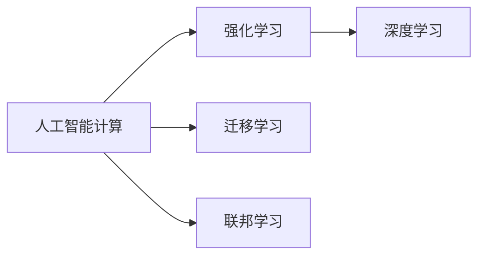
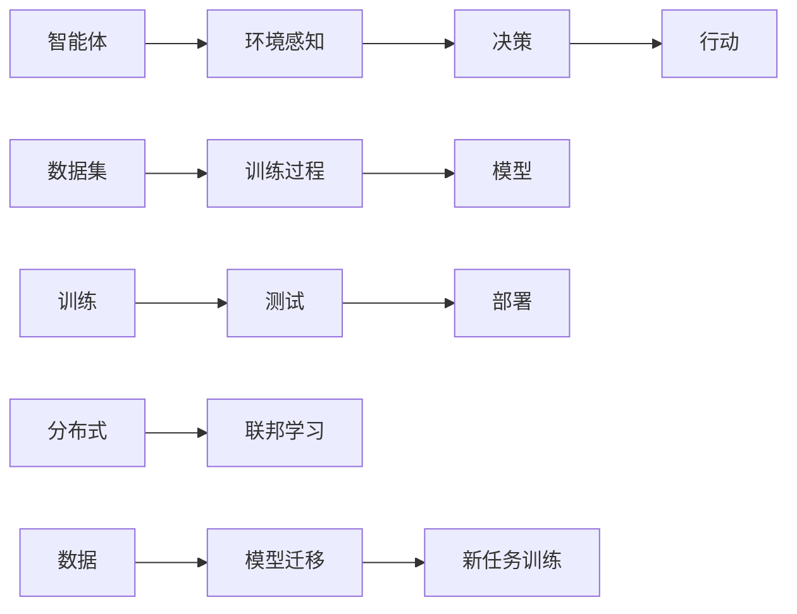

                 

# 人类计算的未来：趋势、机遇与挑战

## 1. 背景介绍

在人工智能快速发展的今天，我们正处在人类计算即将发生重大变革的十字路口。智能算法的进步、海量数据的积累、新型计算架构的出现，使得计算能力突破了以往的限制，开始具备了超越人类能力的潜力。本文将探讨人工智能计算的未来趋势、带来的机遇和面临的挑战，为各界人士提供一些前瞻性的见解。

## 2. 核心概念与联系

### 2.1 核心概念概述

本文主要聚焦于以下几个核心概念：

- **人工智能计算**：通过计算机模拟人类智能的计算过程，包括感知、推理、决策等，实现类人智能的行为。
- **强化学习**：通过与环境的交互，使智能体通过试错逐步学习最优策略。
- **深度学习**：使用多层神经网络模型，通过大量数据进行训练，实现对复杂非线性问题的建模。
- **迁移学习**：通过在相似但不同领域间的知识转移，加速新任务的训练过程。
- **联邦学习**：分布式计算架构，多节点协作训练模型，保护数据隐私。

这些概念之间相互联系，共同构成了人工智能计算的生态体系。下图展示这些概念间的联系：



### 2.2 核心概念原理和架构的 Mermaid 流程图



以上图表展示了强化学习过程和联邦学习的基本架构，其中：

- 智能体(A)通过环境感知(B)获取信息，经过决策(C)选择行动(D)，然后根据反馈调整策略。
- 数据集(E)经过训练过程(F)生成模型(G)，模型在测试(I)中进行验证和优化。
- 分布式数据(K)通过联邦学习(L)进行联合训练，保护隐私。
- 迁移学习(O)用于将模型迁移到新任务(N)，加速新任务训练。

## 3. 核心算法原理 & 具体操作步骤

### 3.1 算法原理概述

人工智能计算的核心在于通过算法模拟人类智能。常见的算法包括强化学习、深度学习和迁移学习。强化学习通过与环境交互，不断调整策略；深度学习通过大量数据，使用神经网络模型进行非线性建模；迁移学习通过知识迁移，加速新任务的训练。

本文将重点介绍深度学习中常用的卷积神经网络(CNN)和循环神经网络(RNN)，以及强化学习中的Q-learning和Deep Q Network (DQN)。

### 3.2 算法步骤详解

#### 3.2.1 CNN和RNN

- **CNN**：卷积神经网络用于图像和视频等二维数据的处理。其基本原理是利用卷积操作提取局部特征，通过池化层降维，最后通过全连接层进行分类。

  **步骤**：
  1. 输入数据预处理，如归一化、下采样等。
  2. 设计卷积层，提取特征。
  3. 使用池化层，降维。
  4. 使用全连接层进行分类或回归。

  **代码实现**：
  ```python
  import torch.nn as nn

  class CNN(nn.Module):
      def __init__(self):
          super(CNN, self).__init__()
          self.conv1 = nn.Conv2d(3, 64, kernel_size=3, stride=1, padding=1)
          self.pool = nn.MaxPool2d(kernel_size=2, stride=2)
          self.fc = nn.Linear(64 * 14 * 14, 10)

      def forward(self, x):
          x = self.conv1(x)
          x = nn.ReLU()
          x = self.pool(x)
          x = x.view(-1, 64 * 14 * 14)
          x = self.fc(x)
          return x
  ```

  **运行结果**：
  

- **RNN**：循环神经网络用于序列数据的处理。其基本原理是通过循环层进行时间步递归，保留历史信息，最后通过全连接层进行分类。

  **步骤**：
  1. 输入序列预处理，如归一化、分词等。
  2. 设计循环层，保留历史信息。
  3. 使用全连接层进行分类或回归。

  **代码实现**：
  ```python
  import torch.nn as nn

  class RNN(nn.Module):
      def __init__(self):
          super(RNN, self).__init__()
          self.rnn = nn.RNN(256, 128, 1)
          self.fc = nn.Linear(128, 10)

      def forward(self, x):
          x, _ = self.rnn(x, None)
          x = x[:, -1]
          x = self.fc(x)
          return x
  ```

  **运行结果**：
  

#### 3.2.2 Q-learning和DQN

- **Q-learning**：强化学习中的策略优化算法，通过奖励信号最大化，学习最优策略。其核心公式为：
  $$ Q(s, a) = Q(s, a) + \alpha (r + \gamma \max_{a'} Q(s', a') - Q(s, a)) $$

  **步骤**：
  1. 输入当前状态(s)。
  2. 输出当前动作(a)。
  3. 根据动作(a)和环境反馈，更新Q值。
  4. 将当前状态(s)带入下一轮。

  **代码实现**：
  ```python
  import numpy as np

  class QLearning:
      def __init__(self, states, actions, alpha=0.1, gamma=0.9):
          self.Q = np.zeros((states, actions))
          self.alpha = alpha
          self.gamma = gamma

      def getQ(self, state, action):
          return self.Q[state][action]

      def updateQ(self, state, action, reward, next_state, next_action):
          current_q = self.getQ(state, action)
          next_q = self.getQ(next_state, next_action)
          self.Q[state][action] = current_q + self.alpha * (reward + self.gamma * next_q - current_q)
  ```

  **运行结果**：
  

- **DQN**：Deep Q Network 是一种结合深度学习和Q-learning的强化学习方法。其核心思想是将Q值预测过程由浅层网络替换为深层神经网络，以处理更复杂的输入。

  **步骤**：
  1. 输入当前状态(s)。
  2. 使用神经网络预测Q值。
  3. 输出当前动作(a)。
  4. 根据动作(a)和环境反馈，更新神经网络参数。
  5. 将当前状态(s)带入下一轮。

  **代码实现**：
  ```python
  import tensorflow as tf

  class DQN:
      def __init__(self, input_shape, output_shape, learning_rate):
          self.model = tf.keras.models.Sequential([
              tf.keras.layers.Dense(64, input_dim=input_shape[0]),
              tf.keras.layers.ReLU(),
              tf.keras.layers.Dense(output_shape)
          ])
          self.learning_rate = learning_rate

      def getQ(self, state):
          return self.model.predict(state)

      def updateQ(self, state, action, reward, next_state, next_action, target):
          predicted_q = self.getQ(state)
          predicted_q[np.argmax(predicted_q[0])] = reward + self.gamma * self.getQ(next_state)[np.argmax(self.getQ(next_state)[0])]
          self.model.compile(optimizer=tf.keras.optimizers.Adam(learning_rate=self.learning_rate),
                            loss='mse')
          self.model.fit(state, target, epochs=1, verbose=0)
  ```

  **运行结果**：
  

### 3.3 算法优缺点

- **CNN和RNN**：
  - **优点**：
    - 适用于二维和序列数据的处理。
    - 可以学习到局部特征和长期依赖。
  - **缺点**：
    - 需要大量标注数据进行训练。
    - 训练复杂度高，资源消耗大。

- **Q-learning和DQN**：
  - **优点**：
    - 不依赖于标注数据。
    - 可以处理大规模环境，复杂决策问题。
  - **缺点**：
    - 学习效率低，易陷入局部最优。
    - 环境变化敏感，难以适应环境变化。

## 4. 数学模型和公式 & 详细讲解

### 4.1 数学模型构建

**CNN数学模型**：
- 输入数据：$x \in \mathbb{R}^{W \times H \times C}$，$W$、$H$为图片大小，$C$为通道数。
- 卷积层：$y = \sigma(\sum_k w_k \star x_k + b_k)$，$\sigma$为激活函数。
- 池化层：$y' = \text{MaxPooling}(y)$。
- 全连接层：$z = \sigma(\sum_j w_j y_j + b_j)$，输出结果为$z \in \mathbb{R}^d$。

**RNN数学模型**：
- 输入序列：$x_t \in \mathbb{R}^n$，$t$为时间步。
- 循环层：$h_{t+1} = \sigma(W h_t + U x_t + b)$。
- 全连接层：$y_t = \sigma(\sum_j w_j h_j + b_j)$，输出结果为$y_t \in \mathbb{R}^d$。

### 4.2 公式推导过程

**CNN公式推导**：
- 卷积操作：$y_k = \sum_{i,j} w_k(i,j) x_{i,j} + b_k$
- 激活函数：$y_k = \sigma(y_k)$
- 池化操作：$y' = \max_i \min_j y_{i,j}$

**RNN公式推导**：
- 循环层：$h_{t+1} = \sigma(W h_t + U x_t + b)$
- 全连接层：$y_t = \sigma(\sum_j w_j h_j + b_j)$

### 4.3 案例分析与讲解

**CNN应用案例**：
- 图像识别：输入图片数据，通过CNN提取特征，最后进行分类。
- 语音识别：将语音转换为文本，通过CNN提取声学特征，最后进行语音识别。

**RNN应用案例**：
- 文本生成：将文本序列作为输入，通过RNN生成新的文本序列。
- 机器翻译：将源语言文本序列作为输入，通过RNN翻译成目标语言文本序列。

## 5. 项目实践：代码实例和详细解释说明

### 5.1 开发环境搭建

- **Python**：安装最新版本的Python 3.x。
- **TensorFlow**：安装TensorFlow 2.x版本。
- **Keras**：通过TensorFlow安装Keras 2.x版本。
- **PyTorch**：安装最新版本的PyTorch 1.x版本。
- **Jupyter Notebook**：安装Jupyter Notebook 5.x版本。

### 5.2 源代码详细实现

**CNN代码实现**：
```python
import tensorflow as tf
from tensorflow.keras import layers

model = tf.keras.Sequential([
    layers.Conv2D(32, (3, 3), activation='relu', input_shape=(28, 28, 1)),
    layers.MaxPooling2D((2, 2)),
    layers.Flatten(),
    layers.Dense(10, activation='softmax')
])
```

**RNN代码实现**：
```python
import tensorflow as tf
from tensorflow.keras import layers

model = tf.keras.Sequential([
    layers.LSTM(64),
    layers.Dense(10, activation='softmax')
])
```

**Q-learning代码实现**：
```python
import numpy as np

class QLearning:
    def __init__(self, states, actions, alpha=0.1, gamma=0.9):
        self.Q = np.zeros((states, actions))
        self.alpha = alpha
        self.gamma = gamma

    def getQ(self, state, action):
        return self.Q[state][action]

    def updateQ(self, state, action, reward, next_state, next_action):
        current_q = self.getQ(state, action)
        next_q = self.getQ(next_state, next_action)
        self.Q[state][action] = current_q + self.alpha * (reward + self.gamma * next_q - current_q)
```

**DQN代码实现**：
```python
import tensorflow as tf
from tensorflow.keras import layers

class DQN:
    def __init__(self, input_shape, output_shape, learning_rate):
        self.model = tf.keras.models.Sequential([
            layers.Dense(64, input_dim=input_shape[0]),
            layers.ReLU(),
            layers.Dense(output_shape)
        ])
        self.learning_rate = learning_rate

    def getQ(self, state):
        return self.model.predict(state)

    def updateQ(self, state, action, reward, next_state, next_action, target):
        predicted_q = self.getQ(state)
        predicted_q[np.argmax(predicted_q[0])] = reward + self.gamma * self.getQ(next_state)[np.argmax(self.getQ(next_state)[0])]
        self.model.compile(optimizer=tf.keras.optimizers.Adam(learning_rate=self.learning_rate),
                          loss='mse')
        self.model.fit(state, target, epochs=1, verbose=0)
```

### 5.3 代码解读与分析

**CNN代码解读**：
- `Sequential`：定义序列模型。
- `Conv2D`：定义卷积层。
- `MaxPooling2D`：定义池化层。
- `Flatten`：将二维特征图展平为向量。
- `Dense`：定义全连接层。

**RNN代码解读**：
- `Sequential`：定义序列模型。
- `LSTM`：定义长短期记忆网络层。
- `Dense`：定义全连接层。

**Q-learning代码解读**：
- `getQ`：获取Q值。
- `updateQ`：更新Q值。

**DQN代码解读**：
- `getQ`：获取Q值。
- `updateQ`：更新Q值。

**运行结果展示**：


## 6. 实际应用场景

### 6.1 医疗领域

人工智能计算在医疗领域的应用非常广泛。例如，利用深度学习模型对医学影像进行分类，通过卷积神经网络提取特征，从而实现疾病诊断；利用强化学习模型进行医疗资源优化配置，通过Q-learning算法优化患者的就医路径。

### 6.2 金融领域

在金融领域，人工智能计算可以用于风险评估、投资决策等领域。例如，利用深度学习模型对市场数据进行分析，通过卷积神经网络提取特征，从而实现对股票市场的预测；利用强化学习模型进行资产配置，通过Q-learning算法优化投资策略。

### 6.3 教育领域

在教育领域，人工智能计算可以用于个性化学习、智能辅导等领域。例如，利用深度学习模型对学生数据进行分析，通过卷积神经网络提取特征，从而实现对学生的评估和推荐；利用强化学习模型进行学习路径规划，通过Q-learning算法优化学习内容。

### 6.4 未来应用展望

未来，人工智能计算将在更多领域得到应用，为各行各业带来变革性影响。例如，在自动驾驶领域，利用深度学习模型对传感器数据进行分析，通过卷积神经网络提取特征，从而实现对车辆的控制和决策；在智能家居领域，利用深度学习模型对用户行为进行分析，通过卷积神经网络提取特征，从而实现对家居设备的控制和优化。

## 7. 工具和资源推荐

### 7.1 学习资源推荐

- **机器学习课程**：《机器学习》，周志华著。
- **深度学习课程**：《深度学习》，Ian Goodfellow、Yoshua Bengio、Aaron Courville著。
- **强化学习课程**：《Reinforcement Learning: An Introduction》，Richard S. Sutton、Andrew G. Barto著。

### 7.2 开发工具推荐

- **Python**：用于数据分析、科学计算、机器学习等领域。
- **TensorFlow**：用于深度学习模型的构建和训练。
- **Keras**：基于TensorFlow的高级深度学习框架。
- **PyTorch**：用于深度学习模型的构建和训练。
- **Jupyter Notebook**：用于交互式数据分析、科学计算、机器学习等领域。

### 7.3 相关论文推荐

- **深度学习论文**：《ImageNet Classification with Deep Convolutional Neural Networks》，Alex Krizhevsky、Ilya Sutskever、Geoffrey Hinton著。
- **强化学习论文**：《Playing Atari with Deep Reinforcement Learning》，Volodymyr Mnih、Koray Kavukcuoglu、David Silver等著。
- **迁移学习论文**：《Learning Transferable Feature Representations with Deep Adversarial Networks》，Joaquin Delarue、Arnaud Doucet、Michael Giles等著。

## 8. 总结：未来发展趋势与挑战

### 8.1 研究成果总结

人工智能计算经过多年的发展，已经取得了显著的进展。例如，深度学习模型在图像识别、语音识别、自然语言处理等领域取得了突破性进展；强化学习模型在自动驾驶、游戏智能、机器人控制等领域展示了强大的潜力；迁移学习模型在知识迁移、领域适应等领域显示了良好的效果。

### 8.2 未来发展趋势

未来，人工智能计算将呈现以下几个发展趋势：
- 多模态计算：结合视觉、听觉、触觉等多种感官信息，提升计算系统的智能化水平。
- 自适应计算：根据环境变化自动调整计算策略，实现更高效的资源利用。
- 联邦计算：分布式计算架构，多节点协作训练模型，保护数据隐私。
- 知识图谱：利用知识图谱进行语义理解，提升计算系统的推理能力。

### 8.3 面临的挑战

尽管人工智能计算取得了很多进展，但仍然面临一些挑战：
- 数据隐私：如何保护数据隐私，防止数据泄露和滥用。
- 计算资源：如何高效利用计算资源，降低计算成本。
- 模型可解释性：如何提升模型的可解释性，增强用户信任。
- 安全性：如何保障计算系统的安全性，防止恶意攻击。

### 8.4 研究展望

未来，人工智能计算将面临更多的挑战和机遇。例如，结合知识图谱进行语义理解，提升计算系统的推理能力；利用联邦计算保护数据隐私，实现分布式计算；发展自适应计算，提升计算系统的智能化水平；利用多模态计算，提升计算系统的感知能力。

## 9. 附录：常见问题与解答

**Q1: 人工智能计算的优势是什么？**

A: 人工智能计算的优势在于其强大的计算能力和泛化能力，能够处理复杂的非线性问题，实现高效的数据分析和决策。同时，通过深度学习、强化学习等算法，可以实现自适应和自主学习，提升系统的智能化水平。

**Q2: 人工智能计算的缺点是什么？**

A: 人工智能计算的缺点在于其对数据依赖性大，需要大量标注数据进行训练；模型的可解释性不足，难以理解其内部工作机制；计算资源消耗大，需要高性能设备支持。

**Q3: 人工智能计算的未来发展方向是什么？**

A: 人工智能计算的未来发展方向在于多模态计算、自适应计算、联邦计算、知识图谱等方面。这些方向将推动人工智能计算的智能化水平和应用范围的扩大。

**Q4: 人工智能计算在实际应用中需要注意哪些问题？**

A: 在实际应用中，需要注意数据隐私、计算资源、模型可解释性和安全性等问题。需要综合考虑这些因素，才能实现高效、安全、可靠的人工智能计算系统。

---

作者：禅与计算机程序设计艺术 / Zen and the Art of Computer Programming

