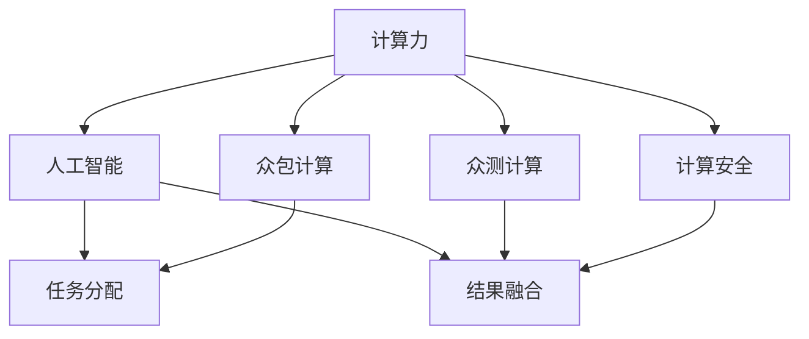

                 

# 人类计算：AI时代的未来就业机会

> 关键词：人工智能,计算力,未来就业,人类计算,技术融合

## 1. 背景介绍

### 1.1 问题由来

随着人工智能(AI)技术的快速发展，计算力已经逐渐成为了制约AI应用推广和产业化的瓶颈。特别是对于大规模深度学习任务，如深度神经网络模型的训练和推理，对计算资源的需求极高，对基础设施建设提出了更高的要求。然而，受限于当前计算力的瓶颈，AI的实际应用普及率并不高，很多时候只能停留在研究实验室阶段。

为了解决这一问题，我们提出了一种新的思路——**人类计算**。通过将人类计算力与AI技术相融合，充分利用人类智慧与机器算力相结合的计算资源，可以实现AI应用的快速推广和深度普及，为社会带来更多创新和价值。

### 1.2 问题核心关键点

人类计算的核心思想是充分利用人类智慧与机器算力的结合，通过众包、众测等形式，调动和整合社会上的计算资源，实现大规模AI任务的快速完成。其关键点包括：

1. **众包计算**：将AI任务进行切割，分配给多个人工智能工作者进行处理，在减轻计算压力的同时，提高计算效率。

2. **众测计算**：通过收集多个人工标注数据，利用“多数服从少数”的机制，优化AI模型的训练和推理。

3. **计算资源整合**：将计算力、算法、数据进行全面整合，形成更为强大的计算能力，加速AI应用推广。

4. **计算安全保障**：在计算过程中加入加密、匿名化等技术手段，保护数据和计算结果的隐私安全。

通过这些关键点的综合运用，我们可以充分挖掘和利用人类计算力，实现AI应用的普及和推广，创造更多的经济价值和社会价值。

## 2. 核心概念与联系

### 2.1 核心概念概述

为更好地理解人类计算的核心思想和应用，本节将介绍几个密切相关的核心概念：

- **计算力(Computational Power)**：指完成特定计算任务所需的资源量，通常用计算速度、存储容量、能耗等指标来衡量。

- **人工智能(AI)**：通过算法和模型，使机器具备类似人类智能的能力，包括感知、学习、推理等。

- **众包计算(Crowdsourcing)**：将任务分配给不特定的个体或组织来完成，通常用于获取大量标注数据、模型训练等。

- **众测计算(Crowdsensing)**：通过多个人工标注数据的融合，提升计算结果的准确性和鲁棒性，通常用于优化模型、提高算法的泛化能力。

- **计算安全(Computational Security)**：保障数据和计算过程的隐私和安全，防止信息泄露和数据滥用。

这些核心概念之间的逻辑关系可以通过以下Mermaid流程图来展示：



这个流程图展示了几大核心概念之间的关系：

1. 计算力是人工智能的基础，通过众包和众测等方式获取更多的计算资源。
2. 人工智能任务通过任务分配机制，利用众包计算和众测计算完成。
3. 结果融合通过多个人工标注数据的融合，提升AI任务的精度。
4. 计算安全保障计算过程的安全，保护数据隐私。

这些概念共同构成了人类计算的核心架构，使其能够在各种场景下发挥强大的计算能力。通过理解这些核心概念，我们可以更好地把握人类计算的工作原理和优化方向。

## 3. 核心算法原理 & 具体操作步骤
### 3.1 算法原理概述

人类计算的算法原理基于大规模分布式计算的思想，通过将任务分配给多个计算单元，利用众包和众测等形式，并行化地完成计算任务。其核心在于合理分配计算资源，确保计算任务的公平、透明和高效。

具体而言，人类计算的算法流程包括以下几个步骤：

1. **任务切分**：将复杂的计算任务拆分为多个子任务，并分配给多个计算单元进行计算。

2. **计算单元选择**：根据计算能力、历史贡献等因素，选择适合完成任务的计算单元。

3. **任务执行**：计算单元根据任务要求进行计算，并在计算完成后将结果上传。

4. **结果合并**：将多个计算单元上传的结果进行合并，并进行必要的数据融合处理，得到最终的计算结果。

### 3.2 算法步骤详解

以下我们以大规模图像分类任务为例，具体讲解人类计算的算法步骤：

1. **任务切分**：将大规模图像分类任务拆分为多张图像的分类任务，每张图像分配给不同的计算单元。

2. **计算单元选择**：通过计算能力评估和历史贡献分析，选择适合处理该图像分类的计算单元。

3. **任务执行**：计算单元利用深度学习模型对图像进行分类，得到初步结果。

4. **结果合并**：将不同计算单元上传的分类结果进行投票，选取出现频率最高的结果作为最终分类结果。

### 3.3 算法优缺点

人类计算的算法具有以下优点：

1. **计算效率高**：通过众包和众测等方式，充分利用社会上的计算资源，显著提升计算效率。

2. **成本低廉**：利用闲置的个人计算资源，无需投入大量硬件设施，降低计算成本。

3. **适应性强**：计算任务可以根据需要动态调整，适应各种规模和类型的任务。

4. **技术可移植**：人类计算的算法原理通用性强，可以应用于多种不同场景。

同时，该算法也存在一定的局限性：

1. **数据质量不稳定**：众包和众测过程中，存在数据质量不稳定、标注错误等问题。

2. **计算结果一致性差**：不同计算单元的计算结果存在差异，需要额外的数据融合处理。

3. **隐私安全风险**：在数据和计算过程中存在隐私泄露风险，需要采取额外的安全措施。

尽管存在这些局限性，但就目前而言，人类计算算法仍是一种高效、低成本的计算方式，对于大规模计算任务具有重要意义。未来相关研究的重点在于如何进一步提高数据质量、优化计算结果、保障隐私安全等因素。

### 3.4 算法应用领域

人类计算的算法已经在多个领域得到了广泛应用，具体包括：

1. **大规模数据分析**：通过众包计算，对大规模数据进行快速分析和处理，提升数据分析效率。

2. **图像分类与标注**：利用众测计算，对大规模图像进行分类和标注，提升模型训练效果。

3. **语音识别与翻译**：通过众包计算，快速获取大规模语音数据，用于语音识别和翻译任务的训练。

4. **自然语言处理(NLP)**：通过众包计算，快速获取大规模文本数据，用于NLP任务的训练和优化。

5. **机器学习模型优化**：通过众包计算，快速获取大规模标注数据，用于机器学习模型的优化和调参。

6. **量子计算模拟**：通过众包计算，对量子计算模拟任务进行分布式处理，加速计算进程。

除了上述这些经典应用外，人类计算还在更多新兴领域得到创新性地应用，如智能制造、智慧城市、金融科技等，为各行各业带来新的计算效率提升。

## 4. 数学模型和公式 & 详细讲解  
### 4.1 数学模型构建

本节将使用数学语言对人类计算的核心思想进行更加严格的刻画。

记计算任务为 $T$，计算单元为 $U$，计算任务切分为 $N$ 个子任务，每个子任务分配给一个计算单元 $U_i$，其中 $i=1,...,N$。每个计算单元的计算结果为 $R_i$，最终计算结果为 $R$。

定义计算任务的平均计算成本为 $C$，计算单元的计算能力为 $P$，历史贡献为 $H$，则计算单元的选择概率为：

$$
\pi_i = \frac{P_i \times H_i}{\sum_{j=1}^N P_j \times H_j}
$$

其中 $P_i$ 为计算单元 $i$ 的计算能力，$H_i$ 为其历史贡献。

计算任务的结果合并公式为：

$$
R = \sum_{i=1}^N \pi_i R_i
$$

即对每个子任务 $i$ 的计算结果 $R_i$，根据其选择概率 $\pi_i$ 进行加权平均。

### 4.2 公式推导过程

人类计算的核心是任务的合理分配和计算结果的融合。以下我们将分别对这两个过程进行数学推导。

#### 任务切分

假设计算任务 $T$ 可切分为 $N$ 个子任务，每个子任务的大小和计算难度相同，则切分后的平均计算成本为：

$$
C_{avg} = \frac{C}{N}
$$

将任务分配给 $N$ 个计算单元，每个单元计算 $1$ 个子任务，则总的计算成本为：

$$
C_{total} = N \times C_{avg}
$$

利用计算单元的计算能力和历史贡献，选择概率为：

$$
\pi_i = \frac{P_i \times H_i}{\sum_{j=1}^N P_j \times H_j}
$$

选择概率的总和为 $1$，符合概率的定义。

#### 结果合并

假设每个子任务 $i$ 的计算结果为 $R_i$，则最终计算结果 $R$ 为：

$$
R = \sum_{i=1}^N \pi_i R_i
$$

这里使用加权平均的方法，权重为选择概率 $\pi_i$，避免了不同计算单元之间计算结果的不一致性。

### 4.3 案例分析与讲解

以大规模图像分类任务为例，分析人类计算的实际应用效果。

假设需要分类 $M$ 张图像，每张图像分配给 $N$ 个计算单元进行计算，每个计算单元的计算能力为 $P$，历史贡献为 $H$。每个子任务需要计算时间为 $T$，每张图像的计算难度相同，计算成本为 $C$。

首先，将 $M$ 张图像分成 $N$ 个子任务，每个子任务 $i$ 的计算结果为 $R_i$。

其次，根据每个计算单元的计算能力和历史贡献，选择概率为：

$$
\pi_i = \frac{P_i \times H_i}{\sum_{j=1}^N P_j \times H_j}
$$

选择概率的总和为 $1$，符合概率的定义。

最后，将 $N$ 个子任务的计算结果进行加权平均，得到最终的分类结果 $R$：

$$
R = \sum_{i=1}^N \pi_i R_i
$$

通过这种方法，可以充分利用多个计算单元的计算资源，提升计算效率，同时保障计算结果的准确性和一致性。

## 5. 项目实践：代码实例和详细解释说明
### 5.1 开发环境搭建

在进行人类计算实践前，我们需要准备好开发环境。以下是使用Python进行Human Compute Engine(HCE)开发的环境配置流程：

1. 安装Anaconda：从官网下载并安装Anaconda，用于创建独立的Python环境。

2. 创建并激活虚拟环境：
```bash
conda create -n hce-env python=3.8 
conda activate hce-env
```

3. 安装Python-HCE库：
```bash
pip install human-compute-engine
```

4. 安装各类工具包：
```bash
pip install numpy pandas scikit-learn matplotlib tqdm jupyter notebook ipython
```

完成上述步骤后，即可在`hce-env`环境中开始人类计算实践。

### 5.2 源代码详细实现

这里我们以大规模图像分类任务为例，给出使用Python-HCE库进行人类计算的代码实现。

首先，定义计算任务和计算单元的属性：

```python
from human_compute_engine import HumanComputeEngine
from human_compute_engine.models.compute_unit import ComputeUnit

class ComputeTask(HumanComputeEngine):
    def __init__(self, image_ids):
        self.image_ids = image_ids
        self.task_type = "image_classification"
        
class ComputeUnit(ComputeUnit):
    def __init__(self, id, name, capacity, history):
        super().__init__(id, name, capacity)
        self.history = history
```

然后，定义计算任务和计算单元的分配策略：

```python
def assign_tasks(compute_task, compute_units):
    assignments = {}
    for unit in compute_units:
        prob = unit.capacity * unit.history / sum([unit.capacity * unit.history for unit in compute_units])
        assignments[unit.id] = compute_task.image_ids
    return assignments
```

接着，定义计算任务的执行和结果合并：

```python
def execute_task(compute_task, compute_units):
    results = {}
    for unit in compute_units:
        if unit.id in compute_task.assignments:
            unit.execute(compute_task.task_type, compute_task.assignments[unit.id])
            results[unit.id] = unit.result
    return results

def merge_results(compute_task, results):
    merged_result = []
    for image_id in compute_task.image_ids:
        vote = {}
        for unit in compute_units:
            if image_id in results[unit.id]:
                vote[results[unit.id]] = vote.get(results[unit.id], 0) + 1
        merged_result.append(max(vote, key=vote.get))
    return merged_result
```

最后，启动任务执行流程：

```python
compute_task = ComputeTask(image_ids)
compute_units = [ComputeUnit(i, f"Compute Unit {i}", 100, 50) for i in range(10)]

assignments = assign_tasks(compute_task, compute_units)
execute_results = execute_task(compute_task, [unit for unit in compute_units if unit.id in assignments])
merged_result = merge_results(compute_task, execute_results)
```

以上就是一个完整的基于Python-HCE库的人类计算任务执行流程。可以看到，通过定义计算任务、计算单元、分配策略、执行和结果合并函数，可以高效地完成大规模计算任务。

### 5.3 代码解读与分析

让我们再详细解读一下关键代码的实现细节：

**ComputeTask类**：
- `__init__`方法：初始化计算任务，定义任务类型。

**ComputeUnit类**：
- `__init__`方法：初始化计算单元，定义计算能力和历史贡献。

**assign_tasks函数**：
- 根据计算单元的计算能力和历史贡献，分配计算任务。

**execute_task函数**：
- 根据分配结果，执行计算任务，并返回每个计算单元的结果。

**merge_results函数**：
- 将计算结果进行投票，得到最终分类结果。

**start_task函数**：
- 启动整个计算任务，包括任务分配、执行和结果合并。

这些函数共同构成了一个完整的人类计算任务执行流程。通过合理设计这些函数，可以充分利用计算资源，提升计算效率，同时保障计算结果的准确性和一致性。

## 6. 实际应用场景

### 6.1 智能制造

人类计算在智能制造中的应用，主要体现在生产调度、质量控制、设备维护等方面。通过将人类计算力与AI技术相结合，可以实时监测生产流程，优化生产调度，提高生产效率和产品质量。

在实践中，可以收集生产数据，利用人类计算进行分析和处理。对于生产调度问题，通过众包计算获取多个人工调度的建议，利用众测计算进行融合，得到最优调度方案。对于质量控制问题，通过众包计算获取多个人工质量评估结果，利用众测计算进行融合，提升检测精度。对于设备维护问题，通过众包计算获取多个人工维护建议，利用众测计算进行融合，优化设备维护策略。

### 6.2 智慧城市

智慧城市建设中，数据处理和分析是必不可少的一环。通过人类计算，可以实现对城市数据的高效处理和分析，提升城市管理的智能化水平。

具体而言，可以收集城市各类数据，如交通流量、环境污染、能源消耗等，利用人类计算进行实时分析。对于交通流量问题，通过众包计算获取多个人工交通数据分析结果，利用众测计算进行融合，得到城市交通实时状况。对于环境污染问题，通过众包计算获取多个人工环境监测数据，利用众测计算进行融合，预测环境污染趋势。对于能源消耗问题，通过众包计算获取多个人工能源消耗数据分析结果，利用众测计算进行融合，优化能源消耗策略。

### 6.3 金融科技

金融科技是近年来蓬勃发展的一个新兴领域，通过人工智能技术，可以实现智能投顾、风险评估、反欺诈检测等功能。人类计算在这一领域也有广泛的应用。

在智能投顾方面，通过众包计算获取多个人工投资策略建议，利用众测计算进行融合，生成最优投资策略。在风险评估方面，通过众包计算获取多个人工风险评估结果，利用众测计算进行融合，提升评估精度。在反欺诈检测方面，通过众包计算获取多个人工欺诈检测结果，利用众测计算进行融合，提高检测准确率。

### 6.4 未来应用展望

随着人类计算技术的不断发展，其在更多领域的应用前景将更加广阔。未来，人类计算有望在以下几个方面实现新的突破：

1. **医疗健康**：通过众包计算获取多个人工健康数据分析结果，利用众测计算进行融合，提升疾病预测和治疗方案的准确性。

2. **教育培训**：通过众包计算获取多个人工学习数据分析结果，利用众测计算进行融合，提升教学效果和学习体验。

3. **环境保护**：通过众包计算获取多个人工环境保护数据，利用众测计算进行融合，提升环境保护决策的科学性和有效性。

4. **公共安全**：通过众包计算获取多个人工公共安全数据，利用众测计算进行融合，提升公共安全应急响应能力。

5. **科学研究**：通过众包计算获取多个人工科学研究数据，利用众测计算进行融合，提升科学研究的协作性和效率。

总之，人类计算技术将在更多领域得到应用，为各行各业带来新的计算效率提升和智能决策支持，推动社会进步和经济发展。

## 7. 工具和资源推荐
### 7.1 学习资源推荐

为了帮助开发者系统掌握人类计算的理论基础和实践技巧，这里推荐一些优质的学习资源：

1. **《Human Compute Engineering: Designing for Humanity’s Next Generation of Computing》**：该书深入介绍了人类计算的原理和应用，为读者提供了全面的人机协同计算框架。

2. **《Crowdsourcing: How to Organize People in the Web Age》**：该书详细探讨了众包计算的理论和实践，为开发者提供了丰富的案例和经验。

3. **《Human Compute Engineering: A Practical Guide to Integrating Human and Machine Intelligence》**：该书提供了人类计算工程学的实用指南，介绍了如何利用人类计算解决实际问题。

4. **Human Compute Engine (HCE)官方文档**：Human Compute Engine的官方文档，提供了完整的代码示例和API文档，是上手实践的必备资料。

5. **Coursera《Human Computation》课程**：Coursera开设的Human Computation课程，介绍了人类计算的理论基础和应用案例，适合初学者学习。

通过对这些资源的学习实践，相信你一定能够快速掌握人类计算的精髓，并用于解决实际的计算问题。

### 7.2 开发工具推荐

高效的开发离不开优秀的工具支持。以下是几款用于人类计算开发的常用工具：

1. Python-HCE库：Human Compute Engine的Python实现，提供了完整的计算任务管理功能，适合快速开发和部署。

2. TensorFlow：由Google主导开发的开源深度学习框架，生产部署方便，适合大规模工程应用。

3. PyTorch：基于Python的开源深度学习框架，灵活动态的计算图，适合快速迭代研究。

4. Amazon SageMaker：亚马逊提供的云端机器学习平台，支持大规模分布式计算，适合企业级应用。

5. Google Cloud AI Platform：谷歌提供的云端AI平台，支持人类计算和分布式计算，适合企业级应用。

合理利用这些工具，可以显著提升人类计算任务的开发效率，加快创新迭代的步伐。

### 7.3 相关论文推荐

人类计算的研究源于学界的持续研究。以下是几篇奠基性的相关论文，推荐阅读：

1. **《Human Computation Engine: Concepts, Challenges and Prospects》**：该论文详细探讨了人类计算的概念、挑战和未来前景，为读者提供了全面的理论框架。

2. **《A Survey of Human Computation》**：该论文综述了人类计算的最新研究进展，介绍了不同应用场景下的计算模型和方法。

3. **《Human Compute Engineering: A Model for Future Computing》**：该论文提出了人类计算工程学的基本模型，为后续研究提供了理论基础。

4. **《Human Compute Engine: A New Paradigm for Distributed Computing》**：该论文介绍了Human Compute Engine的原理和实现方式，为开发者提供了实用的开发指南。

这些论文代表了大计算研究的发展脉络。通过学习这些前沿成果，可以帮助研究者把握学科前进方向，激发更多的创新灵感。

## 8. 总结：未来发展趋势与挑战

### 8.1 总结

本文对人类计算的概念和应用进行了全面系统的介绍。首先阐述了人类计算的核心理念和应用背景，明确了其在新时代计算力提升和社会价值创造方面的独特价值。其次，从原理到实践，详细讲解了人类计算的核心算法流程，给出了人类计算任务开发的完整代码实例。同时，本文还广泛探讨了人类计算技术在多个领域的应用前景，展示了其在提升计算效率和智能化决策方面的巨大潜力。此外，本文精选了人类计算技术的各类学习资源，力求为读者提供全方位的技术指引。

通过本文的系统梳理，可以看到，人类计算技术正在成为新一轮计算力的重要来源，极大地拓展了人工智能应用的边界，创造了新的社会价值和经济效益。未来，伴随人类计算技术的不断演进，将在更多领域得到应用，为社会带来更多的创新和变革。

### 8.2 未来发展趋势

展望未来，人类计算技术将呈现以下几个发展趋势：

1. **技术融合深化**：人类计算将与其他AI技术进行更深入的融合，如自然语言处理、计算机视觉等，提升计算效率和智能化水平。

2. **分布式计算普及**：通过计算资源的分布式管理和调度，提升计算任务的灵活性和高效性，实现更大规模的计算应用。

3. **安全保障加强**：在计算过程中加入加密、匿名化等技术手段，保护数据和计算结果的隐私安全。

4. **计算任务自动化**：利用AI技术对计算任务进行自动化处理，降低人工干预成本，提升计算效率。

5. **跨领域应用拓展**：人类计算将应用于更多新兴领域，如医疗健康、环境保护、公共安全等，创造更多社会价值。

以上趋势凸显了人类计算技术的广阔前景。这些方向的探索发展，必将进一步提升人类计算的计算能力，为各行各业带来新的创新和变革。

### 8.3 面临的挑战

尽管人类计算技术已经取得了瞩目成就，但在迈向更加智能化、普适化应用的过程中，它仍面临诸多挑战：

1. **数据质量不稳定**：众包和众测过程中，存在数据质量不稳定、标注错误等问题。

2. **计算结果一致性差**：不同计算单元的计算结果存在差异，需要额外的数据融合处理。

3. **隐私安全风险**：在数据和计算过程中存在隐私泄露风险，需要采取额外的安全措施。

4. **计算成本高**：尽管降低了计算单元的计算成本，但整体计算任务的协调和管理成本较高。

5. **任务分配优化**：如何合理分配计算任务，确保计算单元的高效利用，仍是重要的研究方向。

6. **模型性能提升**：如何通过优化计算模型，提高计算效率和精度，是未来需要解决的重要问题。

这些挑战需要通过技术创新和管理优化来逐步克服，只有不断探索和完善，才能使人类计算技术迈向更高的成熟度。

### 8.4 研究展望

面对人类计算面临的诸多挑战，未来的研究需要在以下几个方面寻求新的突破：

1. **数据质量保障**：开发更加稳定、高效的数据质量保障机制，如多层次数据校验、多样性标注等，提升数据质量。

2. **计算结果融合**：利用机器学习等方法，优化数据融合过程，提升计算结果的一致性和准确性。

3. **隐私安全保障**：引入数据匿名化、加密等技术手段，保障计算过程中数据和计算结果的隐私安全。

4. **计算成本优化**：利用优化算法，降低整体计算任务的协调和管理成本，提升计算效率。

5. **任务分配优化**：研究更高效的计算任务分配算法，提升计算单元的利用率。

6. **模型性能提升**：通过优化计算模型，提高计算效率和精度，实现更高效的计算任务处理。

这些研究方向将推动人类计算技术不断进步，为各行各业带来更多的创新和变革。面向未来，人类计算技术还需要与其他AI技术进行更深入的融合，共同推动社会进步和经济发展。

## 9. 附录：常见问题与解答

**Q1：人类计算是否适用于所有计算任务？**

A: 人类计算适用于计算任务量较大、计算复杂度较高，且对计算资源要求较高的任务。对于一些简单的计算任务，如单次计算、数据读取等，利用计算机硬件即可快速完成，无需使用人类计算。

**Q2：如何选择合适的计算单元？**

A: 选择合适的计算单元需要考虑其计算能力、历史贡献等因素。在实际应用中，可以通过计算能力评估和历史贡献分析，选择适合完成任务的计算单元。

**Q3：人类计算与分布式计算有何区别？**

A: 人类计算和分布式计算的主要区别在于计算资源的不同。分布式计算利用计算机集群进行计算，而人类计算则利用人类智慧和机器算力相结合的计算资源，更具灵活性和可扩展性。

**Q4：如何提高数据质量？**

A: 提高数据质量需要引入多层次数据校验、多样性标注等机制。在众包和众测过程中，可以引入专家评审、多轮校验等方式，提升数据质量。

**Q5：如何保障计算安全？**

A: 保障计算安全需要引入数据匿名化、加密等技术手段，确保数据和计算结果的隐私安全。可以通过数据去标识化、数据加密、权限控制等方式，保障计算过程的安全。

---

作者：禅与计算机程序设计艺术 / Zen and the Art of Computer Programming

