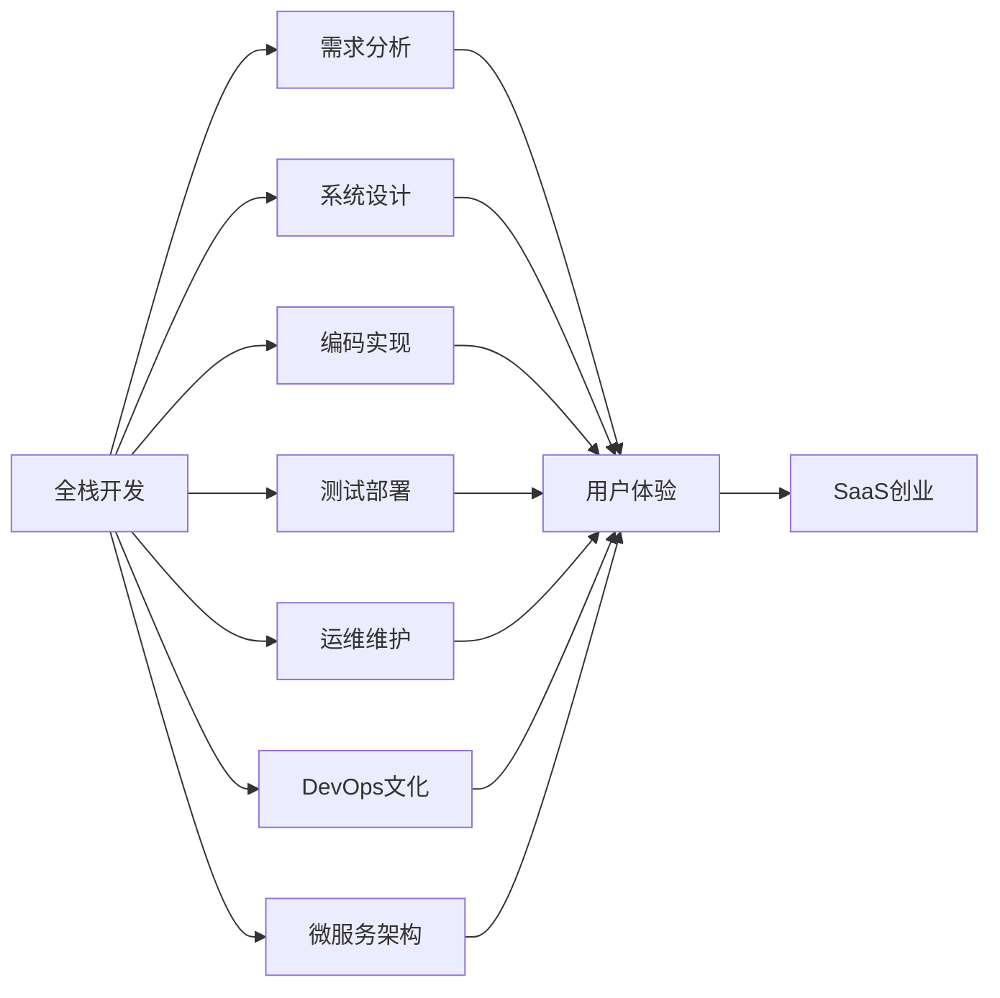

                 

# 从全栈开发到SaaS创业

## 1. 背景介绍

在信息化浪潮席卷全球的当下，软件作为重要的生产力和生产工具，其重要性与日俱增。然而，随着技术迭代与市场需求的不断变化，软件开发面临着诸多挑战。特别是在企业级应用领域，无论是技术复杂度还是应用需求，都对开发团队提出了极高的要求。本文旨在探讨如何从全栈开发（Full-stack Development）转型到软件即服务（Software as a Service，SaaS）创业，以期为IT从业者提供一份详细的实践指南。

## 2. 核心概念与联系

### 2.1 核心概念概述

为了更清晰地理解从全栈开发到SaaS创业的转变过程，首先介绍几个核心概念：

- **全栈开发**：全栈开发是指掌握前端和后端技术，能够独立完成整个应用从需求分析到上线维护的所有工作的软件开发模式。全栈开发者通常具备深厚的技术功底和全面的视角。

- **SaaS创业**：SaaS创业是指构建具有广泛适用性的软件服务，通过互联网平台提供给大量用户使用，收取订阅费用的商业模式。SaaS创业强调用户体验、服务质量和商业化运营能力。

- **软件生命周期**：从需求分析、系统设计、编码实现、测试部署到运维维护的全过程，反映了软件从诞生到衰退的整个过程。

- **DevOps文化**：一种将软件开发（Development）与运维（Operations）紧密结合的文化，强调持续集成、持续交付和持续改进。

- **微服务架构**：一种基于服务的架构设计方式，将应用拆分成多个独立部署的小服务，以提升系统的灵活性和可维护性。

### 2.2 核心概念原理和架构的 Mermaid 流程图



这个流程图展示了全栈开发与SaaS创业之间的联系，其中各个概念之间相互关联、相互作用。

## 3. 核心算法原理 & 具体操作步骤

### 3.1 算法原理概述

从全栈开发到SaaS创业的转变，本质上是软件开发范式的转变。从聚焦技术实现到关注用户体验和商业模式，需要重新思考和设计软件开发的每个环节。

- **需求分析**：从关注技术可行性转向用户需求导向，注重用户故事和用户体验。
- **系统设计**：从单体应用设计转向微服务架构，提升系统灵活性和可维护性。
- **编码实现**：从传统的水瀑布模型转向敏捷开发和DevOps文化，强调快速迭代和持续交付。
- **测试部署**：从本地测试转向持续集成和持续部署，提高系统稳定性和用户体验。
- **运维维护**：从单一系统维护转向多系统管理和SaaS运营，注重用户反馈和持续改进。

### 3.2 算法步骤详解

以下是SaaS创业的核心算法步骤：

1. **市场调研**：
   - 研究目标市场，分析用户需求和痛点。
   - 竞争分析，了解同类产品的优势与劣势。
   - 制定市场进入策略，明确差异化竞争点。

2. **产品规划**：
   - 定义产品目标，确定核心功能和用户价值。
   - 制定产品路线图，规划产品迭代和升级。
   - 确定技术栈和架构设计，选择适合的开发工具和框架。

3. **团队建设**：
   - 组建跨职能团队，包括前端、后端、测试、运维等岗位。
   - 建立DevOps文化，强化团队协作和持续交付。
   - 制定团队流程和规范，确保高效开发和质量保障。

4. **开发实现**：
   - 采用敏捷开发方法，快速迭代产品功能。
   - 应用微服务架构，提升系统模块化和可扩展性。
   - 实施持续集成和持续部署，确保快速交付和持续优化。

5. **测试与部署**：
   - 构建自动化测试体系，覆盖功能测试和性能测试。
   - 实施持续集成，自动化构建和部署系统。
   - 建立监控告警系统，确保系统稳定运行。

6. **运营与维护**：
   - 收集用户反馈，持续优化产品功能和用户体验。
   - 进行市场推广，扩大用户规模和市场份额。
   - 开展数据分析，指导产品迭代和商业决策。

### 3.3 算法优缺点

SaaS创业模式的优点：
- **降低前期成本**：通过订阅模式，降低初期市场推广和用户获取成本。
- **提升用户体验**：专注于用户体验和服务质量，不断优化产品功能。
- **快速迭代更新**：采用敏捷开发和持续交付，快速响应市场变化和用户需求。
- **商业化运营**：注重商业模型和收入增长，确保长期可持续发展。

SaaS创业模式的缺点：
- **用户依赖风险**：依赖大量用户订阅，一旦用户流失，收入和市场份额可能大幅波动。
- **技术复杂性**：涉及多个系统和多团队协作，技术复杂度高。
- **数据安全风险**：用户数据集中存储，存在数据泄露和隐私保护的挑战。
- **持续改进压力**：需要不断优化产品和服务，以满足市场竞争和用户需求。

### 3.4 算法应用领域

SaaS创业模式在多个领域已成功应用，包括但不限于：

- **企业级应用**：如CRM（客户关系管理）、HRM（人力资源管理）、ERP（企业资源规划）等。
- **电子商务**：如电商平台、支付平台、物流系统等。
- **云计算服务**：如云存储、云安全、云通信等。
- **数字营销**：如广告投放平台、社交媒体管理、数据分析等。
- **健康医疗**：如电子病历系统、在线咨询平台、健康管理等。

这些应用领域展示了SaaS创业的广泛适用性和巨大潜力。

## 4. 数学模型和公式 & 详细讲解 & 举例说明

### 4.1 数学模型构建

在SaaS创业中，数学模型主要用于系统性能优化、成本分析、用户增长预测等方面。这里以用户增长模型为例，构建一个简单的数学模型：

设$N_t$为第$t$时刻用户数，$k$为用户增长率，$a$为用户流失率，$C$为市场投入成本，$P$为用户付费率，则用户数的时间演化模型为：

$$N_t = N_{t-1} + kN_{t-1} - aN_{t-1} + C \times P$$

其中，$N_{t-1}$表示上一时刻的用户数，$k$表示新增用户增长率，$a$表示用户流失率，$C$表示市场投入成本，$P$表示用户付费率。

### 4.2 公式推导过程

以用户增长模型为例，推导模型的主要步骤包括：
1. 设定模型假设：假设用户数随时间演化，用户增长和流失是线性的。
2. 定义状态变量：设定$N_t$为用户数，$k$和$a$为参数。
3. 推导演化方程：根据用户增长和流失公式，得到演化方程。
4. 求解初始条件：设定初始用户数$N_0$，计算第$t$时刻用户数。
5. 分析模型特性：分析用户增长率、流失率、市场投入对用户增长的影响。

### 4.3 案例分析与讲解

以一个简单的电子商务平台为例，分析用户增长模型的实际应用：
1. 设定模型参数：用户增长率为10%，流失率为2%，市场投入为1000元，用户付费率为5%。
2. 设定初始用户数：初始用户数为100。
3. 计算用户演化：根据演化方程，计算第0、1、2、3、4、5时刻的用户数。
4. 分析影响因素：市场投入的增加，对用户增长的影响显著。

通过案例分析，可以看出数学模型在SaaS创业中的应用，能够为决策提供数据支持，指导产品迭代和市场推广。

## 5. 项目实践：代码实例和详细解释说明

### 5.1 开发环境搭建

SaaS创业的开发环境搭建主要包括以下步骤：

1. **选择开发工具**：
   - 开发语言：Python、Ruby、JavaScript等。
   - 开发框架：Django、Ruby on Rails、Spring等。
   - 数据库：MySQL、PostgreSQL、MongoDB等。

2. **搭建开发环境**：
   - 安装操作系统：如Linux、macOS、Windows。
   - 安装开发工具：如IDE、编译器、版本控制系统等。
   - 配置开发环境：如环境变量、依赖管理、代码库等。

3. **集成测试工具**：
   - 自动化测试框架：如JUnit、pytest、Cypress等。
   - 持续集成工具：如Jenkins、GitLab CI、Travis CI等。

4. **部署服务器环境**：
   - 云平台：AWS、Azure、Google Cloud等。
   - 容器化工具：如Docker、Kubernetes等。
   - 运维工具：如ELK Stack、Prometheus等。

### 5.2 源代码详细实现

以下是一个简单的SaaS创业应用案例，通过Flask框架构建一个小型电子商务平台：

```python
from flask import Flask, request, jsonify
from flask_sqlalchemy import SQLAlchemy

app = Flask(__name__)
app.config['SQLALCHEMY_DATABASE_URI'] = 'sqlite:///app.db'
db = SQLAlchemy(app)

class Product(db.Model):
    id = db.Column(db.Integer, primary_key=True)
    name = db.Column(db.String(50))
    price = db.Column(db.Float)

@app.route('/products', methods=['POST'])
def add_product():
    name = request.json['name']
    price = request.json['price']
    product = Product(name=name, price=price)
    db.session.add(product)
    db.session.commit()
    return jsonify({'id': product.id})

@app.route('/products/<id>')
def get_product(id):
    product = Product.query.get(id)
    return jsonify({'name': product.name, 'price': product.price})

if __name__ == '__main__':
    app.run(debug=True)
```

### 5.3 代码解读与分析

1. **环境配置**：使用Flask和SQLAlchemy框架，连接SQLite数据库。
2. **模型定义**：定义商品模型，包含商品名称和价格属性。
3. **路由实现**：定义添加商品和获取商品的API接口。
4. **请求处理**：处理POST请求，添加商品记录，处理GET请求，获取商品信息。
5. **应用程序启动**：在`__main__`函数中启动Flask应用程序，开启调试模式。

### 5.4 运行结果展示

执行上述代码后，可以通过访问http://localhost:5000/products来获取和添加商品信息，实现基本的电子商务功能。

## 6. 实际应用场景

### 6.1 企业级应用

企业级应用是SaaS创业的重要方向，主要场景包括：

- **CRM系统**：客户关系管理系统，用于管理客户信息、销售线索和客户反馈。
- **ERP系统**：企业资源规划系统，用于财务管理、人力资源管理、供应链管理等。
- **HRM系统**：人力资源管理系统，用于员工招聘、绩效管理、考勤管理等。

### 6.2 电子商务

电子商务是SaaS创业的重要应用领域，主要场景包括：

- **电商平台**：在线商品展示、销售和支付平台。
- **物流系统**：物流跟踪、配送和客户服务。
- **支付平台**：第三方支付接口、支付安全和风控管理。

### 6.3 云计算服务

云计算服务是SaaS创业的重要方向，主要场景包括：

- **云存储**：数据备份、恢复和共享服务。
- **云安全**：网络安全、数据加密和身份认证。
- **云通信**：即时通讯、视频会议和协作工具。

### 6.4 数字营销

数字营销是SaaS创业的重要应用领域，主要场景包括：

- **广告投放平台**：广告创意生成、投放和效果监测。
- **社交媒体管理**：社交媒体内容管理、分析和互动。
- **数据分析工具**：数据采集、清洗和分析服务。

### 6.5 健康医疗

健康医疗是SaaS创业的重要方向，主要场景包括：

- **电子病历系统**：患者信息管理、病历记录和查阅。
- **在线咨询平台**：医生在线问答、远程医疗和健康监测。
- **健康管理**：健康数据收集、分析和个性化健康建议。

## 7. 工具和资源推荐

### 7.1 学习资源推荐

1. **书籍**：
   - 《SaaS创业指南》：系统介绍了SaaS创业的各个环节，提供了详细的案例分析。
   - 《全栈开发实战》：介绍了全栈开发的技术栈和实践经验，适用于SaaS创业技术框架的搭建。
   - 《DevOps实践指南》：介绍了DevOps文化和持续交付的实践方法，有助于团队管理和项目推进。

2. **在线课程**：
   - Coursera的《SaaS创业》课程：涵盖了SaaS创业的各个环节，包括市场调研、产品规划、团队建设等。
   - Udemy的《全栈开发》课程：介绍了全栈开发的技术栈和开发工具，包括前端和后端开发。
   - edX的《DevOps基础》课程：介绍了DevOps文化和持续交付的实践方法，适合技术团队学习和实践。

### 7.2 开发工具推荐

1. **前端开发**：
   - React：用于构建单页面应用，支持组件化开发。
   - Angular：用于构建复杂的Web应用，提供丰富的组件库和工具。
   - Vue：用于构建响应式Web应用，易于上手和维护。

2. **后端开发**：
   - Flask：用于构建小型Web应用，简单易用。
   - Django：用于构建全栈Web应用，提供了强大的ORM和模板引擎。
   - Spring：用于构建Java应用的Web服务层，支持Spring MVC和Spring Boot。

3. **数据库管理**：
   - MySQL：用于关系型数据库管理，性能稳定。
   - PostgreSQL：用于高级数据管理，支持复杂查询。
   - MongoDB：用于非结构化数据存储，支持灵活查询。

4. **测试工具**：
   - JUnit：用于Java测试框架，支持单元测试和集成测试。
   - pytest：用于Python测试框架，支持单元测试和自动化测试。
   - Cypress：用于前端测试框架，支持UI自动化测试。

5. **持续集成工具**：
   - Jenkins：用于构建持续集成和持续部署系统，支持各种插件。
   - GitLab CI：用于GitLab平台的持续集成和持续部署，易于配置和使用。
   - Travis CI：用于GitHub平台的持续集成和持续部署，支持多种编程语言。

### 7.3 相关论文推荐

1. **《SaaS创业的成功要素分析》**：探讨了SaaS创业成功的关键要素，包括市场选择、产品定位、团队建设等。

2. **《全栈开发与敏捷开发的区别与联系》**：比较了全栈开发和敏捷开发的区别，介绍了两者在SaaS创业中的应用。

3. **《DevOps文化与持续交付》**：介绍了DevOps文化的核心思想和实践方法，阐述了其在SaaS创业中的应用。

4. **《微服务架构在SaaS创业中的应用》**：讨论了微服务架构在SaaS创业中的优势和实现方法，提供了具体的架构设计和案例分析。

## 8. 总结：未来发展趋势与挑战

### 8.1 研究成果总结

从全栈开发到SaaS创业的转变，不仅是技术范式的变革，更是商业模式和用户体验的提升。通过系统化的学习和实践，开发者可以更好地理解SaaS创业的各个环节，从而构建高效、可靠、用户友好的软件服务。

### 8.2 未来发展趋势

未来SaaS创业的发展趋势主要包括以下几个方面：

1. **智能化发展**：引入人工智能技术，如自然语言处理、机器学习等，提升用户体验和数据分析能力。
2. **全栈平台化**：实现前后端无缝衔接，提供一站式的开发和运维解决方案。
3. **全球化扩展**：通过多语言支持和国际化部署，进入全球市场。
4. **用户驱动设计**：注重用户体验和用户反馈，不断迭代优化产品功能。

### 8.3 面临的挑战

SaaS创业在发展过程中，面临着诸多挑战：

1. **市场竞争激烈**：SaaS市场竞争激烈，如何在红海中突围，成为一大难题。
2. **用户迁移成本高**：用户从传统软件切换到SaaS服务，需要适应新的使用方式，存在一定的迁移成本。
3. **数据安全和隐私**：用户数据集中存储，如何保障数据安全和用户隐私，是一大挑战。
4. **持续运营成本**：SaaS服务需要持续投入运营和维护，如何平衡成本和收益，是关键问题。

### 8.4 研究展望

未来的研究需要在以下几个方面寻求新的突破：

1. **用户体验优化**：注重用户体验和用户反馈，不断优化产品功能和界面设计。
2. **数据安全和隐私保护**：引入先进的数据加密和安全技术，保障用户数据安全。
3. **智能化技术应用**：引入人工智能和机器学习技术，提升数据分析和决策能力。
4. **全球化扩展**：通过多语言支持和国际化部署，进入全球市场。

## 9. 附录：常见问题与解答

**Q1：什么是SaaS创业？**

A: SaaS创业是指构建具有广泛适用性的软件服务，通过互联网平台提供给大量用户使用，收取订阅费用的商业模式。SaaS创业强调用户体验、服务质量和商业化运营能力。

**Q2：SaaS创业的优点和缺点是什么？**

A: SaaS创业的优点包括降低前期成本、提升用户体验、快速迭代更新、商业化运营等。缺点包括用户依赖风险、技术复杂性、数据安全风险、持续改进压力等。

**Q3：如何从全栈开发转型到SaaS创业？**

A: 从全栈开发转型到SaaS创业，需要重新思考和设计软件开发的每个环节，包括市场调研、产品规划、团队建设、开发实现、测试部署、运营维护等。

**Q4：SaaS创业需要哪些核心技术？**

A: SaaS创业需要以下核心技术：前端开发、后端开发、数据库管理、测试工具、持续集成工具、云平台、容器化工具、运维工具等。

**Q5：SaaS创业如何获取用户？**

A: SaaS创业可以通过市场推广、免费试用、合作伙伴、社交媒体、内容营销等方式获取用户。

---

作者：禅与计算机程序设计艺术 / Zen and the Art of Computer Programming

