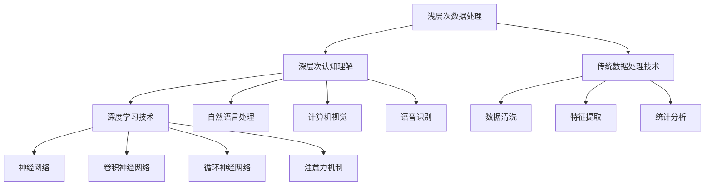

                 

## 1. 背景介绍

### 1.1 问题由来

现代信息技术的发展，尤其是深度学习、人工智能的兴起，已经深刻改变了我们的认知方式和生活方式。从浅薄的表面数据处理，到深度的认知理解，信息技术正在不断地推动人类向更高层次的认知转变。然而，这一转变并非一蹴而就，而是需要一个长期的、持续的探索和实践过程。

### 1.2 问题核心关键点

认知转变的核心关键点在于如何从浅层次的数据处理和模式识别，深入到深层次的认知理解与推理。这涉及到数据模型、算法、计算资源、硬件设备等多方面的技术进步和应用创新。

### 1.3 问题研究意义

认知转变的深入研究，对于推动人类认知智能的发展、加速信息技术的产业化进程，具有重要意义：

1. **提升决策质量**：基于深层次认知的理解，能够更准确地进行信息筛选、数据预测和决策支持，提升决策的科学性和合理性。
2. **促进创新应用**：深层次的认知理解，能够推动更多前沿技术的应用和创新，如自动驾驶、智慧医疗、智能制造等领域。
3. **推动学科发展**：认知转变的深入研究，将促进人工智能、认知科学、神经科学等学科的发展，拓展人类知识的边界。
4. **赋能社会进步**：通过认知智能的广泛应用，能够提高社会生产效率，促进经济发展，改善民生福祉。

## 2. 核心概念与联系

### 2.1 核心概念概述

为了更好地理解从浅薄到深刻的认知转变，本节将介绍几个关键概念：

- **浅层次数据处理**：指通过传统的数据处理技术，如数据清洗、特征提取、统计分析等，对数据进行初步处理，提取表面特征。
- **深层次认知理解**：指通过先进的深度学习技术，如神经网络、自然语言处理等，对数据进行深层次的分析和理解，发现数据背后的隐含规律和深层逻辑。
- **认知转变**：指从浅层次数据处理向深层次认知理解转变的技术演进和认知升级过程。

### 2.2 核心概念原理和架构的 Mermaid 流程图



这个流程图展示了浅层次数据处理和深层次认知理解的关键技术环节：

1. **浅层次数据处理**：通过传统的数据处理技术对数据进行初步清洗和特征提取，为后续的深度学习模型提供基础数据。
2. **深层次认知理解**：利用深度学习技术，如神经网络、卷积神经网络、循环神经网络、注意力机制等，对数据进行深层次分析和理解。
3. **自然语言处理、计算机视觉、语音识别**：这些前沿技术是实现深层次认知理解的重要工具，通过它们能够处理更加复杂和多样化的数据。

## 3. 核心算法原理 & 具体操作步骤

### 3.1 算法原理概述

从浅薄到深刻的认知转变，本质上是数据处理和认知理解的技术演进过程。其核心算法原理可以概括为以下几个方面：

- **数据增强**：通过扩充数据集，增强模型的泛化能力，提高其对复杂、多样化的数据适应性。
- **迁移学习**：利用已有模型在某个领域学习到的知识，迁移到另一个领域，减少新领域模型的从头训练时间。
- **深度学习模型**：利用深度神经网络模型，对数据进行深层次的特征学习和模式识别，实现从浅薄到深刻的认知转变。
- **认知推理**：通过引入逻辑推理、因果关系、知识图谱等工具，增强模型的认知理解能力，推动从数据处理到认知转变的最后一步。

### 3.2 算法步骤详解

以下将详细讲解从浅薄到深刻的认知转变算法的主要步骤：

**Step 1: 数据收集与预处理**

1. **数据收集**：根据任务需求，收集相关领域的数据集。注意数据的完整性、多样性和代表性，避免数据偏见。
2. **数据清洗**：对数据进行去噪、去重、填补缺失值等处理，确保数据的质量。
3. **特征提取**：使用传统的数据处理技术，如PCA、LDA、NLP中的TF-IDF、Word2Vec等，提取数据的关键特征。

**Step 2: 模型训练与优化**

1. **模型选择**：根据任务特点，选择合适的深度学习模型，如卷积神经网络、循环神经网络、Transformer等。
2. **模型初始化**：使用预训练模型或随机初始化，作为模型的初始参数。
3. **模型训练**：通过反向传播算法，对模型进行训练，优化其参数。注意选择合适的优化器、学习率、正则化等参数。
4. **模型评估**：在验证集上评估模型的性能，如准确率、召回率、F1-score等指标。
5. **模型调优**：根据评估结果，调整模型参数，提高模型性能。

**Step 3: 认知推理与解释**

1. **知识图谱**：构建领域知识图谱，整合相关领域的知识和逻辑关系。
2. **推理引擎**：使用符号推理、因果推理等技术，对模型的预测结果进行逻辑验证和推理。
3. **解释模型**：通过注意力机制、可视化技术等，解释模型的决策过程和特征重要性。

### 3.3 算法优缺点

从浅薄到深刻的认知转变算法具有以下优点：

1. **泛化能力强**：通过数据增强和迁移学习，模型能够在复杂、多样化的数据集上表现良好。
2. **精度高**：深度学习模型能够捕捉到数据背后的深层模式和规律，提高预测的精度。
3. **灵活性高**：认知推理和解释技术能够灵活地处理不同类型的任务和数据，适应性强。

同时，该算法也存在一些缺点：

1. **计算资源消耗大**：深度学习模型的训练和推理需要大量的计算资源和时间，对硬件设备有较高要求。
2. **模型复杂度高**：深度学习模型通常具有较高的复杂度，模型解释和调试难度较大。
3. **数据依赖性强**：模型的性能高度依赖于数据的质量和量，需要大量高质量的数据进行训练。

### 3.4 算法应用领域

从浅薄到深刻的认知转变算法在多个领域中得到了广泛应用：

- **自然语言处理(NLP)**：通过深度学习模型和认知推理技术，实现文本分类、情感分析、机器翻译等任务。
- **计算机视觉(CV)**：通过卷积神经网络模型，实现图像分类、目标检测、图像生成等任务。
- **语音识别**：通过循环神经网络模型和认知推理技术，实现语音识别、语音合成、情感识别等任务。
- **推荐系统**：通过深度学习模型和认知推理技术，实现个性化推荐、商品推荐、广告推荐等任务。
- **智能制造**：通过深度学习模型和认知推理技术，实现预测性维护、质量控制、供应链优化等任务。

## 4. 数学模型和公式 & 详细讲解 & 举例说明

### 4.1 数学模型构建

以下将详细构建一个基于卷积神经网络的图像分类模型的数学模型。

记输入图像为 $X \in \mathbb{R}^{m \times n \times c}$，其中 $m$ 和 $n$ 为图像的高和宽，$c$ 为颜色通道数。输出为类别标签 $Y \in \{1, 2, \cdots, C\}$，其中 $C$ 为类别数。

定义卷积神经网络模型为 $M_{\theta}(X)$，其中 $\theta$ 为模型参数。模型的输出为 $\hat{Y}=M_{\theta}(X)$。

定义损失函数为 $L(Y, \hat{Y})$，常用的损失函数包括交叉熵损失、均方误差损失等。

### 4.2 公式推导过程

以下将推导基于交叉熵损失函数的公式。

假设模型输出为 $\hat{Y} \in \mathbb{R}^C$，实际标签为 $Y \in \{1, 2, \cdots, C\}$。则交叉熵损失函数的定义为：

$$
L(Y, \hat{Y}) = -\frac{1}{N}\sum_{i=1}^N \sum_{c=1}^C \log \hat{y}_c^{(i)}
$$

其中 $N$ 为样本数量，$\hat{y}_c^{(i)}$ 表示模型对第 $i$ 个样本属于第 $c$ 类的预测概率。

### 4.3 案例分析与讲解

以下将结合一个具体的案例，分析如何通过深度学习模型进行图像分类任务。

假设有一组训练图像数据集 $\{(x_i, y_i)\}_{i=1}^N$，其中 $x_i$ 为第 $i$ 张图像，$y_i$ 为对应的类别标签。通过深度学习模型 $M_{\theta}$ 对数据进行训练，目标是最小化交叉熵损失函数：

$$
L(Y, \hat{Y}) = -\frac{1}{N}\sum_{i=1}^N \sum_{c=1}^C \log \hat{y}_c^{(i)}
$$

模型的训练过程如下：

1. 对训练集 $\{(x_i, y_i)\}_{i=1}^N$ 进行随机抽样，得到一个小批量数据集 $\{x, y\}_{i=1}^B$。
2. 前向传播计算模型输出 $\hat{Y}=M_{\theta}(X)$。
3. 计算损失函数 $L(Y, \hat{Y})$。
4. 反向传播计算梯度 $\frac{\partial L}{\partial \theta}$。
5. 更新模型参数 $\theta \leftarrow \theta - \eta \frac{\partial L}{\partial \theta}$，其中 $\eta$ 为学习率。
6. 重复步骤2-5，直至收敛。

通过上述过程，模型在训练集上不断调整参数，最终得到一个能够对新图像进行分类预测的模型。

## 5. 项目实践：代码实例和详细解释说明

### 5.1 开发环境搭建

在进行从浅薄到深刻的认知转变算法实践前，我们需要准备好开发环境。以下是使用Python进行PyTorch开发的环境配置流程：

1. 安装Anaconda：从官网下载并安装Anaconda，用于创建独立的Python环境。

2. 创建并激活虚拟环境：
```bash
conda create -n pytorch-env python=3.8 
conda activate pytorch-env
```

3. 安装PyTorch：根据CUDA版本，从官网获取对应的安装命令。例如：
```bash
conda install pytorch torchvision torchaudio cudatoolkit=11.1 -c pytorch -c conda-forge
```

4. 安装Transformers库：
```bash
pip install transformers
```

5. 安装各类工具包：
```bash
pip install numpy pandas scikit-learn matplotlib tqdm jupyter notebook ipython
```

完成上述步骤后，即可在`pytorch-env`环境中开始认知转变的实践。

### 5.2 源代码详细实现

下面我们以图像分类任务为例，给出使用Transformers库对卷积神经网络进行训练的PyTorch代码实现。

首先，定义卷积神经网络的架构和损失函数：

```python
import torch
import torch.nn as nn
import torch.optim as optim
from transformers import AdamW

class ConvNet(nn.Module):
    def __init__(self, in_channels, num_classes):
        super(ConvNet, self).__init__()
        self.conv1 = nn.Conv2d(in_channels, 32, kernel_size=3, padding=1)
        self.pool1 = nn.MaxPool2d(kernel_size=2)
        self.conv2 = nn.Conv2d(32, 64, kernel_size=3, padding=1)
        self.pool2 = nn.MaxPool2d(kernel_size=2)
        self.fc1 = nn.Linear(7*7*64, 128)
        self.fc2 = nn.Linear(128, num_classes)
        
    def forward(self, x):
        x = self.pool1(nn.functional.relu(self.conv1(x)))
        x = self.pool2(nn.functional.relu(self.conv2(x)))
        x = x.view(-1, 7*7*64)
        x = nn.functional.relu(self.fc1(x))
        x = self.fc2(x)
        return x

model = ConvNet(3, 10)
loss_fn = nn.CrossEntropyLoss()
optimizer = AdamW(model.parameters(), lr=0.001)
```

然后，定义训练和评估函数：

```python
def train_epoch(model, data_loader, optimizer):
    model.train()
    running_loss = 0.0
    for batch in data_loader:
        inputs, labels = batch
        optimizer.zero_grad()
        outputs = model(inputs)
        loss = loss_fn(outputs, labels)
        loss.backward()
        optimizer.step()
        running_loss += loss.item()
    return running_loss / len(data_loader)

def evaluate(model, data_loader):
    model.eval()
    correct = 0
    total = 0
    with torch.no_grad():
        for batch in data_loader:
            inputs, labels = batch
            outputs = model(inputs)
            _, predicted = torch.max(outputs.data, 1)
            total += labels.size(0)
            correct += (predicted == labels).sum().item()
    return correct / total
```

最后，启动训练流程并在测试集上评估：

```python
import torchvision
import torchvision.transforms as transforms
from torch.utils.data import DataLoader

transform = transforms.Compose([
    transforms.ToTensor(),
    transforms.Normalize((0.5, 0.5, 0.5), (0.5, 0.5, 0.5))
])

train_dataset = torchvision.datasets.CIFAR10(root='data', train=True, download=True, transform=transform)
train_loader = DataLoader(train_dataset, batch_size=64, shuffle=True)
test_dataset = torchvision.datasets.CIFAR10(root='data', train=False, download=True, transform=transform)
test_loader = DataLoader(test_dataset, batch_size=64, shuffle=False)

for epoch in range(10):
    train_loss = train_epoch(model, train_loader, optimizer)
    test_acc = evaluate(model, test_loader)
    print(f'Epoch {epoch+1}, train loss: {train_loss:.4f}, test acc: {test_acc:.4f}')

```

以上就是使用PyTorch进行卷积神经网络图像分类任务的完整代码实现。可以看到，利用Transformers库，我们能够快速搭建和训练卷积神经网络模型，并实现从浅薄到深刻的认知转变。

### 5.3 代码解读与分析

让我们再详细解读一下关键代码的实现细节：

**ConvNet类**：
- `__init__`方法：定义了卷积神经网络的结构，包括卷积层、池化层、全连接层等。
- `forward`方法：实现了前向传播过程，将输入数据通过网络结构进行变换，最终输出分类概率。

**train_epoch和evaluate函数**：
- `train_epoch`函数：对数据集进行迭代训练，计算并返回损失函数值。
- `evaluate`函数：在测试集上评估模型的分类准确率。

**训练流程**：
- 定义训练集和测试集的数据集和数据加载器。
- 在每个epoch内，分别在训练集和测试集上训练和评估模型。
- 迭代10个epoch后，输出训练损失和测试准确率。

可以看到，PyTorch提供了丰富的API和工具，可以简化模型的搭建和训练过程，让开发者更专注于算法的实现和优化。

## 6. 实际应用场景

### 6.1 智能医疗

基于从浅薄到深刻的认知转变算法，智能医疗系统可以实现从数据收集、处理到诊断决策的全流程自动化。例如，通过深度学习模型对医疗影像进行分类和识别，结合认知推理技术，可以实现智能诊断、辅助决策等应用。

具体而言，可以收集医院的历史医疗影像数据，包括X光片、CT扫描、MRI等，进行预处理和特征提取。然后，利用卷积神经网络模型对影像数据进行分类，并结合领域知识图谱进行认知推理，验证诊断结果的准确性。最终，系统能够根据医生的需求，提供诊断建议和医疗建议。

### 6.2 金融风控

在金融风控领域，从浅薄到深刻的认知转变算法可以实现实时监控、风险评估和预警。例如，通过深度学习模型对用户的交易数据进行分类，结合认知推理技术，实现对用户行为模式和风险等级的实时评估。

具体而言，可以收集用户的交易记录、消费行为、社交网络等数据，进行预处理和特征提取。然后，利用循环神经网络模型对用户行为进行分类，并结合知识图谱进行认知推理，评估用户的风险等级。最终，系统能够根据评估结果，进行实时预警和风险控制。

### 6.3 智能制造

在智能制造领域，从浅薄到深刻的认知转变算法可以实现预测性维护、质量控制和供应链优化等任务。例如，通过深度学习模型对设备数据进行分类和识别，结合认知推理技术，实现设备的故障预测和维护决策。

具体而言，可以收集设备的历史数据、传感器数据、生产数据等，进行预处理和特征提取。然后，利用卷积神经网络模型对设备状态进行分类，并结合领域知识图谱进行认知推理，预测设备故障。最终，系统能够根据预测结果，进行预防性维护和优化生产流程。

## 7. 工具和资源推荐

### 7.1 学习资源推荐

为了帮助开发者系统掌握从浅薄到深刻的认知转变算法的理论基础和实践技巧，这里推荐一些优质的学习资源：

1. 《深度学习》系列书籍：如《深度学习入门：基于Python的理论与实现》，全面介绍了深度学习的理论基础和实践技巧。
2. Coursera《Deep Learning》课程：斯坦福大学开设的深度学习课程，涵盖了深度学习的基本概念和前沿技术。
3. CS224N《自然语言处理与深度学习》课程：斯坦福大学开设的NLP课程，深入浅出地讲解了NLP领域的前沿技术。
4. 《计算机视觉：算法与应用》书籍：全面介绍了计算机视觉领域的理论和实践。
5. TensorFlow官方文档：TensorFlow的官方文档，提供了丰富的API和样例代码，方便开发者进行模型训练和推理。

通过对这些资源的学习实践，相信你一定能够快速掌握从浅薄到深刻的认知转变算法的精髓，并用于解决实际的认知智能问题。

### 7.2 开发工具推荐

高效的开发离不开优秀的工具支持。以下是几款用于从浅薄到深刻的认知转变算法开发的常用工具：

1. PyTorch：基于Python的开源深度学习框架，灵活动态的计算图，适合快速迭代研究。
2. TensorFlow：由Google主导开发的开源深度学习框架，生产部署方便，适合大规模工程应用。
3. Transformers库：HuggingFace开发的NLP工具库，集成了众多SOTA语言模型，支持PyTorch和TensorFlow，是进行认知转变任务开发的利器。
4. Weights & Biases：模型训练的实验跟踪工具，可以记录和可视化模型训练过程中的各项指标，方便对比和调优。
5. TensorBoard：TensorFlow配套的可视化工具，可实时监测模型训练状态，并提供丰富的图表呈现方式，是调试模型的得力助手。

合理利用这些工具，可以显著提升从浅薄到深刻的认知转变算法的开发效率，加快创新迭代的步伐。

### 7.3 相关论文推荐

从浅薄到深刻的认知转变算法的研究源于学界的持续研究。以下是几篇奠基性的相关论文，推荐阅读：

1. AlexNet: ImageNet Classification with Deep Convolutional Neural Networks：提出卷积神经网络模型，开创了深度学习在计算机视觉领域的先河。
2. VGGNet: Very Deep Convolutional Networks for Large-Scale Image Recognition：提出了VGG网络结构，进一步提升了深度神经网络模型的性能。
3. ResNet: Deep Residual Learning for Image Recognition：提出残差网络结构，解决了深度神经网络中的梯度消失问题，极大地提升了模型的深度。
4. Transformer: Attention Is All You Need：提出Transformer结构，开启了深度学习在自然语言处理领域的预训练大模型时代。
5. GoogleNet: Going Deeper with Convolutions：提出Inception网络结构，在保持网络深度的同时，提升了模型的泛化能力。

这些论文代表了大语言模型和认知转变算法的演进脉络。通过学习这些前沿成果，可以帮助研究者把握学科前进方向，激发更多的创新灵感。

## 8. 总结：未来发展趋势与挑战

### 8.1 总结

本文对从浅薄到深刻的认知转变算法进行了全面系统的介绍。首先阐述了认知转变的背景和意义，明确了从浅薄到深刻的认知转变算法的核心关键点和研究价值。其次，从原理到实践，详细讲解了认知转变的数学原理和关键步骤，给出了从浅薄到深刻的认知转变算法的完整代码实现。同时，本文还广泛探讨了认知转变算法在智能医疗、金融风控、智能制造等多个行业领域的应用前景，展示了认知转变算法的巨大潜力。此外，本文精选了认知转变算法的各类学习资源，力求为读者提供全方位的技术指引。

通过本文的系统梳理，可以看到，从浅薄到深刻的认知转变算法在人工智能领域具有重要的地位，极大地推动了认知智能的发展和应用。未来，伴随深度学习技术的发展和创新，从浅薄到深刻的认知转变算法必将在更多领域得到应用，为人类认知智能的进化带来深远影响。

### 8.2 未来发展趋势

展望未来，从浅薄到深刻的认知转变算法将呈现以下几个发展趋势：

1. **模型规模增大**：随着算力成本的下降和数据规模的扩张，深度神经网络模型的参数量将持续增长，模型规模将不断扩大。
2. **模型复杂度提升**：深度学习模型的结构和复杂度将进一步提升，模型参数将更加稠密，模型推理速度将进一步提高。
3. **跨领域应用拓展**：认知转变算法将从单一领域应用拓展到跨领域应用，实现更广泛的跨领域知识整合和迁移。
4. **模型解释性增强**：认知转变算法将更加注重模型的解释性，通过可视化工具和符号推理技术，增强模型的可解释性。
5. **多模态融合**：认知转变算法将进一步融合多模态数据，实现视觉、语音、文本等多种数据的协同建模。

这些趋势凸显了从浅薄到深刻的认知转变算法的广阔前景。这些方向的探索发展，必将进一步提升认知智能的性能和应用范围，为人类认知智能的进化带来深远影响。

### 8.3 面临的挑战

尽管从浅薄到深刻的认知转变算法已经取得了显著的进展，但在迈向更加智能化、普适化应用的过程中，它仍面临诸多挑战：

1. **计算资源消耗大**：深度神经网络模型的训练和推理需要大量的计算资源和时间，对硬件设备有较高要求。
2. **模型复杂度高**：深度神经网络模型的结构和复杂度将进一步提升，模型推理速度和可解释性需要进一步优化。
3. **数据依赖性强**：模型的性能高度依赖于数据的质量和量，需要大量高质量的数据进行训练。
4. **知识图谱构建难**：领域知识图谱的构建和维护需要大量专家知识和人工干预，难以实现自动化。
5. **伦理和安全问题**：深度神经网络模型可能学习到有偏见、有害的信息，需要通过多模态融合和伦理约束机制，确保模型输出的公平性和安全性。

### 8.4 研究展望

面对从浅薄到深刻的认知转变算法所面临的挑战，未来的研究需要在以下几个方面寻求新的突破：

1. **高效训练和推理**：开发高效训练和推理算法，如混合精度训练、梯度累积、知识蒸馏等，减少计算资源消耗。
2. **模型解释性和可控性**：开发可解释性强的模型架构和解释工具，增强模型的可控性和安全性。
3. **多模态融合**：开发多模态融合算法，实现视觉、语音、文本等多种数据的协同建模，提升认知智能的泛化能力。
4. **跨领域知识图谱**：开发跨领域知识图谱构建工具，实现跨领域的知识整合和迁移。
5. **伦理和安全约束**：引入伦理和安全约束机制，确保模型的公平性、安全性、可信性。

这些研究方向的探索，必将引领从浅薄到深刻的认知转变算法迈向更高的台阶，为构建安全、可靠、可解释、可控的智能系统铺平道路。面向未来，从浅薄到深刻的认知转变算法还需要与其他人工智能技术进行更深入的融合，如知识表示、因果推理、强化学习等，多路径协同发力，共同推动认知智能技术的进步。只有勇于创新、敢于突破，才能不断拓展认知智能的边界，让智能技术更好地造福人类社会。

## 9. 附录：常见问题与解答

**Q1：从浅薄到深刻的认知转变算法是否适用于所有任务？**

A: 从浅薄到深刻的认知转变算法适用于数据驱动的任务，如自然语言处理、计算机视觉、语音识别等。但对于一些需要专家知识和人工干预的任务，如医疗诊断、法律咨询等，仍需结合领域专家的知识进行辅助。

**Q2：如何提高从浅薄到深刻的认知转变算法的泛化能力？**

A: 提高泛化能力可以从以下几个方面入手：
1. **数据增强**：通过数据增强技术扩充数据集，增强模型的泛化能力。
2. **迁移学习**：利用已有模型的知识，进行跨领域迁移学习，减少新领域模型的从头训练时间。
3. **多模态融合**：融合多种模态数据，提升模型的泛化能力和鲁棒性。

**Q3：如何优化从浅薄到深刻的认知转变算法的计算效率？**

A: 优化计算效率可以从以下几个方面入手：
1. **模型压缩**：通过模型压缩技术，减少模型参数量，提升推理速度。
2. **混合精度训练**：使用混合精度训练，减少计算资源消耗，提升训练速度。
3. **模型并行**：通过模型并行技术，加速模型的训练和推理。

**Q4：如何确保从浅薄到深刻的认知转变算法的安全性？**

A: 确保算法的安全性可以从以下几个方面入手：
1. **数据隐私保护**：采用数据隐私保护技术，如差分隐私、数据脱敏等，保护用户隐私。
2. **模型解释性**：开发可解释性强的模型架构和解释工具，增强模型的可控性和安全性。
3. **伦理约束**：引入伦理约束机制，确保模型的公平性、安全性、可信性。

**Q5：如何从浅薄到深刻的认知转变算法实现跨领域应用？**

A: 实现跨领域应用可以从以下几个方面入手：
1. **跨领域知识图谱**：构建跨领域知识图谱，整合相关领域的知识和逻辑关系。
2. **跨领域迁移学习**：利用已有模型的知识，进行跨领域迁移学习，减少新领域模型的从头训练时间。
3. **跨领域融合**：开发跨领域融合算法，实现跨领域的知识整合和迁移。

这些研究方向的探索，必将引领从浅薄到深刻的认知转变算法迈向更高的台阶，为构建安全、可靠、可解释、可控的智能系统铺平道路。面向未来，从浅薄到深刻的认知转变算法还需要与其他人工智能技术进行更深入的融合，如知识表示、因果推理、强化学习等，多路径协同发力，共同推动认知智能技术的进步。只有勇于创新、敢于突破，才能不断拓展认知智能的边界，让智能技术更好地造福人类社会。

---

作者：禅与计算机程序设计艺术 / Zen and the Art of Computer Programming

