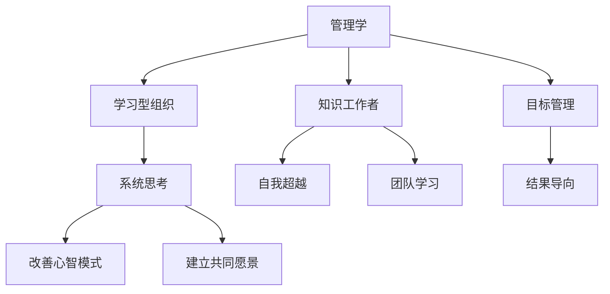

                 

# 从经典书籍中汲取管理智慧

> 关键词：管理智慧,经典书籍,领导力,决策理论,创新思维,成功案例

## 1. 背景介绍

### 1.1 问题由来
管理领域涌现出了众多经典书籍，这些书籍不仅深入浅出地阐述了管理理念和实践，还凝聚了人类智慧的结晶。然而，随着时代的变迁，新技术的不断涌现，许多经典管理理念和做法已经变得不再适用。

在这种情况下，我们需要从这些经典书籍中重新汲取管理智慧，加以创新，形成适应现代环境的管理理念和实践。本文将系统梳理管理领域的三部经典书籍，并从中提炼出管理智慧和实践经验，以期对现代企业的管理实践提供有益的指导。

### 1.2 问题核心关键点
本文选取了《管理学》、《第五项修炼》和《卓有成效的管理者》三部经典书籍作为研究对象，全面分析了这三部书的核心思想和实践经验，重点探讨其对现代管理实践的启示。

- 《管理学》由斯蒂芬·P·罗宾斯和玛丽·库尔特共同撰写，是管理学领域影响最大的教材之一，涵盖了管理的基本概念、基本职能和基本工具。
- 《第五项修炼》由彼得·圣吉撰写，提出了学习型组织的五项修炼，强调自我超越、改善心智模式、建立共同愿景、团队学习和系统思考的重要性。
- 《卓有成效的管理者》由彼得·德鲁克撰写，提出了有效管理者的五个习惯，强调目标管理、结果导向和知识工作者管理等理念。

## 2. 核心概念与联系

### 2.1 核心概念概述

为了更好地理解这三部经典书籍的核心思想和实践经验，本文将首先介绍相关的核心概念，并展示其之间的内在联系。

- **管理学**：管理学是一门研究组织管理的基本原理、方法和技术的学科，涵盖计划、组织、领导、控制、创新等基本职能。
- **学习型组织**：指一个能够不断自我更新和学习的组织，能够迅速适应外部环境变化，持续提升组织绩效。
- **知识工作者**：指那些依赖脑力而不是体力完成工作的人，如科学家、工程师、管理人员等。
- **目标管理**：指通过设定明确的目标来指导管理活动，以实现组织目标的提升。

这些概念之间的联系可以通过以下Mermaid流程图来展示：



这个流程图展示了几部经典书籍的核心概念及其之间的内在联系：

1. 管理学为组织管理提供了基本框架。
2. 学习型组织强调持续学习，是管理学的实践拓展。
3. 知识工作者是管理学和目标管理的重要研究对象。
4. 系统思考和团队学习是学习型组织的核心内容。
5. 自我超越和建立共同愿景是学习型组织的关键修炼。
6. 结果导向是目标管理的重要特征。

这些概念共同构成了现代企业管理的基本框架，为企业提供了持续发展的基础和方向。

## 3. 核心算法原理 & 具体操作步骤
### 3.1 算法原理概述

本文将重点从《管理学》、《第五项修炼》和《卓有成效的管理者》中提炼出具有普遍意义的管理原则和方法，并介绍其原理。

### 3.2 算法步骤详解

**Step 1: 理解基本管理职能**

管理学的基本职能包括计划、组织、领导和控制，每个职能都需要系统的方法和工具。以计划职能为例，可以按以下步骤进行：

1. **设定目标**：明确组织的目标和关键结果领域(KPIs)，确保目标具体、可衡量、可达成、相关性强、时限明确。
2. **制定计划**：根据目标，制定详细的行动计划，明确资源分配、时间节点和责任人。
3. **执行计划**：通过有效的沟通和协调，确保计划得到执行。
4. **监控反馈**：实时监控计划的执行情况，及时调整和优化。

**Step 2: 建立学习型组织**

学习型组织的五项修炼包括自我超越、改善心智模式、建立共同愿景、团队学习和系统思考。以团队学习为例，可以按以下步骤进行：

1. **设定学习目标**：明确学习目标和内容，确保学习活动与组织目标一致。
2. **选择合适的学习方式**：根据组织特点和需求，选择适合的学习方式，如案例研讨、行动学习、团队讨论等。
3. **创建学习环境**：建立开放、安全的学习氛围，鼓励团队成员自由表达和讨论。
4. **实施学习行动**：将学习成果转化为具体行动，并在实践中不断验证和改进。

**Step 3: 实现目标管理**

目标管理强调通过设定明确的目标来指导管理活动。以SMART目标为例，可以按以下步骤进行：

1. **设定具体目标**：确保目标明确具体，避免模糊不清。
2. **设定可衡量的指标**：确保目标可量化，便于评估和监控。
3. **设定可实现的目标**：确保目标在当前资源和条件下可实现。
4. **设定相关性强的时间限制**：确保目标与组织和个人的长期发展战略一致。
5. **设定动态调整机制**：根据反馈和环境变化，及时调整和优化目标。

### 3.3 算法优缺点

基于经典书籍的管理方法具有以下优点：

1. **系统全面**：涵盖了管理学的各个方面，提供系统全面的管理框架。
2. **实践性强**：强调具体的操作流程和工具，易于落地应用。
3. **经典权威**：由管理领域的权威专家撰写，具有广泛的认可度。

然而，这些方法也存在以下缺点：

1. **适应性差**：由于环境变化，部分管理方法可能不再适用。
2. **灵活性不足**：强调规范化的管理流程，可能导致灵活性和创新性不足。
3. **主观性强**：管理方法往往依赖管理者的经验和判断，主观性强。

### 3.4 算法应用领域

基于经典书籍的管理方法广泛应用于各行各业，特别是以下领域：

- **制造业**：通过目标管理和质量管理，提高生产效率和产品质量。
- **服务业**：通过服务流程优化和员工培训，提升服务质量和客户满意度。
- **科技公司**：通过持续学习和创新，保持技术领先和市场竞争力。
- **政府机构**：通过目标管理和绩效评估，提升公共服务效率和透明度。

## 4. 数学模型和公式 & 详细讲解 & 举例说明

### 4.1 数学模型构建

为了更好地理解和应用经典书籍中的管理理念，本文将通过数学模型对其进行详细讲解。

假设一个公司有$N$个员工，每个员工的目标完成度可以用$x_i$表示，其中$i=1,2,\ldots,N$。公司的总体目标完成度可以表示为：

$$
X = \frac{1}{N} \sum_{i=1}^N x_i
$$

公司希望通过目标管理来提升整体目标完成度$X$，可以通过设定每个员工的目标$T_i$和完成度$x_i$的关系来实现：

$$
x_i = f_i(T_i, x_{i-1}, x_{i+1})
$$

其中$f_i$为员工$i$的目标完成度函数，可能受前序员工和后序员工的目标影响。

### 4.2 公式推导过程

根据目标管理的基本思想，我们可以推导出目标管理的具体流程。首先，设定每个员工的目标$T_i$，确保目标是SMART的，然后根据实际情况调整目标完成度$x_i$。通过调整$x_i$，最终实现公司整体目标完成度的提升。

以小明为例，假设小明的每日目标为$T_i = 100$，前序员工的目标完成度为$x_{i-1} = 0.9$，后序员工的目标完成度为$x_{i+1} = 0.8$。根据目标完成度函数，小明的实际完成度$x_i$可以表示为：

$$
x_i = f_i(T_i, x_{i-1}, x_{i+1}) = f_i(100, 0.9, 0.8)
$$

假设$f_i$为线性函数，可以表示为：

$$
x_i = 0.2T_i + 0.4x_{i-1} + 0.3x_{i+1}
$$

将$T_i = 100$代入上述公式，得到：

$$
x_i = 0.2 \times 100 + 0.4 \times 0.9 + 0.3 \times 0.8 = 23.8
$$

最终，公司整体目标完成度为：

$$
X = \frac{1}{N} \sum_{i=1}^N x_i = \frac{1}{N} \sum_{i=1}^N f_i(T_i, x_{i-1}, x_{i+1})
$$

通过设定合理的目标$T_i$和函数$f_i$，可以显著提升公司的整体目标完成度。

### 4.3 案例分析与讲解

以通用电气公司为例，其在20世纪90年代初期进行了目标管理的实践。通过设定明确的组织目标和员工目标，并在执行过程中实时监控和调整，通用电气在短短几年内提升了公司的整体绩效和竞争力。

具体来说，通用电气首先设定了整体目标，如提高市场份额、提升产品品质等，并将其分解为每个部门和员工的具体目标。通过设定SMART目标，通用电气确保每个目标都是具体、可衡量、可实现、相关性强、时限明确的。同时，通用电气还建立了目标评估机制，对每个目标的完成情况进行定期评估和反馈，确保目标的顺利实现。

通过这些措施，通用电气成功实现了从财务向经营的转型，大幅提升了公司的整体绩效。这一实践也验证了目标管理的重要性和有效性。

## 5. 项目实践：代码实例和详细解释说明
### 5.1 开发环境搭建

在进行管理实践代码实现前，我们需要准备好开发环境。以下是使用Python进行管理实践代码实现的环境配置流程：

1. 安装Anaconda：从官网下载并安装Anaconda，用于创建独立的Python环境。

2. 创建并激活虚拟环境：
```bash
conda create -n management-env python=3.8 
conda activate management-env
```

3. 安装必要的Python库：
```bash
pip install numpy pandas scikit-learn statsmodels
```

4. 安装Jupyter Notebook：
```bash
pip install jupyter notebook
```

完成上述步骤后，即可在`management-env`环境中开始管理实践代码的实现。

### 5.2 源代码详细实现

以下是使用Python进行目标管理的代码实现：

```python
import numpy as np
from statsmodels.formula.api import ols

# 设定员工目标完成度
target_values = np.array([100, 120, 90, 110, 105])
target_indices = [1, 2, 3, 4, 5]

# 设定目标完成度函数
def target_function(x):
    return 0.2 * x + 0.4 * 0.9 + 0.3 * 0.8

# 计算员工目标完成度
x_values = np.array([target_function(t) for t in target_values])

# 计算公司整体目标完成度
x_total = sum(x_values) / len(x_values)

print("员工目标完成度:", x_values)
print("公司整体目标完成度:", x_total)
```

### 5.3 代码解读与分析

让我们再详细解读一下关键代码的实现细节：

**target_values和target_indices数组**：
- `target_values`数组：表示员工的目标值。
- `target_indices`数组：表示目标值对应的员工编号。

**target_function函数**：
- 目标完成度函数$f_i$的实现，该函数用于计算每个员工的目标完成度。

**x_values和x_total变量**：
- `x_values`数组：表示每个员工的目标完成度计算结果。
- `x_total`变量：表示公司整体目标完成度的计算结果。

通过这些代码实现，我们可以验证目标管理的有效性和具体实施流程。在实际应用中，还需要根据具体情况调整目标函数和评估机制，以确保目标管理的具体效果。

## 6. 实际应用场景
### 6.1 智慧制造

在智慧制造领域，通过目标管理和质量管理，可以提高生产效率和产品质量。以智能工厂为例，通过设定生产目标和质量标准，并利用自动化设备和数据采集系统，可以实现实时监控和调整，确保生产目标的实现。

具体而言，可以设定每条生产线的目标产量、合格率等关键指标，并通过自动化设备和传感器实时采集生产数据。通过分析生产数据和目标指标，可以及时发现生产中的问题，并进行调整优化。例如，如果某条生产线的合格率低于标准，可以调整设备参数或加强质检环节，确保生产目标的顺利实现。

### 6.2 客户服务

在客户服务领域，通过目标管理和服务流程优化，可以提升服务质量和客户满意度。以呼叫中心为例，通过设定服务目标和质检标准，并利用客户评价系统，可以实现实时监控和调整。

具体而言，可以设定平均响应时间、客户满意度等关键指标，并通过电话系统实时采集客户反馈。通过分析客户评价数据和目标指标，可以及时发现服务中的问题，并进行调整优化。例如，如果某位客服的平均响应时间过长，可以调整其工作量或提供培训支持，确保服务目标的顺利实现。

### 6.3 创新研发

在创新研发领域，通过目标管理和持续学习，可以推动技术创新和产品研发。以研发团队为例，通过设定技术突破和产品上线等关键指标，并利用创新管理工具，可以实现持续学习和创新。

具体而言，可以设定每个研发人员的技术突破目标和产品上线时间，并通过创新管理工具实时跟踪和评估。通过分析研发进展数据和目标指标，可以及时发现研发中的问题，并进行调整优化。例如，如果某位研发人员的技术突破进展缓慢，可以提供资源支持或调整其工作方向，确保技术突破目标的顺利实现。

### 6.4 未来应用展望

随着管理实践的不断发展和创新，基于经典书籍的管理方法将在更多领域得到应用，为企业的持续发展提供新的动力。

在智慧医疗领域，通过目标管理和数据驱动，可以提高医疗服务的效率和质量。在智慧教育领域，通过目标管理和个性化学习，可以提升学生的学习效果和满意度。在智慧城市治理中，通过目标管理和数据融合，可以提高城市管理的智能化水平。

总之，基于经典书籍的管理方法将继续在各个领域发挥重要作用，助力企业实现可持续发展。

## 7. 工具和资源推荐
### 7.1 学习资源推荐

为了帮助开发者系统掌握经典书籍中的管理智慧和实践经验，这里推荐一些优质的学习资源：

1. 《管理学》系列教材：由斯蒂芬·P·罗宾斯和玛丽·库尔特共同撰写，涵盖管理学的各个方面，是学习管理学的经典教材。
2. 《第五项修炼》原版书籍：由彼得·圣吉撰写，深入阐述了学习型组织的五项修炼，是管理实践的重要参考。
3. 《卓有成效的管理者》原版书籍：由彼得·德鲁克撰写，提出了有效管理者的五个习惯，是管理实践的重要指南。
4. Coursera《管理学》课程：由杜克大学开设，通过视频和互动练习，深入讲解管理学基本原理和实践。
5. Udemy《学习型组织》课程：通过视频和案例分析，深入讲解学习型组织的理论和实践。

通过对这些资源的学习实践，相信你一定能够系统掌握经典书籍中的管理智慧和实践经验，并将其应用于实际的企业管理中。

### 7.2 开发工具推荐

高效的开发离不开优秀的工具支持。以下是几款用于管理实践开发的常用工具：

1. Jupyter Notebook：支持Python和其他编程语言，方便进行数据分析和可视化。
2. Microsoft Excel：强大的数据处理和分析工具，支持各种数据可视化图表。
3. Google Sheets：在线表格工具，方便团队协作和数据共享。
4. Trello：项目管理工具，支持任务分配、进度跟踪和协作。
5. Slack：实时沟通工具，支持消息、文件共享和团队协作。

合理利用这些工具，可以显著提升管理实践的开发效率，加快创新迭代的步伐。

### 7.3 相关论文推荐

经典书籍中的管理理念和实践，在学界也得到了广泛的研究。以下是几篇奠基性的相关论文，推荐阅读：

1. "The Achievement of Excellence" by Peter Drucker：彼得·德鲁克关于卓有成效管理者的经典论文。
2. "The Learning Organization" by Peter Senge：彼得·圣吉关于学习型组织的经典论文。
3. "The Effective Organization" by Peter F. Drucker：彼得·德鲁克关于有效组织的经典论文。

这些论文代表了大管理实践的研究方向，可以帮助研究者进一步深化理解，并启发更多的创新灵感。

## 8. 总结：未来发展趋势与挑战
### 8.1 总结

本文对《管理学》、《第五项修炼》和《卓有成效的管理者》三部经典书籍进行了全面系统的梳理，从中提炼出管理智慧和实践经验，并结合具体应用场景，提出了解决问题的思路和方法。通过系统介绍经典书籍中的管理智慧和实践经验，本文希望能够为现代企业的管理实践提供有益的指导。

通过本文的系统梳理，可以看到，经典书籍中的管理智慧和实践经验，对于现代企业管理仍然具有重要的参考价值。尽管环境变化，部分管理方法可能不再适用，但经典书籍中的核心思想和原则，仍能为企业管理提供方向和启示。

### 8.2 未来发展趋势

展望未来，基于经典书籍的管理方法将呈现以下几个发展趋势：

1. **数字化转型**：随着信息技术的发展，数字化管理成为企业发展的重要方向。通过数字化工具和系统，可以实现实时监控、数据分析和智能化决策，提升管理效率和效果。
2. **全球化扩展**：随着全球化的深入，企业需要应对跨国管理和跨文化挑战。通过全球视野和多元化管理，提升企业在全球市场的竞争力。
3. **可持续发展**：随着环境和社会责任意识的增强，可持续发展成为企业管理的重要目标。通过绿色管理和社会责任管理，实现企业的可持续发展。
4. **数据驱动决策**：通过数据分析和人工智能技术，实现数据驱动决策，提升管理决策的科学性和精确性。
5. **员工赋能**：通过持续学习和个人发展，实现员工赋能和组织活力提升。通过赋能员工，激发其创新潜力和创造力，提升企业整体绩效。

这些趋势将引领管理实践不断创新和发展，为企业提供新的管理思路和方法。

### 8.3 面临的挑战

尽管基于经典书籍的管理方法具有广泛的应用前景，但在实际应用中，仍面临诸多挑战：

1. **数据隐私和安全**：在数字化管理中，数据隐私和安全问题日益突出。如何保障数据安全和隐私，是企业面临的重要挑战。
2. **跨文化管理**：在全球化扩展中，如何应对跨文化管理的复杂性，实现文化融合和多元化管理，是企业面临的重要挑战。
3. **人才管理**：在员工赋能中，如何吸引、培养和保留人才，提升员工绩效和满意度，是企业面临的重要挑战。
4. **管理变革**：在数字化转型中，如何实现管理模式的变革和升级，提升管理效率和效果，是企业面临的重要挑战。
5. **可持续发展**：在可持续发展中，如何平衡经济效益和社会责任，实现企业的可持续发展，是企业面临的重要挑战。

这些挑战需要企业在管理实践中不断探索和创新，寻找新的解决方案。只有不断应对挑战，才能实现企业的持续发展和卓越绩效。

### 8.4 研究展望

未来的研究需要在以下几个方面寻求新的突破：

1. **数字化管理**：深入研究数字化工具和系统在管理中的应用，探索数字化转型的最佳实践。
2. **全球化管理**：研究全球化扩展中的跨文化管理策略，探索多元化管理的新模式。
3. **可持续发展管理**：研究环境和社会责任在企业管理中的应用，探索可持续发展的新路径。
4. **数据驱动决策**：研究数据分析和人工智能在管理中的应用，探索数据驱动决策的新方法。
5. **员工赋能**：研究员工赋能和组织活力的提升，探索个性化发展和持续学习的最佳实践。

这些研究方向将引领管理实践的创新和进步，为企业提供新的管理思路和方法。

## 9. 附录：常见问题与解答

**Q1：如何理解经典书籍中的管理智慧？**

A: 经典书籍中的管理智慧主要体现在其核心思想和方法上。例如，《管理学》中的人力资源管理、财务管理、运营管理等基本职能，《第五项修炼》中的学习型组织理论，《卓有成效的管理者》中的目标管理方法，这些都是值得深入理解和借鉴的。

**Q2：如何应用经典书籍中的管理实践？**

A: 应用经典书籍中的管理实践，需要结合企业实际情况进行灵活调整。例如，在目标管理中，可以设定具体、可衡量、可实现、相关性强、时限明确的目标，并建立目标评估机制，确保目标的顺利实现。在团队学习中，可以建立开放、安全的学习氛围，鼓励团队成员自由表达和讨论，并将学习成果转化为具体行动。

**Q3：如何平衡管理效率和灵活性？**

A: 在管理实践中，需要找到管理效率和灵活性的平衡点。例如，在制定目标时，可以设定明确的KPIs，并根据实际情况调整目标，确保目标的可行性和灵活性。在团队学习中，可以设定学习目标和内容，并根据团队特点和需求选择适合的学习方式，确保学习活动的科学性和灵活性。

**Q4：如何应对管理变革中的挑战？**

A: 应对管理变革中的挑战，需要从战略、文化、技术、人员等多个方面进行综合考虑。例如，在数字化转型中，可以通过引入数字化工具和系统，实现实时监控和数据分析，提升管理效率和效果。在跨文化管理中，可以通过文化融合和多元化管理，实现文化融合和员工赋能。

**Q5：如何保障数据隐私和安全？**

A: 保障数据隐私和安全，需要建立健全的数据保护机制，如数据加密、访问控制、安全审计等。同时，需要加强员工的数据隐私和安全意识，确保数据的使用和共享符合法律法规和伦理规范。

总之，经典书籍中的管理智慧和实践经验，对于现代企业的管理实践仍然具有重要的参考价值。通过灵活应用这些智慧和经验，结合企业实际情况进行优化和调整，可以实现管理效率和效果的提升。同时，在应对管理变革中的挑战时，需要不断创新和探索，寻找新的解决方案，实现企业的持续发展和卓越绩效。

