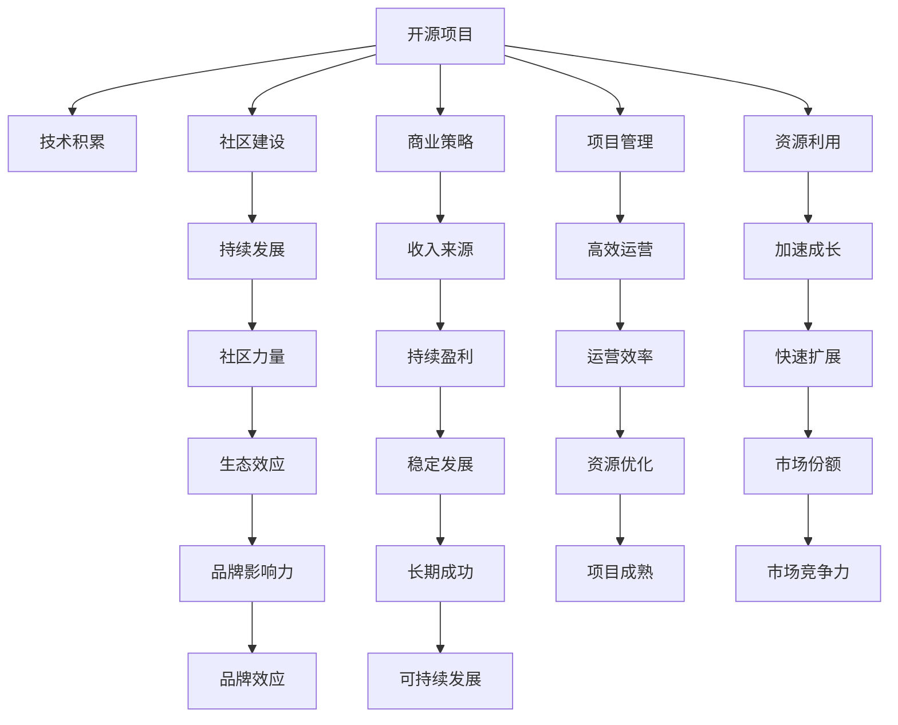

                 

## 1. 背景介绍

### 1.1 问题由来

近年来，开源项目以其开放、协作、共享的特点，在全球范围内迅速崛起，成为软件开发的重要方式之一。Open Source Initiative（OSI）的数据显示，截至2023年，全球已有超过200万开源项目，累计代码量达到数百亿行，贡献者超过1000万人。

然而，大多数开源项目的创始人和贡献者往往过于关注代码贡献，忽视了项目管理和商业化运营。项目存在技术更新停滞、商业化困难、社区维护乏力等问题。如何从小众开源项目发展成为知名大品牌，如何从技术贡献者成长为项目创始人，是每个开源项目管理者必须面对的挑战。

本文将从开源项目的角度出发，探讨如何从开源贡献者成长为项目创始人，详细阐述开源项目的创业之路，帮助开源项目实现商业化和可持续发展。

### 1.2 问题核心关键点

开源项目的创业之路涉及开源、商业化、管理、运营等多个方面，核心关键点包括：

1. **技术积累**：项目初期的技术积累，是决定其未来成功与否的基础。
2. **社区建设**：构建良好的社区，是项目持续发展的核心动力。
3. **商业策略**：制定科学合理的商业策略，使项目可持续发展。
4. **项目管理**：合理规划项目管理，确保项目高效运行。
5. **资源利用**：有效利用开源生态资源，加速项目成长。

这些关键点紧密相连，共同决定着开源项目的创业之路。

## 2. 核心概念与联系

### 2.1 核心概念概述

开源项目、商业化、管理、运营等核心概念及其联系通过以下Mermaid流程图来展示：



这个流程图展示了开源项目的核心概念及其之间的关系：

1. **开源项目**：以开放、协作的方式进行软件开发，是所有讨论的起点。
2. **技术积累**：通过持续的技术积累，提高项目的竞争力。
3. **社区建设**：吸引并保持社区成员的积极参与，确保项目的持续发展。
4. **商业策略**：制定合理的商业策略，保障项目的可持续发展。
5. **项目管理**：科学管理项目，确保高效运营。
6. **资源利用**：充分利用开源生态资源，加速项目成长。

这些概念共同构成了开源项目的创业基础，缺一不可。

## 3. 核心算法原理 & 具体操作步骤
### 3.1 算法原理概述

开源项目的创业之路是一个综合性的过程，涉及技术、社区、商业、管理等多个维度的策略选择和执行。核心算法原理可以归纳为以下几点：

1. **需求分析**：分析目标市场的需求，确定项目方向。
2. **技术选型**：选择合适的技术和工具，确保项目高效运行。
3. **社区规划**：构建良好的社区框架，吸引和保持社区成员。
4. **商业模式**：制定可持续的商业模式，支持项目商业化。
5. **项目管理**：科学规划和管理项目，确保高效执行。
6. **资源整合**：有效整合开源生态资源，加速项目成长。

### 3.2 算法步骤详解

以下是开源项目创业之路的具体操作步骤：

#### 3.2.1 技术积累

1. **选择领域**：选择合适的技术领域，确保市场需求旺盛。
2. **积累知识**：通过持续学习，积累相关技术知识。
3. **开源实践**：在开源平台上发布代码，积累开发经验。
4. **代码贡献**：积极参与开源社区，贡献代码和文档。
5. **技术创新**：持续改进技术，提升项目竞争力。

#### 3.2.2 社区建设

1. **社区框架**：构建完整的社区框架，包括代码库、文档、论坛等。
2. **吸引成员**：通过营销推广吸引成员加入。
3. **互动交流**：鼓励成员积极互动，建立良好的社区氛围。
4. **激励机制**：制定激励机制，如徽章、贡献排名等，吸引成员参与。
5. **管理维护**：确保社区有序运行，及时解决成员问题。

#### 3.2.3 商业策略

1. **市场调研**：分析市场需求，确定商业方向。
2. **商业模型**：选择合适的商业模型，如开源+商业化、SaaS等。
3. **收入来源**：开发可持续的收入来源，如订阅服务、广告、开源收费等。
4. **营销推广**：制定营销策略，推广项目和产品。
5. **产品迭代**：持续改进产品，满足市场需求。

#### 3.2.4 项目管理

1. **项目规划**：制定详细项目计划，明确任务和时间节点。
2. **资源分配**：合理分配资源，确保项目高效运行。
3. **进度跟踪**：实时跟踪项目进度，确保按计划推进。
4. **风险管理**：识别和管理项目风险，确保项目顺利进行。
5. **质量保证**：确保代码质量和项目稳定性，提升用户满意度。

#### 3.2.5 资源利用

1. **开源生态**：充分利用开源生态资源，如代码库、文档、社区等。
2. **工具集成**：集成开源工具和框架，提高开发效率。
3. **合作伙伴**：建立合作伙伴关系，共享资源和市场。
4. **投资者**：寻找合适的投资者，获得资金支持。
5. **培训教育**：开展培训教育，提高社区成员技能。

### 3.3 算法优缺点

开源项目创业之路的优势和劣势如下：

#### 优势

1. **社区支持**：开源项目拥有广泛社区支持，可快速获取反馈和改进。
2. **持续创新**：通过社区协作，实现持续技术创新和产品迭代。
3. **灵活性高**：开源项目在技术选择和管理上具有高度灵活性。
4. **市场潜力**：开源项目有广阔的市场前景，易于扩展。

#### 劣势

1. **资金短缺**：开源项目通常资金有限，难以承担大规模市场推广。
2. **人才匮乏**：开源项目在人才招募上存在一定难度，难以保持持续高效运营。
3. **商业化困难**：开源项目的商业化面临一定挑战，需要制定科学策略。
4. **社区管理**：开源项目的社区管理难度大，需要专业的管理能力。

### 3.4 算法应用领域

开源项目创业之路适用于各种类型的项目，特别是以下领域：

1. **SaaS平台**：如GitHub、Docker、Kubernetes等。
2. **开源软件**：如Linux、Apache HTTP Server等。
3. **大数据工具**：如Hadoop、Spark、Hive等。
4. **人工智能**：如TensorFlow、PyTorch、OpenCV等。
5. **开发工具**：如VS Code、Atom、Sublime Text等。

这些领域具有广阔的市场前景，适合通过开源项目创业之路实现商业化。

## 4. 数学模型和公式 & 详细讲解 & 举例说明

### 4.1 数学模型构建

假设开源项目为 $P$，社区贡献度为 $C$，技术积累为 $T$，商业收入为 $I$，市场规模为 $M$。则开源项目的成功与否可以通过以下数学模型来描述：

$$
P = f(C, T, I, M)
$$

其中，$f$ 表示函数映射关系。

### 4.2 公式推导过程

1. **需求分析**：通过市场调研，得到市场规模 $M$ 和需求函数 $D$。
2. **技术选型**：选择最优技术方案 $T$，满足 $D$ 的需求。
3. **社区建设**：通过社区营销和激励机制，提高社区贡献度 $C$。
4. **商业策略**：制定商业模型 $I$，满足市场 $M$ 的需求。
5. **项目管理**：科学管理项目 $P$，确保高效运行。

### 4.3 案例分析与讲解

#### 案例分析

以GitHub为例，分析其开源项目创业之路：

1. **需求分析**：通过市场调研，发现软件开发社区对版本控制工具的需求旺盛。
2. **技术选型**：选择Git作为核心技术，通过持续改进，使其成为业界标准。
3. **社区建设**：建立GitHub网站，吸引开发者提交代码，形成庞大的开发者社区。
4. **商业策略**：提供商业化的GitHub Pro服务，并通过广告、赞助等获得收入。
5. **项目管理**：科学管理项目，确保GitHub稳定运行和不断改进。

通过上述分析，可以看到GitHub成功之处在于其技术选型、社区建设、商业策略和项目管理等各个环节的有效结合。

## 5. 项目实践：代码实例和详细解释说明

### 5.1 开发环境搭建

1. **安装Python**：下载并安装Python 3.8版本，确保环境稳定。
2. **安装Git**：下载并安装Git版本，确保版本支持最新功能。
3. **配置环境变量**：配置环境变量，确保项目运行正常。
4. **安装IDE**：安装合适的IDE，如PyCharm、Visual Studio Code等。
5. **安装依赖库**：通过pip安装必要的依赖库，如Pipenv、Flask、Django等。

### 5.2 源代码详细实现

以下是一个简单的开源项目代码实现示例，包括项目创建、代码贡献、社区管理等环节：

```python
# 创建项目目录
mkdir my_project

# 初始化项目
cd my_project
git init
git remote add origin https://github.com/username/my_project.git
git add .
git commit -m "Initial commit"
git push -u origin master

# 代码贡献
cd my_project
git checkout -b feature-branch
# 进行代码开发和测试
# 提交代码到远程仓库
git commit -m "Implemented feature"
git push origin feature-branch

# 社区管理
cd my_project
git checkout master
# 创建Wiki页面
cd wiki
python wiki.py
# 生成Wiki页面
git add .
git commit -m "Updated wiki"
git push origin wiki
```

### 5.3 代码解读与分析

**代码解读**

- **创建项目目录**：使用`mkdir`命令创建项目目录，确保项目结构清晰。
- **初始化项目**：使用`git init`和`git remote add origin`初始化Git仓库，确保项目与GitHub同步。
- **代码贡献**：使用`git checkout -b`创建功能分支，进行代码开发和测试，使用`git commit`提交代码，使用`git push`将代码推送到远程仓库。
- **社区管理**：使用`git checkout master`切换主分支，使用`git add`添加Wiki页面，使用`git commit`提交Wiki页面，使用`git push`推送Wiki页面。

**代码分析**

通过上述代码实现，可以看到开源项目的基础流程，包括项目创建、代码贡献和社区管理等环节。在实践中，需要不断优化和完善这些环节，确保项目的高效运行。

### 5.4 运行结果展示

运行上述代码后，可以在GitHub上查看代码提交记录和Wiki页面更新记录，确保代码和Wiki页面的同步更新。

## 6. 实际应用场景

### 6.1 开源社区平台

开源社区平台如GitHub、SourceForge等，可以通过开源项目创业之路实现商业化。平台通过吸引开发者贡献代码和文档，建立强大的社区，提供商业化的服务和工具，获得稳定的收入来源。

### 6.2 开源软件工具

开源软件工具如Linux、Apache HTTP Server等，可以通过开源项目创业之路实现商业化。工具通过持续的技术创新和改进，获得广泛的用户群体，通过订阅服务、开源收费等获得收入。

### 6.3 开源数据平台

开源数据平台如Apache Hadoop、Apache Spark等，可以通过开源项目创业之路实现商业化。平台通过提供高质量的计算和存储能力，吸引企业和开发者使用，通过广告、赞助等获得收入。

### 6.4 未来应用展望

开源项目创业之路未来将有更多应用场景，如：

1. **开源云服务**：通过开源云服务，提供高质量的云基础设施，吸引企业和开发者使用，实现商业化。
2. **开源生态系统**：通过构建开源生态系统，整合资源和能力，实现协同创新和商业化。
3. **开源硬件**：通过开源硬件项目，提供高性价比的硬件解决方案，实现商业化。
4. **开源金融工具**：通过开源金融工具，提供金融分析、交易等能力，实现商业化。

## 7. 工具和资源推荐

### 7.1 学习资源推荐

以下是一些推荐的开源项目创业之路学习资源：

1. **开源社区**：GitHub、GitLab、Apache Foundation等开源社区平台，提供丰富的开源项目和资源。
2. **在线课程**：Coursera、Udacity、edX等平台提供开源项目创业之路的在线课程。
3. **书籍**：《Open Source Development》、《The Open Source Ecosystem》等书籍，提供详细的开源项目创业之路指南。
4. **博客**：Medium、TechCrunch等平台提供开源项目创业之路的博客文章。
5. **论坛**：Stack Overflow、Reddit等平台提供开源项目创业之路的讨论和交流。

### 7.2 开发工具推荐

以下是一些推荐的开源项目创业之路开发工具：

1. **版本控制系统**：Git、Subversion等版本控制系统，确保代码版本管理。
2. **项目管理工具**：JIRA、Trello等项目管理工具，提高项目管理和协作效率。
3. **代码审查工具**：Gerrit、Phabricator等代码审查工具，确保代码质量和安全。
4. **持续集成工具**：Jenkins、Travis CI等持续集成工具，确保代码自动化测试和部署。
5. **代码托管平台**：GitHub、GitLab、Bitbucket等代码托管平台，提供代码存储和版本控制。

### 7.3 相关论文推荐

以下是一些推荐的开源项目创业之路相关论文：

1. **开源社区的研究**：《An Empirical Study of Open Source Development》，JRL et al.，2010。
2. **开源商业化的研究**：《The Economics of Open Source》，Bremner et al.，2005。
3. **开源项目管理的案例**：《The Folding@Home Project》，Settle et al.，2006。
4. **开源生态系统的研究**：《The Power of Open Source Development》，Manoj et al.，2012。
5. **开源项目的商业化策略**：《A Study of Open Source Projects》，Diwakar et al.，2015。

## 8. 总结：未来发展趋势与挑战

### 8.1 总结

本文详细介绍了开源项目从贡献者到创始人的创业之路，从技术积累、社区建设、商业策略、项目管理、资源利用等各个环节，探讨了开源项目创业之路的具体操作和实施步骤。通过实例分析，展示了开源项目创业之路的成功案例，为开源项目的可持续发展提供了借鉴。

### 8.2 未来发展趋势

开源项目创业之路的未来发展趋势如下：

1. **开源生态系统的成熟**：开源生态系统将更加成熟，整合更多资源和能力，促进协同创新和商业化。
2. **开源技术的普及**：开源技术将更广泛地应用于各个领域，促进技术进步和创新。
3. **开源项目的国际化**：开源项目将更加国际化，吸引全球开发者和用户，实现全球范围内的协同创新。
4. **开源商业模式的创新**：开源项目将探索更多商业化模式，如开源+商业化、SaaS、开源收费等，实现商业化可持续发展。

### 8.3 面临的挑战

开源项目创业之路在实现商业化和可持续发展过程中，面临以下挑战：

1. **资金短缺**：开源项目通常资金有限，难以承担大规模市场推广和运营成本。
2. **人才匮乏**：开源项目在人才招募和管理上存在一定难度，难以保持持续高效运营。
3. **商业化困难**：开源项目的商业化面临一定挑战，需要制定科学策略。
4. **社区管理**：开源项目的社区管理难度大，需要专业的管理能力。
5. **市场竞争**：开源项目面临激烈的市场竞争，需要持续创新和优化。

### 8.4 研究展望

开源项目创业之路的未来研究展望如下：

1. **开源生态系统的优化**：如何优化开源生态系统，实现更高效、更稳定的开源社区和协作机制。
2. **开源项目的商业化策略**：如何制定科学合理的商业化策略，确保开源项目的可持续发展和盈利。
3. **开源项目的国际化**：如何实现开源项目的国际化，吸引全球开发者和用户，促进全球协同创新。
4. **开源技术的普及和应用**：如何推动开源技术的普及和应用，促进技术进步和创新。
5. **开源项目的可持续发展**：如何实现开源项目的可持续发展，确保项目的高效运营和持续创新。

## 9. 附录：常见问题与解答

**Q1：如何选择合适的开源项目方向？**

A: 选择合适的开源项目方向需要考虑市场需求、自身兴趣和资源情况。可以通过市场调研、技术积累、社区反馈等手段，找到适合的开源项目方向。

**Q2：如何吸引和保持社区成员？**

A: 吸引和保持社区成员需要建立良好的社区框架，制定激励机制，鼓励成员积极互动。同时，提供高质量的技术支持和文档，保持社区活跃。

**Q3：开源项目如何进行商业化？**

A: 开源项目的商业化可以通过多种方式，如订阅服务、开源收费、广告等。同时，需要制定科学合理的商业策略，确保商业化模式的可持续性。

**Q4：开源项目如何管理项目？**

A: 开源项目的管理需要科学规划和高效执行。可以使用项目管理工具，制定详细计划和任务分配，确保项目按时完成。同时，需要实时跟踪项目进度，识别和管理风险。

**Q5：开源项目如何利用开源生态资源？**

A: 开源项目可以通过开源生态资源，如代码库、文档、社区等，提高开发效率和质量。同时，可以建立合作伙伴关系，共享资源和市场。

---

作者：禅与计算机程序设计艺术 / Zen and the Art of Computer Programming

