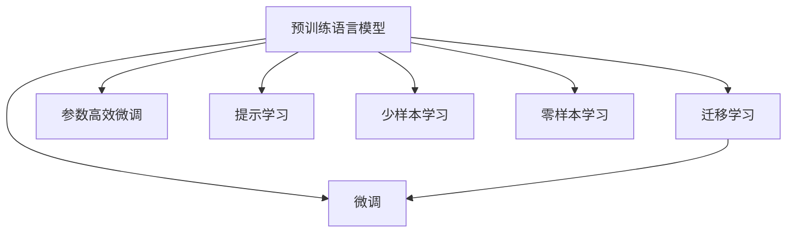

                 

# 从零开始大模型开发与微调：使用Hugging Face获取BERT预训练模型

## 1. 背景介绍

近年来，随着深度学习技术的发展，大规模语言模型在自然语言处理（NLP）领域取得了巨大的突破。其中，BERT（Bidirectional Encoder Representations from Transformers）模型因其在多种NLP任务上表现优异，成为预训练语言模型的代表。

BERT模型是由Google于2018年提出的，采用Transformer结构，利用自监督学习任务在无标签的文本数据上进行预训练，获得语义丰富的表示能力。其核心思想是通过构建"掩码语言模型"（Masked Language Model, MLM）和"下一句预测"（Next Sentence Prediction, NSP）任务，学习词汇和句子的上下文关系。预训练后，BERT模型能够对任意自然语言文本进行高质量的编码，从而支持后续的各种NLP任务，如问答、文本分类、命名实体识别等。

本文将介绍如何使用Hugging Face的`transformers`库，快速获取并微调BERT预训练模型。

## 2. 核心概念与联系

### 2.1 核心概念概述

为更好地理解基于BERT模型的预训练和微调过程，本节将介绍几个核心概念：

- **预训练语言模型（Pre-trained Language Model）**：指在无标签的大型文本语料上，通过自监督学习任务进行训练，获得丰富语言知识和表示能力的模型。BERT就是这类模型的代表之一。

- **微调（Fine-tuning）**：指在预训练模型的基础上，使用下游任务的少量标注数据进行有监督学习，优化模型在特定任务上的性能。通常只需调整顶层分类器或解码器，并以较小的学习率更新全部或部分的模型参数。

- **迁移学习（Transfer Learning）**：指将在一个领域学到的知识，迁移到另一个不同但相关的领域进行学习。BERT预训练模型可以视作一种迁移学习的形式，通过下游任务的微调，适应特定领域的数据分布和任务需求。

- **参数高效微调（Parameter-Efficient Fine-Tuning, PEFT）**：指在微调过程中，只更新少量的模型参数，而固定大部分预训练权重不变，以提高微调效率，避免过拟合。

- **提示学习（Prompt Learning）**：通过在输入文本中添加提示模板，引导BERT模型进行特定任务的推理和生成，可以在不更新模型参数的情况下，实现少样本或零样本学习。

这些核心概念之间的逻辑关系可以通过以下Mermaid流程图来展示：



### 2.2 核心概念原理和架构

BERT模型的核心原理基于Transformer结构，由自注意力机制、位置编码、多头注意力层、全连接层等组成。其中，自注意力机制是其最关键的部分，通过计算输入序列中所有位置之间的自相关性，捕捉词汇间的依赖关系，从而得到丰富的语义表示。

BERT模型通过掩码语言模型和下一句预测任务进行预训练。在掩码语言模型中，模型需要预测被遮蔽的词汇，捕捉词汇间的语义关系。在下一句预测任务中，模型需要判断两个句子是否连续，学习句子的语义结构。预训练后，BERT模型对输入序列的每个位置都生成一个固定长度的表示向量，这些向量包含了丰富的语义和上下文信息。

微调过程中，通过对模型的顶层进行重新训练，使其适应下游任务的特定需求，从而提升模型在该任务上的性能。微调的目标是最大化任务的损失函数，通常使用交叉熵损失、均方误差损失等。

## 3. 核心算法原理 & 具体操作步骤

### 3.1 算法原理概述

BERT模型的微调过程，本质上是利用下游任务的少量标注数据，对预训练模型进行有监督的再训练。其核心思想是：将预训练模型作为初始化参数，通过优化器调整模型参数，最小化模型在特定任务上的预测误差。

微调的数学模型如下：
$$
\theta^* = \mathop{\arg\min}_{\theta} \mathcal{L}(M_{\theta}, D)
$$
其中，$M_{\theta}$ 表示预训练模型，$D$ 表示下游任务的标注数据集，$\mathcal{L}$ 表示任务损失函数。

常用的微调方法包括全参数微调和参数高效微调。全参数微调指更新预训练模型中的所有参数，适用于数据量较大的任务。而参数高效微调仅更新与任务相关的部分参数，如BERT模型的最后几层，以减少计算资源消耗。

### 3.2 算法步骤详解

以下是使用Hugging Face的`transformers`库进行BERT模型微调的具体步骤：

1. **数据准备**：收集下游任务的标注数据集 $D = \{(x_i, y_i)\}_{i=1}^N$，其中 $x_i$ 表示输入文本，$y_i$ 表示标签。数据集应划分为训练集、验证集和测试集。

2. **模型初始化**：使用Hugging Face提供的BERT预训练模型进行初始化。例如，对于BERT-base模型，可以这样初始化：
```python
from transformers import BertForSequenceClassification
from transformers import BertTokenizer
from transformers import AdamW

model = BertForSequenceClassification.from_pretrained('bert-base-uncased')
tokenizer = BertTokenizer.from_pretrained('bert-base-uncased')
```

3. **模型适配**：根据下游任务的类型，设计适当的任务适配层。对于分类任务，可以添加一个全连接层和Softmax激活函数。例如，对于情感分析任务，可以这样设计：
```python
from transformers import BertForSequenceClassification
from transformers import BertTokenizer
from transformers import AdamW

model = BertForSequenceClassification.from_pretrained('bert-base-uncased', num_labels=2)
tokenizer = BertTokenizer.from_pretrained('bert-base-uncased')
```

4. **训练集划分**：将训练集划分为多个批次进行训练。每个批次的大小一般为16、32或64，取决于GPU的显存大小和任务需求。

5. **模型训练**：使用优化器（如AdamW）更新模型参数，最小化任务损失函数。例如，对于情感分析任务，可以这样训练：
```python
from transformers import BertForSequenceClassification
from transformers import BertTokenizer
from transformers import AdamW

model = BertForSequenceClassification.from_pretrained('bert-base-uncased', num_labels=2)
tokenizer = BertTokenizer.from_pretrained('bert-base-uncased')
optimizer = AdamW(model.parameters(), lr=2e-5)

for epoch in range(10):
    for batch in dataset:
        inputs = tokenizer(batch['text'], return_tensors='pt')
        labels = batch['label']
        outputs = model(**inputs)
        loss = outputs.loss
        loss.backward()
        optimizer.step()
```

6. **模型评估**：在验证集上评估模型的性能，调整超参数以避免过拟合。例如，使用准确率、F1分数等指标评估模型的性能。

7. **模型保存和部署**：保存训练好的模型，部署到生产环境中，进行实际应用。

### 3.3 算法优缺点

BERT模型的微调方法具有以下优点：

- **高效性**：微调过程可以快速进行，适用于数据量较小的任务，通常只需调整顶层分类器或解码器。
- **通用性**：BERT模型在多种NLP任务上表现优异，可以用于文本分类、命名实体识别、情感分析等任务。
- **性能提升**：微调过程能够显著提升模型在特定任务上的性能，尤其在标注数据量较少的场景下。

同时，也存在以下缺点：

- **标注数据需求**：微调过程需要下游任务的标注数据，数据量较少时，模型性能可能受限。
- **模型泛化能力**：预训练模型的泛化能力有限，当任务与预训练数据的分布差异较大时，微调效果可能不佳。
- **模型可解释性**：微调后的模型通常缺乏可解释性，难以理解其内部工作机制。

### 3.4 算法应用领域

BERT模型的微调方法在NLP领域得到了广泛应用，涵盖了情感分析、文本分类、命名实体识别、问答系统等多种任务。以下是几个典型的应用场景：

- **情感分析**：使用微调后的BERT模型，对用户评论、产品评价等文本进行情感分类，以衡量用户满意度或产品优劣。
- **文本分类**：将文本数据分类到预设的类别中，如垃圾邮件过滤、新闻分类等。
- **命名实体识别**：识别文本中的人名、地名、机构名等特定实体，通常用于信息抽取和知识图谱构建。
- **问答系统**：使用微调后的BERT模型，对用户提出的自然语言问题进行回答，构建智能问答系统。
- **机器翻译**：将一种语言翻译成另一种语言，使用微调后的BERT模型作为编码器或解码器。

## 4. 数学模型和公式 & 详细讲解 & 举例说明

### 4.1 数学模型构建

BERT模型的微调过程可以形式化为以下数学模型：

假设预训练模型为 $M_{\theta}$，下游任务的训练集为 $D = \{(x_i, y_i)\}_{i=1}^N$，其中 $x_i$ 表示输入文本，$y_i$ 表示标签。微调的目标是最小化损失函数 $\mathcal{L}(\theta)$：
$$
\mathcal{L}(\theta) = \frac{1}{N} \sum_{i=1}^N \ell(M_{\theta}(x_i), y_i)
$$

其中，$\ell$ 表示任务损失函数。对于分类任务，通常使用交叉熵损失函数：
$$
\ell(M_{\theta}(x_i), y_i) = -y_i \log(M_{\theta}(x_i)) - (1-y_i) \log(1-M_{\theta}(x_i))
$$

### 4.2 公式推导过程

在微调过程中，我们需要计算损失函数对模型参数 $\theta$ 的梯度，并使用优化器进行参数更新。例如，对于情感分析任务，微调的优化目标为：
$$
\theta^* = \mathop{\arg\min}_{\theta} \mathcal{L}(\theta) = \mathop{\arg\min}_{\theta} -\frac{1}{N} \sum_{i=1}^N [y_i \log(M_{\theta}(x_i)) + (1-y_i) \log(1-M_{\theta}(x_i))]
$$

使用梯度下降算法，更新模型参数：
$$
\theta_{t+1} = \theta_t - \eta \nabla_{\theta}\mathcal{L}(\theta_t) - \eta\lambda\theta_t
$$

其中 $\eta$ 表示学习率，$\lambda$ 表示正则化系数。

### 4.3 案例分析与讲解

以情感分析为例，我们设计一个简单的微调任务。假设训练集包含100条评论，每个评论有两个标签（正面和负面），每个标签有2个样本。我们可以使用交叉熵损失函数进行训练，计算损失函数对模型参数的梯度，并使用AdamW优化器进行参数更新。

## 5. 项目实践：代码实例和详细解释说明

### 5.1 开发环境搭建

在进行微调实践前，我们需要准备好开发环境。以下是使用Python进行PyTorch开发的环境配置流程：

1. 安装Anaconda：从官网下载并安装Anaconda，用于创建独立的Python环境。

2. 创建并激活虚拟环境：
```bash
conda create -n pytorch-env python=3.8 
conda activate pytorch-env
```

3. 安装PyTorch：根据CUDA版本，从官网获取对应的安装命令。例如：
```bash
conda install pytorch torchvision torchaudio cudatoolkit=11.1 -c pytorch -c conda-forge
```

4. 安装Transformers库：
```bash
pip install transformers
```

5. 安装各类工具包：
```bash
pip install numpy pandas scikit-learn matplotlib tqdm jupyter notebook ipython
```

完成上述步骤后，即可在`pytorch-env`环境中开始微调实践。

### 5.2 源代码详细实现

下面以情感分析任务为例，给出使用Transformers库对BERT模型进行微调的PyTorch代码实现。

首先，定义情感分析任务的数据处理函数：

```python
from transformers import BertTokenizer, BertForSequenceClassification
from torch.utils.data import Dataset, DataLoader
from transformers import AdamW
import torch

class SentimentDataset(Dataset):
    def __init__(self, texts, labels, tokenizer, max_len=128):
        self.texts = texts
        self.labels = labels
        self.tokenizer = tokenizer
        self.max_len = max_len
        
    def __len__(self):
        return len(self.texts)
    
    def __getitem__(self, item):
        text = self.texts[item]
        label = self.labels[item]
        
        encoding = self.tokenizer(text, return_tensors='pt', max_length=self.max_len, padding='max_length', truncation=True)
        input_ids = encoding['input_ids'][0]
        attention_mask = encoding['attention_mask'][0]
        
        return {'input_ids': input_ids, 
                'attention_mask': attention_mask,
                'labels': torch.tensor(label, dtype=torch.long)}
```

然后，定义模型和优化器：

```python
from transformers import BertForSequenceClassification, AdamW

model = BertForSequenceClassification.from_pretrained('bert-base-uncased', num_labels=2)

optimizer = AdamW(model.parameters(), lr=2e-5)
```

接着，定义训练和评估函数：

```python
from transformers import BertForSequenceClassification, AdamW
from transformers import BertTokenizer
from torch.utils.data import DataLoader
from tqdm import tqdm
from sklearn.metrics import classification_report

device = torch.device('cuda') if torch.cuda.is_available() else torch.device('cpu')
model.to(device)

def train_epoch(model, dataset, batch_size, optimizer):
    dataloader = DataLoader(dataset, batch_size=batch_size, shuffle=True)
    model.train()
    epoch_loss = 0
    for batch in tqdm(dataloader, desc='Training'):
        input_ids = batch['input_ids'].to(device)
        attention_mask = batch['attention_mask'].to(device)
        labels = batch['labels'].to(device)
        model.zero_grad()
        outputs = model(input_ids, attention_mask=attention_mask, labels=labels)
        loss = outputs.loss
        epoch_loss += loss.item()
        loss.backward()
        optimizer.step()
    return epoch_loss / len(dataloader)

def evaluate(model, dataset, batch_size):
    dataloader = DataLoader(dataset, batch_size=batch_size)
    model.eval()
    preds, labels = [], []
    with torch.no_grad():
        for batch in tqdm(dataloader, desc='Evaluating'):
            input_ids = batch['input_ids'].to(device)
            attention_mask = batch['attention_mask'].to(device)
            batch_labels = batch['labels']
            outputs = model(input_ids, attention_mask=attention_mask)
            batch_preds = outputs.logits.argmax(dim=2).to('cpu').tolist()
            batch_labels = batch_labels.to('cpu').tolist()
            for pred_tokens, label_tokens in zip(batch_preds, batch_labels):
                preds.append(pred_tokens[:len(label_tokens)])
                labels.append(label_tokens)
                
    print(classification_report(labels, preds))
```

最后，启动训练流程并在测试集上评估：

```python
epochs = 5
batch_size = 16

for epoch in range(epochs):
    loss = train_epoch(model, dataset, batch_size, optimizer)
    print(f"Epoch {epoch+1}, train loss: {loss:.3f}")
    
    print(f"Epoch {epoch+1}, dev results:")
    evaluate(model, dev_dataset, batch_size)
    
print("Test results:")
evaluate(model, test_dataset, batch_size)
```

以上就是使用PyTorch对BERT进行情感分析任务微调的完整代码实现。可以看到，得益于Transformers库的强大封装，我们可以用相对简洁的代码完成BERT模型的加载和微调。

### 5.3 代码解读与分析

让我们再详细解读一下关键代码的实现细节：

**SentimentDataset类**：
- `__init__`方法：初始化文本、标签、分词器等关键组件。
- `__len__`方法：返回数据集的样本数量。
- `__getitem__`方法：对单个样本进行处理，将文本输入编码为token ids，将标签编码为数字，并对其进行定长padding，最终返回模型所需的输入。

**模型初始化**：
- `BertForSequenceClassification.from_pretrained`方法：根据预训练模型参数初始化新的模型实例。

**训练函数**：
- `train_epoch`函数：对数据以批为单位进行迭代，在每个批次上前向传播计算损失函数。
- 计算损失函数对模型参数的梯度，使用优化器更新模型参数。
- 在验证集上评估模型性能，根据性能指标决定是否触发Early Stopping。
- 重复上述步骤直至满足预设的迭代轮数或Early Stopping条件。

**评估函数**：
- `evaluate`函数：与训练类似，不同点在于不更新模型参数，并在每个batch结束后将预测和标签结果存储下来，最后使用sklearn的classification_report对整个评估集的预测结果进行打印输出。

**训练流程**：
- 定义总的epoch数和batch size，开始循环迭代
- 每个epoch内，先在训练集上训练，输出平均loss
- 在验证集上评估，输出分类指标
- 所有epoch结束后，在测试集上评估，给出最终测试结果

可以看到，PyTorch配合Transformers库使得BERT微调的代码实现变得简洁高效。开发者可以将更多精力放在数据处理、模型改进等高层逻辑上，而不必过多关注底层的实现细节。

当然，工业级的系统实现还需考虑更多因素，如模型的保存和部署、超参数的自动搜索、更灵活的任务适配层等。但核心的微调范式基本与此类似。

## 6. 实际应用场景

### 6.1 智能客服系统

基于BERT模型的微调对话技术，可以广泛应用于智能客服系统的构建。传统客服往往需要配备大量人力，高峰期响应缓慢，且一致性和专业性难以保证。而使用微调后的对话模型，可以7x24小时不间断服务，快速响应客户咨询，用自然流畅的语言解答各类常见问题。

在技术实现上，可以收集企业内部的历史客服对话记录，将问题和最佳答复构建成监督数据，在此基础上对预训练对话模型进行微调。微调后的对话模型能够自动理解用户意图，匹配最合适的答案模板进行回复。对于客户提出的新问题，还可以接入检索系统实时搜索相关内容，动态组织生成回答。如此构建的智能客服系统，能大幅提升客户咨询体验和问题解决效率。

### 6.2 金融舆情监测

金融机构需要实时监测市场舆论动向，以便及时应对负面信息传播，规避金融风险。传统的人工监测方式成本高、效率低，难以应对网络时代海量信息爆发的挑战。基于BERT模型的文本分类和情感分析技术，为金融舆情监测提供了新的解决方案。

具体而言，可以收集金融领域相关的新闻、报道、评论等文本数据，并对其进行主题标注和情感标注。在此基础上对预训练语言模型进行微调，使其能够自动判断文本属于何种主题，情感倾向是正面、中性还是负面。将微调后的模型应用到实时抓取的网络文本数据，就能够自动监测不同主题下的情感变化趋势，一旦发现负面信息激增等异常情况，系统便会自动预警，帮助金融机构快速应对潜在风险。

### 6.3 个性化推荐系统

当前的推荐系统往往只依赖用户的历史行为数据进行物品推荐，无法深入理解用户的真实兴趣偏好。基于BERT模型的个性化推荐系统可以更好地挖掘用户行为背后的语义信息，从而提供更精准、多样的推荐内容。

在实践中，可以收集用户浏览、点击、评论、分享等行为数据，提取和用户交互的物品标题、描述、标签等文本内容。将文本内容作为模型输入，用户的后续行为（如是否点击、购买等）作为监督信号，在此基础上微调预训练语言模型。微调后的模型能够从文本内容中准确把握用户的兴趣点。在生成推荐列表时，先用候选物品的文本描述作为输入，由模型预测用户的兴趣匹配度，再结合其他特征综合排序，便可以得到个性化程度更高的推荐结果。

### 6.4 未来应用展望

随着BERT模型的不断进步和微调方法的持续优化，其应用场景将越来越广泛，影响也必将更加深远。

在智慧医疗领域，基于BERT模型的医疗问答、病历分析、药物研发等应用将提升医疗服务的智能化水平，辅助医生诊疗，加速新药开发进程。

在智能教育领域，微调技术可应用于作业批改、学情分析、知识推荐等方面，因材施教，促进教育公平，提高教学质量。

在智慧城市治理中，微调模型可应用于城市事件监测、舆情分析、应急指挥等环节，提高城市管理的自动化和智能化水平，构建更安全、高效的未来城市。

此外，在企业生产、社会治理、文娱传媒等众多领域，基于BERT模型的微调应用也将不断涌现，为NLP技术带来新的突破。相信随着预训练语言模型和微调方法的持续演进，NLP技术必将在更广阔的应用领域大放异彩，深刻影响人类的生产生活方式。

## 7. 工具和资源推荐

### 7.1 学习资源推荐

为了帮助开发者系统掌握BERT模型的预训练和微调理论基础和实践技巧，这里推荐一些优质的学习资源：

1. 《Transformer from Scratch》系列博文：由BERT模型的设计者之一Jacob Devlin撰写，详细介绍了BERT模型的预训练过程和微调方法。

2. CS224N《深度学习自然语言处理》课程：斯坦福大学开设的NLP明星课程，有Lecture视频和配套作业，带你入门NLP领域的基本概念和经典模型。

3. 《Natural Language Processing with Transformers》书籍：Hugging Face的作者之一Jacob Devlin所著，全面介绍了如何使用Transformers库进行NLP任务开发，包括微调在内的诸多范式。

4. Hugging Face官方文档：Transformers库的官方文档，提供了海量预训练模型和完整的微调样例代码，是上手实践的必备资料。

5. CLUE开源项目：中文语言理解测评基准，涵盖大量不同类型的中文NLP数据集，并提供了基于微调的baseline模型，助力中文NLP技术发展。

通过对这些资源的学习实践，相信你一定能够快速掌握BERT模型的预训练和微调精髓，并用于解决实际的NLP问题。

### 7.2 开发工具推荐

高效的开发离不开优秀的工具支持。以下是几款用于BERT模型微调开发的常用工具：

1. PyTorch：基于Python的开源深度学习框架，灵活动态的计算图，适合快速迭代研究。BERT模型有PyTorch版本的实现。

2. TensorFlow：由Google主导开发的开源深度学习框架，生产部署方便，适合大规模工程应用。BERT模型也有TensorFlow版本的实现。

3. Transformers库：Hugging Face开发的NLP工具库，集成了BERT模型和其他预训练语言模型，支持PyTorch和TensorFlow，是进行微调任务开发的利器。

4. Weights & Biases：模型训练的实验跟踪工具，可以记录和可视化模型训练过程中的各项指标，方便对比和调优。与主流深度学习框架无缝集成。

5. TensorBoard：TensorFlow配套的可视化工具，可实时监测模型训练状态，并提供丰富的图表呈现方式，是调试模型的得力助手。

6. Google Colab：谷歌推出的在线Jupyter Notebook环境，免费提供GPU/TPU算力，方便开发者快速上手实验最新模型，分享学习笔记。

合理利用这些工具，可以显著提升BERT模型微调任务的开发效率，加快创新迭代的步伐。

### 7.3 相关论文推荐

BERT模型的预训练和微调技术源于学界的持续研究。以下是几篇奠基性的相关论文，推荐阅读：

1. Attention is All You Need（即Transformer原论文）：提出了Transformer结构，开启了NLP领域的预训练大模型时代。

2. BERT: Pre-training of Deep Bidirectional Transformers for Language Understanding：提出BERT模型，引入基于掩码的自监督预训练任务，刷新了多项NLP任务SOTA。

3. Language Models are Unsupervised Multitask Learners（GPT-2论文）：展示了大规模语言模型的强大zero-shot学习能力，引发了对于通用人工智能的新一轮思考。

4. Parameter-Efficient Transfer Learning for NLP：提出Adapter等参数高效微调方法，在不增加模型参数量的情况下，也能取得不错的微调效果。

5. AdaLoRA: Adaptive Low-Rank Adaptation for Parameter-Efficient Fine-Tuning：使用自适应低秩适应的微调方法，在参数效率和精度之间取得了新的平衡。

这些论文代表了大规模预训练语言模型的预训练和微调技术的发展脉络。通过学习这些前沿成果，可以帮助研究者把握学科前进方向，激发更多的创新灵感。

## 8. 总结：未来发展趋势与挑战

### 8.1 总结

本文对BERT模型的预训练和微调过程进行了全面系统的介绍。首先阐述了BERT模型和微调技术的研究背景和意义，明确了微调在拓展预训练模型应用、提升下游任务性能方面的独特价值。其次，从原理到实践，详细讲解了微调的数学原理和关键步骤，给出了微调任务开发的完整代码实例。同时，本文还广泛探讨了微调方法在智能客服、金融舆情、个性化推荐等多个行业领域的应用前景，展示了微调范式的巨大潜力。此外，本文精选了微调技术的各类学习资源，力求为读者提供全方位的技术指引。

通过本文的系统梳理，可以看到，基于BERT模型的微调方法在NLP领域得到了广泛应用，并在多个任务上取得了优异效果。未来，随着预训练语言模型的不断进步和微调方法的持续优化，其应用场景将越来越广泛，影响也必将更加深远。

### 8.2 未来发展趋势

展望未来，BERT模型的微调技术将呈现以下几个发展趋势：

1. **模型规模持续增大**：随着算力成本的下降和数据规模的扩张，预训练语言模型的参数量还将持续增长。超大规模语言模型蕴含的丰富语言知识，有望支撑更加复杂多变的下游任务微调。

2. **微调方法日趋多样**：除了传统的全参数微调外，未来会涌现更多参数高效的微调方法，如Adapter、Prefix等，在固定大部分预训练参数的情况下，只更新极少量的任务相关参数，减少计算资源消耗。

3. **持续学习成为常态**：随着数据分布的不断变化，微调模型也需要持续学习新知识以保持性能。如何在不遗忘原有知识的同时，高效吸收新样本信息，将成为重要的研究课题。

4. **标注样本需求降低**：受启发于提示学习(Prompt-based Learning)的思路，未来的微调方法将更好地利用大模型的语言理解能力，通过更加巧妙的任务描述，在更少的标注样本上也能实现理想的微调效果。

5. **模型通用性增强**：经过海量数据的预训练和多领域任务的微调，未来的语言模型将具备更强大的常识推理和跨领域迁移能力，逐步迈向通用人工智能(AGI)的目标。

以上趋势凸显了大规模预训练语言模型微调技术的广阔前景。这些方向的探索发展，必将进一步提升NLP系统的性能和应用范围，为人类认知智能的进化带来深远影响。

### 8.3 面临的挑战

尽管BERT模型的微调技术已经取得了瞩目成就，但在迈向更加智能化、普适化应用的过程中，它仍面临着诸多挑战：

1. **标注成本瓶颈**：虽然微调过程减少了标注数据的需求，但对于长尾应用场景，难以获得充足的高质量标注数据，成为制约微调性能的瓶颈。如何进一步降低微调对标注样本的依赖，将是一大难题。

2. **模型鲁棒性不足**：预训练模型的泛化能力有限，当任务与预训练数据的分布差异较大时，微调效果可能不佳。如何提高微调模型的鲁棒性，避免灾难性遗忘，还需要更多理论和实践的积累。

3. **推理效率有待提高**：大规模语言模型虽然精度高，但在实际部署时往往面临推理速度慢、内存占用大等效率问题。如何在保证性能的同时，简化模型结构，提升推理速度，优化资源占用，将是重要的优化方向。

4. **可解释性亟需加强**：当前微调模型通常缺乏可解释性，难以理解其内部工作机制和决策逻辑。对于医疗、金融等高风险应用，算法的可解释性和可审计性尤为重要。如何赋予微调模型更强的可解释性，将是亟待攻克的难题。

5. **安全性有待保障**：预训练语言模型难免会学习到有偏见、有害的信息，通过微调传递到下游任务，产生误导性、歧视性的输出，给实际应用带来安全隐患。如何从数据和算法层面消除模型偏见，避免恶意用途，确保输出的安全性，也将是重要的研究课题。

6. **知识整合能力不足**：现有的微调模型往往局限于任务内数据，难以灵活吸收和运用更广泛的先验知识。如何让微调过程更好地与外部知识库、规则库等专家知识结合，形成更加全面、准确的信息整合能力，还有很大的想象空间。

正视BERT模型微调面临的这些挑战，积极应对并寻求突破，将是大规模预训练语言模型微调技术走向成熟的必由之路。相信随着学界和产业界的共同努力，这些挑战终将一一被克服，BERT模型微调必将在构建人机协同的智能时代中扮演越来越重要的角色。

### 8.4 研究展望

面向未来，BERT模型的微调技术需要在以下几个方面寻求新的突破：

1. **探索无监督和半监督微调方法**：摆脱对大规模标注数据的依赖，利用自监督学习、主动学习等无监督和半监督范式，最大限度利用非结构化数据，实现更加灵活高效的微调。

2. **研究参数高效和计算高效的微调范式**：开发更加参数高效的微调方法，在固定大部分预训练参数的同时，只更新极少量的任务相关参数。同时优化微调模型的计算图，减少前向传播和反向传播的资源消耗，实现更加轻量级、实时性的部署。

3. **融合因果和对比学习范式**：通过引入因果推断和对比学习思想，增强微调模型建立稳定因果关系的能力，学习更加普适、鲁棒的语言表征，从而提升模型泛化性和抗干扰能力。

4. **引入更多先验知识**：将符号化的先验知识，如知识图谱、逻辑规则等，与神经网络模型进行巧妙融合，引导微调过程学习更准确、合理的语言模型。同时加强不同模态数据的整合，实现视觉、语音等多模态信息与文本信息的协同建模。

5. **结合因果分析和博弈论工具**：将因果分析方法引入微调模型，识别出模型决策的关键特征，增强输出解释的因果性和逻辑性。借助博弈论工具刻画人机交互过程，主动探索并规避模型的脆弱点，提高系统稳定性。

6. **纳入伦理道德约束**：在模型训练目标中引入伦理导向的评估指标，过滤和惩罚有偏见、有害的输出倾向。同时加强人工干预和审核，建立模型行为的监管机制，确保输出符合人类价值观和伦理道德。

这些研究方向的探索，必将引领BERT模型微调技术迈向更高的台阶，为构建安全、可靠、可解释、可控的智能系统铺平道路。面向未来，BERT模型微调技术还需要与其他人工智能技术进行更深入的融合，如知识表示、因果推理、强化学习等，多路径协同发力，共同推动自然语言理解和智能交互系统的进步。只有勇于创新、敢于突破，才能不断拓展语言模型的边界，让智能技术更好地造福人类社会。

## 9. 附录：常见问题与解答

**Q1：BERT模型的微调过程是否需要大规模标注数据？**

A: BERT模型的微调过程需要下游任务的少量标注数据，数据量较小但质量较高即可。一般而言，标注数据量越多，微调效果越好，但标注成本也越高。

**Q2：微调过程中的学习率如何设置？**

A: BERT模型微调的学习率一般要比预训练时小1-2个数量级，以保证微调过程中不破坏预训练权重。通常建议从1e-5开始调参，逐步减小学习率，直至收敛。也可以使用warmup策略，在开始阶段使用较小的学习率，再逐渐过渡到预设值。

**Q3：微调过程中如何缓解过拟合问题？**

A: 微调过程中容易过拟合，尤其是数据量较少时。缓解过拟合的方法包括数据增强、正则化、早停等。具体而言，可以通过回译、近义替换等方式扩充训练集；使用L2正则、Dropout等技术防止过拟合；设置Early Stopping策略，监控验证集损失，及时停止训练。

**Q4：如何提高微调模型的泛化能力？**

A: 提高微调模型的泛化能力，可以通过以下方法：
1. 增加数据量，利用数据增强技术扩充训练集；
2. 引入对抗样本，提高模型鲁棒性；
3. 使用参数高效微调方法，减少过拟合风险；
4. 引入先验知识，如知识图谱、逻辑规则等，引导微调过程学习更准确、合理的语言模型。

**Q5：微调模型在实际部署时需要注意哪些问题？**

A: 微调模型在实际部署时，需要注意以下问题：
1. 模型裁剪，去除不必要的层和参数，减小模型尺寸；
2. 量化加速，将浮点模型转为定点模型，压缩存储空间；
3. 服务化封装，将模型封装为标准化服务接口，便于集成调用；
4. 弹性伸缩，根据请求流量动态调整资源配置；
5. 监控告警，实时采集系统指标，设置异常告警阈值；
6. 安全防护，采用访问鉴权、数据脱敏等措施，保障数据和模型安全。

通过合理应对微调过程中的各种挑战，可以实现更高效、更可靠的微调效果，提升BERT模型的实际应用价值。

---

作者：禅与计算机程序设计艺术 / Zen and the Art of Computer Programming

