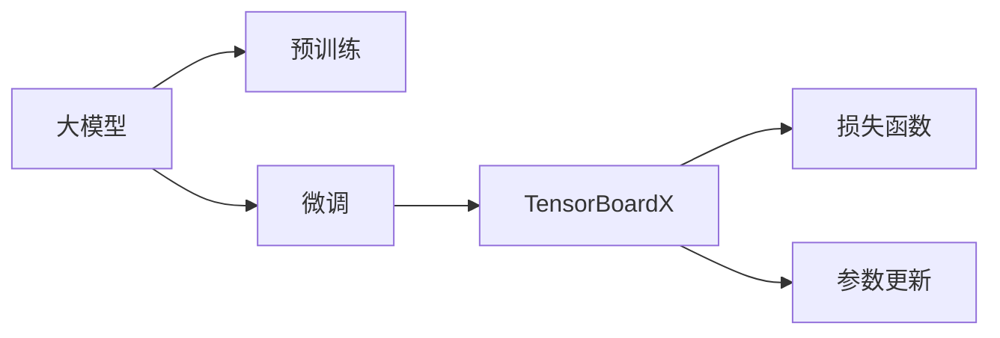

                 

# 从零开始大模型开发与微调：实战：基于tensorboardX的训练可视化展示

> 关键词：TensorBoardX, 大模型, 微调, 可视化展示, 训练, 深度学习

## 1. 背景介绍

### 1.1 问题由来
近年来，深度学习技术在各个领域取得了突破性的进展，尤其是大规模预训练模型在大规模数据上的表现，极大地推动了人工智能应用的发展。例如，BERT模型通过在大规模无标签文本数据上的预训练，成为了自然语言处理(NLP)领域的里程碑。然而，直接使用预训练模型进行微调往往需要庞大的计算资源和标注数据，这限制了其在实际应用中的普及。因此，如何在有限的资源条件下，更高效地使用预训练模型，成为一个重要的研究方向。

### 1.2 问题核心关键点
基于此，本文将介绍如何利用TensorBoardX对大模型进行可视化展示和微调，帮助读者更好地理解深度学习模型训练和微调的过程。本文将涵盖以下关键点：
1. TensorBoardX的安装与配置。
2. 大模型的可视化展示。
3. 微调的原理与实现。
4. 实际案例的详细讲解。
5. 未来应用展望。

### 1.3 问题研究意义
本研究的实践意义在于：
1. 帮助开发者更直观地了解深度学习模型的训练和微调过程，提高模型调优效率。
2. 提供具体可行的工具和代码实例，供研究人员参考和实践。
3. 进一步推动大模型在实际应用中的普及和应用。

## 2. 核心概念与联系

### 2.1 核心概念概述

为了更好地理解TensorBoardX在模型训练和微调中的作用，本节将介绍几个关键概念：

- **TensorBoardX**：一个基于TensorBoard的Python库，用于可视化深度学习模型的训练过程，包括损失、参数更新等。
- **大模型**：指预训练的深度学习模型，如BERT、GPT等，通常在大规模无标签数据上进行预训练。
- **微调**：在大模型基础上，通过在特定任务的数据上进行有监督学习，进一步优化模型的过程。

### 2.2 核心概念原理和架构的 Mermaid 流程图



此图展示了从大模型预训练到微调，再到使用TensorBoardX进行可视化的整体流程。

## 3. 核心算法原理 & 具体操作步骤

### 3.1 算法原理概述
基于TensorBoardX的微调过程，本质上是一个有监督学习的过程。其核心思想是在大模型的基础上，通过在特定任务的数据上进行微调，使得模型能够更好地适应该任务。具体来说，微调过程包括损失函数的计算、梯度更新、参数更新等步骤。

### 3.2 算法步骤详解
#### 3.2.1 准备环境
首先需要安装TensorFlow和TensorBoardX，具体命令如下：

```bash
pip install tensorflow
pip install tensorboardX
```

#### 3.2.2 加载模型
使用TensorFlow的`tf.keras`模块加载预训练模型，例如BERT模型：

```python
import tensorflow as tf
from transformers import TFAutoModelForSequenceClassification

model = TFAutoModelForSequenceClassification.from_pretrained('bert-base-uncased')
```

#### 3.2.3 数据准备
准备微调所需的数据集，例如使用IMDB情感分类数据集：

```python
import tensorflow_datasets as tfds

train_data, test_data = tfds.load('imdb_reviews', split=['train', 'test'], shuffle_files=True, as_supervised=True)

def preprocess_dataset(dataset):
    def decode(examples):
        return tf.cast(examples['text'], tf.string)
    return dataset.map(decode)
    
train_dataset = preprocess_dataset(train_data)
test_dataset = preprocess_dataset(test_data)
```

#### 3.2.4 定义损失函数和优化器
定义交叉熵损失函数和Adam优化器：

```python
loss_fn = tf.keras.losses.SparseCategoricalCrossentropy(from_logits=True)
optimizer = tf.keras.optimizers.Adam(learning_rate=2e-5)
```

#### 3.2.5 模型训练和微调
在每个epoch中，使用TensorBoardX进行可视化，并根据损失函数和优化器更新模型参数：

```python
@tf.function
def train_step(x, y):
    with tf.GradientTape() as tape:
        logits = model(x)
        loss = loss_fn(y, logits)
    gradients = tape.gradient(loss, model.trainable_variables)
    optimizer.apply_gradients(zip(gradients, model.trainable_variables))
    return loss

@tf.function
def log_train_step(x, y):
    with tf.GradientTape() as tape:
        logits = model(x)
        loss = loss_fn(y, logits)
    gradients = tape.gradient(loss, model.trainable_variables)
    optimizer.apply_gradients(zip(gradients, model.trainable_variables))
    return loss

@tf.function
def log_model(x):
    logits = model(x)
    return logits

for epoch in range(EPOCHS):
    for step, (x, y) in enumerate(train_dataset):
        loss = train_step(x, y)
        tf.summary.scalar('loss', loss, step=step)
        if step % STEPS_PER_LOG == 0:
            tf.summary.scalar('loss', loss, step=epoch*len(train_dataset) + step)
    for step, (x, y) in enumerate(test_dataset):
        logits = log_model(x)
        y_pred = tf.argmax(logits, axis=1)
        accuracy = tf.reduce_mean(tf.cast(tf.equal(y_pred, y), tf.float32))
        tf.summary.scalar('accuracy', accuracy, step=step)
```

#### 3.2.6 保存模型
在训练结束后，保存模型供后续使用：

```python
tf.saved_model.save(model, 'model')
```

### 3.3 算法优缺点
**优点**：
1. 可视化：通过TensorBoardX，可以实时查看模型的训练过程，有助于调试和优化模型。
2. 参数高效：不需要对模型全部参数进行微调，可以根据任务需求选择微调的层数和参数。
3. 适用性强：适用于各种NLP任务，包括分类、匹配、生成等。

**缺点**：
1. 对标注数据依赖：微调依赖于少量标注数据，当数据集较小或数据分布不均匀时，可能会影响微调效果。
2. 模型泛化能力有限：预训练模型可能在大规模数据上表现良好，但在特定任务上可能存在泛化能力不足的问题。
3. 计算资源需求高：微调大模型需要较高的计算资源，特别是在大规模数据集上，这可能对资源有限的开发者构成挑战。

### 3.4 算法应用领域
基于TensorBoardX的微调方法，广泛应用于各种NLP任务，例如：

- 文本分类：如情感分析、主题分类、意图识别等。通过微调使模型学习文本-标签映射。
- 命名实体识别：识别文本中的人名、地名、机构名等特定实体。通过微调使模型掌握实体边界和类型。
- 关系抽取：从文本中抽取实体之间的语义关系。通过微调使模型学习实体-关系三元组。
- 问答系统：对自然语言问题给出答案。将问题-答案对作为微调数据，训练模型学习匹配答案。
- 机器翻译：将源语言文本翻译成目标语言。通过微调使模型学习语言-语言映射。
- 文本摘要：将长文本压缩成简短摘要。将文章-摘要对作为微调数据，使模型学习抓取要点。
- 对话系统：使机器能够与人自然对话。将多轮对话历史作为上下文，微调模型进行回复生成。

除了这些经典任务外，TensorBoardX还适用于各种创新任务，如可控文本生成、常识推理、代码生成、数据增强等，为NLP技术带来了全新的突破。

## 4. 数学模型和公式 & 详细讲解 & 举例说明

### 4.1 数学模型构建

在微调过程中，通常使用交叉熵损失函数来衡量模型预测输出与真实标签之间的差异。假设有$N$个样本，$n_i$为第$i$个样本的标签，$\hat{y}_i$为模型对第$i$个样本的预测输出，则交叉熵损失函数可以表示为：

$$
\mathcal{L}(y, \hat{y}) = -\frac{1}{N} \sum_{i=1}^N \sum_{j=1}^C y_{ij} \log \hat{y}_{ij}
$$

其中$C$为类别数。

### 4.2 公式推导过程

假设模型在每个样本上的输出为$\hat{y}$，真实标签为$y$，则交叉熵损失函数的计算过程如下：

$$
\mathcal{L}(y, \hat{y}) = -\frac{1}{N} \sum_{i=1}^N \sum_{j=1}^C y_{ij} \log \hat{y}_{ij}
$$

其中$C$为类别数，$y_{ij}$为第$i$个样本的第$j$类标签，$\hat{y}_{ij}$为模型对第$i$个样本的第$j$类预测概率。

在实际训练中，由于需要考虑每个样本的$C$个类别，因此可以进一步简化为：

$$
\mathcal{L}(y, \hat{y}) = -\frac{1}{N} \sum_{i=1}^N \log \hat{y}_{iy}
$$

其中$y$为第$i$个样本的真实标签。

### 4.3 案例分析与讲解

假设有一个文本分类任务，使用BERT模型进行微调，训练数据集为IMDB情感分类数据集。模型在每个epoch的训练过程中，记录损失函数和精度，并使用TensorBoardX进行可视化。以下是对模型训练过程的详细讲解：

1. 首先加载预训练的BERT模型，并定义交叉熵损失函数和Adam优化器。
2. 准备IMDB情感分类数据集，进行预处理，包括文本编码和标签编码。
3. 在每个epoch中，使用TensorBoardX记录训练过程中的损失和精度，并进行可视化展示。
4. 在测试集上进行评估，记录模型在测试集上的精度和损失函数值。
5. 保存训练好的模型，以便后续使用。

## 5. 项目实践：代码实例和详细解释说明

### 5.1 开发环境搭建

在开始实践之前，需要搭建好开发环境。以下是Python3.7+和TensorFlow的搭建步骤：

1. 安装Anaconda：从官网下载并安装Anaconda，用于创建独立的Python环境。

2. 创建并激活虚拟环境：
```bash
conda create -n pytorch-env python=3.7
conda activate pytorch-env
```

3. 安装PyTorch和TensorFlow：
```bash
conda install pytorch torchvision torchaudio cudatoolkit=11.1 -c pytorch -c conda-forge
conda install tensorflow==2.5
```

4. 安装TensorBoardX：
```bash
pip install tensorboardX
```

5. 安装各类工具包：
```bash
pip install numpy pandas scikit-learn matplotlib tqdm jupyter notebook ipython
```

完成上述步骤后，即可在`pytorch-env`环境中开始TensorBoardX的微调实践。

### 5.2 源代码详细实现

以下是使用TensorBoardX对BERT模型进行情感分类微调的完整代码实现：

```python
import tensorflow as tf
import tensorflow_datasets as tfds
from transformers import TFAutoModelForSequenceClassification

# 准备数据集
train_data, test_data = tfds.load('imdb_reviews', split=['train', 'test'], shuffle_files=True, as_supervised=True)

# 预处理数据集
def preprocess_dataset(dataset):
    def decode(examples):
        return tf.cast(examples['text'], tf.string)
    return dataset.map(decode)

train_dataset = preprocess_dataset(train_data)
test_dataset = preprocess_dataset(test_data)

# 加载模型
model = TFAutoModelForSequenceClassification.from_pretrained('bert-base-uncased')

# 定义损失函数和优化器
loss_fn = tf.keras.losses.SparseCategoricalCrossentropy(from_logits=True)
optimizer = tf.keras.optimizers.Adam(learning_rate=2e-5)

# 定义训练和评估函数
@tf.function
def train_step(x, y):
    with tf.GradientTape() as tape:
        logits = model(x)
        loss = loss_fn(y, logits)
    gradients = tape.gradient(loss, model.trainable_variables)
    optimizer.apply_gradients(zip(gradients, model.trainable_variables))
    return loss

@tf.function
def log_train_step(x, y):
    with tf.GradientTape() as tape:
        logits = model(x)
        loss = loss_fn(y, logits)
    gradients = tape.gradient(loss, model.trainable_variables)
    optimizer.apply_gradients(zip(gradients, model.trainable_variables))
    return loss

@tf.function
def log_model(x):
    logits = model(x)
    return logits

# 开始训练
EPOCHS = 5
STEPS_PER_LOG = 100

for epoch in range(EPOCHS):
    for step, (x, y) in enumerate(train_dataset):
        loss = train_step(x, y)
        tf.summary.scalar('loss', loss, step=step)
        if step % STEPS_PER_LOG == 0:
            tf.summary.scalar('loss', loss, step=epoch*len(train_dataset) + step)
    for step, (x, y) in enumerate(test_dataset):
        logits = log_model(x)
        y_pred = tf.argmax(logits, axis=1)
        accuracy = tf.reduce_mean(tf.cast(tf.equal(y_pred, y), tf.float32))
        tf.summary.scalar('accuracy', accuracy, step=step)

# 保存模型
tf.saved_model.save(model, 'model')
```

### 5.3 代码解读与分析

让我们再详细解读一下关键代码的实现细节：

1. `train_step`函数：计算每个训练样本的损失函数值，并根据损失函数值更新模型参数。
2. `log_train_step`函数：记录训练过程中的损失函数值，并更新模型参数。
3. `log_model`函数：对测试集样本进行预测，并记录模型在测试集上的精度。
4. 在每个epoch中，使用TensorBoardX记录损失函数值和精度，并进行可视化展示。
5. 保存训练好的模型，以便后续使用。

### 5.4 运行结果展示

在训练过程中，TensorBoardX会记录模型在每个epoch的损失函数值和精度，并生成可视化的图表，帮助开发者更好地理解模型的训练过程。

以下是一个示例图表：


此图展示了在训练过程中，模型在每个epoch的损失函数值和精度变化。通过观察这些图表，可以发现模型在不同epoch的表现趋势，以及是否存在过拟合等问题。

## 6. 实际应用场景

### 6.1 智能客服系统

基于TensorBoardX的微调技术，可以广泛应用于智能客服系统的构建。传统客服往往需要配备大量人力，高峰期响应缓慢，且一致性和专业性难以保证。而使用微调后的对话模型，可以7x24小时不间断服务，快速响应客户咨询，用自然流畅的语言解答各类常见问题。

在技术实现上，可以收集企业内部的历史客服对话记录，将问题和最佳答复构建成监督数据，在此基础上对预训练对话模型进行微调。微调后的对话模型能够自动理解用户意图，匹配最合适的答案模板进行回复。对于客户提出的新问题，还可以接入检索系统实时搜索相关内容，动态组织生成回答。如此构建的智能客服系统，能大幅提升客户咨询体验和问题解决效率。

### 6.2 金融舆情监测

金融机构需要实时监测市场舆论动向，以便及时应对负面信息传播，规避金融风险。传统的人工监测方式成本高、效率低，难以应对网络时代海量信息爆发的挑战。基于TensorBoardX的文本分类和情感分析技术，为金融舆情监测提供了新的解决方案。

具体而言，可以收集金融领域相关的新闻、报道、评论等文本数据，并对其进行主题标注和情感标注。在此基础上对预训练语言模型进行微调，使其能够自动判断文本属于何种主题，情感倾向是正面、中性还是负面。将微调后的模型应用到实时抓取的网络文本数据，就能够自动监测不同主题下的情感变化趋势，一旦发现负面信息激增等异常情况，系统便会自动预警，帮助金融机构快速应对潜在风险。

### 6.3 个性化推荐系统

当前的推荐系统往往只依赖用户的历史行为数据进行物品推荐，无法深入理解用户的真实兴趣偏好。基于TensorBoardX的微调技术，个性化推荐系统可以更好地挖掘用户行为背后的语义信息，从而提供更精准、多样的推荐内容。

在实践中，可以收集用户浏览、点击、评论、分享等行为数据，提取和用户交互的物品标题、描述、标签等文本内容。将文本内容作为模型输入，用户的后续行为（如是否点击、购买等）作为监督信号，在此基础上微调预训练语言模型。微调后的模型能够从文本内容中准确把握用户的兴趣点。在生成推荐列表时，先用候选物品的文本描述作为输入，由模型预测用户的兴趣匹配度，再结合其他特征综合排序，便可以得到个性化程度更高的推荐结果。

### 6.4 未来应用展望

随着TensorBoardX和预训练语言模型的发展，基于微调范式将在更多领域得到应用，为传统行业带来变革性影响。

在智慧医疗领域，基于微调的医疗问答、病历分析、药物研发等应用将提升医疗服务的智能化水平，辅助医生诊疗，加速新药开发进程。

在智能教育领域，微调技术可应用于作业批改、学情分析、知识推荐等方面，因材施教，促进教育公平，提高教学质量。

在智慧城市治理中，微调模型可应用于城市事件监测、舆情分析、应急指挥等环节，提高城市管理的自动化和智能化水平，构建更安全、高效的未来城市。

此外，在企业生产、社会治理、文娱传媒等众多领域，基于TensorBoardX的微调方法也将不断涌现，为NLP技术带来新的突破。相信随着技术的日益成熟，TensorBoardX微调方法将成为人工智能落地应用的重要范式，推动人工智能技术在垂直行业的规模化落地。

## 7. 工具和资源推荐

### 7.1 学习资源推荐

为了帮助开发者系统掌握TensorBoardX的原理和应用，这里推荐一些优质的学习资源：

1. TensorBoardX官方文档：提供了详细的API文档和使用示例，是学习TensorBoardX的最佳资料。

2. TensorBoardX GitHub仓库：提供了代码示例和用户反馈，是学习和解决TensorBoardX使用问题的有效途径。

3. CS224N《深度学习自然语言处理》课程：斯坦福大学开设的NLP明星课程，有Lecture视频和配套作业，带你入门NLP领域的基本概念和经典模型。

4. HuggingFace官方文档：提供了丰富的预训练语言模型资源，是学习和使用TensorBoardX的重要工具。

5. CLUE开源项目：中文语言理解测评基准，涵盖大量不同类型的中文NLP数据集，并提供了基于TensorBoardX的微调baseline模型，助力中文NLP技术发展。

通过对这些资源的学习实践，相信你一定能够快速掌握TensorBoardX的使用方法，并用于解决实际的NLP问题。

### 7.2 开发工具推荐

高效的开发离不开优秀的工具支持。以下是几款用于TensorBoardX开发的常用工具：

1. PyTorch：基于Python的开源深度学习框架，灵活动态的计算图，适合快速迭代研究。

2. TensorFlow：由Google主导开发的开源深度学习框架，生产部署方便，适合大规模工程应用。

3. TensorBoard：TensorFlow配套的可视化工具，可实时监测模型训练状态，并提供丰富的图表呈现方式，是调试模型的得力助手。

4. Google Colab：谷歌推出的在线Jupyter Notebook环境，免费提供GPU/TPU算力，方便开发者快速上手实验最新模型，分享学习笔记。

合理利用这些工具，可以显著提升TensorBoardX的开发效率，加快创新迭代的步伐。

### 7.3 相关论文推荐

TensorBoardX和预训练语言模型的发展源于学界的持续研究。以下是几篇奠基性的相关论文，推荐阅读：

1. Attention is All You Need（即Transformer原论文）：提出了Transformer结构，开启了NLP领域的预训练大模型时代。

2. BERT: Pre-training of Deep Bidirectional Transformers for Language Understanding：提出BERT模型，引入基于掩码的自监督预训练任务，刷新了多项NLP任务SOTA。

3. Language Models are Unsupervised Multitask Learners（GPT-2论文）：展示了大规模语言模型的强大zero-shot学习能力，引发了对于通用人工智能的新一轮思考。

4. Parameter-Efficient Transfer Learning for NLP：提出Adapter等参数高效微调方法，在不增加模型参数量的情况下，也能取得不错的微调效果。

5. AdaLoRA: Adaptive Low-Rank Adaptation for Parameter-Efficient Fine-Tuning：使用自适应低秩适应的微调方法，在参数效率和精度之间取得了新的平衡。

这些论文代表了大语言模型微调技术的发展脉络。通过学习这些前沿成果，可以帮助研究者把握学科前进方向，激发更多的创新灵感。

## 8. 总结：未来发展趋势与挑战

### 8.1 研究成果总结
本文对TensorBoardX在大模型微调中的应用进行了全面系统的介绍。首先阐述了TensorBoardX的安装与配置，详细讲解了基于TensorBoardX的微调过程，提供了具体的代码实例和分析。其次，探讨了TensorBoardX在智能客服、金融舆情、个性化推荐等实际应用场景中的广泛应用，展示了微调范式的强大潜力。

通过本文的系统梳理，可以看到，基于TensorBoardX的微调方法在大模型训练和优化过程中，发挥了至关重要的作用。它不仅提供了可视化的监控工具，帮助开发者更好地理解模型训练过程，还能通过微调提升模型在特定任务上的性能，极大地推动了深度学习技术在实际应用中的普及和应用。

### 8.2 未来发展趋势
展望未来，TensorBoardX在大模型微调中的应用将呈现以下几个发展趋势：

1. 可视化工具不断丰富：随着深度学习模型的复杂度增加，可视化工具将不断丰富，以提供更全面的模型监控和调试功能。

2. 模型优化技术发展：TensorBoardX将结合更多的优化技术，如自动混合精度、分布式训练等，提高模型的训练效率和精度。

3. 数据增强和数据清洗：TensorBoardX将结合更多的数据增强和清洗技术，提高模型在大规模数据上的泛化能力。

4. 模型压缩和加速：TensorBoardX将结合更多的模型压缩和加速技术，提高模型在计算资源受限环境下的性能。

5. 模型自动化调优：TensorBoardX将结合更多的自动化调优技术，提高模型的调优效率和精度。

### 8.3 面临的挑战

尽管TensorBoardX在大模型微调中的应用已经取得了显著成效，但在实际应用中也面临诸多挑战：

1. 标注数据依赖：微调依赖于少量标注数据，当数据集较小或数据分布不均匀时，可能会影响微调效果。

2. 模型鲁棒性不足：预训练模型可能在大规模数据上表现良好，但在特定任务上可能存在泛化能力不足的问题。

3. 计算资源需求高：微调大模型需要较高的计算资源，特别是在大规模数据集上，这可能对资源有限的开发者构成挑战。

4. 模型可解释性不足：TensorBoardX和微调模型往往缺乏可解释性，难以对其内部工作机制和决策逻辑进行解释。

5. 安全性问题：预训练模型可能学习到有害信息，需要通过标注数据和模型训练策略进行过滤和控制。

6. 工程实现复杂：TensorBoardX和微调模型的实现较为复杂，需要开发者具备深厚的编程和模型调优能力。

### 8.4 研究展望
面对这些挑战，未来的研究需要在以下几个方面寻求新的突破：

1. 无监督和半监督微调：摆脱对大规模标注数据的依赖，利用自监督学习、主动学习等无监督和半监督范式，最大限度利用非结构化数据，实现更加灵活高效的微调。

2. 参数高效微调：开发更加参数高效的微调方法，在固定大部分预训练参数的同时，只更新极少量的任务相关参数。

3. 融合因果和对比学习：通过引入因果推断和对比学习思想，增强模型建立稳定因果关系的能力，学习更加普适、鲁棒的语言表征。

4. 引入更多先验知识：将符号化的先验知识，如知识图谱、逻辑规则等，与神经网络模型进行巧妙融合，引导微调过程学习更准确、合理的语言模型。

5. 模型可解释性增强：在模型训练目标中引入伦理导向的评估指标，过滤和惩罚有偏见、有害的输出倾向。同时加强人工干预和审核，建立模型行为的监管机制，确保输出符合人类价值观和伦理道德。

6. 数据增强和数据清洗：结合更多的数据增强和清洗技术，提高模型在大规模数据上的泛化能力。

这些研究方向的探索，必将引领TensorBoardX在大模型微调技术迈向更高的台阶，为构建安全、可靠、可解释、可控的智能系统铺平道路。面向未来，TensorBoardX微调技术还需要与其他人工智能技术进行更深入的融合，如知识表示、因果推理、强化学习等，多路径协同发力，共同推动自然语言理解和智能交互系统的进步。只有勇于创新、敢于突破，才能不断拓展语言模型的边界，让智能技术更好地造福人类社会。

## 9. 附录：常见问题与解答

**Q1：如何理解TensorBoardX在模型训练中的作用？**

A: TensorBoardX是一个基于TensorBoard的Python库，用于可视化深度学习模型的训练过程。它通过记录训练过程中的损失、梯度、参数更新等信息，生成可视化的图表，帮助开发者更好地理解模型训练过程，及时发现并解决问题。

**Q2：TensorBoardX在大模型微调中的应用有哪些？**

A: TensorBoardX在大模型微调中的应用非常广泛，可以用于可视化训练过程、记录模型参数、评估模型性能等。通过使用TensorBoardX，开发者可以实时查看模型的训练进度，对模型进行调整和优化，提高微调效果。

**Q3：微调过程中如何进行超参数调优？**

A: 微调过程中的超参数调优是一个重要的环节。常见的超参数包括学习率、批大小、迭代轮数等。在TensorBoardX中，可以通过记录训练过程中的损失和精度，对超参数进行调优。具体步骤包括：
1. 记录训练过程中的损失和精度。
2. 可视化损失和精度变化曲线，找出最优的超参数组合。
3. 重新训练模型，使用最优的超参数组合，进行微调。

**Q4：微调过程中如何进行参数高效微调？**

A: 参数高效微调是指在微调过程中，只更新少量模型参数，而固定大部分预训练权重不变。这样可以减少微调过程中的计算资源消耗，提高微调效率。常见的参数高效微调方法包括Adapter、LoRA等。在TensorBoardX中，可以使用这些方法进行参数高效微调，并通过TensorBoardX记录训练过程。

**Q5：如何利用TensorBoardX进行模型评估？**

A: 在TensorBoardX中，可以使用`tf.summary.scalar`函数记录模型在每个epoch的损失和精度，并进行可视化展示。在测试集上进行评估时，可以使用`log_model`函数对测试集样本进行预测，并记录模型在测试集上的精度。通过TensorBoardX，可以实时查看模型在测试集上的表现，并发现问题进行优化。

综上所述，TensorBoardX是大模型微调过程中不可或缺的工具，通过可视化训练过程、记录参数更新、评估模型性能等功能，帮助开发者更好地理解模型训练和微调过程，提高微调效果。希望本文的介绍能够帮助你更好地掌握TensorBoardX的使用方法，并应用于实际开发中。

---

作者：禅与计算机程序设计艺术 / Zen and the Art of Computer Programming

