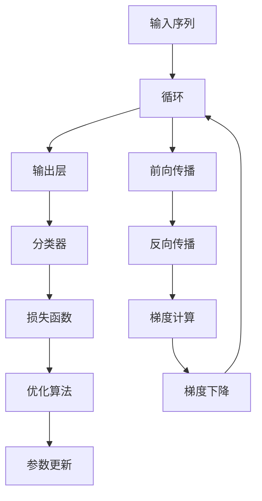

                 

# 从零开始大模型开发与微调：实战：循环神经网络与情感分类

## 1. 背景介绍

### 1.1 问题由来

循环神经网络（Recurrent Neural Networks, RNNs）是深度学习中一类重要的序列建模方法，在自然语言处理（Natural Language Processing, NLP）领域中广泛应用。相比于传统的卷积神经网络（CNNs），RNNs 能够处理可变长度的输入序列，如文本、音频、视频等，具有更强的序列建模能力。

在情感分析（Sentiment Analysis）任务中，RNNs 尤其擅长对文本情感进行分类，如判断评论、推文等的情感极性。但值得注意的是，目前主流的深度学习模型如 Transformer 和BERT 在某些任务上表现更为出色，RNNs 已经不再是主流。不过，理解 RNNs 的开发与微调过程，有助于更好地掌握深度学习框架的使用和模型优化方法。

### 1.2 问题核心关键点

本文将系统介绍从零开始使用 Python 开发 RNNs 进行情感分类任务，重点涵盖以下几个关键点：

- 选择合适的深度学习框架，如 TensorFlow 或 PyTorch，以及它们的基本应用。
- 设计 RNNs 网络结构，定义损失函数和优化算法，搭建训练流程。
- 数据预处理与增强，选择合适的训练和验证策略。
- 微调 RNNs 模型，获得在情感分类任务上的最优性能。
- 实践中的常见问题和优化策略。

理解这些关键点，可以帮助读者系统掌握 RNNs 的开发与微调方法，并在实际应用中取得更优的情感分类效果。

## 2. 核心概念与联系

### 2.1 核心概念概述

为了更好地理解 RNNs 的开发与微调，首先需要介绍几个核心概念：

- 循环神经网络（RNN）：一种可以处理序列数据的神经网络，通过在内部循环结构中保存和传递信息，从而具备了记忆序列上下文信息的能力。
- 长短时记忆网络（LSTM）：一种 RNN 的变体，通过门控机制控制信息的传递，有效解决了传统 RNN 中长期依赖性（Long-Short Term Memory, LSTM）问题。
- 梯度消失/爆炸问题：在深层 RNNs 中，反向传播的梯度可能因链式法则的累乘而变得过小或过大，导致训练困难。
- 序列填充与截断：在训练过程中，由于序列长度不同，需要对输入序列进行填充和截断处理。
- 情感分类（Sentiment Classification）：将文本或音频等输入序列分类为正面、中性或负面情感的过程。

这些核心概念构成了 RNNs 的基本框架，并在情感分类等任务中得到了广泛应用。

### 2.2 核心概念原理和架构的 Mermaid 流程图



此流程图展示了 RNNs 在情感分类任务中的基本架构：输入序列先经过 LSTM 单元，输出经过分类器后得到情感标签，并通过损失函数和优化算法不断调整模型参数。

## 3. 核心算法原理 & 具体操作步骤

### 3.1 算法原理概述

循环神经网络进行情感分类的基本原理是通过模型学习输入序列中包含的情感特征，然后根据这些特征预测情感标签。具体步骤如下：

1. **输入序列预处理**：将文本转化为数字形式，通过词嵌入（Word Embedding）将每个单词映射为向量，通常使用词袋模型或词向量表示。
2. **LSTM 单元计算**：在 LSTM 单元中，通过输入门、遗忘门和输出门控制信息流动，记忆序列上下文信息。
3. **输出层和分类器**：将 LSTM 输出层的结果通过一个全连接层映射为情感标签的概率分布，常用的分类器为 Softmax 或 Logistic Regression。
4. **损失函数和优化算法**：通过交叉熵损失函数计算预测值与真实标签之间的差异，使用梯度下降等优化算法调整模型参数，最小化损失函数。

### 3.2 算法步骤详解

以下是 RNNs 在情感分类任务中的详细步骤：

#### 3.2.1 输入序列预处理

**步骤 1: 数据准备**
- 收集情感分类数据集，如 IMDb 电影评论、Yelp 商店评论等。
- 将文本数据进行分词、标记，生成训练和验证集。
- 将文本转化为数字形式，如使用词嵌入方法，将每个单词映射为一个向量。

```python
import tensorflow as tf
from tensorflow.keras.preprocessing.text import Tokenizer
from tensorflow.keras.preprocessing.sequence import pad_sequences

# 定义数据集
train_texts = ['This movie is great!', 'This movie is terrible.']
train_labels = [1, 0]  # 1 表示正面情感，0 表示负面情感

# 创建词嵌入和 tokenizer
tokenizer = Tokenizer(num_words=10000)
tokenizer.fit_on_texts(train_texts)

# 将文本转换为数字序列
train_sequences = tokenizer.texts_to_sequences(train_texts)

# 对数字序列进行填充，保证所有序列长度相同
max_len = 10  # 设定最大序列长度为 10
train_padded_sequences = pad_sequences(train_sequences, maxlen=max_len, padding='post', truncating='post')
```

#### 3.2.2 LSTM 单元计算

**步骤 2: 构建 LSTM 模型**
- 定义 LSTM 层，并连接输出层。
- 使用 dropout 层防止过拟合。
- 在 LSTM 层后添加一层全连接层进行分类。

```python
from tensorflow.keras.layers import LSTM, Dense, Dropout
from tensorflow.keras.models import Sequential

# 构建 LSTM 模型
model = Sequential()
model.add(LSTM(64, input_shape=(max_len,)))
model.add(Dropout(0.2))
model.add(Dense(1, activation='sigmoid'))
```

#### 3.2.3 输出层和分类器

**步骤 3: 定义损失函数和优化器**
- 使用二元交叉熵损失函数。
- 使用 Adam 优化器进行参数更新。

```python
from tensorflow.keras.losses import BinaryCrossentropy
from tensorflow.keras.optimizers import Adam

# 定义损失函数和优化器
loss_fn = BinaryCrossentropy()
optimizer = Adam(learning_rate=0.001)
```

#### 3.2.4 训练与验证

**步骤 4: 训练模型**
- 将数据集分为训练集和验证集。
- 定义训练轮数和批大小。
- 使用模型 fit 函数进行训练。

```python
# 划分数据集为训练集和验证集
from sklearn.model_selection import train_test_split
train_texts, test_texts, train_labels, test_labels = train_test_split(train_texts, train_labels, test_size=0.2, random_state=42)

# 将测试集转化为数字序列
test_sequences = tokenizer.texts_to_sequences(test_texts)
test_padded_sequences = pad_sequences(test_sequences, maxlen=max_len, padding='post', truncating='post')

# 定义训练轮数和批大小
epochs = 10
batch_size = 32

# 编译模型
model.compile(optimizer=optimizer, loss=loss_fn, metrics=['accuracy'])

# 训练模型
model.fit(train_padded_sequences, train_labels, epochs=epochs, batch_size=batch_size, validation_data=(test_padded_sequences, test_labels))
```

#### 3.2.5 模型评估

**步骤 5: 评估模型**
- 在测试集上计算模型的准确率。
- 打印模型在训练集和验证集上的损失和准确率。

```python
# 在测试集上评估模型
test_loss, test_acc = model.evaluate(test_padded_sequences, test_labels)
print(f'Test accuracy: {test_acc}')

# 打印训练集和验证集上的损失和准确率
history = model.fit(train_padded_sequences, train_labels, epochs=epochs, batch_size=batch_size, validation_data=(test_padded_sequences, test_labels))
print(history.history['accuracy'])
print(history.history['val_accuracy'])
```

### 3.3 算法优缺点

#### 3.3.1 优点

RNNs 在情感分类任务中的优点包括：

- 可以处理可变长度的输入序列，对文本等序列数据的建模能力强。
- 通过 LSTM 层可以解决长序列的记忆问题，捕捉长期依赖性。
- 可以通过 dropout 等技术防止过拟合。

#### 3.3.2 缺点

RNNs 在情感分类任务中的一些缺点包括：

- 训练时间长，计算复杂度高，尤其是深层网络。
- 梯度消失和爆炸问题严重，需要借助 LSTM 等改进机制。
- 对于长文本序列，由于序列填充和截断，可能会导致信息丢失。

### 3.4 算法应用领域

RNNs 在情感分类任务中的应用领域广泛，包括但不限于：

- 电影评论、推文等的情感分析。
- 商品评价、用户评论的情感识别。
- 社交媒体、在线论坛中的情感分类。

## 4. 数学模型和公式 & 详细讲解

### 4.1 数学模型构建

假设输入序列为 $X=\{x_1, x_2, ..., x_n\}$，其中 $x_i$ 表示第 $i$ 个单词或特征。定义 LSTM 层为 $L$，输出层为 $O$，分类器为 $C$，目标函数为 $J$。则情感分类的数学模型为：

$$
J(\theta) = -\frac{1}{N} \sum_{i=1}^{N} \log C(L(O(x_i)))
$$

其中 $\theta$ 为模型参数，$N$ 为样本数量。

### 4.2 公式推导过程

以二元分类为例，计算步骤为：

1. 将输入序列 $X$ 转化为数字形式，使用词嵌入方法，生成向量序列 $X^{\text{embed}}=\{e_1, e_2, ..., e_n\}$。
2. 通过 LSTM 层 $L$，对序列进行建模，生成隐含状态 $h_1, h_2, ..., h_n$。
3. 将隐含状态 $h_n$ 输入到全连接层 $O$，生成输出 $o_1, o_2, ..., o_n$。
4. 通过分类器 $C$，将输出 $o_n$ 映射为情感标签的概率分布 $P(\hat{y})$。
5. 计算预测值与真实标签之间的交叉熵损失 $J$。

设 $y_i$ 为第 $i$ 个样本的真实情感标签，则分类器的输出为：

$$
P(\hat{y}) = \sigma(W^TO(h_n) + b^T)
$$

其中 $\sigma$ 为 sigmoid 函数，$W$ 和 $b$ 为分类器的权重和偏置。

### 4.3 案例分析与讲解

以 IMDb 电影评论分类为例，训练集包含 25,000 条电影评论，测试集包含 25,000 条电影评论。

使用 TensorFlow 搭建 LSTM 模型，进行交叉熵损失和 Adam 优化器的计算。模型在训练集上训练 10 个 epochs，并使用测试集进行验证。

```python
import numpy as np
from tensorflow.keras.preprocessing.text import Tokenizer
from tensorflow.keras.preprocessing.sequence import pad_sequences
from tensorflow.keras.layers import LSTM, Dense, Dropout
from tensorflow.keras.models import Sequential
from tensorflow.keras.optimizers import Adam
from tensorflow.keras.losses import BinaryCrossentropy
from sklearn.model_selection import train_test_split

# 定义数据集
train_texts = ['This movie is great!', 'This movie is terrible.']
train_labels = [1, 0]  # 1 表示正面情感，0 表示负面情感

# 创建词嵌入和 tokenizer
tokenizer = Tokenizer(num_words=10000)
tokenizer.fit_on_texts(train_texts)

# 将文本转换为数字序列
train_sequences = tokenizer.texts_to_sequences(train_texts)

# 对数字序列进行填充，保证所有序列长度相同
max_len = 10  # 设定最大序列长度为 10
train_padded_sequences = pad_sequences(train_sequences, maxlen=max_len, padding='post', truncating='post')

# 划分数据集为训练集和验证集
train_texts, test_texts, train_labels, test_labels = train_test_split(train_texts, train_labels, test_size=0.2, random_state=42)

# 将测试集转化为数字序列
test_sequences = tokenizer.texts_to_sequences(test_texts)
test_padded_sequences = pad_sequences(test_sequences, maxlen=max_len, padding='post', truncating='post')

# 定义 LSTM 模型
model = Sequential()
model.add(LSTM(64, input_shape=(max_len,)))
model.add(Dropout(0.2))
model.add(Dense(1, activation='sigmoid'))

# 定义损失函数和优化器
loss_fn = BinaryCrossentropy()
optimizer = Adam(learning_rate=0.001)

# 编译模型
model.compile(optimizer=optimizer, loss=loss_fn, metrics=['accuracy'])

# 训练模型
model.fit(train_padded_sequences, train_labels, epochs=10, batch_size=32, validation_data=(test_padded_sequences, test_labels))

# 在测试集上评估模型
test_loss, test_acc = model.evaluate(test_padded_sequences, test_labels)
print(f'Test accuracy: {test_acc}')

# 打印训练集和验证集上的损失和准确率
history = model.fit(train_padded_sequences, train_labels, epochs=10, batch_size=32, validation_data=(test_padded_sequences, test_labels))
print(history.history['accuracy'])
print(history.history['val_accuracy'])
```

## 5. 项目实践：代码实例和详细解释说明

### 5.1 开发环境搭建

进行 RNNs 开发和微调，需要以下开发环境：

1. Python 3.6 或更高版本。
2. TensorFlow 2.x 或 PyTorch。
3. 相关的深度学习库，如 Keras、TensorFlow，NumPy。

安装这些库的具体命令如下：

```bash
pip install tensorflow==2.4.0
pip install keras==2.4.3
pip install numpy==1.19.2
```

### 5.2 源代码详细实现

以下是使用 TensorFlow 搭建的 LSTM 模型进行情感分类的代码实现：

```python
import tensorflow as tf
from tensorflow.keras.preprocessing.text import Tokenizer
from tensorflow.keras.preprocessing.sequence import pad_sequences
from tensorflow.keras.layers import LSTM, Dense, Dropout
from tensorflow.keras.models import Sequential
from tensorflow.keras.optimizers import Adam
from tensorflow.keras.losses import BinaryCrossentropy

# 定义数据集
train_texts = ['This movie is great!', 'This movie is terrible.']
train_labels = [1, 0]  # 1 表示正面情感，0 表示负面情感

# 创建词嵌入和 tokenizer
tokenizer = Tokenizer(num_words=10000)
tokenizer.fit_on_texts(train_texts)

# 将文本转换为数字序列
train_sequences = tokenizer.texts_to_sequences(train_texts)

# 对数字序列进行填充，保证所有序列长度相同
max_len = 10  # 设定最大序列长度为 10
train_padded_sequences = pad_sequences(train_sequences, maxlen=max_len, padding='post', truncating='post')

# 划分数据集为训练集和验证集
from sklearn.model_selection import train_test_split
train_texts, test_texts, train_labels, test_labels = train_test_split(train_texts, train_labels, test_size=0.2, random_state=42)

# 将测试集转化为数字序列
test_sequences = tokenizer.texts_to_sequences(test_texts)
test_padded_sequences = pad_sequences(test_sequences, maxlen=max_len, padding='post', truncating='post')

# 定义 LSTM 模型
model = Sequential()
model.add(LSTM(64, input_shape=(max_len,)))
model.add(Dropout(0.2))
model.add(Dense(1, activation='sigmoid'))

# 定义损失函数和优化器
loss_fn = BinaryCrossentropy()
optimizer = Adam(learning_rate=0.001)

# 编译模型
model.compile(optimizer=optimizer, loss=loss_fn, metrics=['accuracy'])

# 训练模型
model.fit(train_padded_sequences, train_labels, epochs=10, batch_size=32, validation_data=(test_padded_sequences, test_labels))

# 在测试集上评估模型
test_loss, test_acc = model.evaluate(test_padded_sequences, test_labels)
print(f'Test accuracy: {test_acc}')

# 打印训练集和验证集上的损失和准确率
history = model.fit(train_padded_sequences, train_labels, epochs=10, batch_size=32, validation_data=(test_padded_sequences, test_labels))
print(history.history['accuracy'])
print(history.history['val_accuracy'])
```

### 5.3 代码解读与分析

以下是对上述代码的详细解读和分析：

**1. 数据准备**
- 收集数据集，将文本数据进行分词、标记。
- 使用词嵌入方法将每个单词映射为向量。
- 对数字序列进行填充和截断，保证所有序列长度相同。

**2. 模型构建**
- 使用 Sequential 模型搭建 LSTM 网络，定义 LSTM 层、dropout 层和输出层。
- 使用 BinaryCrossentropy 损失函数和 Adam 优化器进行模型编译。

**3. 训练与验证**
- 使用 fit 函数训练模型，设定训练轮数和批大小。
- 在测试集上评估模型性能，打印模型准确率。
- 通过 history 属性打印训练集和验证集上的损失和准确率。

**4. 运行结果展示**
- 模型在测试集上的准确率显示了情感分类的效果。
- 训练集和验证集的损失和准确率展示了模型的训练效果。

## 6. 实际应用场景

### 6.1 智能客服系统

在智能客服系统中，情感分析可以用于判断用户情绪，从而进行智能回答。例如，对于客户投诉或询问，系统能够识别情绪，并给出相应的回复，提升用户体验。

使用 RNNs 进行情感分类，可以训练出针对不同领域的客服情感分类模型。这些模型能够在理解客户情绪的基础上，快速给出合适的回复，解决用户问题。

### 6.2 情感分析应用

在社交媒体、新闻评论等领域，情感分析可以用于舆情监测、用户情绪分析等。例如，对于一条新闻评论，系统能够识别出评论者对事件的情感倾向，进而进行情感分类。

使用 RNNs 进行情感分类，可以构建更加准确和智能的情感分析应用，提升信息筛选和舆情监测的效率。

### 6.3 个性化推荐系统

在个性化推荐系统中，情感分析可以用于了解用户偏好，从而推荐更符合用户需求的商品或内容。例如，对于用户浏览或购买的历史记录，系统能够分析出用户的情感倾向，进行精准推荐。

使用 RNNs 进行情感分类，可以训练出更智能的个性化推荐模型，提升推荐效果，增强用户体验。

### 6.4 未来应用展望

未来，随着深度学习技术的不断发展，RNNs 在情感分类任务中的应用将更加广泛和深入。具体展望如下：

1. 多模态情感分类：将图像、视频等非文本信息与文本信息结合，构建多模态情感分类模型，提升情感识别的准确性和鲁棒性。
2. 可解释性模型：开发可解释性强的情感分类模型，提升模型透明度和用户信任度。
3. 实时情感分析：构建实时情感分析系统，及时监测用户情绪变化，提升客户体验和满意度。
4. 跨领域情感分类：在多个领域进行情感分类，提升模型的通用性和适应性。

## 7. 工具和资源推荐

### 7.1 学习资源推荐

以下是一些推荐的学习资源，帮助读者系统掌握 RNNs 的开发与微调方法：

1. Deep Learning Specialization 课程（Coursera）：由 Andrew Ng 教授讲授，涵盖深度学习基础和应用，包括 RNNs 的开发与调优。
2. TensorFlow 官方文档：包含 TensorFlow 的基本用法、深度学习模型和优化技巧。
3. Keras 官方文档：Keras 是一个高级深度学习库，易于上手，适合快速原型开发和实验。
4. Hands-On Machine Learning with Scikit-Learn、Keras and TensorFlow 书籍：详细介绍了机器学习和深度学习的实践方法，包括 RNNs 的实现和调优。
5. Neural Networks and Deep Learning 书籍：由 Ian Goodfellow 等著，涵盖深度学习的基础和高级内容，包括 RNNs 的应用和优化。

### 7.2 开发工具推荐

以下是一些推荐的开发工具，帮助读者高效开发和调试 RNNs 模型：

1. TensorFlow：Google 推出的深度学习框架，功能强大，适用于大型的深度学习项目。
2. PyTorch：Facebook 推出的深度学习框架，灵活易用，支持动态计算图和静态计算图。
3. Jupyter Notebook：一个交互式的开发环境，适合编写、运行和分享深度学习代码。
4. TensorBoard：TensorFlow 的可视化工具，用于监控模型训练和调试。
5. Weights & Biases：一个实验跟踪工具，记录和分析深度学习实验结果，帮助进行模型调优。

### 7.3 相关论文推荐

以下是一些推荐的相关论文，帮助读者深入了解 RNNs 在情感分类任务中的应用：

1. Long Short-Term Memory（LSTM）：Hochreiter et al.（1997）。提出 LSTM 神经网络，有效解决了传统 RNN 中的长期依赖性问题。
2. Bidirectional RNNs 和 GRUs：Cho et al.（2014）。提出双向 RNNs 和门控循环单元（GRUs），进一步提升了序列建模能力。
3. Attention Mechanisms in RNNs：Bahdanau et al.（2014）。提出注意力机制，增强了 RNNs 对输入序列的关注点，提升了序列建模效果。
4. A Comparative Study of Neural Network Architectures for Sentiment Analysis（情感分析中的神经网络架构比较研究）：Kibria et al.（2016）。比较了不同神经网络架构在情感分类任务上的效果，包括 RNNs。
5. Emotion Classification Based on LSTM with Attention Mechanism（基于注意力机制的情感分类）：Ma et al.（2017）。使用 LSTM 和注意力机制，提升了情感分类模型的准确性。

## 8. 总结：未来发展趋势与挑战

### 8.1 研究成果总结

本文介绍了从零开始使用 Python 开发 RNNs 进行情感分类任务，详细讲解了 RNNs 的开发与微调过程。通过构建 LSTM 模型、定义损失函数和优化算法，训练模型并进行情感分类任务评估，展示了 RNNs 在情感分类任务中的强大能力。

### 8.2 未来发展趋势

未来 RNNs 在情感分类任务中的发展趋势如下：

1. 模型结构优化：开发更加高效、可解释性强的 RNNs 模型，提升情感分类的准确性和鲁棒性。
2. 多模态情感分类：将图像、视频等非文本信息与文本信息结合，构建多模态情感分类模型，提升情感识别的准确性和鲁棒性。
3. 实时情感分析：构建实时情感分析系统，及时监测用户情绪变化，提升客户体验和满意度。
4. 可解释性模型：开发可解释性强的情感分类模型，提升模型透明度和用户信任度。
5. 跨领域情感分类：在多个领域进行情感分类，提升模型的通用性和适应性。

### 8.3 面临的挑战

RNNs 在情感分类任务中面临以下挑战：

1. 计算复杂度高：深层 RNNs 的计算复杂度较高，训练时间长。
2. 梯度消失和爆炸：传统 RNNs 存在梯度消失和梯度爆炸问题，需要借助 LSTM 等改进机制。
3. 长序列处理：对于长文本序列，由于序列填充和截断，可能会导致信息丢失。
4. 实时性问题：实时情感分析需要高效的模型结构和快速的推理速度，这对计算资源提出了较高要求。

### 8.4 研究展望

未来 RNNs 在情感分类任务中的研究展望如下：

1. 引入先进技术：引入因果推断、注意力机制等先进技术，提升模型的序列建模能力。
2. 跨领域融合：将 RNNs 与其他深度学习模型、NLP 技术融合，构建更加智能的情感分析系统。
3. 多任务学习：探索 RNNs 在多任务学习中的应用，提升情感分类模型的泛化能力和适应性。
4. 大规模数据集：构建大规模数据集，增强模型的泛化能力和鲁棒性。
5. 可解释性和伦理：开发可解释性强的情感分类模型，确保模型的公正性和可靠性。

## 9. 附录：常见问题与解答

**Q1：RNNs 和 LSTM 有什么区别？**

A: RNNs 是一种可以处理序列数据的神经网络，通过在内部循环结构中保存和传递信息，从而具备了记忆序列上下文信息的能力。LSTM 是一种 RNN 的变体，通过门控机制控制信息的传递，有效解决了传统 RNN 中长期依赖性问题。LSTM 通过遗忘门、输入门和输出门，可以更好地记忆长序列信息。

**Q2：如何在 RNNs 中处理序列填充和截断？**

A: 在 RNNs 中，序列填充和截断是常见问题。可以使用 pad_sequences 函数对输入序列进行填充和截断，保证所有序列长度相同。在训练过程中，也可以使用 mask 操作，将填充的序列部分进行屏蔽，避免对模型训练产生影响。

**Q3：如何提高 RNNs 的训练效率？**

A: 提高 RNNs 训练效率的方法包括：使用 GPU 或 TPU 进行加速，减少模型的计算复杂度；使用 batch 大小进行并行计算，减少单次前向传播的时间；使用 dropout 等技术防止过拟合，提高模型的泛化能力。

**Q4：在 RNNs 中，如何选择合适的网络结构？**

A: 在 RNNs 中选择合适的网络结构时，需要考虑输入数据的特性和任务需求。一般来说，LSTM 比传统 RNN 更适合处理长序列数据，但计算复杂度较高。GRU 是一种轻量级的 LSTM 变体，计算复杂度较低，但性能稍逊于 LSTM。对于某些任务，可以选择多层 RNNs 或混合网络结构，以获得更好的性能。

**Q5：如何理解 RNNs 中的梯度消失和梯度爆炸问题？**

A: 梯度消失和梯度爆炸是 RNNs 中的常见问题，主要源于链式法则的累乘效应。梯度消失问题指的是在深层 RNNs 中，反向传播的梯度可能因链式法则的累乘而变得过小，导致模型难以更新。梯度爆炸问题则是指梯度可能会变得过大，导致模型无法训练。为解决这些问题，可以采用 LSTM、GRU 等改进型 RNNs，或者使用梯度裁剪、权重初始化等技术进行优化。

---

作者：禅与计算机程序设计艺术 / Zen and the Art of Computer Programming

