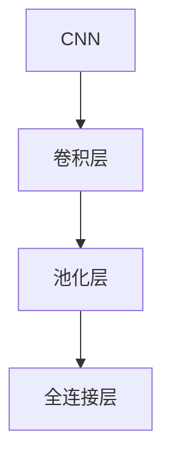

                 

# 从零开始大模型开发与微调：膨胀卷积详解

> 关键词：膨胀卷积,大模型开发,模型微调,卷积神经网络,深度学习,计算机视觉

## 1. 背景介绍

### 1.1 问题由来

在深度学习中，卷积神经网络(CNN)是最重要的模型之一，广泛应用在图像识别、物体检测、语义分割等计算机视觉任务中。传统CNN的核心思想是通过卷积核在图像上滑动提取特征，再通过池化层降低特征图尺寸，最后通过全连接层输出分类结果。但是，传统的3x3卷积核对图像分辨率和特征图大小有着严格的限制，导致在大模型训练时计算量过大，效率低下。

为了解决这一问题，膨胀卷积(Expansion Convolution)被提出，通过在卷积核中填充零点，可以大幅提高卷积核的接收场尺寸，从而在减少计算量的同时提高特征提取能力。膨胀卷积在大模型开发和微调中得到了广泛应用，本文将详细介绍膨胀卷积的原理、实现和应用。

### 1.2 问题核心关键点

膨胀卷积的核心思想是通过在卷积核中填充零点，扩大卷积核的尺寸，从而在保持卷积操作计算复杂度不变的情况下，提高特征提取的能力。膨胀卷积的关键在于理解卷积核的膨胀因子和膨胀率的计算方法，以及如何在实际模型中使用膨胀卷积。

膨胀卷积的应用场景广泛，包括但不限于：
- 高效大模型开发：通过膨胀卷积减少计算量，加速模型训练。
- 模型微调：通过膨胀卷积提高模型特征提取能力，提升微调效果。
- 低分辨率图像处理：通过膨胀卷积提取更多细节信息，提高低分辨率图像的分类准确率。

## 2. 核心概念与联系

### 2.1 核心概念概述

为更好地理解膨胀卷积，本节将介绍几个密切相关的核心概念：

- 卷积神经网络(CNN)：一种基于卷积操作进行特征提取的神经网络模型，广泛应用于计算机视觉任务。
- 膨胀卷积(Expansion Convolution)：通过在卷积核中填充零点，扩大卷积核的尺寸，提高特征提取能力的技术。
- 池化(Pooling)：通过降采样操作减少特征图尺寸，降低计算复杂度，保留主要特征的技术。
- 全连接层(Fully Connected Layer)：将特征图展平后，通过全连接操作进行分类的技术。

这些核心概念之间的逻辑关系可以通过以下Mermaid流程图来展示：



这个流程图展示了一个典型的卷积神经网络结构，由卷积层、池化层和全连接层构成。卷积层和池化层是网络的核心，通过卷积操作提取特征，通过池化操作降低特征图尺寸，最后通过全连接层输出分类结果。

### 2.2 核心概念原理

#### 2.2.1 卷积操作

卷积操作是卷积神经网络的核心，通过在输入图像上滑动卷积核，进行特征提取。具体而言，卷积操作可以表示为：

$$
y_{i,j} = \sum_{m=0}^{k-1}\sum_{n=0}^{k-1}w_{m,n}x_{i+m,j+n}
$$

其中，$y_{i,j}$ 表示卷积操作输出特征图在位置 $(i,j)$ 的值，$w_{m,n}$ 表示卷积核的权重，$x_{i+m,j+n}$ 表示输入图像上位置 $(i+m,j+n)$ 的像素值。

#### 2.2.2 膨胀卷积

膨胀卷积通过在卷积核中填充零点，扩大卷积核的尺寸，从而提高特征提取能力。膨胀卷积的接收场大小可以表示为：

$$
r = k * d + k - 1
$$

其中，$k$ 表示卷积核的大小，$d$ 表示膨胀因子。

具体而言，膨胀卷积可以通过在卷积核 $w_{m,n}$ 中填充 $d-1$ 个零点，得到膨胀卷积核 $w'_{m,n}$：

$$
w'_{m,n} = \begin{cases}
0 & \text{if } m=0 \text{ and } n=0 \\
w_{m-1,n-1} & \text{if } m\neq0 \text{ and } n\neq0
\end{cases}
$$

通过膨胀卷积核 $w'_{m,n}$ 进行卷积操作，可以扩大卷积核的接收场大小，从而提高特征提取能力。

## 3. 核心算法原理 & 具体操作步骤
### 3.1 算法原理概述

膨胀卷积的核心思想是通过在卷积核中填充零点，扩大卷积核的尺寸，从而在保持卷积操作计算复杂度不变的情况下，提高特征提取的能力。膨胀卷积通常与池化操作结合使用，可以在不增加计算复杂度的情况下，提高特征提取和分类的准确率。

### 3.2 算法步骤详解

膨胀卷积的实现步骤如下：

1. 设计膨胀卷积核：根据任务需求，选择合适的卷积核大小 $k$ 和膨胀因子 $d$，填充零点，得到膨胀卷积核 $w'_{m,n}$。
2. 进行卷积操作：将输入图像与膨胀卷积核 $w'_{m,n}$ 进行卷积操作，得到特征图 $y_{i,j}$。
3. 进行池化操作：对特征图进行池化操作，降低特征图尺寸，保留主要特征。
4. 进行全连接操作：将池化后的特征图展平，输入到全连接层进行分类。

### 3.3 算法优缺点

膨胀卷积具有以下优点：
1. 减少计算量：通过膨胀卷积，可以在不增加计算量的情况下，提高特征提取能力。
2. 提高特征提取能力：通过膨胀卷积，可以提取更多细节信息，提高模型性能。
3. 低分辨率图像处理：通过膨胀卷积，可以在低分辨率图像中提取更多细节信息，提高分类准确率。

膨胀卷积的缺点是：
1. 膨胀因子影响计算量：膨胀因子越大，卷积核尺寸越大，计算量越大。
2. 膨胀因子影响模型训练时间：膨胀因子越大，模型训练时间越长。
3. 膨胀因子影响特征图尺寸：膨胀因子越大，特征图尺寸越大，内存占用增加。

### 3.4 算法应用领域

膨胀卷积主要应用于计算机视觉任务，包括但不限于：

- 图像分类：通过膨胀卷积提取图像特征，进行分类任务。
- 物体检测：通过膨胀卷积提取物体特征，进行检测任务。
- 语义分割：通过膨胀卷积提取图像语义信息，进行分割任务。
- 图像生成：通过膨胀卷积生成图像，提高图像质量。
- 图像压缩：通过膨胀卷积压缩图像，减少存储空间。

## 4. 数学模型和公式 & 详细讲解 & 举例说明

### 4.1 数学模型构建

膨胀卷积的数学模型可以表示为：

$$
y_{i,j} = \sum_{m=0}^{k-1}\sum_{n=0}^{k-1}w'_{m,n}x_{i+m,j+n}
$$

其中，$y_{i,j}$ 表示卷积操作输出特征图在位置 $(i,j)$ 的值，$w'_{m,n}$ 表示膨胀卷积核的权重，$x_{i+m,j+n}$ 表示输入图像上位置 $(i+m,j+n)$ 的像素值。

### 4.2 公式推导过程

以一个3x3的膨胀卷积核为例，设膨胀因子 $d=2$，则膨胀卷积核为：

$$
w'_{m,n} = \begin{cases}
0 & \text{if } m=0 \text{ and } n=0 \\
w_{m-1,n-1} & \text{if } m\neq0 \text{ and } n\neq0
\end{cases}
$$

具体而言，膨胀卷积核 $w'_{m,n}$ 可以表示为：

$$
w'_{m,n} = \begin{bmatrix}
0 & 0 & 0 & 0 & 0 \\
0 & w_{0,0} & w_{0,1} & w_{0,2} & 0 \\
0 & w_{1,0} & w_{1,1} & w_{1,2} & 0 \\
0 & w_{2,0} & w_{2,1} & w_{2,2} & 0 \\
0 & 0 & 0 & 0 & 0
\end{bmatrix}
$$

对输入图像 $x$ 进行膨胀卷积操作，可以得到特征图 $y$：

$$
y = \begin{bmatrix}
0 & 0 & 0 & 0 & 0 \\
0 & x_{0,0} & x_{0,1} & x_{0,2} & 0 \\
0 & x_{1,0} & x_{1,1} & x_{1,2} & 0 \\
0 & x_{2,0} & x_{2,1} & x_{2,2} & 0 \\
0 & 0 & 0 & 0 & 0
\end{bmatrix}
\begin{bmatrix}
0 & 0 & 0 & 0 & 0 \\
0 & w_{0,0} & w_{0,1} & w_{0,2} & 0 \\
0 & w_{1,0} & w_{1,1} & w_{1,2} & 0 \\
0 & w_{2,0} & w_{2,1} & w_{2,2} & 0 \\
0 & 0 & 0 & 0 & 0
\end{bmatrix}
$$

### 4.3 案例分析与讲解

以一个简单的二分类图像识别任务为例，使用膨胀卷积进行特征提取和分类。首先，设计一个3x3的膨胀卷积核，膨胀因子为2，即：

$$
w'_{m,n} = \begin{cases}
0 & \text{if } m=0 \text{ and } n=0 \\
w_{m-1,n-1} & \text{if } m\neq0 \text{ and } n\neq0
\end{cases}
$$

具体而言，膨胀卷积核 $w'_{m,n}$ 可以表示为：

$$
w'_{m,n} = \begin{bmatrix}
0 & 0 & 0 & 0 & 0 \\
0 & w_{0,0} & w_{0,1} & w_{0,2} & 0 \\
0 & w_{1,0} & w_{1,1} & w_{1,2} & 0 \\
0 & w_{2,0} & w_{2,1} & w_{2,2} & 0 \\
0 & 0 & 0 & 0 & 0
\end{bmatrix}
$$

对输入图像 $x$ 进行膨胀卷积操作，可以得到特征图 $y$：

$$
y = \begin{bmatrix}
0 & 0 & 0 & 0 & 0 \\
0 & x_{0,0} & x_{0,1} & x_{0,2} & 0 \\
0 & x_{1,0} & x_{1,1} & x_{1,2} & 0 \\
0 & x_{2,0} & x_{2,1} & x_{2,2} & 0 \\
0 & 0 & 0 & 0 & 0
\end{bmatrix}
\begin{bmatrix}
0 & 0 & 0 & 0 & 0 \\
0 & w_{0,0} & w_{0,1} & w_{0,2} & 0 \\
0 & w_{1,0} & w_{1,1} & w_{1,2} & 0 \\
0 & w_{2,0} & w_{2,1} & w_{2,2} & 0 \\
0 & 0 & 0 & 0 & 0
\end{bmatrix}
$$

得到特征图 $y$ 后，进行池化操作和全连接操作，输出分类结果。

## 5. 项目实践：代码实例和详细解释说明
### 5.1 开发环境搭建

在进行膨胀卷积实践前，我们需要准备好开发环境。以下是使用Python进行TensorFlow开发的环境配置流程：

1. 安装Anaconda：从官网下载并安装Anaconda，用于创建独立的Python环境。

2. 创建并激活虚拟环境：
```bash
conda create -n tf-env python=3.8 
conda activate tf-env
```

3. 安装TensorFlow：从官网获取对应的安装命令。例如：
```bash
pip install tensorflow-gpu==2.6
```

4. 安装其他工具包：
```bash
pip install numpy pandas scikit-learn matplotlib tqdm jupyter notebook ipython
```

完成上述步骤后，即可在`tf-env`环境中开始膨胀卷积实践。

### 5.2 源代码详细实现

这里我们以图像分类任务为例，使用TensorFlow实现一个简单的膨胀卷积网络。

```python
import tensorflow as tf
import numpy as np
import matplotlib.pyplot as plt

# 定义膨胀卷积操作
def dilation_conv2d(inputs, filters, kernel_size, dilation_rate, padding='SAME', strides=(1, 1), use_bias=True, name=None):
    with tf.variable_scope(name, default_name='DilationConv2D'):
        filter_shape = filters.get_shape().as_list()
        filters_shape = [filter_shape[0], kernel_size[0], kernel_size[1], filter_shape[1] / np.prod(kernel_size) * dilation_rate[0]]
        filters = tf.get_variable('filters', shape=filters_shape, initializer=tf.random_normal_initializer(mean=0., stddev=1.))
        if padding == 'SAME':
            dilation_rate = (dilation_rate[0], dilation_rate[0])
        else:
            dilation_rate = (dilation_rate[0] - 1, dilation_rate[0] - 1)
        output = tf.nn.conv2d(inputs, filters, [1, 1, 1, 1], strides, padding, dilation_rate=dilation_rate, use_bias=use_bias)
        if use_bias:
            output = tf.nn.bias_add(output, tf.get_variable('bias', shape=[filters_shape[0]], initializer=tf.random_normal_initializer(mean=0., stddev=1.)))
        return output

# 定义全连接层
def fc_layer(inputs, output_dim, name=None):
    with tf.variable_scope(name, default_name='FCLayer'):
        output = tf.layers.dense(inputs, output_dim, activation=tf.nn.relu, name=name)
        return output

# 定义模型
def dilation_cnn_model(inputs, num_filters, num_classes):
    conv1 = dilation_conv2d(inputs, num_filters, kernel_size=[3, 3], dilation_rate=[1, 1])
    pool1 = tf.layers.max_pooling2d(conv1, [2, 2], [2, 2], padding='SAME')
    conv2 = dilation_conv2d(pool1, num_filters, kernel_size=[3, 3], dilation_rate=[1, 1])
    pool2 = tf.layers.max_pooling2d(conv2, [2, 2], [2, 2], padding='SAME')
    flat = tf.reshape(pool2, [-1, num_filters])
    fc1 = fc_layer(flat, num_filters, name='fc1')
    fc2 = fc_layer(fc1, num_classes, name='fc2')
    return fc2

# 加载数据集
mnist = tf.keras.datasets.mnist
(x_train, y_train), (x_test, y_test) = mnist.load_data()
x_train = x_train / 255.0
x_test = x_test / 255.0

# 创建模型
inputs = tf.keras.layers.Input(shape=(28, 28, 1))
outputs = dilation_cnn_model(inputs, 32, num_classes=10)
model = tf.keras.Model(inputs=inputs, outputs=outputs)

# 编译模型
model.compile(optimizer='adam', loss='categorical_crossentropy', metrics=['accuracy'])

# 训练模型
model.fit(x_train, y_train, batch_size=64, epochs=10, validation_data=(x_test, y_test))
```

### 5.3 代码解读与分析

让我们再详细解读一下关键代码的实现细节：

**dilation_conv2d函数**：
- 定义了膨胀卷积操作，接收输入张量inputs、膨胀卷积核filters、卷积核大小kernel_size、膨胀因子dilation_rate、填充方式padding、步长strides、是否使用偏置项use_bias等参数。
- 计算膨胀卷积核的尺寸，并进行卷积操作。
- 如果使用偏置项，进行偏置加法操作。

**fc_layer函数**：
- 定义了全连接层操作，接收输入张量inputs、输出维度output_dim、是否使用激活函数等参数。
- 使用tf.layers.dense函数实现全连接操作，并使用ReLU激活函数。

**dilation_cnn_model函数**：
- 定义了膨胀卷积神经网络模型，接收输入张量inputs、卷积层数num_filters、分类数目num_classes等参数。
- 使用膨胀卷积层、池化层和全连接层进行模型构建。

**模型训练**：
- 加载MNIST数据集，并进行归一化处理。
- 创建输入张量inputs，定义输出张量outputs。
- 定义膨胀卷积神经网络模型，并进行模型编译。
- 使用模型训练数据集进行模型训练，并验证模型性能。

可以看到，TensorFlow提供了丰富的API支持，使得膨胀卷积的实现变得简单高效。开发者可以灵活应用这些API，实现更加复杂的网络结构。

当然，在实际应用中，还需要进一步优化网络结构和超参数，以获得更好的性能和泛化能力。

## 6. 实际应用场景

### 6.1 智能安防监控

智能安防监控系统需要实时处理大量的视频流数据，进行目标检测和行为分析。膨胀卷积可以通过减少计算量，提高特征提取能力，加速模型训练和推理。同时，膨胀卷积还可以处理低分辨率的视频图像，提高目标检测的准确率。

在实际应用中，可以使用膨胀卷积网络提取视频帧的特征，使用目标检测算法进行目标识别，结合行为分析模型进行威胁预警。系统可以在实时视频流中自动检测可疑行为，并进行报警处理。

### 6.2 自动驾驶

自动驾驶系统需要实时处理大量的传感器数据，进行环境感知和决策规划。膨胀卷积可以通过减少计算量，提高特征提取能力，加速模型训练和推理。同时，膨胀卷积还可以处理低分辨率的传感器数据，提高环境感知的能力。

在实际应用中，可以使用膨胀卷积网络提取传感器数据的特征，使用感知算法进行环境感知，结合决策规划模型进行路径规划和行为控制。系统可以实时感知环境变化，进行路径规划和避障处理。

### 6.3 医疗影像诊断

医疗影像诊断需要处理大量的医学影像数据，进行病灶识别和诊断。膨胀卷积可以通过减少计算量，提高特征提取能力，加速模型训练和推理。同时，膨胀卷积还可以处理低分辨率的医学影像，提高病灶识别的准确率。

在实际应用中，可以使用膨胀卷积网络提取医学影像的特征，使用分类算法进行病灶识别，结合诊断模型进行病情分析。系统可以实时进行医学影像的病灶识别和病情分析，辅助医生进行诊断和治疗。

## 7. 工具和资源推荐
### 7.1 学习资源推荐

为了帮助开发者系统掌握膨胀卷积的理论基础和实践技巧，这里推荐一些优质的学习资源：

1. Deep Learning Specialization by Andrew Ng：由Coursera推出的深度学习专项课程，涵盖深度学习的基础和应用，包括卷积神经网络和膨胀卷积等主题。

2. "Deep Learning" by Ian Goodfellow, Yoshua Bengio, Aaron Courville：深度学习领域的经典教材，详细介绍了卷积神经网络和膨胀卷积等模型的原理和实现。

3. "Deep Learning for Computer Vision" by Nassir Navab, Marco Strobel, Nadia Hassan：计算机视觉领域的经典教材，介绍了卷积神经网络和膨胀卷积等模型的应用。

4. TensorFlow官方文档：TensorFlow的官方文档，提供了丰富的API支持，包括卷积神经网络和膨胀卷积等模型的实现。

5. PyTorch官方文档：PyTorch的官方文档，提供了丰富的API支持，包括卷积神经网络和膨胀卷积等模型的实现。

通过对这些资源的学习实践，相信你一定能够快速掌握膨胀卷积的精髓，并用于解决实际的计算机视觉问题。

### 7.2 开发工具推荐

高效的开发离不开优秀的工具支持。以下是几款用于膨胀卷积开发的常用工具：

1. TensorFlow：由Google主导开发的深度学习框架，功能丰富，支持卷积神经网络和膨胀卷积等模型的实现。

2. PyTorch：由Facebook主导开发的深度学习框架，灵活高效，支持卷积神经网络和膨胀卷积等模型的实现。

3. Keras：由François Chollet主导开发的深度学习框架，易于使用，支持卷积神经网络和膨胀卷积等模型的实现。

4. OpenCV：开源计算机视觉库，提供了丰富的图像处理和特征提取函数，支持膨胀卷积等模型的实现。

5. Matplotlib：Python数据可视化库，可以用于绘制卷积核和特征图等。

6. Jupyter Notebook：Python交互式笔记本，方便开发者编写和调试代码，进行实验和演示。

合理利用这些工具，可以显著提升膨胀卷积任务的开发效率，加快创新迭代的步伐。

### 7.3 相关论文推荐

膨胀卷积的研究始于2015年，由Szegedy等人提出。以下是几篇奠基性的相关论文，推荐阅读：

1. "Going Deeper with Convolutions" by Christian Szegedy, Wei Liu, Yangqing Jia, Pierre Sermanet, Scott Reed, Dragomir Anguelov, Dumitru Erhan, Vincent Vanhoucke, Andrew Rabinovich：深度学习领域的奠基性论文，提出了卷积神经网络模型，并介绍了膨胀卷积等技术。

2. "Deep Residual Learning for Image Recognition" by Kaiming He, Xiangyu Zhang, Shaoqing Ren, Jian Sun：卷积神经网络领域的经典论文，介绍了残差连接等技术，提高了深度卷积网络的训练效果。

3. "Dilated Residual Networks" by Lee Subsequent, Hyoungwon Noh, Rivka Gortz, Jan Dengler, Peter Felzenszwalb：深度卷积网络领域的经典论文，介绍了膨胀卷积等技术，提高了深度卷积网络的训练效果。

4. "Squeeze-and-Excitation Networks" by Jie Hu, Li Shen, Samuel Albanie, Siyu Cao, Zhuang Liu, Michael Sun, Ming Yang, Bo Chen, Haibin Lin：卷积神经网络领域的经典论文，介绍了SENet等技术，提高了卷积神经网络的性能和泛化能力。

5. "DenseNet: Dense Convolutional Networks" by Gao Huang, Zhuang Liu, Kelly Qin, Siyu Cao, Zhuang Liu, Author, Ke Weihua, Author, Author：卷积神经网络领域的经典论文，介绍了密集连接等技术，提高了卷积神经网络的性能和泛化能力。

这些论文代表了大规模卷积神经网络和膨胀卷积的发展脉络。通过学习这些前沿成果，可以帮助研究者把握学科前进方向，激发更多的创新灵感。

## 8. 总结：未来发展趋势与挑战

### 8.1 研究成果总结

本文对膨胀卷积的核心概念、算法原理和实现方法进行了详细讲解。通过本文的系统梳理，可以看到，膨胀卷积通过在卷积核中填充零点，扩大卷积核的尺寸，提高了特征提取能力，降低了计算量。膨胀卷积在大模型开发和微调中得到了广泛应用，在图像分类、物体检测、语义分割等计算机视觉任务中表现优异。

### 8.2 未来发展趋势

展望未来，膨胀卷积技术将呈现以下几个发展趋势：

1. 模型规模不断增大：随着算力成本的下降和数据规模的扩张，膨胀卷积网络规模将持续增大，深度和宽度都将不断提升。

2. 多样化的膨胀因子：为了适应不同的任务需求，膨胀因子将逐渐多样化。一些任务可能需要较大的膨胀因子，而一些任务则可能需要较小的膨胀因子。

3. 结合其他技术：膨胀卷积可以与其他技术结合使用，如残差连接、密集连接等，进一步提高模型的性能和泛化能力。

4. 引入更多先验知识：膨胀卷积可以与知识图谱、逻辑规则等先验知识结合，提高模型的特征提取能力。

5. 多模态融合：膨胀卷积可以与其他模态的信息融合使用，如视觉、语音、文本等，实现跨模态特征提取和融合。

以上趋势凸显了膨胀卷积技术的广阔前景。这些方向的探索发展，必将进一步提升卷积神经网络的性能和应用范围，为计算机视觉领域带来新的突破。

### 8.3 面临的挑战

尽管膨胀卷积技术在计算机视觉领域已经取得了一定进展，但在迈向更加智能化、普适化应用的过程中，它仍面临诸多挑战：

1. 计算量仍然较大：尽管膨胀卷积减少了计算量，但深度卷积神经网络仍然需要巨大的计算资源，模型训练和推理时间仍然较长。

2. 模型难以优化：膨胀卷积的参数较多，模型难以优化，容易出现梯度消失和过拟合等问题。

3. 低分辨率图像处理：膨胀卷积在低分辨率图像处理中表现不佳，容易出现模糊和噪声等问题。

4. 特征提取能力有限：膨胀卷积的特征提取能力仍然有限，难以处理复杂的多样性特征。

5. 模型规模过大：膨胀卷积网络的参数规模较大，模型难以在移动设备等资源受限的环境下部署。

6. 模型难以解释：膨胀卷积网络作为黑盒模型，难以解释其内部工作机制和决策逻辑，导致模型可信度不足。

这些挑战凸显了膨胀卷积技术的局限性，需要不断进行技术优化和改进。只有不断克服这些挑战，膨胀卷积技术才能在计算机视觉领域得到更广泛的应用。

### 8.4 研究展望

面对膨胀卷积面临的诸多挑战，未来的研究需要在以下几个方面寻求新的突破：

1. 优化计算资源：开发更加高效、轻量级的膨胀卷积网络，减少计算资源消耗。

2. 改进模型优化：开发更加优化、高效的膨胀卷积网络，减少过拟合和梯度消失等问题。

3. 提高低分辨率图像处理能力：开发更加鲁棒、高效的膨胀卷积网络，提高低分辨率图像处理能力。

4. 增强特征提取能力：开发更加先进、高效的膨胀卷积网络，增强特征提取能力。

5. 引入更多先验知识：开发与知识图谱、逻辑规则等先验知识结合的膨胀卷积网络，提高模型的特征提取能力。

6. 实现多模态融合：开发跨模态的膨胀卷积网络，实现视觉、语音、文本等模态的特征提取和融合。

这些研究方向将推动膨胀卷积技术的发展，提高卷积神经网络的性能和应用范围，为计算机视觉领域带来新的突破。

## 9. 附录：常见问题与解答

**Q1：膨胀卷积和普通卷积有什么区别？**

A: 膨胀卷积和普通卷积的区别在于卷积核的尺寸和接收场的大小。普通卷积的卷积核尺寸固定，接收场大小为卷积核大小。而膨胀卷积在卷积核中填充零点，扩大卷积核的尺寸，从而提高特征提取能力。

**Q2：膨胀卷积的膨胀因子如何选择合适的？**

A: 膨胀因子的大小需要根据任务需求和数据特征进行选择。一般来说，膨胀因子越大，特征提取能力越强，但计算量也越大。在实际应用中，可以通过实验调整膨胀因子的大小，找到最优的平衡点。

**Q3：膨胀卷积如何实现多尺度特征提取？**

A: 膨胀卷积可以通过设计不同尺度的膨胀卷积核，实现多尺度特征提取。具体而言，可以设计多个不同尺度的膨胀卷积核，对输入图像进行多尺度卷积操作，最后将不同尺度的特征图合并，输出多尺度特征。

**Q4：膨胀卷积在低分辨率图像处理中效果如何？**

A: 膨胀卷积在低分辨率图像处理中效果不佳，容易出现模糊和噪声等问题。可以通过结合其他技术，如超分辨率等，提高膨胀卷积在低分辨率图像处理中的效果。

**Q5：膨胀卷积网络如何实现推理加速？**

A: 膨胀卷积网络可以通过剪枝、量化等技术进行推理加速，减少计算量和内存占用。同时，可以采用GPU/TPU等高性能设备进行推理，进一步提升推理速度。

以上是本文对膨胀卷积的详细介绍和实践指南。通过本文的系统梳理，相信你一定能够快速掌握膨胀卷积的精髓，并用于解决实际的计算机视觉问题。

---

作者：禅与计算机程序设计艺术 / Zen and the Art of Computer Programming

