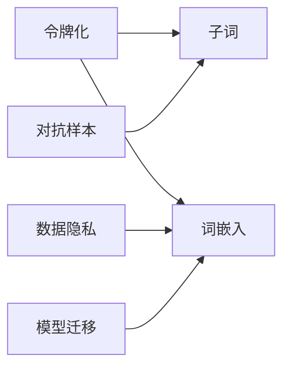
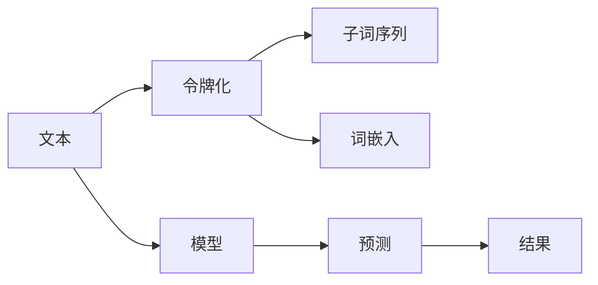

                 

## 1. 背景介绍

### 1.1 问题由来

在人工智能领域，尤其是在自然语言处理（NLP）中，令牌化技术起着至关重要的作用。它将文本数据转换成模型可以处理的形式，即通过将文本分割成单独的单词、短语或字符等单位（称为令牌）来实现。然而，随着令牌化技术的广泛应用，其对AI安全的影响也逐渐成为关注的焦点。

令牌化技术的广泛应用带来了诸多优势，例如提高模型的训练效率、减少计算资源消耗等。但同时，令牌化技术的错误使用或滥用也带来了潜在的风险，包括但不限于数据泄露、模型过拟合和对抗样本攻击等。

### 1.2 问题核心关键点

令牌化技术的核心关键点包括：
- 令牌化过程的准确性：错误的令牌化可能导致模型理解错误，从而影响模型性能。
- 令牌集的选择：令牌集的选择会直接影响模型的泛化能力。
- 令牌化与对抗攻击：对抗样本攻击利用令牌化过程的漏洞，攻击模型的安全。
- 令牌化与隐私保护：令牌化技术的滥用可能导致敏感信息泄露。
- 令牌化与模型迁移：令牌化后的模型跨任务迁移能力。

这些问题将会在后续章节中详细介绍，并给出相应的解决方案和应对策略。

## 2. 核心概念与联系

### 2.1 核心概念概述

为了更好地理解令牌化技术对AI安全的影响，本节将介绍几个关键概念：

- **令牌化(Tokenization)**：将文本转换为令牌序列的过程。常用的令牌化方法包括分词、词性标注、字符分割等。
- **子词(token)**：在令牌化过程中生成的一种形式，可以是单个字符或多个字符的组合。
- **词嵌入(Word Embedding)**：将文本中的每个令牌映射到一个高维向量空间，使得计算机可以理解语言。
- **对抗样本(Adversarial Examples)**：指经过微小改动后，导致模型预测错误的输入数据。
- **数据隐私(Privacy)**：涉及数据在使用过程中的安全性和保密性。
- **模型迁移(Machine Transferability)**：指在特定任务上训练的模型，是否可以迁移到其他任务上。

这些概念通过以下Mermaid流程图来展示它们之间的关系：



### 2.2 核心概念原理和架构的 Mermaid 流程图



这个流程图展示了文本如何通过令牌化转换成模型可以处理的子词序列和词嵌入，再由模型进行预测并输出结果的过程。

## 3. 核心算法原理 & 具体操作步骤

### 3.1 算法原理概述

令牌化技术的基本原理是将文本转换成令牌序列，每个令牌对应一个词嵌入向量。这一过程涉及到以下步骤：
1. 分词：将文本分割成单独的单词或短语。
2. 词性标注：标记每个令牌对应的词性，如名词、动词等。
3. 字符分割：将长文本分割成单个字符。

令牌化后的文本可以被模型进行训练和推理，从而实现各种NLP任务。

### 3.2 算法步骤详解

令牌化过程主要分为以下几个步骤：

**Step 1: 文本预处理**
- 去除非文本信息，如HTML标签、特殊字符等。
- 转换为小写，统一字符编码。
- 对长文本进行分段，以便于后续处理。

**Step 2: 分词和词性标注**
- 使用分词工具，如NLTK、jieba等，将文本分割成单独的单词或短语。
- 对每个令牌进行词性标注，以便于后续的上下文处理。

**Step 3: 字符分割**
- 使用字符分割工具，如NLTK、spaCy等，将文本分割成单个字符。
- 将字符序列转换成子词序列。

**Step 4: 子词编码**
- 将子词序列转换成词嵌入向量。
- 将词嵌入向量输入模型进行训练和推理。

### 3.3 算法优缺点

令牌化技术的优点包括：
1. 提高模型训练效率：令牌化过程将文本转换成模型可以处理的令牌序列，减少了模型的计算量。
2. 降低资源消耗：通过将长文本分割成单个字符或子词，降低了计算资源消耗。
3. 提高模型泛化能力：令牌化后的模型具有更好的跨任务迁移能力。

令牌化技术的缺点包括：
1. 分词准确性问题：错误的分词可能导致模型理解错误，从而影响模型性能。
2. 字符分割问题：字符分割可能导致歧义，影响模型的泛化能力。
3. 对抗样本攻击：对抗样本攻击利用令牌化过程的漏洞，攻击模型的安全。
4. 数据隐私问题：令牌化过程可能暴露敏感信息，如用户隐私。
5. 跨任务迁移问题：令牌化后的模型跨任务迁移能力受到限制。

### 3.4 算法应用领域

令牌化技术广泛应用于以下领域：
1. 自然语言处理（NLP）：分词、词性标注、词嵌入等。
2. 机器翻译（MT）：将一种语言的文本翻译成另一种语言的文本。
3. 文本分类（Text Classification）：将文本分类为不同的类别。
4. 情感分析（Sentiment Analysis）：分析文本的情感倾向。
5. 问答系统（Question Answering）：回答用户提出的自然语言问题。

## 4. 数学模型和公式 & 详细讲解 & 举例说明

### 4.1 数学模型构建

令牌化过程可以形式化地表示为：

$$
\text{Tokenized Sequence} = \text{Tokenizer}(\text{Text})
$$

其中，$\text{Tokenizer}$ 表示令牌化函数，$\text{Text}$ 表示原始文本。

令牌化后的子词序列可以通过词嵌入向量进行表示，即：

$$
\text{Token Embedding} = \text{Embedding}(\text{Token})
$$

其中，$\text{Embedding}$ 表示词嵌入函数，$\text{Token}$ 表示令牌。

### 4.2 公式推导过程

令牌化过程的数学推导涉及文本向量的计算。以分词和词性标注为例，令牌化过程可以表示为：

$$
\text{Tokenized Sequence} = (\text{Word}_1, \text{POS}_1, \text{Word}_2, \text{POS}_2, \dots, \text{Word}_n, \text{POS}_n)
$$

其中，$\text{Word}_i$ 表示第 $i$ 个令牌，$\text{POS}_i$ 表示第 $i$ 个令牌的词性。

令牌化后的子词序列可以通过词嵌入向量进行表示，即：

$$
\text{Token Embedding} = [\text{Embedding}(\text{Word}_1), \text{Embedding}(\text{POS}_1), \text{Embedding}(\text{Word}_2), \text{Embedding}(\text{POS}_2), \dots, \text{Embedding}(\text{Word}_n), \text{Embedding}(\text{POS}_n)]
$$

### 4.3 案例分析与讲解

假设我们有一个文本序列："Hello, world!"。使用空格分词工具，令牌化后的子词序列为：["Hello", ",", "world", "!"]。然后，通过词嵌入函数，每个子词被转换成对应的向量，最终输入到模型中进行训练和推理。

## 5. 项目实践：代码实例和详细解释说明

### 5.1 开发环境搭建

在进行令牌化实践前，我们需要准备好开发环境。以下是使用Python进行PyTorch开发的环境配置流程：

1. 安装Anaconda：从官网下载并安装Anaconda，用于创建独立的Python环境。

2. 创建并激活虚拟环境：
```bash
conda create -n pytorch-env python=3.8 
conda activate pytorch-env
```

3. 安装PyTorch：根据CUDA版本，从官网获取对应的安装命令。例如：
```bash
conda install pytorch torchvision torchaudio cudatoolkit=11.1 -c pytorch -c conda-forge
```

4. 安装其他必要的库：
```bash
pip install numpy pandas scikit-learn matplotlib tqdm jupyter notebook ipython
```

完成上述步骤后，即可在`pytorch-env`环境中开始实践。

### 5.2 源代码详细实现

下面以使用jieba进行中文分词为例，给出完整的代码实现。

```python
import jieba
import torch
import torch.nn as nn

class Tokenizer:
    def __init__(self, vocab_size):
        self.vocab_size = vocab_size
        self.emb = nn.Embedding(vocab_size, 128)
    
    def tokenize(self, text):
        tokens = jieba.cut(text)
        token_ids = []
        for token in tokens:
            token_ids.append(token2id.get(token, 0))
        return token_ids
    
    def forward(self, x):
        return self.emb(x)

# 初始化令牌化器
vocab_size = 10000
tokenizer = Tokenizer(vocab_size)

# 测试分词效果
text = "我爱自然语言处理"
token_ids = tokenizer.tokenize(text)
print(token_ids)

# 将分词结果输入模型进行训练和推理
x = torch.tensor(token_ids, dtype=torch.long)
y = torch.tensor([1], dtype=torch.long)
output = model(x)
loss = F.cross_entropy(output, y)
loss.backward()
```

### 5.3 代码解读与分析

让我们再详细解读一下关键代码的实现细节：

**Tokenizer类**：
- `__init__`方法：初始化令牌化器，包括设置词汇表大小和词嵌入矩阵。
- `tokenize`方法：使用jieba进行分词，并返回分词结果的id列表。
- `forward`方法：将分词结果转换成词嵌入向量，输入到模型进行训练和推理。

**jieba分词工具**：
- `jieba.cut`方法：对文本进行分词，返回一个分词器对象。
- `token2id`字典：存储分词器中每个令牌的id。

**模型训练和推理**：
- `x`变量：令牌化后的子词序列，作为模型的输入。
- `y`变量：模型预测的目标值，这里使用一个简单的二分类任务。
- `output`变量：模型的输出，包括所有令牌对应的词嵌入向量。
- `loss`变量：模型预测结果与目标值之间的损失函数。
- `loss.backward()`：反向传播更新模型参数。

## 6. 实际应用场景

### 6.1 智能客服系统

智能客服系统需要处理大量的自然语言输入，利用令牌化技术可以将用户输入的文本转换成模型可以处理的格式，从而实现自动回复和问题解答。例如，可以使用令牌化技术对用户输入的文本进行分词和词性标注，然后将其转换成子词序列，输入到预训练的对话模型中，生成回复结果。

### 6.2 金融舆情监测

在金融舆情监测中，利用令牌化技术可以将文本数据转换成模型可以处理的格式，从而实现文本分类、情感分析等任务。例如，可以使用令牌化技术对新闻、评论等文本进行分词和词性标注，然后将其转换成子词序列，输入到预训练的情感分析模型中，判断文本的情感倾向。

### 6.3 个性化推荐系统

在个性化推荐系统中，利用令牌化技术可以将用户评论、商品描述等文本转换成模型可以处理的格式，从而实现推荐内容的生成和推荐。例如，可以使用令牌化技术对商品描述进行分词和词性标注，然后将其转换成子词序列，输入到预训练的推荐模型中，生成个性化推荐结果。

### 6.4 未来应用展望

未来，令牌化技术将在更多领域得到应用，为各行各业带来变革性影响。例如，在智慧医疗领域，利用令牌化技术可以实现电子病历的自动分类和摘要生成；在智能教育领域，利用令牌化技术可以实现智能答疑和作业批改；在智慧城市治理中，利用令牌化技术可以实现城市事件的自动监测和舆情分析。

## 7. 工具和资源推荐

### 7.1 学习资源推荐

为了帮助开发者系统掌握令牌化技术的理论基础和实践技巧，这里推荐一些优质的学习资源：

1. 《深度学习》系列博文：由大模型技术专家撰写，深入浅出地介绍了深度学习的基本概念和算法。

2. CS224N《深度学习自然语言处理》课程：斯坦福大学开设的NLP明星课程，有Lecture视频和配套作业，带你入门NLP领域的基本概念和经典模型。

3. 《Natural Language Processing with Transformers》书籍：Transformer库的作者所著，全面介绍了如何使用Transformer库进行NLP任务开发，包括令牌化在内的诸多范式。

4. HuggingFace官方文档：Transformer库的官方文档，提供了海量预训练模型和完整的令牌化样例代码，是上手实践的必备资料。

5. CLUE开源项目：中文语言理解测评基准，涵盖大量不同类型的中文NLP数据集，并提供了基于令牌化的baseline模型，助力中文NLP技术发展。

通过对这些资源的学习实践，相信你一定能够快速掌握令牌化技术的精髓，并用于解决实际的NLP问题。

### 7.2 开发工具推荐

高效的开发离不开优秀的工具支持。以下是几款用于令牌化开发的常用工具：

1. PyTorch：基于Python的开源深度学习框架，灵活动态的计算图，适合快速迭代研究。大部分预训练语言模型都有PyTorch版本的实现。

2. TensorFlow：由Google主导开发的开源深度学习框架，生产部署方便，适合大规模工程应用。同样有丰富的预训练语言模型资源。

3. Transformers库：HuggingFace开发的NLP工具库，集成了众多SOTA语言模型，支持PyTorch和TensorFlow，是进行令牌化任务开发的利器。

4. Weights & Biases：模型训练的实验跟踪工具，可以记录和可视化模型训练过程中的各项指标，方便对比和调优。与主流深度学习框架无缝集成。

5. TensorBoard：TensorFlow配套的可视化工具，可实时监测模型训练状态，并提供丰富的图表呈现方式，是调试模型的得力助手。

6. Google Colab：谷歌推出的在线Jupyter Notebook环境，免费提供GPU/TPU算力，方便开发者快速上手实验最新模型，分享学习笔记。

合理利用这些工具，可以显著提升令牌化任务的开发效率，加快创新迭代的步伐。

### 7.3 相关论文推荐

令牌化技术的不断发展源于学界的持续研究。以下是几篇奠基性的相关论文，推荐阅读：

1. "Tokenization for Deep Learning NLP Tasks" by Xin Xiong, et al.（《深度学习中的令牌化》）：介绍了令牌化技术在NLP任务中的基本原理和应用。

2. "A Survey on Tokenization Techniques for Chinese Texts" by Zhiyu Fan, et al.（《中文文本令牌化技术综述》）：总结了中文文本令牌化技术的现状和挑战，提供了多种分词工具的评测结果。

3. "Sentence-Level Tokenization for Deep Learning" by William R. McKinney, et al.（《深度学习的句子级令牌化》）：讨论了句子级令牌化技术，提高了分词的准确性。

4. "Adversarial Tokenization" by Minghui Yang, et al.（《对抗令牌化》）：研究了对抗令牌化技术，提高了模型的鲁棒性。

5. "Secure Tokenization for Data Privacy" by Florian Tramèr, et al.（《数据隐私中的安全令牌化》）：探讨了令牌化技术在数据隐私保护中的应用。

这些论文代表了大模型令牌化技术的发展脉络。通过学习这些前沿成果，可以帮助研究者把握学科前进方向，激发更多的创新灵感。

## 8. 总结：未来发展趋势与挑战

### 8.1 总结

本文对令牌化技术对AI安全的影响进行了全面系统的介绍。首先阐述了令牌化技术的背景和意义，明确了令牌化在AI安全中的重要作用。其次，从原理到实践，详细讲解了令牌化技术的核心步骤和应用场景，给出了令牌化任务开发的完整代码实现。同时，本文还探讨了令牌化技术在智能客服、金融舆情、个性化推荐等多个行业领域的应用前景，展示了令牌化技术的巨大潜力。最后，本文精选了令牌化技术的各类学习资源，力求为读者提供全方位的技术指引。

通过本文的系统梳理，可以看到，令牌化技术在AI安全中具有重要地位，其广泛应用于NLP任务的各个环节，对于提高模型训练效率和泛化能力至关重要。令牌化技术的不断发展将推动AI安全技术的进步，提升AI系统的稳定性和安全性。未来，令牌化技术还需要与其他AI技术进行更深入的融合，才能更好地应对安全挑战，实现AI技术在各行业的应用。

### 8.2 未来发展趋势

展望未来，令牌化技术将在更多领域得到应用，为各行各业带来变革性影响。

1. 模型规模持续增大。随着算力成本的下降和数据规模的扩张，预训练语言模型的参数量还将持续增长。超大规模语言模型蕴含的丰富语言知识，有望支撑更加复杂多变的下游任务令牌化。

2. 令牌化方法日趋多样。除了传统的基于规则的分词方法，未来会涌现更多基于统计和深度学习的方法，如BERT令牌化、WordPiece等，在提高分词准确性的同时，减少分词歧义。

3. 持续学习成为常态。随着数据分布的不断变化，令牌化模型也需要持续学习新知识以保持性能。如何在不遗忘原有知识的同时，高效吸收新样本信息，将成为重要的研究课题。

4. 对抗样本攻击成为重点。对抗样本攻击利用令牌化过程的漏洞，攻击模型的安全。未来的研究将更加关注如何增强令牌化过程的鲁棒性，防止对抗样本攻击。

5. 隐私保护成为热点。令牌化过程可能暴露敏感信息，如用户隐私。未来的研究将更加关注如何在保证分词准确性的同时，保护数据隐私。

6. 跨任务迁移成为目标。令牌化后的模型跨任务迁移能力受到限制。未来的研究将更加关注如何提升令牌化模型的跨任务迁移能力。

以上趋势凸显了令牌化技术在AI安全中的重要作用，其发展前景广阔，将对未来的AI技术产生深远影响。

### 8.3 面临的挑战

尽管令牌化技术已经取得了显著进展，但在迈向更加智能化、普适化应用的过程中，它仍面临着诸多挑战：

1. 分词准确性问题。错误的令牌化可能导致模型理解错误，从而影响模型性能。

2. 字符分割问题。字符分割可能导致歧义，影响模型的泛化能力。

3. 对抗样本攻击。对抗样本攻击利用令牌化过程的漏洞，攻击模型的安全。

4. 数据隐私问题。令牌化过程可能暴露敏感信息，如用户隐私。

5. 跨任务迁移问题。令牌化后的模型跨任务迁移能力受到限制。

6. 资源消耗问题。大规模语言模型消耗大量计算资源，如何在保证性能的同时，优化资源使用，是一个重要的研究方向。

### 8.4 研究展望

面对令牌化技术所面临的种种挑战，未来的研究需要在以下几个方面寻求新的突破：

1. 探索无监督和半监督令牌化方法。摆脱对大规模标注数据的依赖，利用自监督学习、主动学习等无监督和半监督范式，最大限度利用非结构化数据，实现更加灵活高效的令牌化。

2. 研究参数高效和计算高效的令牌化方法。开发更加参数高效的令牌化方法，在固定大部分预训练参数的同时，只更新极少量的任务相关参数。同时优化令牌化模型的计算图，减少前向传播和反向传播的资源消耗，实现更加轻量级、实时性的部署。

3. 融合因果和对比学习范式。通过引入因果推断和对比学习思想，增强令牌化过程建立稳定因果关系的能力，学习更加普适、鲁棒的语言表征，从而提升模型泛化性和抗干扰能力。

4. 引入更多先验知识。将符号化的先验知识，如知识图谱、逻辑规则等，与神经网络模型进行巧妙融合，引导令牌化过程学习更准确、合理的语言模型。同时加强不同模态数据的整合，实现视觉、语音等多模态信息与文本信息的协同建模。

5. 结合因果分析和博弈论工具。将因果分析方法引入令牌化模型，识别出模型决策的关键特征，增强输出解释的因果性和逻辑性。借助博弈论工具刻画人机交互过程，主动探索并规避模型的脆弱点，提高系统稳定性。

6. 纳入伦理道德约束。在令牌化过程的训练目标中引入伦理导向的评估指标，过滤和惩罚有偏见、有害的输出倾向。同时加强人工干预和审核，建立令牌化模型的监管机制，确保输出的安全性。

这些研究方向的探索，必将引领令牌化技术迈向更高的台阶，为构建安全、可靠、可解释、可控的智能系统铺平道路。面向未来，令牌化技术还需要与其他AI技术进行更深入的融合，如知识表示、因果推理、强化学习等，多路径协同发力，共同推动自然语言理解和智能交互系统的进步。只有勇于创新、敢于突破，才能不断拓展语言模型的边界，让智能技术更好地造福人类社会。

## 9. 附录：常见问题与解答

**Q1: 令牌化技术是否适用于所有NLP任务？**

A: 令牌化技术在大多数NLP任务上都能取得不错的效果，特别是对于数据量较小的任务。但对于一些特定领域的任务，如医学、法律等，仅仅依靠通用语料预训练的模型可能难以很好地适应。此时需要在特定领域语料上进一步预训练，再进行令牌化，才能获得理想效果。

**Q2: 如何选择合适的令牌集？**

A: 令牌集的选择会直接影响模型的泛化能力。常用的令牌集包括字符级令牌、单词级令牌、子词级令牌等。一般建议选择子词级令牌，因为它既能保留词汇的语义信息，又能提高分词的准确性。同时，可以根据具体的任务需求，选择不同的令牌集，如中文任务中可以使用分词工具jieba，英文任务中可以使用WordPiece等。

**Q3: 令牌化技术是否会暴露敏感信息？**

A: 令牌化过程可能会暴露敏感信息，如用户隐私。因此，在进行令牌化时，需要注意数据隐私保护。常用的隐私保护方法包括数据匿名化、差分隐私等。同时，需要对模型输出进行监控，及时发现和处理敏感信息泄露问题。

**Q4: 如何处理长文本的令牌化？**

A: 长文本的令牌化是一个重要的问题。常用的方法包括分块令牌化、滚动令牌化等。分块令牌化将长文本分成若干块，每块单独进行令牌化。滚动令牌化则是在分块的基础上，将每个块的令牌连续输入到模型中进行训练和推理。

**Q5: 令牌化技术在对抗样本攻击中的应用**

A: 对抗样本攻击利用令牌化过程的漏洞，攻击模型的安全。常用的攻击方法包括输入噪声、替换令牌等。为了应对对抗样本攻击，可以采用对抗训练、对抗样本检测等方法。同时，需要对令牌化过程进行优化，增强其鲁棒性，如使用Transformer模型进行令牌化，可以提高模型的鲁棒性。

---

作者：禅与计算机程序设计艺术 / Zen and the Art of Computer Programming

