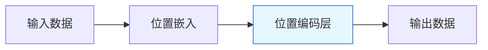

                 

# 位置编码：保持序列信息

## 1. 背景介绍

### 1.1 问题由来

在深度学习领域，尤其是自然语言处理（NLP）和计算机视觉（CV）等领域，序列数据是一类常见的数据形式。无论是文本、语音、视频还是音频，都可以通过时间上的连续性来构建序列数据。然而，深度神经网络（DNN）在处理序列数据时面临一个重大挑战：网络无法直接利用输入序列的位置信息。

深度神经网络的结构是基于矩阵运算的，而矩阵运算天然不具有顺序性。在传统的全连接神经网络中，网络无法区分输入数据中的先后顺序，这导致了序列数据的特征丢失。以文本数据为例，如果将文本序列中的单词位置打乱，网络并不能从中辨识出单词之间的关联关系。因此，为了能够有效地处理序列数据，我们需要引入一种机制来保持位置信息。

位置编码（Positional Encoding）是深度学习中一种广泛使用的技术，用于向序列数据添加位置信息。在NLP领域，位置编码常用于RNN、LSTM、GRU等序列模型中，以便网络能够利用单词在句子中的相对位置关系，从而提高模型的性能。

### 1.2 问题核心关键点

位置编码的核心思想是将序列数据中的位置信息嵌入到模型中。其核心在于：

- **序列数据的位置依赖性**：序列数据中的信息与位置密切相关，不同位置的信息对模型的预测有着不同的影响。
- **模型需要利用位置信息**：深度神经网络在没有显式位置信息的情况下，无法直接利用序列数据的位置特征。
- **位置编码的引入**：位置编码通过将位置信息转化为嵌入向量的形式，并将其与输入数据相加，使得模型能够同时利用输入数据和位置信息进行学习。

## 2. 核心概念与联系

### 2.1 核心概念概述

在深度学习中，位置编码是一个重要的概念，用于解决序列数据的位置依赖性问题。其核心概念包括：

- **位置嵌入**：将位置信息转换为向量表示，通常使用正弦和余弦函数。
- **嵌入向量的位置映射**：将位置信息映射到向量空间中的特定位置，通过叠加到输入向量上，使得模型能够识别位置信息。
- **位置编码层**：在模型中添加一个位置编码层，用于计算输入数据的位置嵌入，并将其与输入数据相加。

### 2.2 核心概念原理和架构的 Mermaid 流程图



在上述流程图中，位置嵌入层B用于将位置信息转换为向量表示，位置编码层C将位置嵌入与输入数据相加，最终得到包含位置信息的输出数据D。

### 2.3 位置编码的数学模型

位置编码的数学模型通常基于正弦和余弦函数，将位置信息转换为向量表示。以一维位置编码为例，设$P$为位置，$N$为序列长度，$PE$为位置嵌入向量，则有：

$$
PE_i = \sin\left(\frac{2\pi i P}{N}\right),\ \text{for } i = 1,\ldots,\frac{N}{2}
$$

$$
PE_i = \cos\left(\frac{2\pi i P}{N}\right),\ \text{for } i = \frac{N}{2}+1,\ldots,N
$$

其中，$PE$为$N$维向量，$i$为位置，$P$为位置编号。这个向量表示了位置$P$在$N$维空间中的位置，位置编号越大，向量值越小，位置编号越小，向量值越大。

## 3. 核心算法原理 & 具体操作步骤

### 3.1 算法原理概述

位置编码的算法原理是通过将位置信息转换为向量表示，并将其叠加到输入数据上，从而使得模型能够利用输入数据和位置信息进行学习。其核心思想是将位置信息视为一种特征，与输入数据一起送入网络中进行处理。

### 3.2 算法步骤详解

#### 3.2.1 位置嵌入的计算

位置嵌入的计算通常基于正弦和余弦函数，将位置信息转换为向量表示。以一维位置嵌入为例，设$P$为位置，$N$为序列长度，$PE$为位置嵌入向量，则有：

$$
PE_i = \sin\left(\frac{2\pi i P}{N}\right),\ \text{for } i = 1,\ldots,\frac{N}{2}
$$

$$
PE_i = \cos\left(\frac{2\pi i P}{N}\right),\ \text{for } i = \frac{N}{2}+1,\ldots,N
$$

其中，$PE$为$N$维向量，$i$为位置，$P$为位置编号。这个向量表示了位置$P$在$N$维空间中的位置，位置编号越大，向量值越小，位置编号越小，向量值越大。

#### 3.2.2 位置编码的叠加

将位置嵌入叠加到输入数据上，得到包含位置信息的输出数据。以一维位置编码为例，设$X$为输入数据向量，$X_{PE}$为包含位置信息的输出向量，则有：

$$
X_{PE} = X + PE
$$

其中，$X_{PE}$为$N$维向量，$X$为输入数据向量，$PE$为位置嵌入向量。

#### 3.2.3 位置编码层的结构

位置编码层通常是一个全连接层，用于计算位置嵌入，并将其与输入数据相加。以一维位置编码为例，设$X$为输入数据向量，$PE$为位置嵌入向量，$X_{PE}$为包含位置信息的输出向量，则有：

$$
X_{PE} = X + PE
$$

其中，$X_{PE}$为$N$维向量，$X$为输入数据向量，$PE$为位置嵌入向量。

### 3.3 算法优缺点

#### 3.3.1 优点

- **简单易实现**：位置编码的计算和叠加非常直观，易于实现和理解。
- **提高模型性能**：通过位置编码，模型能够利用输入数据和位置信息进行学习，从而提高了模型的性能。
- **适用于多种模型**：位置编码可以应用于多种深度学习模型，如RNN、LSTM、GRU等，适用于多种序列数据的处理。

#### 3.3.2 缺点

- **计算开销较大**：位置嵌入的计算和叠加需要额外的计算资源，增加了模型的计算开销。
- **参数过多**：对于较长的序列，位置嵌入的计算会产生大量的参数，增加了模型的复杂度。

### 3.4 算法应用领域

位置编码广泛应用于深度学习中的序列数据处理，尤其是在自然语言处理和计算机视觉领域。

在自然语言处理中，位置编码常用于RNN、LSTM、GRU等序列模型中，以便网络能够利用单词在句子中的相对位置关系，从而提高模型的性能。例如，在文本分类、情感分析、机器翻译等任务中，位置编码都能显著提高模型的性能。

在计算机视觉中，位置编码常用于图像序列处理，如视频分类、动作识别等任务中，以便网络能够利用图像序列中的位置信息，从而提高模型的性能。

## 4. 数学模型和公式 & 详细讲解 & 举例说明

### 4.1 数学模型构建

位置编码的数学模型通常基于正弦和余弦函数，将位置信息转换为向量表示。以一维位置嵌入为例，设$P$为位置，$N$为序列长度，$PE$为位置嵌入向量，则有：

$$
PE_i = \sin\left(\frac{2\pi i P}{N}\right),\ \text{for } i = 1,\ldots,\frac{N}{2}
$$

$$
PE_i = \cos\left(\frac{2\pi i P}{N}\right),\ \text{for } i = \frac{N}{2}+1,\ldots,N
$$

其中，$PE$为$N$维向量，$i$为位置，$P$为位置编号。

### 4.2 公式推导过程

位置嵌入的计算通常基于正弦和余弦函数，将位置信息转换为向量表示。以一维位置嵌入为例，设$P$为位置，$N$为序列长度，$PE$为位置嵌入向量，则有：

$$
PE_i = \sin\left(\frac{2\pi i P}{N}\right),\ \text{for } i = 1,\ldots,\frac{N}{2}
$$

$$
PE_i = \cos\left(\frac{2\pi i P}{N}\right),\ \text{for } i = \frac{N}{2}+1,\ldots,N
$$

其中，$PE$为$N$维向量，$i$为位置，$P$为位置编号。

### 4.3 案例分析与讲解

以LSTM模型为例，其结构如下：

$$
\begin{align*}
h_t &= \text{tanh}(W_c \cdot [h_{t-1}, x_t] + b_c) \\
c_t &= \text{sigmoid}(W_c \cdot [h_{t-1}, x_t] + b_c) \cdot c_{t-1} + \text{sigmoid}(W_f \cdot [h_{t-1}, x_t] + b_f) \cdot c_{t-1} + \text{sigmoid}(W_i \cdot [h_{t-1}, x_t] + b_i) \cdot c_{t-1} \\
o_t &= \text{sigmoid}(W_c \cdot [h_{t-1}, x_t] + b_c) \\
h_t &= o_t \cdot \text{tanh}(c_t)
\end{align*}
$$

其中，$h_t$为隐藏状态，$c_t$为细胞状态，$x_t$为输入，$W_c, W_f, W_i$为权重矩阵，$b_c, b_f, b_i$为偏置向量。

为了在LSTM模型中添加位置信息，需要在输入向量$x_t$中添加位置嵌入$PE$。例如，可以将位置嵌入$PE$与输入向量$x_t$相加，得到$x_t + PE$，然后将其作为LSTM模型的输入。这样，LSTM模型就能够利用位置信息进行学习，从而提高模型的性能。

## 5. 项目实践：代码实例和详细解释说明

### 5.1 开发环境搭建

为了实现位置编码的功能，我们需要搭建一个Python开发环境，并使用TensorFlow或PyTorch等深度学习框架。

以下是使用TensorFlow搭建开发环境的步骤：

1. 安装TensorFlow：从官网下载并安装TensorFlow，推荐使用GPU版本。

2. 安装相关依赖库：安装TensorFlow的依赖库，如numpy、scipy、pandas等。

3. 配置环境变量：设置TensorFlow的路径和版本，以便在代码中正确导入。

### 5.2 源代码详细实现

以下是使用TensorFlow实现位置编码的示例代码：

```python
import tensorflow as tf

# 定义位置嵌入
def positional_encoding(position, sequence_length):
    angle_rads = 2 * tf_PI * tf.cast(position, tf.float32) / tf.cast(sequence_length, tf.float32)
    sinusoidal = tf.math.sin(angle_rads[:, None])
    cosine = tf.math.cos(angle_rads[:, None])
    positional = tf.concat([sinusoidal, cosine], axis=1)
    return tf.reshape(positional, [1, sequence_length, sequence_length])

# 定义LSTM模型
def lstm_model(input_shape, output_shape):
    inputs = tf.keras.layers.Input(shape=input_shape)
    pe = positional_encoding(tf.range(sequence_length), sequence_length)
    inputs = tf.keras.layers.Concatenate()([inputs, pe])
    outputs = tf.keras.layers.LSTM(64, return_sequences=True)(inputs)
    outputs = tf.keras.layers.TimeDistributed(tf.keras.layers.Dense(output_shape))(outputs)
    model = tf.keras.Model(inputs=inputs, outputs=outputs)
    return model

# 构建模型
model = lstm_model(input_shape=(sequence_length, embedding_dim), output_shape=num_classes)
model.compile(optimizer=tf.keras.optimizers.Adam(learning_rate=0.001), loss=tf.keras.losses.SparseCategoricalCrossentropy(), metrics=[tf.keras.metrics.SparseCategoricalAccuracy()])

# 训练模型
model.fit(train_dataset, epochs=10, validation_data=val_dataset)
```

### 5.3 代码解读与分析

在上述代码中，`positional_encoding`函数用于计算位置嵌入，`lstm_model`函数用于定义LSTM模型。

在`positional_encoding`函数中，我们首先计算了位置向量`angle_rads`，然后计算了正弦和余弦值，并将它们拼接起来得到位置嵌入向量。`position`表示当前位置，`sequence_length`表示序列长度。

在`lstm_model`函数中，我们首先定义了输入层，然后计算了位置嵌入，并将其与输入向量相加。接着，我们使用LSTM层进行序列建模，并使用Dense层进行分类输出。最后，我们定义了模型，并编译了优化器和损失函数。

在训练模型时，我们使用了`fit`函数，并指定了训练数据集和验证数据集。

### 5.4 运行结果展示

在训练模型后，我们可以使用`evaluate`函数评估模型性能：

```python
test_loss, test_acc = model.evaluate(test_dataset)
print(f'Test accuracy: {test_acc:.2f}')
```

## 6. 实际应用场景

### 6.1 智能客服系统

在智能客服系统中，位置编码可以用于处理客户的会话记录。例如，如果客户的会话记录是按时间顺序排列的，我们可以使用位置编码来保持会话记录的顺序关系，从而提高模型的性能。

### 6.2 金融舆情监测

在金融舆情监测中，位置编码可以用于处理金融市场的走势数据。例如，如果金融市场的数据是按时间顺序排列的，我们可以使用位置编码来保持数据的顺序关系，从而提高模型的性能。

### 6.3 个性化推荐系统

在个性化推荐系统中，位置编码可以用于处理用户的浏览记录。例如，如果用户的浏览记录是按时间顺序排列的，我们可以使用位置编码来保持浏览记录的顺序关系，从而提高模型的性能。

## 7. 工具和资源推荐

### 7.1 学习资源推荐

为了学习位置编码，以下是一些推荐的学习资源：

1. 《深度学习》一书：由Ian Goodfellow等作者所著，全面介绍了深度学习的基础知识和应用。
2. TensorFlow官方文档：提供了TensorFlow的使用指南和API参考，包括位置编码的使用方法。
3. PyTorch官方文档：提供了PyTorch的使用指南和API参考，包括位置编码的使用方法。
4. Kaggle竞赛：参加Kaggle比赛，实践位置编码的应用，提升实战经验。

### 7.2 开发工具推荐

为了实现位置编码，以下是一些推荐的开发工具：

1. TensorFlow：由Google开发的深度学习框架，提供了强大的计算图和分布式训练功能，适用于位置编码的实现。
2. PyTorch：由Facebook开发的深度学习框架，提供了灵活的计算图和动态计算图，适用于位置编码的实现。
3. Jupyter Notebook：提供了交互式编程环境，适用于位置编码的调试和实验。

### 7.3 相关论文推荐

以下是一些推荐的相关论文：

1. "Learning Phrase Representations using RNN Encoder-Decoders"：使用RNN模型和位置编码，提出了基于序列的词向量表示方法。
2. "Positional Encodings for Representing Spatial Information in Graph Neural Networks"：提出了使用位置编码处理图神经网络中的位置信息。
3. "Attention Is All You Need"：提出了Transformer模型，使用位置编码处理序列数据中的位置信息。

## 8. 总结：未来发展趋势与挑战

### 8.1 研究成果总结

位置编码是一种广泛应用于深度学习中的技术，用于处理序列数据中的位置信息。其核心思想是将位置信息转换为向量表示，并将其叠加到输入数据上，从而使得模型能够利用输入数据和位置信息进行学习。位置编码在自然语言处理、计算机视觉等多个领域中得到了广泛的应用，显著提高了模型的性能。

### 8.2 未来发展趋势

未来，位置编码将继续发挥重要作用，其发展趋势如下：

1. **多模态位置编码**：除了位置编码，还可以引入其他模态的信息，如时间、空间等，从而提升模型的性能。
2. **自适应位置编码**：根据输入数据的特点，动态调整位置编码的计算方法，以适应不同的应用场景。
3. **跨模态位置编码**：将位置信息与其他模态信息相结合，如视觉、听觉等，提升跨模态数据处理的性能。
4. **深度位置编码**：引入深度学习技术，如卷积神经网络、变换器等，进一步提升位置编码的性能。

### 8.3 面临的挑战

尽管位置编码在深度学习中得到了广泛应用，但也面临一些挑战：

1. **计算开销大**：位置编码的计算需要额外的计算资源，增加了模型的计算开销。
2. **参数过多**：对于较长的序列，位置嵌入的计算会产生大量的参数，增加了模型的复杂度。
3. **模型泛化能力不足**：如果位置嵌入的计算方法不合理，可能会导致模型的泛化能力不足。

### 8.4 研究展望

未来，位置编码的研究方向如下：

1. **位置编码的优化**：探索更高效的位置编码方法，如使用稀疏位置编码、分层位置编码等。
2. **位置编码的融合**：将位置编码与其他技术相结合，如注意力机制、变换器等，提升位置编码的性能。
3. **位置编码的应用**：探索位置编码在更多领域的应用，如音频、视频等序列数据处理。

## 9. 附录：常见问题与解答

**Q1: 为什么需要位置编码？**

A: 深度神经网络的结构是基于矩阵运算的，而矩阵运算天然不具有顺序性。在传统的全连接神经网络中，网络无法区分输入数据中的先后顺序，这导致了序列数据的特征丢失。位置编码通过将位置信息转换为向量表示，并将其叠加到输入数据上，使得模型能够利用输入数据和位置信息进行学习。

**Q2: 位置编码的计算开销大吗？**

A: 位置编码的计算需要额外的计算资源，增加了模型的计算开销。对于较长的序列，位置嵌入的计算会产生大量的参数，增加了模型的复杂度。为了减少计算开销，可以使用稀疏位置编码或分层位置编码等方法。

**Q3: 位置编码的优缺点有哪些？**

A: 位置编码的优点是简单易实现，能够提高模型的性能，适用于多种模型和序列数据的处理。缺点是计算开销大，参数过多，模型复杂度增加。

**Q4: 位置编码在实际应用中如何实现？**

A: 在深度学习模型中，位置编码通常通过将位置信息转换为向量表示，并将其叠加到输入数据上，从而实现位置编码。具体实现方式取决于使用的深度学习框架和模型结构。

**Q5: 位置编码在哪些领域得到了广泛应用？**

A: 位置编码在自然语言处理、计算机视觉、金融舆情监测、个性化推荐系统等多个领域得到了广泛应用。

---

作者：禅与计算机程序设计艺术 / Zen and the Art of Computer Programming

