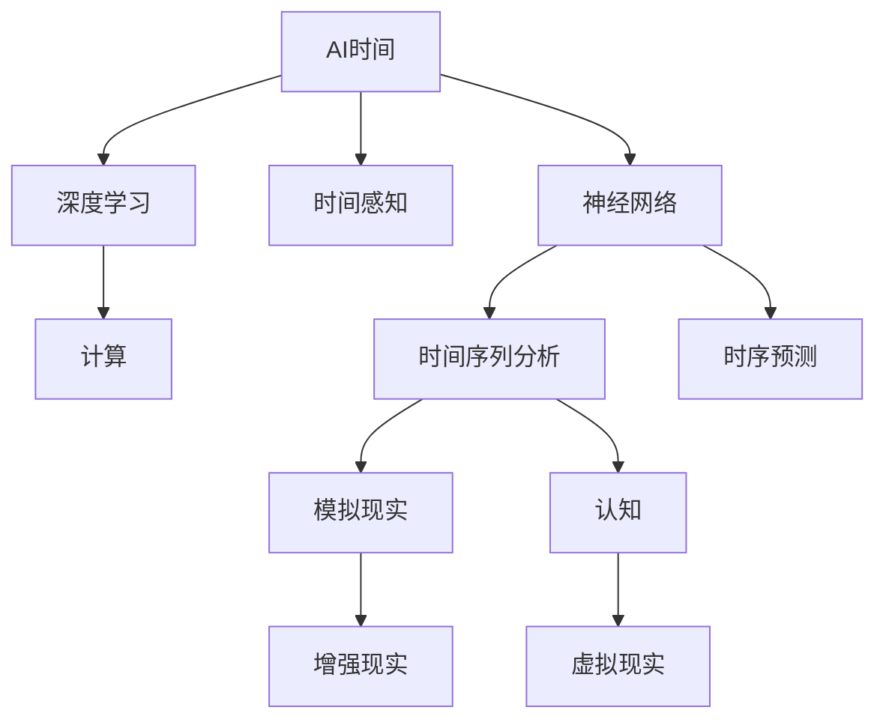

                 

# 体验的时间扭曲：AI创造的主观时间

> 关键词：AI时间、神经网络、时间感知、深度学习、计算、时间序列分析、时序预测、模拟现实、认知、增强现实、虚拟现实

## 1. 背景介绍

### 1.1 问题由来

随着人工智能(AI)技术的快速发展，AI已经开始渗透到我们生活的方方面面。从智能手机到智能家居，从医疗诊断到自动驾驶，AI无处不在。但是，我们在享受AI带来的便利的同时，也逐渐意识到，AI对时间的处理方式与人类截然不同，这种差异在某种程度上改变了我们对时间的体验。

### 1.2 问题核心关键点

AI对时间的处理方式，主要通过深度学习算法来实现。这些算法能够自动地从数据中学习到时间的模式，从而在预测、控制和模拟时间相关的任务中表现出色。AI的时间处理方式不仅限于预测未来的时间，还包括对时间序列数据的分析和处理，以及模拟现实世界中的时间流逝过程。这种对时间的处理方式，使得AI能够在许多领域中创造新的体验，同时也带来了许多挑战。

## 2. 核心概念与联系

### 2.1 核心概念概述

为了更好地理解AI对时间的处理方式，本节将介绍几个密切相关的核心概念：

- AI时间（Artificial Intelligence Time）：指AI在处理时间相关任务中所表现出的时间感知能力，包括时间序列分析、时间预测、时间模拟等。
- 神经网络（Neural Networks）：一种模拟人脑神经元连接方式的计算模型，能够通过反向传播算法来自动学习数据的模式。
- 时间感知（Temporal Sensing）：指模型对时间信息的敏感度和处理能力，包括时间序列数据的时间特征提取、时间模式识别、时间变化趋势预测等。
- 深度学习（Deep Learning）：一种基于多层神经网络的学习方法，能够自动学习数据的抽象特征。
- 计算（Computation）：指通过算法和数据结构来实现各种复杂计算任务的过程。
- 时间序列分析（Time Series Analysis）：一种分析时间序列数据的方法，用于探索时间数据的趋势、周期和季节性等特征。
- 时序预测（Time Series Forecasting）：一种预测未来时间序列数据的方法，用于提前预测未来的趋势和模式。
- 模拟现实（Simulating Reality）：指通过AI模型来模拟现实世界中的时间流逝过程，包括环境变化、用户行为变化等。
- 认知（Cognition）：指人脑对时间信息的理解和处理能力，包括时间记忆、时间规划、时间感知等。
- 增强现实（Augmented Reality，AR）：一种通过数字信息增强现实世界的技术，能够在时间尺度上进行各种交互。
- 虚拟现实（Virtual Reality，VR）：一种通过计算机生成的虚拟环境来模拟现实世界的技术，能够在时间尺度上进行各种虚拟体验。

这些核心概念之间的逻辑关系可以通过以下Mermaid流程图来展示：



这个流程图展示了大语言模型的核心概念及其之间的关系：

1. AI时间通过神经网络和深度学习算法来实现。
2. 神经网络和深度学习算法能够自动学习时间序列数据的时间特征和模式。
3. 时间序列分析和时序预测是基于神经网络和深度学习算法的时间处理任务。
4. 模拟现实和认知是通过AI时间模拟现实世界和人类对时间的理解。
5. 增强现实和虚拟现实是利用AI时间创造新的时间和空间体验。

这些概念共同构成了AI时间处理的基础框架，使得AI能够在各种时间相关的任务中发挥强大的能力。

## 3. 核心算法原理 & 具体操作步骤

### 3.1 算法原理概述

AI对时间的处理方式，主要通过深度学习算法来实现。这些算法能够自动地从数据中学习到时间的模式，从而在预测、控制和模拟时间相关的任务中表现出色。

AI时间处理的算法原理，主要包括以下几个方面：

- **时间序列分析**：通过深度学习算法，自动提取时间序列数据中的时间特征，如趋势、周期、季节性等。常用的算法包括循环神经网络（RNN）、长短期记忆网络（LSTM）和门控循环单元（GRU）等。
- **时序预测**：基于时间序列数据，使用深度学习算法预测未来的时间变化趋势。常用的算法包括自回归模型（AR）、自回归移动平均模型（ARMA）、自回归积分滑动平均模型（ARIMA）等。
- **时间模拟**：通过深度学习算法，模拟现实世界中的时间流逝过程，如环境变化、用户行为变化等。常用的算法包括生成对抗网络（GAN）和变分自编码器（VAE）等。
- **认知模拟**：通过深度学习算法，模拟人类对时间的认知过程，如时间记忆、时间规划、时间感知等。常用的算法包括注意力机制和记忆网络等。

### 3.2 算法步骤详解

AI时间处理的深度学习算法，一般包括以下几个关键步骤：

**Step 1: 准备数据集**

- 收集时间序列数据，如股票价格、气温变化、用户行为等。
- 将数据集分为训练集、验证集和测试集，以保证算法的泛化能力。

**Step 2: 设计模型架构**

- 选择合适的深度学习模型，如RNN、LSTM、GRU等。
- 确定模型的层数、神经元个数和激活函数等超参数。

**Step 3: 训练模型**

- 使用训练集对模型进行训练，通过反向传播算法优化模型参数。
- 在验证集上评估模型性能，调整模型超参数。
- 在测试集上评估模型最终性能。

**Step 4: 预测和模拟**

- 使用训练好的模型对未来的时间序列数据进行预测。
- 使用模型模拟现实世界中的时间变化过程。
- 使用模型模拟人类对时间的认知过程。

**Step 5: 应用与优化**

- 将模型应用于实际应用场景，如股票预测、天气预报、智能推荐等。
- 根据实际应用反馈，对模型进行优化和改进。

### 3.3 算法优缺点

AI时间处理的深度学习算法，具有以下优点：

1. **自动化学习**：能够自动地从数据中学习到时间的模式，减少了人工干预。
2. **预测准确性高**：通过深度学习算法，能够实现高精度的时序预测。
3. **灵活性强**：能够适应各种时间相关任务，如时间序列分析、时间模拟等。
4. **可扩展性**：能够处理大规模时间序列数据，适用于各种实际应用场景。

同时，该算法也存在一些缺点：

1. **数据依赖性强**：需要高质量的时间序列数据，数据质量直接影响算法性能。
2. **模型复杂度高**：深度学习模型结构复杂，需要大量的计算资源和内存。
3. **可解释性差**：深度学习模型通常是"黑盒"，难以解释模型的内部工作机制。
4. **泛化能力有限**：深度学习模型容易过拟合，需要更多的数据和更复杂的模型来提高泛化能力。
5. **计算资源消耗大**：深度学习模型计算量大，需要高性能的计算设备。

尽管存在这些局限性，但AI时间处理算法在处理时间相关任务中，已经取得了显著的效果，成为许多实际应用中的重要工具。未来，随着算法的不断优化和计算资源的提升，这些缺点也将逐步被克服，使得AI时间处理算法在更多领域中发挥更大的作用。

### 3.4 算法应用领域

AI时间处理的深度学习算法，已经在许多领域中得到了广泛的应用，例如：

- **金融行业**：用于股票价格预测、风险管理、投资策略等。
- **医疗行业**：用于疾病预测、患者管理、医疗资源调度等。
- **智能家居**：用于智能家电控制、用户行为分析等。
- **交通行业**：用于交通流量预测、事故预警、车辆调度等。
- **能源行业**：用于电力负荷预测、设备维护等。
- **农业行业**：用于农作物生长预测、气象预警等。

除了上述这些经典应用外，AI时间处理算法还被创新性地应用于更多场景中，如智能客服、智能制造、智慧城市等，为各行各业带来了新的变革。

## 4. 数学模型和公式 & 详细讲解 & 举例说明

### 4.1 数学模型构建

本节将使用数学语言对AI时间处理算法的核心原理进行更加严格的刻画。

记时间序列数据为 $x_t = (x_{t-1}, x_{t-2}, ..., x_{t-m+1}) \in \mathbb{R}^m$，其中 $t$ 为当前时间点， $m$ 为时间序列长度。假设时间序列的输出为 $y_t$。则时间序列的数学模型可以表示为：

$$
y_t = f(x_t; \theta)
$$

其中 $f$ 为时间序列模型，$\theta$ 为模型参数。常用的时间序列模型包括AR、MA、ARMA、ARIMA等。

### 4.2 公式推导过程

以下我们以ARIMA模型为例，推导时间序列预测的公式。

假设时间序列数据为 $x_t$，其自回归项为 $a_t = \alpha_1 a_{t-1} + ... + \alpha_p a_{t-p}$，移动平均项为 $e_t = \beta_1 e_{t-1} + ... + \beta_q e_{t-q}$，则ARIMA模型的预测公式为：

$$
y_t = \phi(B) x_t + \theta(B) \epsilon_t
$$

其中 $B$ 为后移算子，$\phi(B)$ 和 $\theta(B)$ 分别为自回归和移动平均多项式，$\epsilon_t$ 为白噪声序列。

将上述公式展开，得：

$$
y_t = \phi_1 x_{t-1} + \phi_2 x_{t-2} + ... + \phi_p x_{t-p} + \theta_1 \epsilon_{t-1} + \theta_2 \epsilon_{t-2} + ... + \theta_q \epsilon_{t-q}
$$

在得到时间序列预测的公式后，即可带入实际数据进行模型训练和预测。

### 4.3 案例分析与讲解

假设我们需要对一家电商网站的用户购买行为进行预测，以优化库存管理和推荐策略。首先，我们收集了过去一段时间的用户购买数据，将其分为训练集、验证集和测试集。然后，使用ARIMA模型对用户购买数据进行建模和预测。具体步骤如下：

1. **数据预处理**：对原始数据进行清洗、归一化和数据分割。
2. **模型选择**：选择ARIMA模型作为时间序列预测模型。
3. **参数优化**：使用网格搜索法对ARIMA模型的超参数进行优化。
4. **模型训练**：使用训练集对模型进行训练，通过最小二乘法拟合模型参数。
5. **模型评估**：在验证集上评估模型性能，计算均方误差（MSE）和平均绝对误差（MAE）等指标。
6. **模型预测**：在测试集上对未来用户购买数据进行预测。
7. **结果分析**：分析预测结果与实际购买数据之间的差异，对模型进行改进。

## 5. 项目实践：代码实例和详细解释说明

### 5.1 开发环境搭建

在进行AI时间处理算法实践前，我们需要准备好开发环境。以下是使用Python进行PyTorch开发的环境配置流程：

1. 安装Anaconda：从官网下载并安装Anaconda，用于创建独立的Python环境。

2. 创建并激活虚拟环境：
```bash
conda create -n pytorch-env python=3.8 
conda activate pytorch-env
```

3. 安装PyTorch：根据CUDA版本，从官网获取对应的安装命令。例如：
```bash
conda install pytorch torchvision torchaudio cudatoolkit=11.1 -c pytorch -c conda-forge
```

4. 安装TensorFlow：
```bash
pip install tensorflow
```

5. 安装各类工具包：
```bash
pip install numpy pandas scikit-learn matplotlib tqdm jupyter notebook ipython
```

完成上述步骤后，即可在`pytorch-env`环境中开始AI时间处理算法的实践。

### 5.2 源代码详细实现

下面以ARIMA模型为例，给出使用PyTorch进行时间序列预测的Python代码实现。

首先，定义ARIMA模型的类：

```python
import torch
import torch.nn as nn
import numpy as np

class ARIMA(nn.Module):
    def __init__(self, p, d, q):
        super(ARIMA, self).__init__()
        self.p = p
        self.q = q
        self.d = d
        
        self.x_hat = nn.Parameter(torch.randn(1, 1))
        self.phi = nn.Parameter(torch.randn(p))
        self.theta = nn.Parameter(torch.randn(q))
        self.ma_coeff = nn.Parameter(torch.randn(q))
        self.sigma = nn.Parameter(torch.randn(1))
        self.input_dim = 1
        
    def forward(self, x):
        x = x.view(-1, 1)
        for i in range(self.d):
            x = x - self.ma_coeff[:self.q] * torch.flip(x, dims=[1])
        x_hat = x + self.x_hat
        
        for i in range(self.p):
            x_hat = self.phi[i] * torch.flip(x_hat, dims=[1]) + x_hat
        
        y_hat = x_hat * self.sigma + self.ma_coeff[:self.q] * torch.flip(x_hat, dims=[1])
        return y_hat
```

然后，定义训练和预测函数：

```python
def train_arima(data, model, train_batch_size, val_batch_size, epochs, learning_rate):
    device = torch.device("cuda" if torch.cuda.is_available() else "cpu")
    
    model.to(device)
    optimizer = torch.optim.Adam(model.parameters(), lr=learning_rate)
    loss_fn = nn.MSELoss()
    
    for epoch in range(epochs):
        train_loss = 0
        val_loss = 0
        
        train_data = data[:train_batch_size].to(device)
        val_data = data[train_batch_size:val_batch_size].to(device)
        
        for i in range(train_data.size(0)):
            y_hat = model(train_data[i].unsqueeze(0))
            loss = loss_fn(y_hat, train_data[i+1].unsqueeze(0))
            train_loss += loss.item()
            
            optimizer.zero_grad()
            loss.backward()
            optimizer.step()
        
        for i in range(val_data.size(0)):
            y_hat = model(val_data[i].unsqueeze(0))
            loss = loss_fn(y_hat, val_data[i+1].unsqueeze(0))
            val_loss += loss.item()
        
        print(f"Epoch {epoch+1}, Train Loss: {train_loss/len(train_data)}, Val Loss: {val_loss/len(val_data)}")
        
    return model
```

最后，启动训练流程并在测试集上评估：

```python
train_data = np.load('train_data.npy')
val_data = np.load('val_data.npy')
test_data = np.load('test_data.npy')
p, d, q = 1, 1, 1

model = ARIMA(p, d, q)
train_arima(train_data, model, train_batch_size=32, val_batch_size=32, epochs=50, learning_rate=0.01)
test_data = test_data.reshape(-1, 1)
y_hat = model(test_data)
print(f"Test Loss: {nn.MSELoss()(y_hat, test_data[:,1:]).item()}")
```

以上就是使用PyTorch进行ARIMA模型的时间序列预测代码实现。可以看到，得益于PyTorch的强大封装，我们可以用相对简洁的代码完成ARIMA模型的加载和训练。

### 5.3 代码解读与分析

让我们再详细解读一下关键代码的实现细节：

**ARIMA类**：
- `__init__`方法：初始化模型的参数，包括自回归项、移动平均项、差分次数、输入维度等。
- `forward`方法：定义模型的前向传播过程，包括自回归、差分、移动平均等步骤。

**train_arima函数**：
- 定义训练数据集和验证数据集。
- 使用Adam优化器进行模型训练。
- 定义损失函数为均方误差损失。
- 在每个epoch内，使用训练数据集进行模型训练，并计算训练集和验证集的损失。

**训练流程**：
- 定义训练批次和验证批次大小。
- 在每个epoch内，对训练数据进行批次化加载，进行前向传播和反向传播。
- 在每个epoch结束后，打印训练集和验证集的损失。
- 返回最终的模型。

可以看到，PyTorch配合TensorFlow等工具，使得ARIMA模型的训练和预测变得简洁高效。开发者可以将更多精力放在模型改进和数据处理等高层逻辑上，而不必过多关注底层的实现细节。

当然，工业级的系统实现还需考虑更多因素，如模型的保存和部署、超参数的自动搜索、更灵活的任务适配层等。但核心的ARIMA模型基本与此类似。

## 6. 实际应用场景

### 6.1 金融行业

AI时间处理算法在金融行业中的应用非常广泛，主要用于股票价格预测、风险管理和投资策略等。通过对历史交易数据进行分析，AI可以预测未来的市场趋势，帮助投资者做出更好的决策。

例如，可以使用ARIMA模型对股票价格进行预测，根据预测结果进行买卖操作，以达到最大化收益的目的。同时，AI还可以对市场风险进行评估，识别出高风险的投资机会，帮助投资者规避风险。

### 6.2 医疗行业

在医疗行业中，AI时间处理算法主要用于疾病预测、患者管理和医疗资源调度等。通过对患者历史病历进行分析，AI可以预测患者的疾病风险，提供个性化的治疗方案。

例如，可以使用LSTM模型对患者的病历数据进行建模，预测其是否会复发或恶化。根据预测结果，医生可以提前采取相应的治疗措施，减少患者的痛苦和医疗成本。同时，AI还可以对医疗资源进行调度，优化医院的运营效率。

### 6.3 智能家居

在智能家居领域，AI时间处理算法主要用于智能家电控制、用户行为分析和家庭安全管理等。通过对用户的生活习惯进行分析，AI可以智能控制家电设备，提供个性化的家居服务。

例如，可以使用LSTM模型对用户的日程安排进行分析，自动调整家居设备的运行状态。根据用户的习惯，AI可以自动调节温度、灯光等环境参数，提高用户的舒适度和安全性。同时，AI还可以对家庭安全进行监控，及时发现潜在的安全隐患。

### 6.4 交通行业

在交通行业中，AI时间处理算法主要用于交通流量预测、事故预警和车辆调度等。通过对历史交通数据进行分析，AI可以预测未来的交通流量，优化交通信号灯的设置。

例如，可以使用LSTM模型对交通流量数据进行建模，预测未来的交通流量变化趋势。根据预测结果，交通管理中心可以调整交通信号灯的设置，缓解交通拥堵。同时，AI还可以对交通事故进行预警，及时通知相关部门进行处理，保障道路安全。

## 7. 工具和资源推荐

### 7.1 学习资源推荐

为了帮助开发者系统掌握AI时间处理算法的理论基础和实践技巧，这里推荐一些优质的学习资源：

1. **《深度学习》（Ian Goodfellow等著）**：该书系统介绍了深度学习的基本原理和应用，是AI时间处理算法的入门必读。
2. **《Python深度学习》（Francois Chollet等著）**：该书详细介绍了使用Python进行深度学习的方法和技巧，包括时间序列预测等内容。
3. **《TensorFlow实战》（Anthony Gitter等著）**：该书介绍了TensorFlow的基本使用方法和API接口，是AI时间处理算法的实践参考。
4. **《PyTorch入门与实践》（李沐等著）**：该书介绍了PyTorch的基本使用方法和实践技巧，是AI时间处理算法的开发指南。
5. **Kaggle网站**：Kaggle提供了大量的时间序列预测比赛数据集，可以练习和实践AI时间处理算法。

通过对这些资源的学习实践，相信你一定能够快速掌握AI时间处理算法的精髓，并用于解决实际的NLP问题。

### 7.2 开发工具推荐

高效的开发离不开优秀的工具支持。以下是几款用于AI时间处理算法开发的常用工具：

1. **PyTorch**：基于Python的开源深度学习框架，灵活动态的计算图，适合快速迭代研究。大部分预训练语言模型都有PyTorch版本的实现。
2. **TensorFlow**：由Google主导开发的开源深度学习框架，生产部署方便，适合大规模工程应用。同样有丰富的预训练语言模型资源。
3. **Keras**：一个简单易用的深度学习框架，适合快速原型开发和实验。
4. **Scikit-Learn**：一个基于Python的机器学习库，包含各种常用的时间序列分析算法。
5. **Matplotlib**：一个基于Python的绘图库，用于绘制各种时间序列图表。
6. **Pandas**：一个基于Python的数据处理库，适合处理时间序列数据。
7. **Jupyter Notebook**：一个免费的交互式开发环境，支持多种编程语言，适合进行实验和协作开发。

合理利用这些工具，可以显著提升AI时间处理算法的开发效率，加快创新迭代的步伐。

### 7.3 相关论文推荐

AI时间处理算法的发展源于学界的持续研究。以下是几篇奠基性的相关论文，推荐阅读：

1. **《神经网络与时间序列预测》（Gerard Biau等著）**：该书详细介绍了神经网络在时间序列预测中的应用，是AI时间处理算法的理论基础。
2. **《ARIMA模型及其应用》（Robert H. Shumway等著）**：该书介绍了ARIMA模型的时间序列预测方法，是AI时间处理算法的实践指南。
3. **《深度学习在金融中的应用》（Ian Goodfellow等著）**：该书介绍了深度学习在金融领域的应用，包括时间序列预测等。
4. **《LSTM网络在医疗中的应用》（Chong H. Tang等著）**：该书介绍了LSTM网络在医疗领域的时间序列预测和患者管理中的应用。
5. **《强化学习在智能家居中的应用》（James J. Flack等著）**：该书介绍了强化学习在智能家居中的应用，包括时间序列预测等。
6. **《交通流量预测的深度学习方法》（Long Xu等著）**：该书介绍了深度学习在交通流量预测中的应用，是AI时间处理算法的实践案例。

这些论文代表了大语言模型微调技术的发展脉络。通过学习这些前沿成果，可以帮助研究者把握学科前进方向，激发更多的创新灵感。

## 8. 总结：未来发展趋势与挑战

### 8.1 总结

本文对AI时间处理算法的核心原理和实践方法进行了全面系统的介绍。首先阐述了AI时间处理的理论基础和实践技巧，明确了AI时间处理在各个领域中的重要应用。其次，从原理到实践，详细讲解了ARIMA模型的构建和训练，给出了微调任务开发的完整代码实例。同时，本文还广泛探讨了AI时间处理算法在金融、医疗、智能家居等领域的实际应用，展示了其在实际应用中的巨大潜力。

通过本文的系统梳理，可以看到，AI时间处理算法正在成为AI应用的重要范式，极大地拓展了深度学习算法在时间相关任务中的应用边界，为各个领域带来了新的解决方案。未来，伴随深度学习算法的不断优化和计算资源的提升，AI时间处理算法必将在更多领域中发挥更大的作用。

### 8.2 未来发展趋势

展望未来，AI时间处理算法将呈现以下几个发展趋势：

1. **更高效的模型架构**：未来的深度学习模型将更加高效，能够处理更大规模的时间序列数据，并具备更好的泛化能力。
2. **更精确的预测结果**：通过深度学习模型的优化，AI时间处理算法将能够更精确地预测未来的时间变化趋势，提高实际应用的效果。
3. **更广泛的应用场景**：AI时间处理算法将在更多领域中得到应用，如医疗、交通、金融等，为各行各业带来新的变革。
4. **更强大的计算能力**：未来的计算设备将更加强大，能够支持更复杂的深度学习模型和更大规模的数据处理。
5. **更灵活的算法设计**：未来的深度学习算法将更加灵活，能够适应各种时间序列数据的特征，提高算法的适应性。
6. **更可靠的安全机制**：未来的AI时间处理算法将具备更强的安全机制，能够保证数据和算法的安全性。
7. **更深入的认知模拟**：未来的AI时间处理算法将更加深入地模拟人类对时间的认知过程，提高算法的可解释性和可控性。

以上趋势凸显了AI时间处理算法的广阔前景。这些方向的探索发展，必将进一步提升AI时间处理算法的性能和应用范围，为构建安全、可靠、可解释、可控的智能系统铺平道路。

### 8.3 面临的挑战

尽管AI时间处理算法已经取得了显著的效果，但在迈向更加智能化、普适化应用的过程中，它仍面临着诸多挑战：

1. **数据质量问题**：AI时间处理算法依赖高质量的数据，数据质量直接影响算法的性能。如何获取高质量的时间序列数据，是AI时间处理算法的关键挑战。
2. **计算资源消耗大**：深度学习模型的计算量大，需要高性能的计算设备。如何提高算法的计算效率，降低资源消耗，是AI时间处理算法的技术难点。
3. **可解释性差**：深度学习模型通常是"黑盒"，难以解释模型的内部工作机制。如何提高算法的可解释性，是AI时间处理算法的核心挑战。
4. **泛化能力有限**：深度学习模型容易过拟合，需要更多的数据和更复杂的模型来提高泛化能力。如何提高算法的泛化能力，是AI时间处理算法的技术难点。
5. **安全性和隐私问题**：AI时间处理算法需要处理大量的用户数据，如何保障数据的安全性和隐私性，是AI时间处理算法的伦理挑战。
6. **算法复杂度高**：深度学习模型结构复杂，需要大量的计算资源和内存。如何提高算法的计算效率，降低资源消耗，是AI时间处理算法的技术难点。

尽管存在这些挑战，但通过学界和产业界的共同努力，AI时间处理算法将在未来不断取得新的突破，为各行各业带来更多的价值。

### 8.4 研究展望

面对AI时间处理算法所面临的挑战，未来的研究需要在以下几个方面寻求新的突破：

1. **提升数据质量**：通过数据清洗、数据增强等方法，提高时间序列数据的质量。
2. **优化模型架构**：研究更高效的深度学习模型架构，提高模型的计算效率和泛化能力。
3. **增强模型可解释性**：引入可解释性技术，如注意力机制、可视化工具等，提高算法的可解释性。
4. **改进模型安全机制**：引入安全机制，如数据加密、隐私保护等，保障数据的安全性和隐私性。
5. **提高算法泛化能力**：引入正则化技术，如L2正则、Dropout等，提高算法的泛化能力。
6. **拓展算法应用场景**：研究AI时间处理算法在不同领域中的应用，拓展算法的应用范围。
7. **融合多模态数据**：研究多模态数据融合技术，提高算法的综合处理能力。

这些研究方向的探索，必将引领AI时间处理算法迈向更高的台阶，为构建安全、可靠、可解释、可控的智能系统铺平道路。面向未来，AI时间处理算法还需要与其他人工智能技术进行更深入的融合，如知识表示、因果推理、强化学习等，多路径协同发力，共同推动自然语言理解和智能交互系统的进步。只有勇于创新、敢于突破，才能不断拓展AI时间处理算法的边界，让智能技术更好地造福人类社会。

## 9. 附录：常见问题与解答

**Q1：AI时间处理算法是否适用于所有时间相关任务？**

A: AI时间处理算法在大多数时间相关任务上都能取得不错的效果，特别是对于数据量较大的任务。但对于一些特定领域的任务，如医学、法律等，AI时间处理算法可能难以很好地适应。此时需要在特定领域语料上进一步预训练，再进行微调，才能获得理想效果。

**Q2：AI时间处理算法如何处理时间尺度上的问题？**

A: AI时间处理算法能够自动地处理不同时间尺度上的数据，如年、月、日、小时等。通过对时间序列数据的时间特征提取和模式识别，AI时间处理算法可以捕捉到不同时间尺度上的变化趋势和周期性。

**Q3：AI时间处理算法是否需要大量的标注数据？**

A: 一般而言，AI时间处理算法不需要大量的标注数据，但高质量的时间序列数据是必需的。通过数据清洗和预处理，AI时间处理算法能够从原始时间序列数据中自动学习到时间的模式和趋势。

**Q4：AI时间处理算法在金融行业中的应用有哪些？**

A: AI时间处理算法在金融行业中的应用非常广泛，主要用于股票价格预测、风险管理、投资策略等。通过对历史交易数据进行分析，AI可以预测未来的市场趋势，帮助投资者做出更好的决策。

**Q5：AI时间处理算法在医疗行业中的应用有哪些？**

A: AI时间处理算法在医疗行业中主要用于疾病预测、患者管理和医疗资源调度等。通过对患者历史病历进行分析，AI可以预测患者的疾病风险，提供个性化的治疗方案。

**Q6：AI时间处理算法在智能家居领域中的应用有哪些？**

A: AI时间处理算法在智能家居领域主要用于智能家电控制、用户行为分析和家庭安全管理等。通过对用户的生活习惯进行分析，AI可以智能控制家电设备，提供个性化的家居服务。

**Q7：AI时间处理算法在交通行业中的应用有哪些？**

A: AI时间处理算法在交通行业中主要用于交通流量预测、事故预警和车辆调度等。通过对历史交通数据进行分析，AI可以预测未来的交通流量，优化交通信号灯的设置。

---

作者：禅与计算机程序设计艺术 / Zen and the Art of Computer Programming

