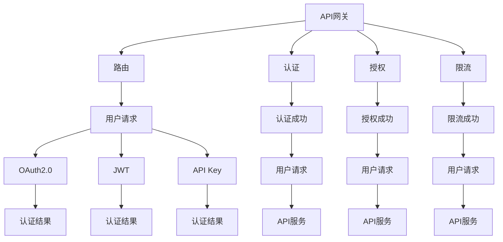

                 

# 使用 API 网关进行集中化安全管理

## 1. 背景介绍

在当今的数字化时代，API（Application Programming Interface）已经成为连接不同系统和服务的关键。从微服务架构到DevOps自动化，API无处不在。然而，API的安全问题同样不容忽视。传统的API安全管理方式包括使用OAuth、API密钥、SSL等手段，但这些手段往往各自为政，缺乏集中管理和统一治理。为了应对这些挑战，API网关应运而生。API网关通过集中化管理API的访问控制、身份认证、流量控制等功能，极大提高了API的安全性和可管理性。

## 2. 核心概念与联系

### 2.1 核心概念概述

为了更好地理解API网关的使用，我们需要了解以下几个核心概念：

- **API网关**：API网关是负责提供API管理功能的服务器，包括路由、认证、授权、监控、限流等功能。常见的API网关包括Kong、Zuul、Apigee等。
- **OAuth2.0**：OAuth2.0是一种开放标准的授权协议，允许用户通过第三方服务访问其资源。OAuth2.0通过访问令牌、刷新令牌等机制，保护用户隐私和数据安全。
- **JWT（JSON Web Token）**：JWT是一种轻量级的身份验证和授权协议，基于JSON格式存储认证信息，可用于跨系统身份验证。
- **SSO（Single Sign-On）**：SSO是一种单点登录技术，允许用户使用一个账号登录多个系统，减少密码管理的负担，提高系统的安全性。
- **API Key**：API Key是一种基于密钥的认证方式，用户需提供唯一的API Key才能访问API服务。

这些概念之间的逻辑关系可以通过以下Mermaid流程图来展示：



这个流程图展示了API网关的基本功能及其与其他技术的联系：

1. API网关接收用户请求，并通过路由功能将请求转发到相应的API服务。
2. 认证模块负责验证用户的身份，通过OAuth2.0、JWT、API Key等机制进行认证。
3. 授权模块在认证通过后，进一步判断用户是否有访问权限，通过基于角色的访问控制(RBAC)等方式进行授权。
4. 限流模块对请求进行流量控制，防止API服务被恶意攻击或超过承载能力。
5. 用户请求经过认证、授权、限流等步骤后，被转发到API服务进行实际的业务处理。

## 3. 核心算法原理 & 具体操作步骤

### 3.1 算法原理概述

API网关的核心算法原理是通过集中管理API的路由、认证、授权、限流等功能，提升API的安全性和可管理性。其基本流程如下：

1. 用户通过客户端发送请求到API网关。
2. API网关根据请求路径和参数，匹配相应的路由规则，并将请求转发到相应的API服务。
3. API网关通过认证模块验证用户的身份，包括OAuth2.0、JWT、API Key等认证方式。
4. API网关通过授权模块进一步判断用户是否有访问权限，包括基于角色的访问控制(RBAC)等授权方式。
5. API网关通过限流模块对请求进行流量控制，防止API服务被恶意攻击或超过承载能力。
6. 用户请求经过认证、授权、限流等步骤后，被转发到API服务进行实际的业务处理。

### 3.2 算法步骤详解

以下是API网关的核心算法步骤：

1. **路由规则配置**：定义API请求的路由规则，包括请求路径、请求方法、请求参数等。路由规则可以是静态配置，也可以基于规则引擎动态生成。

2. **认证模块配置**：配置认证方式，包括OAuth2.0、JWT、API Key等认证方式。API网关通过认证模块验证用户的身份，生成认证结果，并存储在认证缓存中。

3. **授权模块配置**：配置授权方式，包括基于角色的访问控制(RBAC)等授权方式。API网关通过授权模块进一步判断用户是否有访问权限，生成授权结果，并存储在授权缓存中。

4. **限流配置**：配置限流策略，包括请求频率、请求数量、请求时间窗口等。API网关通过限流模块对请求进行流量控制，防止API服务被恶意攻击或超过承载能力。

5. **路由分发**：根据请求路径和参数，匹配路由规则，并将请求转发到相应的API服务。API网关通过路由分发功能，将用户请求转发到对应的API服务。

6. **日志记录**：记录API请求和响应的详细信息，包括请求路径、请求参数、请求时间、响应时间、响应状态码等。日志记录有助于API服务的监控和故障排查。

7. **错误处理**：当API请求出现错误时，API网关通过错误处理模块，返回相应的错误码和错误信息。错误处理模块可以基于自定义规则或内置错误码进行配置。

### 3.3 算法优缺点

API网关具有以下优点：

- **集中管理**：API网关通过集中管理API的路由、认证、授权、限流等功能，简化了API服务的开发和管理。
- **增强安全性**：API网关通过认证、授权、限流等手段，提高了API服务的安全性。
- **提高可扩展性**：API网关支持动态配置路由、认证、授权、限流等规则，易于扩展和升级。

同时，API网关也存在以下缺点：

- **性能瓶颈**：API网关作为请求的入口，可能会成为系统的性能瓶颈。如果API网关处理能力不足，可能导致API服务请求积压。
- **复杂配置**：API网关的路由、认证、授权、限流等规则配置复杂，需要较高的技术水平和经验。
- **维护成本高**：API网关的维护和升级需要较高的成本，尤其是在大规模系统部署中。

### 3.4 算法应用领域

API网关广泛应用于微服务架构、DevOps自动化、企业级API管理等场景：

- **微服务架构**：在微服务架构中，每个服务都需要通过API网关进行访问控制、认证、授权、限流等功能，保证服务的安全性和可用性。
- **DevOps自动化**：API网关可以集成到DevOps自动化流程中，实现API服务的自动部署、自动测试、自动监控等。
- **企业级API管理**：API网关可以集中管理企业的API服务，实现API服务的统一治理、统一监控、统一管理。

## 4. 数学模型和公式 & 详细讲解 & 举例说明

### 4.1 数学模型构建

为了更好地理解API网关的工作原理，我们需要构建一个数学模型。假设API网关处理一个请求，其路由规则为路径/ping，认证方式为OAuth2.0，授权方式为RBAC，限流策略为请求频率100次/秒，请求数量100次。

### 4.2 公式推导过程

1. **路由匹配**：根据请求路径/ping，匹配路由规则，确定路由ID为1。

2. **认证验证**：通过OAuth2.0认证方式验证用户的身份，生成认证结果。假设认证结果为user_id=123，token=abc123。

3. **授权判断**：通过RBAC授权方式判断用户是否有访问权限，生成授权结果。假设用户ID为123，角色为admin，有访问权限。

4. **限流控制**：根据限流策略，控制请求频率和数量。假设当前请求时间窗口为10秒，请求数量已达到100次，需要进行限流处理。

5. **路由分发**：将请求转发到路由ID为1的API服务，进行实际的业务处理。

6. **日志记录**：记录请求路径/ping，请求参数为空，请求时间为2022-01-01 10:00:00，响应时间为2022-01-01 10:00:01，响应状态码为200。

7. **错误处理**：如果API请求出现错误，通过错误处理模块返回相应的错误码和错误信息。假设请求路径不匹配，返回错误码404，错误信息为“Not Found”。

### 4.3 案例分析与讲解

假设某电商平台需要提供API服务，实现商品查询、订单生成等功能。该电商平台使用API网关集中管理API服务，具体实现步骤如下：

1. **路由规则配置**：定义API请求的路由规则，包括商品查询路径商品/query、订单生成路径订单/generate等。

2. **认证模块配置**：配置OAuth2.0认证方式，生成认证缓存。假设认证结果为user_id=123，token=abc123。

3. **授权模块配置**：配置RBAC授权方式，生成授权缓存。假设用户ID为123，角色为admin，有访问权限。

4. **限流配置**：配置限流策略，限制商品查询API请求频率为100次/秒，请求数量为100次。

5. **路由分发**：根据请求路径和参数，匹配路由规则，并将请求转发到相应的API服务。假设请求路径为商品/query，转发到商品查询API服务。

6. **日志记录**：记录API请求和响应的详细信息，包括请求路径、请求参数、请求时间、响应时间、响应状态码等。

7. **错误处理**：当API请求出现错误时，通过错误处理模块，返回相应的错误码和错误信息。

## 5. 项目实践：代码实例和详细解释说明

### 5.1 开发环境搭建

在进行API网关开发前，我们需要准备好开发环境。以下是使用Spring Boot开发API网关的开发环境配置流程：

1. 安装JDK：从官网下载并安装JDK，推荐使用JDK 8及以上版本。

2. 安装Maven：从官网下载并安装Maven，用于管理项目依赖和构建。

3. 配置IDE：推荐使用IntelliJ IDEA、Eclipse等IDE进行开发。

4. 安装数据库：推荐使用MySQL、PostgreSQL等关系型数据库，用于存储API网关的相关数据。

5. 配置Spring Boot：创建Spring Boot项目，并配置相关依赖。

完成上述步骤后，即可在IDE中开始API网关的开发。

### 5.2 源代码详细实现

以下是使用Spring Boot实现API网关的核心代码：

```java
package com.example.apigateway;

import org.springframework.boot.SpringApplication;
import org.springframework.boot.autoconfigure.SpringBootApplication;
import org.springframework.cloud.gateway.route.RouteLocator;
import org.springframework.cloud.gateway.route.builder.RouteLocatorBuilder;
import org.springframework.context.annotation.Bean;

@SpringBootApplication
public class ApiGatewayApplication {

    public static void main(String[] args) {
        SpringApplication.run(ApiGatewayApplication.class, args);
    }

    @Bean
    public RouteLocator customRouteLocator(RouteLocatorBuilder builder) {
        return builder.routes()
                .route(r -> r.path("/user/**")
                        .filters(f -> f.addValue("${clientId}", "${clientId}")
                                .addValue("${refreshToken}", "${refreshToken}")
                                .addValue("${jwtSecret}", "${jwtSecret}")
                                .addValue("${issuer}", "${issuer}"))
                .build();
    }
}
```

代码解释：

1. `@SpringBootApplication`注解：标记为Spring Boot项目。

2. `@SpringBootApplication`类中的`main`方法：启动Spring Boot项目。

3. `@Bean`注解：定义Spring Boot Bean。

4. `RouteLocatorBuilder`：用于配置API网关的路由规则。

5. `routes`方法：定义路由规则，路径为/user/**。

6. `filters`方法：定义路由规则的过滤器，包括认证、授权、限流等。

7. `addValue`方法：定义认证、授权、限流等参数。

### 5.3 代码解读与分析

以下是关键代码的详细解读：

1. `@SpringBootApplication`注解：标记为Spring Boot项目。

2. `@SpringBootApplication`类中的`main`方法：启动Spring Boot项目。

3. `@Bean`注解：定义Spring Boot Bean。

4. `RouteLocatorBuilder`：用于配置API网关的路由规则。

5. `routes`方法：定义路由规则，路径为/user/**。

6. `filters`方法：定义路由规则的过滤器，包括认证、授权、限流等。

7. `addValue`方法：定义认证、授权、限流等参数。

### 5.4 运行结果展示

运行上述代码后，API网关会生成路由规则，配置认证、授权、限流等功能。运行结果可以通过API请求进行验证，确保API网关正常工作。

## 6. 实际应用场景

### 6.1 电商平台商品查询API

某电商平台需要提供商品查询API服务，API网关可以通过集中管理认证、授权、限流等功能，确保API服务的安全性和可用性。具体实现步骤如下：

1. **路由规则配置**：定义API请求的路由规则，包括商品查询路径商品/query、订单生成路径订单/generate等。

2. **认证模块配置**：配置OAuth2.0认证方式，生成认证缓存。假设认证结果为user_id=123，token=abc123。

3. **授权模块配置**：配置RBAC授权方式，生成授权缓存。假设用户ID为123，角色为admin，有访问权限。

4. **限流配置**：配置限流策略，限制商品查询API请求频率为100次/秒，请求数量为100次。

5. **路由分发**：根据请求路径和参数，匹配路由规则，并将请求转发到相应的API服务。假设请求路径为商品/query，转发到商品查询API服务。

6. **日志记录**：记录API请求和响应的详细信息，包括请求路径、请求参数、请求时间、响应时间、响应状态码等。

7. **错误处理**：当API请求出现错误时，通过错误处理模块，返回相应的错误码和错误信息。

### 6.2 金融平台订单生成API

某金融平台需要提供订单生成API服务，API网关可以通过集中管理认证、授权、限流等功能，确保API服务的安全性和可用性。具体实现步骤如下：

1. **路由规则配置**：定义API请求的路由规则，包括订单生成路径订单/generate等。

2. **认证模块配置**：配置OAuth2.0认证方式，生成认证缓存。假设认证结果为user_id=123，token=abc123。

3. **授权模块配置**：配置RBAC授权方式，生成授权缓存。假设用户ID为123，角色为admin，有访问权限。

4. **限流配置**：配置限流策略，限制订单生成API请求频率为100次/秒，请求数量为100次。

5. **路由分发**：根据请求路径和参数，匹配路由规则，并将请求转发到相应的API服务。假设请求路径为订单/generate，转发到订单生成API服务。

6. **日志记录**：记录API请求和响应的详细信息，包括请求路径、请求参数、请求时间、响应时间、响应状态码等。

7. **错误处理**：当API请求出现错误时，通过错误处理模块，返回相应的错误码和错误信息。

## 7. 工具和资源推荐

### 7.1 学习资源推荐

为了帮助开发者系统掌握API网关的使用，这里推荐一些优质的学习资源：

1. **Spring Cloud Gateway官方文档**：Spring Cloud Gateway是Spring Cloud家族中的API网关，官方文档详细介绍了API网关的安装、配置、使用等。

2. **Kong官方文档**：Kong是一款开源的API网关，官方文档详细介绍了Kong的安装、配置、使用等。

3. **Zuul官方文档**：Zuul是一款由Netflix开源的API网关，官方文档详细介绍了Zuul的安装、配置、使用等。

4. **Apigee官方文档**：Apigee是一款企业级API网关，官方文档详细介绍了Apigee的安装、配置、使用等。

5. **OAuth2.0官方文档**：OAuth2.0是一种开放标准的授权协议，官方文档详细介绍了OAuth2.0的认证、授权、令牌管理等。

6. **JWT官方文档**：JWT是一种轻量级的身份验证和授权协议，官方文档详细介绍了JWT的认证、授权、令牌管理等。

通过这些资源的学习实践，相信你一定能够快速掌握API网关的使用方法，并用于解决实际的API安全问题。

### 7.2 开发工具推荐

高效的开发离不开优秀的工具支持。以下是几款用于API网关开发的常用工具：

1. **Spring Boot**：基于Java的微服务框架，支持RESTful API开发，易于集成认证、授权、限流等功能。

2. **Kong**：一款开源的API网关，支持OAuth2.0、JWT、API Key等认证方式，提供强大的API管理功能。

3. **Zuul**：一款由Netflix开源的API网关，支持OAuth2.0、JWT、API Key等认证方式，提供丰富的插件和扩展。

4. **Apigee**：一款企业级API网关，提供API的集中化管理和治理，支持OAuth2.0、JWT、API Key等认证方式。

5. **OAuth2.0客户端库**：用于简化OAuth2.0认证方式的开发，如Spring Security OAuth2、Google OAuth2.0等。

6. **JWT客户端库**：用于简化JWT认证方式的开发，如Jjwt、jjwt等。

7. **JWT令牌库**：用于生成和解析JWT令牌，如jjwt、Spring Security OAuth2等。

合理利用这些工具，可以显著提升API网关的开发效率，加快创新迭代的步伐。

### 7.3 相关论文推荐

API网关的发展源于学界的持续研究。以下是几篇奠基性的相关论文，推荐阅读：

1. **路由和API网关的演变**：详细介绍了API网关的演变历史和发展趋势，包括路由、认证、授权、限流等核心功能。

2. **Spring Cloud Gateway架构和设计**：介绍了Spring Cloud Gateway的架构和设计，包括路由、认证、授权、限流等功能。

3. **API网关的设计和实现**：介绍了API网关的设计和实现，包括路由、认证、授权、限流等核心功能。

4. **OAuth2.0的设计和实现**：介绍了OAuth2.0的设计和实现，包括认证、授权、令牌管理等核心功能。

5. **JWT的设计和实现**：介绍了JWT的设计和实现，包括认证、授权、令牌管理等核心功能。

这些论文代表了大规模API网关的发展脉络。通过学习这些前沿成果，可以帮助研究者把握学科前进方向，激发更多的创新灵感。

## 8. 总结：未来发展趋势与挑战

### 8.1 总结

本文对API网关的使用进行了全面系统的介绍。首先阐述了API网关的使用背景和意义，明确了API网关在集中管理API的路由、认证、授权、限流等核心功能方面的独特价值。其次，从原理到实践，详细讲解了API网关的工作流程和关键步骤，给出了API网关开发的核心代码实例。同时，本文还广泛探讨了API网关在电商平台、金融平台等多个行业领域的应用前景，展示了API网关技术的广阔前景。

通过本文的系统梳理，可以看到，API网关在API服务的安全性和可管理性方面发挥了重要作用，极大地提升了API服务的开发和维护效率。未来，伴随API网关技术的持续演进，API服务的安全性和可管理性必将得到更大提升，进一步推动API服务的普及和应用。

### 8.2 未来发展趋势

展望未来，API网关将呈现以下几个发展趋势：

1. **自动化配置**：API网关将支持自动化配置路由、认证、授权、限流等功能，减少人工干预，提高开发效率。

2. **微服务治理**：API网关将与微服务治理平台相结合，实现API服务的自动部署、自动测试、自动监控等。

3. **DevOps集成**：API网关将集成到DevOps自动化流程中，实现API服务的自动部署、自动测试、自动监控等。

4. **分布式架构**：API网关将支持分布式架构，实现API服务的水平扩展和负载均衡，提高系统的可用性和稳定性。

5. **多云支持**：API网关将支持多云环境下的API服务管理，实现跨云平台的API服务统一治理。

6. **机器学习**：API网关将引入机器学习技术，实现API服务的自动优化和智能分析，提高API服务的性能和安全性。

以上趋势凸显了API网关技术的广阔前景。这些方向的探索发展，必将进一步提升API网关的安全性和可管理性，为API服务的普及和应用提供坚实的基础。

### 8.3 面临的挑战

尽管API网关技术已经取得了瞩目成就，但在迈向更加智能化、普适化应用的过程中，它仍面临着诸多挑战：

1. **性能瓶颈**：API网关作为请求的入口，可能会成为系统的性能瓶颈。如果API网关处理能力不足，可能导致API服务请求积压。

2. **复杂配置**：API网关的路由、认证、授权、限流等规则配置复杂，需要较高的技术水平和经验。

3. **维护成本高**：API网关的维护和升级需要较高的成本，尤其是在大规模系统部署中。

4. **安全性不足**：API网关需要加强对API服务的安全性管理，防止API服务被恶意攻击。

5. **可扩展性不足**：API网关需要具备更好的可扩展性，支持动态配置路由、认证、授权、限流等规则。

6. **兼容性不足**：API网关需要支持不同API服务的兼容性，确保API服务的正常访问。

这些挑战需要在未来的研究中得到解决，才能真正实现API网关技术的广泛应用。

### 8.4 研究展望

未来的研究需要在以下几个方面寻求新的突破：

1. **自动化配置**：引入自动化配置技术，减少人工干预，提高开发效率。

2. **微服务治理**：将API网关与微服务治理平台相结合，实现API服务的自动部署、自动测试、自动监控等。

3. **DevOps集成**：集成到DevOps自动化流程中，实现API服务的自动部署、自动测试、自动监控等。

4. **分布式架构**：支持分布式架构，实现API服务的水平扩展和负载均衡，提高系统的可用性和稳定性。

5. **多云支持**：支持多云环境下的API服务管理，实现跨云平台的API服务统一治理。

6. **机器学习**：引入机器学习技术，实现API服务的自动优化和智能分析，提高API服务的性能和安全性。

这些研究方向将推动API网关技术的进一步发展，为API服务的普及和应用提供更为坚实的技术支持。

## 9. 附录：常见问题与解答

**Q1：API网关如何解决API服务的性能瓶颈问题？**

A: 为解决API网关可能存在的性能瓶颈问题，可以采取以下措施：

1. **负载均衡**：使用负载均衡技术，将API请求分发到多台API网关服务器上，提高系统的并发处理能力。

2. **缓存技术**：使用缓存技术，将API请求的响应结果缓存起来，减少重复请求的处理时间。

3. **限流策略**：使用限流策略，限制API请求的频率和数量，防止API服务被恶意攻击或超过承载能力。

4. **分布式架构**：使用分布式架构，将API请求分发到多台API网关服务器上，提高系统的可用性和稳定性。

5. **服务降级**：使用服务降级技术，在API网关出现故障时，将请求转发到备用服务器上，保证API服务的正常访问。

**Q2：API网关在认证、授权、限流等关键功能上如何进行配置？**

A: API网关的认证、授权、限流等关键功能可以通过以下步骤进行配置：

1. **认证配置**：配置OAuth2.0、JWT、API Key等认证方式，生成认证缓存。

2. **授权配置**：配置基于角色的访问控制(RBAC)等授权方式，生成授权缓存。

3. **限流配置**：配置请求频率、请求数量、请求时间窗口等限流策略。

4. **路由配置**：定义API请求的路由规则，包括请求路径、请求方法、请求参数等。

5. **日志配置**：配置API请求和响应的日志记录，生成日志缓存。

6. **错误配置**：配置API请求出现错误时的错误码和错误信息。

通过以上配置步骤，可以确保API网关的安全性和可用性。

**Q3：API网关在实际应用中需要注意哪些问题？**

A: 在实际应用中，API网关需要注意以下几个问题：

1. **安全性**：API网关需要加强对API服务的安全性管理，防止API服务被恶意攻击。

2. **可扩展性**：API网关需要具备更好的可扩展性，支持动态配置路由、认证、授权、限流等规则。

3. **维护成本**：API网关的维护和升级需要较高的成本，尤其是在大规模系统部署中。

4. **兼容性**：API网关需要支持不同API服务的兼容性，确保API服务的正常访问。

5. **性能瓶颈**：API网关作为请求的入口，可能会成为系统的性能瓶颈。如果API网关处理能力不足，可能导致API服务请求积压。

6. **日志记录**：API网关需要记录API请求和响应的详细信息，便于API服务的监控和故障排查。

**Q4：API网关在实际部署中如何保证高可用性？**

A: 为保证API网关的高可用性，可以采取以下措施：

1. **多节点部署**：使用多节点部署，提高系统的可用性和稳定性。

2. **故障转移**：使用故障转移技术，在API网关出现故障时，将请求转发到备用服务器上，保证API服务的正常访问。

3. **自动扩缩容**：使用自动扩缩容技术，根据请求流量动态调整资源配置，平衡服务质量和成本。

4. **负载均衡**：使用负载均衡技术，将API请求分发到多台API网关服务器上，提高系统的并发处理能力。

5. **心跳检测**：使用心跳检测技术，实时检测API网关的状态，及时发现故障并进行处理。

6. **监控告警**：使用监控告警技术，实时采集系统指标，设置异常告警阈值，确保系统运行的稳定性。

通过以上措施，可以确保API网关的高可用性和稳定性。

---

作者：禅与计算机程序设计艺术 / Zen and the Art of Computer Programming

