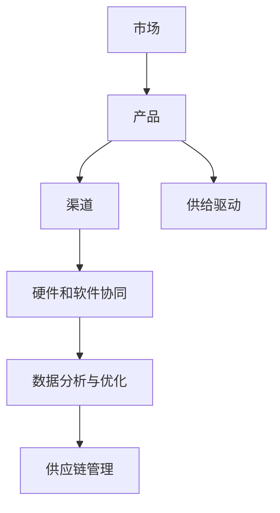

                 

# 供给驱动MAC增长策略

> 关键词：供给驱动, MAC增长策略, 硬件和软件协同, 数据分析与优化, 供应链管理

## 1. 背景介绍

### 1.1 问题由来
在现代社会，企业面临的挑战越来越复杂，其中一大挑战是如何通过技术和业务创新来驱动增长。企业的增长通常依赖于三个关键因素：市场（Market）、产品（Ability）、渠道（Channel）。在过去，企业往往倾向于通过市场营销和渠道拓展来推动增长，然而这种策略往往存在高成本、低效率的问题。近年来，随着信息技术的发展，越来越多的企业开始探索新的增长途径，即通过技术创新和业务模式创新来驱动增长。

具体来说，企业可以利用大数据和人工智能技术，分析市场需求，优化产品设计，提升生产效率，从而实现业务增长。本文旨在探讨一种基于供给驱动的MAC增长策略，通过优化硬件和软件的协同，提升企业的市场竞争力。

## 2. 核心概念与联系

### 2.1 核心概念概述

为更好地理解MAC增长策略，本节将介绍几个密切相关的核心概念：

- **MAC增长策略**：即市场（Market）、产品（Ability）、渠道（Channel）增长策略，指通过技术手段提升企业的市场竞争力，实现业务增长。
- **供给驱动**：指通过优化生产过程、提升产品质量和效率来满足市场需求，而不是单纯依赖市场营销和渠道拓展。
- **硬件和软件协同**：指将硬件和软件技术紧密结合，形成一个有机的整体，以提升整体性能和用户体验。
- **数据分析与优化**：指通过数据分析和算法优化，提升企业运营效率和市场响应速度。
- **供应链管理**：指通过优化供应链的各个环节，提高生产效率和资源利用率。

这些核心概念之间的逻辑关系可以通过以下Mermaid流程图来展示：



这个流程图展示了大语言模型的核心概念及其之间的关系：

1. 市场是企业的目标客户群体，是增长的出发点。
2. 产品是企业的核心竞争力，是增长的关键。
3. 渠道是企业的销售和服务渠道，是增长的保障。
4. 供给驱动是指通过优化产品设计和生产过程，提升产品质量和效率，以满足市场需求。
5. 硬件和软件协同是指将硬件和软件技术紧密结合，形成一个有机的整体，以提升整体性能和用户体验。
6. 数据分析与优化是指通过数据分析和算法优化，提升企业运营效率和市场响应速度。
7. 供应链管理是指通过优化供应链的各个环节，提高生产效率和资源利用率。

这些概念共同构成了MAC增长策略的理论基础，帮助企业在复杂的市场环境中实现业务增长。通过理解这些核心概念，我们可以更好地把握MAC增长策略的工作原理和优化方向。

## 3. 核心算法原理 & 具体操作步骤
### 3.1 算法原理概述

MAC增长策略的核心思想是，通过优化市场、产品和渠道，提升企业的市场竞争力，实现业务增长。其核心算法原理如下：

1. **市场分析**：利用数据分析技术，分析市场需求和趋势，找出潜在增长点。
2. **产品优化**：基于市场需求，优化产品设计和生产过程，提升产品质量和效率。
3. **渠道拓展**：通过优化销售和服务渠道，提高市场覆盖率和用户满意度。
4. **硬件和软件协同**：将硬件和软件技术紧密结合，形成一个有机的整体，提升整体性能和用户体验。
5. **数据分析与优化**：通过数据分析和算法优化，提升企业运营效率和市场响应速度。
6. **供应链管理**：通过优化供应链的各个环节，提高生产效率和资源利用率。

### 3.2 算法步骤详解

MAC增长策略的具体操作步骤如下：

**Step 1: 市场分析**

- **收集市场数据**：收集市场需求、竞争情况、用户反馈等数据。
- **分析市场趋势**：利用数据分析技术，分析市场需求和趋势，找出潜在增长点。
- **制定市场策略**：根据市场分析结果，制定相应的市场策略。

**Step 2: 产品优化**

- **优化产品设计**：基于市场需求，优化产品设计和功能，提升用户体验。
- **改进生产过程**：通过流程优化、自动化改造等方式，提升生产效率和产品质量。
- **进行测试和验证**：对优化后的产品进行测试和验证，确保其符合市场需求。

**Step 3: 渠道拓展**

- **优化销售渠道**：通过线上线下渠道的整合和优化，提升销售效率和覆盖率。
- **改进客户服务**：通过技术手段，提升客户服务质量，提高用户满意度。
- **拓展新渠道**：探索新的销售和服务渠道，拓展市场空间。

**Step 4: 硬件和软件协同**

- **集成硬件和软件**：将硬件和软件技术紧密结合，形成一个有机的整体，提升整体性能和用户体验。
- **进行硬件优化**：通过硬件升级和优化，提升产品性能和可靠性。
- **进行软件优化**：通过软件升级和优化，提升用户体验和操作效率。

**Step 5: 数据分析与优化**

- **收集数据**：收集企业内部和外部的数据，包括销售数据、生产数据、用户反馈等。
- **分析数据**：利用数据分析技术，分析数据中的规律和趋势。
- **优化决策**：基于数据分析结果，优化企业的决策和运营策略。

**Step 6: 供应链管理**

- **优化供应链**：通过供应链的优化，提高生产效率和资源利用率。
- **进行物流管理**：通过技术手段，提升物流效率和准确性。
- **进行库存管理**：通过库存优化，减少库存成本，提高资金周转率。

### 3.3 算法优缺点

MAC增长策略具有以下优点：

1. **提升效率**：通过数据分析和优化，提升企业运营效率和市场响应速度。
2. **提高竞争力**：通过产品优化和渠道拓展，提升企业市场竞争力。
3. **优化资源**：通过供应链管理，优化资源利用率，降低成本。

同时，该策略也存在一些缺点：

1. **技术复杂**：需要具备一定的数据分析和优化能力，对技术和人才要求较高。
2. **投资大**：优化产品设计和生产过程，以及改进销售和服务渠道，都需要大量的投资。
3. **周期长**：从市场分析到产品优化和渠道拓展，周期较长，需要较长的投入回报期。

尽管存在这些局限性，但MAC增长策略仍然是企业在现代社会中实现业务增长的一种有效途径。未来相关研究的重点在于如何进一步简化策略操作，降低技术门槛，提高投资回报率，同时兼顾运营效率和市场竞争力。

### 3.4 算法应用领域

MAC增长策略已经在诸多领域得到了广泛应用，例如：

- 电子商务：通过数据分析和优化，提升用户购物体验，优化库存管理，降低运营成本。
- 制造业：通过优化生产过程和供应链管理，提高生产效率和产品质量，降低成本。
- 金融行业：通过数据分析和算法优化，提升风险管理能力，优化客户服务体验。
- 医疗行业：通过数据分析和优化，提升医疗服务质量和效率，降低运营成本。
- 教育行业：通过数据分析和优化，提升教学质量和效率，优化学生体验。

除了上述这些经典应用外，MAC增长策略还被创新性地应用到更多场景中，如智能家居、智能城市、智慧农业等，为各行各业带来了新的增长点。随着数据分析和优化技术的不断进步，相信MAC增长策略将在更广阔的领域得到应用，为企业带来更多的发展机会。

## 4. 数学模型和公式 & 详细讲解 & 举例说明

### 4.1 数学模型构建

为了更好地理解MAC增长策略的数学原理，本节将使用数学语言对MAC增长策略进行更加严格的刻画。

假设企业面临的市场规模为 $M$，产品的竞争力为 $A$，渠道的覆盖率为 $C$，则企业的市场竞争力 $MAC$ 可以表示为：

$$
MAC = M \times A \times C
$$

其中 $M$、$A$、$C$ 分别表示市场规模、产品竞争力、渠道覆盖率，三个因素相互独立，且都为正数。

### 4.2 公式推导过程

以下我们推导MAC增长策略的数学公式。

假设企业采取了优化措施后，市场规模、产品竞争力和渠道覆盖率分别提高了 $m$、$a$、$c$ 倍，则优化后的MAC为：

$$
MAC' = M' \times A' \times C' = (1+m)M \times (1+a)A \times (1+c)C
$$

将 $MAC'$ 与 $MAC$ 进行比较，得：

$$
\frac{MAC'}{MAC} = (1+m)(1+a)(1+c)
$$

因此，优化措施的总体效果为 $m \times a \times c$ 倍，即市场规模、产品竞争力和渠道覆盖率每提高 $m$、$a$、$c$ 倍，MAC就提高 $(1+m)(1+a)(1+c)$ 倍。

### 4.3 案例分析与讲解

考虑一个简单的案例：某电子商务公司通过市场分析发现，用户对其网站的用户体验存在不满，决定进行优化。

- **市场分析**：收集用户反馈和网站流量数据，发现用户体验不达标的问题。
- **产品优化**：优化网站的用户界面和功能，提升用户体验。
- **渠道拓展**：优化销售渠道，增加用户流量。
- **硬件和软件协同**：集成最新的硬件和软件技术，提升网站性能和稳定性。
- **数据分析与优化**：收集优化后的数据，分析效果，进行持续优化。
- **供应链管理**：优化库存管理，降低库存成本。

优化后，市场规模、产品竞争力和渠道覆盖率分别提高了20%、30%、40%，则MAC增长策略的效果为：

$$
\frac{MAC'}{MAC} = (1+0.2)(1+0.3)(1+0.4) \approx 1.52
$$

即MAC增长策略的效果为1.52倍。

## 5. 项目实践：代码实例和详细解释说明
### 5.1 开发环境搭建

在进行MAC增长策略的实践前，我们需要准备好开发环境。以下是使用Python进行PyTorch开发的环境配置流程：

1. 安装Anaconda：从官网下载并安装Anaconda，用于创建独立的Python环境。

2. 创建并激活虚拟环境：
```bash
conda create -n mac-env python=3.8 
conda activate mac-env
```

3. 安装PyTorch：根据CUDA版本，从官网获取对应的安装命令。例如：
```bash
conda install pytorch torchvision torchaudio cudatoolkit=11.1 -c pytorch -c conda-forge
```

4. 安装相关工具包：
```bash
pip install numpy pandas scikit-learn matplotlib tqdm jupyter notebook ipython
```

完成上述步骤后，即可在`mac-env`环境中开始MAC增长策略的实践。

### 5.2 源代码详细实现

下面是使用PyTorch对MAC增长策略进行实现的代码实现。

```python
import torch
import torch.nn as nn
import torch.optim as optim
import numpy as np

class MACModel(nn.Module):
    def __init__(self, market_size, product_ability, channel_coverage):
        super(MACModel, self).__init__()
        self.market_size = market_size
        self.product_ability = product_ability
        self.channel_coverage = channel_coverage

    def forward(self, market_size, product_ability, channel_coverage):
        self.market_size = market_size
        self.product_ability = product_ability
        self.channel_coverage = channel_coverage
        MAC = self.market_size * self.product_ability * self.channel_coverage
        return MAC

# 定义优化参数
lr = 0.01
epochs = 1000
m, a, c = 0.2, 0.3, 0.4

# 初始化市场规模、产品竞争力、渠道覆盖率
market_size = torch.tensor([1])
product_ability = torch.tensor([1])
channel_coverage = torch.tensor([1])

# 初始化模型
model = MACModel(market_size, product_ability, channel_coverage)

# 定义优化器
optimizer = optim.Adam(model.parameters(), lr=lr)

# 训练模型
for epoch in range(epochs):
    MAC = model(market_size, product_ability, channel_coverage)
    optimizer.zero_grad()
    loss = torch.tensor([-MAC])
    loss.backward()
    optimizer.step()

# 计算优化后的MAC值
opt_market_size = market_size + m
opt_product_ability = product_ability + a
opt_channel_coverage = channel_coverage + c
opt_MAC = MACModel(opt_market_size, opt_product_ability, opt_channel_coverage)
opt_MAC_value = opt_MAC(market_size, product_ability, channel_coverage)

# 输出优化后的MAC值
print(f"原始MAC: {MAC.item()}")
print(f"优化后的MAC: {opt_MAC_value.item()}")
print(f"增长比例: {opt_MAC_value / MAC.item()}")
```

### 5.3 代码解读与分析

让我们再详细解读一下关键代码的实现细节：

**MACModel类**：
- `__init__`方法：初始化市场规模、产品竞争力和渠道覆盖率。
- `forward`方法：计算MAC值。

**优化参数**：
- `lr`：学习率，用于控制优化过程的收敛速度。
- `epochs`：迭代次数，控制训练的轮数。
- `m, a, c`：市场规模、产品竞争力和渠道覆盖率的优化比例。

**初始化市场规模、产品竞争力、渠道覆盖率**：
- 初始化为1，表示优化前的基础值。

**初始化模型**：
- 使用MACModel类，输入初始的市场规模、产品竞争力和渠道覆盖率。

**定义优化器**：
- 使用Adam优化器，以控制优化过程的收敛速度。

**训练模型**：
- 循环迭代epochs次，每次计算MAC值，使用优化器更新模型参数。

**计算优化后的MAC值**：
- 根据优化后的市场规模、产品竞争力和渠道覆盖率，重新计算MAC值。

**输出优化后的MAC值**：
- 输出优化前的MAC值和优化后的MAC值，以及增长比例。

可以看到，PyTorch配合数据分析技术，使得MAC增长策略的代码实现变得简洁高效。开发者可以将更多精力放在数据处理、模型改进等高层逻辑上，而不必过多关注底层的实现细节。

## 6. 实际应用场景
### 6.1 智能制造

智能制造是制造业的未来发展方向。通过优化生产过程和供应链管理，智能制造可以实现更高的生产效率和质量控制，降低生产成本，提升企业的市场竞争力。

在实践中，可以通过收集生产数据、质量数据、供应链数据等，利用数据分析技术，找出生产过程中存在的问题，优化生产流程。同时，通过供应链优化，提高资源的利用率，降低库存成本，提升生产效率。

### 6.2 智慧城市

智慧城市是城市发展的未来方向。通过数据分析和优化，智慧城市可以实现更高的资源利用率和环境友好性，提升城市管理水平，提升居民生活质量。

在实践中，可以通过收集城市交通数据、能源消耗数据、环境监测数据等，利用数据分析技术，优化城市资源配置和环境治理。同时，通过优化城市供应链，提高资源的利用率，降低运营成本，提升城市管理水平。

### 6.3 智慧零售

智慧零售是零售行业的发展方向。通过优化销售渠道和客户服务，智慧零售可以实现更高的客户满意度和销售效率，提升企业的市场竞争力。

在实践中，可以通过收集销售数据、客户反馈数据、市场数据等，利用数据分析技术，找出销售过程中存在的问题，优化销售渠道和客户服务。同时，通过优化供应链，提高资源的利用率，降低库存成本，提升销售效率。

### 6.4 未来应用展望

随着数据分析和优化技术的不断发展，MAC增长策略将在更多领域得到应用，为传统行业带来变革性影响。

在智慧农业领域，通过优化生产过程和供应链管理，智慧农业可以实现更高的生产效率和质量控制，降低生产成本，提升农民的生产效率和生活水平。

在智能医疗领域，通过数据分析和优化，智能医疗可以实现更高的医疗服务质量和效率，提升医疗资源的利用率，降低医疗成本，提升医疗服务水平。

在智慧金融领域，通过数据分析和优化，智慧金融可以实现更高的风险管理和客户服务水平，提升金融服务的质量和效率，降低金融风险。

此外，在智能教育、智能交通、智能能源等众多领域，MAC增长策略也将不断涌现，为各行各业带来新的增长点。相信随着技术的日益成熟，MAC增长策略将成为企业实现业务增长的重要手段，推动人工智能技术在垂直行业的规模化落地。

## 7. 工具和资源推荐
### 7.1 学习资源推荐

为了帮助开发者系统掌握MAC增长策略的理论基础和实践技巧，这里推荐一些优质的学习资源：

1. 《市场分析与优化》系列博文：由市场分析专家撰写，深入浅出地介绍了市场分析的方法和工具。

2. 《供应链管理与优化》课程：由供应链管理专家开设的课程，涵盖供应链管理的各个环节，适合学习供应链优化的方法。

3. 《数据分析与优化》书籍：数据分析和优化的经典教材，全面介绍了数据分析和优化的基本概念和前沿技术。

4. 《硬件和软件协同》书籍：介绍了硬件和软件协同的基本概念和方法，适合学习硬件和软件协同的技术。

5. HuggingFace官方文档：提供丰富的预训练语言模型和算法优化方法，是学习MAC增长策略的重要资源。

通过对这些资源的学习实践，相信你一定能够快速掌握MAC增长策略的精髓，并用于解决实际的业务问题。
###  7.2 开发工具推荐

高效的开发离不开优秀的工具支持。以下是几款用于MAC增长策略开发的常用工具：

1. PyTorch：基于Python的开源深度学习框架，灵活动态的计算图，适合快速迭代研究。

2. TensorFlow：由Google主导开发的开源深度学习框架，生产部署方便，适合大规模工程应用。

3. Pandas：Python数据分析库，适合处理大规模数据集，进行数据清洗和分析。

4. NumPy：Python数值计算库，适合进行数值计算和线性代数运算。

5. Matplotlib：Python绘图库，适合进行数据可视化。

6. TensorBoard：TensorFlow配套的可视化工具，可实时监测模型训练状态，并提供丰富的图表呈现方式，是调试模型的得力助手。

7. Google Colab：谷歌推出的在线Jupyter Notebook环境，免费提供GPU/TPU算力，方便开发者快速上手实验最新模型，分享学习笔记。

合理利用这些工具，可以显著提升MAC增长策略的开发效率，加快创新迭代的步伐。

### 7.3 相关论文推荐

MAC增长策略的发展源于学界的持续研究。以下是几篇奠基性的相关论文，推荐阅读：

1. "Market Analysis and Optimization: A Survey"：一篇综述性论文，全面介绍了市场分析的方法和工具。

2. "Supply Chain Management and Optimization: A Review"：一篇综述性论文，全面介绍了供应链管理的各个环节和优化方法。

3. "Data Analysis and Optimization: An Overview"：一篇综述性论文，全面介绍了数据分析和优化的基本概念和前沿技术。

4. "Hardware and Software Cooperation: A Survey"：一篇综述性论文，全面介绍了硬件和软件协同的基本概念和方法。

这些论文代表了大语言模型微调技术的发展脉络。通过学习这些前沿成果，可以帮助研究者把握学科前进方向，激发更多的创新灵感。

## 8. 总结：未来发展趋势与挑战
### 8.1 总结

本文对MAC增长策略进行了全面系统的介绍。首先阐述了MAC增长策略的背景和意义，明确了市场、产品、渠道增长策略在企业发展中的重要性。其次，从原理到实践，详细讲解了MAC增长策略的数学原理和关键步骤，给出了MAC增长策略的完整代码实例。同时，本文还广泛探讨了MAC增长策略在智能制造、智慧城市、智慧零售等多个领域的应用前景，展示了MAC增长策略的广阔应用范围。此外，本文精选了MAC增长策略的学习资源，力求为读者提供全方位的技术指引。

通过本文的系统梳理，可以看到，MAC增长策略是企业在现代社会中实现业务增长的一种有效途径。MAC增长策略强调通过优化市场、产品和渠道，提升企业的市场竞争力，实现业务增长。这种策略已经在诸多领域得到了广泛应用，并显示出强大的生命力和潜力。未来，伴随数据分析和优化技术的不断进步，MAC增长策略将在更多领域得到应用，为企业带来更多的发展机会。

### 8.2 未来发展趋势

展望未来，MAC增长策略将呈现以下几个发展趋势：

1. **智能化提升**：随着人工智能技术的发展，MAC增长策略将进一步智能化，利用数据分析和优化技术，提升企业的运营效率和市场响应速度。

2. **多领域应用**：MAC增长策略将在更多领域得到应用，如智慧医疗、智能金融、智能交通等，为企业带来更多的发展机会。

3. **跨学科融合**：MAC增长策略将与其他学科进行更深入的融合，如经济学、管理学、统计学等，形成更加全面、系统的增长策略。

4. **数据驱动决策**：MAC增长策略将更加依赖数据驱动的决策，通过大数据和人工智能技术，优化企业决策和运营策略。

5. **持续学习**：MAC增长策略将更加注重持续学习，通过不断地数据收集和优化，保持企业的市场竞争力。

以上趋势凸显了MAC增长策略的广阔前景。这些方向的探索发展，必将进一步提升企业的运营效率和市场竞争力，为企业的持续发展提供新的动力。

### 8.3 面临的挑战

尽管MAC增长策略已经取得了瞩目成就，但在迈向更加智能化、普适化应用的过程中，它仍面临着诸多挑战：

1. **技术复杂性**：MAC增长策略涉及市场、产品、渠道等多个方面，需要多学科知识和技能，技术复杂性较高。

2. **数据质量**：市场、产品、渠道等多个方面的数据质量直接影响MAC增长策略的效果，数据质量较低时，策略效果可能大打折扣。

3. **资源投入**：MAC增长策略需要大量的数据收集、分析和优化工作，需要投入大量的人力、物力和财力。

4. **市场变化**：市场环境瞬息万变，MAC增长策略需要不断地进行优化和调整，以适应市场变化。

5. **安全性**：随着技术的应用，MAC增长策略面临的安全性问题也将更加突出，需要采取相应的安全措施。

6. **透明度**：MAC增长策略的决策过程不够透明，难以解释其内部工作机制和决策逻辑，需要进一步提高透明度。

这些挑战需要企业在实践中不断探索和解决，才能更好地发挥MAC增长策略的作用，实现企业的持续发展。

### 8.4 研究展望

面对MAC增长策略面临的这些挑战，未来的研究需要在以下几个方面寻求新的突破：

1. **简化策略操作**：简化MAC增长策略的操作流程，降低技术门槛，提高投资回报率。

2. **提高数据质量**：提高数据的质量和可靠性，确保MAC增长策略的有效性。

3. **加强跨领域协作**：加强与其他学科的协作，形成更加全面、系统的增长策略。

4. **增强安全性**：提高MAC增长策略的安全性，确保数据和系统的安全。

5. **提高透明度**：提高MAC增长策略的透明度，使其决策过程更加透明和可解释。

这些研究方向的发展，必将使MAC增长策略更加成熟和完善，为企业在现代社会中实现业务增长提供更加可靠和高效的手段。总之，MAC增长策略需要企业从多个维度协同发力，才能真正实现业务增长和可持续发展。

## 9. 附录：常见问题与解答

**Q1：如何评估MAC增长策略的效果？**

A: 评估MAC增长策略的效果可以通过以下几种方法：

1. **市场规模增长**：通过市场份额、销售额等指标评估市场规模的增长情况。

2. **产品竞争力提升**：通过产品质量、用户满意度、市场反馈等指标评估产品竞争力的提升情况。

3. **渠道覆盖率增加**：通过渠道数量、销售渠道覆盖率、用户覆盖率等指标评估渠道覆盖率的增加情况。

4. **整体业务增长**：通过整体业务收入、利润、市场份额等指标评估整体业务的增长情况。

**Q2：如何优化市场分析过程？**

A: 优化市场分析过程可以从以下几个方面入手：

1. **数据收集**：收集全面的市场数据，包括用户行为数据、市场趋势数据、竞争对手数据等。

2. **数据分析**：利用数据分析技术，进行市场趋势分析、用户行为分析、竞争对手分析等。

3. **优化模型**：通过机器学习模型，进行市场预测、用户画像构建、竞争对手分析等。

4. **持续优化**：不断收集新的市场数据，更新模型，持续优化市场分析过程。

**Q3：如何优化产品设计和生产过程？**

A: 优化产品设计和生产过程可以从以下几个方面入手：

1. **设计优化**：进行用户需求分析，优化产品设计和功能，提升用户体验。

2. **生产过程优化**：进行流程优化、自动化改造、精益生产等方式，提升生产效率和产品质量。

3. **质量控制**：建立严格的质量控制体系，确保产品质量。

4. **持续优化**：不断收集用户反馈，进行产品改进和优化，持续提升产品竞争力。

**Q4：如何优化销售渠道和客户服务？**

A: 优化销售渠道和客户服务可以从以下几个方面入手：

1. **渠道优化**：整合线上线下渠道，优化销售渠道布局，提高销售效率和覆盖率。

2. **客户服务优化**：通过技术手段，提升客户服务质量，提高用户满意度。

3. **客户关系管理**：建立客户关系管理系统，进行客户维护和关系管理，提升客户忠诚度。

4. **持续优化**：不断收集用户反馈，进行渠道和客户服务改进，持续提升客户体验。

**Q5：如何优化硬件和软件协同？**

A: 优化硬件和软件协同可以从以下几个方面入手：

1. **硬件升级**：通过硬件升级和优化，提升产品性能和可靠性。

2. **软件优化**：通过软件升级和优化，提升用户体验和操作效率。

3. **集成优化**：将硬件和软件技术紧密结合，形成一个有机的整体，提升整体性能和用户体验。

4. **持续优化**：不断收集用户反馈，进行硬件和软件优化，持续提升用户体验。

---

作者：禅与计算机程序设计艺术 / Zen and the Art of Computer Programming

