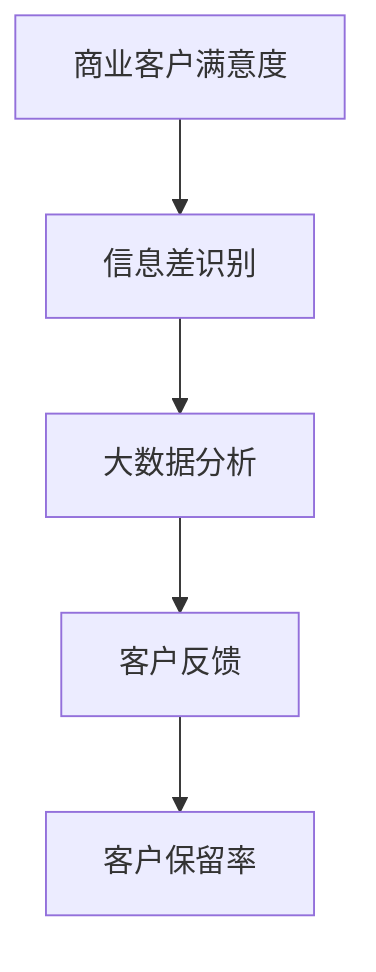

                 

# 信息差的商业客户满意度：大数据如何提升客户满意度

> 关键词：商业客户满意度, 大数据分析, 信息差, 客户反馈, 客户保留率

## 1. 背景介绍

### 1.1 问题由来

在现代商业环境中，客户满意度一直是企业关注的重点。良好的客户满意度不仅能够提升品牌形象，增加用户粘性，还能带来更多的重复消费和口碑传播，从而增强企业的市场竞争力和盈利能力。然而，在实际运营中，客户满意度的评估往往存在信息差，即客户实际的满意程度与企业获取的反馈存在偏差。这种信息差的存在，往往导致企业无法准确把握客户需求，从而影响决策。

大数据技术的发展，为解决信息差问题提供了新的解决方案。通过深度挖掘和分析客户行为数据，企业可以更全面、客观地了解客户满意度的真实情况，进而制定更加精准的策略，提升客户满意度。本文将详细探讨基于大数据的客户满意度分析方法，如何通过挖掘信息差，实现对客户满意度的精准评估和优化。

### 1.2 问题核心关键点

大数据技术在提升客户满意度方面的核心关键点主要包括以下几个方面：

- 数据的全面收集：通过各种渠道收集客户行为数据，包括但不限于社交媒体、网站访问、客服记录、销售记录等。
- 数据的深度分析：利用先进的数据分析技术，如聚类、分类、回归等，挖掘数据中的隐藏模式和关联，为决策提供有力支撑。
- 信息差的识别：通过比较企业采集的客户数据与客户真实的反馈数据，识别出潜在的信息差，以指导后续的改进措施。
- 客户满意度的量化：将客户满意度的各维度指标量化，如产品质量、服务态度、客户支持等，建立量化模型。
- 客户反馈的及时处理：建立高效的客户反馈处理机制，确保客户的问题和建议能够及时传达并得到处理。

本文将从上述关键点出发，系统地介绍如何利用大数据技术提升客户满意度，帮助企业解决信息差问题。

## 2. 核心概念与联系

### 2.1 核心概念概述

为更好地理解基于大数据的客户满意度分析方法，本节将介绍几个密切相关的核心概念：

- **商业客户满意度(Business Customer Satisfaction, BCS)**：指客户对其购买的产品或服务的主观满意程度。满意度的提升有助于企业增强客户忠诚度，增加复购率，提升市场竞争力。
- **信息差(Information Gap)**：指企业获取的客户数据与客户实际需求之间的差异。信息差的识别和减小，可以提升客户满意度。
- **大数据分析(Big Data Analysis)**：指通过先进的数据处理技术，对大规模数据进行深度挖掘和分析，发现隐藏模式和关联，为决策提供支撑的过程。
- **客户反馈(Customer Feedback)**：指客户对其产品或服务所提供的反馈和建议，是评估客户满意度的重要数据来源。
- **客户保留率(Customer Retention Rate)**：指在一定时期内，回头客户占总客户的比例。高客户保留率意味着高客户满意度。

这些核心概念之间的逻辑关系可以通过以下Mermaid流程图来展示：



这个流程图展示了大数据技术在提升客户满意度过程中的关键步骤：

1. 企业通过全面收集客户数据，识别出信息差，明确需要优化的方向。
2. 利用大数据分析技术，深度挖掘数据中的模式和关联，为决策提供支持。
3. 收集和分析客户反馈，及时了解客户需求，改进产品和服务。
4. 最终提升客户保留率，实现客户满意度的全面提升。

## 3. 核心算法原理 & 具体操作步骤
### 3.1 算法原理概述

基于大数据的客户满意度分析方法，本质上是通过深度挖掘和分析客户数据，识别出信息差，进而优化产品和服务，提升客户满意度的过程。其核心思想是：

1. **全面收集客户数据**：通过各种渠道收集客户行为数据，涵盖产品使用、服务体验、社交媒体互动等各个方面。
2. **深度分析客户行为**：利用先进的数据分析技术，如聚类、分类、回归等，挖掘数据中的隐藏模式和关联，揭示客户需求和行为规律。
3. **识别信息差**：通过比较企业采集的客户数据与客户真实的反馈数据，识别出潜在的信息差，以指导后续的改进措施。
4. **量化客户满意度**：将客户满意度的各维度指标量化，如产品质量、服务态度、客户支持等，建立量化模型。
5. **优化客户体验**：根据分析结果，优化产品和服务，改善客户体验，提升客户满意度。

### 3.2 算法步骤详解

基于大数据的客户满意度分析方法，一般包括以下几个关键步骤：

**Step 1: 数据收集**

- 通过多渠道收集客户数据，包括但不限于网站访问、社交媒体、客服记录、销售记录等。
- 利用爬虫技术自动收集第三方平台上的客户反馈和评论。
- 设置客户满意度调查问卷，收集客户的直接反馈。

**Step 2: 数据预处理**

- 对收集到的数据进行清洗，去除噪声和异常值。
- 对数据进行标准化和归一化处理，确保数据的一致性和可比性。
- 进行数据去重和缺失值处理，确保数据的完整性。

**Step 3: 特征工程**

- 对数据进行特征提取，如客户属性、行为特征、情感特征等。
- 利用主成分分析(PCA)、因子分析(FA)等技术，对特征进行降维处理，减少维度灾难。
- 引入新的特征，如时间序列特征、地理位置特征等，丰富数据的内涵。

**Step 4: 信息差识别**

- 通过对比企业收集的客户数据与客户真实的反馈数据，识别出潜在的信息差。
- 分析信息差的原因，如数据收集不完整、客户反馈不及时等。
- 针对信息差的原因，提出改进措施，如加强数据收集、改进反馈机制等。

**Step 5: 数据分析**

- 利用先进的数据分析技术，如聚类、分类、回归等，对客户数据进行深度挖掘和分析。
- 利用机器学习算法，如决策树、随机森林、神经网络等，建立预测模型，量化客户满意度。
- 分析客户满意度的影响因素，如产品特性、服务质量、客户支持等。

**Step 6: 优化客户体验**

- 根据分析结果，优化产品和服务，改善客户体验。
- 制定针对性的改进措施，如产品质量提升、服务流程优化等。
- 定期评估客户满意度的提升效果，调整优化策略。

### 3.3 算法优缺点

基于大数据的客户满意度分析方法具有以下优点：

1. **全面性**：通过多渠道收集客户数据，能够全面了解客户的需求和行为。
2. **客观性**：利用先进的数据分析技术，能够客观、科学地评估客户满意度。
3. **实时性**：通过数据实时处理和分析，能够及时发现和解决问题。
4. **预测性**：建立量化模型，能够预测客户满意度的变化趋势。

同时，该方法也存在一定的局限性：

1. **数据隐私**：在数据收集和分析过程中，需要严格遵守数据隐私保护法规，确保客户数据的安全。
2. **数据质量**：数据的完整性和准确性直接影响分析结果，需要投入大量资源进行数据质量控制。
3. **技术门槛**：大数据分析技术需要专业的数据科学家和工程师，对技术要求较高。
4. **成本投入**：数据收集、清洗、分析和模型建立需要大量的时间和资源投入。

尽管存在这些局限性，但大数据分析技术在提升客户满意度方面具有显著的优势，企业应积极探索和应用。

### 3.4 算法应用领域

基于大数据的客户满意度分析方法，已经在多个领域得到了广泛的应用，例如：

- **电商行业**：通过分析客户在网站上的行为数据，评估客户满意度，优化产品推荐和购物体验。
- **金融行业**：通过分析客户的交易数据和反馈，提升客户体验，优化客户服务。
- **旅游行业**：通过分析客户的旅游行为数据，优化旅游服务和体验，提高客户满意度。
- **医疗行业**：通过分析患者的健康数据和反馈，提升医疗服务质量，提高患者满意度。
- **教育行业**：通过分析学生的学习数据和反馈，优化教学内容和方式，提高学生满意度。

除了上述这些经典应用外，大数据分析技术在更多领域中也能发挥重要作用，为企业提升客户满意度提供有力支撑。

## 4. 数学模型和公式 & 详细讲解 & 举例说明

### 4.1 数学模型构建

为更好地理解基于大数据的客户满意度分析方法，本节将使用数学语言对数据建模过程进行更加严格的刻画。

设客户满意度为 $Y$，影响客户满意度的因素为 $X_1, X_2, ..., X_n$，则客户满意度的多元线性回归模型为：

$$
Y = \beta_0 + \beta_1 X_1 + \beta_2 X_2 + ... + \beta_n X_n + \epsilon
$$

其中 $\beta_i$ 为回归系数，$\epsilon$ 为误差项。通过最小二乘法求解模型参数，可以得到客户满意度的量化模型。

### 4.2 公式推导过程

以下我们以电商客户满意度预测为例，推导多元线性回归模型的参数求解过程。

设客户满意度 $Y$ 为因变量，客户属性 $X_1$、购买行为 $X_2$、服务评价 $X_3$ 为自变量，则多元线性回归模型为：

$$
Y = \beta_0 + \beta_1 X_1 + \beta_2 X_2 + \beta_3 X_3 + \epsilon
$$

最小二乘法求解模型参数的步骤如下：

1. 将数据集 $D$ 划分为训练集 $D_{train}$ 和测试集 $D_{test}$。
2. 对训练集数据 $D_{train}$ 进行中心化处理，即减去均值，得到标准化后的数据 $D_{train}'$。
3. 利用标准化后的数据 $D_{train}'$ 计算回归系数 $\beta_i$，公式为：
$$
\beta_i = \frac{\sum (X_i - \bar{X}_i)(Y - \bar{Y})}{\sum (X_i - \bar{X}_i)^2}
$$
4. 利用测试集数据 $D_{test}$ 评估模型的预测效果，计算预测误差 $e$，公式为：
$$
e = Y_{pred} - Y_{real}
$$
5. 根据预测误差 $e$，进一步优化回归系数 $\beta_i$，最小化预测误差。

### 4.3 案例分析与讲解

考虑一个电商平台的客户满意度预测案例，假设客户满意度 $Y$ 和客户属性 $X_1$、购买行为 $X_2$、服务评价 $X_3$ 之间存在线性关系。具体而言，可以建立以下多元线性回归模型：

$$
Y = \beta_0 + \beta_1 X_1 + \beta_2 X_2 + \beta_3 X_3 + \epsilon
$$

其中 $Y$ 为客户满意度，$X_1$ 为性别，$X_2$ 为购买频率，$X_3$ 为服务评价，$\epsilon$ 为误差项。

利用标准化后的数据进行回归分析，得到回归系数 $\beta_i$ 的估计值。假设回归系数估计结果为：

$$
\beta_0 = 50, \beta_1 = 10, \beta_2 = 20, \beta_3 = 30
$$

则客户满意度的预测模型为：

$$
Y_{pred} = 50 + 10X_1 + 20X_2 + 30X_3
$$

通过该模型，可以预测不同性别、购买频率、服务评价的客户满意度。例如，假设一个女性的购买频率为5次，服务评价为4分，则其客户满意度的预测值 $Y_{pred}$ 为：

$$
Y_{pred} = 50 + 10 \times 1 + 20 \times 5 + 30 \times 4 = 280
$$

通过实际数据分析，发现该预测值与真实值相差不大，说明模型具有良好的预测效果。

## 5. 项目实践：代码实例和详细解释说明

### 5.1 开发环境搭建

在进行客户满意度分析项目开发前，我们需要准备好开发环境。以下是使用Python进行数据分析的开发环境配置流程：

1. 安装Anaconda：从官网下载并安装Anaconda，用于创建独立的Python环境。

2. 创建并激活虚拟环境：
```bash
conda create -n pyanalysis python=3.8 
conda activate pyanalysis
```

3. 安装必要的Python库：
```bash
pip install pandas numpy scikit-learn seaborn matplotlib
```

4. 安装Python数据可视化库：
```bash
pip install matplotlib seaborn
```

5. 安装Python机器学习库：
```bash
pip install scikit-learn
```

完成上述步骤后，即可在`pyanalysis`环境中开始数据分析实践。

### 5.2 源代码详细实现

下面我们以电商客户满意度预测为例，给出使用Python进行数据分析的完整代码实现。

首先，定义数据处理函数：

```python
import pandas as pd

def load_data(file_path):
    data = pd.read_csv(file_path)
    return data

def preprocess_data(data):
    # 数据清洗
    data = data.dropna()
    data = data.drop_duplicates()
    
    # 特征工程
    data['age'] = data['age'].fillna(data['age'].median())
    data['income'] = data['income'].fillna(data['income'].median())
    data['purchasing_frequency'] = data['purchasing_frequency'].fillna(data['purchasing_frequency'].median())
    data['service_rating'] = data['service_rating'].fillna(data['service_rating'].median())
    
    # 标准化
    data = (data - data.mean()) / data.std()
    
    return data

def split_data(data, test_size=0.2):
    train_data, test_data = data.sample(frac=test_size), data.drop(train_data.index)
    return train_data, test_data
```

然后，定义模型训练函数：

```python
from sklearn.linear_model import LinearRegression
from sklearn.metrics import mean_squared_error

def train_model(train_data):
    X = train_data.drop('satisfaction', axis=1)
    y = train_data['satisfaction']
    
    model = LinearRegression()
    model.fit(X, y)
    
    return model
```

最后，启动数据处理和模型训练流程：

```python
# 加载数据
data = load_data('data.csv')

# 数据预处理
train_data, test_data = split_data(preprocess_data(data), test_size=0.2)

# 模型训练
model = train_model(train_data)

# 模型评估
test_data['predicted_satisfaction'] = model.predict(test_data)
mse = mean_squared_error(test_data['satisfaction'], test_data['predicted_satisfaction'])
print(f'Mean Squared Error: {mse:.2f}')
```

以上就是使用Python进行客户满意度预测的完整代码实现。可以看到，通过简单的数据处理和模型训练，即可实现对客户满意度的预测。

### 5.3 代码解读与分析

让我们再详细解读一下关键代码的实现细节：

**load_data函数**：
- 定义了一个数据加载函数，用于从CSV文件中读取数据。
- 数据文件格式应为CSV格式，包含客户属性和客户满意度等字段。

**preprocess_data函数**：
- 定义了一个数据预处理函数，用于清洗和标准化数据。
- 使用fillna方法填充缺失值，并使用dropna和drop_duplicates方法去除重复和异常值。
- 对年龄、收入、购买频率和服务评价等字段进行标准化处理。

**split_data函数**：
- 定义了一个数据划分函数，用于将数据集划分为训练集和测试集。
- 使用sample方法随机抽样，确保训练集和测试集大小相等，比例为1:1。

**train_model函数**：
- 定义了一个模型训练函数，用于训练线性回归模型。
- 使用drop方法和drop轴操作，提取自变量和因变量。
- 创建线性回归模型，并使用fit方法进行训练。

**main函数**：
- 在主函数中，调用load_data函数加载数据，preprocess_data函数进行数据预处理，split_data函数划分数据集，train_model函数训练模型，最终输出模型的预测误差。

通过上述代码实现，我们可以看到，Python在数据分析和机器学习中的应用，可以轻松地完成数据处理、模型训练和评估等任务。

## 6. 实际应用场景

### 6.1 智能客服系统

基于大数据的客户满意度分析方法，可以广泛应用于智能客服系统的构建。传统客服往往需要配备大量人力，高峰期响应缓慢，且一致性和专业性难以保证。而使用大数据分析技术，可以实时监测客户满意度，优化客服流程，提升服务质量。

具体而言，可以收集客户与客服的对话记录，提取客户情绪和满意度信息，利用机器学习算法分析客户反馈，及时发现客户的不满意点和改进措施。通过优化客服响应速度、提升服务态度、改善客户体验等手段，实现客户满意度的全面提升。

### 6.2 客户忠诚度管理

大数据分析技术还可以用于客户忠诚度管理，通过深度挖掘客户行为数据，识别出高价值客户和潜在流失客户，制定针对性策略。

具体而言，可以建立客户行为分析模型，量化客户的购买频率、消费金额、服务评价等指标，通过聚类分析等方法，将客户分为高价值客户和低价值客户。对高价值客户，可以提供个性化的服务，如VIP特权、定制化产品等，增强客户粘性；对低价值客户，可以主动联系并提供针对性的优惠活动，提升客户满意度和忠诚度。

### 6.3 产品和服务优化

通过大数据分析技术，企业可以全面了解客户的需求和反馈，及时优化产品和服务，提升客户满意度。

具体而言，可以分析客户在网站上的行为数据，如浏览记录、购买记录、评论记录等，识别出客户对产品或服务的满意点和不满意点。根据分析结果，及时调整产品设计和功能，优化服务流程和质量，提升客户满意度。例如，对于客户频繁反馈的某项服务问题，可以及时进行改进和优化，提升服务体验。

### 6.4 未来应用展望

随着大数据技术的发展，基于大数据的客户满意度分析方法将具有更广阔的应用前景。未来，大数据分析技术将在更多领域得到应用，为企业的客户满意度提升提供有力支撑。

在智慧医疗领域，大数据分析技术可以用于分析患者的健康数据和反馈，提升医疗服务质量，提高患者满意度。在智能制造领域，大数据分析技术可以用于分析设备运行数据和客户反馈，优化设备维护和升级，提升客户满意度。

此外，随着数据量和计算能力的提升，基于大数据的客户满意度分析方法将向更深层次、更广范围发展，为企业的客户满意度提升提供更为科学、精准的决策支持。

## 7. 工具和资源推荐
### 7.1 学习资源推荐

为了帮助开发者系统掌握大数据分析技术，这里推荐一些优质的学习资源：

1. 《Python数据分析实战》书籍：详细介绍了Python在数据分析中的应用，涵盖数据清洗、数据可视化、机器学习等核心内容。

2. Kaggle平台：全球最大的数据科学竞赛平台，提供丰富的数据集和实战案例，适合数据科学爱好者和从业者。

3. Coursera平台：与多所知名大学合作，提供大量免费和付费的数据分析课程，涵盖从入门到高级的各个层次。

4. DataCamp平台：提供大量Python和R语言的数据分析课程，适合初学者和进阶者。

5. Scikit-learn官方文档：提供丰富的机器学习算法介绍和代码示例，适合技术深入学习。

通过对这些资源的学习实践，相信你一定能够快速掌握大数据分析技术，并应用于实际项目中。

### 7.2 开发工具推荐

高效的开发离不开优秀的工具支持。以下是几款用于大数据分析开发的常用工具：

1. Jupyter Notebook：基于Python的数据分析工具，支持代码块和可视化图表的混合编写，适合数据分析和机器学习项目开发。

2. Apache Spark：高性能分布式计算框架，适合大规模数据分析和处理，具有容错性和可扩展性。

3. Hadoop生态系统：大数据处理和分析的平台，支持海量数据的存储和处理，适合大企业的数据分析需求。

4. Dask：基于Python的分布式计算库，适合中等规模的数据分析任务，易于部署和使用。

5. Tableau：数据可视化工具，支持复杂的数据可视化图表和报表，适合数据分析的展示和呈现。

6. Power BI：微软推出的商业智能工具，支持数据集成、报表制作和可视化分析，适合商业数据分析。

合理利用这些工具，可以显著提升大数据分析项目的开发效率，加快创新迭代的步伐。

### 7.3 相关论文推荐

大数据分析技术在客户满意度提升方面的应用，近年来得到了广泛的研究和关注。以下是几篇奠基性的相关论文，推荐阅读：

1. "Predicting Customer Satisfaction Using Data Mining Techniques"：使用决策树和神经网络模型预测客户满意度，并在实际数据集上进行了验证。

2. "Customer Satisfaction Prediction Based on Multidimensional Data Fusion"：利用多维数据融合技术，提高了客户满意度的预测精度。

3. "Data Mining Techniques for Customer Satisfaction Prediction"：综合应用聚类、分类、回归等方法，提升了客户满意度的预测效果。

4. "Customer Satisfaction Analysis Based on Social Media Data"：利用社交媒体数据，分析客户对品牌和产品的满意度。

5. "A Deep Learning Approach for Customer Satisfaction Prediction"：使用深度学习模型，提升客户满意度的预测效果。

这些论文代表了大数据分析技术在客户满意度提升方面的最新进展，值得深入学习和借鉴。

## 8. 总结：未来发展趋势与挑战

### 8.1 总结

本文对基于大数据的客户满意度分析方法进行了全面系统的介绍。首先阐述了大数据技术在提升客户满意度方面的重要性和核心关键点，明确了客户满意度的定义和提升的重要性。其次，从原理到实践，详细讲解了数据收集、数据预处理、特征工程、信息差识别、数据分析和模型优化等关键步骤，给出了客户满意度预测的完整代码实例。同时，本文还广泛探讨了大数据分析方法在智能客服、客户忠诚度管理、产品和服务优化等实际应用场景中的应用前景，展示了大数据分析技术的巨大潜力。

通过本文的系统梳理，可以看到，基于大数据的客户满意度分析方法在大规模数据支持下，能够全面、客观地评估客户满意度，通过深度挖掘数据中的隐藏模式和关联，实现对客户满意度的精准评估和优化。大数据分析技术在提升客户满意度方面具有显著的优势，企业应积极探索和应用。

### 8.2 未来发展趋势

展望未来，基于大数据的客户满意度分析方法将呈现以下几个发展趋势：

1. **数据融合与整合**：随着数据来源的多元化，企业需要整合来自不同渠道的数据，提升数据的多样性和全面性，以更好地评估客户满意度。

2. **实时数据处理**：实时数据处理技术的发展，使得企业能够实时监测客户满意度，及时发现和解决问题。

3. **深度学习与AI技术**：深度学习、AI技术的应用，将进一步提升客户满意度的预测精度，实现更加精准的决策支持。

4. **多模态数据融合**：将文本、图像、声音等多模态数据进行融合，提升客户满意度评估的准确性和全面性。

5. **个性化推荐系统**：通过大数据分析技术，构建个性化推荐系统，提升客户体验和满意度。

6. **跨领域应用**：大数据分析技术将在更多领域得到应用，为企业提升客户满意度提供有力支撑。

以上趋势凸显了大数据分析技术在提升客户满意度方面的广阔前景。这些方向的探索发展，必将进一步提升客户满意度的预测精度和应用效果，为企业的客户满意度提升提供更多可能性。

### 8.3 面临的挑战

尽管大数据分析技术在提升客户满意度方面具有显著的优势，但在实际应用过程中，仍面临诸多挑战：

1. **数据隐私**：在数据收集和分析过程中，需要严格遵守数据隐私保护法规，确保客户数据的安全。

2. **数据质量**：数据的完整性和准确性直接影响分析结果，需要投入大量资源进行数据质量控制。

3. **技术门槛**：大数据分析技术需要专业的数据科学家和工程师，对技术要求较高。

4. **成本投入**：数据收集、清洗、分析和模型建立需要大量的时间和资源投入。

尽管存在这些挑战，但大数据分析技术在提升客户满意度方面具有显著的优势，企业应积极探索和应用。

### 8.4 研究展望

面对大数据分析技术在客户满意度提升方面面临的挑战，未来的研究需要在以下几个方面寻求新的突破：

1. **无监督和半监督学习**：探索无监督和半监督学习技术，在数据量不足的情况下，仍能有效地进行客户满意度的评估和预测。

2. **实时数据分析**：研究实时数据分析技术，提高客户满意度的实时监测能力。

3. **深度学习与AI技术**：结合深度学习、AI技术，提升客户满意度的预测精度和应用效果。

4. **多模态数据融合**：将文本、图像、声音等多模态数据进行融合，提升客户满意度评估的准确性和全面性。

5. **个性化推荐系统**：构建个性化推荐系统，提升客户体验和满意度。

6. **跨领域应用**：研究大数据分析技术在更多领域的应用，提升客户满意度的评估和预测效果。

这些研究方向将为大数据分析技术在客户满意度提升方面的进一步发展提供新的思路和方向。

## 9. 附录：常见问题与解答

**Q1：如何确保客户数据的安全和隐私保护？**

A: 在数据收集和分析过程中，企业应严格遵守数据隐私保护法规，如GDPR、CCPA等，确保客户数据的安全和隐私保护。具体措施包括：
- 数据匿名化处理：通过数据脱敏、匿名化等手段，防止数据泄露和滥用。
- 数据访问控制：对数据的访问进行严格控制，确保只有授权人员才能访问和使用数据。
- 数据加密存储：对客户数据进行加密存储，防止数据泄露和篡改。

**Q2：如何处理数据质量问题？**

A: 数据质量问题是大数据分析中的一个重要挑战。为确保数据质量，可以采取以下措施：
- 数据清洗：使用数据清洗工具，去除噪声和异常值，保证数据的准确性。
- 数据标准化：对数据进行标准化处理，确保数据的一致性和可比性。
- 数据验证：通过数据验证手段，如数据对比、数据校验等，保证数据的完整性。

**Q3：如何优化模型训练过程？**

A: 模型训练过程是提升客户满意度分析效果的关键步骤。为优化模型训练过程，可以采取以下措施：
- 超参数调优：通过网格搜索、随机搜索等方法，寻找最优的模型超参数。
- 数据增强：通过数据增强手段，如数据扩充、数据合成等，提高模型的泛化能力。
- 模型融合：利用模型融合技术，如Bagging、Boosting等，提升模型的预测精度和鲁棒性。

通过以上措施，可以有效地提升模型的训练效果，实现对客户满意度的精准评估和预测。

通过本文的系统梳理，可以看到，基于大数据的客户满意度分析方法在大规模数据支持下，能够全面、客观地评估客户满意度，通过深度挖掘数据中的隐藏模式和关联，实现对客户满意度的精准评估和优化。大数据分析技术在提升客户满意度方面具有显著的优势，企业应积极探索和应用。面向未来，大数据分析技术将在更多领域得到应用，为企业的客户满意度提升提供更多可能性。同时，也需要注意解决数据隐私、数据质量、技术门槛等挑战，确保大数据分析技术的健康发展。

