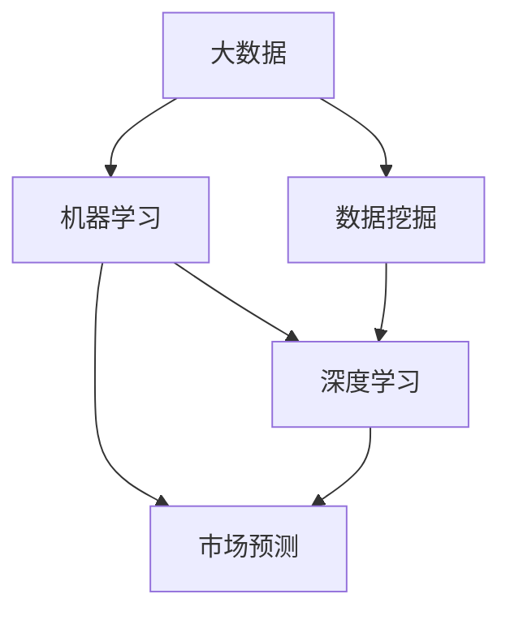

                 

# 信息差的商业市场预测：大数据如何提升市场预测能力

## 1. 背景介绍

在现代社会中，市场预测的重要性不言而喻。无论是企业决策、政府规划还是个人投资，对市场的准确预测都至关重要。然而，传统市场预测方法往往依赖专家经验、历史数据和统计模型，这些方法在数据不足、模型参数过多或模型复杂度过高的情况下，容易出现偏差。而随着大数据时代的来临，越来越多的企业开始探索利用大数据来提升市场预测的准确性。

### 1.1 问题由来

传统的市场预测方法主要依赖专家经验和统计模型。专家经验法依赖于专家的知识和直觉，但由于个人经验的局限性和主观性，难以适应快速变化的市场环境。统计模型法依赖于历史数据，但由于历史数据的局限性和数据量的不足，模型往往会出现过拟合或欠拟合的问题，难以准确预测未来市场动态。

而大数据时代的到来，为市场预测提供了全新的数据资源和技术手段。大数据分析通过海量数据挖掘、模式识别和机器学习等技术，可以发现市场中的隐藏规律和趋势，为市场预测提供强有力的支撑。然而，如何有效利用大数据提升市场预测能力，仍然是一个复杂且挑战性的问题。

## 2. 核心概念与联系

### 2.1 核心概念概述

- **大数据**：指规模大、类型多、更新快的数据集合，包括结构化数据、半结构化数据和非结构化数据等。
- **数据挖掘**：指从大规模数据中提取有用信息或知识的过程，常用于市场预测、客户行为分析等。
- **机器学习**：指让计算机通过学习历史数据，自动获取数据规律并做出预测和决策的方法，常用于分类、回归、聚类等任务。
- **市场预测**：指通过对市场数据进行分析，预测未来市场趋势和变化的方法，常用于股票交易、产品销售、投资分析等。
- **深度学习**：指使用神经网络等深度学习模型，从数据中学习复杂模式并进行预测和决策的方法，常用于图像识别、自然语言处理等任务。
- **信息差**：指市场中供需双方信息的不对称，常用于市场预测和投资分析中。

这些核心概念之间的逻辑关系可以通过以下Mermaid流程图来展示：



这个流程图展示了大数据、数据挖掘、机器学习和深度学习在市场预测中的联系。

## 3. 核心算法原理 & 具体操作步骤
### 3.1 算法原理概述

基于大数据的市场预测，主要依赖于数据挖掘和机器学习技术。其核心思想是通过对海量市场数据的分析，发现隐藏的市场规律和趋势，并使用机器学习模型进行预测。

具体来说，市场预测过程可以分为以下几个步骤：

1. **数据收集**：收集市场中的各种数据，如销售数据、价格数据、用户反馈数据等。
2. **数据清洗**：对收集到的数据进行清洗和预处理，去除噪声和异常值。
3. **特征提取**：从清洗后的数据中提取有意义的特征，如产品类别、用户属性、时间序列等。
4. **模型训练**：使用机器学习模型对提取的特征进行训练，构建市场预测模型。
5. **预测输出**：使用训练好的模型对未来的市场数据进行预测。

### 3.2 算法步骤详解

**Step 1: 数据收集**

数据收集是市场预测的第一步，也是最关键的一步。数据的完整性和多样性直接影响预测的准确性。常见的数据源包括：

- **公开数据**：如政府统计数据、行业报告等。
- **企业数据**：如销售数据、客户反馈等。
- **第三方数据**：如社交媒体数据、新闻报道等。

在数据收集过程中，需要注意数据的来源、质量和时效性。常用的数据收集工具包括爬虫、API接口等。

**Step 2: 数据清洗**

数据清洗是对收集到的数据进行预处理，去除噪声和异常值的过程。常用的数据清洗方法包括：

- **缺失值处理**：如均值填充、插值法等。
- **异常值处理**：如截断法、箱线图法等。
- **数据规范化**：如标准化、归一化等。

数据清洗的目的是提高数据的质量和一致性，减少噪声和误差，提高预测的准确性。

**Step 3: 特征提取**

特征提取是从清洗后的数据中提取有意义的特征，以便用于机器学习模型的训练和预测。常见的特征提取方法包括：

- **统计特征**：如均值、方差、标准差等。
- **时序特征**：如周期性、趋势性等。
- **文本特征**：如TF-IDF、词频等。

特征提取的目的是提高模型的泛化能力和预测精度，减少数据维度和计算复杂度。

**Step 4: 模型训练**

模型训练是使用机器学习模型对提取的特征进行训练，构建市场预测模型的过程。常见的机器学习模型包括：

- **线性回归**：适用于连续型数据的预测。
- **逻辑回归**：适用于分类任务的预测。
- **支持向量机**：适用于分类和回归任务。
- **随机森林**：适用于特征选择和降维。
- **神经网络**：适用于复杂数据的预测和特征学习。

模型训练的目的是优化模型的参数，提高预测的准确性和泛化能力。

**Step 5: 预测输出**

预测输出是使用训练好的模型对未来的市场数据进行预测的过程。常见的预测方法包括：

- **点预测**：直接预测未来数据的值，如股票价格、销售量等。
- **区间预测**：预测未来数据的范围，如股票波动范围、销售增长区间等。
- **时间序列预测**：对未来时间的序列数据进行预测，如季节性变化、趋势变化等。

预测输出的目的是帮助企业或政府制定决策，优化资源配置。

### 3.3 算法优缺点

基于大数据的市场预测方法具有以下优点：

1. **数据多样性**：可以利用各种类型的数据，如结构化数据、半结构化数据和非结构化数据，提高预测的全面性和准确性。
2. **模型灵活性**：可以采用多种机器学习模型，根据数据特点和任务需求选择最合适的模型，提高预测的泛化能力。
3. **实时性**：可以实时收集和处理数据，及时响应市场变化，提高决策的时效性。

然而，基于大数据的市场预测方法也存在以下缺点：

1. **数据噪音**：海量数据中可能存在大量的噪声和异常值，影响预测的准确性。
2. **计算复杂性**：大数据分析需要处理大量的数据和计算，需要高性能的计算设备和算法，成本较高。
3. **模型复杂性**：大数据分析模型通常较为复杂，需要丰富的专业知识和技术手段，难以快速实现和部署。

### 3.4 算法应用领域

基于大数据的市场预测方法广泛应用于各个领域，如金融、零售、制造、医疗等。以下是一些具体的应用场景：

- **金融市场预测**：预测股票价格、汇率、利率等金融指标的变化趋势，帮助投资者制定投资策略。
- **零售市场预测**：预测产品销售量、客户行为、库存需求等，优化供应链管理和库存管理。
- **制造业预测**：预测生产设备故障、产品缺陷率、市场需求等，提高生产效率和产品质量。
- **医疗市场预测**：预测疾病流行趋势、治疗效果、药品需求等，优化医疗资源配置和疾病防控策略。

## 4. 数学模型和公式 & 详细讲解 & 举例说明
### 4.1 数学模型构建

基于大数据的市场预测，主要依赖于机器学习模型进行预测。其数学模型通常可以表示为：

$$
y = f(x, \theta)
$$

其中，$y$表示预测结果，$x$表示输入特征，$\theta$表示模型参数。

常见的机器学习模型包括线性回归、逻辑回归、支持向量机、随机森林和神经网络等。这里以线性回归模型为例，详细讲解其数学模型和公式。

### 4.2 公式推导过程

线性回归模型的目标是最小化预测值与实际值之间的均方误差，即：

$$
\min_{\theta} \frac{1}{n} \sum_{i=1}^n (y_i - \hat{y}_i)^2
$$

其中，$y_i$表示第$i$个样本的实际值，$\hat{y}_i$表示第$i$个样本的预测值。

线性回归模型的参数可以通过最小化上述损失函数求解。求解过程如下：

1. **梯度下降算法**：

$$
\theta \leftarrow \theta - \eta \nabla_{\theta}\mathcal{L}(\theta)
$$

其中，$\eta$表示学习率，$\nabla_{\theta}\mathcal{L}(\theta)$表示损失函数对参数$\theta$的梯度。

2. **梯度计算**：

$$
\nabla_{\theta}\mathcal{L}(\theta) = -\frac{2}{n}X^T(XX^T)^{-1}(y - X\theta)
$$

其中，$X$表示输入特征矩阵，$y$表示目标值向量。

3. **矩阵分解**：

$$
(XX^T)^{-1} = \frac{1}{n}X^TX^{-1}
$$

其中，$X^T$表示输入特征矩阵的转置，$X^{-1}$表示输入特征矩阵的逆矩阵。

4. **预测输出**：

$$
\hat{y}_i = \theta^TX_i
$$

其中，$\theta$表示模型参数，$X_i$表示第$i$个样本的特征向量。

### 4.3 案例分析与讲解

假设某电商公司收集了过去一年的销售数据，包括产品类别、销售价格、促销活动等，想要预测下一年度的销售情况。

1. **数据收集**：收集过去一年的销售数据，包括产品类别、销售价格、促销活动等。
2. **数据清洗**：对收集到的数据进行清洗和预处理，去除噪声和异常值。
3. **特征提取**：从清洗后的数据中提取有意义的特征，如产品类别、销售价格、促销活动等。
4. **模型训练**：使用线性回归模型对提取的特征进行训练，构建市场预测模型。
5. **预测输出**：使用训练好的模型对未来的销售数据进行预测，制定销售策略。

在实际应用中，线性回归模型可能无法满足复杂的预测需求。此时可以采用其他机器学习模型，如逻辑回归、支持向量机、随机森林和神经网络等，根据具体任务需求选择最合适的模型。

## 5. 项目实践：代码实例和详细解释说明
### 5.1 开发环境搭建

在进行市场预测的实践过程中，需要搭建合适的开发环境。以下是使用Python进行Scikit-learn开发的环境配置流程：

1. 安装Anaconda：从官网下载并安装Anaconda，用于创建独立的Python环境。

2. 创建并激活虚拟环境：
```bash
conda create -n market-prediction python=3.8 
conda activate market-prediction
```

3. 安装Scikit-learn：
```bash
pip install scikit-learn
```

4. 安装其他必要工具包：
```bash
pip install pandas numpy matplotlib seaborn jupyter notebook
```

完成上述步骤后，即可在`market-prediction`环境中开始市场预测实践。

### 5.2 源代码详细实现

下面我们以销售预测为例，给出使用Scikit-learn进行线性回归模型训练和预测的Python代码实现。

首先，导入必要的库：

```python
import pandas as pd
import numpy as np
from sklearn.model_selection import train_test_split
from sklearn.linear_model import LinearRegression
from sklearn.metrics import mean_squared_error, r2_score
from sklearn.preprocessing import StandardScaler
from sklearn.pipeline import Pipeline
```

然后，准备数据：

```python
data = pd.read_csv('sales_data.csv')

# 处理缺失值
data.fillna(method='ffill', inplace=True)

# 数据划分
X = data[['product_category', 'price', 'promotion']]
y = data['sales']

# 特征缩放
scaler = StandardScaler()
X_scaled = scaler.fit_transform(X)

# 数据划分
X_train, X_test, y_train, y_test = train_test_split(X_scaled, y, test_size=0.2, random_state=42)
```

接着，训练模型：

```python
model = LinearRegression()

# 训练模型
model.fit(X_train, y_train)

# 预测测试集
y_pred = model.predict(X_test)

# 计算评估指标
mse = mean_squared_error(y_test, y_pred)
rmse = np.sqrt(mse)
r2 = r2_score(y_test, y_pred)

print(f'RMSE: {rmse:.2f}, R2: {r2:.2f}')
```

最后，使用模型进行预测：

```python
# 预测新数据
new_data = np.array([[1, 100, 1], [2, 150, 0]])
new_data_scaled = scaler.transform(new_data)
predictions = model.predict(new_data_scaled)
print(f'预测结果: {predictions}')
```

### 5.3 代码解读与分析

让我们再详细解读一下关键代码的实现细节：

**数据处理**：
- 使用pandas库读取销售数据，并处理缺失值。
- 使用ffill方法进行数据填充，保证数据的连续性。

**特征缩放**：
- 使用StandardScaler对特征进行标准化，防止不同特征之间的影响不同。

**模型训练**：
- 使用LinearRegression模型对训练数据进行训练，构建线性回归模型。

**模型评估**：
- 使用mean_squared_error和r2_score计算模型评估指标，包括均方误差和决定系数。

**预测输出**：
- 使用训练好的模型对新数据进行预测，输出预测结果。

以上代码实现展示了如何使用Scikit-learn进行线性回归模型的训练和预测。需要注意的是，实际应用中，数据处理和特征提取的过程更为复杂，需要根据具体任务进行优化。

## 6. 实际应用场景
### 6.1 智能投资决策

智能投资决策是市场预测的重要应用场景之一。传统的投资决策依赖于分析师的经验和统计模型，难以适应快速变化的市场环境。而基于大数据的市场预测技术，可以帮助投资者制定更加科学的投资策略。

在实际应用中，可以使用市场预测技术对股票价格、汇率、利率等金融指标进行预测，根据预测结果制定投资策略，降低投资风险，提高投资收益。例如，可以使用线性回归模型预测股票价格的变化趋势，根据预测结果进行买卖操作。

### 6.2 供应链管理

供应链管理是市场预测的另一个重要应用场景。传统的供应链管理依赖于历史数据和专家经验，难以应对市场需求的变化。而基于大数据的市场预测技术，可以帮助企业制定更加科学的供应链策略。

在实际应用中，可以使用市场预测技术对产品销售量、库存需求、物流运输等进行预测，根据预测结果进行供应链优化，降低成本，提高效率。例如，可以使用时间序列预测模型对销售量进行预测，根据预测结果制定采购计划，避免库存积压或缺货情况的发生。

### 6.3 消费者行为分析

消费者行为分析是市场预测的另一个重要应用场景。传统的消费者行为分析依赖于问卷调查和专家经验，难以全面反映消费者的真实需求。而基于大数据的市场预测技术，可以帮助企业深入了解消费者的行为和偏好。

在实际应用中，可以使用市场预测技术对消费者购买行为、品牌偏好、产品评价等进行预测，根据预测结果制定营销策略，提高消费者的满意度和忠诚度。例如，可以使用分类模型对消费者评价进行预测，根据预测结果进行产品优化和推广，提升产品的市场竞争力。

### 6.4 未来应用展望

随着大数据技术的不断进步，基于大数据的市场预测技术将具备更强的预测能力和应用范围。未来，市场预测技术将在以下几个方面得到更广泛的应用：

1. **实时预测**：随着大数据技术的不断发展，实时数据采集和处理技术将得到显著提升，实时预测将成为市场预测的重要方向。
2. **多模态预测**：大数据不仅包括结构化数据，还包括半结构化数据和非结构化数据，未来将更多地利用多模态数据进行市场预测，提高预测的准确性和全面性。
3. **预测精度提升**：随着机器学习模型的不断优化，市场预测的精度将不断提高，预测结果将更加准确和可靠。
4. **个性化预测**：基于大数据的市场预测技术可以更好地了解消费者的需求和偏好，未来将更多地利用个性化预测技术，提高市场预测的精准度。
5. **智能决策支持**：市场预测技术将成为智能决策支持系统的重要组成部分，帮助企业制定更加科学的决策策略，提高企业的竞争力和市场地位。

## 7. 工具和资源推荐
### 7.1 学习资源推荐

为了帮助开发者系统掌握基于大数据的市场预测技术，这里推荐一些优质的学习资源：

1. **《Python数据分析与可视化》**：详细讲解了Python数据分析和可视化技术，适用于市场预测的基础学习。
2. **《机器学习实战》**：介绍了多种机器学习算法和应用场景，适合市场预测的实践应用。
3. **《Python数据科学手册》**：涵盖数据清洗、数据处理、模型训练等技术，适用于市场预测的全面学习。
4. **Kaggle竞赛**：提供了大量的市场预测数据集和竞赛任务，适合市场预测的实战练习。
5. **Coursera课程**：斯坦福大学和MIT等名校开设的机器学习课程，系统讲解了机器学习的基本概念和算法，适合市场预测的深入学习。

通过对这些资源的学习实践，相信你一定能够快速掌握基于大数据的市场预测技术，并用于解决实际的预测问题。

### 7.2 开发工具推荐

高效的开发离不开优秀的工具支持。以下是几款用于市场预测开发的常用工具：

1. **Jupyter Notebook**：Python的交互式开发环境，适合数据处理和模型训练。
2. **TensorFlow**：Google主导的深度学习框架，支持大规模数据处理和模型训练。
3. **PyTorch**：Facebook主导的深度学习框架，支持动态计算图和模型优化。
4. **Scikit-learn**：Python的机器学习库，提供了多种经典机器学习算法和工具，适合市场预测的开发和测试。
5. **Pandas**：Python的数据处理库，支持大规模数据处理和分析，适合市场预测的数据清洗和特征提取。

合理利用这些工具，可以显著提升市场预测任务的开发效率，加快创新迭代的步伐。

### 7.3 相关论文推荐

市场预测技术的发展源于学界的持续研究。以下是几篇奠基性的相关论文，推荐阅读：

1. **《Big Data: A Revolution That Will Transform How We Live, Work and Think》**：强调大数据对各行业的影响，适合市场预测的全面了解。
2. **《The Google BigQuery Virtual Machine》**：介绍了Google的BigQuery虚拟机器，适合市场预测的实际应用。
3. **《A Survey of Machine Learning Techniques for Predictive Maintenance》**：介绍了机器学习在预测维护中的应用，适合市场预测的深入研究。
4. **《Predictive Analytics》**：介绍了多种预测技术和方法，适合市场预测的实际应用。

这些论文代表了大数据市场预测技术的发展脉络。通过学习这些前沿成果，可以帮助研究者把握学科前进方向，激发更多的创新灵感。

## 8. 总结：未来发展趋势与挑战

### 8.1 总结

本文对基于大数据的市场预测技术进行了全面系统的介绍。首先阐述了市场预测的重要性及其面临的挑战，明确了大数据技术在市场预测中的独特价值。其次，从原理到实践，详细讲解了市场预测的数学模型和算法步骤，给出了市场预测任务开发的完整代码实例。同时，本文还广泛探讨了市场预测技术在金融、零售、制造等多个行业领域的应用前景，展示了大数据技术的广阔前景。

通过本文的系统梳理，可以看到，基于大数据的市场预测技术正在成为预测分析的重要范式，极大地提升了市场预测的准确性和应用范围，为决策者提供了科学依据。未来，伴随大数据技术的不断演进，市场预测技术将具备更强的预测能力和应用范围，为经济社会的可持续发展提供更可靠的支撑。

### 8.2 未来发展趋势

展望未来，基于大数据的市场预测技术将呈现以下几个发展趋势：

1. **数据规模扩大**：随着互联网和物联网的不断发展，数据量将不断增长，大数据市场预测技术将进一步提升数据处理和分析能力。
2. **模型复杂性提升**：随着机器学习模型的不断优化，市场预测的精度将不断提高，模型复杂性也将不断提升。
3. **实时性增强**：随着实时数据采集和处理技术的不断进步，实时预测将成为市场预测的重要方向。
4. **多模态融合**：大数据不仅包括结构化数据，还包括半结构化数据和非结构化数据，未来将更多地利用多模态数据进行市场预测，提高预测的准确性和全面性。
5. **智能决策支持**：市场预测技术将成为智能决策支持系统的重要组成部分，帮助企业制定更加科学的决策策略，提高企业的竞争力和市场地位。

### 8.3 面临的挑战

尽管基于大数据的市场预测技术已经取得了瞩目成就，但在迈向更加智能化、普适化应用的过程中，它仍面临着诸多挑战：

1. **数据质量**：大数据中可能存在大量的噪声和异常值，影响预测的准确性。如何提高数据质量，减少数据噪音，将是未来的一个重要挑战。
2. **计算资源**：大数据分析需要处理大量的数据和计算，需要高性能的计算设备和算法，成本较高。如何降低计算成本，提升计算效率，将是未来的一个重要方向。
3. **模型复杂性**：市场预测模型通常较为复杂，需要丰富的专业知识和技术手段，难以快速实现和部署。如何简化模型结构，降低模型复杂性，将是未来的一个重要课题。
4. **预测精度**：市场预测的精度直接影响到决策的准确性和可靠性，如何提高预测精度，减少预测误差，将是未来的一个重要目标。
5. **数据隐私和安全**：市场预测涉及大量敏感数据，如何保护数据隐私和安全，防止数据泄露和滥用，将是未来的一个重要课题。

### 8.4 研究展望

面对大数据市场预测技术所面临的种种挑战，未来的研究需要在以下几个方面寻求新的突破：

1. **数据清洗和预处理技术**：研究高效的数据清洗和预处理技术，减少数据噪音和异常值，提高数据质量。
2. **高效计算技术**：研究高效的计算技术和算法，降低计算成本，提升计算效率。
3. **轻量级模型**：研究轻量级的市场预测模型，简化模型结构，降低模型复杂性。
4. **多模态融合**：研究多模态数据融合技术，提高预测的全面性和准确性。
5. **智能决策支持**：研究智能决策支持系统，利用市场预测技术，制定科学的决策策略，提高企业的竞争力和市场地位。

这些研究方向的探索，必将引领基于大数据的市场预测技术迈向更高的台阶，为经济社会的可持续发展提供更可靠的支撑。面向未来，基于大数据的市场预测技术还需要与其他人工智能技术进行更深入的融合，如知识表示、因果推理、强化学习等，多路径协同发力，共同推动自然语言理解和智能交互系统的进步。只有勇于创新、敢于突破，才能不断拓展市场预测的边界，让智能技术更好地造福人类社会。

## 9. 附录：常见问题与解答

**Q1: 大数据如何提升市场预测能力？**

A: 大数据通过收集和分析海量数据，发现市场中的隐藏规律和趋势，为市场预测提供强有力的支撑。具体来说，大数据市场预测技术可以分为以下几个步骤：

1. 数据收集：收集市场中的各种数据，如销售数据、价格数据、用户反馈等。
2. 数据清洗：对收集到的数据进行清洗和预处理，去除噪声和异常值。
3. 特征提取：从清洗后的数据中提取有意义的特征，如产品类别、销售价格、促销活动等。
4. 模型训练：使用机器学习模型对提取的特征进行训练，构建市场预测模型。
5. 预测输出：使用训练好的模型对未来的市场数据进行预测。

大数据技术能够处理和分析大规模数据，发现更多的数据模式和关系，从而提高预测的准确性和可靠性。

**Q2: 如何选择适合的市场预测模型？**

A: 选择适合的市场预测模型需要考虑以下几个因素：

1. 数据类型：如果数据是连续型数据，可以选择线性回归、神经网络等模型；如果是分类数据，可以选择逻辑回归、支持向量机等模型。
2. 数据量：如果数据量较小，可以选择简单模型，如线性回归、逻辑回归等；如果数据量较大，可以选择复杂模型，如神经网络、随机森林等。
3. 数据分布：如果数据分布较为复杂，可以选择支持非线性关系的模型，如神经网络、决策树等。
4. 预测目标：根据具体的预测目标，选择适合的模型，如点预测、区间预测、时间序列预测等。

在选择模型时，需要结合具体任务和数据特点进行评估和选择，选择合适的模型才能提高预测的准确性。

**Q3: 如何处理数据中的缺失值？**

A: 数据中的缺失值会严重影响预测结果的准确性，需要采取以下措施进行处理：

1. 删除缺失值：如果缺失值较少，可以考虑删除缺失值。
2. 插值法：如果缺失值较多，可以使用插值法进行填充，如均值填充、线性插值等。
3. 多重插补：如果缺失值较多且数据量较大，可以使用多重插补方法，生成多个数据集进行预测。

在实际应用中，需要根据数据特点和预测需求选择合适的方法进行处理。

**Q4: 市场预测中如何处理时间序列数据？**

A: 时间序列数据是市场预测中常见的数据类型，需要采取以下措施进行处理：

1. 时间序列分解：将时间序列数据分解为趋势、季节性和随机噪声，分别进行处理。
2. 滑动窗口：使用滑动窗口方法，将时间序列数据划分为多个子序列进行预测。
3. 时间序列回归：使用时间序列回归模型，如ARIMA、LSTM等，对时间序列数据进行预测。

在实际应用中，需要根据具体任务和数据特点选择合适的方法进行处理，提高预测的准确性和稳定性。

**Q5: 如何提高市场预测的准确性？**

A: 提高市场预测的准确性需要采取以下措施：

1. 数据质量：提高数据质量，减少数据噪音和异常值，保证数据的完整性和一致性。
2. 特征提取：提取有意义的特征，选择适合的特征进行预测，避免冗余特征。
3. 模型选择：选择适合的模型，根据数据特点和预测需求进行评估和选择，避免模型过拟合和欠拟合。
4. 模型优化：通过交叉验证、参数调优等方法，优化模型参数，提高预测精度。
5. 多模型融合：使用多个模型进行预测，取平均输出，减少预测误差，提高预测的鲁棒性。

在实际应用中，需要结合具体任务和数据特点进行优化和调整，提高预测的准确性和可靠性。

---

作者：禅与计算机程序设计艺术 / Zen and the Art of Computer Programming

