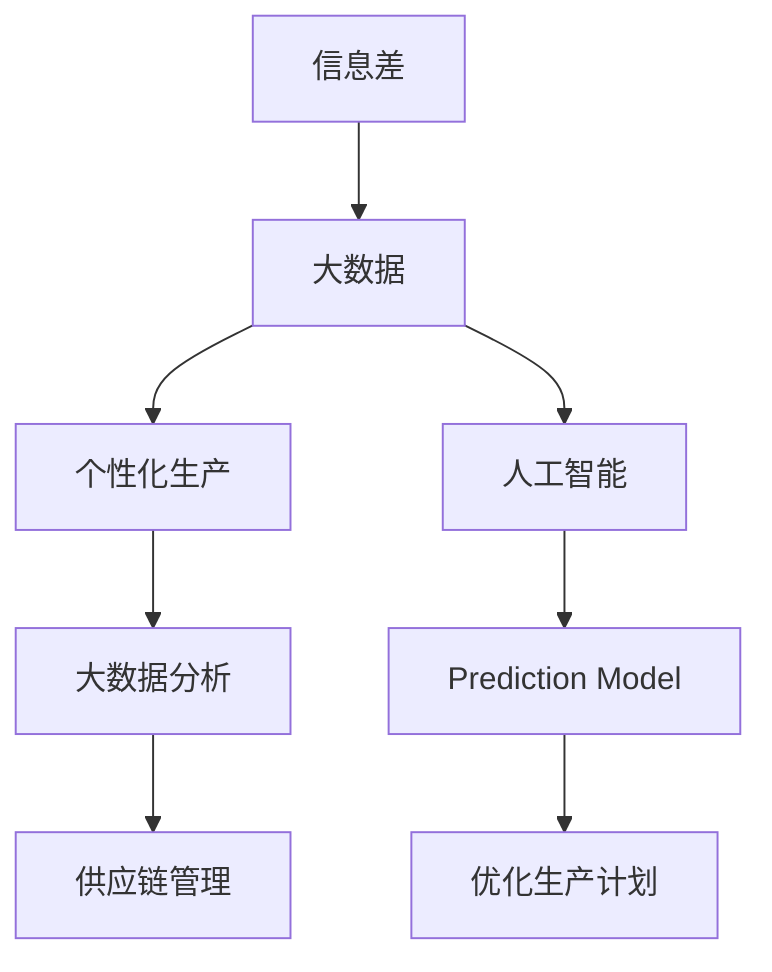

                 

# 信息差的商业生产个性化：大数据如何推动生产个性化

## 1. 背景介绍

### 1.1 问题由来

在当今数字化时代，信息差（Information Gap）已经成为企业竞争的核心壁垒之一。传统的生产方式往往以标准化、大批量、低成本为核心目标，但在高度个性化的消费市场环境下，这种生产方式已经难以满足消费者多样化、差异化的需求。大数据和人工智能技术的发展，为生产个性化带来了新的机遇，通过精准分析和预测，企业能够更有效地生产适销对路的商品，提升用户体验和市场竞争力。

### 1.2 问题核心关键点

信息差的商业生产个性化，本质上是一个将大数据转化为生产决策的过程。通过数据挖掘、分析、预测等技术手段，企业可以更好地了解市场需求，识别潜在客户，优化生产流程，从而实现生产活动的精准化和个性化。

核心问题包括：

- 如何高效利用海量数据，提取有价值的市场信息？
- 如何在保持生产效率的同时，实现个性化的生产决策？
- 如何通过大数据分析和预测，优化供应链管理？
- 如何构建以消费者为中心的生产系统，提升用户体验？

### 1.3 问题研究意义

研究信息差的商业生产个性化问题，对于提升企业的市场竞争力、推动传统制造业转型升级、实现智能制造具有重要意义：

1. **提升市场响应速度**：通过大数据分析，企业能够快速响应市场需求，及时调整生产计划，减少库存积压。
2. **优化供应链管理**：精准的数据分析可以优化供应链流程，减少物流成本，提高供应链效率。
3. **增强消费者满意度**：个性化生产能够满足消费者多样化需求，提升产品品质和用户体验。
4. **实现智能制造**：大数据和人工智能技术的应用，使得企业能够逐步实现智能制造，推动制造业的数字化、智能化转型。
5. **促进产业升级**：推动生产个性化，提升企业创新能力，加速传统制造业向高端制造业转型。

## 2. 核心概念与联系

### 2.1 核心概念概述

为更好地理解信息差的商业生产个性化的核心概念，本节将介绍几个密切相关的核心概念：

- 信息差（Information Gap）：指消费者需求与企业供应之间的差异，反映在产品特性、功能、风格等方面。
- 大数据（Big Data）：指海量、高速、多样化的数据集合，包含结构化、半结构化、非结构化等多种类型的数据。
- 个性化生产（Personalized Production）：指根据消费者个性化需求，进行定制化生产的过程。
- 人工智能（Artificial Intelligence）：指利用机器学习和深度学习等技术，模拟人类智能行为，实现自主决策和推理。
- 大数据分析（Big Data Analysis）：指通过统计、分析、挖掘等手段，从大数据中提取有价值的信息，支持决策过程。
- 预测模型（Prediction Model）：指基于历史数据和算法模型，预测未来趋势的数学模型。
- 供应链管理（Supply Chain Management）：指从原材料采购、生产制造到物流配送的全链条管理，目标是实现效率和成本的最优化。

这些核心概念之间的逻辑关系可以通过以下Mermaid流程图来展示：



这个流程图展示了大数据、人工智能、个性化生产、信息差和供应链管理之间的联系：

1. 信息差驱动企业收集、分析和利用大数据。
2. 大数据和人工智能技术为个性化生产提供技术支撑。
3. 大数据分析支持预测模型，优化供应链管理。
4. 预测模型和供应链管理共同优化生产计划，提升效率。

## 3. 核心算法原理 & 具体操作步骤
### 3.1 算法原理概述

信息差的商业生产个性化，核心在于利用大数据分析技术，从海量数据中提取有用信息，支持个性化生产决策。具体流程如下：

1. **数据收集**：从各个渠道收集消费者行为数据、产品销售数据、市场反馈数据等。
2. **数据清洗与预处理**：对收集到的数据进行清洗、去重、处理缺失值等预处理工作，确保数据质量。
3. **特征提取**：从清洗后的数据中提取有意义的特征，用于构建模型。
4. **模型构建与训练**：选择适当的算法模型，如回归模型、分类模型、聚类模型等，对数据进行训练，形成预测模型。
5. **模型应用**：将训练好的模型应用于实际生产决策，如调整生产计划、优化供应链管理、个性化生产等。
6. **效果评估**：对模型应用效果进行评估，不断优化模型，提升预测精度和生产效率。

### 3.2 算法步骤详解

基于上述算法流程，我们具体阐述每个步骤的详细操作：

**Step 1: 数据收集**

在信息差的商业生产个性化中，数据收集是基础。企业应通过以下渠道收集数据：

- **销售数据**：包括产品销售量、销售额、销售渠道、销售区域等信息。
- **消费者行为数据**：包括购买历史、浏览记录、评价反馈、社交媒体互动等。
- **市场反馈数据**：包括行业报告、竞争对手动态、市场趋势等信息。
- **生产数据**：包括生产成本、生产效率、生产周期等信息。

**Step 2: 数据清洗与预处理**

数据清洗与预处理是数据质量保障的关键环节。具体包括：

- **数据去重**：去除重复记录，保证数据的一致性。
- **缺失值处理**：采用均值、中位数、插值等方法填补缺失值。
- **数据格式转换**：将数据转换为适合算法处理的标准格式。
- **异常值检测与处理**：识别并处理异常数据点，避免其对模型训练的影响。

**Step 3: 特征提取**

特征提取是构建预测模型的关键步骤。通过提取有用的特征，可以更好地捕捉数据中的信息。具体方法包括：

- **降维技术**：如主成分分析（PCA）、因子分析等，减少特征维度，提高模型训练效率。
- **特征选择**：选择与目标变量相关性高的特征，降低模型复杂度。
- **特征工程**：通过数据变换、编码等方式，生成新的特征。

**Step 4: 模型构建与训练**

模型构建与训练是实现个性化生产的核心环节。具体步骤包括：

- **选择算法模型**：根据任务类型选择适当的算法模型，如回归模型、分类模型、聚类模型等。
- **模型训练**：使用训练集数据对模型进行训练，优化模型参数。
- **模型评估**：使用测试集数据评估模型性能，选择最优模型。

**Step 5: 模型应用**

模型应用是将模型结果转化为实际生产决策的关键步骤。具体方法包括：

- **优化生产计划**：根据模型预测结果，调整生产计划，提升生产效率。
- **个性化生产**：根据消费者需求，进行定制化生产，满足个性化需求。
- **供应链优化**：利用模型预测结果，优化供应链管理，提升物流效率。

**Step 6: 效果评估**

效果评估是持续改进模型的重要环节。具体方法包括：

- **预测精度评估**：使用各种指标评估模型预测精度。
- **生产效率评估**：通过生产成本、生产周期等指标评估模型应用效果。
- **用户体验评估**：通过消费者满意度、退货率等指标评估个性化生产效果。

### 3.3 算法优缺点

信息差的商业生产个性化方法具有以下优点：

- **高效性**：通过大数据分析，可以快速响应市场需求，优化生产计划。
- **灵活性**：个性化生产能够满足消费者多样化需求，提升产品竞争力。
- **精确性**：基于大数据和人工智能技术，预测模型可以提供较为准确的预测结果。
- **可扩展性**：方法适用于各种规模的企业，能够实现从中小企业到大规模制造业的普适性应用。

同时，该方法也存在以下局限性：

- **数据质量要求高**：数据收集和清洗工作复杂，需要投入大量人力和资源。
- **模型训练复杂**：需要选择合适的算法模型，进行大量的实验和调参。
- **资源需求大**：大数据分析和预测需要高性能计算资源，成本较高。
- **模型解释性不足**：部分算法模型（如深度学习模型）缺乏可解释性，难以理解模型内部工作机制。

尽管存在这些局限性，但就目前而言，信息差的商业生产个性化方法仍然是推动生产个性化的重要手段。未来相关研究的重点在于如何进一步提高模型效率和可解释性，降低数据需求，扩大应用范围。

### 3.4 算法应用领域

信息差的商业生产个性化方法在多个领域得到了广泛应用，以下是几个典型场景：

1. **快速响应市场变化**：通过大数据分析，实时监测市场需求变化，快速调整生产计划，减少库存积压。
2. **个性化定制生产**：根据消费者需求，进行定制化生产，提升产品品质和用户体验。
3. **优化供应链管理**：利用预测模型优化供应链流程，降低物流成本，提高供应链效率。
4. **产品设计与创新**：通过大数据分析消费者反馈，指导产品设计，推动产品创新。
5. **市场营销策略优化**：分析消费者行为数据，制定个性化营销策略，提高营销效果。
6. **智能制造**：推动传统制造业向智能制造转型，实现生产过程的数字化、智能化。

## 4. 数学模型和公式 & 详细讲解  
### 4.1 数学模型构建

在信息差的商业生产个性化过程中，常用的数学模型包括回归模型、分类模型、聚类模型等。这里以回归模型为例，构建信息差的商业生产个性化的数学模型。

假设企业生产某种产品的销售量 $y$ 与市场参数 $x$ 之间的关系为线性回归模型：

$$
y = \beta_0 + \beta_1 x_1 + \beta_2 x_2 + ... + \beta_n x_n + \epsilon
$$

其中，$\beta_0, \beta_1, \beta_2, ..., \beta_n$ 为回归系数，$\epsilon$ 为误差项。

### 4.2 公式推导过程

以下是线性回归模型的公式推导过程：

1. **模型假设**：假设 $y$ 与 $x$ 之间存在线性关系，且误差项 $\epsilon$ 服从独立同分布的正态分布，即 $\epsilon \sim N(0, \sigma^2)$。
2. **样本数据**：从数据集中随机抽取 $n$ 个样本点 $(x_i, y_i)$，其中 $i=1,2,...,n$。
3. **最小二乘估计**：通过最小化误差平方和 $\sum_{i=1}^n (y_i - \hat{y_i})^2$，求得回归系数 $\beta_0, \beta_1, \beta_2, ..., \beta_n$ 的最小二乘估计。
4. **预测模型**：通过回归模型 $y = \beta_0 + \beta_1 x_1 + \beta_2 x_2 + ... + \beta_n x_n + \epsilon$ 预测未来销售量 $y$。

### 4.3 案例分析与讲解

假设某企业生产某类产品，需要根据市场参数（如天气、节日、促销活动等）预测未来一个月的销售量。

**数据收集**：
- 收集过去一个月的天气数据、促销活动数据、产品销售数据等。
- 使用传感器和日志记录设备，实时收集未来一个月的市场参数。

**数据预处理**：
- 将收集到的数据进行清洗和去重，确保数据的一致性。
- 使用插值法填补缺失值，处理异常数据点。
- 将数据转换为标准格式，便于模型处理。

**特征提取**：
- 提取天气、促销活动、销售量等特征，作为模型的输入。
- 使用主成分分析（PCA）降低特征维度，提高模型训练效率。

**模型训练**：
- 选择线性回归模型作为预测模型。
- 使用最小二乘估计法，对模型进行训练，求得回归系数 $\beta_0, \beta_1, \beta_2, ..., \beta_n$。
- 使用训练集数据评估模型性能，选择最优模型。

**模型应用**：
- 利用训练好的线性回归模型，预测未来一个月的销售量。
- 根据预测结果，调整生产计划，优化库存管理。

**效果评估**：
- 使用均方误差（MSE）评估模型预测精度。
- 通过生产成本、生产周期等指标评估模型应用效果。
- 通过消费者满意度、退货率等指标评估个性化生产效果。

## 5. 项目实践：代码实例和详细解释说明
### 5.1 开发环境搭建

在进行信息差的商业生产个性化项目实践前，我们需要准备好开发环境。以下是使用Python进行PyTorch开发的环境配置流程：

1. 安装Anaconda：从官网下载并安装Anaconda，用于创建独立的Python环境。

2. 创建并激活虚拟环境：
```bash
conda create -n pytorch-env python=3.8 
conda activate pytorch-env
```

3. 安装PyTorch：根据CUDA版本，从官网获取对应的安装命令。例如：
```bash
conda install pytorch torchvision torchaudio cudatoolkit=11.1 -c pytorch -c conda-forge
```

4. 安装TensorFlow：
```bash
conda install tensorflow tensorflow-gpu
```

5. 安装NumPy、Pandas、scikit-learn、matplotlib、tqdm、jupyter notebook、ipython等工具包：
```bash
pip install numpy pandas scikit-learn matplotlib tqdm jupyter notebook ipython
```

完成上述步骤后，即可在`pytorch-env`环境中开始项目实践。

### 5.2 源代码详细实现

这里我们以线性回归模型为例，给出使用Python和PyTorch实现信息差的商业生产个性化的代码实现。

首先，导入必要的库和数据：

```python
import numpy as np
import pandas as pd
import torch
import torch.nn as nn
import torch.optim as optim
from sklearn.model_selection import train_test_split
from sklearn.preprocessing import StandardScaler
from sklearn.metrics import mean_squared_error

# 加载数据集
data = pd.read_csv('sales_data.csv')
X = data[['weather', 'promotion', 'sales_volume']]
y = data['sales_volume']

# 分割数据集
X_train, X_test, y_train, y_test = train_test_split(X, y, test_size=0.2, random_state=42)
```

然后，构建线性回归模型并训练：

```python
class LinearRegression(nn.Module):
    def __init__(self, n_features):
        super(LinearRegression, self).__init__()
        self.linear = nn.Linear(n_features, 1)
    
    def forward(self, x):
        return self.linear(x)

# 标准化数据
scaler = StandardScaler()
X_train_scaled = scaler.fit_transform(X_train)
X_test_scaled = scaler.transform(X_test)

# 创建模型
model = LinearRegression(X_train.shape[1])

# 定义损失函数和优化器
criterion = nn.MSELoss()
optimizer = optim.SGD(model.parameters(), lr=0.01)

# 训练模型
for epoch in range(1000):
    optimizer.zero_grad()
    y_pred = model(X_train_scaled)
    loss = criterion(y_pred, y_train)
    loss.backward()
    optimizer.step()
    
    if (epoch+1) % 100 == 0:
        print(f'Epoch {epoch+1}, Loss: {loss.item():.4f}')

# 评估模型
y_pred = model(X_test_scaled).detach().numpy()
print(f'Mean Squared Error: {mean_squared_error(y_test, y_pred):.4f}')
```

最后，进行效果评估：

```python
# 可视化结果
import matplotlib.pyplot as plt
plt.plot(y_test, label='Actual Sales')
plt.plot(y_pred, label='Predicted Sales')
plt.legend()
plt.show()
```

以上就是使用PyTorch实现信息差的商业生产个性化的完整代码实现。可以看到，代码实现了数据的加载、预处理、模型训练和效果评估等关键步骤。

### 5.3 代码解读与分析

让我们再详细解读一下关键代码的实现细节：

**数据加载**：
- 使用Pandas库加载CSV格式的数据集，方便数据处理和分析。

**数据预处理**：
- 将数据集中的特征提取出来，使用train_test_split方法分割为训练集和测试集。
- 使用StandardScaler对数据进行标准化处理，提高模型训练效率。

**模型构建**：
- 定义一个简单的线性回归模型，使用nn.Linear定义线性变换层。
- 在训练过程中，使用SGD优化器进行参数更新，最小化损失函数。

**模型训练**：
- 通过循环迭代，在每个epoch内使用训练集数据更新模型参数，最小化损失函数。
- 每100个epoch输出一次损失函数，观察训练效果。

**模型评估**：
- 使用均方误差（MSE）评估模型预测效果。
- 可视化预测结果和实际结果，观察模型应用效果。

以上代码实现了信息差的商业生产个性化的基本流程，帮助开发者快速上手实践。

## 6. 实际应用场景
### 6.1 智能制造

信息差的商业生产个性化在智能制造领域得到了广泛应用。传统制造业往往以标准化、批量化生产为主，难以满足个性化、定制化需求。通过大数据分析，智能制造企业可以更灵活地响应市场需求，实现按需生产，提升生产效率和产品质量。

**应用案例**：某汽车制造企业通过大数据分析，实时监测市场需求变化，动态调整生产计划，实现了个性化定制化生产。例如，根据市场反馈数据，企业可以快速调整生产线上不同车型的比例，满足不同地区消费者的需求。

### 6.2 个性化电子商务

信息差的商业生产个性化在电子商务领域也有重要应用。电子商务平台通过大数据分析，可以更精准地预测用户需求，实现个性化推荐，提升用户体验和转化率。

**应用案例**：某电商平台通过分析用户浏览、点击、购买等行为数据，构建个性化推荐模型，实现了个性化商品推荐。例如，根据用户的浏览记录和购买历史，平台推荐用户可能感兴趣的商品，提高用户购买率和满意度。

### 6.3 智能客服

信息差的商业生产个性化在智能客服领域也有应用前景。智能客服系统通过大数据分析，可以更准确地识别用户意图，实现快速响应和精准解答，提升用户体验和客户满意度。

**应用案例**：某电信运营商通过大数据分析，构建智能客服系统，实现了7x24小时不间断服务。例如，系统可以根据用户的问题，实时推荐可能相关的问题解答，减少用户等待时间，提高服务效率。

### 6.4 未来应用展望

随着大数据和人工智能技术的进一步发展，信息差的商业生产个性化将有更广阔的应用前景。

**工业4.0**：推动传统制造业向智能化、数字化转型，实现智能制造，提高生产效率和产品质量。

**智慧城市**：构建以消费者为中心的城市服务系统，实现智能交通、智能环保、智能安防等功能，提升城市治理水平。

**智慧零售**：通过大数据分析，实现个性化推荐、智能库存管理、智能营销等，提升零售效率和用户体验。

**智慧医疗**：利用大数据分析，实现个性化诊疗、智能医疗辅助、疾病预测等，提升医疗服务质量。

**智慧金融**：通过大数据分析，实现个性化理财、智能风控、智能投顾等，提升金融服务水平。

**智慧农业**：利用大数据分析，实现智能农情监测、精准农业、农业物联网等，提升农业生产效率。

## 7. 工具和资源推荐
### 7.1 学习资源推荐

为了帮助开发者系统掌握信息差的商业生产个性化的理论基础和实践技巧，这里推荐一些优质的学习资源：

1. **《机器学习实战》**：李航著，全面介绍了机器学习的基本概念和常用算法，适合入门学习。
2. **《Python机器学习》**：Sebastian Raschka著，详细介绍了Python在机器学习中的应用，包括数据处理、模型训练、模型评估等。
3. **《深度学习》**：Ian Goodfellow、Yoshua Bengio、Aaron Courville著，深入介绍了深度学习的原理和应用，适合进阶学习。
4. **Coursera《Machine Learning》课程**：由斯坦福大学Andrew Ng教授讲授，系统介绍了机器学习的基本概念和常用算法。
5. **edX《Introduction to Artificial Intelligence》课程**：由MIT教授讲授，全面介绍了人工智能的基本概念和应用。

通过对这些资源的学习实践，相信你一定能够快速掌握信息差的商业生产个性化的精髓，并用于解决实际的商业问题。

### 7.2 开发工具推荐

高效的开发离不开优秀的工具支持。以下是几款用于信息差的商业生产个性化开发的常用工具：

1. **PyTorch**：基于Python的开源深度学习框架，灵活动态的计算图，适合快速迭代研究。大部分机器学习模型都有PyTorch版本的实现。
2. **TensorFlow**：由Google主导开发的开源深度学习框架，生产部署方便，适合大规模工程应用。同样有丰富的机器学习模型资源。
3. **Pandas**：用于数据处理和分析的Python库，支持大规模数据集的快速处理和分析。
4. **NumPy**：用于数值计算和科学计算的Python库，提供了高效的多维数组和矩阵运算功能。
5. **Scikit-learn**：用于机器学习和数据挖掘的Python库，提供了各种常用的机器学习算法和工具。
6. **Jupyter Notebook**：用于数据科学和机器学习的交互式开发环境，支持多种编程语言和库的集成使用。
7. **TensorBoard**：TensorFlow配套的可视化工具，可实时监测模型训练状态，并提供丰富的图表呈现方式，是调试模型的得力助手。

合理利用这些工具，可以显著提升信息差的商业生产个性化的开发效率，加快创新迭代的步伐。

### 7.3 相关论文推荐

信息差的商业生产个性化的研究源于学界的持续研究。以下是几篇奠基性的相关论文，推荐阅读：

1. **《基于机器学习的智能制造系统》**：研究了机器学习在智能制造中的应用，包括预测模型、优化算法等。
2. **《基于数据驱动的个性化推荐系统》**：研究了基于大数据的个性化推荐算法，包括协同过滤、内容推荐等。
3. **《基于深度学习的智能客服系统》**：研究了深度学习在智能客服中的应用，包括语音识别、自然语言处理等。
4. **《机器学习在智慧城市中的应用》**：研究了机器学习在智慧城市中的应用，包括智能交通、智能环保等。
5. **《大数据在智慧零售中的应用》**：研究了大数据在智慧零售中的应用，包括个性化推荐、智能库存管理等。
6. **《机器学习在智慧医疗中的应用》**：研究了机器学习在智慧医疗中的应用，包括疾病预测、智能诊断等。
7. **《深度学习在智慧金融中的应用》**：研究了深度学习在智慧金融中的应用，包括智能投顾、智能风控等。

这些论文代表了大数据和人工智能在信息差商业生产个性化领域的发展脉络。通过学习这些前沿成果，可以帮助研究者把握学科前进方向，激发更多的创新灵感。

## 8. 总结：未来发展趋势与挑战

### 8.1 总结

本文对信息差的商业生产个性化进行了全面系统的介绍。首先阐述了信息差的商业生产个性化的研究背景和意义，明确了大数据、人工智能、个性化生产等核心概念之间的关系。其次，从原理到实践，详细讲解了信息差的商业生产个性化的数学模型和核心算法，给出了代码实例和详细解释。同时，本文还广泛探讨了信息差的商业生产个性化在智能制造、电子商务、智能客服等多个行业领域的应用前景，展示了其广泛的应用价值。此外，本文精选了信息差的商业生产个性化的各类学习资源，力求为读者提供全方位的技术指引。

通过本文的系统梳理，可以看到，信息差的商业生产个性化是大数据和人工智能技术的重要应用方向，其广泛应用于各个行业，推动了制造业、零售业、服务业等多个领域的数字化转型和智能化升级。未来，随着大数据和人工智能技术的进一步发展，信息差的商业生产个性化将有更广阔的应用前景，为各行各业带来更多的创新和变革。

### 8.2 未来发展趋势

展望未来，信息差的商业生产个性化将呈现以下几个发展趋势：

1. **数据融合与多源数据利用**：随着互联网、物联网等技术的发展，数据的来源和形式更加多样，企业需要利用多源数据进行综合分析，提升预测准确性和决策效率。
2. **实时数据处理与流式计算**：实时数据处理和流式计算技术的发展，使得信息差的商业生产个性化可以更实时地响应市场需求，提升动态调整能力。
3. **深度学习与强化学习结合**：深度学习与强化学习的结合，可以更好地模拟人类智能行为，提升个性化生产的效果和效率。
4. **模型可解释性与公平性**：模型可解释性和公平性是信息差的商业生产个性化需要解决的重要问题，未来的研究将更多关注模型的透明性和公平性。
5. **模型与外部知识库结合**：将知识图谱、规则库等外部知识与机器学习模型结合，提升模型的知识整合能力和决策水平。
6. **跨领域应用与协同创新**：信息差的商业生产个性化可以跨领域应用，促进不同行业间的协同创新，推动产业数字化升级。

### 8.3 面临的挑战

尽管信息差的商业生产个性化已经取得了一定的进展，但在实现大规模应用的过程中，仍面临诸多挑战：

1. **数据质量与数据隐私**：数据质量差、数据隐私问题仍是制约信息差的商业生产个性化的重要瓶颈。企业需要投入大量资源进行数据清洗和隐私保护。
2. **计算资源需求高**：大数据分析和深度学习模型的训练需要高性能计算资源，成本较高。企业需要投入大量计算资源进行模型训练和优化。
3. **模型可解释性不足**：部分深度学习模型缺乏可解释性，难以理解其内部工作机制。未来需要更多研究提升模型的可解释性。
4. **模型公平性与偏见**：模型可能存在偏见，导致不公平的决策结果。未来需要更多研究提升模型的公平性和公正性。
5. **跨行业应用难题**：跨行业应用需要考虑不同行业之间的差异性，构建通用的模型和算法，难度较大。

### 8.4 研究展望

面对信息差的商业生产个性化面临的种种挑战，未来的研究需要在以下几个方面寻求新的突破：

1. **数据融合与多源数据利用**：利用大数据和人工智能技术，实现多源数据的融合与利用，提升数据处理效率和预测准确性。
2. **实时数据处理与流式计算**：研究实时数据处理和流式计算技术，实现信息差的商业生产个性化的实时化、动态化应用。
3. **深度学习与强化学习结合**：探索深度学习与强化学习的结合，提升个性化生产的灵活性和效率。
4. **模型可解释性与公平性**：研究模型可解释性和公平性问题，提升模型的透明性和公正性。
5. **跨行业应用与协同创新**：推动跨行业应用与协同创新，构建通用的信息差的商业生产个性化模型和算法。
6. **模型与外部知识库结合**：研究模型与知识图谱、规则库等外部知识库的结合，提升模型的知识整合能力和决策水平。

这些研究方向的探索，必将引领信息差的商业生产个性化技术迈向更高的台阶，为各行各业带来更多的创新和变革。面向未来，信息差的商业生产个性化需要与其他人工智能技术进行更深入的融合，如知识表示、因果推理、强化学习等，多路径协同发力，共同推动智能生产的发展。只有勇于创新、敢于突破，才能不断拓展信息差的商业生产个性化的边界，让智能生产更好地服务于各行各业。

## 9. 附录：常见问题与解答

**Q1：信息差的商业生产个性化需要投入大量数据和计算资源，如何降低成本？**

A: 信息差的商业生产个性化需要投入大量数据和计算资源，但可以通过以下方法降低成本：
1. 利用云计算平台，如AWS、Azure、阿里云等，提供弹性计算资源，按需支付，降低成本。
2. 优化数据处理流程，采用数据压缩、数据分割等方法，提高数据处理效率。
3. 使用模型压缩技术，如知识蒸馏、剪枝等，减少模型参数量，降低计算资源需求。
4. 选择高效算法模型，如轻量级神经网络、高效优化器等，提高模型训练和推理效率。
5. 采用边缘计算，将数据处理和模型推理分布到本地设备，减少网络传输成本。

**Q2：信息差的商业生产个性化如何保证数据隐私和安全？**

A: 数据隐私和安全是信息差的商业生产个性化需要解决的重要问题。企业可以采取以下措施：
1. 采用数据匿名化技术，对数据进行脱敏处理，保护用户隐私。
2. 建立数据访问权限控制机制，限制数据访问和使用权限。
3. 使用数据加密技术，保护数据在传输和存储过程中的安全。
4. 定期进行数据安全审计，发现和修复潜在的安全漏洞。
5. 采用联邦学习等分布式学习方法，在保护数据隐私的同时，实现模型训练和优化。

**Q3：信息差的商业生产个性化如何提升模型可解释性？**

A: 模型可解释性是信息差的商业生产个性化需要解决的重要问题。企业可以采取以下措施：
1. 选择可解释性强的模型，如线性模型、决策树等，提高模型透明性。
2. 引入特征重要性分析技术，评估各个特征对模型的贡献度。
3. 使用模型解释工具，如图灵机、LIME等，生成模型的可解释性输出。
4. 构建解释性模型，如可解释性深度学习模型，提升模型的透明性和公正性。
5. 引入外部专家知识，结合专家解释，提升模型的解释力。

**Q4：信息差的商业生产个性化如何提高跨行业应用能力？**

A: 跨行业应用是信息差的商业生产个性化需要解决的重要问题。企业可以采取以下措施：
1. 建立通用的数据格式和接口标准，提高数据互操作性。
2. 构建通用的模型和算法，适应不同行业的应用场景。
3. 引入领域专家知识，提升模型在特定领域的适应性。
4. 采用模型迁移技术，将特定领域的数据和模型进行迁移，提升模型的跨行业应用能力。
5. 推动行业间协同创新，构建行业联盟，共享数据和知识。

通过这些方法，企业可以更好地应对信息差的商业生产个性化面临的挑战，推动信息差的商业生产个性化的广泛应用和发展。

---

作者：禅与计算机程序设计艺术 / Zen and the Art of Computer Programming

